# 1，图像的滤波处理

## 1，线性滤波器

经常用于剔除输入信号中不想要的频率或从多个频率中选择一个想要的频率.
滤波是将信号中的特定波段频率筛除的操作，是抑制和防止其他杂乱的信号的干扰。
滤波和模糊的区分
滤波分为低通滤波和高通滤波，而模糊是指高斯滤波中的低通滤波。

## 2，领域算子

领域算子是利用给定像素周围的像素值的决定此像素的最终输出值的一种算子，它除了用于局部色调调整以外，还用于图像滤波。

## 3，方框滤波（box Filter）

### 方框滤波函数（boxblur）

```c++
/*
void boxFilter(InputArray src,OutputArray dst,int ddepth,ksize,Point anchor=Point(-1,-1),boolnormalize=true, int borderType=BORDER_DEFAULT)
*/
```

#### 第一个参数，

inputarray 类型的src， 输入图像，该函数对通道是独立处理的，且可以处理任意通道数的图片。

#### 第二个参数，

Outputrray 类型的dst,即目标图像，需要和源图片有一样的尺寸和类型。

#### 第三个参数，

int 类型的ddepth,输出图像的深度，-1 代表使用原图深度，即src. depth()。

#### 第四个参数，

Size 类型的ksize,内核的大小。
一般用Size(w,h)来表示内核的大小，其中w为像素宽度，h为像素高度。Size (3,3)就表示3x3的核大小，Size (5,5)就表示5x5的核大小。

#### 第五个参数，

Point 类型的anchor， 表示被平滑的那个点（锚点）。注意它有默认值Point(-1,1)。 如果这个点坐标是负值的话，就表示取核的中心为锚点，所以默认值Poin(-1,1)表示这个锚点在核的中心。
第六个参数，bool 类型的normalize,默认值为true, 一个标识符，表示内核是否被其区域归一化了。
第七个参数，int 类型的borderType,用于推断图像外部像素的某种边界模
式。有默认值BORDER_DEFAULT,我们一般不去管它。

通过方框滤波函数我们对图像进行的滤波处理图片结果如下：


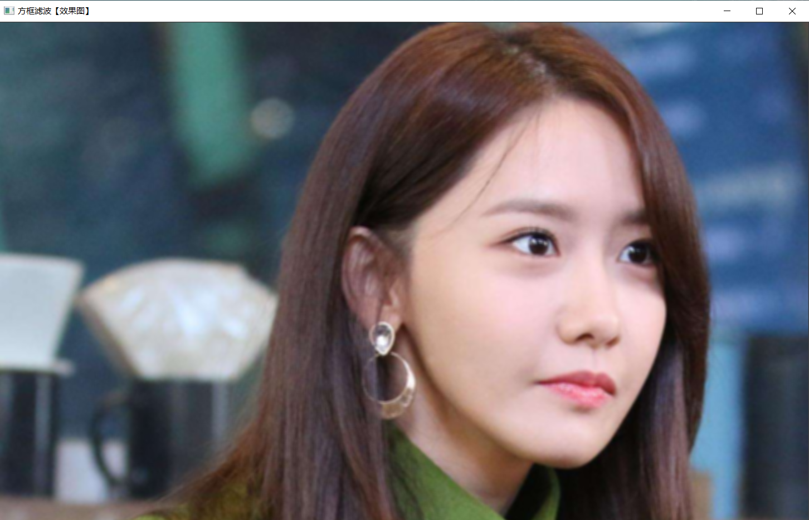


## 4, 均值滤波

均值滤波，是最简单的滤波操作，输出图像的每一个像素核窗口内输入图像对应像素的平均值。

### 均值滤波函数（blur）

#### 第二个参数

和方框滤波函数相比只有第二个参数有所区别OutputArray 类型的dst, 即目标图像，需要和源图片有一样的尺寸和类型。比如可以用Mat:Clone，以源图片为模板，来初始化得到
的尺寸和类型.比如可以用Mat：克隆人，以源图片为模板，来初始化得到如假包换的目标图。


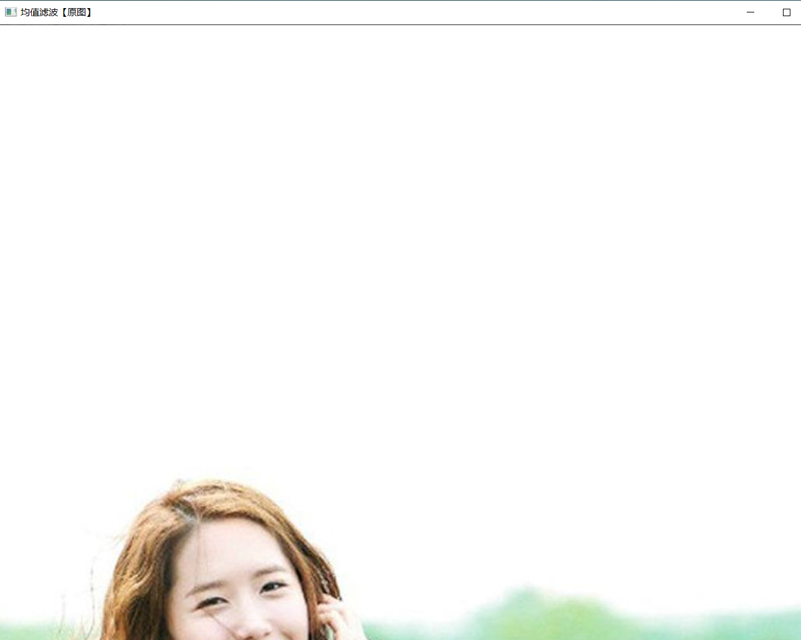

## 5， 高斯滤波

高斯滤波是对整幅图像的像素进行加权平均，其中每个像素点的值，都由其本身和领域内的其他像素值经过加权平均后得到。
高斯滤波器是一类根据高斯函数形状来选择权值的线性平滑滤波器，高斯滤波的具体操作是：用一个模板图像然后扫描图像中的每一个像素，用模板确定领域内像素的加权平均值灰度值去替代模板中心像素点的值。

###   高斯滤波函数（GaussianBlur）

GaussianBlur函数的作用是用高斯滤波器模糊图像，对输入的图像用src进行高斯滤波后用dst输出。

####  第二个参数

OutputArray 类型的dst, 即目标图像，需要和源图片有一样的尺寸和类型。比如可以用Mat::Clone， 以源图片为模板，来初始化得到如假包换的目标图。

与上面两个函数的不同之处在于

#### 第三个参数

Size 类型的ksize 高斯内核的大小。其中ksize.width 和ksize.height可以不同，但它们都必须为正数和奇数，或者是零,这都由sigma计算而来。

#### 第四个参数

double类型的sigmaX, 表示高斯核函数在X方向的的标准偏
差。

#### 第五个参数

double类型的sigmaY,表示高斯核函数在Y方向的的标准偏差。若sigmaY为零，就将它设为sigmaX;如果sigmaX和sigmaY都是0,那么就由ksize.width 和ksize.height计算出来。为了结果的正确性着想，最好是把第三个参数Size、第四个参数sigmaX和第五个参数sigmaY全部指定到。

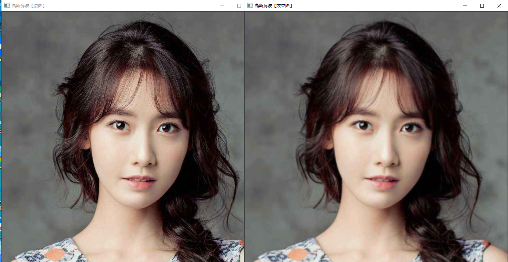


## 6， 图像线性滤波综合示例

```c++
/*
//  【on_BoxFilter( )函数】
//	描述：方框滤波操作的回调函数
static void on_BoxFilter(int, void *)
{
	//方框滤波操作
	boxFilter( g_srcImage, g_dstImage1, -1,Size( g_nBoxFilterValue+1, g_nBoxFilterValue+1));
	//显示窗口
	imshow("【<1>方框滤波】", g_dstImage1);
}


//【on_MeanBlur( )函数】
// 描述：均值滤波操作的回调函数
static void on_MeanBlur(int, void *)
{
	//均值滤波操作
	blur( g_srcImage, g_dstImage2, Size( g_nMeanBlurValue+1, g_nMeanBlurValue+1), Point(-1,-1));
	//显示窗口
	imshow("【<2>均值滤波】", g_dstImage2);
}


//【ContrastAndBright( )函数】
//描述：高斯滤波操作的回调函数
static void on_GaussianBlur(int, void *)
{
	//高斯滤波操作
	GaussianBlur( g_srcImage, g_dstImage3, Size( g_nGaussianBlurValue*2+1, g_nGaussianBlurValue*2+1 ), 0, 0);
	//显示窗口
	imshow("【<3>高斯滤波】", g_dstImage3);
}
*/

```


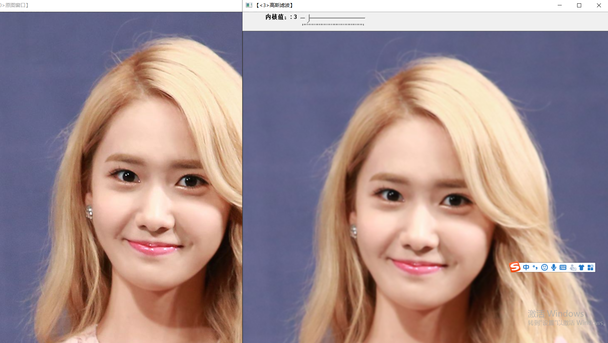

## 7， 中值滤波

中值滤波的基本思想是用像素点领域灰度值的中值来代替该像素点的灰度值，
相比于均值滤波器
优势：很好的滤除脉冲干扰及图像扫描噪声，不会影响到图片的输出，适用于消除噪声和保存边缘。
劣势：中值滤波花费的时间是很长的。

### 中值滤波函数（medianBlur）

```C++ 
/*
void medianBlur (InputArray src, OutputArray dst，int ksize)
*/
```

#### 第一个参数

InputArray类型的sre, 函数的输入参数，填1.3或者4通道的Mat类型的图像。当ksize为3或者5的时候，图像深度需为CV_ 8U、CV_ 16U、CV_ 32F其中之一，而对于较大孔径尺寸的图片，它只能是CV_ _8U。

#### 第二个参数

OutputArray 类型的dst， 即目标图像，函数的输入通道数，需要和源图片有一一样的尺寸和类型。我们可以用Mat::Clone， 以源图片为模
板，来初始化得到如假包换的目标图。

#### 第三个参数

int类型的ksize, 孔径的线性尺寸(aperture linear size), 注意这个参数必须是大于1的奇数，比如: 3、 5、7、.....


## 8，双边滤波

双边滤波是结合图像的空间邻近度和像素值相近似度的一种折中的处理办法，由于考虑了空间的信息和灰度相似性，可以除去图片边缘的噪声，从而可以一定程度上很好的保存图片边缘的原本效果。

### 双边滤波函数（bilateralFilter）

```C++
/*
void bilateralFilter (InputArray src, OutputArraydst, int d, double
sigmaColor, double sigmaSpace, int borderType=BORDER_ DEFAULT)
*/
```

与中值滤波相比的区别

#### 第三个参数

int类型的d,表示在过滤过程中每个像素邻域的直径。如果这个值被设为非正数，那么OpenCV会从第五个参数sigmaSpace来计算出它。

#### 第四个参数

double类型的sigmaColor, 颜色空间滤波器的sigma值。这个参数的值越大，就表明该像素邻域内有越宽广的颜色会被混合到一起，产生较大的半相等颜色区域。

#### 第五个参数

double类型的sigmaSpace, 坐标空间中滤波器的sigma值，坐标空间的标注方差。它的数值越大，意味着越远的像素会相互影响，从而使更大的区域中足够相似的颜色获取相同的颜色。当d>0时，d指定了邻域大小且与sigmaSpace无关。否则，d正比于sigmaSpace.


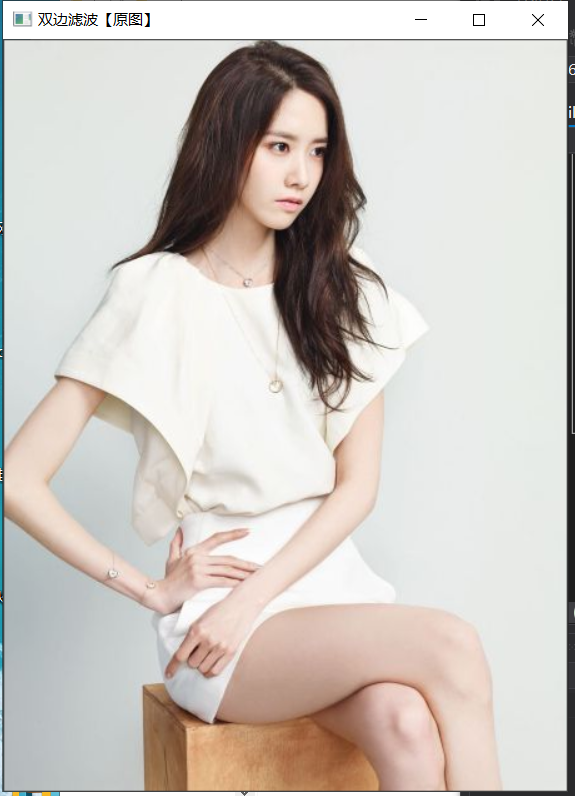


## 9， 图像滤波综合示例

```C++
/*
Mat g_srcImage,g_dstImage1,g_dstImage2,g_dstImage3,g_dstImage4,g_dstImage5;
int g_nBoxFilterValue=6;  //方框滤波内核值
int g_nMeanBlurValue=10;  //均值滤波内核值
int g_nGaussianBlurValue=6;  //高斯滤波内核值
int g_nMedianBlurValue=10;  //中值滤波参数值
int g_nBilateralFilterValue=10;  //双边滤波参数值

//轨迹条回调函数
static void on_BoxFilter(int, void *);		//方框滤波
static void on_MeanBlur(int, void *);		//均值块滤波器
static void on_GaussianBlur(int, void *);			//高斯滤波器
static void on_MedianBlur(int, void *);			//中值滤波器
static void on_BilateralFilter(int, void *);			//双边滤波器
void ShowHelpText();
int main(   )
{
	system("color 4F");  

	ShowHelpText();	

	// 载入原图
	g_srcImage = imread( "1.jpg", 1 );
	if( !g_srcImage.data ) { printf("读取srcImage错误~！ \n"); return false; }

	//克隆原图到四个Mat类型中
	g_dstImage1 = g_srcImage.clone( );
	g_dstImage2 = g_srcImage.clone( );
	g_dstImage3 = g_srcImage.clone( );
	g_dstImage4 = g_srcImage.clone( );
	g_dstImage5 = g_srcImage.clone( );

	//显示原图
	namedWindow("【<0>原图窗口】", 1);
	imshow("【<0>原图窗口】",g_srcImage);
	//【<1>方框滤波】
	//创建窗口
	namedWindow("【<1>方框滤波】", 1);
	//创建轨迹条
	createTrackbar("内核值：", "【<1>方框滤波】",&g_nBoxFilterValue, 50,on_BoxFilter );
	on_MeanBlur(g_nBoxFilterValue,0);
	imshow("【<1>方框滤波】", g_dstImage1);
	//
	//【<2>均值滤波】
	//创建窗口
	namedWindow("【<2>均值滤波】", 1);
	//创建轨迹条
	createTrackbar("内核值：", "【<2>均值滤波】",&g_nMeanBlurValue, 50,on_MeanBlur );
	on_MeanBlur(g_nMeanBlurValue,0);
	//【<3>高斯滤波】
	//创建窗口
	namedWindow("【<3>高斯滤波】", 1);
	//创建轨迹条
	createTrackbar("内核值：", "【<3>高斯滤波】",&g_nGaussianBlurValue, 50,on_GaussianBlur );
	on_GaussianBlur(g_nGaussianBlurValue,0);
	//【<4>中值滤波】
	//创建窗口
	namedWindow("【<4>中值滤波】", 1);
	//创建轨迹条
	createTrackbar("参数值：", "【<4>中值滤波】",&g_nMedianBlurValue, 50,on_MedianBlur );
	on_MedianBlur(g_nMedianBlurValue,0);
	//【<5>双边滤波】
	//创建窗口
	namedWindow("【<5>双边滤波】", 1);
	//创建轨迹条
	createTrackbar("参数值：", "【<5>双边滤波】",&g_nBilateralFilterValue, 50,on_BilateralFilter);
	on_BilateralFilter(g_nBilateralFilterValue,0);
	//输出一些帮助信息
	cout<<endl<<"\t运行成功，请调整滚动条观察图像效果~\n\n"
		<<"\t按下“q”键时，程序退出。\n";
	while(char(waitKey(1)) != 'q') {}

	return 0;
}

//【on_BoxFilter( )函数】
//描述：方框滤波操作的回调函数
static void on_BoxFilter(int, void *)
{
	//方框滤波操作
	boxFilter( g_srcImage, g_dstImage1, -1,Size( g_nBoxFilterValue+1, g_nBoxFilterValue+1));
	//显示窗口
	imshow("【<1>方框滤波】", g_dstImage1);
}
//【on_MeanBlur( )函数】
//描述：均值滤波操作的回调函数
static void on_MeanBlur(int, void *)
{
	blur( g_srcImage, g_dstImage2, Size( g_nMeanBlurValue+1, g_nMeanBlurValue+1), Point(-1,-1));
	imshow("【<2>均值滤波】", g_dstImage2);

}

//【on_GaussianBlur( )函数】
//描述：高斯滤波操作的回调函数
static void on_GaussianBlur(int, void *)
{
	GaussianBlur( g_srcImage, g_dstImage3, Size( g_nGaussianBlurValue*2+1, g_nGaussianBlurValue*2+1 ), 0, 0);
	imshow("【<3>高斯滤波】", g_dstImage3);
}


//【on_MedianBlur( )函数】
//描述：中值滤波操作的回调函数
static void on_MedianBlur(int, void *)
{
	medianBlur ( g_srcImage, g_dstImage4, g_nMedianBlurValue*2+1 );
	imshow("【<4>中值滤波】", g_dstImage4);
}
//【on_BilateralFilter( )函数】
//描述：双边滤波操作的回调函数
static void on_BilateralFilter(int, void *)
{
	bilateralFilter ( g_srcImage, g_dstImage5, g_nBilateralFilterValue, g_nBilateralFilterValue*2, g_nBilateralFilterValue/2 );
	imshow("【<5>双边滤波】", g_dstImage5);
}
*/
```


## 10， 图像腐蚀与膨胀综合示例

### 腐蚀与膨胀

膨胀与腐蚀是最基本的两种形态学操作，主要用于实现以下功能：
消除噪声；
分割出独立图像元素，在图像中连接相邻的元素；
寻找图像中的明显的极大值区域或极小值区域；
求出图像的梯度；
膨胀与腐蚀是相对图像中较亮部分而言的，即：膨胀是使图像中较亮区域变大，腐蚀是使图像中较暗区域变大。opencv中提供了两个函数用以膨胀和服饰操作。

### 腐蚀函数（erode）

```c++
/*
void erode(InputArray src,  OutputArray dst, InputArray kernel, Point anchor, int iterations, int borderType, const Scalar& borderValue);
*/
```

#### 参数详解：

src:原图像。
dst：目标图像。
element:腐蚀操作的内核。 如果不指定，默认为一个简单的 bubuko.com,布布扣 矩阵。否则，我们就要明确指定它的形状，可以使用函数getStructuringElement().
anchor:默认为Point(-1,-1),内核中心点。省略时为默认值。
iterations:腐蚀次数。省略时为默认值1。
borderType:推断边缘类型，borderInterpolate函数。默认为BORDER_DEFAULT，省略时为默认值。
borderValue:边缘值，createMorphoogyFilter函数。

### 膨胀函数（dilate）

#### 参数详解：

#### 第一个参数

InputArray类型的sre, 输入图像，即源图像，填Mat类的对象即可。图像通道的数量可以是任意的.

#### 第二个参数

Outputrray类型的dst, 即目标图像，需要和源图片有一 样的尺寸和类型。

#### 第三个参数

InputArray类型的kermel, 膨胀操作的核。当为NULL时,表示的是使用参考点位于中心3x3的核。
我们一般使用函数getStructuringElement 配合这个参数的使用。
getStructuringElement函数会返回指定形状和尺寸的结构元素(内核矩阵)。其中，getStructuringElement函数的第一个参数表示内核的形状，有如下三种形状可以选择。
矩形: MORPH_RECT;
交叉形: MORPH_CROSS;
椭圆形: MORPH_ELLIPSE;
而getStructuringElement 函数的第二和第三个参数分别是内核的尺寸以及锚点的位置。
一般在调用erode以及dilate 函数之前，先定义一一个Mat类型的变量来获得getStructuringElement函数的返回值。对于锚点的位置，有默认值Point(-1,1),表
示锚点位于中心。此外，需要注意，十字形的element 形状唯一依 赖于锚点的位
置，而在其他情况下，锚点只是影响了形态学运算结果的偏移。

### 第四个参数

Point 类型的anchor, 锚的位置，其有默认值(-1,-1),表示锚位于中心。

### 第五个参数

int 类型的iterations,迭代使用erode()函数的次数，默认值为

### 第六个参数

int类型的borderType, 用于推断图像外部像素的某种边界模式。注意它有默认值BORDER_ DEFAULT.

### 第七个参数

const Scalar&类型的borderValue， 当边界为常数时的边界值,有默认值morphologyDefaultBorderValue()，一般不用去管它。 需要用到它时，可以看官方文档中的createMorphologyFilter()函数，以得到更详细的解
释。


```c++
/*
//【Process( )函数】
//描述：进行自定义的腐蚀和膨胀操作
void Process() 
{
	//获取自定义核
	Mat element = getStructuringElement(MORPH_RECT, Size(2*g_nStructElementSize+1, 2*g_nStructElementSize+1),Point( g_nStructElementSize, g_nStructElementSize ));

	//进行腐蚀或膨胀操作
	if(g_nTrackbarNumer == 0) {    
		erode(g_srcImage, g_dstImage, element);
	}
	else {
		dilate(g_srcImage, g_dstImage, element);
	}

	//显示效果图
	imshow("【效果图】", g_dstImage);
}
//【on_TrackbarNumChange( )函数】
//描述：腐蚀和膨胀之间切换开关的回调函数
void on_TrackbarNumChange(int, void *) 
{
	//腐蚀和膨胀之间效果已经切换，回调函数体内需调用一次Process函数，使改变后的效果立即生效并显示出来
	Process();
}
//【on_ElementSizeChange( )函数】
//描述：腐蚀和膨胀操作内核改变时的回调函数
void on_ElementSizeChange(int, void *)
{
	//内核尺寸已改变，回调函数体内需调用一次Process函数，使改变后的效果立即生效并显示出来
	Process();
}
*/
```


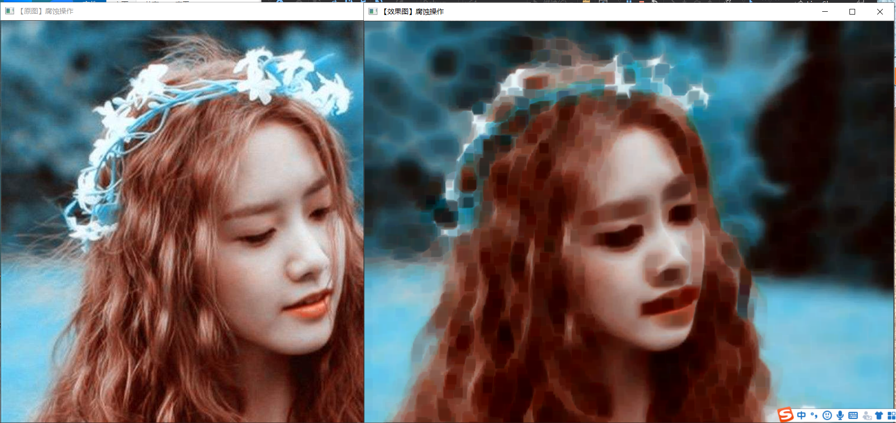
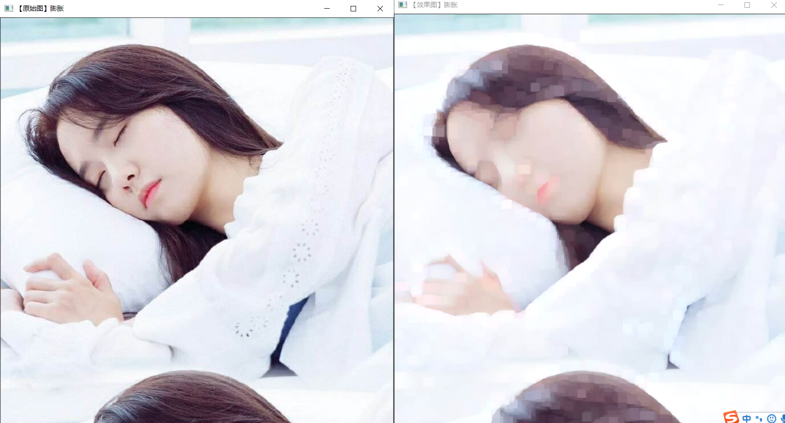
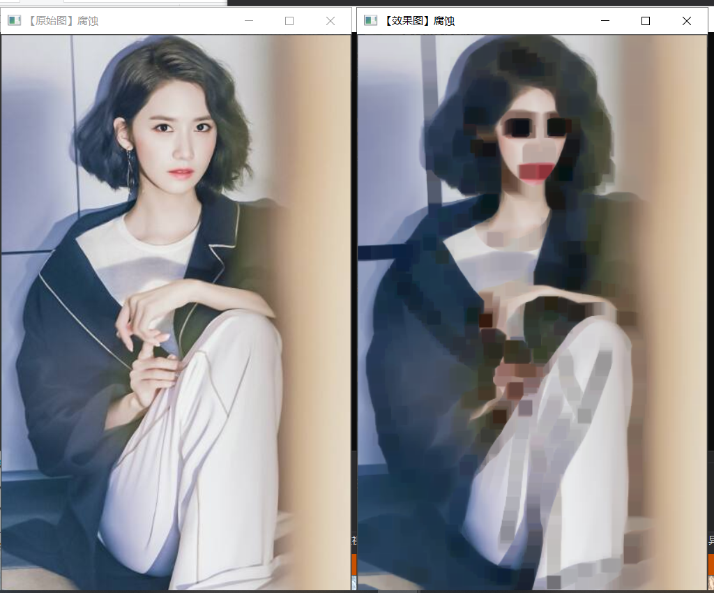

## 11， 形态学综合示例

### 开运算

开运算就是先腐蚀后膨胀的过程，开运算可以用来消除小物体，在纤细点处分离物体，并在平滑较大的物体的边界的同时不明显改变其面积

### 闭运算

闭运算就是先膨胀后腐蚀的过程，闭运算可以用来排除小型黑色区域

### 形态学梯度

形态学梯度是膨胀图与腐蚀图的差，通过形态学梯度可以对二值图像中的团块的边缘突出出来，从而保留物体的边缘轮廓

### 顶帽

顶帽运算是原图像和开运算结果图的差，由于开运算的结果放大了裂缝，局部低亮度的区域。

```c++
/*
//【on_OpenClose( )函数】
//描述：【开运算/闭运算】窗口的回调函数
static void on_OpenClose(int, void*)
{
	//偏移量的定义
	int offset = g_nOpenCloseNum - g_nMaxIterationNum;//偏移量
	int Absolute_offset = offset > 0 ? offset : -offset;//偏移量绝对值
	//自定义核
	Mat element = getStructuringElement(g_nElementShape, Size(Absolute_offset*2+1, Absolute_offset*2+1), Point(Absolute_offset, Absolute_offset) );
	//进行操作
	if( offset < 0 )
		//此句代码的OpenCV2版为：
		//morphologyEx(g_srcImage, g_dstImage, CV_MOP_OPEN, element);
		//此句代码的OpenCV3版为:
		morphologyEx(g_srcImage, g_dstImage, MORPH_OPEN, element);
	else
		//此句代码的OpenCV2版为：
		//morphologyEx(g_srcImage, g_dstImage, CV_MOP_CLOSE, element);
		//此句代码的OpenCV3版为:
		morphologyEx(g_srcImage, g_dstImage, MORPH_CLOSE, element);
		

	//显示图像
	imshow("【开运算/闭运算】",g_dstImage);
}
//【on_ErodeDilate( )函数】
//描述：【腐蚀/膨胀】窗口的回调函数
static void on_ErodeDilate(int, void*)
{
	//偏移量的定义
	int offset = g_nErodeDilateNum - g_nMaxIterationNum;	//偏移量
	int Absolute_offset = offset > 0 ? offset : -offset;//偏移量绝对值
	//自定义核
	Mat element = getStructuringElement(g_nElementShape, Size(Absolute_offset*2+1, Absolute_offset*2+1), Point(Absolute_offset, Absolute_offset) );
	//进行操作
	if( offset < 0 )
		erode(g_srcImage, g_dstImage, element);
	else
		dilate(g_srcImage, g_dstImage, element);
	//显示图像
	imshow("【腐蚀/膨胀】",g_dstImage);
}


//【on_TopBlackHat( )函数】
//描述：【顶帽运算/黑帽运算】窗口的回调函数
static void on_TopBlackHat(int, void*)
{
	//偏移量的定义
	int offset = g_nTopBlackHatNum - g_nMaxIterationNum;//偏移量
	int Absolute_offset = offset > 0 ? offset : -offset;//偏移量绝对值
	//自定义核
	Mat element = getStructuringElement(g_nElementShape, Size(Absolute_offset*2+1, Absolute_offset*2+1), Point(Absolute_offset, Absolute_offset) );
	//进行操作
	if( offset < 0 )
		morphologyEx(g_srcImage, g_dstImage, MORPH_TOPHAT , element);
	else
		morphologyEx(g_srcImage, g_dstImage, MORPH_BLACKHAT, element);
	//显示图像
	imshow("【顶帽/黑帽】",g_dstImage);
}
*/
```

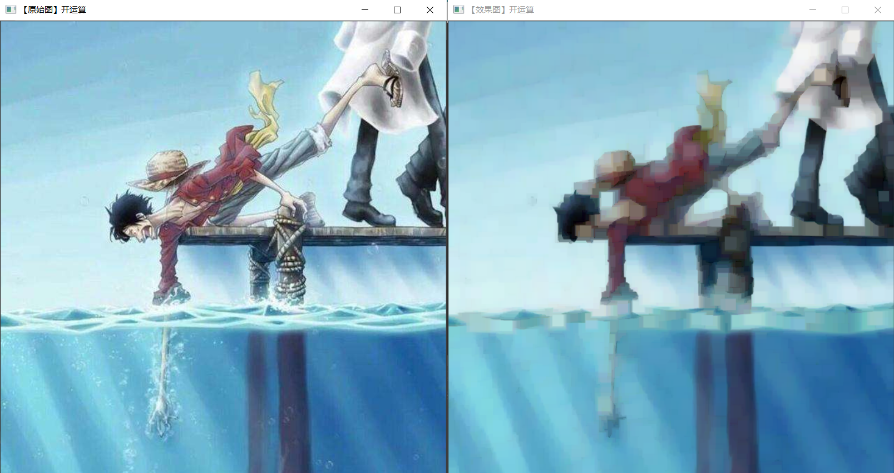

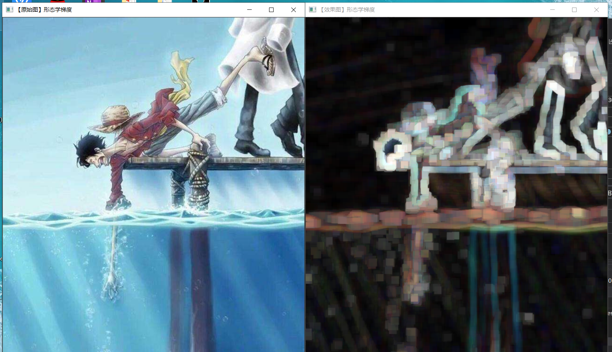
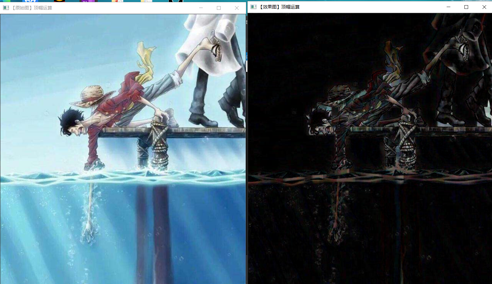

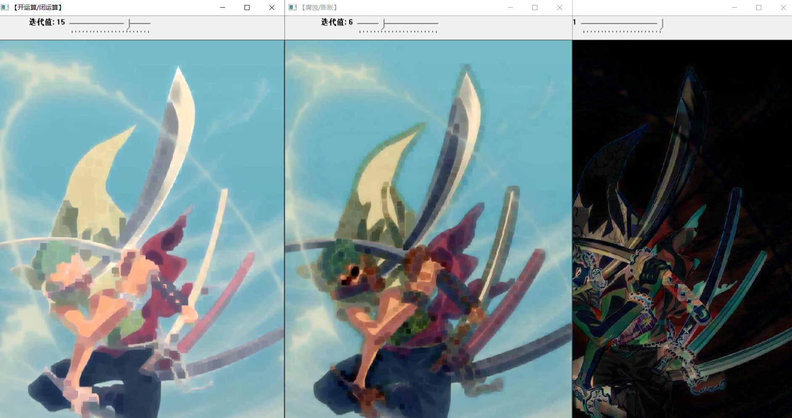
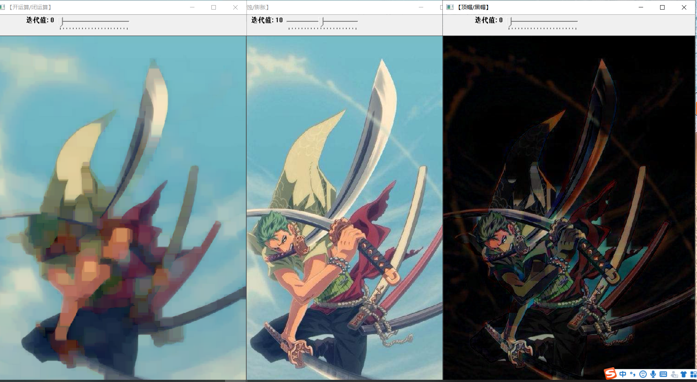


## 12， 漫水算法综合示例

漫水填充法是一种用特定的颜色填充连通区域，通过设置可连通像素的上下限以及连通方式来达到不同的填充效果的方法。
漫水填充就是自动选中了和种子点相连接的区域，接着将区域替换成指定的颜色，他经常被用来标记或者分离图像的一部分进行处理或分析。

主要相关代码如下：

```c++
/*
//【onMouse( )函数】 
// 描述：鼠标消息onMouse回调函数
static void onMouse(int event,int x,int y,int,void*)
{
//此句代码的OpenCV3版为：
if( event != EVENT_LBUTTONDOWN )
return;
//【<1>调用floodFill函数之前的参数准备部分】
Point seed = Point(x,y);
int LowDifference = g_nFillMode == 0 ? 0 : g_nLowDifference;//空范围的漫水填充，此值设为0，否则设为全局的g_nLowDifference
int UpDifference = g_nFillMode == 0 ? 0 : g_nUpDifference;//空范围的漫水填充，此值设为0，否则设为全局的g_nUpDifference

//标识符的0~7位为g_nConnectivity，8~15位为g_nNewMaskVal左移8位的值，16~23位为CV_FLOODFILL_FIXED_RANGE或者0。
//此句代码的OpenCV3版为：
int flags = g_nConnectivity + (g_nNewMaskVal << 8) +(g_nFillMode == 1 ? FLOODFILL_FIXED_RANGE : 0);

//随机生成bgr值
int b = (unsigned)theRNG() & 255;//随机返回一个0~255之间的值
int g = (unsigned)theRNG() & 255;//随机返回一个0~255之间的值
int r = (unsigned)theRNG() & 255;//随机返回一个0~255之间的值
Rect ccomp;//定义重绘区域的最小边界矩形区域

Scalar newVal = g_bIsColor ? Scalar(b, g, r) : Scalar(r*0.299 + g*0.587 + b*0.114);//在重绘区域像素的新值，若是彩色图模式，取Scalar(b, g, r)；若是灰度图模式，取Scalar(r*0.299 + g*0.587 + b*0.114)

Mat dst = g_bIsColor ? g_dstImage : g_grayImage;//目标图的赋值
int area;

//【<2>正式调用floodFill函数】
if( g_bUseMask )
{
//此句代码的OpenCV3版为：
threshold(g_maskImage, g_maskImage, 1, 128, THRESH_BINARY);
area = floodFill(dst, g_maskImage, seed, newVal, &ccomp, Scalar(LowDifference, LowDifference, LowDifference),
Scalar(UpDifference, UpDifference, UpDifference), flags);
imshow( "mask", g_maskImage );
}
else
{
area = floodFill(dst, seed, newVal, &ccomp, Scalar(LowDifference, LowDifference, LowDifference),
Scalar(UpDifference, UpDifference, UpDifference), flags);
}

imshow("效果图", dst);
cout << area << " 个像素被重绘\n";
}
*/
```


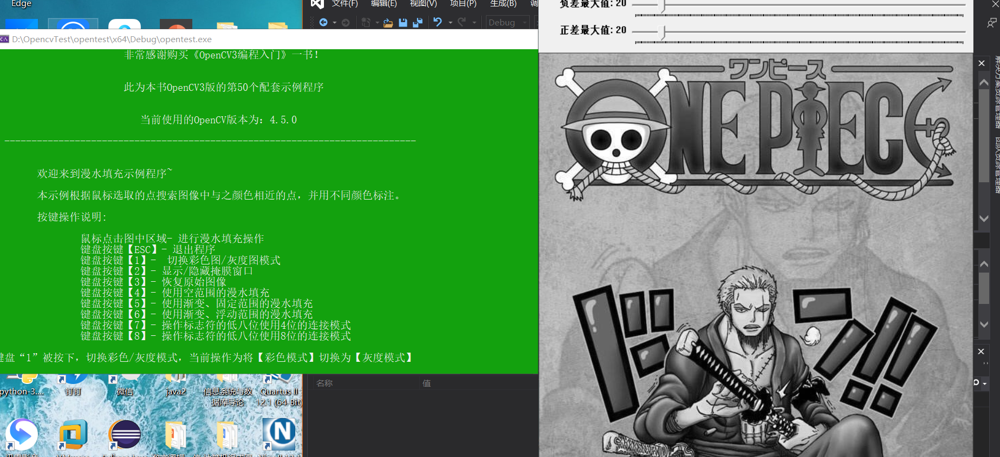


## 13， 图像金字塔和resize综合示例

对图像向上采样（pyrUp函数）
对图像向下采样（pyrDown函数）

### resize函数

resize()为OpenCV中专门用来调整图像大小的函数。
此函数将源图像精确地转换为指定尺寸的目标图像。如果源图像中设置了ROI (Region Of Interest，感兴趣区域)，那么resize(函数会对源图像的ROI区域进行调整图像尺寸的操作，来输出到目标图像中。若目标图像中已经设置了ROI区域，不难理解resize()将会对源图像进行尺寸调整并填充到目标图像的ROI中。很多时候，我们并不用考虑第二个参数dst的初始图像尺寸和类型(即直接
定义一个Mat类型，不用对其初始化)，因为其尺寸和类型可以由sre、dsize. fx和fy这几个参数来确定。

#### 第二个参数

OutputArray类型的dst,输出图像，当其非零时，有着dsize的尺寸，或者由src.size计算出来。

#### 第三个参数

Size 类型的dsize,输出图像的大小。如果它等于零，由下式进行计算:
dsize-Size(round(fx*src. cols), round(fy*src.rows))其中，dsize、 fx、fy 都不能为0。

#### 第四个参数

double 类型的fx，沿水平轴的缩放系数，有默认值0，且当其等于0时，由下式进行计算:
(double)dsize.width/src .cols

#### 第五个参数

double 类型的fy,沿垂直轴的缩放系数，有默认值0，且
当其等于0时，由下式进行计算:
(double)dsize .height/src.rows

#### 第六个参数

int类型的interpolation， 用于指定插值方式，默认为
INTER_LINEAR (线性插值)。
INTER_NEAREST 最近邻插值
INTER LINEAR 线性插值(默认值)
INTER_AREA区域插值(利用像素区域关系的重采样插值)
INTER_CUBIC-三次样条插值(超过4x4像素邻域内的双三次插值)
INTER_LANCZOS4 Lanczos插值(超过8x8像素邻域的Lanczos插值)

```C++
/*
void resize (InputArray src, outputArray dst, Size dsize, double fx=0,
double fy=0， int interpolation=INTER_ LINEAR )
*/
```


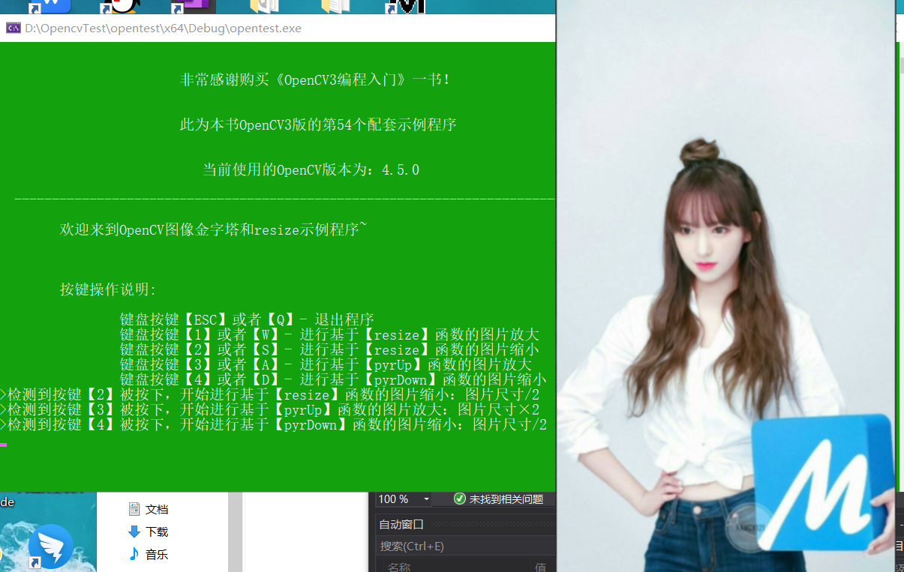

## 14， 阈值化

在对各种图形进行处理操作的过程中，我们常常需要对图像中的像素做出取舍与决策，直接剔除一些低 于或者高于一定值的像素。
阈值可以被视作最简单的图像分割方法。比如，从一副图像中利用阈值分割出我们需要的物体部分。这样的图像分
割方法基于图像中物体与背景之间的灰度差异，而且此分割属于像素级的分割。为了从一副图像中提取出我们需要的部分，应该用图像中的每一个像素点的灰度值与选取的阈值进行比较，并作出相应的判断。注意:阈值的选取依赖于具体的问题。即物体在不同的图像中有可能会有不同的灰度值。


## 15， 边缘检测综合示例

1，滤波
边缘检测的算法主要是基于图像强度的一阶和二阶导数，但是导数通常对噪声很敏感，因此需要滤波器来改善与噪音有关的边缘检测器的性能。
2，增强
增强边缘的基础是确定图像各点领域强度的变化值，增强算法可以将图像灰度领域强度值有明显变化的点凸显出来，通过计算梯度幅值来确定。
3，检测
经过增强的图像，往往领域中有很多的梯度值比较大，然而在特定的应用中，这并不是要找的边缘点，实际中我们是通过阈值化的方法来检测


## 16， 霍夫变换综合示例

霍夫变换是一种特征检测，被广泛应用在图像分析、计算机视觉以及数位影像处理。霍夫变换是用来辨别找出物件中的特征，例如：线条。他的算法流程大致如下，给定一个物件、要辨别的形状的种类，算法会在参数空间中执行投票来决定物体的形状，而这是由累加空间里的局部最大值来决定。


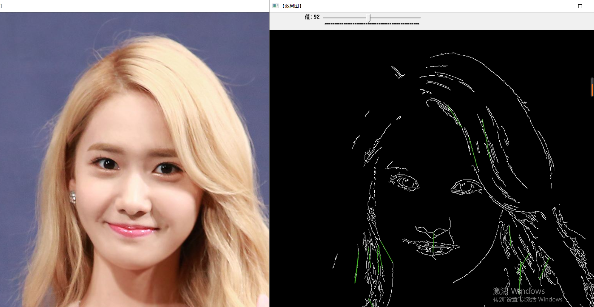

## 17， 实现多种重映射综合示例

重映射就是把一副图像中某位置的像素放置到另一个图片指定位置的过程，为了完成映射过程，需要获得一些插值为非整数像素的坐标。
g(x,y)=f(h(x,y))
g()是目标图像 
f()是源图像 
h(x,y)是作用于 (x,y)的映射方法函数


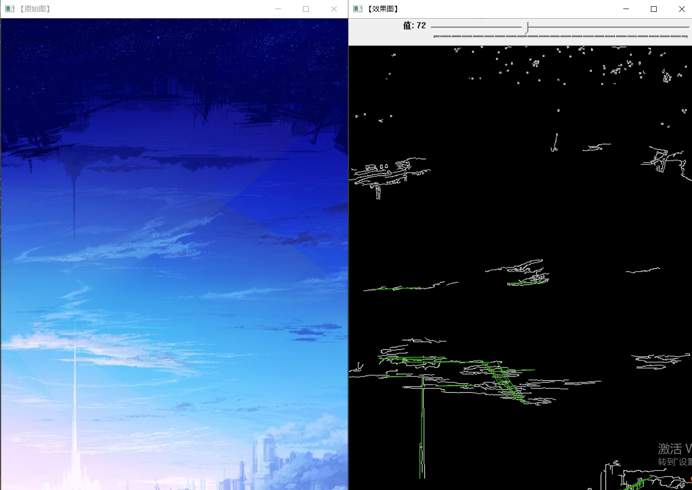
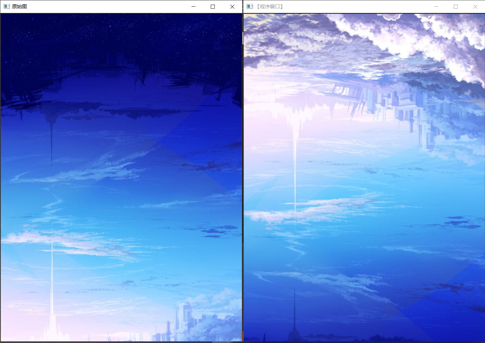
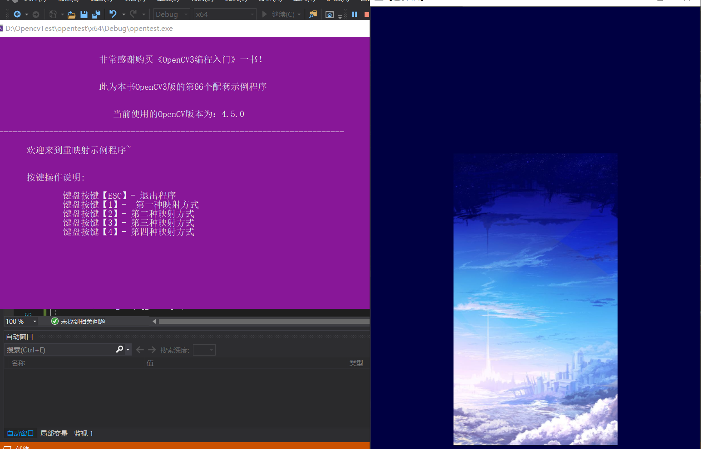


## 18， 仿射变换综合示例

仿射变换又称仿射映射，是指在几何中，一个向量空间进行一次线性变换并接上-一个平移，变换为另一个向量空间的过程。它保持了二维图形的“平直性”(直线经过变换之后依然是直线)和“平行性”(二维图形之间的相对位置关系保持不变，平行线依然是平行线，且直线上点的位置顺序不变)。一个任意的仿射变换都能表示为乘以- -个矩阵 (线性变换)接着再加上:一个向量(平移)的形式。
那么，我们能够用仿射变换来表示如下三种常见的变换形式:
旋转，平移，缩放。
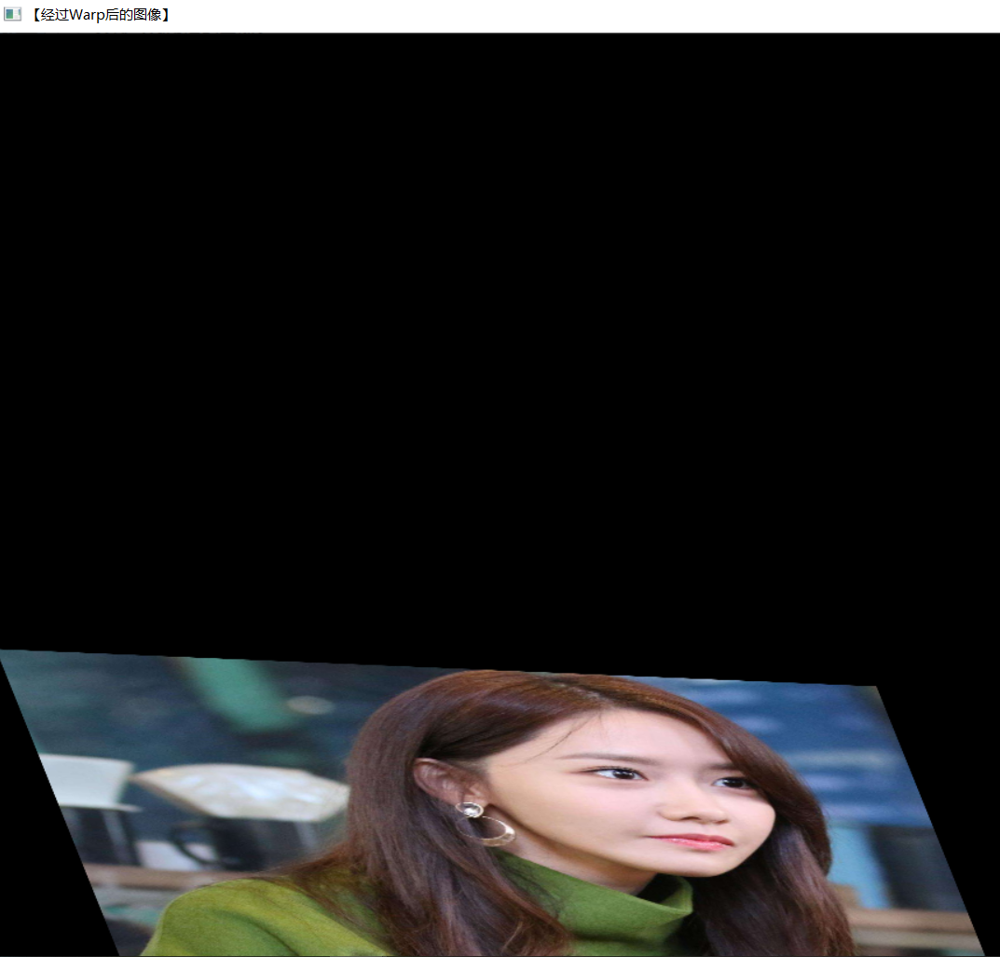


## 19， 直方图均衡化

直方图是对图像像素的统计分布，它统计了每个像素（0到L-1）的数量。直方图均衡化就是将原始的直方图拉伸，使之均匀分布在全部灰度范围内，从而增强图像的对比度。直方图均衡化的中心思想是把原始图像的的灰度直方图从比较集中的某个区域变成在全部灰度范围内的均匀分布。

在一幅图像中，明亮图像的直方图倾向于灰度级高的一侧，灰暗图像的直方图倾向于灰度级低的一侧，如果一副图像占有全部可能的灰度级并且分布均匀，则这样的图像有高对比度和多变的灰度色调。直方图均衡化这种方法通常用来增加图像的局部对比度。所以这种方法对于图像前景和背景都太亮或者太暗的情况非常有用，使目标区域从背景脱离出来。

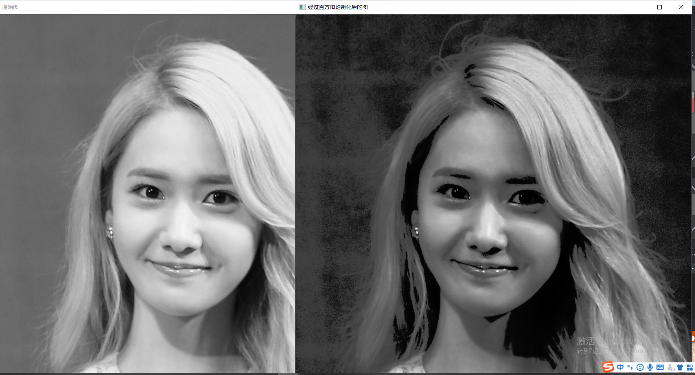

## 20， 查找并绘制轮廓综合示例图

```C++
/*
void drawContours
(
InputOutputArray image,
InputArrayOfArrays contours,
int contourIdx,
const Scalar & color,
int thickness = 1,
int lineType = LINE_8,
InputArray hierarchy = noArray(),
int maxLevel = INT_MAX,
Point offset = Point()
)
*/
```

功能：绘制轮廓或者填充轮廓
说明：该函数用于绘制图像中的轮廓（若thickness >= 0）或者填充轮廓所包围的区域（若thickness < 0）
参数：
image：目标图像
contours：输入的所有轮廓（每个轮廓以点集的方式存储）
contoursIdx：指定绘制轮廓的下标（若为负数，则绘制所有轮廓）
color：绘制轮廓的颜色
thickness：绘制轮廓的线的宽度（若为负数，则填充轮廓内部）
lineType：绘制轮廓的线型（4连通、8连通或者反锯齿）
hierarchy：关于层级的可选信息，仅用于当你想要绘制部分轮廓的时候
maxLevel：绘制轮廓的最大层级，若为0，则仅仅绘制指定的轮廓；若为1，则绘制该轮廓及其内嵌轮廓，若为2，则绘制该轮廓、其内嵌轮廓以及内嵌轮廓的内嵌轮廓，依次类推。该参数只有在有层级信息输入时才被考虑。
offset：可选的轮廓偏移参数，所有的轮廓将会进行指定的偏移

indContours()查找轮廓:

```C++
/*
void findContours (
InputOutputArray image,//输入图像，必须是8位单通道二值图像
OutputArrayOfArrays contours,//检测到的轮廓，每个轮廓被表示成一个point向量
OutputArray hierarchy,//可选的输出向量，包含图像的拓扑信息。其中元素的个数和检测到的轮廓的数量相等
int mode,//说明需要的轮廓类型和希望的返回值方式
int method,//轮廓近似方法
Point offset = Point()
)
*/
```

参数mode:
mode的值决定把找到的轮廓如何挂到轮廓树节点变量(h_prev, h_next, v_prev, v_next)上，拓扑结构图如下；
每种情况下，结构都可以看成是被横向连接(h_prev, h_next)联系和被纵向连接(v_prev, v_next)不同层次。
CV_RETR_EXTERNAL：只检测出最外轮廓即c0；
CV_RETR_LIST：检测出所有的轮廓并将他们保存到表(list)中；
CV_RETR_COMP：检测出所有的轮廓并将他们组织成双层的结构，第一层是外部轮廓边界，第二层边界是孔的边界；
CV_RETR_TREE：检测出所有轮廓并且重新建立网状的轮廓结构；
参数method：
CV_CHAIN_CODE：用freeman链码输出轮廓，其他方法输出多边形(顶点的序列)；
CV_CHAIN_APPROX_NONE：将链码编码中的所有点转换为点；
CV_CHAIN_APPROX_SIMPLE：压缩水平，垂直或斜的部分，只保存最后一个点；
CV_CHAIN_APPROX_TC89_L1，CV_CHAIN_QPPROX_TC89_KCOS：使用Teh-Chin链逼近算法中的一个。


## 21， 查找并绘制物体凸包

凸包是在给定二维平面上的点集，将最外层的点连接起来构成的凸多边形，它是能包含点集中所有点的。理解物体形状或轮廓的一种比较有用的方法便是计算一个物体的凸包，然后计算其凸缺陷，很多复杂物体的特性能很好地被这种缺陷表现出来。

```c++
/*
void convexHull(inputArray points,outputArray hull,bool clockwise=false,bool returnPoints=true)
*/
```

第一个参数，输入的二维点集。
第二个参数，输出参数，函数调用后找到的凸包。
第三个参数，操作方向标识符，当此标识符为真时，输出的凸包为顺时针方向。否则，就为逆时针方向。并且是假定坐标系的x轴指向右，y轴指向上方。
第四个参数，操作标识符，默认值true，当标识符为真时，函数返回各凸包的各个点。否则，它返回凸包各点的指数。当输出数组是


## 22， 创建包围轮廓的矩形和圆形边界框

返回外部矩形边界: boundingRect()函数
此函数计算并返回指定点集最外面(up-right) 的矩形边界。

```C++
/*
Rect boundingRect (InputArray points)
*/
```

其唯一的一个参数为输入的二维点集，可以是std:vector或Mat类型。
寻找最小包围矩形 : minAreaRect函数
此函数用于对给定的2D点集，寻找可旋转的最小面积的包围矩形。

```C++
/*
RotatedRect minAreaRect (InputArray points)
*/
```

其唯一的一个参数为输入的二维点集，可以为std:vector<>或 Mat类型。
寻找最小包围圆形 : minEnclosingCircle0函数
minEnclosingCircle丽数的功能是利用一种迭代算法，对给定的2D点集，去寻找面积最小的可包围它们的圆形。

```C++
/*
void minEnclosingCircle (InputArray points, Point2f& center, float&radius)
*/
```

使用多边形将轮廓包围
第一个参数, Inputrray类型的points,输入的二维点集,可以为std:vector<>
或Mat类型。
第二个参数，Point2f&类型的center, 圆的输出圆心。
第三个参数，float&类型的radius, 圆的输出半径。


## 23， 查找和绘制图片轮廓矩

矩的计算: moments()函数用于计算多边形和光栅形状的最高达三阶的所有矩。矩用来计算形状的重心、面积，主轴和其他形状特征。

```C++
/*
Moments moments (InputArray array, bool binaryImage=false)
*/
```

第一个参数，InputArray 类型的array, 输入参数，可以是光栅图像(单通道，8位或浮点的二维数组)或二维数组(1N或N1)。
第二个参数，bool类型的binaryImage, 有默认值false。 若此参数取true,则所有非零像素为1。此参数仅对于图像使用。需要注意的是，此参数的返回值返回运行后的结果。


计算轮廓面 积: contourArea0函数
contourArea(函数用于计算整个轮廓或部分轮廓的面积

```C++
/*
double contourArea (InputArray. contour, bool oriented=false)
*/
```

第一个参数，InputArray类型的contour, 输入的向量，二维点(轮廓顶点),
可以为st::vector 或Mat类型。
第二个参数，bool类型的oriented, 面向区域标识符。若其为true, 该函数返回一个带符号的面积值,其正负取决于轮廓的方向(顺时针还是逆时针)。
根据这个特性我们可以根据面积的符号来确定轮廓的位置。

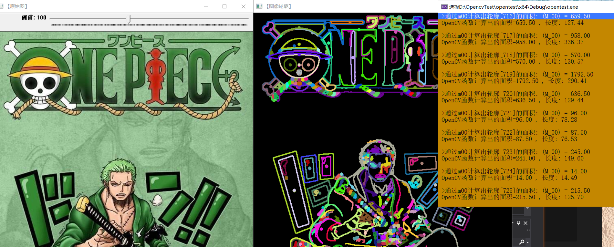

## 24， 分水岭算法

分水岭算法基本思想：
一个灰度影像可以看做一个高程影像，灰度的变化就是地形的起伏。假设向该区域不断注水，则地势较低的位置会首先被淹没，随着水位的升高淹没的区域也会不断提高，而初始位置称为集水盆。而分水岭算法就是基于此基本思想，首先假设图像灰度值为高度值，通过集水盆区域不断注水使得每个淹没区域不断扩大，而当水淹没到一定高度时两个集水盆会相连合并为同一个区域，此时就应该在这两个集水盆之间建立拦水坝以阻止区域的合并，持续次过程直到注水高度满足要求得到所有集水盆的淹没区域。
分水岭算法具体流程：
（1）计算影像梯度，通过影像梯度获取梯度值较小的区域作为集水盆，在获取集水盆的过程中通过八方向寻找，获取同一集水盆内所有像素并把不同集水盆像素进行编号，得到影像的集水盆区域。遍历所有集水盆区域，每个集水盆区域的边界。
（2）从集水盆区域开始注水，对集水盆区域边界像素进行八方向判断，检测像素是否能够被淹没，并重新计算影像集水盆和集水盆边界像素。水淹没到两个集水盆之间则停止淹没，两集水盆之间的像素为分水岭。
（3）重复步骤（2）直到水淹没到给定的高度获得所有集水盆的分水岭。

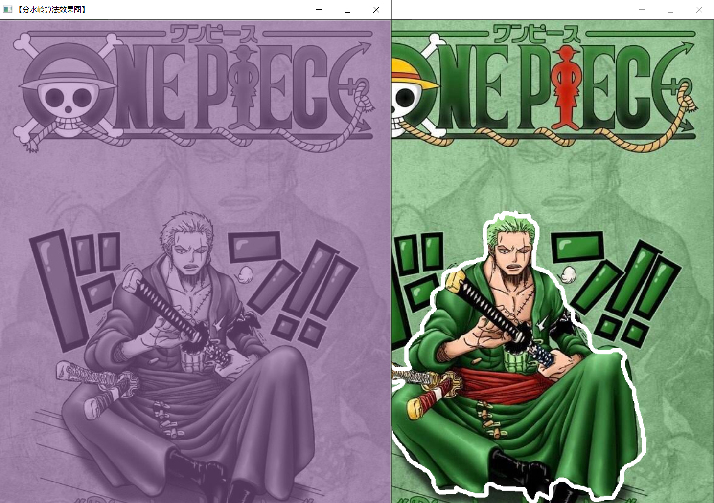


## 25， 图像修补

OpenCV中图像修补技术由inpaint函数实现，基本步骤是先修复区域边缘再逐步向内推进修复，可以用来清除照片灰尘、划痕或者从静态图像及视频中去除不需要的物体。
图像修补函数inpaint()

```C++
/*
void inpaint( InputArray srC, InputArray inpaintMask,OutputArray dst, double inpaintRadius, int flags );
*/
```

src:输入图像，需为8位单通道或三通道色图像
inpaintMask:修复掩膜为八位单通道图像，其中非0像素表示需要修补的区域
dst:函数调用后输出图像，和原图一样的尺寸和类型
inpaintRadius:需要修补的每个点的圆形邻域，为修复算法的参考半径
flags:修补方法的标识符，有如下两种:
INPAINT_NS=CV_INPAINT_NS, // Navier-Stokes algorithm
INPAINT_TELEA=CV_INPAINT TELEA // A. Telea algorithm


## 26， H-S二维直方图的绘制

计算彩色图像的色调、饱和度二维直方图，简称H-S直方图。

```C++
/*
Mat hsvImage;
//因为要计算H-S的直方图，所以需要得到一个HSV空间的图像
cvtColor(srcImage, hsvImage, CV_BGR2HSV);
imshow("【HSV空间的原图】", hsvImage);
//为计算直方图配置变量
//首先是需要计算的图像的通道，就是需要计算图像的哪个通道（bgr空间需要确定计算 b或g货r空间）
int channels[] = { 0, 1 };
//然后是配置输出的结果存储的 空间 ，用MatND类型来存储结果
MatND dstHist;
//接下来是直方图的每一个维度的 柱条的数目（就是将数值分组，共有多少组）
//如果这里写成int histSize = 256;   那么下面调用计算直方图的函数的时候，该变量需要写 &histSize
int histSize[] = { 30, 32 };
//最后是确定每个维度的取值范围，就是横坐标的总数
//首先得定义一个变量用来存储 单个维度的 数值的取值范围
float HRanges[] = { 0, 180 };
float SRanges[] = { 0, 256 };
const float *ranges[] = { HRanges, SRanges };
calcHist(&hsvImage, 1, channels, Mat(), dstHist, 2, histSize, ranges, true, false);
//calcHist  函数调用结束后，dstHist变量中将储存了 直方图的信息  用dstHist的模版函数 at<Type>(i)得到第i个柱条的值
//at<Type>(i, j)得到第i个并且第j个柱条的值
//开始直观的显示直方图——绘制直方图
//首先先创建一个黑底的图像，为了可以显示彩色，所以该绘制图像是一个8位的3通道图像
Mat drawImage = Mat::zeros(Size(300, 320), CV_8UC3);
//因为任何一个图像的某个像素的总个数，都有可能会有很多，会超出所定义的图像的尺寸，针对这种情况，先对个数进行范围的限制
//先用 minMaxLoc函数来得到计算直方图后的像素的最大个数
double g_dHistMaxValue;
minMaxLoc(dstHist, 0, &g_dHistMaxValue, 0, 0);
//将像素的个数整合到 图像的最大范围内
//遍历直方图得到的数据
for (int i = 0; i < 30; i++)
{
for (int j = 0; j < 32; j++)
{
int value = cvRound(dstHist.at<float>(i, j) * 256 / g_dHistMaxValue);
rectangle(drawImage, Point(10 * i, j * 10), Point((i + 1) * 10 - 1, (j + 1) * 10 - 1), Scalar(value), -1);
}
}
 */
```


## 27， 一维直方图的绘制


## 28， RGB三色直方图的绘制


## 30， 直方图对比


## 31， 反向投影

反向投影是一种记录给定图像中的像素点如何适应直方图模型像素分布的方式。简单的讲，就是首先计算某一特征的直方图模型，然后使用模型去寻找图像中存在的该特征。例如，你有一个肤色直方图，你可以用它来寻找图像中的肤色区域


CalcBackProject()函数,作用：计算反向投影

```c++
/*
void cvCalcBackProject(IplImage** image,CvArr*back_project,const CvHistogram* hist
);
 */
```

参数：
image
单通道输入图像
back_project
单通道反向投影图像，与输入图像具有同样类型.
hist
直方图


## 32， 模板匹配

模板匹配是在一幅图像中寻找一个特定目标的方法之一，这种方法的原理非常简单，遍历图像中的每一个可能的位置，比较各处与模板是否“相似”，当相似度足够高时，就认为找到了我们的目标。OpenCV提供了6种模板匹配算法：
平方差匹配法CV_TM_SQDIFF
归一化平方差匹配法CV_TM_SQDIFF_NORMED
相关匹配法CV_TM_CCORR
归一化相关匹配法CV_TM_CCORR_NORMED
相关系数匹配法CV_TM_CCOEFF
归一化相关系数匹配法CV_TM_CCOEFF_NORMED

```c++
/*
void cv::matchTemplate(
cv::InputArray image, // 待匹配图像W*H
cv::InputArray templ, // 模板图像，和image类型相同， 大小 w*h
cv::OutputArray result, // 匹配结果图像, 类型 32F, 大小 (W-w+1)*(H-h+1)
 int method // 用于比较的方法
);	
/*
```

1.result数据的含义
模板匹配函数cvMatchTemplate依次计算模板与待测图片的重叠区域的相似度，并将结果存入映射图像result当中，也就是说result图像中的每一个点的值代表了一次相似度比较结果。

2.result的尺寸大小
模板在待测图像上每次在横向或是纵向上移动一个像素，并作一次比较计算，由此，横向比较W-w+1次，纵向比较H-h+1次，从而得到一个（W-w+1）（H-h+1）维的结果矩阵，result即是用图像来表示这样的矩阵,因而图像result的大小为（W-w+1）×（H-h+1）。匹配结果图像与原图像之间的大小关系，他们之间差了一个模板大小。


## 总结

### 图像滤波处理

过滤:是信号和图像处理中基本的任务。其目的是根据应用环境的不同，选择性的提取图像中某些认为是重要的信息。过滤可以移除图像中的噪音、提取感兴趣的可视特征、允许图像重采样等等。
频域分析:将图像分成从低频到高频的不同部分。低频对应图像强度变化小的区域，而高频是图像强度变化非常大的区域。在频率分析领域的框架中，滤波器是一个用来增强图像中某个波段或频率并阻塞（或降低）其他频率波段的操作。低通滤波器是消除图像中高频部分，但保留低频部分。高通滤波器消除低频部分。
滤波(高通、低通、带通、带阻) 、模糊、去噪、平滑等。

滤波器分类
线性滤波： 对邻域中的像素的计算为线性运算时，如利用窗口函数进行平滑加权求和的运算，或者某种卷积运算，都可以称为线性滤波。常见的线性滤波有：方框滤波、均值滤波、高斯滤波、拉普拉斯滤波等等，通常线性滤波器之间只是模版的系数不同。
非线性滤波： 非线性滤波利用原始图像跟模版之间的一种逻辑关系得到结果，如最值滤波器，中值滤波器。比较常用的有中值滤波器和双边滤波器。
卷积核
数字图像是一个二维的数组，对数字图像做卷积操作其实就是利用卷积核在图像上滑动，将图像点上的像素值与对应的卷积核上的数值相乘，然后将所有相乘后的值相加作为卷积核中间像素点的像素值，并最终滑动完所有图像的过程。

### 图像形态学处理

数学形态学提供了一组有用的方法，能够用来调整分割区域的形状以获得比较理想的结果，它最初是从数学中的集合论发展而来并用于处理二值图的，虽然运算很简单，但是往往可以产生很好的效果，后来这些方法推广到普通的灰度级图像处理中。常用的形态学处理方法包括：腐蚀、膨胀、开运算、闭运算、顶帽运算、底帽运算，其中膨胀与腐蚀是图像处理中最常用的形态学操作手段，其他方法是两者相互组合而产生的。

下面主要介绍膨胀与腐蚀

一、膨胀
跟卷积操作类似，假设有图像A和结构元素B，结构元素B在A上面移动，其中B定义其中心为锚点，计算B覆盖下A的最大像素值用来替换锚点的像素，其中B作为结构体可以是任意形状。我们回忆一下中值平滑操作——取每一个位置的矩形领域内值的中值作为该位置的输出灰度值，图像的膨胀操作与中值平滑操作类似，它是取每一个位置的矩形领域内值的最大值作为该位置的输出灰度值。不同的是，这里的领域不再单纯是矩形结构的，也可以是椭圆形结构的、十字交叉形结构的等。

二、腐蚀
腐蚀操作与膨胀操作类似，只是它取结构元所指定的领域内值的最小值作为该位置的输出灰度值。因为取每个位置领域内最小值，所以腐蚀后输出图像的总体亮度的平均值比起原图会有所降低，图像中比较亮的区域的面积会变小甚至消失，而较暗物体的尺寸会扩大。

### 霍夫变换

霍夫变换是图像处理中的一种特征提取技术，它通过一种投票算法检测具有特定形状的物体。Hough变换是图像处理中从图像中识别几何形状的基本方法之一。Hough变换的基本原理在于利用点与线的对偶性，将原始图像空间的给定的曲线通过曲线表达形式变为参数空间的一个点。这样就把原始图像中给定曲线的检测问题转化为寻找参数空间中的峰值问题。也即把检测整体特性转化为检测局部特性。比如直线、椭圆、圆、弧线等。

Hough变换的基本思想
设已知一黑白图像上画了一条直线，要求出这条直线所在的位置。我们知道，直线的方程可以用y=k*x+b 来表示，其中k和b是参数，分别是斜率和截距。过某一点(x0,y0)的所有直线的参数都会满足方程y0=kx0+b。即点(x0,y0)确定了一族直线。方程y0=kx0+b在参数k-b平面上是一条直线，这样，图像x-y平面上的一个前景像素点就对应到参数平面上的一条直线。我们举个例子说明解决前面那个问题的原理。设图像上的直线是y=x, 我们先取上面的三个点：A(0,0), B(1,1), C(2,2)。可以求出，过A点的直线的参数要满足方程b=0, 过B点的直线的参数要满足方程1=k+b, 过C点的直线的参数要满足方程2=2k+b, 这三个方程就对应着参数平面上的三条直线，而这三条直线会相交于一点(k=1,b=0)。　同理，原图像上直线y=x上的其它点(如(3,3),(4,4)等)　对应参数平面上的直线也会通过点(k=1,b=0)。这个性质就为我们解决问题提供了方法，就是把图像平面上的点对应到参数平面上的线，最后通过统计特性来解决问题。假如图像平面上有两条直线，那么最终在参数平面上就会看到两个峰值点，依此类推。

简而言之，Hough变换思想为：在原始图像坐标系下的一个点对应了参数坐标系中的一条直线，同样参数坐标系的一条直线对应了原始坐标系下的一个点，然后，原始坐标系下呈现直线的所有点，它们的斜率和截距是相同的，所以它们在参数坐标系下对应于同一个点。这样在将原始坐标系下的各个点投影到参数坐标系下之后，看参数坐标系下有没有聚集点，这样的聚集点就对应了原始坐标系下的直线。

在实际应用中，y=k*x+b形式的直线方程没有办法表示x=c形式的直线(这时候，直线的斜率为无穷大)。所以实际应用中，是采用参数方程p=x*cos(theta)+y*sin(theta)。这样，图像平面上的一个点就对应到参数p-theta平面上的一条曲线上，其它的还是一样。

Hough transform的原理
要理解Hough 变换极其注意的是，原笛卡尔坐标系里的直线 上所有的点带入直线方程后，进行变换后在斜率k和截距b为横纵坐标的hough坐标系里面又是另外一条直线 其中 是已知的，相当于笛卡尔坐标系里面的斜率和截距，即是一条Hough坐标系里面的一条直线。如果所有的参数点 均来自 上，那么其对应的Hough坐标系里面的k和b，即横纵坐标。且必有一条直线和原直线 重合，在Hough坐标系里面显示，就是过一点。

### 图像直方图

图像直方图是用一表示数字图像中亮度分布的直方图，标绘了图像中每个亮度值的像素数。可以借助观察该直方图了解需要如何调整亮度分布的直方图。这种直方图中，横坐标的左侧为纯黑、较暗的区域，而右侧为较亮、纯白的区域。因此，一张较暗图片的图像直方图中的数据多集中于左侧和中间部分，而整体明亮、只有少量阴影的图像则相反。计算机视觉邻域常借助图像直方图来实现图像的二值化。

灰度直方图是一幅图像中个像素灰度值出现次数或频数的统计结果，它只反映该图像中灰度值出现的频率，而未反映某一灰度值像素所在的位置。也就是说，它只包含了该图像中某个灰度值的像素出现的概率，而丢失了其所在的位置的信息。

任一幅图像，都能唯一地算出一幅与它对应的直方图。但不同的图像，可能有相同的直方图。即图像与直方图之间是多对一的映射关系。

直方图意义： 

1. 直方图是图像中像素强度分布的图形表达方式。 
2. 直方图统计了每一个强度值所具有的像素个数。
直方图广泛应用于许多计算机视觉应用中。通过标记帧和帧之间显著的边缘和颜色的统计变化，来检测视频中场景的变换。通过在每个兴趣点设置一个有相近特征的直方图所构成的标签，用以确定图像中的兴趣点。边缘、色彩、角度等直方图构成了可以被传递给目标识别分类器的一个通用特征类型。色彩和边缘的直方图还可以用来识别网络视频是否被复制等。直方图是计算机视觉中最经典的工具之一，也是一个很好的图像特征表示手段。

## 学习心得体会

边缘在人类视觉和计算机视觉中均起着重要的作用。
其中OpenCV提供了许多边缘检测滤波函数，这些滤波函数都会将非边缘区域转为黑色，将边缘区域转为白色或其他饱和的颜色。
不过这些滤波函数都很容易将噪声错误地识别为边缘，所以需要进行模糊处理。
使用高斯模糊(低通滤波器)，最常用的模糊滤波器(平滑滤波器)之一，是一个削弱高频信号强度的低通滤波器。
低通滤波器，在像素与周围像素的亮度差值小于一个特定值时，平滑该像素的亮度，主要用于去噪和模糊化。
边缘检测则是使用Canny函数实现，
5个步骤，使用高斯滤波器对图像去噪、计算梯度、在边缘上使用非最大抑制、在检测到的边缘上使用双阈值去除分析所有的边缘及其连接，保留真正的边缘并消除不明显的边缘。


查找并绘轮廓，通过学习了解到轮廓是一系列相连的点组成的曲线，代表了物体的基本外形，相对于边缘，轮廓是连续的，边缘并不全部连续。还知道了寻找轮廓的操作一般用于二值化图，所以通常会使用阈值分割或Canny边缘检测先得到二值图，值得注意的是寻找轮廓是针对白色物体的，一定要保证物体是白色，而背景是黑色，不然很多人在寻找轮廓时会找到图片最外面的一个框。

通过OpenCV绘制直方图的学习我知道了：
1.直方图的作用。
通过标记帧与帧之间的边缘和颜色的统计变化，直方图被用来检测视频中场景的变化。通过为每个兴趣点设置一个有相近特征的直方图所构成的“标签”，用以确定图像中的兴趣点。边缘、色彩、角等直方图构成了可以被传递给目标识别分类器的一个通用特征类型。
2.如何得到直方图
(1)首先理解直方图中bin的含义
直方图中bin的含义：计算颜色直方图需要将颜色空间划分为若干小的颜色区间，即直方图的bin，通过计算颜色在每个小区间内德像素得到颜色直方图，bin越多，直方图对颜色的分辨率越强，但增加了计算机的负担。
(2)简单来说直方图就是对数据进行统计，将统计值组织到一系列事先定义好的bin中。bin中的数值就是从数据中计算出的特征的统计量，这些数据可以是诸如梯度、方向、色彩或任何其他特征。无论如何，直方图获得的是数据分布的统计图。直方图实际上是一个方便表示图像特征的手段。