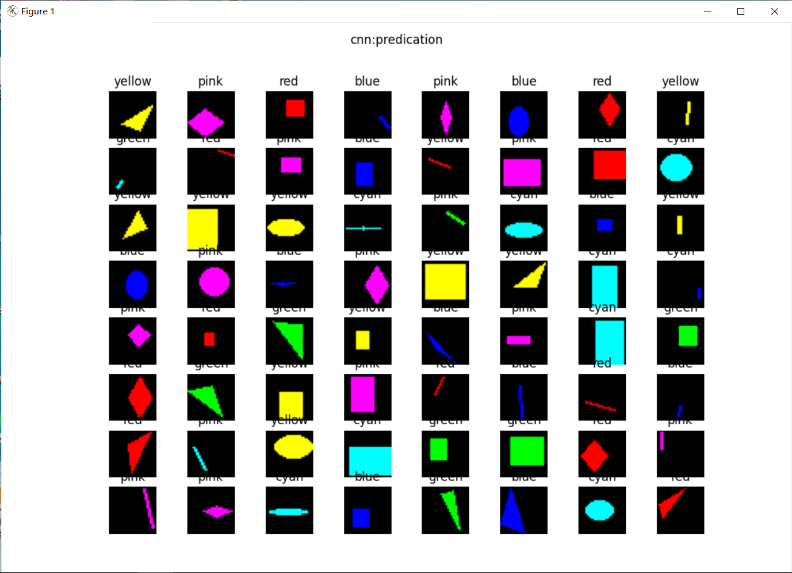
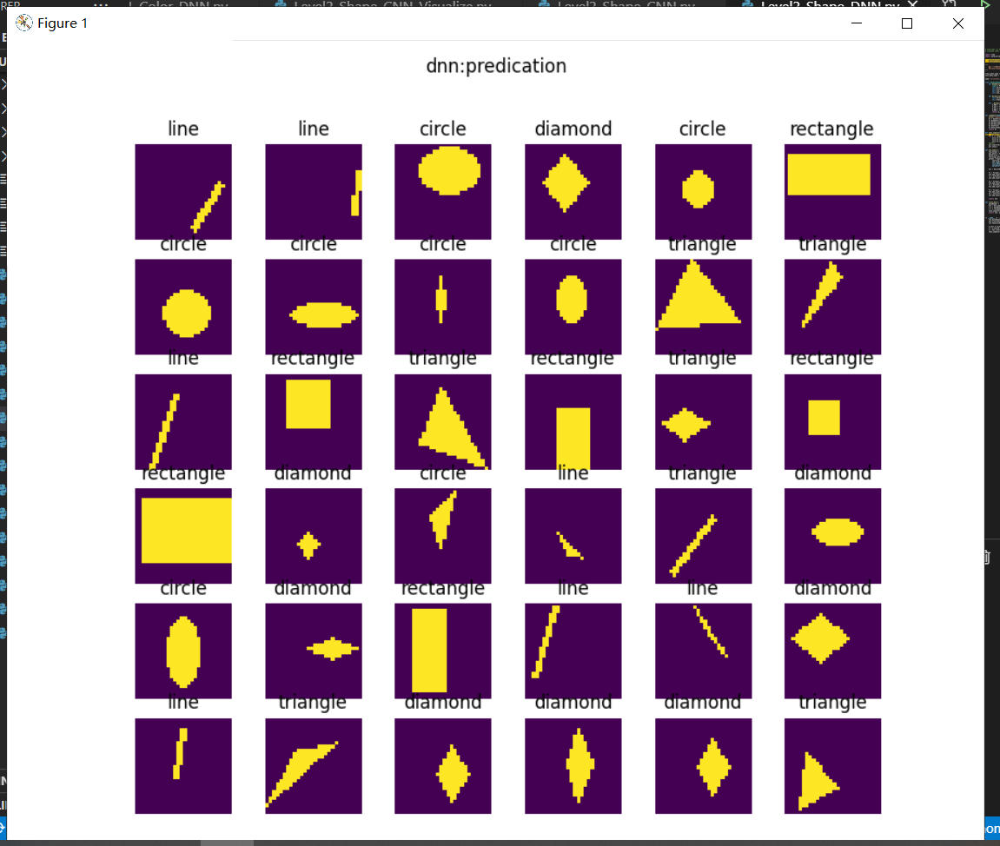
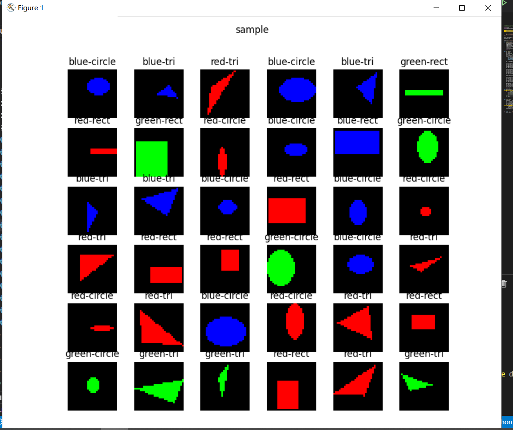
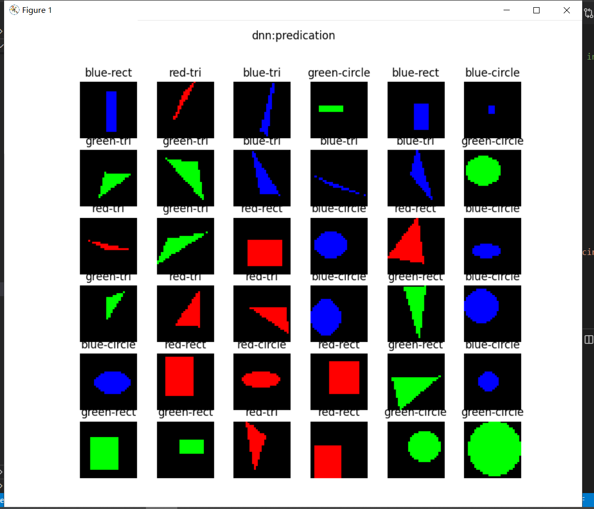
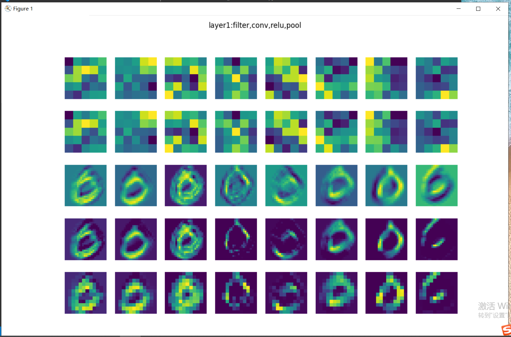
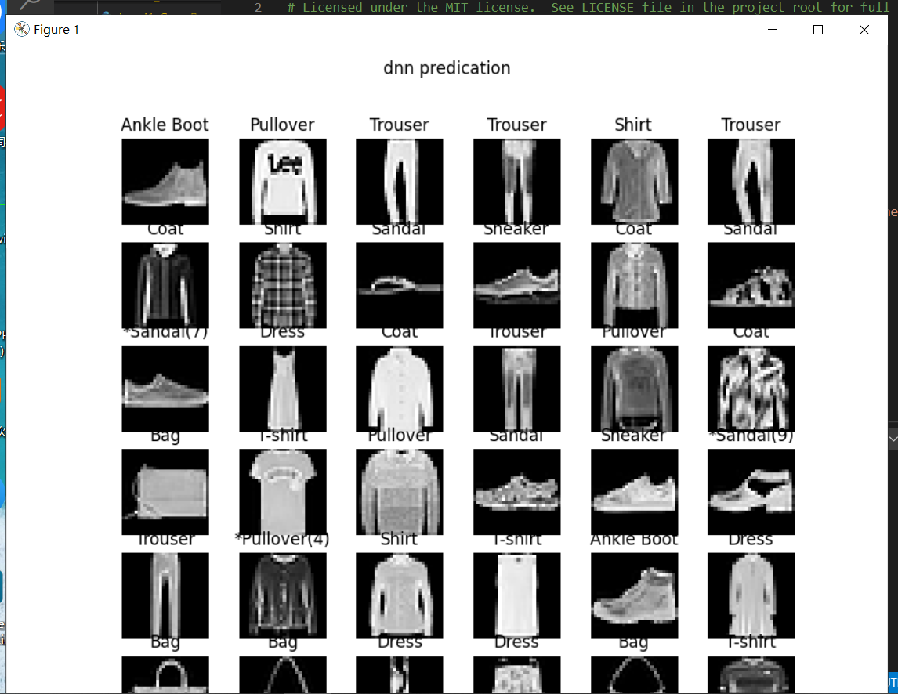

# 卷积神经网络

## 卷积神经网络的能力

卷积神经网络是神经网络的类型之一，在图像识别和分类领域中在图像识别和分类领域中取得了非常好的效果，比如识别人脸、物体、交通标识等，这就为机器人、自动驾驶等应用提供了坚实的技术基础

下面图像片展示了卷积神经网络在人们的日常生活中的应用：


## 卷积神经网络的结构


结构层级分析：

1. 原始的输入是一张图片，可以是彩色的，也可以是灰度的或黑白的。这里假设是只有一个通道的图片，目的是识别0~9的手写体数字；
2. 第一层卷积，我们使用了4个卷积核，得到了4张feature map；激活函数层没有单独画出来，这里我们紧接着卷积操作使用了Relu激活函数；
3. 第二层是池化，使用了Max Pooling方式，把图片的高宽各缩小一倍，但仍然是4个feature map；
4. 第三层卷积，我们使用了4x6个卷积核，其中4对应着输入通道，6对应着输出通道，从而得到了6张feature map，当然也使用了Relu激活函数；
5. 第四层再次做一次池化，现在得到的图片尺寸只是原始尺寸的四分之一左右；
6. 第五层把第四层的6个图片展平成一维，成为一个fully connected层；
7. 第六层再接一个小一些的fully connected层；
8. 最后接一个softmax函数，判别10个分类。
   
在一个卷积神经网络中最基本的结构包括：

- 卷积层
- 激活函数层
- 池化层
- 全连接分类层

## 卷积神经网络的学习

卷积神经网络对图像的平移不变性、旋转视角不变性、尺度不变性的处理：


- 平移不变性
  
  对于原始图A，平移后得到图B，对于同一个卷积核来说，都会得到相同的特征，这就是卷积核的权值共享。但是特征处于不同的位置，由于距离差距较大，即使经过多层池化后，也不能处于近似的位置。此时，后续的全连接层会通过权重值的调整，把这两个相同的特征看作同一类的分类标准之一。如果是小距离的平移，通过池化层就可以处理了。

- 旋转不变性

  对于原始图A，有小角度的旋转得到C，卷积层在A图上得到特征a，在C图上得到特征c，可以想象a与c的位置间的距离不是很远，在经过两层池化以后，基本可以重合。所以卷积网络对于小角度旋转是可以容忍的，但是对于较大的旋转，需要使用数据增强来增加训练样本。一个极端的例子是当6旋转90度时，谁也不能确定它到底是6还是9。

- 尺度不变性

  对于原始图A和缩小的图D，人类可以毫不费力地辨别出它们是同一个东西。池化在这里是不是有帮助呢？没有！因为神经网络对A做池化的同时，也会用相同的方法对D做池化，这样池化的次数一致，最终D还是比A小。如果我们有多个卷积视野，相当于从两米远的地方看图A，从一米远的地方看图D，那么A和D就可以很相近似了。这就是Inception的想法，用不同尺寸的卷积核去同时寻找同一张图片上的特征。

## 卷积神经网络的应用

### 卷积神经网络的典型模型

### LeNet 


LeNet模型结构图

LeNet是把卷积神经网络的最基本的架构就定下来了：卷积层、池化层、全连接层。

1. 输入为单通道32x32灰度图
2. 使用6组5x5的过滤器，每个过滤器里有一个卷积核，stride=1，得到6张28x28的特征图
3. 使用2x2的池化，stride=2，得到6张14x14的特征图
4. 使用16组5x5的过滤器，每个过滤器里有6个卷积核，对应上一层的6个特征图，得到16张10x10的特征图
5. 池化，得到16张5x5的特征图
6. 接全连接层，120个神经元
7. 接全连接层，84个神经元
8. 接全连接层，10个神经元，
   
### AlexNet 

AlexNet的网络结构在整体上类似于LeNet，都是先卷积然后在全连接。但在细节上有很大不同。AlexNet更为复杂。AlexNet有60 million个参数和65000个神经元，五层卷积，三层全连接网络，最终的输出层是1000通道的Softmax。


AlexNet模型结构图

1. 原始图片是3x224x224三通道彩色图片，分开到上下两块GPU上进行训练
2. 卷积，96核，11x11，stride=4，pad=0，输出96x55x55
3. LRN+池化，3x3，stride=2，pad=0，输出96x27x27
4. 卷积，256核，5x5，stride=1，pad=2，输出256x27x27
5. LRN+池化，3x3，stride=2，输出256x13x13
6. 卷积，384核，3x3，stride=1，pad=1，输出384x13x13
7. 卷积，384核，3x3，stride=1，pad=1，输出384x13x13
8. 卷积，256核，3x3，stride=1，pad=1，输出256x13x13
9. 池化，3x3，stride=2，输出256x6x6
10. 全连接层，4096个神经元，接Dropout和Relu
11. 全连接层，4096个神经元，接Dropout和Relu
12. 全连接层，1000个神经元做分类

AlexNet的特点：

- 比LeNet深和宽的网络
  
  使用了5层卷积和3层全连接，一共8层。特征数在最宽处达到384。

- 数据增强
  
  针对原始图片256x256的数据，做了随机剪裁，得到224x224的图片若干张。

- 使用ReLU做激活函数
- 在全连接层使用DropOut
- 使用LRN
  
  LRN的全称为Local Response Normalizatio，局部响应归一化，是想对线性输出做一个归一化，避免上下越界。发展至今，这个技术已经很少使用了。

下面还有的模型：


ZFNet模型结构图


VGG16模型结构图


GoogLeNet模型结构图


ResNets模型结构图


DenseNet模型结构图

由于内容有点多这几个模型就不详细介绍。

## 实现颜色分类

卷积神经网络可以在图像分类上发挥作用，而一般的图像都是彩色的，也就是说卷积神经网络应该可以判别颜色的。

#### 数据处理

由于输入图片是三通道的彩色图片，我们需要先把它转换成灰度图，

```Python
class GeometryDataReader(DataReader_2_0):
    def ConvertToGray(self, data):
        (N,C,H,W) = data.shape
        new_data = np.empty((N,H*W))
        if C == 3: # color
            for i in range(N):
                new_data[i] = np.dot(
                    [0.299,0.587,0.114], 
                    data[i].reshape(3,-1)).reshape(1,784)
        elif C == 1: # gray
            new_data[i] = data[i,0].reshape(1,784)
        #end if
        return new_data
```

向量[0.299,0.587,0.114]的作用是，把三通道的彩色图片的RGB值与此向量相乘，得到灰度图，三个因子相加等于1，这样如果原来是[255,255,255]的话，最后的灰度图的值还是255。如果是[255,255,0]的话，最后的结果是：

$$
\begin{aligned}
Y &= 0.299 \cdot R + 0.586 \cdot G + 0.114 \cdot B \\
&= 0.299 \cdot 255 + 0.586 \cdot 255 + 0.114 \cdot 0 \\
&=225.675
\end{aligned}
\tag{1}
$$

也就是说粉色的数值本来是(255,255,0)，变成了单一的值225.675。六种颜色中的每一种都会有不同的值，所以即使是在灰度图中，也会保留部分“彩色”信息，当然会丢失一些信息。这从公式1中很容易看出来，假设$B=0$，不同组合的$R、G$的值有可能得到相同的最终结果，因此会丢失彩色信息。

在转换成灰度图后，立刻用reshape(1,784)把它转变成矢量，该矢量就是每个样本的784维的特征值。

#### 搭建模型

我们搭建的前馈神经网络模型如下：

```Python
def dnn_model():
    num_output = 6
    max_epoch = 100
    batch_size = 16
    learning_rate = 0.01
    params = HyperParameters_4_2(
        learning_rate, max_epoch, batch_size,
        net_type=NetType.MultipleClassifier,
        init_method=InitialMethod.MSRA,
        optimizer_name=OptimizerName.SGD)

    net = NeuralNet_4_2(params, "color_dnn")
    
    f1 = FcLayer_2_0(784, 128, params)
    net.add_layer(f1, "f1")
    r1 = ActivationLayer(Relu())
    net.add_layer(r1, "relu1")

    f2 = FcLayer_2_0(f1.output_size, 64, params)
    net.add_layer(f2, "f2")
    r2 = ActivationLayer(Relu())
    net.add_layer(r2, "relu2")
    
    f3 = FcLayer_2_0(f2.output_size, num_output, params)
    net.add_layer(f3, "f3")
    s3 = ClassificationLayer(Softmax())
    net.add_layer(s3, "s3")

    return net
```

这就是一个普通的三层网络，两个隐层，神经元数量分别是128和64，一个输出层，最后接一个6分类Softmax。

#### 运行结果





## 实现几何图形分类

### 用前馈神经网络解决问题

我们下面要考验一下神经网络的能力。我们先用前面学过的全连接网络来解决这个问题，搭建一个三层的网络如下：

```Python
def dnn_model():
    num_output = 5
    max_epoch = 50
    batch_size = 16
    learning_rate = 0.1
    params = HyperParameters_4_2(
        learning_rate, max_epoch, batch_size,
        net_type=NetType.MultipleClassifier,
        init_method=InitialMethod.MSRA,
        optimizer_name=OptimizerName.SGD)

    net = NeuralNet_4_2(params, "pic_dnn")
    
    f1 = FcLayer_2_0(784, 128, params)
    net.add_layer(f1, "f1")
    r1 = ActivationLayer(Relu())
    net.add_layer(r1, "relu1")

    f2 = FcLayer_2_0(f1.output_size, 64, params)
    net.add_layer(f2, "f2")
    r2 = ActivationLayer(Relu())
    net.add_layer(r2, "relu2")
    
    f3 = FcLayer_2_0(f2.output_size, num_output, params)
    net.add_layer(f3, "f3")
    s3 = ClassificationLayer(Softmax())
    net.add_layer(s3, "s3")

    return net
```
样本数据为28x28的灰度图，所以我们要把它展开成1x784的向量，第一层用128个神经元，第二层用64个神经元，输出层5个神经元接Softmax分类函数。


### 用卷积神经网络解决问题

下面我们来看看卷积神经网络能不能完成这个工作。首先搭建网络模型如下：

```Python
def cnn_model():
    num_output = 5
    max_epoch = 50
    batch_size = 16
    learning_rate = 0.1
    params = HyperParameters_4_2(
        learning_rate, max_epoch, batch_size,
        net_type=NetType.MultipleClassifier,
        init_method=InitialMethod.MSRA,
        optimizer_name=OptimizerName.SGD)

    net = NeuralNet_4_2(params, "shape_cnn")
    
    c1 = ConvLayer((1,28,28), (8,3,3), (1,1), params)
    net.add_layer(c1, "c1")
    r1 = ActivationLayer(Relu())
    net.add_layer(r1, "relu1")
    p1 = PoolingLayer(c1.output_shape, (2,2), 2, PoolingTypes.MAX)
    net.add_layer(p1, "p1") 

    c2 = ConvLayer(p1.output_shape, (16,3,3), (1,0), params)
    net.add_layer(c2, "c2")
    r2 = ActivationLayer(Relu())
    net.add_layer(r2, "relu2")
    p2 = PoolingLayer(c2.output_shape, (2,2), 2, PoolingTypes.MAX)
    net.add_layer(p2, "p2") 

    params.learning_rate = 0.1

    f3 = FcLayer_2_0(p2.output_size, 32, params)
    net.add_layer(f3, "f3")
    bn3 = BnLayer(f3.output_size)
    net.add_layer(bn3, "bn3")
    r3 = ActivationLayer(Relu())
    net.add_layer(r3, "relu3")
    
    f4 = FcLayer_2_0(f3.output_size, num_output, params)
    net.add_layer(f4, "f4")
    s4 = ClassificationLayer(Softmax())
    net.add_layer(s4, "s4")

    return net
```

结果如下：


## 实现几何图形及颜色分类

### 用前馈神经网络解决问题

我们仍然先使用全连接网络来解决这个问题，搭建一个三层的网络如下：

```Python
ef dnn_model():
    num_output = 9
    max_epoch = 50
    batch_size = 16
    learning_rate = 0.01
    params = HyperParameters_4_2(
        learning_rate, max_epoch, batch_size,
        net_type=NetType.MultipleClassifier,
        init_method=InitialMethod.MSRA,
        optimizer_name=OptimizerName.Momentum)

    net = NeuralNet_4_2(params, "color_shape_dnn")
    
    f1 = FcLayer_2_0(784, 128, params)
    net.add_layer(f1, "f1")
    r1 = ActivationLayer(Relu())
    net.add_layer(r1, "relu1")

    f2 = FcLayer_2_0(f1.output_size, 64, params)
    net.add_layer(f2, "f2")
    r2 = ActivationLayer(Relu())
    net.add_layer(r2, "relu2")
    
    f3 = FcLayer_2_0(f2.output_size, num_output, params)
    net.add_layer(f3, "f3")
    s3 = ClassificationLayer(Softmax())
    net.add_layer(s3, "s3")

    return net
```

样本数据为3x28x28的彩色图，所以我们要把它转换成灰度图，然后再展开成1x784的向量，第一层用128个神经元，第二层用64个神经元，输出层用9个神经元接Softmax分类函数。

### 用卷积神经网络解决问题

下面我们来看看卷积神经网络能不能完成这个工作。首先搭建网络模型如下：

```Python
def cnn_model():
    num_output = 9
    max_epoch = 20
    batch_size = 16
    learning_rate = 0.1
    params = HyperParameters_4_2(
        learning_rate, max_epoch, batch_size,
        net_type=NetType.MultipleClassifier,
        init_method=InitialMethod.MSRA,
        optimizer_name=OptimizerName.SGD)

    net = NeuralNet_4_2(params, "shape_color_cnn")
    
    c1 = ConvLayer((3,28,28), (8,3,3), (1,1), params)
    net.add_layer(c1, "c1")
    r1 = ActivationLayer(Relu())
    net.add_layer(r1, "relu1")
    p1 = PoolingLayer(c1.output_shape, (2,2), 2, PoolingTypes.MAX)
    net.add_layer(p1, "p1") 

    c2 = ConvLayer(p1.output_shape, (16,3,3), (1,0), params)
    net.add_layer(c2, "c2")
    r2 = ActivationLayer(Relu())
    net.add_layer(r2, "relu2")
    p2 = Pooli

图18-29 训练过程中损失函数值和准确度的变化
ngLayer(c2.output_shape, (2,2), 2, PoolingTypes.MAX)
    net.add_layer(p2, "p2") 

    params.learning_rate = 0.1

    f3 = FcLayer_2_0(p2.output_size, 32, params)
    net.add_layer(f3, "f3")
    bn3 = BnLayer(f3.output_size)
    net.add_layer(bn3, "bn3")
    r3 = ActivationLayer(Relu())
    net.add_layer(r3, "relu3")
    
    f4 = FcLayer_2_0(f3.output_size, num_output, params)
    net.add_layer(f4, "f4")
    s4 = ClassificationLayer(Softmax())
    net.add_layer(s4, "s4")

    return net
```

结果如下：






### 卷积神经网络模型解决MNIST问题

#### 代码实现

```Python
def model():
    num_output = 10
    dataReader = LoadData(num_output)

    max_epoch = 5
    batch_size = 128
    learning_rate = 0.1
    params = HyperParameters_4_2(
        learning_rate, max_epoch, batch_size,
        net_type=NetType.MultipleClassifier,
        init_method=InitialMethod.Xavier,
        optimizer_name=OptimizerName.Momentum)

    net = NeuralNet_4_2(params, "mnist_conv_test")
    
    c1 = ConvLayer((1,28,28), (8,5,5), (1,0), params)
    net.add_layer(c1, "c1")
    r1 = ActivationLayer(Relu())
    net.add_layer(r1, "relu1")
    p1 = PoolingLayer(c1.output_shape, (2,2), 2, PoolingTypes.MAX)
    net.add_layer(p1, "p1") 
  
    c2 = ConvLayer(p1.output_shape, (16,5,5), (1,0), params)
    net.add_layer(c2, "23")
    r2 = ActivationLayer(Relu())
    net.add_layer(r2, "relu2")
    p2 = PoolingLayer(c2.output_shape, (2,2), 2, PoolingTypes.MAX)
    net.add_layer(p2, "p2")  

    f3 = FcLayer_2_0(p2.output_size, 32, params)
    net.add_layer(f3, "f3")
    bn3 = BnLayer(f3.output_size)
    net.add_layer(bn3, "bn3")
    r3 = ActivationLayer(Relu())
    net.add_layer(r3, "relu3")

    f4 = FcLayer_2_0(f3.output_size, 10, params)
    net.add_layer(f4, "f2")
    s4 = ClassificationLayer(Softmax())
    net.add_layer(s4, "s4")

    net.train(dataReader, checkpoint=0.05, need_test=True)
    net.ShowLossHistory(XCoordinate.Iteration)
```

### 可视化

#### 第一组的卷积可视化

下图按行显示了以下内容：

1. 卷积核数值
2. 卷积核抽象
3. 卷积结果
4. 激活结果
5. 池化结果

卷积核是5x5的，一共8个卷积核，所以第一行直接展示了卷积核的数值图形化以后的结果，但是由于色块太大，不容易看清楚其具体的模式，那么第二行的模式是如何抽象出来的呢？

因为特征是未知的，所以卷积神经网络不可能学习出类似下面的两个矩阵中左侧矩阵的整齐的数值，而很可能是如同右侧的矩阵一样具有很多噪音，但是大致轮廓还是个左上到右下的三角形，只是一些局部点上有一些值的波动。


```
2  2  1  1  0               2  0  1  1  0
2  1  1  0  0               2  1  1  2  0
1  1  0 -1 -2               0  1  0 -1 -2
1  0 -1 -2 -3               1 -1  1 -4 -3
0 -1 -2 -3 -4               0 -1 -2 -3 -2
```


#### 第二组的卷积可视化



第二组卷积核、激活、池化的可视化

- Conv2：由于是在第一层的特征图上卷积后叠加的结果，所以基本不能按照原图理解，但也能大致看出是是一些轮廓抽取的作用；
- Relu2：能看出的是如果黑色区域多的话，说明基本没有激活值，此卷积核效果就没用；
- Pool2：池化后分化明显的特征图是比较有用的特征，比如3、6、12、15、16；信息太多或者太少的特征图，都用途偏小，比如1、7、10、11。

## Fashion-MNIST分类

### 用前馈神经网络来解决问题

#### 搭建模型

```Python
def dnn_model():
    num_output = 10
    max_epoch = 10
    batch_size = 128
    learning_rate = 0.1
    params = HyperParameters_4_2(
        learning_rate, max_epoch, batch_size,
        net_type=NetType.MultipleClassifier,
        init_method=InitialMethod.MSRA,
        optimizer_name=OptimizerName.Momentum)

    net = NeuralNet_4_2(params, "fashion_mnist_dnn")
    
    f1 = FcLayer_2_0(784, 128, params)
    net.add_layer(f1, "f1")
    bn1 = BnLayer(f1.output_size)
    net.add_layer(bn1, "bn1")
    r1 = ActivationLayer(Relu())
    net.add_layer(r1, "relu1")

    f2 = FcLayer_2_0(f1.output_size, 64, params)
    net.add_layer(f2, "f2")
    bn2 = BnLayer(f2.output_size)
    net.add_layer(bn2, "bn2")
    r2 = ActivationLayer(Relu())
    net.add_layer(r2, "relu2")
    
    f3 = FcLayer_2_0(f2.output_size, num_output, params)
    net.add_layer(f3, "f3")
    s3 = ClassificationLayer(Softmax())
    net.add_layer(s3, "s3")

    return net
```

#### 训练结果




### 用卷积神经网络来解决问题

#### 搭建模型

```Python
def cnn_model():
    num_output = 10
    max_epoch = 10
    batch_size = 128
    learning_rate = 0.01
    params = HyperParameters_4_2(
        learning_rate, max_epoch, batch_size,
        net_type=NetType.MultipleClassifier,
        init_method=InitialMethod.Xavier,
        optimizer_name=OptimizerName.Momentum)

    net = NeuralNet_4_2(params, "fashion_mnist_conv_test")
    
    c1 = ConvLayer((1,28,28), (32,3,3), (1,0), params)
    net.add_layer(c1, "c1")
    r1 = ActivationLayer(Relu())
    net.add_layer(r1, "relu1")
    p1 = PoolingLayer(c1.output_shape, (2,2), 2, PoolingTypes.MAX)
    net.add_layer(p1, "p1") 

    f3 = FcLayer_2_0(p1.output_size, 128, params)
    net.add_layer(f3, "f3")
    r3 = ActivationLayer(Relu())
    net.add_layer(r3, "relu3")

    f4 = FcLayer_2_0(f3.output_size, 10, params)
    net.add_layer(f4, "f4")
    s4 = ClassificationLayer(Softmax())
    net.add_layer(s4, "s4")

    return net
```

此模型只有一层卷积层，使用了32个卷积核，尺寸为3x3，后接最大池化层，然后两个全连接层。

#### 训练结果


与前馈神经网络方案相比，这32个样本里只有一个错误，第4行最后一列，把第9类“短靴”预测成了“凉鞋”，因为这个样本中间有一个三角形的黑色块，与凉鞋的镂空设计很像。

## 总结：

### 卷积神经网络工作原理

用CNN卷积神经网络识别图片，一般需要的步骤有：
卷积层初步提取特征
池化层提取主要特征
全连接层将各部分特征汇总
产生分类器，进行预测识别

#### 1、卷积层工作原理

卷积层的作用：就是提取图片每个小部分里具有的特征
假定我们有一个尺寸为6*6 的图像，每一个像素点里都存储着图像的信息。我们再定义一个卷积核，用来从图像中提取一定的特征。卷积核与数字矩阵对应位相乘再相加，得到卷积层输出结果。 

#### 2、池化层工作原理

池化层的输入就是卷积层输出的原数据与相应的卷积核相乘后的输出矩阵 
池化层的目的：
为了减少训练参数的数量，降低卷积层输出的特征向量的维度
减小过拟合现象，只保留最有用的图片信息，减少噪声的传递
最常见的两种池化层的形式：
最大池化：max-pooling——选取指定区域内最大的一个数来代表整片区域
均值池化：mean-pooling——选取指定区域内数值的平均值来代表整片区域

#### 3、全连接层工作原理

卷积层和池化层的工作就是提取特征，并减少原始图像带来的参数。然而，为了生成最终的输出，我们需要应用全连接层来生成一个等于我们需要的类的数量的分类器。
全连接层的工作原理和之前的神经网络学习很类似，我们需要把池化层输出的张量重新切割成一些向量，乘上权重矩阵，加上偏置值，然后对其使用ReLU激活函数，用梯度下降法优化参数既可


## 学习心得

知道了
卷积神经网络之优缺点
优点
共享卷积核，对高维数据处理无压力
无需手动选取特征，训练好权重，即得特征分类效果好
缺点
需要调参，需要大样本量，训练最好要GPU
　　
卷积神经网络CNN主要用来识别位移、缩放及其他形式扭曲不变性的二维图形。由于CNN的特征检测层通过训练数据进行学习，所以在使用CNN时，避免了显式的特征抽取，而隐式地从训练数据中进行学习；卷积神经网络因为特殊的层级结构在语音识别和图像处理方面有着独特的优越性，其布局更接近于实际的生物神经网络。


