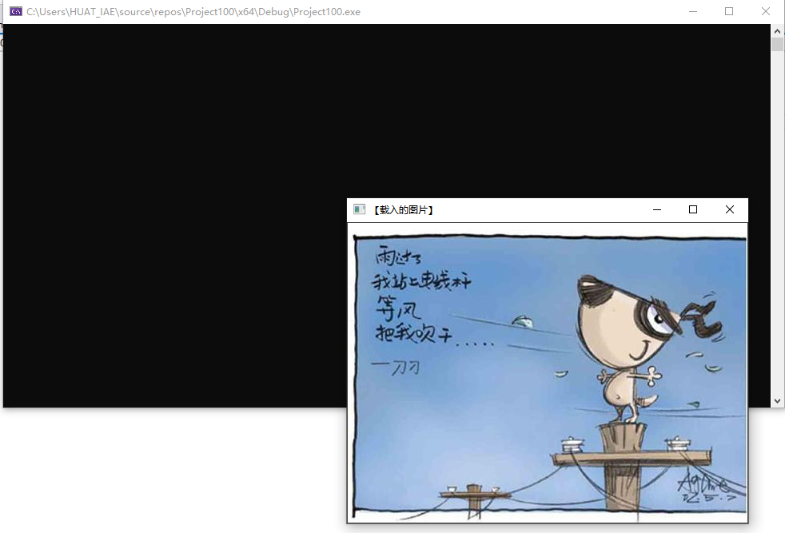
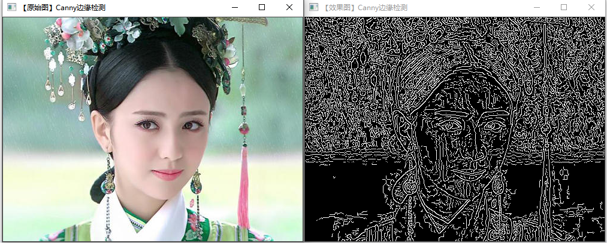
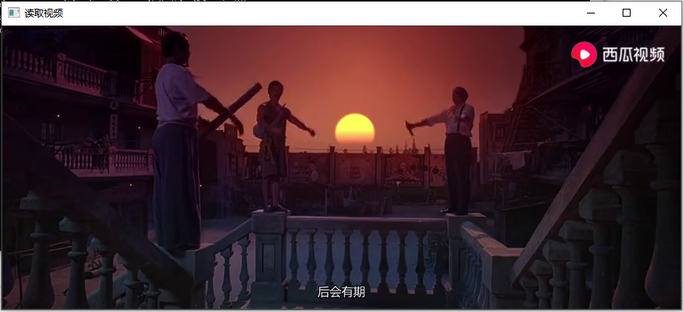
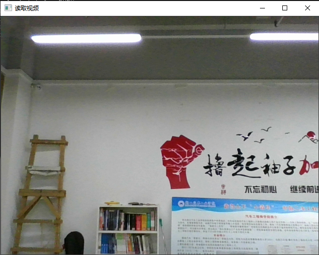
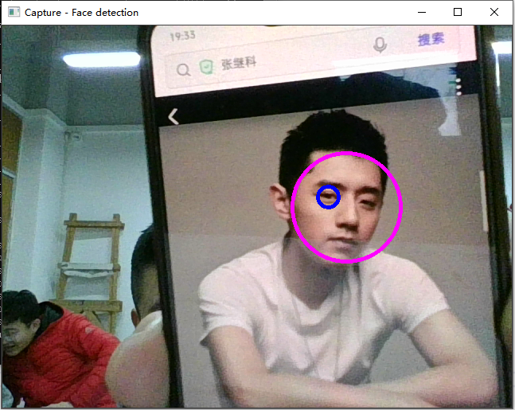

# OpenCV环境配置的测试用例
## 运行结果

# 图像显示
## 笔记
    #include<opencv2/opencv.hpp>一句为OpenCV头文件的包含;using namespace cv一句为命名空间的包含.并且调用waitKey函数等待按键按下，以便让图片窗口一直显示，直到有按键按下。
## 运行结果

# 图像腐蚀
## 笔记
    程序首先依然是载入和显示一幅图像，然后定义一个Mat类型的变量来获得getStructuringElement 函数的返回值，而getStructuringElement函数的返回值为指定形状和尺寸的结构元素（内核矩阵)。参数准备完毕，接着便可以调用erode 函数进行图像腐蚀操作，最后调用imshow函数进行显示，用 waitKey函数等待按键按下，以便能让窗口一直显示。
## 运行结果

# blur图像模糊
## 笔记
    void blur(InputArray src, OutputArray dst, Size ksize, Point anchor=Point(-1,-1), int borderType=BORDER_DEFAULT);

    InputArray src: 输入图像
    OutputArray dst: 输出图像
    Size ksize: 滤波模板kernel的尺寸，如Size(3,3)
    Point anchor=Point(-1, -1): 字面意思是锚点，也就是处理的像素位于kernel的什么位置，默认值为(-1, -1)即位于kernel中心点，如果没有特殊需要则不需要更改
    int borderType=BORDER_DEFAULT: 用于推断图像外部像素的某种边界模式，有默认值BORDER_DEFAULT
## 运行结果

# canny边缘检测
## 笔记
### cvtColor颜色空间转换函数 
    void cvtColor(
        InputArray src, // 输入图像
        OutputArray dst, // 输出图像
        int code, // 颜色映射码
        int dstCn = 0 // 输出的通道数 (0='automatic')
    );
    cvtColor()支持多种颜色空间之间的转换，目前常见的颜色空间均支持，并且在转换的过程中能够保证数据的类型不变，即转换后的图像的数据类型和位深与源图像一致。
### canny算子
    void Canny(InputArray image, OutputArray edges, double threshold,double threshold2,int apertureSize = 3,bool L2gradient = false)

    InputArray image：输入图像（8-bit）。
    OutputArray edges：输出的边缘图像。
    double threshold：第一个滞后性阈值
    double threshold2：第二个滞后性阈值
    int apertureSize：表示应用Sobel算子的孔径大小，默认值为3
    bool L2gradient：一个计算图像梯度幅值的标识，默认值false

## 运行结果

# 读取并播放视频
## 笔记
    cv::VideoCapture capture(const string& filename);  // 从视频文件读取 
    从文件（.MPG或.AVI格式）中读取视频，对象创建以后，OpenCV将会打开文件并做好准备读取它，如果打开成功，我们将可以开始读取视频的帧。
## 运行结果

# 调用摄像头采集图像
## 笔记
    VideoCapture capture(const string& filename)；是从视频文件读取，把参数改成0,就是从摄像头读取视频。
## 运行结果

# 彩色目标跟踪:Camshift
## 笔记
### onMouse函数
    函数原型：void onMouse( int event, int x, int y, int, void* )。

    在这个函数内，必须要设置一些基本的信息。比如鼠标初始位置，终止位置，确定好rect矩形的大小和位置信息。最后等待鼠标按键触发，传递参数x和y为鼠标点击的位置 坐标。
    用switch确定event有好几种鼠标触发方式。还要设置按键开关。这里是selectObject，一般是按下的时候为true，松开的时候为false。最好在每次按键触发的时候加入if条件，判断rect是否真的被触发或者触发的位置是否符合要求。

### createTrackbar滑动条
    CV_EXPORTS int createTrackbar( const string& trackbarname, const string& winname,int* value, int count,TrackbarCallback onChange=0,void* userdata=0);

    前两个参数分别指定了滑动条的名字以及滑动条附属窗口的名字。当滑动条被创建后，滑动条会被创建在窗口的顶部或者底部。另外，滑动条不会遮挡窗口中的图像。
    随后的两个为value，它是一个整数指针，当滑动条被拖动时，opencv会自动将当前位置所代表的值创递给指针指向的整数；另外一个参数count是一个整数数值，为滑动条所能表示的最大值。
    最后一个参数是一个指向回调函数的指针，当滑动条被拖动时，回调函数会自动被调用。这跟鼠标事件的回调函数实现类似。回调函数必须为CvTrackbarCallback格式，定义如下：

    void (*callback)(int position)

    这个回调函数不是必须的，所以如果不需要一个回调函数，可以将参数设置为NULL，没有回调函数，当滑动条被拖 动时，唯一的影响就是改变指针value所指向的整数值。
    highgui还提供了两个函数分别用来读取与设置滑动条的value值，不过前提是必须知道滑动条的名字。

    int cvGetTrackbarPos(const char* trackbar_name,const char * window_name);

    void cvSetTrackbarPos(const char* trackbar_name, const char * window_name,int pos);
### InRange函数
    检查数组元素是否在两个数组之间
    void cvInRange( const CvArr* src, const CvArr* lower, const CvArr* upper, CvArr* dst );

    src:第一个原数组
    lower:包括进的下边界数组
    upper:不包括进的上边界线数组
    dst:输出数组必须是 8u 或 8s 类型.

    函数 cvInRange 对输入的数组作范围检查,对于单通道数组：
    dst(I)=lower(I)0 <= src(I)0 < upper(I)0
    对二通道数组:
    dst(I)=lower(I)0 <= src(I)0 < upper(I)0 && lower(I)1 <= src(I)1 < upper(I)1
    以此类推,如果 src(I) 在范围内dst(I)被设置为 0xff (每一位都是 ‘1’)否则置0 。 除了输出数组所有数组必须是相同的类型相同的大小（或ROI大小）。

### calcHist函数来计算图像直方图。
    void calcHist(const Mat* arrays, int narrays, const int* channels, InputArray mask,OutputArray hist, int dims, const int* histSize, const float** ranges,bool uniform=true, bool accumulate=false )；

    arrays:输入的图像的指针，可以是多幅图像，所有的图像必须有同样的深度（CV_8U or CV_32F）。同时一副图像可以有多个channes。
    narrays:输入的图像的个数。
    channels:用来计算直方图的channes的数组。比如输入是2副图像，第一副图像有0，1，2共三个channel，第二幅图像只有0一个channel，那么输入就一共有4个channes，如果int channels[3] = {3, 2, 0}，那么就表示是使用第二副图像的第一个通道和第一副图像的第2和第0个通道来计算直方图。
    mask:掩码。如果mask不为空，那么它必须是一个8位（CV_8U）的数组，并且它的大小的和arrays[i]的大小相同，值为1的点将用来计算直方图。
    hist:计算出来的直方图
    dims:计算出来的直方图的维数。
    histSize:在每一维上直方图的个数。简单把直方图看作一个一个的竖条的话，就是每一维上竖条的个数。
    ranges:用来进行统计的范围。比如
    float rang1[] = {0, 20};
    float rang2[] = {30, 40};
    const float *rangs[] = {rang1, rang2};那么就是对0，20和30，40范围的值进行统计。
    uniform:每一个竖条的宽度是否相等。

## 运行结果

# 光流: optical flow
## 运行结果

# 追踪:lkdemo
## 运行结果

# 人脸识别: objectDetection
## 运行结果

# 支持向量机引导
## 运行结果

# printf函数的用法
## 运行结果

# 用imwrite函数生成png透明图
## 笔记
    imwrite函数
    CV_EXPORTS_W bool imwrite( const String& filename, InputArray img, const std::vector<int>& params = std::vector<int>());
    
    第一个参数，const String&类型的 filename填需要写入的文件名。注意带上后缀，如：***.jpg
    第二个参数，InputArray 类型的img，一般填一个Mat类型的图像数据。
    第三个参数，const std::vector& 类型的params，表示为特定格式保存的参数编码。它有默认值vector(),所以一般情况下不需要填写。
       对于JPEG格式的图片，这个参数表示从0到100 的图片质量(CV_IMWRITE_JPEG_QUALITY)，默认值是95。
       对于PNG格式的图片，这个参数表示压缩级别（CV_IMWRITE_PNG_COMPRESSION）从О到9。较高的值意味着更小的尺寸和更长的压缩时间，默认值是3。
       对于PPM，PGM，或PBM格式的图片，这个参数表示一个二进制格式标志（CV_IMWRITE_PXM_BINARY)，取值为0或1，默认值是1。
    imwrite函数用于将图像保存到指定的文件。图像格式是基于文件扩展名的，可保存的扩展名和imread中可以读取的图像扩展名一致。
## 运行结果

# 综合示例程序:图像的载入、显示与输出
## 笔记
### 图像的载入: imread() 函数
    原型:Mat imread(const string& filename, int flags = 1);
      filename : 图像名称
      flags: 载入标识，指定了一个加载图像的颜色类型
      CV_LOAD_IMAGE_GRAYSCALE – 0 : 将图像转换成灰度再返回
      CV_LOAD_IMAGE_COLOR – 1 : 默认值，彩色图像

### 图像的显示：imshow() 函数
    void imshow(const string& winname, InputArray mat);
      winname : 需要显示的窗口标识名称

### 创建窗口：namedWindow() 函数
    void namedWindow(const string& winname, int flags = WINDOW_AUTOSIZE);
       WINDOW_AUTOSIZE : 窗口大小自动调整以适应显示图像，切用户不可手动改变窗口大小
       WINDOW_NORMAL : 窗口大小可以被用户改变
       WINDOW_OPENGL : 窗口支持OpenGL

### 删除窗口：
       destroyWindow(const string & winname);
       destroyAllWindows();

# 为程序界面添加滑动条
## 笔记
    createTrackbar( )函数
    createTrackbar函数用于创建一个可以调整数值的滑动条（常常也被称作轨迹条）,并将滑动条附加到指定的窗口上，使用起来很方便。他往往会和一个回调函数配合起来混合使用。

    int createTrackbar(conststring& trackbarname,conststring& winname,int* value, int count, TrackbarCallback onChange=0, void* userdata=0);

    const string&类型的trackbarname,轨迹条的名字，用来代表我们创建的轨迹条。
    const string&类型的winname,窗口的名字，对应namedWindow()创建窗口时填的某一个窗口名。
    int*类型的value,指向整型的指针，表示滑块位置。在创建时，滑块的初始位置就是该变量当前的值。
    int类型的count,表示滑块可以达到的最大位置的值。滑块最小位置的值始终为0。
    TrackbarCallback类型的onChange,它有默认值0。这是一个指向回调函数的指针，每次滑块位置改变时，这个函数都会进行回调。并且这个函数的原型必须为voidXXXX(int,void*);第一个参数是轨迹条的位置，第二个参数是用户数据。如果回调是NULL 指针，则表示没有回调函数的调用，仅第三个参数 value 有变化。
    void*类型的userdata,也有默认值0。这个参数是用户传给回调函数的数据，用来处理轨迹条事件。如果使用的第三个参数value实参是全局变量的话，完全可以不去管这个userdata参数。

## 运行结果

# 鼠标操作
## 笔记
    setMouseCallback函数
    openCv中的鼠标回调函数是为了处理鼠标操作消息的响应事件，函数原型为：
      C++:   void   SetMouseCallback(const string & winname,MouseCallback onMouse,void*
      userdata=0)

    第一个参数：const string & 类型的winname ，窗口的名字；
    第二个参数： MouseCallback 类型的onMouse，指定窗口里每次鼠标事件发生时的时候被调用的函数指针。

    这个函数的原型的大概形势为：void Foo(int event ,int x ,int y ,int flags  ,void  * param)。event 是鼠标响应类型，CV_EVENT_*变量之一：
       EVENT_MOUSEMOVE 滑动 
       EVENT_LBUTTONDOWN 左击 
       EVENT_RBUTTONDOWN 右击
       EVENT_MBUTTONDOWN 中键点击 
       EVENT_LBUTTONUP 左键放开
       EVENT_RBUTTONUP 右键放开
       EVENT_LBUTTONDBLCLK 左键双击 
       EVENT_RBUTTONDBLCLK 右键双击 
       EVENT_MBUTTONDBLCLK 中键双击

    x和y是鼠标指针在图像坐标系的坐标（不是窗口坐标系）。

    flags是CV_EVENT_FLAG的组合，flag的状态有：

       EVENT_FLAG_LBUTTON 左键拖拽
       EVENT_FLAG_RBUTTON 右键拖拽 
       EVENT_FLAG_MBUTTON 中键拖拽 
       EVENT_FLAG_CTRLKEY 按住Ctrl不放 
       EVENT_FLAG_SHIFTKEY 按住Shift不放 
       EVENT_FLAG_ALTKEY 按住Alt不放 

    param是用户定义的传递到setMouseCallback函数调用的参数。

    第三个参数：void *userdata   传给回调函数的参数（onMouse）。

## 运行结果
