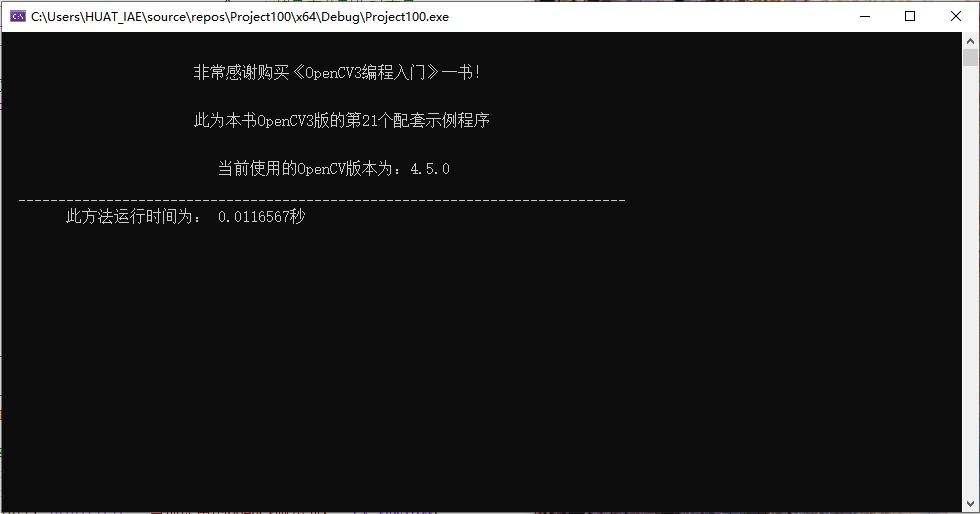
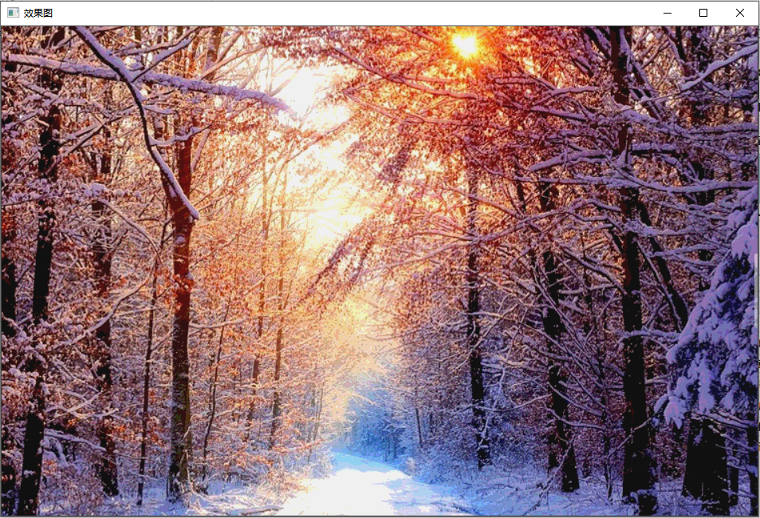
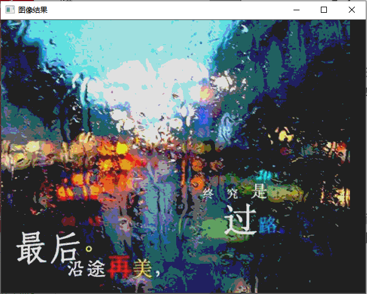
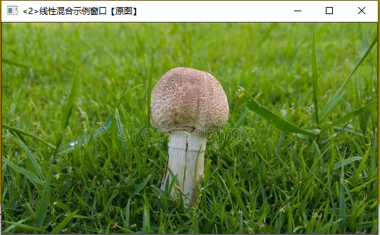
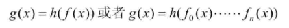
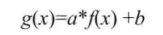
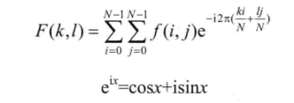
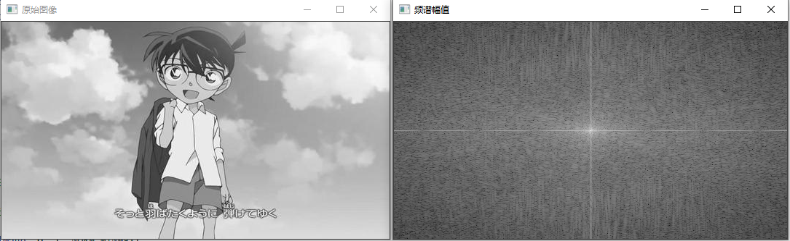
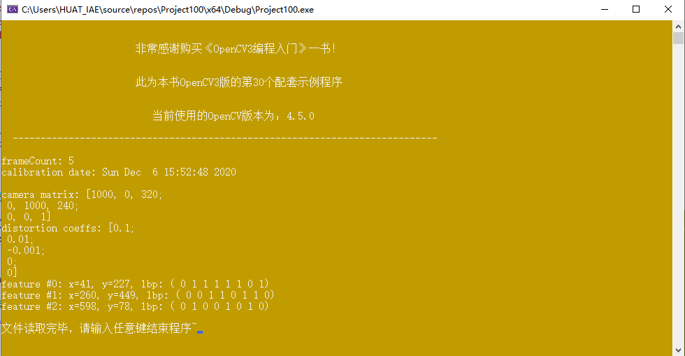

# 基础图像容器Mat类的使用
## 运行结果

# 基本图形的绘制
## 笔记
### DrawEllipse()函数的写法
    void DrawEllipse(Mat img, double angle){
	int thickness = 2;
	int lineType = 8;
	ellipse(img,
		Point(WINDOW_WIDTH / 2, WINDOW_WIDTH / 2),
		Size(WINDOW_WIDTH / 4, WINDOW_WIDTH / 16),
		angle,
		0,
		360,
		Scalar(255, 129, 0),
		thickness,
		lineType);
    }
函数DrawEIIipse调用了OpenCV中的ellipse函数，将椭圆画到图像img上，椭圆中心为点(WINDOW_WIDTH/2.0,WINDOW_WIDTH/2.0)，并且大小位于矩形(WINDOW_WIDTH/4.0,WINDOW_WIDTH/16.0）内。椭圆旋转角度为angle,扩展的弧度从0度到360度。图形颜色为scalar（255，129，0）代表的蓝色，线宽(thickness)为2，线型(IineType)为8（8联通线型)。
### DrawFilledCircle()函数的写法
    void DrawFilledCircle(Mat img, Point center){
	int thickness = -1;
	int lineType = 8;
	circle(img,
		center,
		WINDOW_WIDTH / 32,
		Scalar(0, 0, 255),
		thickness,
		lineType);
    }
函数DrawFilledCircle()调用了OpenCV中的circle()函数，将圆画到图像img上，圆心由点center定义，元的半径为WINDOW_WIDTH/32,元的颜色为Scalar(0,0,255)，按BGR的格式为红色，线粗定义为thickness=-1,因此绘制的圆是实心的。
### DrawPolygon()函数的写法
    void DrawPolygon(Mat img){
	int lineType = 8;

	//创建一些点
	Point rookPoints[1][20];
	rookPoints[0][0] = Point(WINDOW_WIDTH / 4, 7 * WINDOW_WIDTH / 8);
	rookPoints[0][1] = Point(3 * WINDOW_WIDTH / 4, 7 * WINDOW_WIDTH / 8);
	rookPoints[0][2] = Point(3 * WINDOW_WIDTH / 4, 13 * WINDOW_WIDTH / 16);
	rookPoints[0][3] = Point(11 * WINDOW_WIDTH / 16, 13 * WINDOW_WIDTH / 16);
	rookPoints[0][4] = Point(19 * WINDOW_WIDTH / 32, 3 * WINDOW_WIDTH / 8);
	rookPoints[0][5] = Point(3 * WINDOW_WIDTH / 4, 3 * WINDOW_WIDTH / 8);
	rookPoints[0][6] = Point(3 * WINDOW_WIDTH / 4,  WINDOW_WIDTH / 8);
	rookPoints[0][7] = Point(26 * WINDOW_WIDTH / 40,  WINDOW_WIDTH / 8);
	rookPoints[0][8] = Point(26 * WINDOW_WIDTH / 40,  WINDOW_WIDTH / 4);
	rookPoints[0][9] = Point(22 * WINDOW_WIDTH / 40,  WINDOW_WIDTH / 4);
	rookPoints[0][10] = Point(22 * WINDOW_WIDTH / 40,  WINDOW_WIDTH / 8);
	rookPoints[0][11] = Point(18 * WINDOW_WIDTH / 40,  WINDOW_WIDTH / 8);
	rookPoints[0][12] = Point(18 * WINDOW_WIDTH / 40,  WINDOW_WIDTH / 4);
	rookPoints[0][13] = Point(14 * WINDOW_WIDTH / 40,  WINDOW_WIDTH / 4);
	rookPoints[0][14] = Point(14 * WINDOW_WIDTH / 40,  WINDOW_WIDTH / 8);
	rookPoints[0][15] = Point( WINDOW_WIDTH / 4,  WINDOW_WIDTH / 8);
	rookPoints[0][16] = Point( WINDOW_WIDTH / 4, 3 * WINDOW_WIDTH / 8);
	rookPoints[0][17] = Point(13 * WINDOW_WIDTH / 32, 3 * WINDOW_WIDTH / 8);
	rookPoints[0][18] = Point(5 * WINDOW_WIDTH / 16, 13 * WINDOW_WIDTH / 16);
	rookPoints[0][19] = Point(3 * WINDOW_WIDTH / 4, 13 * WINDOW_WIDTH / 16);

	const Point* ppt[1] = { rookPoints[0] };
	int npt[] = { 20 };

	fillPoly(img,
		ppt,
		npt,
		1,
		Scalar(255, 255, 255),
		lineType);
    }
函数DrawPolygon()调用了OpenCV中的fillPoly函数，用于将多边形画到图像img上，其中多边形的顶点集为ppt，要绘制的多边形顶点数目为npt,要绘制的多边形数量仅为1，多边形的颜色定义为Scalar(255,255,255)。
### DrawLine()函数的写法
    void DrawLine(Mat img, Point start, Point end){
	int thickness = 2;
	int lineType = 8;
	line(img,
		start,
		end,
		Scalar(0, 0, 0),
		thickness,
		lineType);
    }
此函数调用了OpenCV中的line函数，用于在图像img上画一条从点start到end的直线段，显得颜色为Scalar(0,0,0)代表的为黑色，线的粗细thickness为2，且此线为8联通（lineType=8)。
## 运行结果

# 操作图像中像素的方法一:用指针访问像素
## 笔记
    //方法一：指针访问C操作符[]
    void colorReduce(Mat& inputImage, Mat& outputImage, int div){
	//参数准备
	outputImage = inputImage.clone();
	int rowNumber = outputImage.rows;
	int colNumber = outputImage.cols*outputImage.channels();

	//双重循环
	for (int i = 0; i < rowNumber; i++)
	 {
		//获取第i行的首地址
		uchar * data = outputImage.ptr<uchar>(i);
		for (int j = 0; j < colNumber; j++)
		{
			data[j] = data[j] / div*div + div / 2;
		}
	 }
    }
    Mat类有若干成员函数可以获取图像的属性。公有成员变量cols和rows给出了图像的宽和高，而成员函数channels()用于返回图像的通道数。灰度图的通道数为1,彩色图的通道数为3。

    每行的像素值由以下语句得到：
    int colNumber = outputImage.cols*outputImage.channels();//列数*通道数=每一行元素的个数

    为了简化指针运算，Mat类提供了ptr函数可以得到图像任意行的首地址。ptr是一个模板函数，它返回第i行的首地址：
    uchar* data=outputlmage.ptr<uchar>(i)；//获取第i行的首地址

    而双层循环内部的那句处理像素的代码，我们可以等效地使用指针运算从一列移动到下一列。所以，也可以这样来写：
    data++=*data/div*div+div/2;

## 运行结果

# 操作图像中像素的方法二:用迭代器操作像素
## 笔记
    //方法二：迭代器
    void colorReduce(Mat& inputImage, Mat& outputImage, int div){
	//参数准备
	outputImage = inputImage.clone();
	//获取迭代器
	Mat_<Vec3b>::iterator it = outputImage.begin<Vec3b>();
	Mat_<Vec3b>::iterator itend = outputImage.end<Vec3b>();

	//存取彩色图像像素
	for (; it != itend; it++)
	 {
		//开始处理每个像素
		(*it)[0] = (*it)[0] / div*div + div / 2;
		(*it)[1] = (*it)[1] / div*div + div / 2;
		(*it)[2] = (*it)[2] / div*div + div / 2;
	 }
    }
## 运行结果

# 操作图像中像素的方法三:动态地址计算
## 笔记
    //方式三：动态地址法
    void colorReduce(Mat& inputImage, Mat& outputImage, int div){
	//参数准备
	outputImage = inputImage.clone();
	int rowNumber = outputImage.rows;
	int colNumber = outputImage.cols;

	//存取彩色图像像素
	for (int i = 0; i < rowNumber; i++)
	 {
		for (int j = 0; j < colNumber; j++)
		{
			//处理像素
			outputImage.at<Vec3b>(i, j)[0] = outputImage.at<Vec3b>(i, j)[0] / div*div + div / 2;
			outputImage.at<Vec3b>(i, j)[1] = outputImage.at<Vec3b>(i, j)[1] / div*div + div / 2;
			outputImage.at<Vec3b>(i, j)[2] = outputImage.at<Vec3b>(i, j)[2] / div*div + div / 2;
		}
	 }
    }
    Mat类中的cols和rows给出了图像的宽和高。而成员函数at(int y，int x)可以用来存取图像元素，但是必须在编译期知道图像的数据类型。需要注意的是，我们一定要确保指定的数据类型要和矩阵中的数据类型相符合，因为at方法本身不会对任何数据类型进行转换。

    对于彩色图像，每个像素由三个部分构成；蓝色通道、绿色通道和红色通道(BGR)。因此，对于一个包含彩色图像的Mat，会返回一个由三个8位数组成的向量。OpenCV将此类型的向量定义Vec3b，即由三个unsignedchar组成的向量。这也解释了为什么存取彩色图像像素的代码可以写出如下形式：
    image.at<Vec3b>(j,i)[channel]=value;

    其中，索引值channel标明了颜色通道号。

    另外需要冉次提醒大家的是，OpenCV中的彩色图像不是以RGB的顺序存放的，而是BGR，所以程序中的outputImage.at(i,j)[0]代表的是该点的B分量。同理还有(*it)[0]。
## 运行结果

# 遍历图像中像素的14种方法
## 运行结果

# 初级图像混合
## 笔记
### ROI_AddImage()函数
    //描述：利用感兴趣区域ROI实现图像叠加
    bool  ROI_AddImage()
    {
 
    // 【1】读入图像
    Mat srcImage1= imread("dota_pa.jpg");
    Mat logoImage= imread("dota_logo.jpg");
    if( !srcImage1.data ) { qDebug()<<"读取srcImage1错误~！ \n"<<endl; return false; }
    if( !logoImage.data ) { qDebug()<<"读取logoImage错误~！ \n"<<endl; return false; }
 
    // 【2】定义一个Mat类型并给其设定ROI区域
    Mat imageROI= srcImage1(Rect(200,250,logoImage.cols,logoImage.rows));
 
    // 【3】加载掩模（必须是灰度图）
    Mat mask= imread("dota_logo.jpg",0);
 
    //【4】将掩膜拷贝到ROI
    logoImage.copyTo(imageROI,mask);
 
    // 【5】显示结果
    namedWindow("<1>利用ROI实现图像叠加示例窗口");
    imshow("<1>利用ROI实现图像叠加示例窗口",srcImage1);
 
    return true;
    }

    这个函数首先是载入了两张jpg图片到srclmage1和logolmage中,然后定义了一个Mat类型的imageROI,并使用 Rect设置其感兴趣区域为srcimage1中的一块区域,将imageROI和srclmage1关联起来。接着定义了一个Mat类型的mask并读入dota_logo.jpg,顺势使用Mat::copyTo把mask中的内容复制到imageROI中,于是就得到了最终的效果图.namedWindow和imshow配合使用,显示出最终的结果 

### addWeighted函数
    这个函数的作用是，计算两个数组（图像阵列）的加权和。原型如下：
    void addWeighted(InputArray src1, double alpha, InputArray src2, double beta, double gamma, OutputArray dst, int dtype=-1);

    第一个参数，InputArray类型的src1，表示需要加权的第一个数组，常常填一个Mat。
    第二个参数，alpha，表示第一个数组的权重
    第三个参数，src2，表示第二个数组，它需要和第一个数组拥有相同的尺寸和通道数。
    第四个参数，beta，表示第二个数组的权重值。
    第五个参数，dst，输出的数组，它和输入的两个数组拥有相同的尺寸和通道数。
    第六个参数，gamma，一个加到权重总和上的标量值。看下面的式子自然会理解。
    第七个参数，dtype，输出阵列的可选深度，有默认值-1。;当两个输入数组具有相同的深度时，这个参数设置为-1（默认值），即等同于src1.depth（）。

    如果用数学公式来表达，addWeighted函数计算如下两个数组（src1和src2）的加权和，得到结果输出给第四个参数。即addWeighted函数的作用可以被表示为为如下的矩阵表达式为：
                  dst = src1[I]*alpha+ src2[I]*beta + gamma;
    其中的I，是多维数组元素的索引值。而且，在遇到多通道数组的时候，每个通道都需要独立地进行处理。另外需要注意的是，当输出数组的深度为CV_32S时，这个函数就不适用了，这时候就会内存溢出或者算出的结果压根不对。

### LinearBlending()函数
    bool LinearBlending()
    {
       //【0】定义一些局部变量
       double alphaValue = 0.5;
       double betaValue;
       Mat srcImage2, srcImage3, dstImage;
 
       //【1】读取图像 ( 两幅图片需为同样的类型和尺寸 )
       srcImage2= imread("mogu.jpg");
       srcImage3= imread("rain.jpg");
 
       if(!srcImage2.data ) { printf("你妹，读取srcImage2错误~！ \n"); return false; }
       if(!srcImage3.data ) { printf("你妹，读取srcImage3错误~！ \n"); return false; }
 
       //【2】做图像混合加权操作
       betaValue= ( 1.0 - alphaValue );
       addWeighted(srcImage2, alphaValue, srcImage3, betaValue, 0.0, dstImage);
 
       //【3】创建并显示原图窗口
       namedWindow("<2>线性混合示例窗口【原图】", 1);
       imshow("<2>线性混合示例窗口【原图】", srcImage2 );
 
       namedWindow("<3>线性混合示例窗口【效果图】", 1);
       imshow("<3>线性混合示例窗口【效果图】", dstImage );
 
       return true;
      
    }
    首先当然是定义一些局部变量，alpha值beta值，三个Mat类型的变量
    //【0】定义一些局部变量
       double alphaValue = 0.5;
       double betaValue;
       Mat srcImage2, srcImage3, dstImage;

    读取两幅图像并作错误处理
    //读取图像 ( 两幅图片需为同样的类型和尺寸 )
       srcImage2= imread("mogu.jpg");
       srcImage3= imread("rain.jpg");
       if(!srcImage2.data ) { printf("读取srcImage2错误~！ \n"); return false; }
       if(!srcImage3.data ) { printf("读取srcImage3错误~！ \n"); return false; }
       在这里需要注意的是，因为我们是对 srcImage1和srcImage2求和，所以它们必须要有相同的尺寸（宽度和高度）和类型，不然多余的部分没有对应的“伴”，肯定会出问题。

    进行图像混合加权操作 
    //【2】进行图像混合加权操作
      betaValue = ( 1.0 - alphaValue );
      addWeighted( srcImage2, alphaValue, srcImage3,betaValue, 0.0, dstImage);
      其中beta值为1-alpha，gamma值为0。
      载入图像后，我们就可以来生成混合图像，也就是之前公式中的g(x)。为此目的，使用函数 addWeighted 可以很方便地实现，也就是因为 addWeighted 进行了如下计算：
      这里的对应于addWeighted的第2个参数alpha
      这里的对应于addWeighted的第4个参数beta
      这里的对应于addWeighted的第5个参数，在上面代码中被我们设为0.0。

      创建显示窗口，显示图像
      // 【3】创建并显示原图窗口
       namedWindow("<2>线性混合示例窗口【原图】", 1);
       imshow("<2>线性混合示例窗口【原图】", srcImage2 );
 
       namedWindow("<3>线性混合示例窗口【效果图】", 1);
       imshow("<3>线性混合示例窗口【效果图】", dstImage );

## 运行结果

# 多通道图像混合
## 笔记
### split函数
    将一个多通道数组分离成几个单通道数组。ps：这里的array按语境译为数组或者阵列。
    split函数的C++版本有两个原型，他们分别是：
     C++: void split(const Mat& src, Mat*mvbegin);
     C++: void split(InputArray m,OutputArrayOfArrays mv);
    第一个参数，InputArray类型的m或者const Mat&类型的src，填我们需要进行分离的多通道数组。
    第二个参数，OutputArrayOfArrays类型的mv，填函数的输出数组或者输出的vector容器。

	split函数分割多通道数组转换成独立的单通道数组，按公式来看就是这样：

### merge函数
    merge()函数的功能是split()函数的逆向操作，将多个数组组合合并成一个多通道的数组。它通过组合一些给定的单通道数组，将这些孤立的单通道数组合并成一个多通道的数组，从而创建出一个由多个单通道阵列组成的多通道阵列。它有两个基于C++的函数原型：
     C++: void merge(const Mat* mv, size_tcount, OutputArray dst)
     C++: void merge(InputArrayOfArrays mv,OutputArray dst)
    第一个参数，mv，填需要被合并的输入矩阵或vector容器的阵列，这个mv参数中所有的矩阵必须有着一样的尺寸和深度。
    第二个参数，count，当mv为一个空白的C数组时，代表输入矩阵的个数，这个参数显然必须大于1.
    第三个参数，dst，即输出矩阵，和mv[0]拥有一样的尺寸和深度，并且通道的数量是矩阵阵列中的通道的总数。
	merge函数的功能是将一些数组合并成一个多通道的数组。关于组合的细节，输出矩阵中的每个元素都将是输出数组的串接，其中，第i个输入数组的元素被视为mv[i]。 c一般用其中的Mat::at（）方法对某个通道进行存取,也就是这样用channels.at(0)。
    这里的Mat::at（）方法，返回一个引用到指定的数组元素。注意是引用，相当于两者等价，修改其中一个另一个跟着变。

## 运行结果

# 图像对比度、亮度值调整
## 笔记
### 亮度和对比度调整的理论依据
    算子的一般形式：

    最两种常用的点操作（或者说点算子），很显然，是乘上一个常数（对应对比度的调节）以及加上一个常数（对应亮度值的调节）。用公式表示出来就是这样：

    
	参数f(x)表示源图像像素。
    参数g(x) 表示输出图像像素。
    参数a（需要满足a>0）被称为增益（gain），常常被用来控制图像的对比度。
    参数b通常被称为偏置（bias），常常被用来控制图像的亮度。
    
    改写这个式子：

    
	其中，i和j表示像素位于第i行和第j列 。

### 访问图片中的像素
    我们需要访问图像的每一个像素。因为是对GBR图像进行运算，每个像素有三个值（G、B、R），所以我们必须分别访问它们（PS:OpenCV中的图像存储模式为GBR）。以下是访问像素的代码片段，三个for循环解决问题：
       //三个for循环，执行运算 new_image(i,j) =a*image(i,j) + b
       for(int y = 0; y < image.rows; y++ )
       {
        for(int x = 0; x < image.cols; x++ )
         {
           for(int c = 0; c < 3; c++ )
            {
               new_image.at<Vec3b>(y,x)[c]= saturate_cast<uchar>( (g_nContrastValue*0.01)*(image.at<Vec3b>(y,x)[c] ) + g_nBrightValue );
            }
         }
	   }
       
    为了访问图像的每一个像素，我们使用这样的语法： image.at<Vec3b>(y,x)[c].其中，y是像素所在的行， x图像素所在的列， c是R、G、B（对应0、1、2）其中之一。
    因为我们的运算结果可能超出像素取值范围（溢出），还可能是非整数（如果是浮点数的话），所以我们要用saturate_cast对结果进行转换，以确保它为有效值。
    这里的a也就是对比度，一般为了观察的效果，取值为0.0到3.0的浮点值，但是我们的轨迹条一般取值都会整数，所以在这里我们可以，将其代表对比度值的nContrastValue参数设为0到300之间的整型，在最后的式子中乘以一个0.01，这样就可以完成轨迹条中300个不同取值的变化。所以在式子中，我们会看到saturate_cast<uchar>( (g_nContrastValue*0.01)*(image.at<Vec3b>(y,x)[c] ) + g_nBrightValue )中的g_nContrastValue*0.01。
## 运行结果

# 离散傅里叶变换
## 笔记
    傅里叶变换就是一个用来将函数分解的工具二维图像的傅里叶变换可以用以下数学公式表达

    式中f是空间域(spatial domain)值，F是频域(frequency domain)值。转换之后的频域值是复数，因此，显示傅里叶变换之后的结果需要使用实数图像(real image)加虚数图像(complex image)，或者幅度图像(magitude image)加相位图像(phase image)的形式。在实际的图像处理过程中，仅仅使用了幅度图像，因为幅度图像包含了原图像的几乎所有我们需要的几何信息。然而，如果想通过修改幅度图像或者相位图像的方法来间接修改原空间图像，需要使用逆傅里叶变换得到修改后的空间图像，这样就必须同时保留幅度图像和相位图像了。

    在频域里面，对于一幅图像，高频部分代表了图像的细节、纹理信息；低频部分代表了图像的轮廓信息。如果对一幅精细的图像使用低通滤波器，那么滤波后的结果就只剩下轮廓了。这与信号处理的基本思想是相通的。如果图像受到的噪声恰好位于某个特定的“频率”范围内，则可以通过滤波器来恢复原来的图像。傅里叶变换在图像处理中可以做到图像増强与图像去噪、图像分割之边缘检测、图像特征提取、图像压缩等。

### dft()傅里叶变换
    void dft(InputArray src,OutputArray dst ,int flags=0,int nonzeroRows=0)
    第一个参数：输入图像
    第二个参数：输出图像，前两个参数我们已经很熟悉了
    第三个参数：转换的标识符，默认值为0，此时默认的应该是正向变换，还有很多其他的标识符，比如DFT_INVERSE（用一维或者二维逆变换代替默认的正向变换）
    第四个参数：默认值为0，如果此参数设为非0时（最好是取值为想要处理的那一行的值，比如C.rows）,函数可以进行更高效的处理，节省时间开销。

### getOptimalDFTSize()返回DFT的最佳尺寸
    Int getOptimalDFTSize(int vecsize)
    此函数唯一的一个参数表示的是向量尺寸，为了提高离散傅里叶变换的运行速度，需要扩充图像，而具体扩充多少，由这个函数来计算得到

### copyMakeBorder()扩充图像边界
    Void copyMakeBorder(InputArray src,OutputArray dst ,int top,int bottom,int left,int right,int borderType,const Scalar&value=Scalar())
    第一个参数：输入图像
    第二个参数：输出图像
    第3-6个参数：分别表示在源图像的上下左右四个方向上扩充多少个像素
    第七个参数：边界类型，常取值为BORDER_CONSTANT
    第八个参数：扩充部分的像素值
### Magnitude()计算二维矢量的幅值
    Void magnitude(InputArray x,InputArray y,OutputArray magnitude)
    第一个参数：表示矢量的浮点型X的坐标值，也就是实部
    第二个参数：表示矢量的浮点型Y的坐标值，也就是虚部
    第三个参数：输出的幅值，和第一个参数X有着同样的尺寸和类型
### Log()计算自然对数
    Void log(InputArray src,OutputArray dst)
    第一个参数为输入的源图像
    第二个参数为输出的对数值
### Normalize()矩阵归一化 
    Void normalize(InputArray src,OutputArray dst,double alpha=1,double bata=0,int norm_type=NORM_L2,int dtype=-1,InputArraymask=noArray())
    第一个参数：输入图像
    第二个参数：输出图像
    第三个参数：归一化后的最大值，默认为1
    第四个参数：归一化后的最小值，默认为0
    第五个参数：归一化类型，默认NORM_L2
    第六个参数：默认值-1，当此参数取负值时，输出矩阵和src有同样的类型，否则，它和src有同样的通道数，且此时图像深度为CV_MAT_DEPTH
    第七个参数：可选的操作掩膜，有默认值noArray()
## 运行结果

# XML和YAML文件
## 笔记
### XML和YAML文件简介
    XML（eXtensible Markup Lauguage）是一种元标记语言，所谓的“元标记”就是开发者可以根据自身需要定义自己的标记。XML是一种语义/结构化语言，它描述了文档的结构和语义 
    YAML（Ain’t a Markup Language）强调这种语言是以数据为中心的。YAML是一种可读性高，用来表示资料序列的格式 
### FileStorage 类操作文件的使用引导
    一般使用如下过程来写入或读取数据到XML或YAML文件中
    1.实例化一个FileStorage类的对象，用默认带参数的构造函数完成初始化。或者用FileStorage::open()成员函数辅助初始化
    2.使用流操作<<进行文件写入操作，或者>>进行文件读取操作。类似c++中的文件输入输出流
    3.使用FileStorage::release()函数折构掉FileStorage类对象，同时关闭文件。

#### 准备文件写操作
    FileStorage是OpenCV中XML和YAML文件的存储类，封装了所有有关信息
    构造函数为FileStorage：：FileStorage ，有两个重载
		FileStorage::FileStorage()
        FileStorage::FileStorage(const string& source ,int flags,const string& encoding=string)

    实际中如何使用？(xml和yaml文件操作一致，下面使用方法换后缀后即可通用)
	第一种：FileStorage fs("abc.xml", FileStorage::WRITE);
	第二种：FileStorage fs;
           fs.open("abc.xml", FileStorage::WRITE);
		
#### 准备文件读操作
    第一种：FileStorage fs("abc.xml", FileStorage::READ);
	第二种：FileStorage fs;
           fs.open("abc.xml", FileStorage::READ);

#### 进行读写操作
      重定向符号：  <<  >>

#### 文件关闭
     fs.release();  //显式关闭文件

## XML和YAML文件的写入运行结果

## XML和YAML文件的读取运行结果

