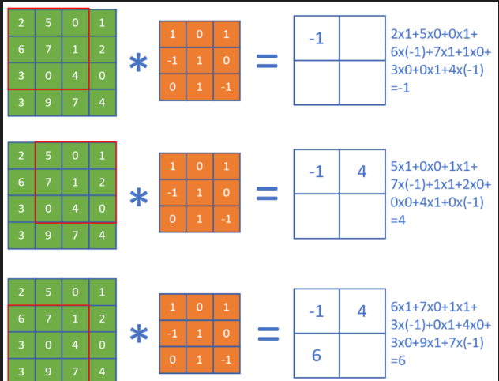

# 第八步  卷积神经网络

## 应用领域 

卷积神经网络（CNN，Convolutional Neural Net)是神经网络的类型之一，在图像识别和分类领域中取得了非常好的效果。

## 卷积神经网络的典型结构(重点理解)


它的层级结构：

1. 原始的输入是一张图片，可以是彩色的，也可以是灰度的或黑白的。这里假设是只有一个通道的图片，目的是识别0~9的手写体数字；
2. 第一层卷积，我们使用了4个卷积核，得到了4张feature map；激活函数层没有单独画出来，这里我们紧接着卷积操作使用了Relu激活函数；
3. 第二层是池化，使用了Max Pooling方式，把图片的高宽各缩小一倍，但仍然是4个feature map；
4. 第三层卷积，我们使用了4x6个卷积核，其中4对应着输入通道，6对应着输出通道，从而得到了6张feature map，当然也使用了Relu激活函数；
5. 第四层再次做一次池化，现在得到的图片尺寸只是原始尺寸的四分之一左右；
6. 第五层把第四层的6个图片展平成一维，成为一个fully connected层；
7. 第六层再接一个小一些的fully connected层；
8. 最后接一个softmax函数，判别10个分类。

综上所述一个典型的卷积神经网络中，会至少包含以下几个层：

输入层（Input Layer）：主要是对原始的图像数据进行预处理

卷积层（Convolution Layers）：可以看作是输入样本和卷积核的内积运算。从前一层提取移位不变特征。即当输入数据是图像的时候，卷积层会以3维数据的形式接收输入数据，并同样以3维数据的形式输出至下一层。因此，在CNN中，可以（有可能）正确理解图像等具有形状的数据。注：卷积层的输入和输出数据通常又被称为特征图（Feature Map）。卷积层的输入数据称为输入特征图（Input Feature Map），输出数据称为输出特征图（Output Feature Map）。

池化层（Pooling Layers）：作用是减小卷积层产生的特征图尺寸。将前一层的多个单元的激活组合为一个单元。池化是缩小高、长方向上的空间的运算，通常减小一半。

全连接层（Fully Connected Layers）：收集空间扩散信息

输出层（Output Layer）：选择类
## 卷积核是什么，作用是什么

卷积核其实就是一个小矩阵，类似这样：

```
1.1  0.23  -0.45
0.1  -2.1   1.24
0.74 -1.32  0.01
```

这是一个3x3的卷积核，还会有1x1、5x5、7x7、9x9、11x11的卷积核。在卷积层中，我们会用输入数据与卷积核相乘，得到输出数据，就类似全连接层中的Weights一样，所以卷积核里的数值，也是通过反向传播的方法学习到的。

各个卷积核的作用

|序号|名称|说明|
|---|---|---|
|1|锐化|如果一个像素点比周围像素点亮，则此算子会令其更亮|
|2|检测竖边|检测出了十字线中的竖线，由于是左侧和右侧分别检查一次，所以得到两条颜色不一样的竖线|
|3|周边|把周边增强，把同色的区域变弱，形成大色块|
|4|Sobel-Y|纵向亮度差分可以检测出横边，与横边检测不同的是，它可以使得两条横线具有相同的颜色，具有分割线的效果|
|5|Identity|中心为1四周为0的过滤器，卷积后与原图相同|
|6|横边检测|检测出了十字线中的横线，由于是上侧和下侧分别检查一次，所以得到两条颜色不一样的横线|
|7|模糊|通过把周围的点做平均值计算而“杀富济贫”造成模糊效果|
|8|Sobel-X|横向亮度差分可以检测出竖边，与竖边检测不同的是，它可以使得两条竖线具有相同的颜色，具有分割线的效果|
|9|浮雕|形成大理石浮雕般的效果|

## 卷积的前向计算

### 数学定义

#### 连续定义

$$h(x)=(f*g)(x) = \int_{-\infty}^{\infty} f(t)g(x-t)dt \tag{1}$$

卷积与傅里叶变换有着密切的关系。利用这点性质，即两函数的傅里叶变换的乘积等于它们卷积后的傅里叶变换，能使傅里叶分析中许多问题的处理得到简化。

#### 离散定义

$$h(x) = (f*g)(x) = \sum^{\infty}_{t=-\infty} f(t)g(x-t) \tag{2}$$

**书上后面的例子，是根据例子列一个式子最后转化为上面两个公式其中一种，转化为哪一种就要看看，该例子属于离散离散型的概率还是连续性的**

#### 单入单出的二维卷积

$$
h(i,j) = (I*K)(i,j)=\sum_m \sum_n I(i-m,j-n)K(m,n) \tag{3}
$$

公式3的成立，是因为我们将Kernal进行了翻转。在神经网络中，一般会实现一个互相关函数(corresponding function)，而卷积运算几乎一样，但不反转Kernal：

$$
h(i,j) = (I*K)(i,j)=\sum_m \sum_n I(i+m,j+n)K(m,n) \tag{4}
$$

在图像处理中，自相关函数和互相关函数定义如下：

- 自相关：设原函数是f(t)，则$h=f(t) \star f(-t)$，其中$\star$表示卷积
- 互相关：设两个函数分别是f(t)和g(t)，则$h=f(t) \star g(-t)$



## 卷积核的实现

卷积核，实际上和全连接层一样，是权重矩阵加偏移向量的组合，区别在于全连接层中的权重矩阵是二维的，偏移矩阵是列向量，而卷积核的权重矩阵是四维的，偏移矩阵是也是列向量。

```Python
#说到底就是初始化，一个是偏移量，一个是权重
class ConvWeightsBias(WeightsBias_2_1):
    def __init__(self, output_c, input_c, filter_h, filter_w, init_method, optimizer_name, eta):
        self.FilterCount = output_c
        self.KernalCount = input_c
        self.KernalHeight = filter_h
        self.KernalWidth = filter_w
        ...

    def Initialize(self, folder, name, create_new):
        self.WBShape = (self.FilterCount, self.KernalCount, self.KernalHeight, self.KernalWidth)        
        ...
```

- FilterCount=2，第一维，过滤器数量，对应输出通道数。
- KernalCount=3，第二维，卷积核数量，对应输入通道数。两个Filter里面的Kernal数必须相同。
- KernalHeight=5，KernalWidth=5，卷积核的尺寸，第三维和第四维。同一组WeightsBias里的卷积核尺寸必须相同。

## 卷积前向运算的实现方法其中之一

```Python
class ConvLayer(CLayer):
    def forward(self, x, train=True):
        self.x = x
        self.batch_size = self.x.shape[0]
        # 如果有必要的话，先对输入矩阵做padding
        if self.padding > 0:
            self.padded = np.pad(...)
        else:
            self.padded = self.x
        #end if
        self.z = conv_4d(...)
        return self.z
```

```Python
def conv_4d(x, weights, bias, out_h, out_w, stride=1):
    batch_size = x.shape[0]
    input_channel = x.shape[1]
    output_channel = weights.shape[0]
    filter_height = weights.shape[2]
    filter_width = weights.shape[3]
    rs = np.zeros((batch_size, num_output_channel, out_h, out_w))

    for bs in range(batch_size):#批量数据循环（第一维）对每个样本进行计算；
        for oc in range(output_channel):#输出通道循环（第二维）这里先把`bias`加上了，后加也可以
            rs[bs,oc] += bias[oc]
            for ic in range(input_channel):#输入通道循环
                for i in range(out_h):# 输出图像纵坐标循环
                    for j in range(out_w):#输出图像横坐标循环
                        ii = i * stride
                        jj = j * stride
                        for fh in range(filter_height):#卷积核纵向循环（第三维）
                            for fw in range(filter_width):#卷积核横向循环（第四维）
                                rs[bs,oc,i,j] += x[bs,ic,fh+ii,fw+jj] * weights[oc,ic,fh,fw]
```


## 卷积层的训练

同全连接层一样，卷积层的训练也需要从上一层回传的误差矩阵，然后计算：
1. 本层的权重矩阵的误差项
2. 本层的需要回传到下一层的误差矩阵

## 计算反向传播的梯度矩阵

正向公式：

$$Z = W*A+b \tag{0}$$

其中，W是卷积核，*表示卷积（互相关）计算，A为当前层的输入项，b是偏移（未在图中画出），Z为当前层的输出项，但尚未经过激活函数处理。


分解到每一项就是下列公式：

$$z_{11} = w_{11} \cdot a_{11} + w_{12} \cdot a_{12} + w_{21} \cdot a_{21} + w_{22} \cdot a_{22} + b \tag{1}$$
$$z_{12} = w_{11} \cdot a_{12} + w_{12} \cdot a_{13} + w_{21} \cdot a_{22} + w_{22} \cdot a_{23} + b \tag{2}$$
$$z_{21} = w_{11} \cdot a_{21} + w_{12} \cdot a_{22} + w_{21} \cdot a_{31} + w_{22} \cdot a_{32} + b \tag{3}$$
$$z_{22} = w_{11} \cdot a_{22} + w_{12} \cdot a_{23} + w_{21} \cdot a_{32} + w_{22} \cdot a_{33} + b \tag{4}$$

求损失函数$J$对$a_{11}$的梯度：

$$
\frac{\partial J}{\partial a_{11}}=\frac{\partial J}{\partial z_{11}} \frac{\partial z_{11}}{\partial a_{11}}=\delta_{z11}\cdot w_{11} \tag{5}
$$

上式中，$\delta_{z11}$是从网络后端回传到本层的$z_{11}$单元的梯度。

求$J$对$a_{12}$的梯度时，先看正向公式，发现$a_{12}$对$z_{11}$和$z_{12}$都有贡献，因此需要二者的偏导数相加：

$$
\frac{\partial J}{\partial a_{12}}=\frac{\partial J}{\partial z_{11}} \frac{\partial z_{11}}{\partial a_{12}}+\frac{\partial J}{\partial z_{12}} \frac{\partial z_{12}}{\partial a_{12}}=\delta_{z11} \cdot w_{12}+\delta_{z12} \cdot w_{11} \tag{6}
$$

最复杂的是求$a_{22}$的梯度，因为从正向公式看，所有的输出都有$a_{22}$的贡献，所以：

$$
\frac{\partial J}{\partial a_{22}}=\frac{\partial J}{\partial z_{11}} \frac{\partial z_{11}}{\partial a_{22}}+\frac{\partial J}{\partial z_{12}} \frac{\partial z_{12}}{\partial a_{22}}+\frac{\partial J}{\partial z_{21}} \frac{\partial z_{21}}{\partial a_{22}}+\frac{\partial J}{\partial z_{22}} \frac{\partial z_{22}}{\partial a_{22}} 
$$
$$
=\delta_{z11} \cdot w_{22} + \delta_{z12} \cdot w_{21} + \delta_{z21} \cdot w_{12} + \delta_{z22} \cdot w_{11} \tag{7}
$$

同理可得所有$a$的梯度。


最后可以统一成为一个简洁的公式：

$$\delta_{out} = \delta_{in} * W^{rot180} \tag{8}$$

## 步长不为1时的梯度矩阵还原

我们先观察一下stride=1和2时，卷积结果的差异如图17-23。


图17-23 步长为1和步长为2的卷积结果的比较

二者的差别就是中间那个结果图的灰色部分。如果反向传播时，传入的误差矩阵是stride=2时的2x2的形状，那么我们只需要把它补上一个十字，变成3x3的误差矩阵，就可以用步长为1的算法了。

以此类推，如果步长为3时，需要补一个双线的十字。所以，当知道当前的卷积层步长为S（S>1）时：

1. 得到从上层回传的误差矩阵形状，假设为$M \times N$
2. 初始化一个$(M \cdot S) \times (N \cdot S)$的零矩阵
3. 把传入的误差矩阵的第一行值放到零矩阵第0行的0,S,2S,3S...位置
4. 然后把误差矩阵的第二行的值放到零矩阵第S行的0,S,2S,3S...位置
5. ......

步长为2时，用实例表示就是这样：

$$
\begin{bmatrix}
  \delta_{11} & 0 & \delta_{12} & 0 & \delta_{13}\\\\
  0 & 0 & 0 & 0 & 0\\\\
  \delta_{21} & 0 & \delta_{22} & 0 & \delta_{23}\\\\
\end{bmatrix}
$$ 

步长为3时，用实例表示就是这样：

$$
\begin{bmatrix}
  \delta_{11} & 0 & 0 & \delta_{12} & 0 & 0 & \delta_{13}\\\\
  0 & 0 & 0 & 0 & 0 & 0 & 0\\\\
  0 & 0 & 0 & 0 & 0 & 0 & 0\\\\
  \delta_{21} & 0 & 0 & \delta_{22} & 0 & 0 & \delta_{23}\\\\
\end{bmatrix}
$$ 

## 卷积反向传播代码实现方法之一

```Python
    def backward_numba(self, delta_in, flag):
        # 如果正向计算中的stride不是1，转换成是1的等价误差数组
        dz_stride_1 = expand_delta_map(delta_in, ...)
        # 计算本层的权重矩阵的梯度
        self._calculate_weightsbias_grad(dz_stride_1)
        # 由于输出误差矩阵的尺寸必须与本层的输入数据的尺寸一致，所以必须根据卷积核的尺寸，调整本层的输入误差矩阵的尺寸
        (pad_h, pad_w) = calculate_padding_size(...)
        dz_padded = np.pad(dz_stride_1, ...)
        # 计算本层输出到下一层的误差矩阵
        delta_out = self._calculate_delta_out(dz_padded, flag)
        #return delta_out
        return delta_out, self.WB.dW, self.WB.dB

    # 用输入数据乘以回传入的误差矩阵,得到卷积核的梯度矩阵
    def _calculate_weightsbias_grad(self, dz):
        self.WB.ClearGrads()
        # 先把输入矩阵扩大，周边加0
        (pad_h, pad_w) = calculate_padding_size(...)
        input_padded = np.pad(self.x, ...)
        # 输入矩阵与误差矩阵卷积得到权重梯度矩阵
        (self.WB.dW, self.WB.dB) = calcalate_weights_grad(...)
        self.WB.MeanGrads(self.batch_size)

    # 用输入误差矩阵乘以（旋转180度后的）卷积核
    def _calculate_delta_out(self, dz, layer_idx):
        if layer_idx == 0:
            return None
        # 旋转卷积核180度
        rot_weights = self.WB.Rotate180()
        # 定义输出矩阵形状
        delta_out = np.zeros(self.x.shape)
        # 输入梯度矩阵卷积旋转后的卷积核，得到输出梯度矩阵
        delta_out = calculate_delta_out(dz, ..., delta_out)

        return delta_out
```
其中，两个计算量大的函数，一个是计算权重矩阵的基础函数calcalate_weights_grad，另一个是计算输出误差矩阵的基础函数calculate_delta_out，都使用了numba的方式实现，以加快反向传播代码的运行速度。

## 常用池化方法

池化 pooling，又称为下采样，downstream sampling or sub-sampling。

池化方法分为两种，一种是最大值池化 Max Pooling，一种是平均值池化 Mean/Average Pooling。

- 最大值池化，是取当前池化视野中所有元素的**最大值**，输出到下一层特征图中。
- 平均值池化，是取当前池化视野中所有元素的**平均值**，输出到下一层特征图中。

其目的是：

- 扩大视野：就如同先从近处看一张图片，然后离远一些再看同一张图片，有些细节就会被忽略
- 降维：在保留图片局部特征的前提下，使得图片更小，更易于计算
- 平移不变性，轻微扰动不会影响输出：比如上图中最大值池化的4，即使向右偏一个像素，其输出值仍为4
- 维持同尺寸图片，便于后端处理：假设输入的图片不是一样大小的，就需要用池化来转换成同尺寸图片

一般我们都使用最大值池化。

## 池化的其它方式

在上面的例子中，我们使用了size=2x2，stride=2的模式，这是常用的模式，即步长与池化尺寸相同。

我们很少使用步长值与池化尺寸不同的配置，所以只是提一下，如图17-33。


图17-33 步长为1的池化

上图是stride=1, size=2x2的情况，可以看到，右侧的结果中，有一大堆的3和4，基本分不开了，所以其池化效果并不好。

假设输入图片的形状是 $W_1 \times H_1 \times D_1$，其中W是图片宽度，H是图片高度，D是图片深度（多个图层），F是池化的视野（正方形），S是池化的步长，则输出图片的形状是：

$$
\begin{cases}
W_2 = (W_1 - F)/S + 1 \\\\
H_2 = (H_1 - F)/S + 1 \\\\
D_2 = D_1
\end{cases}
$$

池化层不会改变图片的深度，即D值前后相同。

### 池化层的训练

我们假设图17-34中，$[[1,2],[3,4]]$是上一层网络回传的残差，那么：

- 对于最大值池化，残差值会回传到当初最大值的位置上，而其它三个位置的残差都是0。
- 对于平均值池化，残差值会平均到原始的4个位置上。


图17-34 平均池化与最大池化


图17-35 池化层反向传播的示例

## 经典的卷积神经网络模型

卷积神经网络是现在深度学习领域中最有用的网络类型，尤其在计算机视觉领域更是一枝独秀。卷积神经网络从90年代的LeNet开始，沉寂了10年，也孵化了10年，直到2012年AlexNet开始再次崛起，后续的ZF Net、VGG、GoogLeNet、ResNet、DenseNet，网络越来越深，架构越来越复杂，解决反向传播时梯度消失的方法也越来越巧妙。下面让我们一起学习一下这些经典的网络模型。$^{[1,2]}$

### LeNet (1998)

图18-1是卷积神经网络的鼻祖LeNet$^{[3]}$的模型结构。


图18-1 LeNet模型结构图

LeNet是卷积神经网络的开创者LeCun在1998年提出，用于解决手写数字识别的视觉任务。自那时起，卷积神经网络的最基本的架构就定下来了：卷积层、池化层、全连接层。

1. 输入为单通道32x32灰度图
2. 使用6组5x5的过滤器，每个过滤器里有一个卷积核，stride=1，得到6张28x28的特征图
3. 使用2x2的池化，stride=2，得到6张14x14的特征图
4. 使用16组5x5的过滤器，每个过滤器里有6个卷积核，对应上一层的6个特征图，得到16张10x10的特征图
5. 池化，得到16张5x5的特征图
6. 接全连接层，120个神经元
7. 接全连接层，84个神经元
8. 接全连接层，10个神经元，softmax输出

如今各大深度学习框架中所使用的LeNet都是简化改进过的LeNet-5（5表示具有5个层），和原始的LeNet有些许不同，比如把激活函数改为了现在很常用的ReLu。LeNet-5跟现有的conv->pool->ReLU的套路不同，它使用的方式是conv1->pool->conv2->pool2再接全连接层，但是不变的是，卷积层后紧接池化层的模式依旧不变。

### ZFNet (2013)

ZFNet$^{[5]}$是2013年ImageNet分类任务的冠军，其网络结构没什么改进，只是调了调参，性能较Alex提升了不少。ZF-Net只是将AlexNet第一层卷积核由11变成7，步长由4变为2，第3，4，5卷积层转变为384，384，256。这一年的ImageNet还是比较平静的一届，其冠军ZF-Net的名堂也没其他届的经典网络架构响亮。

图18-3是ZFNet的结构示意图。


图18-3 ZFNet模型结构图

但是ZFNet首次系统化地对卷积神经网络做了可视化的研究，从而找到了AlexNet的缺点并加以改正，提高了网络的能力。总的来说，通过卷积神经网络学习后，我们学习到的特征，是具有辨别性的特征，比如要我们区分人脸和狗头，那么通过卷积神经网络学习后，背景部位的激活度基本很少，我们通过可视化就可以看到我们提取到的特征忽视了背景，而是把关键的信息给提取出来了。

图18-5所示，从Layer 1、Layer 2学习到的特征基本上是颜色、边缘等低层特征。


图18-4 前两层卷积核学到的特征

Layer 3则开始稍微变得复杂，学习到的是纹理特征，比如上面的一些网格纹理，见图18-5。


## 实现颜色分类

大家知道卷积神经网络可以在图像分类上发挥作用，而一般的图像都是彩色的，也就是说卷积神经网络应该可以判别颜色的。这一节中我们来测试一下颜色分类问题，也就是说，不管几何图形是什么样子的，只针对颜色进行分类。

## 用前馈神经网络解决问题

#### 数据处理

由于输入图片是三通道的彩色图片，我们先把它转换成灰度图，

```Python
class GeometryDataReader(DataReader_2_0):
    def ConvertToGray(self, data):
        (N,C,H,W) = data.shape
        new_data = np.empty((N,H*W))
        if C == 3: # color
            for i in range(N):
                new_data[i] = np.dot(
                    [0.299,0.587,0.114], 
                    data[i].reshape(3,-1)).reshape(1,784)
        elif C == 1: # gray
            new_data[i] = data[i,0].reshape(1,784)
        #end if
        return new_data
```

向量[0.299,0.587,0.114]的作用是，把三通道的彩色图片的RGB值与此向量相乘，得到灰度图，三个因子相加等于1，这样如果原来是[255,255,255]的话，最后的灰度图的值还是255。如果是[255,255,0]的话，最后的结果是：

$$
\begin{aligned}
Y &= 0.299 \cdot R + 0.586 \cdot G + 0.114 \cdot B \\
&= 0.299 \cdot 255 + 0.586 \cdot 255 + 0.114 \cdot 0 \\
&=225.675
\end{aligned}
\tag{1}
$$

也就是说粉色的数值本来是(255,255,0)，变成了单一的值225.675。六种颜色中的每一种都会有不同的值，所以即使是在灰度图中，也会保留部分“彩色”信息，当然会丢失一些信息。这从公式1中很容易看出来，假设$B=0$，不同组合的$R、G$的值有可能得到相同的最终结果，因此会丢失彩色信息。

在转换成灰度图后，立刻用reshape(1,784)把它转变成矢量，该矢量就是每个样本的784维的特征值。


## 解决MNIST分类问题

### 模型搭建

在12.1中，我们用一个三层的神经网络解决MNIST问题，并得到了97.49%的准确率。当时使用的模型如图18-31。


图18-31 前馈神经网络模型解决MNIST问题

这一节中，我们将学习如何使用卷积网络来解决MNIST问题。首先搭建模型如图18-32。


图18-32 卷积神经网络模型解决MNIST问题

表18-5展示了模型中各层的功能和参数。

表18-5 模型中各层的功能和参数

|Layer|参数|输入|输出|参数个数|
|---|---|---|---|---|
|卷积层|8x5x5,s=1|1x28x28|8x24x24|200+8|
|激活层|2x2,s=2, max|8x24x24|8x24x24||
|池化层|Relu|8x24x24|8x12x12||
|卷积层|16x5x5,s=1|8x12x12|16x8x8|400+16|
|激活层|Relu|16x8x8|16x8x8||
|池化层|2x2, s=2, max|16x8x8|16x4x4||
|全连接层|256x32|256|32|8192+32|
|批归一化层||32|32||
|激活层|Relu|32|32||
|全连接层|32x10|32|10|320+10|
|分类层|softmax,10|10|10|

卷积核的大小如何选取呢？大部分卷积神经网络都会用1、3、5、7的方式递增，还要注意在做池化时，应该尽量让输入的矩阵尺寸是偶数，如果不是的话，应该在上一层卷积层加padding，使得卷积的输出结果矩阵的宽和高为偶数。

### 代码实现

```Python
def model():
    num_output = 10
    dataReader = LoadData(num_output)

    max_epoch = 5
    batch_size = 128
    learning_rate = 0.1
    params = HyperParameters_4_2(
        learning_rate, max_epoch, batch_size,
        net_type=NetType.MultipleClassifier,
        init_method=InitialMethod.Xavier,
        optimizer_name=OptimizerName.Momentum)

    net = NeuralNet_4_2(params, "mnist_conv_test")
    
    c1 = ConvLayer((1,28,28), (8,5,5), (1,0), params)
    net.add_layer(c1, "c1")
    r1 = ActivationLayer(Relu())
    net.add_layer(r1, "relu1")
    p1 = PoolingLayer(c1.output_shape, (2,2), 2, PoolingTypes.MAX)
    net.add_layer(p1, "p1") 
  
    c2 = ConvLayer(p1.output_shape, (16,5,5), (1,0), params)
    net.add_layer(c2, "23")
    r2 = ActivationLayer(Relu())
    net.add_layer(r2, "relu2")
    p2 = PoolingLayer(c2.output_shape, (2,2), 2, PoolingTypes.MAX)
    net.add_layer(p2, "p2")  

    f3 = FcLayer_2_0(p2.output_size, 32, params)
    net.add_layer(f3, "f3")
    bn3 = BnLayer(f3.output_size)
    net.add_layer(bn3, "bn3")
    r3 = ActivationLayer(Relu())
    net.add_layer(r3, "relu3")

    f4 = FcLayer_2_0(f3.output_size, 10, params)
    net.add_layer(f4, "f2")
    s4 = ClassificationLayer(Softmax())
    net.add_layer(s4, "s4")

    net.train(dataReader, checkpoint=0.05, need_test=True)
    net.ShowLossHistory(XCoordinate.Iteration)
```

### 运行结果

训练5个epoch后的损失函数值和准确率的历史记录曲线如图18-33。


## Cifar-10分类

Cifar 是加拿大政府牵头投资的一个先进科学项目研究所。Hinton、Bengio和他的学生在2004年拿到了 Cifar 投资的少量资金，建立了神经计算和自适应感知项目。这个项目结集了不少计算机科学家、生物学家、电气工程师、神经科学家、物理学家、心理学家，加速推动了 Deep Learning 的进程。从这个阵容来看，DL 已经和 ML 系的数据挖掘分的很远了。Deep Learning 强调的是自适应感知和人工智能，是计算机与神经科学交叉；Data Mining 强调的是高速、大数据、统计数学分析，是计算机和数学的交叉。

Cifar-10 是由 Hinton 的学生 Alex Krizhevsky、Ilya Sutskever 收集的一个用于普适物体识别的数据集。

### 18.6.1 提出问题

我们在前面的学习中，使用了MNIST和Fashion-MNIST两个数据集来练习卷积网络的分类，但是这两个数据集都是单通道的灰度图。虽然我们用彩色的几何图形作为例子讲解了卷积网络的基本功能，但是仍然与现实的彩色世界有差距。所以，本节我们将使用Cifar-10数据集来进一步检验一下卷积神经网络的能力。

图18-41是Cifar-10的样本数据。


图18-41 Cifar-10样本数据

0. airplane，飞机，6000张
1. automobile，汽车，6000张
2. bird，鸟，6000张
3. cat，猫，6000张
4. deer，鹿，6000张
5. dog，狗，6000张
6. frog，蛙，6000张
7. horse，马，6000张
8. ship，船，6000张
9. truck，卡车，6000张

Cifar-10 由60000张32*32的 RGB 彩色图片构成，共10个分类。50000张训练，10000张测试。分为6个文件，5个训练数据文件，每个文件中包含10000张图片，随机打乱顺序，1个测试数据文件，也是10000张图片。这个数据集最大的特点在于将识别迁移到了普适物体，而且应用于多分类（姊妹数据集Cifar-100达到100类，ILSVRC比赛则是1000类）。

但是，面对彩色数据集，用CPU做训练所花费的时间实在是太长了，所以本节将学习如何使用GPU来训练神经网络。

## 学习收获

1. 卷积神经网络是神经网络的类型之一，在图像识别和分类领域中取得了非常好的效果运用于识别人脸、物体、交通标识等场景中
2. 接下来介绍它的层级结构
    输入层（Input Layer）：主要是对原始的图像数据进行预处理

    卷积层（Convolution Layers）：可以看作是输入样本和卷积核的内积运算。从前一层提取移位不变特征。即当输入数据是图像的时候，卷积层会以3维数据的形式接收输入数据，并同样以3维数据的形式输出至下一层。因此，在CNN中，可以（有可能）正确理解图像等具有形状的数据。注：卷积层的输入和输出数据通常又被称为特征图（Feature Map）。卷积层的输入数据称为输入特征图（Input Feature Map），输出数据称为输出特征图（Output Feature Map）。

    池化层（Pooling Layers）：作用是减小卷积层产生的特征图尺寸。将前一层的多个单元的激活组合为一个单元。池化是缩小高、长方向上的空间的运算，通常减小一半。

    全连接层（Fully Connected Layers）：收集空间扩散信息

    输出层（Output Layer）：选择类
3. 熟回顾了之前学过信号系统卷积公式
4. 接下来就理解了卷积的前向计算原理
5. 然后就是池化训练
6. 后面就是示例代码运行理解了

## 学习总结

先仔细学习前一两节把握大方向，知道有哪些东西要学，分析各章节的关系，这样学才能事半功倍
