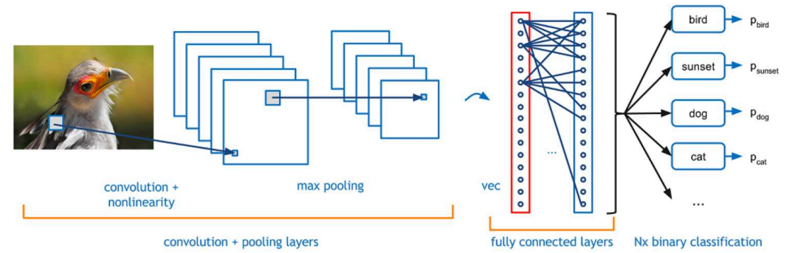

## 第四次作业
### 时间：2020年12月1日
### CNN
#### 一、卷积神经网络原理
##### 1.1、CNN定义
卷积神经网络（Convolutional Neural Networks, CNN）是一类包含卷积计算且具有深度结构的前馈神经网络（Feedforward Neural Networks），是深度学习（deep learning）的代表算法之一 [1-2]  。卷积神经网络具有表征学习（representation learning）能力，能够按其阶层结构对输入信息进行平移不变分类（shift-invariant classification），因此也被称为“平移不变人工神经网络（Shift-Invariant Artificial Neural Networks, SIANN）”.
##### 1.2、CNN能力
卷积神经网络（CNN，Convolutional Neural Net)是神经网络的类型之一，在图像识别和分类领域中取得了非常好的效果，比如识别人脸、物体、交通标识等，这就为机器人、自动驾驶等应用提供了坚实的技术基础。
##### 1.3、CNN的结构
一般结构如图： 
 
- 输入层（Input Layer）：主要是对原始的图像数据进行预处理
- 卷积层（Convolution Layers）：可以看作是输入样本和卷积核的内积运算。从前一层提取移位不变特征。即当输入数据是图像的时候，卷积层会以3维数据的形式接收输入数据，并同样以3维数据的形式输出至下一层。因此，在CNN中，可以（有可能）正确理解图像等具有形状的数据。注：卷积层的输入和输出数据通常又被称为特征图（Feature Map）。卷积层的输入数据称为输入特征图（Input Feature Map），输出数据称为输出特征图（Output Feature Map）。
- 池化层（Pooling Layers）：作用是减小卷积层产生的特征图尺寸。将前一层的多个单元的激活组合为一个单元。池化是缩小高、长方向上的空间的运算，通常减小一半。
- 全连接层（Fully Connected Layers）：收集空间扩散信息
- 输出层（Output Layer）：选择类
##### 1.4、CNN的特征

- 平移不变性
对于A的平移结果B，他们的卷积结果特征值是一样的，但特征值位于不同位置。
- 旋转不变性
对于一些图而言，小角度的旋转最后的特征值不变。但很多情况都不满足条件如6和9。
- 尺度不变性
对于A和D，CNN使用不同的卷积视野能看到一样照片。
#### 二、卷积的前向计算
##### 单输入多输出
 
原始输入是一维的图片，但是我们可以用多个卷积核分别对其计算，从而得到多个特征输出。
 ##### 多输入单输出

虽然输入图片是多个通道的，或者说是三维的，但是在相同数量的过滤器的计算后，相加在一起的结果是一个通道，即2维数据，所以称为降维。这当然简化了对多通道数据的计算难度，但同时也会损失多通道数据自带的颜色信息。
##### 多入多出的同维卷积

第一个过滤器Filter-1为棕色所示，它有三卷积核(Kernal)，命名为Kernal-1，Keanrl-2，Kernal-3，分别在红绿蓝三个输入通道上进行卷积操作，生成三个2x2的输出Feature-1,n。然后三个Feature-1,n相加，并再加上b1偏移值，形成最后的棕色输出Result-1。

对于灰色的过滤器Filter-2也是一样，先生成三个Feature-2,n，然后相加再加b2，最后得到Result-2。

之所以Feature-m,n还用红绿蓝三色表示，是因为在此时，它们还保留着红绿蓝三种色彩的各自的信息，一旦相加后得到Result，这种信息就丢失了。
##### 卷积前向计算代码实现
设计方案(以三维卷积为例)：
- 预先设计好输出特征图的数量
- 每个特征图都和过滤器Filter对应
- 过滤器内部有一个或多个卷积核Kernal
- 每个过滤器只有一个偏置Bias
- 卷积核的矩阵格式一般为正方形奇数如3 * 3 , 5 * 5
- 使用定步长stride
- 考虑填充padding
- 
$$
H_{Output}= {H_{Input} - H_{Kernal} + 2Padding \over Stride} + 1
$$
#### 三、卷积的反向传播原理
#### 四、池化
#### 五、经典卷积神经网络
#### 六、卷积神经网络的运用
