# 第八步  卷积神经网络

# 第17章 卷积神经网络原理

## 17.0 卷积神经网络概述

### 17.0.1 卷积神经网络的能力

卷积神经网络（CNN，Convolutional Neural Net)是神经网络的类型之一，在图像识别和分类领域中取得了非常好的效果，比如识别人脸、物体、交通标识等，这就为机器人、自动驾驶等应用提供了坚实的技术基础。

### 17.0.2 卷积神经网络的典型结构

在一个典型的卷积神经网络中，会至少包含以下几个层：

- 卷积层
- 激活函数层
- 池化层
- 全连接分类层

### 17.0.3 卷积核的作用

- 卷积的效果

||1|2|3|
|---|---|---|---|
|1|0,-1, 0<br>-1, 5,-1<br>0,-1, 0|0, 0, 0 <br> -1, 2,-1 <br> 0, 0, 0|1, 1, 1 <br> 1,-9, 1 <br> 1, 1, 1|
||sharpness|vertical edge|surround|
|2|-1,-2, -1 <br> 0, 0, 0<br>1, 2, 1|0, 0, 0 <br> 0, 1, 0 <br> 0, 0, 0|0,-1, 0 <br> 0, 2, 0 <br> 0,-1, 0|
||sobel y|nothing|horizontal edge|
|3|0.11,0.11,0.11 <br>0.11,0.11,0.11<br>0.11,0.11,0.11|-1, 0, 1 <br> -2, 0, 2 <br> -1, 0, 1|2, 0, 0 <br> 0,-1, 0 <br> 0, 0,-1|
||blur|sobel x|embossing|

- 各个卷积核的作用

|序号|名称|说明|
|---|---|---|
|1|锐化|如果一个像素点比周围像素点亮，则此算子会令其更亮|
|2|检测竖边|检测出了十字线中的竖线，由于是左侧和右侧分别检查一次，所以得到两条颜色不一样的竖线|
|3|周边|把周边增强，把同色的区域变弱，形成大色块|
|4|Sobel-Y|纵向亮度差分可以检测出横边，与横边检测不同的是，它可以使得两条横线具有相同的颜色，具有分割线的效果|
|5|Identity|中心为1四周为0的过滤器，卷积后与原图相同|
|6|横边检测|检测出了十字线中的横线，由于是上侧和下侧分别检查一次，所以得到两条颜色不一样的横线|
|7|模糊|通过把周围的点做平均值计算而“杀富济贫”造成模糊效果|
|8|Sobel-X|横向亮度差分可以检测出竖边，与竖边检测不同的是，它可以使得两条竖线具有相同的颜色，具有分割线的效果|
|9|浮雕|形成大理石浮雕般的效果|

### ch17, Level0

- 实际运行
 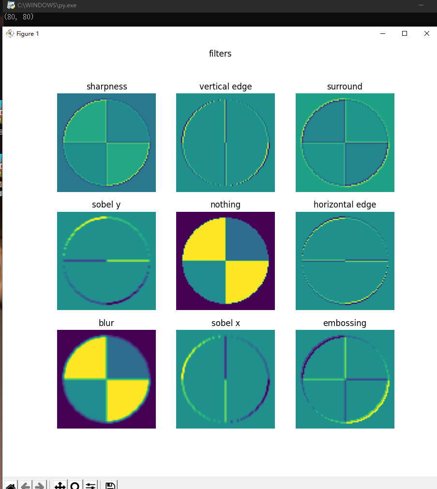
 

## 17.1 卷积的前向计算

### 17.1.1 卷积的数学定义

#### 连续定义

$$h(x)=(f*g)(x) = \int_{-\infty}^{\infty} f(t)g(x-t)dt \tag{1}$$

卷积与傅里叶变换有着密切的关系。利用这点性质，即两函数的傅里叶变换的乘积等于它们卷积后的傅里叶变换，能使傅里叶分析中许多问题的处理得到简化。

#### 离散定义

$$h(x) = (f*g)(x) = \sum^{\infty}_{t=-\infty} f(t)g(x-t) \tag{2}$$

### 17.1.2 单入单出的二维卷积

二维卷积一般用于图像处理上。在二维图片上做卷积，如果把图像Image简写为$I$，把卷积核Kernal简写为$K$，则目标图片的第$(i,j)$个像素的卷积值为：

$$
h(i,j) = (I*K)(i,j)=\sum_m \sum_n I(m,n)K(i-m,j-n) \tag{3}
$$

可以看出，这和一维情况下的公式2是一致的。从卷积的可交换性，我们可以把公式3等价地写作：

$$
h(i,j) = (I*K)(i,j)=\sum_m \sum_n I(i-m,j-n)K(m,n) \tag{4}
$$

公式4的成立，是因为我们将Kernal进行了翻转。在神经网络中，一般会实现一个互相关函数(corresponding function)，而卷积运算几乎一样，但不反转Kernal：

$$
h(i,j) = (I*K)(i,j)=\sum_m \sum_n I(i+m,j+n)K(m,n) \tag{5}
$$

在图像处理中，自相关函数和互相关函数定义如下：

- 自相关：设原函数是f(t)，则$h=f(t) \star f(-t)$，其中$\star$表示卷积
- 互相关：设两个函数分别是f(t)和g(t)，则$h=f(t) \star g(-t)$

互相关函数的运算，是两个序列滑动相乘，两个序列都不翻转。卷积运算也是滑动相乘，但是其中一个序列需要先翻转，再相乘。所以，从数学意义上说，机器学习实现的是互相关函数，而不是原始含义上的卷积。但我们为了简化，把公式5也称作为卷积。这就是卷积的来源。

结论：

1. 我们实现的卷积操作不是原始数学含义的卷积，而是工程上的卷积，可以简称为卷积
2. 在实现卷积操作时，并不会反转卷积核

## 17.2 卷积前向计算代码实现

### 17.2.1 卷积核的实现

卷积核，实际上和全连接层一样，是权重矩阵加偏移向量的组合，区别在于全连接层中的权重矩阵是二维的，偏移矩阵是列向量，而卷积核的权重矩阵是四维的，偏移矩阵是也是列向量。

```Python
class ConvWeightsBias(WeightsBias_2_1):
    def __init__(self, output_c, input_c, filter_h, filter_w, init_method, optimizer_name, eta):
        self.FilterCount = output_c
        self.KernalCount = input_c
        self.KernalHeight = filter_h
        self.KernalWidth = filter_w
        ...

    def Initialize(self, folder, name, create_new):
        self.WBShape = (self.FilterCount, self.KernalCount, self.KernalHeight, self.KernalWidth)        
        ...
```

### 17.2.2 卷积前向运算的实现（该方法运行速度慢）
```Python
class ConvLayer(CLayer):
    def forward(self, x, train=True):
        self.x = x
        self.batch_size = self.x.shape[0]
        # 如果有必要的话，先对输入矩阵做padding
        if self.padding > 0:
            self.padded = np.pad(...)
        else:
            self.padded = self.x
        #end if
        self.z = conv_4d(...)
        return self.z
```

上述代码中的`conv_4d()`函数实现了17.1中定义的四维卷积运算：

```Python
def conv_4d(x, weights, bias, out_h, out_w, stride=1):
    batch_size = x.shape[0]
    input_channel = x.shape[1]
    output_channel = weights.shape[0]
    filter_height = weights.shape[2]
    filter_width = weights.shape[3]
    rs = np.zeros((batch_size, num_output_channel, out_h, out_w))

    for bs in range(batch_size):
        for oc in range(output_channel):
            rs[bs,oc] += bias[oc]
            for ic in range(input_channel):
                for i in range(out_h):
                    for j in range(out_w):
                        ii = i * stride
                        jj = j * stride
                        for fh in range(filter_height):
                            for fw in range(filter_width):
                                rs[bs,oc,i,j] += x[bs,ic,fh+ii,fw+jj] * weights[oc,ic,fh,fw]
```

上面的函数包含以下几重循环：

1. 批量数据循环（第一维）：`bs in batch_size`，对每个样本进行计算；
2. 输出通道循环（第二维）：`oc in output_channel`。这里先把`bias`加上了，后加也可以；
3. 输入通道循环：`ic in input_channel`;
4. 输出图像纵坐标循环：`i in out h`；
5. 输出图像横坐标循环：`j in out_w`。循环4和5完成对输出图像的每个点的遍历，在下面的子循环中计算并填充值；
6. 卷积核纵向循环（第三维）：`fh in filter_height`；
7. 卷积核横向循环（第四维）：`fw in filter_width`。循环6和7完成卷积核与输入图像的卷积计算，并保存到循环4和5指定的输出图像的点上。

### ch17, Level2

- 实际运行
 
 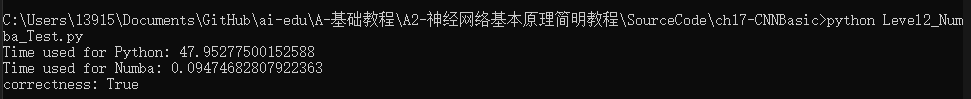[为防止代码运行后自动弹出，后续将尽量使用控制台操作]

## 17.3 卷积层的训练

同全连接层一样，卷积层的训练也需要从上一层回传的误差矩阵，然后计算：

1. 本层的权重矩阵的误差项
2. 本层的需要回传到下一层的误差矩阵

### 17.3.1 计算反向传播的梯度矩阵

正向公式：

$$Z = W*A+b \tag{0}$$

其中，W是卷积核，*表示卷积（互相关）计算，A为当前层的输入项，b是偏移（未在图中画出），Z为当前层的输出项，但尚未经过激活函数处理。

我们举一个具体的例子便于分析。图17-21是正向计算过程。


图17-21 卷积正向运算

分解到每一项就是下列公式：

$$z_{11} = w_{11} \cdot a_{11} + w_{12} \cdot a_{12} + w_{21} \cdot a_{21} + w_{22} \cdot a_{22} + b \tag{1}$$
$$z_{12} = w_{11} \cdot a_{12} + w_{12} \cdot a_{13} + w_{21} \cdot a_{22} + w_{22} \cdot a_{23} + b \tag{2}$$
$$z_{21} = w_{11} \cdot a_{21} + w_{12} \cdot a_{22} + w_{21} \cdot a_{31} + w_{22} \cdot a_{32} + b \tag{3}$$
$$z_{22} = w_{11} \cdot a_{22} + w_{12} \cdot a_{23} + w_{21} \cdot a_{32} + w_{22} \cdot a_{33} + b \tag{4}$$

求损失函数$J$对$a_{11}$的梯度：

$$
\frac{\partial J}{\partial a_{11}}=\frac{\partial J}{\partial z_{11}} \frac{\partial z_{11}}{\partial a_{11}}=\delta_{z11}\cdot w_{11} \tag{5}
$$

上式中，$\delta_{z11}$是从网络后端回传到本层的$z_{11}$单元的梯度。

求$J$对$a_{12}$的梯度时，先看正向公式，发现$a_{12}$对$z_{11}$和$z_{12}$都有贡献，因此需要二者的偏导数相加：

$$
\frac{\partial J}{\partial a_{12}}=\frac{\partial J}{\partial z_{11}} \frac{\partial z_{11}}{\partial a_{12}}+\frac{\partial J}{\partial z_{12}} \frac{\partial z_{12}}{\partial a_{12}}=\delta_{z11} \cdot w_{12}+\delta_{z12} \cdot w_{11} \tag{6}
$$

最复杂的是求$a_{22}$的梯度，因为从正向公式看，所有的输出都有$a_{22}$的贡献，所以：

$$
\frac{\partial J}{\partial a_{22}}=\frac{\partial J}{\partial z_{11}} \frac{\partial z_{11}}{\partial a_{22}}+\frac{\partial J}{\partial z_{12}} \frac{\partial z_{12}}{\partial a_{22}}+\frac{\partial J}{\partial z_{21}} \frac{\partial z_{21}}{\partial a_{22}}+\frac{\partial J}{\partial z_{22}} \frac{\partial z_{22}}{\partial a_{22}} 
$$
$$
=\delta_{z11} \cdot w_{22} + \delta_{z12} \cdot w_{21} + \delta_{z21} \cdot w_{12} + \delta_{z22} \cdot w_{11} \tag{7}
$$

同理可得所有$a$的梯度。

观察公式7中的$w$的顺序，貌似是把原始的卷积核旋转了180度，再与传入误差项做卷积操作，即可得到所有元素的误差项。而公式5和公式6并不完备，是因为二者处于角落，这和卷积正向计算中的padding是相同的现象。因此，我们把传入的误差矩阵Delta-In做一个zero padding，再乘以旋转180度的卷积核，就是要传出的误差矩阵Delta-Out.

### ch17, Level3

- 实际运行
 

## 17.4 卷积反向传播代码实现

### 17.4.1 方法

完全按照17.3中的讲解来实现反向传播，但是由于有17.2中关于numba帮助，我们在实现代码时，可以考虑把一些模块化的计算放到独立的函数中，用numba在运行时编译加速。

```Python
    def backward_numba(self, delta_in, flag):
        # 如果正向计算中的stride不是1，转换成是1的等价误差数组
        dz_stride_1 = expand_delta_map(delta_in, ...)
        # 计算本层的权重矩阵的梯度
        self._calculate_weightsbias_grad(dz_stride_1)
        # 由于输出误差矩阵的尺寸必须与本层的输入数据的尺寸一致，所以必须根据卷积核的尺寸，调整本层的输入误差矩阵的尺寸
        (pad_h, pad_w) = calculate_padding_size(...)
        dz_padded = np.pad(dz_stride_1, ...)
        # 计算本层输出到下一层的误差矩阵
        delta_out = self._calculate_delta_out(dz_padded, flag)
        #return delta_out
        return delta_out, self.WB.dW, self.WB.dB

    # 用输入数据乘以回传入的误差矩阵,得到卷积核的梯度矩阵
    def _calculate_weightsbias_grad(self, dz):
        self.WB.ClearGrads()
        # 先把输入矩阵扩大，周边加0
        (pad_h, pad_w) = calculate_padding_size(...)
        input_padded = np.pad(self.x, ...)
        # 输入矩阵与误差矩阵卷积得到权重梯度矩阵
        (self.WB.dW, self.WB.dB) = calcalate_weights_grad(...)
        self.WB.MeanGrads(self.batch_size)

    # 用输入误差矩阵乘以（旋转180度后的）卷积核
    def _calculate_delta_out(self, dz, layer_idx):
        if layer_idx == 0:
            return None
        # 旋转卷积核180度
        rot_weights = self.WB.Rotate180()
        # 定义输出矩阵形状
        delta_out = np.zeros(self.x.shape)
        # 输入梯度矩阵卷积旋转后的卷积核，得到输出梯度矩阵
        delta_out = calculate_delta_out(dz, ..., delta_out)

        return delta_out
```
为了节省篇幅，上面的代码中做了一些省略，只保留了基本的实现思路，并给出了详尽的注释，相信读者在充分理解17.3的内容的基础上，可以看懂。

其中，两个计算量大的函数，一个是计算权重矩阵的基础函数calcalate_weights_grad，另一个是计算输出误差矩阵的基础函数calculate_delta_out，都使用了numba的方式实现，以加快反向传播代码的运行速度。

### ch17, Level4

- 实际运行
 
 

## 17.5 池化层

### 17.5.1 常用池化方法

池化 pooling，又称为下采样，downstream sampling or sub-sampling。

池化方法分为两种，一种是最大值池化 Max Pooling，一种是平均值池化 Mean/Average Pooling。

- 最大值池化，是取当前池化视野中所有元素的最大值，输出到下一层特征图中。
- 平均值池化，是取当前池化视野中所有元素的平均值，输出到下一层特征图中。

其目的是：

- 扩大视野：就如同先从近处看一张图片，然后离远一些再看同一张图片，有些细节就会被忽略
- 降维：在保留图片局部特征的前提下，使得图片更小，更易于计算
- 平移不变性，轻微扰动不会影响输出：比如上图中最大值池化的4，即使向右偏一个像素，其输出值仍为4
- 维持同尺寸图片，便于后端处理：假设输入的图片不是一样大小的，就需要用池化来转换成同尺寸图片

一般我们都使用最大值池化。

### 17.5.2 实现方法

按照标准公式来实现池化的正向和反向代码。

```Python
class PoolingLayer(CLayer):
    def forward_numba(self, x, train=True):
        ......

    def backward_numba(self, delta_in, layer_idx):
        ......
```

有了前面的经验，这次我们直接把前向和反向函数用numba方式来实现，并在前面加上@nb.jit修饰符：
```Python
@nb.jit(nopython=True)
def jit_maxpool_forward(...):
    ...
    return z

@nb.jit(nopython=True)
def jit_maxpool_backward(...):
    ...
    return delta_out
```

### ch17, Level5

- 实际运行
 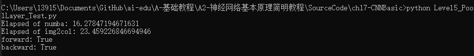

# 第18章 卷积神经网络应用

## 18.0 经典的卷积神经网络模型

卷积神经网络是现在深度学习领域中最有用的网络类型，尤其在计算机视觉领域更是一枝独秀。卷积神经网络从90年代的LeNet开始，沉寂了10年，也孵化了10年，直到2012年AlexNet开始再次崛起，后续的ZF Net、VGG、GoogLeNet、ResNet、DenseNet，网络越来越深，架构越来越复杂，解决反向传播时梯度消失的方法也越来越巧妙。

### 18.0.1 LeNet (1998)

LeNet是卷积神经网络的开创者LeCun在1998年提出，用于解决手写数字识别的视觉任务。自那时起，卷积神经网络的最基本的架构就定下来了：卷积层、池化层、全连接层。

1. 输入为单通道32x32灰度图
2. 使用6组5x5的过滤器，每个过滤器里有一个卷积核，stride=1，得到6张28x28的特征图
3. 使用2x2的池化，stride=2，得到6张14x14的特征图
4. 使用16组5x5的过滤器，每个过滤器里有6个卷积核，对应上一层的6个特征图，得到16张10x10的特征图
5. 池化，得到16张5x5的特征图
6. 接全连接层，120个神经元
7. 接全连接层，84个神经元
8. 接全连接层，10个神经元，softmax输出

### 18.0.2 AlexNet (2012)

AlexNet$^{[4]}$网络结构在整体上类似于LeNet，都是先卷积然后在全连接。但在细节上有很大不同。AlexNet更为复杂。AlexNet有60 million个参数和65000个神经元，五层卷积，三层全连接网络，最终的输出层是1000通道的Softmax。

1. 原始图片是3x224x224三通道彩色图片，分开到上下两块GPU上进行训练
2. 卷积，96核，11x11，stride=4，pad=0，输出96x55x55
3. LRN+池化，3x3，stride=2，pad=0，输出96x27x27
4. 卷积，256核，5x5，stride=1，pad=2，输出256x27x27
5. LRN+池化，3x3，stride=2，输出256x13x13
6. 卷积，384核，3x3，stride=1，pad=1，输出384x13x13
7. 卷积，384核，3x3，stride=1，pad=1，输出384x13x13
8. 卷积，256核，3x3，stride=1，pad=1，输出256x13x13
9. 池化，3x3，stride=2，输出256x6x6
10. 全连接层，4096个神经元，接Dropout和Relu
11. 全连接层，4096个神经元，接Dropout和Relu
12. 全连接层，1000个神经元做分类

### 18.0.3 ZFNet (2013)

ZFNet$^{[5]}$是2013年ImageNet分类任务的冠军，其网络结构没什么改进，只是调了调参，性能较Alex提升了不少。ZF-Net只是将AlexNet第一层卷积核由11变成7，步长由4变为2，第3，4，5卷积层转变为384，384，256。这一年的ImageNet还是比较平静的一届，其冠军ZF-Net的名堂也没其他届的经典网络架构响亮。

### 18.0.4 VGGNet (2015)

VGG Net$^{[6]}$由牛津大学的视觉几何组（Visual Geometry Group）和 Google DeepMind公司的研究员一起研发的的深度卷积神经网络，在 ILSVRC 2014 上取得了第二名的成绩，将 Top-5错误率降到7.3%。它主要的贡献是展示出网络的深度（depth）是算法优良性能的关键部分。目前使用比较多的网络结构主要有ResNet（152-1000层），GooleNet（22层），VGGNet（19层），大多数模型都是基于这几个模型上改进，采用新的优化算法，多模型融合等。到目前为止，VGG Net 依然经常被用来提取图像特征。

### 18.0.5 GoogLeNet (2014)

GoogLeNet$^{[7]}$在2014的ImageNet分类任务上击败了VGG-Nets夺得冠军，其实力肯定是非常深厚的，GoogLeNet跟AlexNet,VGG-Nets这种单纯依靠加深网络结构进而改进网络性能的思路不一样，它另辟幽径，在加深网络的同时（22层），也在网络结构上做了创新，引入Inception结构代替了单纯的卷积+激活的传统操作（这思路最早由Network in Network提出）。GoogLeNet进一步把对卷积神经网络的研究推上新的高度。

### 18.0.6 ResNets (2015)

2015年何恺明推出的ResNet$^{[8]}$在ISLVRC和COCO上横扫所有选手，获得冠军。ResNet在网络结构上做了大创新，而不再是简单的堆积层数，ResNet在卷积神经网络的新思路，绝对是深度学习发展历程上里程碑式的事件。

### 18.0.7 DenseNet (2017)

DenseNet$^{[9]}$ 是一种具有密集连接的卷积神经网络。在该网络中，任何两层之间都有直接的连接，也就是说，网络每一层的输入都是前面所有层输出的并集，而该层所学习的特征图也会被直接传给其后面所有层作为输入。下图是 DenseNet 的一个dense block示意图，一个block里面的结构如下，与ResNet中的BottleNeck基本一致：BN-ReLU-Conv(1×1)-BN-ReLU-Conv(3×3) ，而一个DenseNet则由多个这种block组成。每个DenseBlock的之间层称为transition layers，由BN−>Conv(1×1)−>averagePooling(2×2)组成。

## 18.1 实现颜色分类

### 18.1.1 用前馈神经网络解决问题

#### 数据处理

由于输入图片是三通道的彩色图片，我们先把它转换成灰度图，

```Python
class GeometryDataReader(DataReader_2_0):
    def ConvertToGray(self, data):
        (N,C,H,W) = data.shape
        new_data = np.empty((N,H*W))
        if C == 3: # color
            for i in range(N):
                new_data[i] = np.dot(
                    [0.299,0.587,0.114], 
                    data[i].reshape(3,-1)).reshape(1,784)
        elif C == 1: # gray
            new_data[i] = data[i,0].reshape(1,784)
        #end if
        return new_data
```

向量[0.299,0.587,0.114]的作用是，把三通道的彩色图片的RGB值与此向量相乘，得到灰度图，三个因子相加等于1，这样如果原来是[255,255,255]的话，最后的灰度图的值还是255。如果是[255,255,0]的话，最后的结果是：

$$
\begin{aligned}
Y &= 0.299 \cdot R + 0.586 \cdot G + 0.114 \cdot B \\
&= 0.299 \cdot 255 + 0.586 \cdot 255 + 0.114 \cdot 0 \\
&=225.675
\end{aligned}
\tag{1}
$$

也就是说粉色的数值本来是(255,255,0)，变成了单一的值225.675。六种颜色中的每一种都会有不同的值，所以即使是在灰度图中，也会保留部分“彩色”信息，当然会丢失一些信息。这从公式1中很容易看出来，假设$B=0$，不同组合的$R、G$的值有可能得到相同的最终结果，因此会丢失彩色信息。

在转换成灰度图后，立刻用reshape(1,784)把它转变成矢量，该矢量就是每个样本的784维的特征值。

#### 搭建模型

我们搭建的前馈神经网络模型如下：

```Python
def dnn_model():
    num_output = 6
    max_epoch = 100
    batch_size = 16
    learning_rate = 0.01
    params = HyperParameters_4_2(
        learning_rate, max_epoch, batch_size,
        net_type=NetType.MultipleClassifier,
        init_method=InitialMethod.MSRA,
        optimizer_name=OptimizerName.SGD)

    net = NeuralNet_4_2(params, "color_dnn")
    
    f1 = FcLayer_2_0(784, 128, params)
    net.add_layer(f1, "f1")
    r1 = ActivationLayer(Relu())
    net.add_layer(r1, "relu1")

    f2 = FcLayer_2_0(f1.output_size, 64, params)
    net.add_layer(f2, "f2")
    r2 = ActivationLayer(Relu())
    net.add_layer(r2, "relu2")
    
    f3 = FcLayer_2_0(f2.output_size, num_output, params)
    net.add_layer(f3, "f3")
    s3 = ClassificationLayer(Softmax())
    net.add_layer(s3, "s3")

    return net
```

这就是一个普通的三层网络，两个隐层，神经元数量分别是128和64，一个输出层，最后接一个6分类Softmax。

### 18.1.2 用卷积神经网络解决问题

下面我们看看卷积神经网络的表现。我们直接使用三通道的彩色图片，不需要再做数据转换了。

#### 搭建模型

```Python
def cnn_model():
    num_output = 6
    max_epoch = 20
    batch_size = 16
    learning_rate = 0.1
    params = HyperParameters_4_2(
        learning_rate, max_epoch, batch_size,
        net_type=NetType.MultipleClassifier,
        init_method=InitialMethod.MSRA,
        optimizer_name=OptimizerName.SGD)

    net = NeuralNet_4_2(params, "color_conv")
    
    c1 = ConvLayer((3,28,28), (2,1,1), (1,0), params)
    net.add_layer(c1, "c1")
    r1 = ActivationLayer(Relu())
    net.add_layer(r1, "relu1")
    p1 = PoolingLayer(c1.output_shape, (2,2), 2, PoolingTypes.MAX)
    net.add_layer(p1, "p1") 

    c2 = ConvLayer(p1.output_shape, (3,3,3), (1,0), params)
    net.add_layer(c2, "c2")
    r2 = ActivationLayer(Relu())
    net.add_layer(r2, "relu2")
    p2 = PoolingLayer(c2.output_shape, (2,2), 2, PoolingTypes.MAX)
    net.add_layer(p2, "p2") 

    params.learning_rate = 0.1

    f3 = FcLayer_2_0(p2.output_size, 32, params)
    net.add_layer(f3, "f3")
    bn3 = BnLayer(f3.output_size)
    net.add_layer(bn3, "bn3")
    r3 = ActivationLayer(Relu())
    net.add_layer(r3, "relu3")
    
    f4 = FcLayer_2_0(f3.output_size, num_output, params)
    net.add_layer(f4, "f4")
    s4 = ClassificationLayer(Softmax())
    net.add_layer(s4, "s4")

    return net
```

表18-1展示了在这个模型中各层的作用和参数。

表18-1 模型各层的参数

|ID|类型|参数|输入尺寸|输出尺寸|
|---|---|---|---|---|
|1|卷积|2x1x1, S=1|3x28x28|2x28x28|
|2|激活|Relu|2x28x28|2x28x28|
|3|池化|2x2, S=2, Max|2x14x14|2x14x14|
|4|卷积|3x3x3, S=1|2x14x14|3x12x12|
|5|激活|Relu|3x12x12|3x12x12|
|6|池化|2x2, S=2, Max|3x12x12|3x6x6|
|7|全连接|32|108|32|
|8|归一化||32|32|
|9|激活|Relu|32|32|
|10|全连接|6|32|6|
|11|分类|Softmax|6|6|

### ch18, Level1

- CNN实际运行
 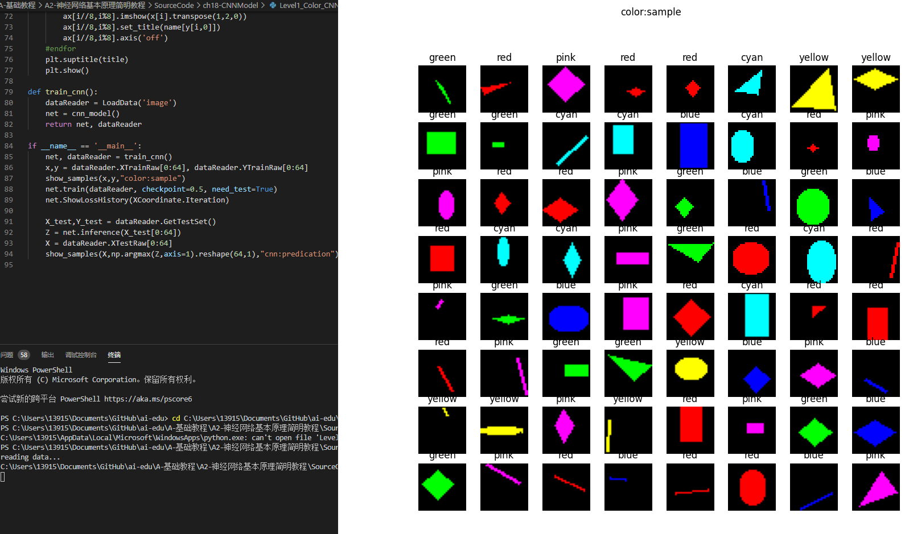
 

- DNN实际运行
 
 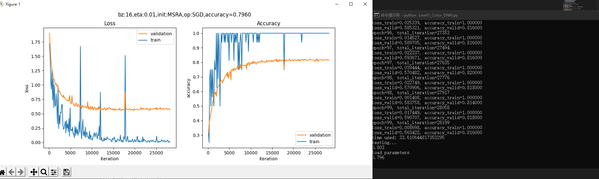
 

## 18.2 实现几何图形分类

### 18.2.1 用前馈神经网络解决问题

我们下面要考验一下神经网络的能力。我们先用前面学过的全连接网络来解决这个问题，搭建一个三层的网络如下：

```Python
def dnn_model():
    num_output = 5
    max_epoch = 50
    batch_size = 16
    learning_rate = 0.1
    params = HyperParameters_4_2(
        learning_rate, max_epoch, batch_size,
        net_type=NetType.MultipleClassifier,
        init_method=InitialMethod.MSRA,
        optimizer_name=OptimizerName.SGD)

    net = NeuralNet_4_2(params, "pic_dnn")
    
    f1 = FcLayer_2_0(784, 128, params)
    net.add_layer(f1, "f1")
    r1 = ActivationLayer(Relu())
    net.add_layer(r1, "relu1")

    f2 = FcLayer_2_0(f1.output_size, 64, params)
    net.add_layer(f2, "f2")
    r2 = ActivationLayer(Relu())
    net.add_layer(r2, "relu2")
    
    f3 = FcLayer_2_0(f2.output_size, num_output, params)
    net.add_layer(f3, "f3")
    s3 = ClassificationLayer(Softmax())
    net.add_layer(s3, "s3")

    return net
```
### 18.2.2 用卷积神经网络解决问题

下面我们来看看卷积神经网络能不能完成这个工作。首先搭建网络模型如下：

```Python
def cnn_model():
    num_output = 5
    max_epoch = 50
    batch_size = 16
    learning_rate = 0.1
    params = HyperParameters_4_2(
        learning_rate, max_epoch, batch_size,
        net_type=NetType.MultipleClassifier,
        init_method=InitialMethod.MSRA,
        optimizer_name=OptimizerName.SGD)

    net = NeuralNet_4_2(params, "shape_cnn")
    
    c1 = ConvLayer((1,28,28), (8,3,3), (1,1), params)
    net.add_layer(c1, "c1")
    r1 = ActivationLayer(Relu())
    net.add_layer(r1, "relu1")
    p1 = PoolingLayer(c1.output_shape, (2,2), 2, PoolingTypes.MAX)
    net.add_layer(p1, "p1") 

    c2 = ConvLayer(p1.output_shape, (16,3,3), (1,0), params)
    net.add_layer(c2, "c2")
    r2 = ActivationLayer(Relu())
    net.add_layer(r2, "relu2")
    p2 = PoolingLayer(c2.output_shape, (2,2), 2, PoolingTypes.MAX)
    net.add_layer(p2, "p2") 

    params.learning_rate = 0.1

    f3 = FcLayer_2_0(p2.output_size, 32, params)
    net.add_layer(f3, "f3")
    bn3 = BnLayer(f3.output_size)
    net.add_layer(bn3, "bn3")
    r3 = ActivationLayer(Relu())
    net.add_layer(r3, "relu3")
    
    f4 = FcLayer_2_0(f3.output_size, num_output, params)
    net.add_layer(f4, "f4")
    s4 = ClassificationLayer(Softmax())
    net.add_layer(s4, "s4")

    return net
```
### ch18, Level2

- CNN实际运行
 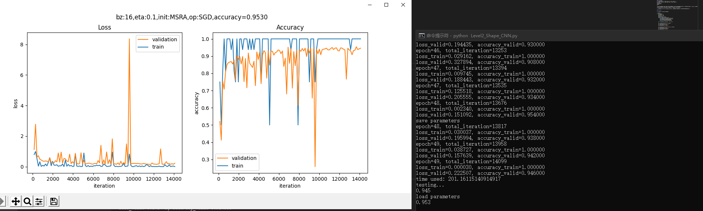
 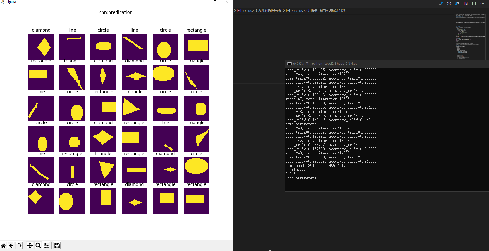

- DNN实际运行
 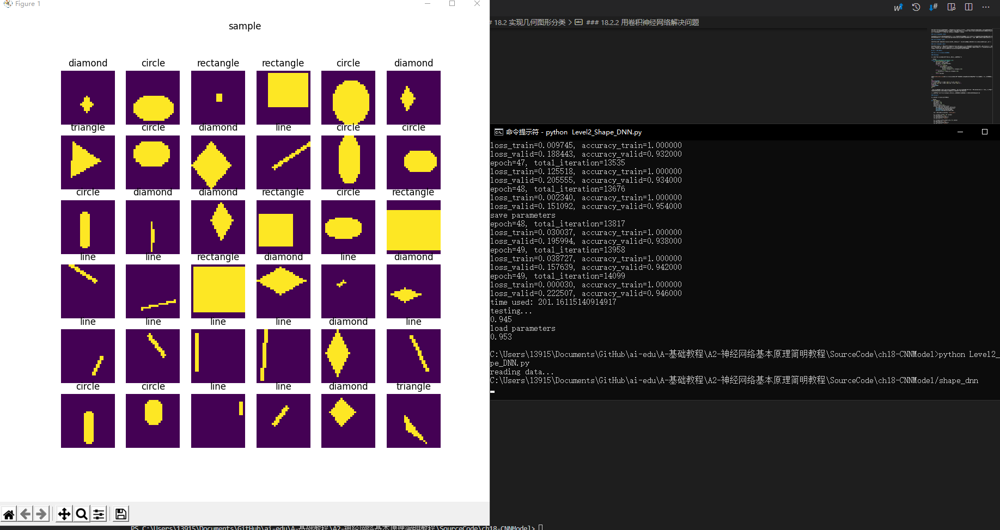
 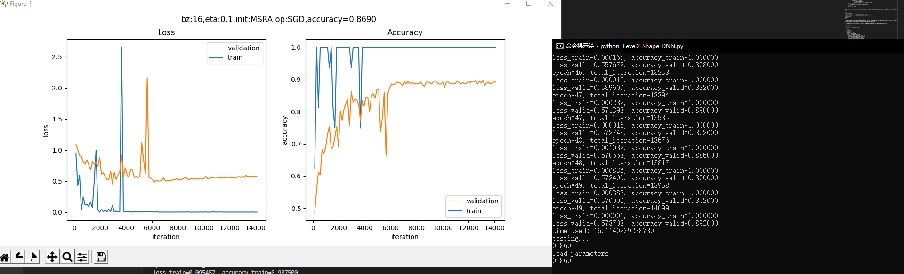
 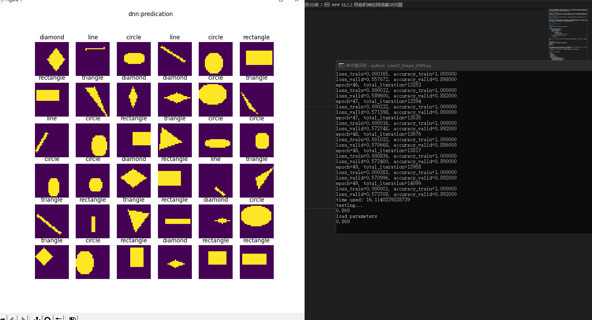

## 18.3 实现几何图形及颜色分类

### 18.3.1 用前馈神经网络解决问题

我们仍然先使用全连接网络来解决这个问题，搭建一个三层的网络如下：

```Python
ef dnn_model():
    num_output = 9
    max_epoch = 50
    batch_size = 16
    learning_rate = 0.01
    params = HyperParameters_4_2(
        learning_rate, max_epoch, batch_size,
        net_type=NetType.MultipleClassifier,
        init_method=InitialMethod.MSRA,
        optimizer_name=OptimizerName.Momentum)

    net = NeuralNet_4_2(params, "color_shape_dnn")
    
    f1 = FcLayer_2_0(784, 128, params)
    net.add_layer(f1, "f1")
    r1 = ActivationLayer(Relu())
    net.add_layer(r1, "relu1")

    f2 = FcLayer_2_0(f1.output_size, 64, params)
    net.add_layer(f2, "f2")
    r2 = ActivationLayer(Relu())
    net.add_layer(r2, "relu2")
    
    f3 = FcLayer_2_0(f2.output_size, num_output, params)
    net.add_layer(f3, "f3")
    s3 = ClassificationLayer(Softmax())
    net.add_layer(s3, "s3")

    return net
```

### 18.3.2 用卷积神经网络解决问题

下面我们来看看卷积神经网络能不能完成这个工作。首先搭建网络模型如下：

```Python
def cnn_model():
    num_output = 9
    max_epoch = 20
    batch_size = 16
    learning_rate = 0.1
    params = HyperParameters_4_2(
        learning_rate, max_epoch, batch_size,
        net_type=NetType.MultipleClassifier,
        init_method=InitialMethod.MSRA,
        optimizer_name=OptimizerName.SGD)

    net = NeuralNet_4_2(params, "shape_color_cnn")
    
    c1 = ConvLayer((3,28,28), (8,3,3), (1,1), params)
    net.add_layer(c1, "c1")
    r1 = ActivationLayer(Relu())
    net.add_layer(r1, "relu1")
    p1 = PoolingLayer(c1.output_shape, (2,2), 2, PoolingTypes.MAX)
    net.add_layer(p1, "p1") 

    c2 = ConvLayer(p1.output_shape, (16,3,3), (1,0), params)
    net.add_layer(c2, "c2")
    r2 = ActivationLayer(Relu())
    net.add_layer(r2, "relu2")
    p2 = PoolingLayer(c2.output_shape, (2,2), 2, PoolingTypes.MAX)
    net.add_layer(p2, "p2") 

    params.learning_rate = 0.1

    f3 = FcLayer_2_0(p2.output_size, 32, params)
    net.add_layer(f3, "f3")
    bn3 = BnLayer(f3.output_size)
    net.add_layer(bn3, "bn3")
    r3 = ActivationLayer(Relu())
    net.add_layer(r3, "relu3")
    
    f4 = FcLayer_2_0(f3.output_size, num_output, params)
    net.add_layer(f4, "f4")
    s4 = ClassificationLayer(Softmax())
    net.add_layer(s4, "s4")

    return net
```

### ch18, Level3_ColorAndShapeConvNet.py

- CNN实际运行
 
 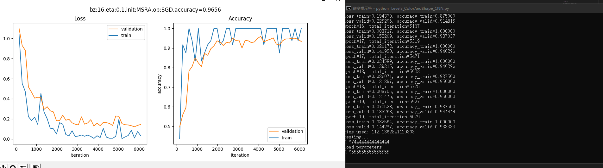
 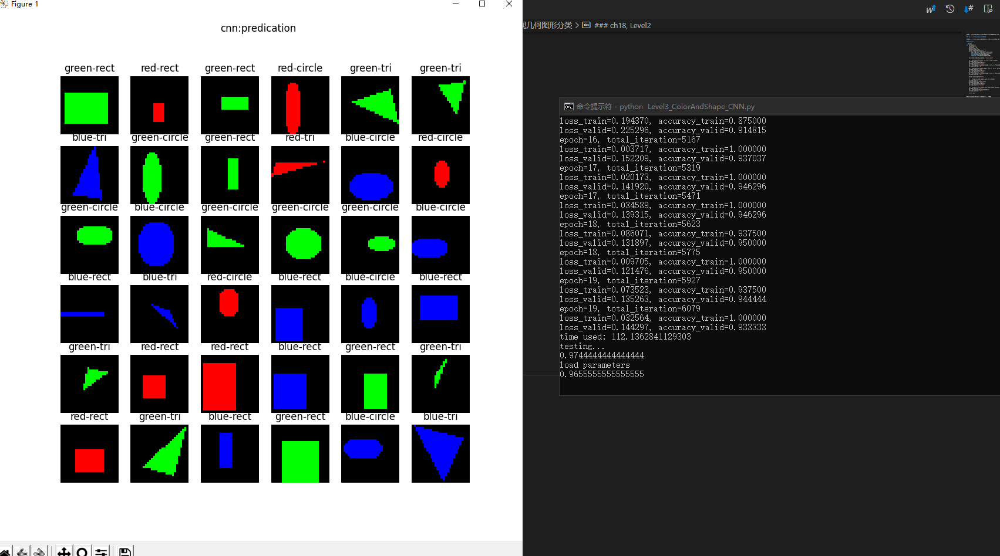

- DNN实际运行
 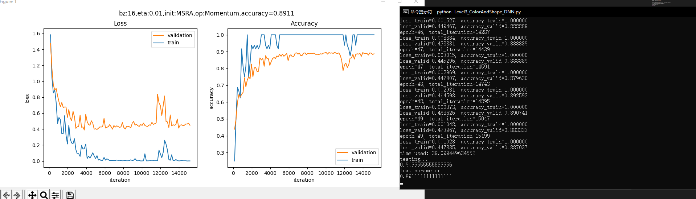
 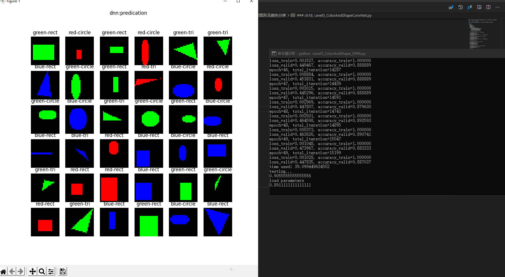

## 18.4 解决MNIST分类问题

### 18.4.1 代码实现

```Python
def model():
    num_output = 10
    dataReader = LoadData(num_output)

    max_epoch = 5
    batch_size = 128
    learning_rate = 0.1
    params = HyperParameters_4_2(
        learning_rate, max_epoch, batch_size,
        net_type=NetType.MultipleClassifier,
        init_method=InitialMethod.Xavier,
        optimizer_name=OptimizerName.Momentum)

    net = NeuralNet_4_2(params, "mnist_conv_test")
    
    c1 = ConvLayer((1,28,28), (8,5,5), (1,0), params)
    net.add_layer(c1, "c1")
    r1 = ActivationLayer(Relu())
    net.add_layer(r1, "relu1")
    p1 = PoolingLayer(c1.output_shape, (2,2), 2, PoolingTypes.MAX)
    net.add_layer(p1, "p1") 
  
    c2 = ConvLayer(p1.output_shape, (16,5,5), (1,0), params)
    net.add_layer(c2, "23")
    r2 = ActivationLayer(Relu())
    net.add_layer(r2, "relu2")
    p2 = PoolingLayer(c2.output_shape, (2,2), 2, PoolingTypes.MAX)
    net.add_layer(p2, "p2")  

    f3 = FcLayer_2_0(p2.output_size, 32, params)
    net.add_layer(f3, "f3")
    bn3 = BnLayer(f3.output_size)
    net.add_layer(bn3, "bn3")
    r3 = ActivationLayer(Relu())
    net.add_layer(r3, "relu3")

    f4 = FcLayer_2_0(f3.output_size, 10, params)
    net.add_layer(f4, "f2")
    s4 = ClassificationLayer(Softmax())
    net.add_layer(s4, "s4")

    net.train(dataReader, checkpoint=0.05, need_test=True)
    net.ShowLossHistory(XCoordinate.Iteration)
```
## 18.5 Fashion-MNIST分类

### 18.5.1 用前馈神经网络来解决问题

#### 搭建模型

```Python
def dnn_model():
    num_output = 10
    max_epoch = 10
    batch_size = 128
    learning_rate = 0.1
    params = HyperParameters_4_2(
        learning_rate, max_epoch, batch_size,
        net_type=NetType.MultipleClassifier,
        init_method=InitialMethod.MSRA,
        optimizer_name=OptimizerName.Momentum)

    net = NeuralNet_4_2(params, "fashion_mnist_dnn")
    
    f1 = FcLayer_2_0(784, 128, params)
    net.add_layer(f1, "f1")
    bn1 = BnLayer(f1.output_size)
    net.add_layer(bn1, "bn1")
    r1 = ActivationLayer(Relu())
    net.add_layer(r1, "relu1")

    f2 = FcLayer_2_0(f1.output_size, 64, params)
    net.add_layer(f2, "f2")
    bn2 = BnLayer(f2.output_size)
    net.add_layer(bn2, "bn2")
    r2 = ActivationLayer(Relu())
    net.add_layer(r2, "relu2")
    
    f3 = FcLayer_2_0(f2.output_size, num_output, params)
    net.add_layer(f3, "f3")
    s3 = ClassificationLayer(Softmax())
    net.add_layer(s3, "s3")

    return net
```
### 18.5.2 用卷积神经网络来解决问题

#### 搭建模型

```Python
def cnn_model():
    num_output = 10
    max_epoch = 10
    batch_size = 128
    learning_rate = 0.01
    params = HyperParameters_4_2(
        learning_rate, max_epoch, batch_size,
        net_type=NetType.MultipleClassifier,
        init_method=InitialMethod.Xavier,
        optimizer_name=OptimizerName.Momentum)

    net = NeuralNet_4_2(params, "fashion_mnist_conv_test")
    
    c1 = ConvLayer((1,28,28), (32,3,3), (1,0), params)
    net.add_layer(c1, "c1")
    r1 = ActivationLayer(Relu())
    net.add_layer(r1, "relu1")
    p1 = PoolingLayer(c1.output_shape, (2,2), 2, PoolingTypes.MAX)
    net.add_layer(p1, "p1") 

    f3 = FcLayer_2_0(p1.output_size, 128, params)
    net.add_layer(f3, "f3")
    r3 = ActivationLayer(Relu())
    net.add_layer(r3, "relu3")

    f4 = FcLayer_2_0(f3.output_size, 10, params)
    net.add_layer(f4, "f4")
    s4 = ClassificationLayer(Softmax())
    net.add_layer(s4, "s4")

    return net
```

### ch18, Level5

- 实际运行
 

## 18.6 Cifar-10分类

Cifar 是加拿大政府牵头投资的一个先进科学项目研究所。Hinton、Bengio和他的学生在2004年拿到了 Cifar 投资的少量资金，建立了神经计算和自适应感知项目。这个项目结集了不少计算机科学家、生物学家、电气工程师、神经科学家、物理学家、心理学家，加速推动了 Deep Learning 的进程。从这个阵容来看，DL 已经和 ML 系的数据挖掘分的很远了。Deep Learning 强调的是自适应感知和人工智能，是计算机与神经科学交叉；Data Mining 强调的是高速、大数据、统计数学分析，是计算机和数学的交叉。

Cifar-10 是由 Hinton 的学生 Alex Krizhevsky、Ilya Sutskever 收集的一个用于普适物体识别的数据集。

### 18.6.2 环境搭建

我们将使用Keras$^{[1]}$来训练模型，因为Keras是一个在TensorFlow平台上经过抽象的工具，它的抽象思想与我们在前面学习过的各种Layer的概念完全一致，有利于读者在前面的基础上轻松地继续学习。环境搭建有很多细节，我们在这里不详细介绍，只是把基本步骤列出。

1. 安装Python 3.6（本书中所有案例在Python 3.6上开发测试）
2. 安装CUDA（没有GPU的读者请跳过）
3. 安装cuDNN（没有GPU的读者请跳过）
4. 安装TensorFlow，有GPU硬件的一定要按照GPU版，没有的只能安装CPU版
5. 安装Keras

安装好后用pip list看一下，关键的几个包是：

```
Package              Version
-------------------- ---------
Keras                2.2.5
Keras-Applications   1.0.8
Keras-Preprocessing  1.1.0
matplotlib           3.1.1
numpy                1.17.0
tensorboard          1.13.1
tensorflow-estimator 1.13.0
tensorflow-gpu       1.13.1
```

如果没有GPU，则"tensorflow-gpu"一项会是"tensorflow"。

### 18.6.3 代码实现

```Python
batch_size = 32
num_classes = 10
epochs = 25
data_augmentation = True
num_predictions = 20
save_dir = os.path.join(os.getcwd(), 'saved_models')
model_name = 'keras_cifar10_trained_model.h5'

# The data, split between train and test sets:
(x_train, y_train), (x_test, y_test) = cifar10.load_data()
print('x_train shape:', x_train.shape)
print(x_train.shape[0], 'train samples')
print(x_test.shape[0], 'test samples')

# Convert class vectors to binary class matrices.
y_train = keras.utils.to_categorical(y_train, num_classes)
y_test = keras.utils.to_categorical(y_test, num_classes)

model = Sequential()
model.add(Conv2D(32, (3, 3), padding='same',
                 input_shape=x_train.shape[1:]))
model.add(Activation('relu'))
model.add(Conv2D(32, (3, 3)))
model.add(Activation('relu'))
model.add(MaxPooling2D(pool_size=(2, 2)))
model.add(Dropout(0.25))

model.add(Conv2D(64, (3, 3), padding='same'))
model.add(Activation('relu'))
model.add(Conv2D(64, (3, 3)))
model.add(Activation('relu'))
model.add(MaxPooling2D(pool_size=(2, 2)))
model.add(Dropout(0.25))

model.add(Flatten())
model.add(Dense(512))
model.add(Activation('relu'))
model.add(Dropout(0.5))
model.add(Dense(num_classes))
model.add(Activation('softmax'))

# initiate RMSprop optimizer
opt = keras.optimizers.rmsprop(lr=0.0001, decay=1e-6)

# Let's train the model using RMSprop
model.compile(loss='categorical_crossentropy',
              optimizer=opt,
              metrics=['accuracy'])

x_train = x_train.astype('float32')
x_test = x_test.astype('float32')
x_train /= 255
x_test /= 255

if not data_augmentation:
    print('Not using data augmentation.')
    model.fit(x_train, y_train,
              batch_size=batch_size,
              epochs=epochs,
              validation_data=(x_test, y_test),
              shuffle=True)
else:
    ...
```

在这个模型中：

1. 先用卷积->激活->卷积->激活->池化->丢弃层，做为第一梯队，卷积核32个；
2. 然后再用卷积->激活->卷积->激活->池化->丢弃层做为第二梯队，卷积核64个；
3. Flatten和Dense相当于把池化的结果转成Nx512的全连接层，N是池化输出的尺寸，被Flatten扁平化了；
4. 再接丢弃层，避免过拟合；
5. 最后接10个神经元的全连接层加Softmax输出。

## 总结

 - 本次课程学习了CNN卷积神经网络，通过代码实际感受CNN和DNN在运行时间和状态上的不同。卷积神经网络是近年发展起来，并引起广泛重视的一种高效识别方法。20世纪60年代，Hubel和Wiesel在研究猫脑皮层中用于局部敏感和方向选择的神经元时发现其独特的网络结构可以有效地降低反馈神经网络的复杂性，继而提出了卷积神经网络。现在，CNN已经成为众多科学领域的研究热点之一，特别是在模式分类领域，由于该网络避免了对图像的复杂前期预处理，可以直接输入原始图像，因而得到了更为广泛的应用。 K.Fukushima在1980年提出的新识别机是卷积神经网络的第一个实现网络。随后，更多的科研工作者对该网络进行了改进。

## 心得

 - 本次课程进一步熟悉了python的操作环境，在进行实验的过程中遇到了各种各样的问题。包括各种各种包的安装，并解决了老版本和包冲突的问题，在实践方面有了更多的理解。
 