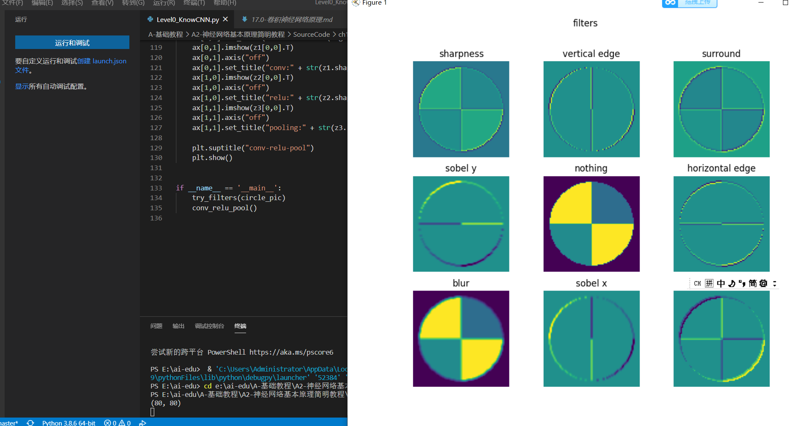
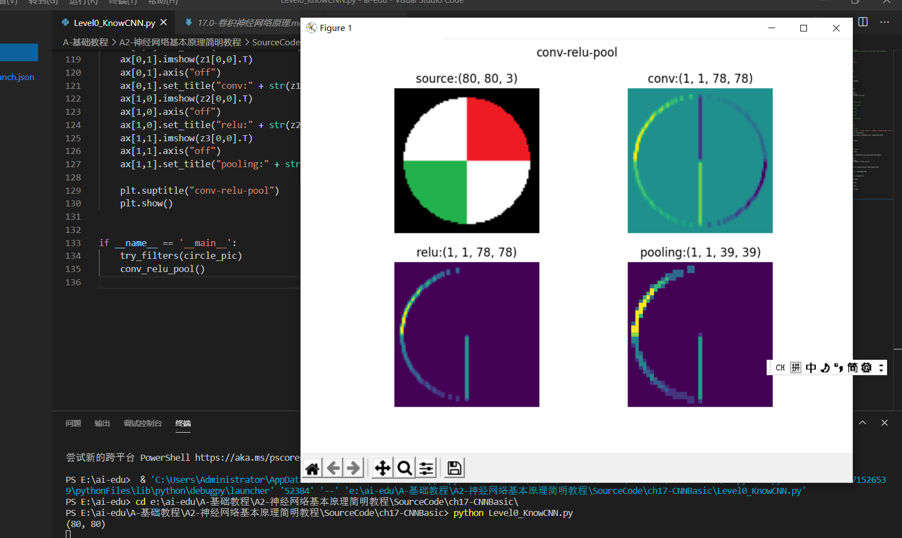
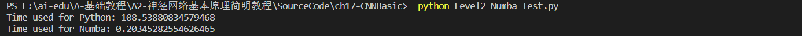
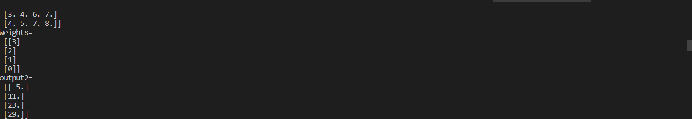
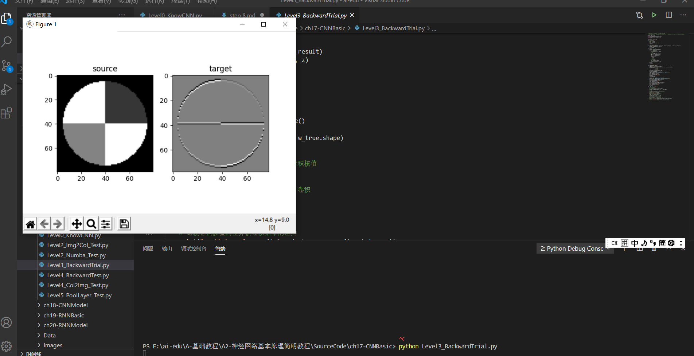
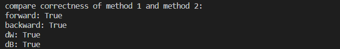
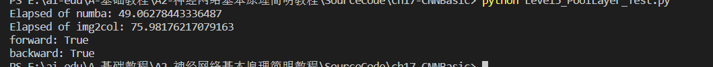

## step 8

### 卷积神经网络

#### 卷积神经网络的能力

在图像识别和分类领域中取得了非常好的效果，比如识别人脸、物体、交通标识等，这就为机器人、自动驾驶等应用提供了坚实的技术基础。

举个例子：在AI人工领域，我们需要知道画面里面所呈现的是什么东西，一些人，动物，建筑物等等。

如果这个照片反馈给计算机，计算机就要知道这幅画里面有四个人，这些具体的任务就是由卷积神经网络完成的。

#### 卷积神经网络的典型结构

层级结构：
1. 原始的输入是一张图片，可以是彩色的，也可以是灰度的或黑白的。这里假设是只有一个通道的图片，目的是识别0~9的手写体数字；
2. 第一层卷积，我们使用了4个卷积核，得到了4张feature map；激活函数层没有单独画出来，这里我们紧接着卷积操作使用了Relu激活函数；
3. 第二层是池化，使用了Max Pooling方式，把图片的高宽各缩小一倍，但仍然是4个feature map；
4. 第三层卷积，我们使用了4x6个卷积核，其中4对应着输入通道，6对应着输出通道，从而得到了6张feature map，当然也使用了Relu激活函数；
5. 第四层再次做一次池化，现在得到的图片尺寸只是原始尺寸的四分之一左右；
6. 第五层把第四层的6个图片展平成一维，成为一个fully connected层；
7. 第六层再接一个小一些的fully connected层；
8. 最后接一个softmax函数，判别10个分类。

总的来说：
在一个典型的卷积神经网络中，会至少包含以下几个层：

- 卷积层
- 激活函数层
- 池化层
- 全连接分类层

#### 卷积核的作用

通俗的说卷积核就是一个小矩阵。

#### 卷积后续的运算

卷积神经网络通过反向传播而令卷积核自我学习，找到分布在图片中的不同的feature，最后形成的卷积核中的数据。但是如果想达到这种效果，只有卷积层的话是不够的，还需要激活函数、池化等操作的配合。

#### 代码实现

#### 卷积的前向计算原理

定义：卷积与傅里叶变换有着密切的关系。利用这点性质，即两函数的傅里叶变换的乘积等于它们卷积后的傅里叶变换，能使傅里叶分析中许多问题的处理得到简化。

#### 代码实现

#### 单入单出的二维卷积

结论：

1. 我们实现的卷积操作不是原始数学含义的卷积，而是工程上的卷积，可以简称为卷积
2. 在实现卷积操作时，并不会反转卷积核

#### 三维卷积

对于三维卷积，有以下特点：

1. 预先定义输出的feature map的数量，而不是根据前向计算自动计算出来，此例中为2，这样就会有两组WeightsBias
2. 对于每个输出，都有一个对应的过滤器Filter，此例中Feature Map-1对应Filter-1
3. 每个Filter内都有一个或多个卷积核Kernal，对应每个输入通道(Input Channel)，此例为3，对应输入的红绿蓝三个通道
4. 每个Filter只有一个Bias值，Filter-1对应b1，Filter-2对应b2
5. 卷积核Kernal的大小一般是奇数如：1x1, 3x3, 5x5, 7x7等，此例为5x5

注意：
1. 一般情况下，我们用正方形的卷积核，且为奇数
2. 如果计算出的输出图片尺寸为小数，则取整，不做四舍五入

#### 代码实现

#### 卷积的反向传播原理

正向公式：

$$Z = W*A+b \tag{0}$$

其中，W是卷积核，*表示卷积（互相关）计算，A为当前层的输入项，b是偏移（未在图中画出），Z为当前层的输出项，但尚未经过激活函数处理。

#### 代码实现

#### 常用池化方法

池化 pooling，又称为下采样，downstream sampling or sub-sampling。

池化方法分为两种，一种是最大值池化 Max Pooling，一种是平均值池化 Mean/Average Pooling。

其目的是：

- 扩大视野：就如同先从近处看一张图片，然后离远一些再看同一张图片，有些细节就会被忽略
- 降维：在保留图片局部特征的前提下，使得图片更小，更易于计算
- 平移不变性，轻微扰动不会影响输出：比如上图中最大值池化的4，即使向右偏一个像素，其输出值仍为4
- 维持同尺寸图片，便于后端处理：假设输入的图片不是一样大小的，就需要用池化来转换成同尺寸图片

#### 代码实现

#### 经典的卷积神经网络模型

卷积神经网络是现在深度学习领域中最有用的网络类型，尤其在计算机视觉领域更是一枝独秀。卷积神经网络从90年代的LeNet开始，沉寂了10年，也孵化了10年，直到2012年AlexNet开始再次崛起，后续的ZF Net、VGG、GoogLeNet、ResNet、DenseNet，网络越来越深，架构越来越复杂，解决反向传播时梯度消失的方法也越来越巧妙。

AlexNet的特点：

- 比LeNet深和宽的网络
  
  使用了5层卷积和3层全连接，一共8层。特征数在最宽处达到384。

- 数据增强
  
  针对原始图片256x256的数据，做了随机剪裁，得到224x224的图片若干张。

- 使用ReLU做激活函数
- 在全连接层使用DropOut
- 使用LRN
  
  LRN的全称为Local Response Normalizatio，局部响应归一化，是想对线性输出做一个归一化，避免上下越界。发展至今，这个技术已经很少使用了。

  一些其它的特点如下：

1. 选择采用3x3的卷积核是因为3x3是最小的能够捕捉像素8邻域信息的尺寸。
2. 使用1x1的卷积核目的是在不影响输入输出的维度情况下，对输入进行形变，再通过ReLU进行非线性处理，提高决策函数的非线性。
3. 2个3x3卷积堆叠等于1个5x5卷积，3个3x3堆叠等于1个7x7卷积，感受野大小不变，而采用更多层、更小的卷积核可以引入更多非线性（更多的隐藏层，从而带来更多非线性函数），提高决策函数判决力，并且带来更少参数。
4. 每个VGG网络都有3个FC层，5个池化层，1个softmax层。
5. 在FC层中间采用dropout层，防止过拟合。

虽然 VGGNet 减少了卷积层参数，但实际上其参数空间比 AlexNet 大，其中绝大多数的参数都是来自于第一个全连接层，耗费更多计算资源。在随后的 NIN 中发现将这些全连接层替换为全局平均池化，对于性能影响不大，同时显著降低了参数数量。

这个为DenseNet模型结构图

优点：

1. 相比ResNet拥有更少的参数数量
2. 旁路加强了特征的重用
3. 网络更易于训练,并具有一定的正则效果
4. 缓解了gradient vanishing和model degradation的问题

#### 实现颜色分类

1. 针对细直线，由于带颜色的像素点的数量非常少，被拆成向量后，这些像素点就会在1x784的矢量中彼此相距很远，特征不明显，很容易被判别成噪音；
2. 针对大色块，由于带颜色的像素点的数量非常多，即使被拆成向量，也会占据很大的部分，这样特征点与背景点的比例失衡，导致无法判断出到底哪个是特征点。

#### 1*1卷积

这样做可以达到两个目的：

1. 跨通道信息整合
2. 降维以减少学习参数

#### 实现几何图形分类

一共有5种形状：圆形、菱形、直线、矩形、三角形。上图中列出了一些样本，由于图片尺寸是28x28的灰度图，所以在放大显示后可以看到很多锯齿，读者可以忽略。需要强调的是，每种形状的尺寸和位置在每个样本上都是有差异的，它们的大小和位置都是随机的，比如圆形的圆心位置和半径都是不一样的，还有可能是个椭圆。

1. 比如第一个卷积核，其作用为判断是否有左侧边缘，那么第一行的数据为[0,1,0,1,1]，表示对直线和菱形来说，没有左侧边缘特征，而对于三角形、矩形、圆形来说，有左侧边缘特征。这样的话，就可以根据这个特征把5种形状分为两类：

   - A类有左侧边缘特征：三角形、矩形、圆形
   - B类无左侧边缘特征：直线、菱形

2. 再看第二个卷积核，是判断是否有大色块区域的，只有直线没有该特征，其它4种形状都有。那么看第1个特征的B类种，包括直线、菱形，则第2个特征就可以把直线和菱形分开了。

3. 然后我们只关注A类形状，看第三个卷积核，判断是否有左上侧边缘，对于三角形、矩形、圆形的取值为[1,0,1]，即矩形没有左上侧边缘，这样就可以把矩形从A类中分出来。

4. 对于三角形和圆形，卷积核5、7、8都可以给出不同的值，这就可以把二者分开了。

#### MNIST分类

下图按行显示了以下内容：

1. 卷积核数值
2. 卷积核抽象
3. 卷积结果
4. 激活结果
5. 池化结果

第二组卷积核、激活、池化的可视化

- Conv2：由于是在第一层的特征图上卷积后叠加的结果，所以基本不能按照原图理解，但也能大致看出是是一些轮廓抽取的作用；
- Relu2：能看出的是如果黑色区域多的话，说明基本没有激活值，此卷积核效果就没用；
- Pool2：池化后分化明显的特征图是比较有用的特征，比如3、6、12、15、16；信息太多或者太少的特征图，都用途偏小，比如1、7、10、11。

#### Fashion-MNIST分类

MNIST手写识别数据集，对卷积神经网络来说已经太简单了，于是科学家们增加了图片的复杂度，用10种物品代替了10个数字。

#### Cifar-10分类

在这个模型中：

1. 先用卷积->激活->卷积->激活->池化->丢弃层，做为第一梯队，卷积核32个；
2. 然后再用卷积->激活->卷积->激活->池化->丢弃层做为第二梯队，卷积核64个；
3. Flatten和Dense相当于把池化的结果转成Nx512的全连接层，N是池化输出的尺寸，被Flatten扁平化了；
4. 再接丢弃层，避免过拟合；
5. 最后接10个神经元的全连接层加Softmax输出。

##### 环境搭建

1. 安装Python 3.6（本书中所有案例在Python 3.6上开发测试）
2. 安装CUDA（没有GPU的读者请跳过）
3. 安装cuDNN（没有GPU的读者请跳过）
4. 安装TensorFlow，有GPU硬件的一定要按照GPU版，没有的只能安装CPU版
5. 安装Keras

### 总结

这节课我们学习了卷积神经网络，他是深度学习中的一个标志性技术，我们的主要目的就是让计算机可以识别出照片中的一些人物形象。

我们主要学习了卷积的前向计算、卷积的反向传播、池化的前向计算与反向传播，并运行了一些代码，而且分析了他们。

