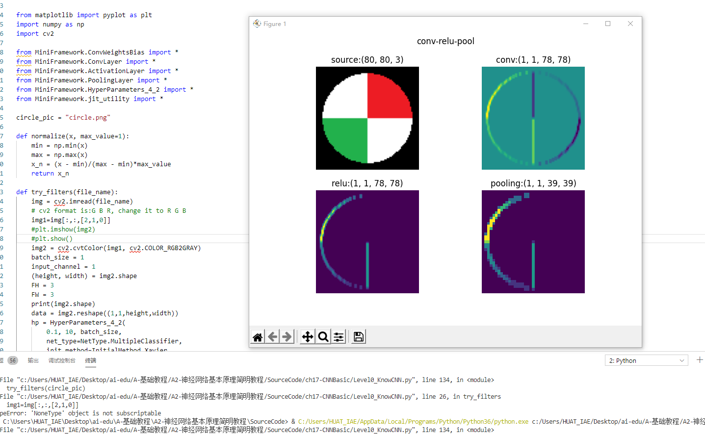
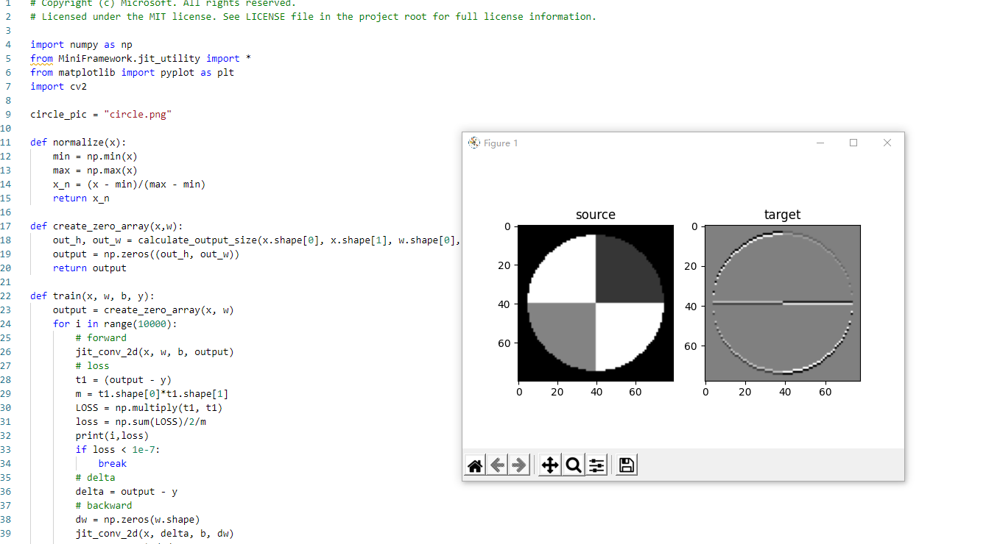

# 第4次作业 Step8 学习笔记#
## 201809027 郭小凡 ##

# 17.0 卷积神经网络原理 #
## CNN背景 ##
卷积神经网络（$CNN$，$Convolutional Neural Net$)是神经网络的类型之一。

CNN在图像识别和分类领域应用广泛，为机器人、自动驾驶等应用提供技术基础。

## CNN典型结构 ##

                图17-1 卷积神经网络的典型结构图

CNN典型结构图层次分析如下：　
1. 输入任意色彩原始图片，用于后续识别0~9手写字体。
2. 第一层卷积——使用4个卷积核，得到4张feature map。
3. 第二层池化——使用Max Pooling方式，将图片的高宽各缩小一倍，仍然得到4个feature map。
4. 第三层卷积——使用4*6个卷积核，4为输入通道，6为输出通道；使用Relu激活函数，得到6张feature map。
5. 第四层池化——再次缩小图片的高和宽，得到尺寸为原图尺寸四分之一的图片。
6. 第五层平展——将第四层池化后得到的6张图片平展为一维图像，成为一个fully connected层。
7. 第六层再接——将第五层得到的fully connected层再接一个小一些的fully connected层。
8. 最后接入softmax函数，判别10个分类。

综上所述，在典型卷积神经网络中，至少包含：
- 卷积层
- 激活函数层
- 池化层
- 全连接分类层

## 卷积核的作用 ##

                图17-2 卷积核的作用

### 1-9对应卷积核作用表如下： ###

|序号|名称|说明|
|---|---|---|
|1|锐化|如果一个像素点比周围像素点亮，则此算子会令其更亮|
|2|检测竖边|检测出了十字线中的竖线，由于是左侧和右侧分别检查一次，所以得到两条颜色不一样的竖线|
|3|周边|把周边增强，把同色的区域变弱，形成大色块|
|4|Sobel-Y|纵向亮度差分可以检测出横边，与横边检测不同的是，它可以使得两条横线具有相同的颜色，具有分割线的效果|
|5|Identity|中心为1四周为0的过滤器，卷积后与原图相同|
|6|横边检测|检测出了十字线中的横线，由于是上侧和下侧分别检查一次，所以得到两条颜色不一样的横线|
|7|模糊|通过把周围的点做平均值计算而“杀富济贫”造成模糊效果|
|8|Sobel-X|横向亮度差分可以检测出竖边，与竖边检测不同的是，它可以使得两条竖线具有相同的颜色，具有分割线的效果|
|9|浮雕|形成大理石浮雕般的效果|

## 卷积后续运算

                图17-3 原图经过卷积-激活-池化操作后的效果

1-4图片分别对应：
1. 原图
2. 卷积结果
3. 激活结果
4. 池化结果

# CNN的学习 #

- 平移不变性
  
  对于原始图A，平移后得到图B，对于同一个卷积核来说，都会得到相同的特征，这就是卷积核的权值共享。但是特征处于不同的位置，由于距离差距较大，即使经过多层池化后，也不能处于近似的位置。此时，后续的全连接层会通过权重值的调整，把这两个相同的特征看作同一类的分类标准之一。如果是小距离的平移，通过池化层就可以处理了。

- 旋转不变性

  对于原始图A，有小角度的旋转得到C，卷积层在A图上得到特征a，在C图上得到特征c，可以想象a与c的位置间的距离不是很远，在经过两层池化以后，基本可以重合。所以卷积网络对于小角度旋转是可以容忍的，但是对于较大的旋转，需要使用数据增强来增加训练样本。一个极端的例子是当6旋转90度时，谁也不能确定它到底是6还是9。

- 尺度不变性

  对于原始图A和缩小的图D，人类可以毫不费力地辨别出它们是同一个东西。但池化在这里并没有帮助，因为神经网络对A做池化的同时，也会用相同的方法对D做池化，这样池化的次数一致，最终D还是比A小。如果我们有多个卷积视野，相当于从两米远的地方看图A，从一米远的地方看图D，那么A和D就可以很相近似了。这就是Inception的想法，用不同尺寸的卷积核去同时寻找同一张图片上的特征。

## 代码测试结果 ##

# 17.1卷积的前向计算原理 #
## 卷积的数学定义 ##
### 连续定义 ###

$$h(x)=(f*g)(x) = \int_{-\infty}^{\infty} f(t)g(x-t)dt $$

### 离散定义 ###

$$h(x) = (f*g)(x) = \sum^{\infty}_{t=-\infty} f(t)g(x-t) $$

## 单入单出的二维卷积 ##
二维卷积一般用于图像处理。

对于一个二维图像，将图像Image简写为$I$，把卷积核Kernal简写为$K$，则目标图片的第$(i,j)$个像素的卷积值为：
$$
h(i,j) = (I*K)(i,j)=\sum_m \sum_n I(m,n)K(i-m,j-n)
$$

在图像处理中，自相关函数和互相关函数定义如下：

- 自相关：设原函数是f(t)，则$h=f(t) \star f(-t)$，其中$\star$表示卷积
- 互相关：设两个函数分别是f(t)和g(t)，则$h=f(t) \star g(-t)$

##  卷积编程模型 ##

                图17-4 三通道经过两组过滤器的卷积过程

图中包含概念：
- 输入 Input Channel
- 卷积核组 WeightsBias
- 过滤器 Filter
- 卷积核 kernal
- 输出 Feature Map

对于三维卷积，有以下特点：

1. 预先定义输出的feature map的数量，而不是根据前向计算自动计算出来，此例中为2，这样就会有两组WeightsBias
2. 对于每个输出，都有一个对应的过滤器Filter，此例中Feature Map-1对应Filter-1
3. 每个Filter内都有一个或多个卷积核Kernal，对应每个输入通道(Input Channel)，此例为3，对应输入的红绿蓝三个通道
4. 每个Filter只有一个Bias值，Filter-1对应b1，Filter-2对应b2
5. 卷积核Kernal的大小一般是奇数如：1x1, 3x3, 5x5, 7x7等，此例为5x5

## 步长 stride ##
每次计算后，卷积核会向右或者向下移动一个单元，即步长stride = 1。

而在如下卷积操作中，卷积核每次向右或向下移动两个单元，即stride = 2。由于每次移动两格，所以最终得到一个2x2的图片。

                图17-5 步长为2的卷积

## 填充 padding ##
进行卷积后，目标图片可能会缩小。若想保持目标图片和原始图片为同样大小，一般会向原始图片周围填充一圈0，然后再做卷积。

                图17-6 带填充的卷积

## 注 ##

1. 一般情况下，我们用正方形的卷积核，且为奇数
2. 如果计算出的输出图片尺寸为小数，则取整，不做四舍五入

# 17.2 卷积前向计算代码测试结果 #

# 17.3 卷积层的训练 #
# 卷积的反向传播原理 #
卷积层的训练也需要从上一层回传的误差矩阵，然后计算：

1. 本层的权重矩阵的误差项
2. 本层的需要回传到下一层的误差矩阵

## 计算反向传播的梯度矩阵 ##
正向公式：

$$Z = W*A+b $$

其中，
1. W是卷积核，*表示卷积（互相关）计算
2. A为当前层的输入项
3. b是偏移（未在图中画出）
4. Z为当前层的输出项，但尚未经过激活函数处理

                 图17-7 卷积正向运算

对应公式计算：
$$z_{11} = w_{11} \cdot a_{11} + w_{12} \cdot a_{12} + w_{21} \cdot a_{21} + w_{22} \cdot a_{22} + b $$
$$z_{12} = w_{11} \cdot a_{12} + w_{12} \cdot a_{13} + w_{21} \cdot a_{22} + w_{22} \cdot a_{23} + b $$
$$z_{21} = w_{11} \cdot a_{21} + w_{12} \cdot a_{22} + w_{21} \cdot a_{31} + w_{22} \cdot a_{32} + b $$
$$z_{22} = w_{11} \cdot a_{22} + w_{12} \cdot a_{23} + w_{21} \cdot a_{32} + w_{22} \cdot a_{33} + b $$

## 有多个卷积核时的梯度计算 ##

有多个卷积核意味着有多个输出通道。

                图17-8 升维卷积

对应计算公式：

$$z_{111} = w_{111} \cdot a_{11} + w_{112} \cdot a_{12} + w_{121} \cdot a_{21} + w_{122} \cdot a_{22}$$
$$z_{112} = w_{111} \cdot a_{12} + w_{112} \cdot a_{13} + w_{121} \cdot a_{22} + w_{122} \cdot a_{23}$$
$$z_{121} = w_{111} \cdot a_{21} + w_{112} \cdot a_{22} + w_{121} \cdot a_{31} + w_{122} \cdot a_{32}$$
$$z_{122} = w_{111} \cdot a_{22} + w_{112} \cdot a_{23} + w_{121} \cdot a_{32} + w_{122} \cdot a_{33}$$
$$z_{211} = w_{211} \cdot a_{11} + w_{212} \cdot a_{12} + w_{221} \cdot a_{21} + w_{222} \cdot a_{22}$$
$$z_{212} = w_{211} \cdot a_{12} + w_{212} \cdot a_{13} + w_{221} \cdot a_{22} + w_{222} \cdot a_{23}$$
$$z_{221} = w_{211} \cdot a_{21} + w_{212} \cdot a_{22} + w_{221} \cdot a_{31} + w_{222} \cdot a_{32}$$
$$z_{222} = w_{211} \cdot a_{22} + w_{212} \cdot a_{23} + w_{221} \cdot a_{32} + w_{222} \cdot a_{33}$$

需要前传的梯度矩阵：

$$\delta_{out} = \sum_m \delta_{in\_m} * W^{rot180}_ m  $$

## 有多个输入时的梯度计算 ##

当输入层是多个图层时，每个图层必须对应一个卷积核。

                图17-9 多个图层的卷积必须有一一对应的卷积核

有前项公式：

$$
\begin{aligned}
z_{11} &= w_{111} \cdot a_{111} + w_{112} \cdot a_{112} + w_{121} \cdot a_{121} + w_{122} \cdot a_{122}
\\\\
&+ w_{211} \cdot a_{211} + w_{212} \cdot a_{212} + w_{221} \cdot a_{221} + w_{222} \cdot a_{222} 
\end{aligned}
$$
$$
\begin{aligned}
z_{12} &= w_{111} \cdot a_{112} + w_{112} \cdot a_{113} + w_{121} \cdot a_{122} + w_{122} \cdot a_{123} \\\\
&+ w_{211} \cdot a_{212} + w_{212} \cdot a_{213} + w_{221} \cdot a_{222} + w_{222} \cdot a_{223} 
\end{aligned}$$
$$
\begin{aligned}
z_{21} &= w_{111} \cdot a_{121} + w_{112} \cdot a_{122} + w_{121} \cdot a_{131} + w_{122} \cdot a_{132} \\\\
&+ w_{211} \cdot a_{221} + w_{212} \cdot a_{222} + w_{221} \cdot a_{231} + w_{222} \cdot a_{232} 
\end{aligned}$$
$$
\begin{aligned}
z_{22} &= w_{111} \cdot a_{122} + w_{112} \cdot a_{123} + w_{121} \cdot a_{132} + w_{122} \cdot a_{133} \\\\
&+ w_{211} \cdot a_{222} + w_{212} \cdot a_{223} + w_{221} \cdot a_{232} + w_{222} \cdot a_{233} 
\end{aligned}$$

## 卷积核的梯度计算 ##

                 图17-10 卷积正向计算

对应计算公式：

$$\delta_w = A * \delta_{in} $$

## 偏移的梯度计算 ##
$$
\delta_b = \delta_{in} 
$$

每个卷积核W可能会有多个filter，或者叫子核，但是一个卷积核只有一个偏移。

# 17.4 卷积反向传播代码实现 #

# 17.5 池化的前向计算与反向传播 #
## 池化层定义及常用方法 ##
池化 pooling，又称为下采样，$downstream sampling or sub-sampling$。

池化方法分为两种:
1. 最大值池化 Max Pooling
2. 平均值池化 Mean/Average Pooling

                图17-11 池化

- 最大值池化，是取当前池化视野中所有元素的最大值，输出到下一层特征图中。【多用】
- 平均值池化，是取当前池化视野中所有元素的平均值，输出到下一层特征图中。

池化目的：

- 扩大视野：就如同先从近处看一张图片，然后离远一些再看同一张图片，有些细节就会被忽略
- 降维：在保留图片局部特征的前提下，使得图片更小，更易于计算
- 平移不变性，轻微扰动不会影响输出：比如上图中最大值池化的4，即使向右偏一个像素，其输出值仍为4
- 维持同尺寸图片，便于后端处理：假设输入的图片不是一样大小的，就需要用池化来转换成同尺寸图片

## 代码测试结果 ##

# 18.0 经典卷积神经网络模型 #

## LeNet ##

LeNet是卷积神经网络的鼻祖，其模型结构如下：

                 图18-1 LeNet模型结构图

其确定了卷积神经网络最基本的框架：卷积层、池化层、全连接层。

## AlexNet ##

AlexNet网络结构在整体上类似于LeNet，都是先卷积然后在全连接。但在细节上有很大不同。

AlexNet更为复杂。AlexNet有60 million个参数和65000个神经元，五层卷积，三层全连接网络，最终的输出层是1000通道的Softmax。

AlexNet的模型结构如下：

                  图18-2 AlexNet模型结构图

## ZFNet ##

ZF-Net将AlexNet第一层卷积核由11变成7，步长由4变为2，第3，4，5卷积层转变为384，384，256。
ZFNet的结构示意图如下：

                图18-3 ZFNet模型结构图

## DenseNet ##

DenseNet是一种具有密集连接的卷积神经网络。在该网络中，任何两层之间都有直接的连接，也就是说，网络每一层的输入都是前面所有层输出的并集，而该层所学习的特征图也会被直接传给其后面所有层作为输入。

下图是 DenseNet 的一个dense block示意图，一个block里面的结构如下，与ResNet中的BottleNeck基本一致：BN-ReLU-Conv(1×1)-BN-ReLU-Conv(3×3) ，而一个DenseNet则由多个这种block组成。每个DenseBlock的之间层称为transition layers，由BN−>Conv(1×1)−>averagePooling(2×2)组成。

ResNets的模型结构如下：

                  图18-4 DenseNet模型结构图

DenseNet作为另一种拥有较深层数的卷积神经网络，具有如下优点：

1. 相比ResNet拥有更少的参数数量
2. 旁路加强了特征的重用
3. 网络更易于训练,并具有一定的正则效果
4. 缓解了gradient vanishing和model degradation的问题

# 18.1 实现颜色分类 #

卷积神经网络可以在图像分类上发挥作用，而一般的图像都是彩色的，也就是说卷积神经网络应该可以判别颜色的。

样本数据如图所示：

                    图18-5 颜色分类样本数据图

在样本数据中，一共有6种颜色：

- 红色 red
- 绿色 green
- 蓝色 blue
- 青色（蓝+绿） cyan
- 黄色（红+绿） yellow
- 粉色（红+蓝） pink

6种颜色是分布在5种形状之上：

- 圆形
- 菱形
- 直线
- 矩形
- 三角形

## 代码测试结果 ##

# 18.2 实现几何图形分类 #
有如图所示的样本数据：

                图18-6 样本数据

在如图所示的样本数据中一共有5种形状：圆形、菱形、直线、矩形、三角形。

其中列出了一些样本，由于图片尺寸是28x28的灰度图，所以在放大显示后可以看到很多锯齿。需要强调的是，每种形状的尺寸和位置在每个样本上都是有差异的，它们的大小和位置都是随机的，比如圆形的圆心位置和半径都是不一样的，还有可能是个椭圆。

## 代码测试结果 ##

# 18.3 实现几何图形及颜色的分类 #

样本数据如图所示：

                          图18-7 样本数据

对于样本数据中的三种形状和三种颜色，对应下表：

       表18-1 样本数据分类和数量

||红色|蓝色|绿色|
|---|---|---|---|
|圆形|600:100|600:100|600:100|
|矩形|600:100|600:100|600:100|
|三角形|600:100|600:100|600:100|

## 代码测试结果 ##

# 18.4 解决MNIST分类问题 #

搭建模型如图所示：

              图18-8 卷积神经网络模型解决MNIST问题

模型中各层的功能和参数如下表所示：

          表18-2 模型中各层的功能和参数

|Layer|参数|输入|输出|参数个数|
|---|---|---|---|---|
|卷积层|8x5x5,s=1|1x28x28|8x24x24|200+8|
|激活层|2x2,s=2, max|8x24x24|8x24x24||
|池化层|Relu|8x24x24|8x12x12||
|卷积层|16x5x5,s=1|8x12x12|16x8x8|400+16|
|激活层|Relu|16x8x8|16x8x8||
|池化层|2x2, s=2, max|16x8x8|16x4x4||
|全连接层|256x32|256|32|8192+32|
|批归一化层||32|32||
|激活层|Relu|32|32||
|全连接层|32x10|32|10|320+10|
|分类层|softmax,10|10|10|

## 代码测试结果 ##

# 18.5 Fashion-MNIST分类 #
部分样本如图所示：

             图18-9 部分样本图展示

按样本类别（从0开始计数）分行显示：

1. T-Shirt，T恤衫（1-3行）
2. Trouser，裤子（4-6行）
3. Pullover，套头衫（7-9行）
4. Dress，连衣裙（10-12行）
5. Coat，外套（13-15行）
6. Sandal，凉鞋（16-18行）
7. Shirt，衬衫（19-21行）
8. Sneaker，运动鞋（22-24行）
9. Bag，包（25-27行）
10. Ankle Boot，短靴（28-30行）

## 代码测试结果 ##

