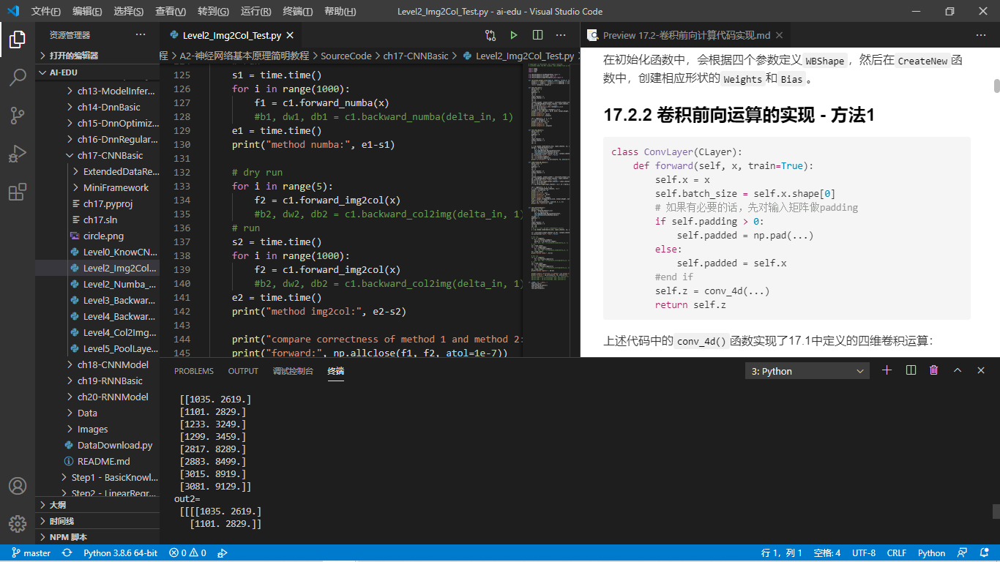
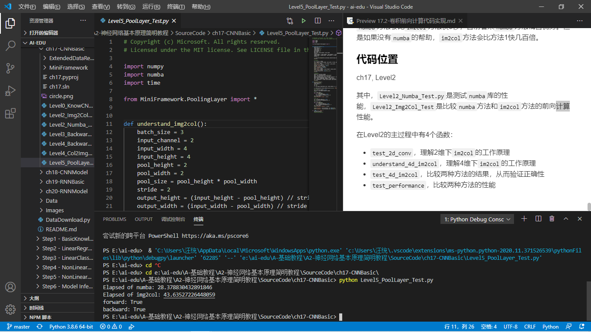
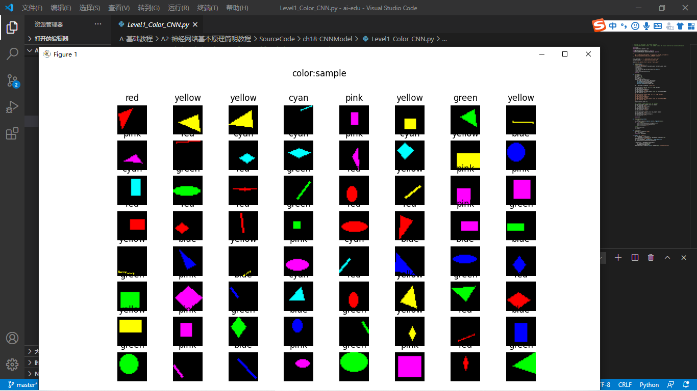
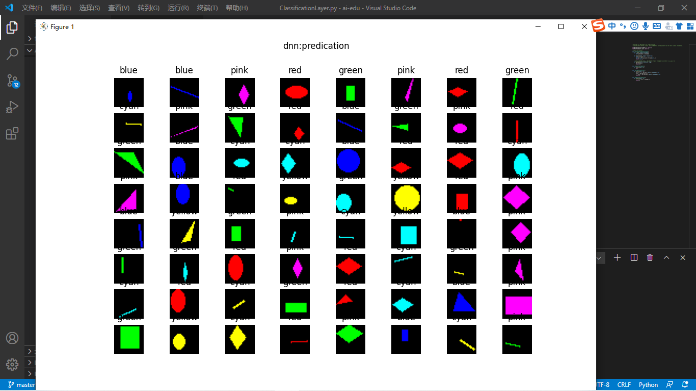
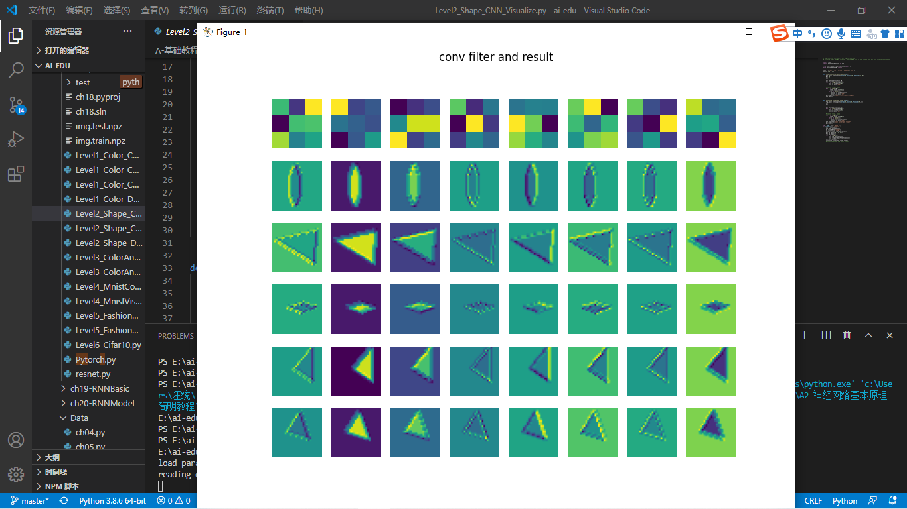
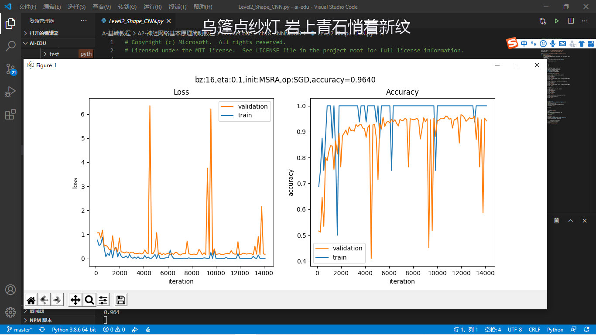
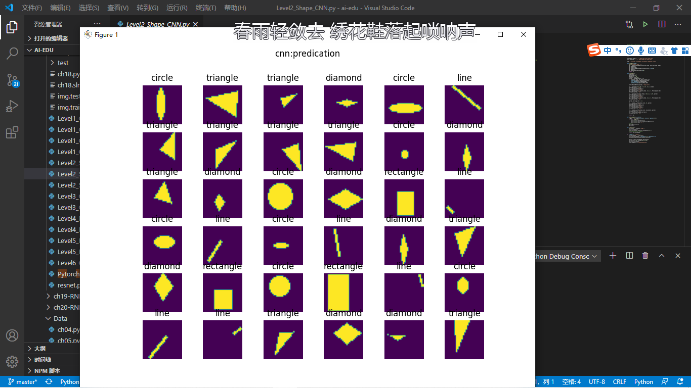
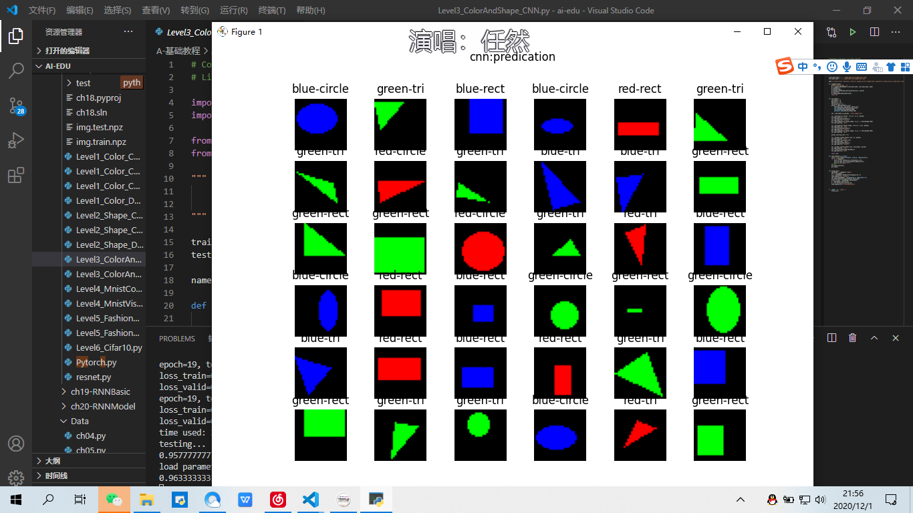

##卷积神经网络
####卷积神经网络的层级结构
层级结构：

1. 原始的输入是一张图片，可以是彩色的，也可以是灰度的或黑白的。这里假设是只有一个通道的图片，目的是识别0~9的手写体数字；
2. 第一层卷积，我们使用了4个卷积核，得到了4张feature map；激活函数层没有单独画出来，这里我们紧接着卷积操作使用了Relu激活函数；
3. 第二层是池化，使用了Max Pooling方式，把图片的高宽各缩小一倍，但仍然是4个feature map；
4. 第三层卷积，我们使用了4x6个卷积核，其中4对应着输入通道，6对应着输出通道，从而得到了6张feature map，当然也使用了Relu激活函数；
5. 第四层再次做一次池化，现在得到的图片尺寸只是原始尺寸的四分之一左右；
6. 第五层把第四层的6个图片展平成一维，成为一个fully connected层；
7. 第六层再接一个小一些的fully connected层；
8. 最后接一个softmax函数，判别10个分类。

所以，在一个典型的卷积神经网络中，会至少包含以下几个层：

- 卷积层
- 激活函数层
- 池化层
- 全连接分类层
卷积核的作用

|序号|名称|说明|
|---|---|---|
|1|锐化|如果一个像素点比周围像素点亮，则此算子会令其更亮|
|2|检测竖边|检测出了十字线中的竖线，由于是左侧和右侧分别检查一次，所以得到两条颜色不一样的竖线|
|3|周边|把周边增强，把同色的区域变弱，形成大色块|
|4|Sobel-Y|纵向亮度差分可以检测出横边，与横边检测不同的是，它可以使得两条横线具有相同的颜色，具有分割线的效果|
|5|Identity|中心为1四周为0的过滤器，卷积后与原图相同|
|6|横边检测|检测出了十字线中的横线，由于是上侧和下侧分别检查一次，所以得到两条颜色不一样的横线|
|7|模糊|通过把周围的点做平均值计算而“杀富济贫”造成模糊效果|
|8|Sobel-X|横向亮度差分可以检测出竖边，与竖边检测不同的是，它可以使得两条竖线具有相同的颜色，具有分割线的效果|
|9|浮雕|形成大理石浮雕般的效果|

- 平移不变性
  对于原始图A，平移后得到图B，对于同一个卷积核来说，都会得到相同的特征，这就是卷积核的权值共享。但是特征处于不同的位置，由于距离差距较大，即使经过多层池化后，也不能处于近似的位置。此时，后续的全连接层会通过权重值的调整，把这两个相同的特征看作同一类的分类标准之一。如果是小距离的平移，通过池化层就可以处理了。
- 旋转不变性
  对于原始图A，有小角度的旋转得到C，卷积层在A图上得到特征a，在C图上得到特征c，可以想象a与c的位置间的距离不是很远，在经过两层池化以后，基本可以重合。所以卷积网络对于小角度旋转是可以容忍的，但是对于较大的旋转，需要使用数据增强来增加训练样本。一个极端的例子是当6旋转90度时，谁也不能确定它到底是6还是9。
- 尺度不变性
  对于原始图A和缩小的图D，人类可以毫不费力地辨别出它们是同一个东西。池化在这里是不是有帮助呢？没有！因为神经网络对A做池化的同时，也会用相同的方法对D做池化，这样池化的次数一致，最终D还是比A小。如果我们有多个卷积视野，相当于从两米远的地方看图A，从一米远的地方看图D，那么A和D就可以很相近似了。这就是Inception的想法，用不同尺寸的卷积核去同时寻找同一张图片上的特征。
#### 卷积的数学定义
#### 连续定义
$$h(x)=(f*g)(x) = \int_{-\infty}^{\infty} f(t)g(x-t)dt \tag{1}$$
卷积与傅里叶变换有着密切的关系。利用这点性质，即两函数的傅里叶变换的乘积等于它们卷积后的傅里叶变换，能使傅里叶分析中许多问题的处理得到简化。
#### 离散定义
$$h(x) = (f*g)(x) = \sum^{\infty}_{t=-\infty} f(t)g(x-t) \tag{2}$$
####常用池化方法
池化 pooling，又称为下采样，downstream sampling or sub-sampling。
池化方法分为两种，一种是最大值池化 Max Pooling，一种是平均值池化 Mean/Average Pooling。如图

- 最大值池化，是取当前池化视野中所有元素的最大值，输出到下一层特征图中。
- 平均值池化，是取当前池化视野中所有元素的平均值，输出到下一层特征图中。
其目的是：
- 扩大视野：就如同先从近处看一张图片，然后离远一些再看同一张图片，有些细节就会被忽略
- 降维：在保留图片局部特征的前提下，使得图片更小，更易于计算
- 平移不变性，轻微扰动不会影响输出：比如上图中最大值池化的4，即使向右偏一个像素，其输出值仍为4
- 维持同尺寸图片，便于后端处理：假设输入的图片不是一样大小的，就需要用池化来转换成同尺寸图片
一般我们都使用最大值池化。

代码运行示例：
ch17,Level0
运行效果

代码运行示例：
ch17,level2
运行效果

代码运行示例：
ch17，level3
运行效果：

代码运行示例：
ch17，level4
代码效果：

代码运行示例：
ch17，level5
代码效果：

颜色分类：
代码运行示例：
ch18，level1
代码效果：

代码运行示例：
ch18，level2
代码效果：

代码运行示例：
ch18，level3
代码效果

代码运行示例：
ch18，level4
代码效果：

#心得 在本次学习中我了解到了卷积神经网络的基本性质，知道了卷积神经网络的原理，在运行代码的过程中，也让我有了一个更加深刻的了解。CNN 基本上是几层具有非线性激活函数的卷积，以及将池化层应用于卷积的结果。每层应用不同的滤波器（成百上千个）。理解的关键是滤波器不是预先设定好的，而是在训练阶段学习的，以使得恰当的损失函数被最小化。已经观察到，较低层会学习检测基本特征，而较高层检测更复杂的特征，例如形状或面部。请注意，由于有池化层，靠后的层中的神经元看到的更多的是原始图像，因此它们能够编辑前几层中学习的基本特征。到目前为止，描述了 ConvNet 的基本概念。CNN 在时间维度上对音频和文本数据进行一维卷积和池化操作，沿（高度×宽度）维度对图像进行二维处理，沿（高度×宽度×时间）维度对视频进行三维处理。对于图像，在输入上滑动滤波器会生成一个特征图，为每个空间位置提供滤波器的响应。换句话说，一个 ConvNet 由多个滤波器堆叠在一起，学习识别在图像中独立于位置信息的具体视觉特征。这些视觉特征在网络的前面几层很简单，然后随着网络的加深，组合成更加复杂的全局特征。当然有些代码电脑运行有点问题，电脑死机了不敢跑。
