# Step8 学习笔记

## 8.1 卷积神经网络原理

### 8.1.1卷积神经网络的能力

卷积神经网络（CNN，Convolutional Neural Net)是神经网络的类型之一，在图像识别和分类领域中取得了非常好的效果，比如识别人脸、物体、交通标识等，这就为机器人、自动驾驶等应用提供了坚实的技术基础。

### 8.1.2 卷积神经网络的典型结构

典型的卷积神经网络结构图

在一个典型的卷积神经网络中，会至少包含以下几个层：

- 卷积层
- 激活函数层
- 池化层
- 全连接分类层

### 8.1.3 卷积核的作用

卷积核相当于小矩阵，我们会用输入数据与卷积核相乘，得到输出数据，就类似全连接层中的Weights一样，所以卷积核里的数值，也是通过反向传播的方法学习到的。

下面我们看看卷积核的具体作用。
（中间那个是相当于原始图片，起到对比的作用
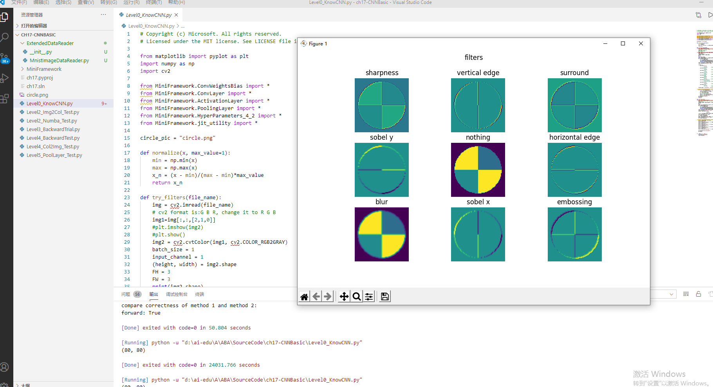

表： 各个卷积核的作用

|序号|名称|说明|
|---|---|---|
|1|锐化|如果一个像素点比周围像素点亮，则此算子会令其更亮|
|2|检测竖边|检测出了十字线中的竖线，由于是左侧和右侧分别检查一次，所以得到两条颜色不一样的竖线|
|3|周边|把周边增强，把同色的区域变弱，形成大色块|
|4|Sobel-Y|纵向亮度差分可以检测出横边，与横边检测不同的是，它可以使得两条横线具有相同的颜色，具有分割线的效果|
|5|Identity|中心为1四周为0的过滤器，卷积后与原图相同|
|6|横边检测|检测出了十字线中的横线，由于是上侧和下侧分别检查一次，所以得到两条颜色不一样的横线|
|7|模糊|通过把周围的点做平均值计算而“杀富济贫”造成模糊效果|
|8|Sobel-X|横向亮度差分可以检测出竖边，与竖边检测不同的是，它可以使得两条竖线具有相同的颜色，具有分割线的效果|
|9|浮雕|形成大理石浮雕般的效果|

图中的四个子图，依次展示了：

1. 原图
2. 卷积结果
3. 激活结果
4. 池化结果
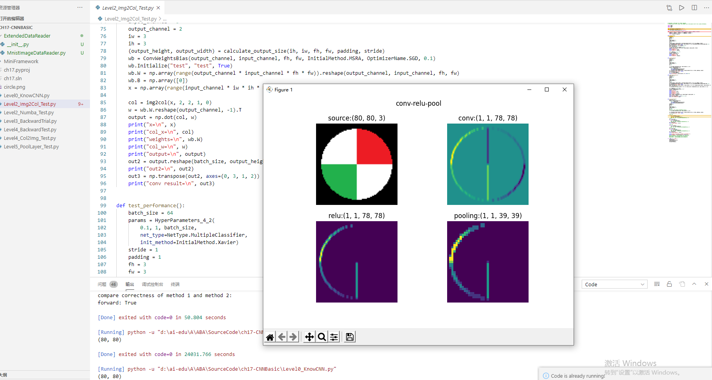

## 8.2 卷积的前向计算

### 8.2.1 卷积的数学定义：

连续定义

$$h(x)=(f*g)(x) = \int_{-\infty}^{\infty} f(t)g(x-t)dt \tag{1}$$

### 8.2.2 卷积的种类（简单介绍）

1.单入单出的二维卷积（图像处理）
2.单入多出的升维卷积（输入是一维，得到多维特征输出）
3.多入多出的同维卷积

### 8.2.3卷积的编程模型

- 输入 Input Channel
- 卷积核组 WeightsBias
- 过滤器 Filter
- 卷积核 kernal
- 输出 Feature Map

### 8.2.4 步长 stride

计算后，卷积核会向右或者向下移动n个单元，即步长stride = n

### 8.2.5 填充 padding

如果原始图为4x4，用3x3的卷积核进行卷积后，目标图片变成了2x2。如果我们想保持目标图片和原始图片为同样大小，一般我们会向原始图片周围填充一圈0，然后再做卷积。如图。

### 8.2.6 输出结果

综合以上所有情况，可以得到卷积后的输出图片的大小的公式：

$$
H_{Output}= {H_{Input} - H_{Kernal} + 2Padding \over Stride} + 1
$$

$$
W_{Output}= {W_{Input} - W_{Kernal} + 2Padding \over Stride} + 1
$$

以图17-17为例：

$$H_{Output}={5 - 3 + 2 \times 0 \over 2}+1=2$$

以图17-18为例：

$$H_{Output}={4 - 3 + 2 \times 1 \over 1}+1=4$$

两点注意：

1. 一般情况下，我们用正方形的卷积核，且为奇数
2. 如果计算出的输出图片尺寸为小数，则取整，不做四舍五入

### 8.2.7 卷积前向计算的实现

因为直接运行代码的话需要跑很长时间，因此加入了numba这个开源项目来减少运行时间
以下图片是测试numba性能的：
下面我们会用一个简单的例子来说明卷积核的训练过程。我们先制作一张样本图片，然后使用“横边检测”算子做为卷积核对该样本进行卷积，得到对比如图

## 8.3 卷积层的反向传播

### 8.3.1 卷积层的训练

需要从上一层回传的误差矩阵，并且经过了激活函数的反向传导，然后计算
1.  本层的权重矩阵的误差项
2.  本层的需要回传到下一层的误差矩阵

### 8.3.2 计算反向传播的梯度矩阵
正向公式：

$$Z = W*A+b \tag{0}$$

其中，W是卷积核，*表示卷积（互相关）计算，A为当前层的输入项，b是偏移（未在图中画出），Z为当前层的输出项，但尚未经过激活函数处理。

### 8.2.3 计算卷积核梯度的实例说明
下面我们会用一个简单的例子来说明卷积核的训练过程。我们先制作一张样本图片，然后使用“横边检测”算子做为卷积核对该样本进行卷积，得到对比如图

原图和经过横边检测算子的卷积结果
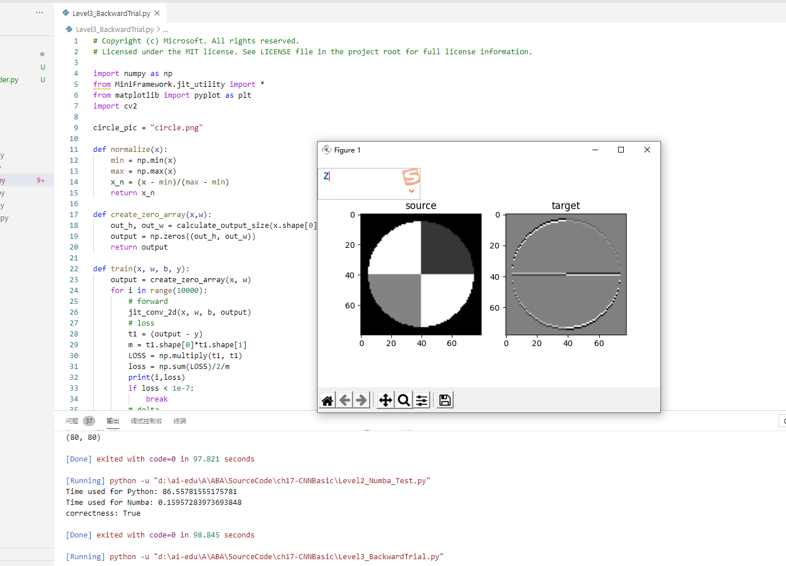

直线拟合中的均方差，是计算预测值与样本点之间的距离；图片拟合中的均方差，可以直接计算两张图片对应的像素点之间的差值。
训练部分如图所示：
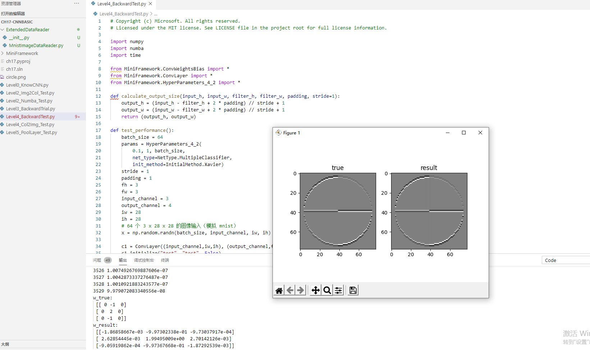

### 8.3.3 反向传播代码实现

代码运行截图如下：
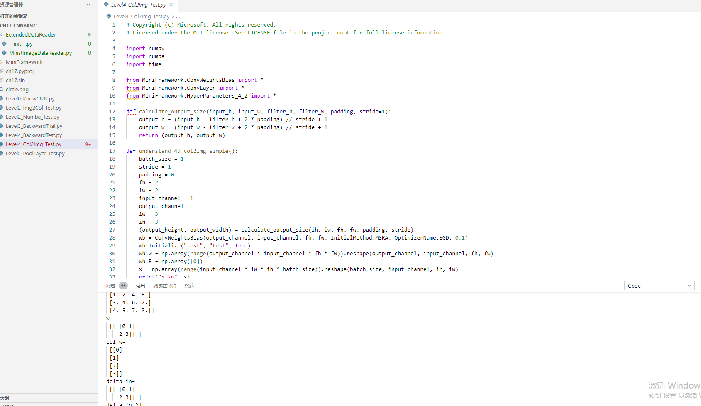

## 8.4 池化层

### 8.4.1 常用的池化方法

池化 pooling，又称为下采样，downstream sampling or sub-sampling。

池化方法分为两种，一种是最大值池化 Max Pooling，一种是平均值池化 Mean/Average Pooling。如图17-32所示。

- 最大值池化，是取当前池化视野中所有元素的最大值，输出到下一层特征图中。
- 平均值池化，是取当前池化视野中所有元素的平均值，输出到下一层特征图中。
其目的是：

- 扩大视野：就如同先从近处看一张图片，然后离远一些再看同一张图片，有些细节就会被忽略
- 降维：在保留图片局部特征的前提下，使得图片更小，更易于计算
- 平移不变性，轻微扰动不会影响输出
- 维持同尺寸图片，便于后端处理：假设输入的图片不是一样大小的，就需要用池化来转换成同尺寸图片

假设输入图片的形状是 $W_1 \times H_1 \times D_1$，其中W是图片宽度，H是图片高度，D是图片深度（多个图层），F是池化的视野（正方形），S是池化的步长，则输出图片的形状是：

$$
\begin{cases}
W_2 = (W_1 - F)/S + 1 \\\\
H_2 = (H_1 - F)/S + 1 \\\\
D_2 = D_1
\end{cases}
$$

池化层不会改变图片的深度，即D值前后相同。

### 8.4.2 max_pool和img2col进行性能测试

测试结果如下：
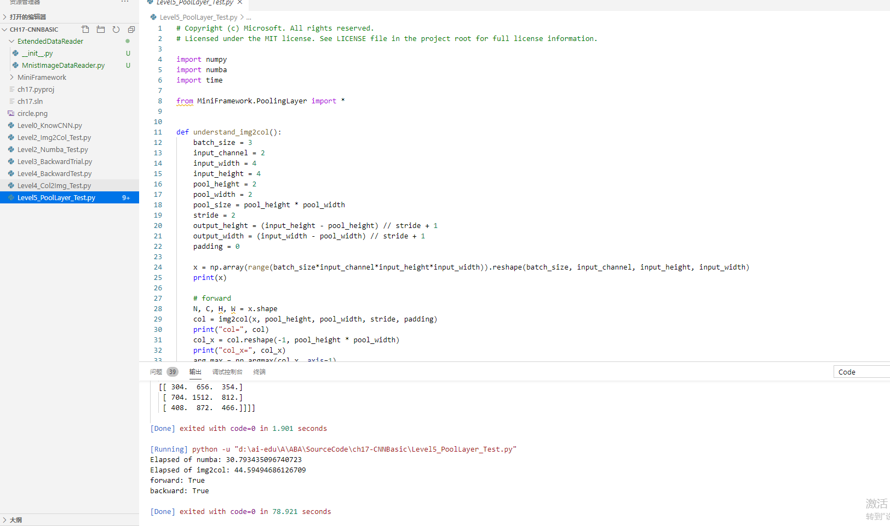

## 8.5 经典的卷积神经网络模型

### 8.5.1 LeNet(1998)

图18-1是卷积神经网络的鼻祖，自那时起，卷积神经网络的最基本的架构就定下来了：卷积层、池化层、全连接层。
LeNet$^{[3]}$的模型结构。

### 8.5.2 AlexNet(2012)

AlexNet$^{[4]}$网络结构在整体上类似于LeNet，都是先卷积然后在全连接。但在细节上有很大不同。AlexNet更为复杂。AlexNet有60 million个参数和65000个神经元，五层卷积，三层全连接网络，最终的输出层是1000通道的Softmax。

下图是AlexNet的模型结构。

AlexNet的特点：

- 比LeNet深和宽的网络
  使用了5层卷积和3层全连接，一共8层。特征数在最宽处达到384。
- 数据增强
  针对原始图片256x256的数据，做了随机剪裁，得到224x224的图片若干张。
- 使用ReLU做激活函数
- 在全连接层使用DropOut
- 使用LRN（局部影响归一化）

### 8.5.3 ZFNet（2013）
  ZF-Net只是将AlexNet第一层卷积核由11变成7，步长由4变为2，第3，4，5卷积层转变为384，384，256。

下面是ZFNet的结构示意图。

从Layer 1、Layer 2学习到的特征基本上是颜色、边缘等低层特征。

图18-4 前两层卷积核学到的特征

Layer 3则开始稍微变得复杂，学习到的是纹理特征，比如上面的一些网格纹理，见图

图所示的Layer 4学习到的则是比较有区别性的特征，比如狗头；Layer 5学习到的则是完整的，具有辨别性关键特征。

### 8.5.4 VGGNet（2015）

它的主要的贡献是展示出网络的深度（depth）是算法优良性能的关键部分。目前使用比较多的网络结构主要有ResNet（152-1000层），GooleNet（22层），VGGNet（19层）
图18-7为VGG16（16层的VGG）模型结构。

VGGNet的卷积层有一个特点：特征图尺寸单调递减，特征图数量单调递增。从上面的模型图上来看，立体方块的宽和高逐渐减小，但是厚度逐渐增加

### 8.5.4 GoogLeNet (2014)
引入Inception结构代替了单纯的卷积+激活的传统操作
是GoogLeNet的模型结构图。

蓝色为卷积运算，红色为池化运算，黄色为softmax分类。

### 8.5.6 ResNets（2015）

图为残差学习这一思想的基本表示。

### 8.5.7 DenseNet (2017)

优点：
1. 相比ResNet拥有更少的参数数量
2. 旁路加强了特征的重用
3. 网络更易于训练,并具有一定的正则效果
4. 缓解了gradient vanishing和model degradation的问题

## 8.6 实现颜色分类

### 8.6.1 颜色分类

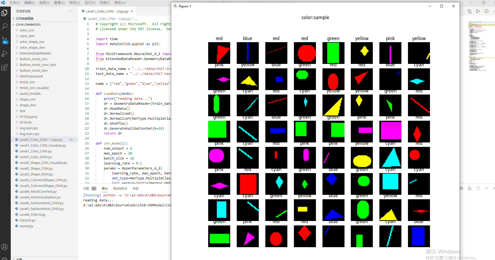
图18-14 颜色分类样本数据图

在样本数据中，一共有6种颜色，分别是：

- 红色 red
- 绿色 green
- 蓝色 blue
- 青色（蓝+绿） cyan
- 黄色（红+绿） yellow
- 粉色（红+蓝） pink

而这6种颜色是分布在5种形状之上的：

- 圆形
- 菱形
- 直线
- 矩形
- 三角形

我们看看神经网络能否排除形状的干扰，而单独把颜色区分开来。

### 8.6.2 卷积神经网络运行截图
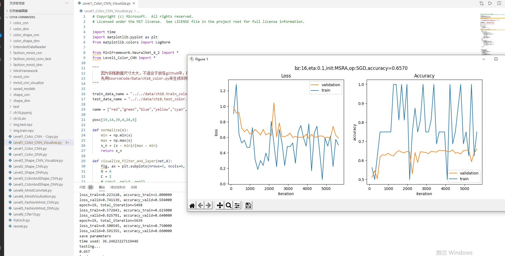

### 8.6.3测试集前64测试样本预测结果

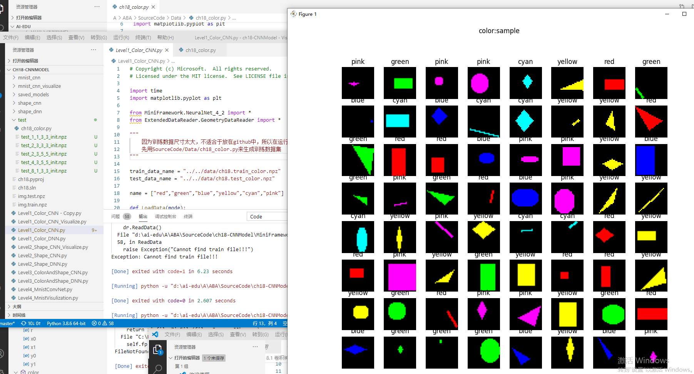

## 8.7 实现几何图形分类

样本数据
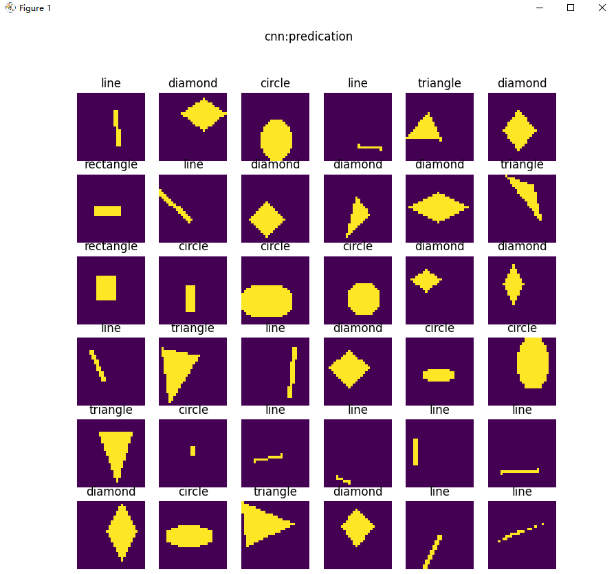
前馈神经网络得到下面截图
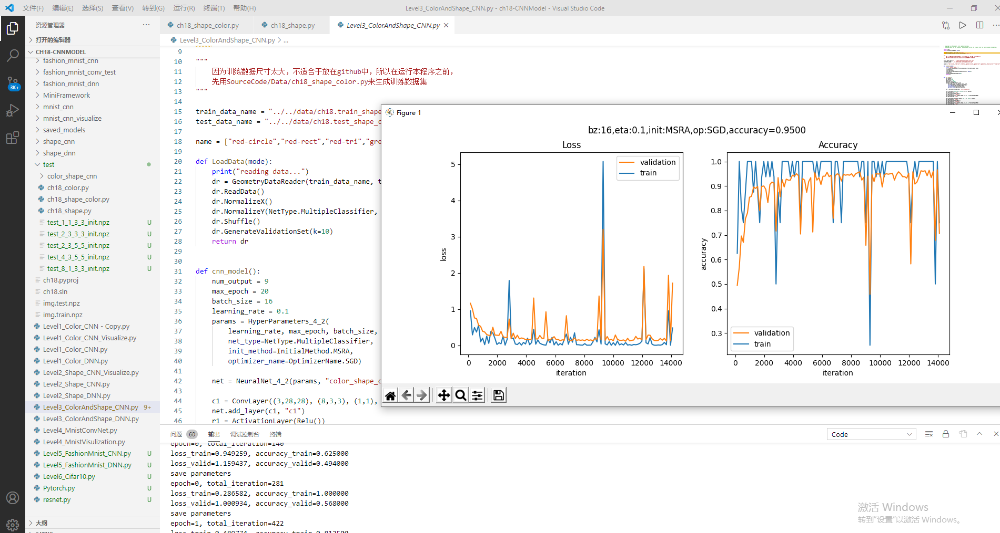
卷积神经网络得到以下截图

### 8.7.1 形状分类可视化解释

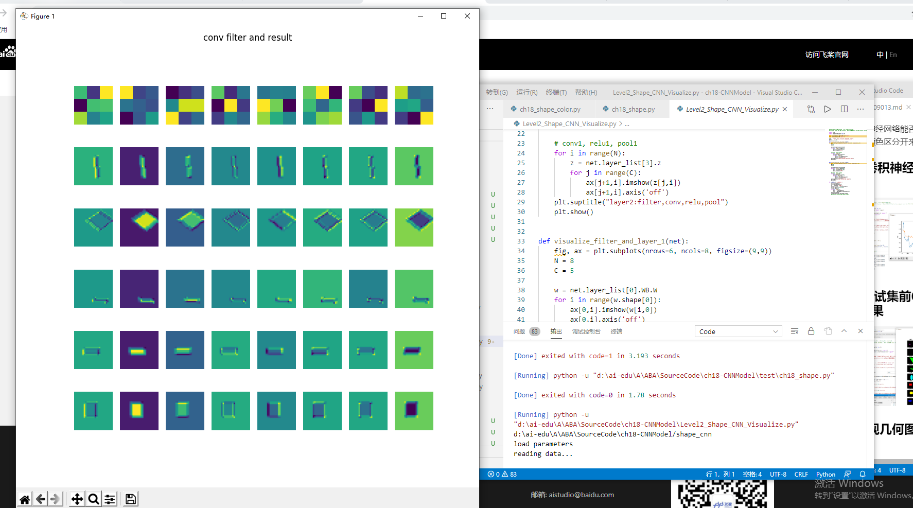

## 8.8 实现几何图形和颜色分类
样本数据，如图18-26。

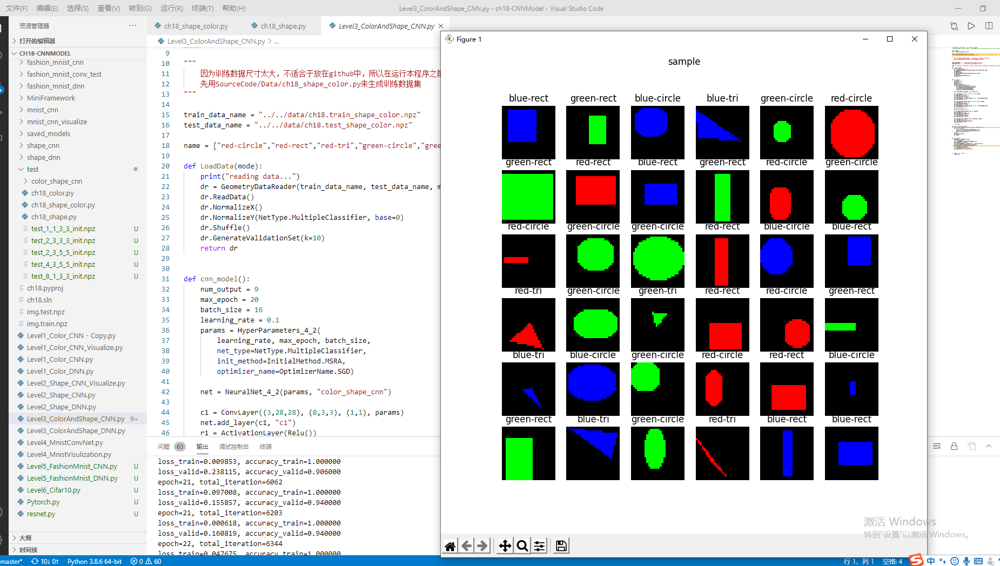

### 8.8.1 用前馈神经网络解决问题

训练结果如下：
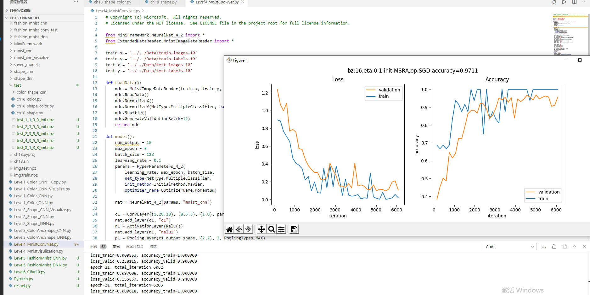

## 8.9 MNIST分类

代码运行结果：
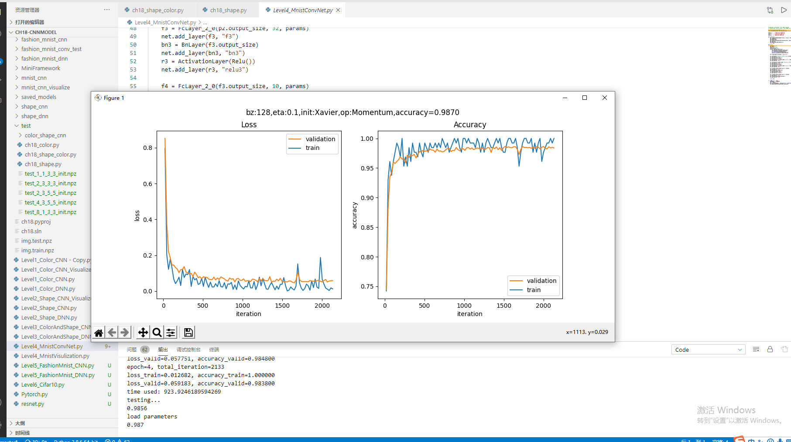

### 8.9.1 可视化

下图按行显示了以下内容：

1. 卷积核数值
2. 卷积核抽象
3. 卷积结果
4. 激活结果
5. 池化结果

 
 第二组的卷积可视化

图18-35是第二组的卷积、激活、池化层的输出结果。

## 8.10 小结

通过这章的学习，我学习了卷积神经网络的能力，卷积核的作用，卷积的种类，种类的编程模型，卷积前向计算。反向传播和一些经典的卷积神经网络，如LeNet等，还实现了几何图形和颜色的分类。受益匪浅，也将代码跑了一遍，需要加上训练文件，不然无法运行