## 第八步 卷积神经网络
卷积神经网络是深度学习中的一个里程碑式的技术，有了这个技术，才会让计算机有能力理解图片和视频信息，才会有计算机视觉的众多应用。
### 概述
卷积神经网络（CNN，Convolutional Neural Net)是神经网络的类型之一，在图像识别和分类领域中取得了非常好的效果，比如识别人脸、物体、交通标识等，这就为机器人、自动驾驶等应用提供了坚实的技术基础。
卷积神经网络的典型结构：
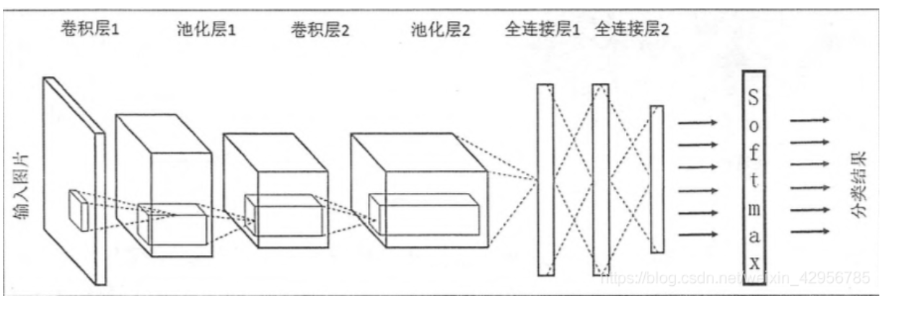
1. 输入层
在处理图像的卷积神经网络中，它一般代表了一张图片的像素矩阵。通常为(length * width *channel)。 三维矩阵的深度代表了图像的彩色通道（channel)。比如黑白图片的深度为1，而在RGB色彩模式下，图像的深度为3。从输入层开始，卷积神经网络通过不同的神经网络结构将上一层的三维矩阵转化为下一层的三维矩阵，直到最后的全连接层。
2. 卷积层
是卷积网络中最为重要的部分。和传统全连接层不同，卷积层中每一个节点的输入只是上一层神经网络的一小块，这个小快常用的大小有3 * 3或者5 * 5，卷积层会增加原始节点的深度。通常卷积层这部分被称为过滤器（filetr） 或者 内核（kernel）。
3. 池化层（Pooling）
池化层神经网络不会改变三维矩阵的深度，但是它可以缩小矩阵的大小。池化操作可以认为是将一张分辨率较高的图片转化为分辨率较低的图片。通过池化层，可以进一步缩小最后全连接层中节点的个数，从而达到减少整个神经网络中的参数的目的。
效果： 使用池化层既可以加快计算速度也可以防止过度拟合。
4. 全连接层
在经过几轮的卷积层和池化层的处理之后，可以认为图像中的信息已经被抽象成了信息含量更高的特征。我们可以将卷积层和池化层看成自动图像特征提出的过程。在此之后，我们仍需使用全连接层来完成分类任务。

5. Softmax层。
Softmax层主要用于分类问题，我们可以得到当前样例属于不同种类的概率分布情况。

各个卷积核的作用

|名称|说明|
|---|---|
|锐化|如果一个像素点比周围像素点亮，则此算子会令其更亮|
|检测竖边|检测出了十字线中的竖线，由于是左侧和右侧分别检查一次，所以得到两条颜色不一样的竖线|
|周边|把周边增强，把同色的区域变弱，形成大色块|
|Sobel-Y|纵向亮度差分可以检测出横边，与横边检测不同的是，它可以使得两条横线具有相同的颜色，具有分割线的效果|
|Identity|中心为1四周为0的过滤器，卷积后与原图相同|
|横边检测|检测出了十字线中的横线，由于是上侧和下侧分别检查一次，所以得到两条颜色不一样的横线|
|模糊|通过把周围的点做平均值计算而“杀富济贫”造成模糊效果|
|Sobel-X|横向亮度差分可以检测出竖边，与竖边检测不同的是，它可以使得两条竖线具有相同的颜色，具有分割线的效果|
|浮雕|形成大理石浮雕般的效果|

- 平移不变性
- 旋转不变性
- 尺度不变性
  
## 卷积的向前计算
连续定义
$$h(x)=(f*g)(x) = \int_{-\infty}^{\infty} f(t)g(x-t)dt \tag{1}$$
离散定义
$$h(x) = (f*g)(x) = \sum^{\infty}_{t=-\infty} f(t)g(x-t) \tag{2}$$
二维卷积一般用于图像处理上。在二维图片上做卷积，如果把图像Image简写为$I$，把卷积核Kernal简写为$K$，则目标图片的第$(i,j)$个像素的卷积值为：

$$
h(i,j) = (I*K)(i,j)=\sum_m \sum_n I(m,n)K(i-m,j-n) \tag{3}
$$

可以看出，这和一维情况下的公式2是一致的。从卷积的可交换性，我们可以把公式3等价地写作：

$$
h(i,j) = (I*K)(i,j)=\sum_m \sum_n I(i-m,j-n)K(m,n) \tag{4}
$$

公式4的成立，是因为我们将Kernal进行了翻转。在神经网络中，一般会实现一个互相关函数(corresponding function)，而卷积运算几乎一样，但不反转Kernal：

$$
h(i,j) = (I*K)(i,j)=\sum_m \sum_n I(i+m,j+n)K(m,n) \tag{5}
$$

在图像处理中，自相关函数和互相关函数定义如下：

- 自相关：设原函数是f(t)，则$h=f(t) \star f(-t)$，其中$\star$表示卷积
- 互相关：设两个函数分别是f(t)和g(t)，则$h=f(t) \star g(-t)$
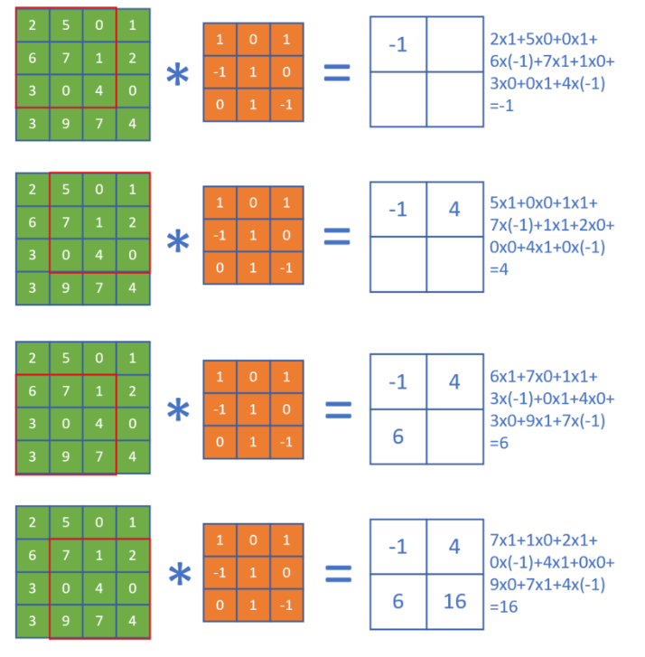
单入多出的升维卷积

多入单出的降维卷积
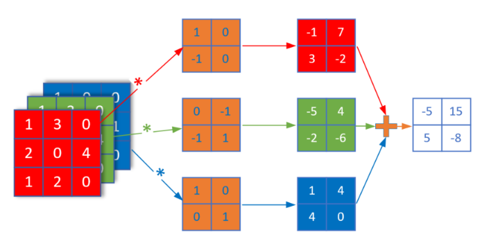
多入多出的同维卷积
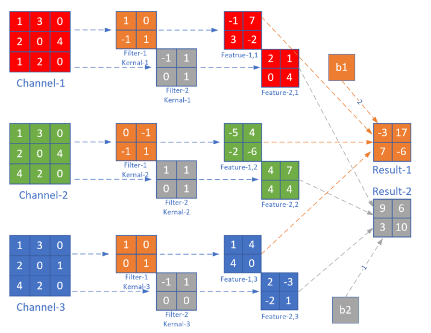
卷积编程模型
五个概念的关系：

- 输入 Input Channel
- 卷积核组 WeightsBias
- 过滤器 Filter
- 卷积核 kernal
- 输出 Feature Map
  ## 池化层
池化 pooling，又称为下采样，downstream sampling or sub-sampling。
池化方法分为两种，一种是最大值池化 Max Pooling，一种是平均值池化 Mean/Average Pooling
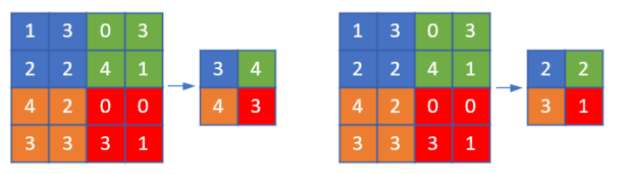
1. 最大值池化，是取当前池化视野中所有元素的最大值，输出到下一层特征图中。
2. 平均值池化，是取当前池化视野中所有元素的平均值，输出到下一层特征图中。
目的：
- 扩大视野：就如同先从近处看一张图片，然后离远一些再看同一张图片，有些细节就会被忽略
- 降维：在保留图片局部特征的前提下，使得图片更小，更易于计算
- 平移不变性，轻微扰动不会影响输出：比如上图中最大值池化的4，即使向右偏一个像素，其输出值仍为4
- 维持同尺寸图片，便于后端处理：假设输入的图片不是一样大小的，就需要用池化来转换成同尺寸图片
池化层的训练

- 对于最大值池化，残差值会回传到当初最大值的位置上，而其它三个位置的残差都是0。
- 对于平均值池化，残差值会平均到原始的4个位置上。

## 经典的卷积神经网络模型
卷积神经网络是现在深度学习领域中最有用的网络类型，尤其在计算机视觉领域更是一枝独秀。卷积神经网络从90年代的LeNet开始，沉寂了10年，也孵化了10年，直到2012年AlexNet开始再次崛起，后续的ZF Net、VGG、GoogLeNet、ResNet、DenseNet，网络越来越深，架构越来越复杂，解决反向传播时梯度消失的方法也越来越巧妙
1. LeNet
LeNet分为卷积层块和全连接层块两个部分。下⾯我们分别介绍这两个模块。
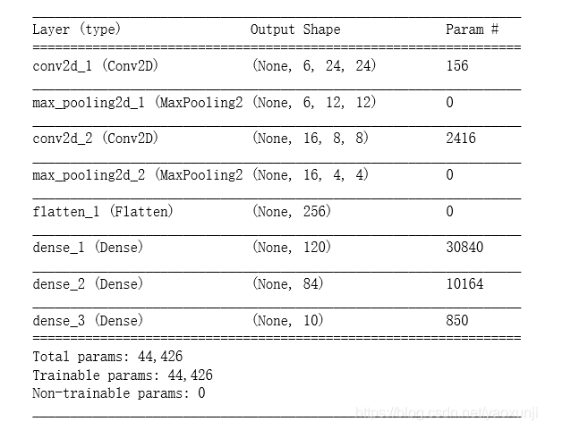
卷积层块⾥的基本单位是卷积层后接最⼤池化层：卷积层⽤来识别图像⾥的空间模式，如线条和物体局部，之后的最⼤池化层则⽤来降低卷积层对位置的敏感性。卷积层块由两个这样的基本单位重复堆叠构成。在卷积层块中，每个卷积层都使⽤5 × 5的窗口，并在输出上使⽤sigmoid激活函数。第⼀个卷积层输出通道数为6，第⼆个卷积层输出通道数则增加到16。这是因为第⼆个卷
积层⽐第⼀个卷积层的输⼊的⾼和宽要小，所以增加输出通道使两个卷积层的参数尺⼨类似。卷积层块的两个最⼤池化层的窗口形状均为2 × 2，且步幅为2。由于池化窗口与步幅形状相同，池化窗口在输⼊上每次滑动所覆盖的区域互不重叠。卷积层块的输出形状为(批量⼤小, 通道, ⾼, 宽)。当卷积层块的输出传⼊全连接层块时，全连接层块会将小批量中每个样本变平（flatten） 。也就是说，全连接层的输⼊形状将变成⼆维，其中第⼀维是小批量中的样本，第⼆维是每个样本变平后的向量表⽰，且向量⻓度为通道、⾼和宽的乘积。全连接层块含3个全连接层。它们的输出个数分别是120、84和10，其中10为输出的类别个数。
2. AlexNet
2012年，AlexNet横空出世。这个模型的名字来源于论⽂第⼀作者的姓名Alex Krizhevsky [1]。AlexNet使⽤了8层卷积神经⽹络，并以很⼤的优势赢得了ImageNet 2012图像识别挑战赛。它⾸次证明了学习到的特征可以超越⼿⼯设计的特征，从而⼀举打破计算机视觉研究的前状。
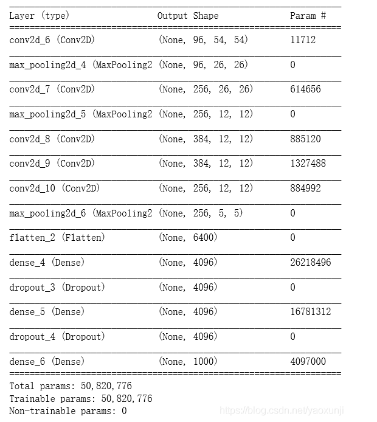
AlexNet与LeNet的设计理念⾮常相似，但也有显著的区别。

第⼀，与相对较小的LeNet相⽐，AlexNet包含8层变换，其中有5层卷积和2层全连接隐藏层，以及1个全连接输出层。下⾯我们来详细描述这些层的设计。AlexNet第⼀层中的卷积窗口形状是11 × 11。因为ImageNet中绝⼤多数图像的⾼和宽均⽐MNIST图像的⾼和宽⼤10倍以上，ImageNet图像的物体占⽤更多的像素，所以需要更⼤的卷积窗口来捕获物体。第⼆层中的卷积窗口形状减小到5 × 5，之后全采⽤3 × 3。此外，第⼀、第⼆和第五个卷积层之后都使⽤了窗口形状为3 × 3、步幅为2的最⼤池化层。而且，AlexNet使⽤的卷积通道数也⼤于LeNet中的卷积通道数数⼗倍。
紧接着最后⼀个卷积层的是两个输出个数为4096的全连接层。这两个巨⼤的全连接层带来将近1GB的模型参数。由于早期显存的限制，最早的AlexNet使⽤双数据流的设计使⼀个GPU只需要处理⼀半模型。幸运的是，显存在过去⼏年得到了长足的发展，因此通常我们不再需要这样的特别设计了。
第⼆，AlexNet将sigmoid激活函数改成了更加简单的ReLU激活函数。⼀⽅⾯，ReLU激活函数的计算更简单，例如它并没有sigmoid激活函数中的求幂运算。另⼀⽅⾯，ReLU激活函数在不同的参数初始化⽅法下使模型更容易训练。这是由于当sigmoid激活函数输出极接近0或1时，这些区域的梯度⼏乎为0，从而造成反向传播⽆法继续更新部分模型参数；而ReLU激活函数在正区间的梯度恒为1。因此，若模型参数初始化不当，sigmoid函数可能在正区间得到⼏乎为0的梯度，从而令模型⽆法得到有效训练。
第三，AlexNet通过丢弃法来控制全连接层的模型复杂度。而LeNet并没有使⽤丢弃法。
第四，AlexNet引⼊了⼤量的图像增⼴，如翻转、裁剪和颜⾊变化，从而进⼀步扩⼤数据集来缓解过拟合。
3.  VGG块
VGG块的组成规律是：连续使⽤数个相同的填充为1、窗口形状为3 × 3的卷积层后接上⼀个步幅为2、窗口形状为2 × 2的最⼤池化层。卷积层保持输⼊的⾼和宽不变，而池化层则对其减半。
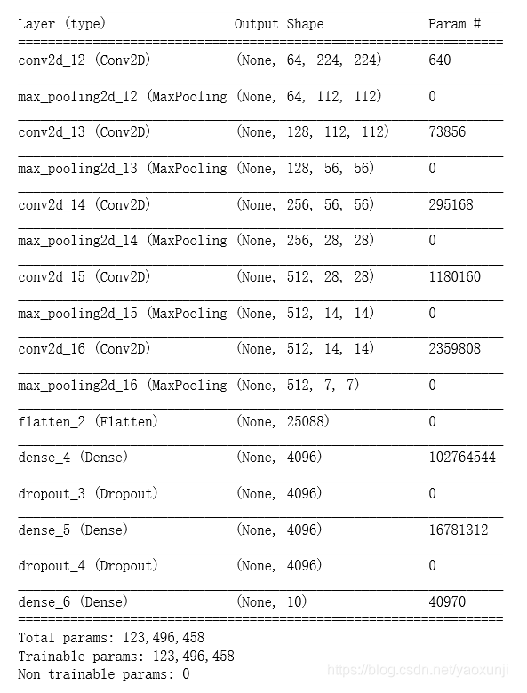
与AlexNet和LeNet⼀样，VGG⽹络由卷积层模块后接全连接层模块构成。卷积层模块串联数个vgg_block，其超参数由变量conv_arch定义。该变量指定了每个VGG块⾥卷积层个数和输出通道数。全连接模块则跟AlexNet中的⼀样。现在我们构造⼀个VGG⽹络。它有5个卷积块，前2块使⽤单卷积层，而后3块使⽤双卷积层。第⼀块的输出通道是64，之后每次对输出通道数翻倍，直到变为512。因为这个⽹络使⽤了8个卷积层和3个全连接层，所以经常被称为VGG-11。
4. Nin块
我们知道，卷积层的输⼊和输出通常是四维数组（样本，通道，⾼，宽）。而全连接层的输⼊和输出则通常是⼆维数组（样本， 特征）。如果想在全连接层后再接上卷积层，则需要将全连接层的输出变换为四维。回忆在 “多输⼊通道和多输出通道” ⼀节⾥介绍的1×1卷积层。它可以看成全连接层，其中空间维度（⾼和宽）上的每个元素相当于样本，通道相当于特征。因此，NiN使⽤1×1卷积层来替代全连接层，从而使空间信息能够⾃然传递到后⾯的层中去。下图对⽐了NiN同AlexNet和VGG等⽹络在结构上的主要区别。
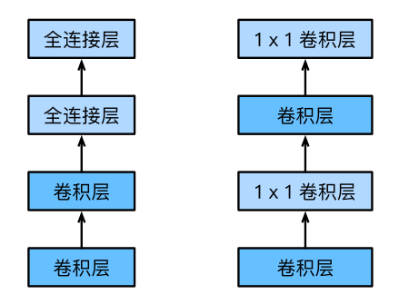
Nin网络
NiN是在AlexNet问世不久后提出的。它们的卷积层设定有类似之处。NiN使⽤卷积窗口形状分别为11 × 11、5 × 5和3 × 3的卷积层，相应的输出通道数也与AlexNet中的⼀致。每个NiN块后接⼀个步幅为2、窗口形状为3 × 3的最⼤池化层。
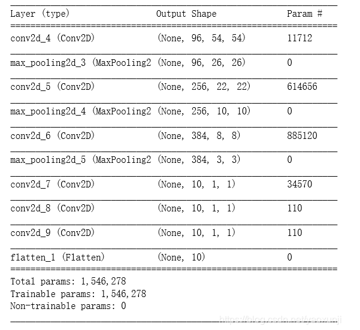
除使⽤NiN块以外，NiN还有⼀个设计与AlexNet显著不同：NiN去掉了AlexNet最后的3个全连接层，取而代之地，NiN使⽤了输出通道数等于标签类别数的NiN块，然后使⽤全局平均池化层对每个通道中所有元素求平均并直接⽤于分类。 这⾥的全局平均池化层即窗口形状等于输⼊空间维形状的平均池化层。NiN的这个设计的好处是可以显著减小模型参数尺⼨，从而缓解过拟合。然而，该设计有时会造成获得有效模型的训练时间的增加。
5. GooLeNet
在2014年的ImageNet图像识别挑战赛中，⼀个名叫GoogLeNet的⽹络结构⼤放异彩 。它虽然在名字上向LeNet致敬，但在⽹络结构上已经很难看到LeNet的影⼦。GoogLeNet吸收了NiN中⽹络串联⽹络的思想，并在此基础上做了很大改进。
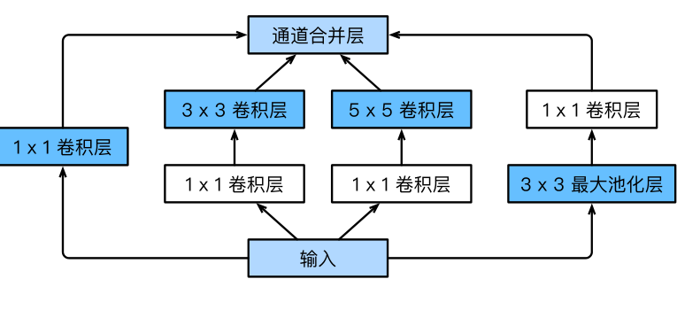
Inception块⾥有4条并⾏的线路。前3条线路使⽤窗口⼤小分别是1 × 1、3 ×3和5 × 5的卷积层来抽取不同空间尺⼨下的信息，其中中间2个线路会对输⼊先做1 × 1卷积来减少输⼊通道数，以降低模型复杂度。第四条线路则使⽤3 × 3最⼤池化层，后接1 × 1卷积层来改变通道数。4条线路都使⽤了合适的填充来使输⼊与输出的⾼和宽⼀致。
GoogLeNet网络
GoogLeNet跟VGG⼀样， 在主体卷积部分中使⽤5个模块 （block） ， 每个模块之间使⽤步幅为2的3×3最⼤池化层来减小输出⾼宽。

第⼀模块使⽤⼀个64通道的7 × 7卷积层。
第⼆模块使⽤2个卷积层：⾸先是64通道的1 × 1卷积层， 然后是将通道增⼤3倍的3 × 3卷积层。它对应Inception块中的第⼆条线路。
第三模块串联2个完整的Inception块。 第⼀个Inception块的输出通道数为64+128+32+32 = 256，其中4条线路的输出通道数⽐例为64 : 128 : 32 : 32 = 2 : 4 : 1 : 1。 其中第⼆、 第三条线路先分别将输⼊通道数减小⾄96/192 = 1/2和16/192 = 1/12后，再接上第⼆层卷积层。第⼆个Inception块输出通道数增⾄128 + 192 + 96 + 64 = 480，每条线路的输出通道数之⽐为128 : 192 : 96 : 64 =4 : 6 : 3 : 2。其中第⼆、第三条线路先分别将输⼊通道数减小⾄128/256 = 1/2和32/256 = 1/8。
第四模块更加复杂。它串联了5个Inception块，其输出通道数分别是192 + 208 + 48 + 64 = 512、160+224+64+64 = 512、128+256+64+64 = 512、 112+288+64+64 = 528和256+320+128+128 =832。这些线路的通道数分配和第三模块中的类似，⾸先含3 × 3卷积层的第⼆条线路输出最多通道， 其次是仅含1 × 1卷积层的第⼀条线路， 之后是含5 × 5卷积层的第三条线路和含3 × 3最⼤池化层的第四条线路。 其中第⼆、 第三条线路都会先按⽐例减小通道数。 这些⽐例在各个Inception块中都略有不同。
第五模块有输出通道数为256 + 320 + 128 + 128 = 832和384 + 384 + 128 + 128 = 1024的两个Inception块。 其中每条线路的通道数的分配思路和第三、 第四模块中的⼀致， 只是在具体数值上有所不同。需要注意的是，第五模块的后⾯紧跟输出层，该模块同NiN⼀样使⽤全局平均池化层来将每个通道的⾼和宽变成1。最后我们将输出变成⼆维数组后接上⼀个输出个数为标签类别数的全连接层。GoogLeNet模型的计算复杂，而且不如VGG那样便于修改通道数。
6. ResNet
理论上，原模型解的空间只是新模型解的空间的⼦空间。也就是说，如果我们能将新添加的层训练成恒等映射f(x) = x，新模型和原模型将同样有效。由于新模型可能得出更优的解来拟合训练数据集，因此添加层似乎更容易降低训练误差。然而在实践中，添加过多的层后训练误差往往不降反升。即使利⽤批量归⼀化带来的数值稳定性使训练深层模型更加容易，该问题仍然存在。针对这⼀问题，何恺明等⼈提出了残差⽹络（ResNet）。它在2015年的ImageNet图像识别挑战赛夺魁，并深刻影响了后来的深度神经⽹络的设计。
残差块
让我们聚焦于神经⽹络局部。如图所⽰，设输⼊为x。假设我们希望学出的理想映射为f(x)，从而作为图上⽅激活函数的输⼊。左图虚线框中的部分需要直接拟合出该映射f(x)，而右图虚线框中的部分则需要拟合出有关恒等映射的残差映射f(x) − x。残差映射在实际中往往更容易优化。以本节开头提到的恒等映射作为我们希望学出的理想映射f(x)。我们只需将图中右图虚线框内上⽅的加权运算（如仿射）的权重和偏差参数学成0，那么f(x)即为恒等映射。实际中，当理想映射f(x)极接近于恒等映射时，残差映射也易于捕捉恒等映射的细微波动。右图也是ResNet的基础块，即残差块（residual block） 。在残差块中，输⼊可通过跨层的数据线路更快地向前传播。
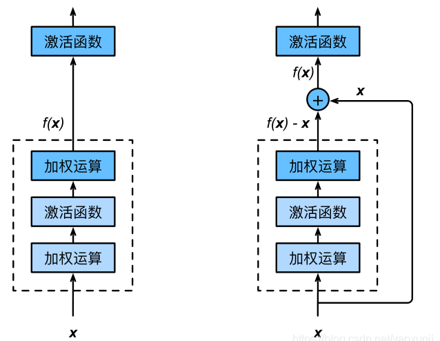
ResNet沿⽤了VGG全3 × 3卷积层的设计。残差块⾥⾸先有2个有相同输出通道数的3 × 3卷积层。每个卷积层后接⼀个批量归⼀化层和ReLU激活函数。然后我们将输⼊跳过这两个卷积运算后直接加在最后的ReLU激活函数前。这样的设计要求两个卷积层的输出与输⼊形状⼀样，从而可以相加。如果想改变通道数， 就需要引⼊⼀个额外的1 × 1卷积层来将输⼊变换成需要的形状后再做相加运算。
7. DenseNet
ResNet中的跨层连接设计引申出了数个后续⼯作。本节我们介绍其中的⼀个：稠密连接⽹络（DenseNet）。它与ResNet的主要区别如图所⽰。
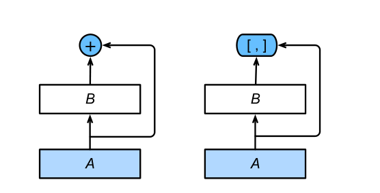
图中将部分前后相邻的运算抽象为模块A和模块B。与ResNet的主要区别在于，DenseNet⾥模块B的输出不是像ResNet那样和模块A的输出相加，而是在通道维上连结。这样模块A的输出可以直接传⼊模块B后⾯的层。在这个设计⾥，模块A直接跟模块B后⾯的所有层连接在了⼀起。这也是它被称为“稠密连接”的原因。
DenseNet的主要构建模块是稠密块（dense block）和过渡层（transition layer） 。前者定义了输⼊和输出是如何连结的，后者则⽤来控制通道数，使之不过⼤。

## 实现几何图形及颜色分类
- 用前馈神经网络解决问题
搭建一个三层的网络如下：
```
ef dnn_model():
    num_output = 9
    max_epoch = 50
    batch_size = 16
    learning_rate = 0.01
    params = HyperParameters_4_2(
        learning_rate, max_epoch, batch_size,
        net_type=NetType.MultipleClassifier,
        init_method=InitialMethod.MSRA,
        optimizer_name=OptimizerName.Momentum)

    net = NeuralNet_4_2(params, "color_shape_dnn")
    
    f1 = FcLayer_2_0(784, 128, params)
    net.add_layer(f1, "f1")
    r1 = ActivationLayer(Relu())
    net.add_layer(r1, "relu1")

    f2 = FcLayer_2_0(f1.output_size, 64, params)
    net.add_layer(f2, "f2")
    r2 = ActivationLayer(Relu())
    net.add_layer(r2, "relu2")
    
    f3 = FcLayer_2_0(f2.output_size, num_output, params)
    net.add_layer(f3, "f3")
    s3 = ClassificationLayer(Softmax())
    net.add_layer(s3, "s3")

    return net
 ```
样本数据为3x28x28的彩色图，所以我们要把它转换成灰度图，然后再展开成1x784的向量，第一层用128个神经元，第二层用64个神经元，输出层用9个神经元接Softmax分类函数。

训练50个epoch后可以得到如下如图18-27所示的训练结果。
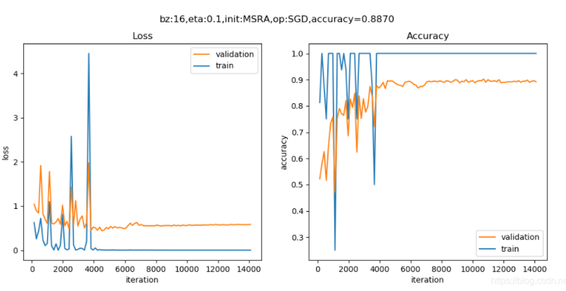
- 用卷积神经网络解决问题
搭建网络模型如下：
```
def cnn_model():
    num_output = 9
    max_epoch = 20
    batch_size = 16
    learning_rate = 0.1
    params = HyperParameters_4_2(
        learning_rate, max_epoch, batch_size,
        net_type=NetType.MultipleClassifier,
        init_method=InitialMethod.MSRA,
        optimizer_name=OptimizerName.SGD)

    net = NeuralNet_4_2(params, "shape_color_cnn")
    
    c1 = ConvLayer((3,28,28), (8,3,3), (1,1), params)
    net.add_layer(c1, "c1")
    r1 = ActivationLayer(Relu())
    net.add_layer(r1, "relu1")
    p1 = PoolingLayer(c1.output_shape, (2,2), 2, PoolingTypes.MAX)
    net.add_layer(p1, "p1") 

    c2 = ConvLayer(p1.output_shape, (16,3,3), (1,0), params)
    net.add_layer(c2, "c2")
    r2 = ActivationLayer(Relu())
    net.add_layer(r2, "relu2")
    p2 = PoolingLayer(c2.output_shape, (2,2), 2, PoolingTypes.MAX)
    net.add_layer(p2, "p2") 

    params.learning_rate = 0.1

    f3 = FcLayer_2_0(p2.output_size, 32, params)
    net.add_layer(f3, "f3")
    bn3 = BnLayer(f3.output_size)
    net.add_layer(bn3, "bn3")
    r3 = ActivationLayer(Relu())
    net.add_layer(r3, "relu3")
    
    f4 = FcLayer_2_0(f3.output_size, num_output, params)
    net.add_layer(f4, "f4")
    s4 = ClassificationLayer(Softmax())
    net.add_layer(s4, "s4")

    return net
```
经过20个epoch的训练后，我们得到的结果如图
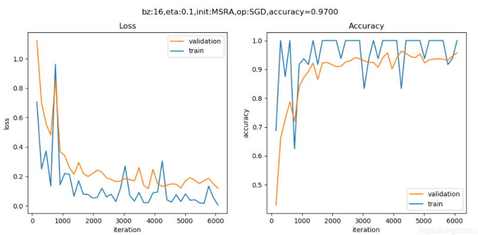
## 解决MNIST分类问题
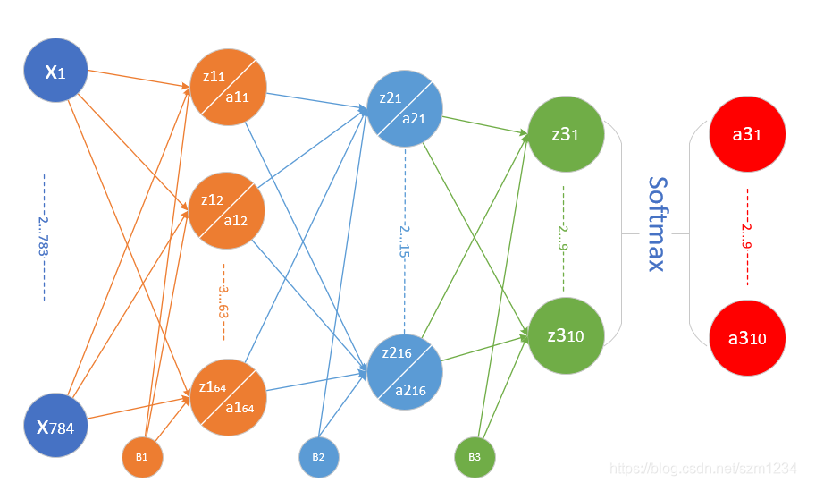
Layer|参数|输入|输出|参数个数|
|---|---|---|---|---|
|卷积层|8x5x5,s=1|1x28x28|8x24x24|200+8|
|激活层|2x2,s=2, max|8x24x24|8x24x24||
|池化层|Relu|8x24x24|8x12x12||
|卷积层|16x5x5,s=1|8x12x12|16x8x8|400+16|
|激活层|Relu|16x8x8|16x8x8||
|池化层|2x2, s=2, max|16x8x8|16x4x4||
|全连接层|256x32|256|32|8192+32|
|批归一化层||32|32||
|激活层|Relu|32|32||
|全连接层|32x10|32|10|320+10|
|分类层|softmax,10|10|10|
代码实现

```
def model():
    num_output = 10
    dataReader = LoadData(num_output)

    max_epoch = 5
    batch_size = 128
    learning_rate = 0.1
    params = HyperParameters_4_2(
        learning_rate, max_epoch, batch_size,
        net_type=NetType.MultipleClassifier,
        init_method=InitialMethod.Xavier,
        optimizer_name=OptimizerName.Momentum)

    net = NeuralNet_4_2(params, "mnist_conv_test")
    
    c1 = ConvLayer((1,28,28), (8,5,5), (1,0), params)
    net.add_layer(c1, "c1")
    r1 = ActivationLayer(Relu())
    net.add_layer(r1, "relu1")
    p1 = PoolingLayer(c1.output_shape, (2,2), 2, PoolingTypes.MAX)
    net.add_layer(p1, "p1") 
  
    c2 = ConvLayer(p1.output_shape, (16,5,5), (1,0), params)
    net.add_layer(c2, "23")
    r2 = ActivationLayer(Relu())
    net.add_layer(r2, "relu2")
    p2 = PoolingLayer(c2.output_shape, (2,2), 2, PoolingTypes.MAX)
    net.add_layer(p2, "p2")  

    f3 = FcLayer_2_0(p2.output_size, 32, params)
    net.add_layer(f3, "f3")
    bn3 = BnLayer(f3.output_size)
    net.add_layer(bn3, "bn3")
    r3 = ActivationLayer(Relu())
    net.add_layer(r3, "relu3")

    f4 = FcLayer_2_0(f3.output_size, 10, params)
    net.add_layer(f4, "f2")
    s4 = ClassificationLayer(Softmax())
    net.add_layer(s4, "s4")

    net.train(dataReader, checkpoint=0.05, need_test=True)
    net.ShowLossHistory(XCoordinate.Iteration)
```
训练5个epoch后的损失函数值和准确率的历史记录曲线如图

#### 可视化
- 第一组的卷积可视化

下图按行显示了以下内容：

1. 卷积核数值
2. 卷积核抽象
3. 卷积结果
4. 激活结果
5. 池化结果

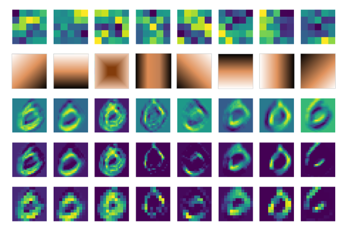
卷积核是5x5的，一共8个卷积核，所以第一行直接展示了卷积核的数值图形化以后的结果，但是由于色块太大，不容易看清楚其具体的模式 
- 第二组的卷积可视化
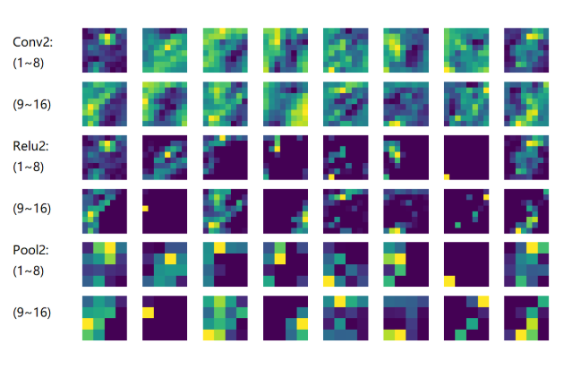
Conv2：由于是在第一层的特征图上卷积后叠加的结果，所以基本不能按照原图理解，但也能大致看出是是一些轮廓抽取的作用；
Relu2：能看出的是如果黑色区域多的话，说明基本没有激活值，此卷积核效果就没用；
Pool2：池化后分化明显的特征图是比较有用的特征，比如3、6、12、15、16；信息太多或者太少的特征图，都用途偏小，比如1、7、10、11。

## Cifar-10分类

Cifar 是加拿大政府牵头投资的一个先进科学项目研究所。Hinton、Bengio和他的学生在2004年拿到了 Cifar 投资的少量资金，建立了神经计算和自适应感知项目。这个项目结集了不少计算机科学家、生物学家、电气工程师、神经科学家、物理学家、心理学家，加速推动了 Deep Learning 的进程。从这个阵容来看，DL 已经和 ML 系的数据挖掘分的很远了。Deep Learning 强调的是自适应感知和人工智能，是计算机与神经科学交叉；Data Mining 强调的是高速、大数据、统计数学分析，是计算机和数学的交叉。
环境搭建

我们将使用Keras$^{[1]}$来训练模型，因为Keras是一个在TensorFlow平台上经过抽象的工具，它的抽象思想与我们在前面学习过的各种Layer的概念完全一致，有利于读者在前面的基础上轻松地继续学习。环境搭建有很多细节，我们在这里不详细介绍，只是把基本步骤列出。

1. 安装Python 3.6（本书中所有案例在Python 3.6上开发测试）
2. 安装CUDA（没有GPU的读者请跳过）
3. 安装cuDNN（没有GPU的读者请跳过）
4. 安装TensorFlow，有GPU硬件的一定要按照GPU版，没有的只能安装CPU版
5. 安装Keras
### 学习总结：
为了有效对人脸特征进行准确分类识别，之前已经得到效果的算法一般是基于人脸几何特征的分析、模式匹配、图像匹配以及根据面部拓扑结构、神经网络模型训练的方法进行识别。利用卷积神经网络的方法，可以有效的解决神经网络模型只能训练少量样本数据的缺点。
数据的预处理
主要作用是将整个图像数据化为统一格式的、特征信息规范的数据。主要操作为去均值、归一化。
卷积层
主要作用是提取特征信息，并将特征信息映射至更高维度。一般设置多个卷积核（33或55的参数矩阵），让卷积核在一定步距下以滑动的方式与图像的每一部分做内积，并最终将内积后的值取和后加上偏置b。其中深度即是神经元的数量、卷积核的数量，每个卷积核代表一种纹理特征的提取方法，不同的卷积核只关注其特有的特征信息。在卷积核滑动的过程中为了使整个过程正常进行，会采用在原图像矩阵外再加一层填充值的方法。再者，为了防止滑动过程中某些边缘值结果不平滑，会使得滑动窗口在滑动前后有一定重叠的部分。
池化层
作用是将整个卷积后的数据降维，相当于图像压缩，图像缩小，可以去除整个图像中很多冗余特征信息，降低计算量的同时防止过拟合。
激励函数
将卷积层的输出结果做非线性变换，例如sigmoid函数是将整个输出结果映射到0-1之间。
全连接层
即为传统神经网络层的连接方式。
### 心得体会：
局部感受野的原理是指目标像素的特征信息与距离该像素点较近的像素值的关系较大，与距离该像素值较远的其他像素的关系较小，所以在进行计算时，只选取邻近像素值进行计算而摒弃之前每个权值更新时都将图像中所有像素信息全部纳入计算范畴的方法。最终保证在不影响训练结果的同时大大减少参数量。
权值共享 在卷积层中每个神经元连接数据的权重固定，每个神经元只关注一中纹理特征。
池化操作的理解：
池化操作能够有效抑制过拟合的情况。一般可以理解为整个数据的压缩过程，将整张图片缩小的同时，图片的像素信息也随之减少，但是主要特征信息仍然不会被改变。