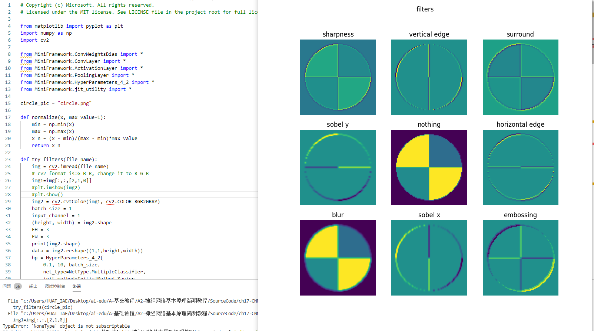
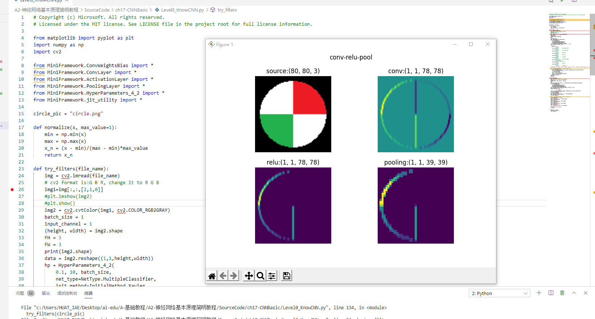
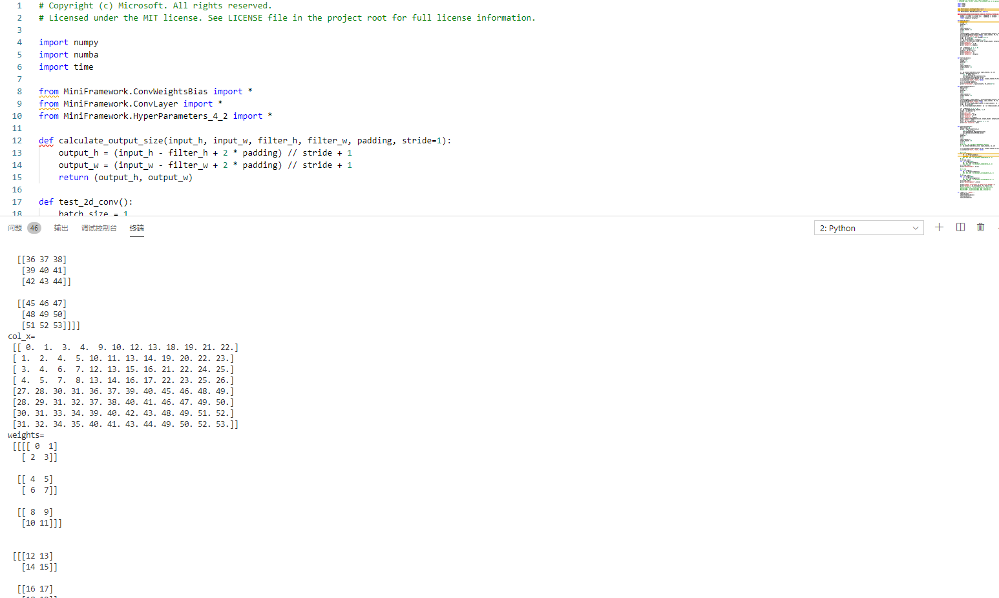
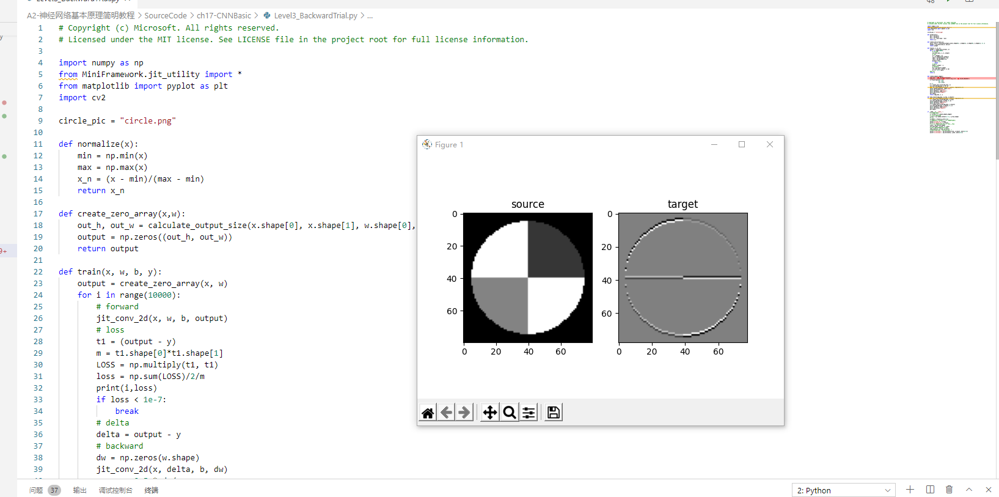
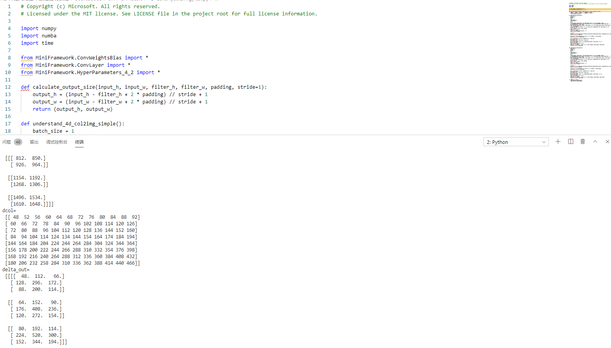
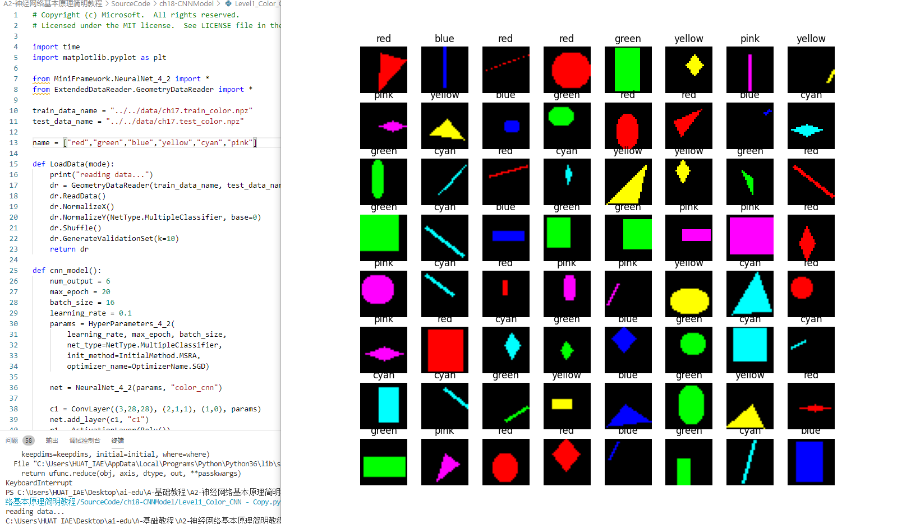
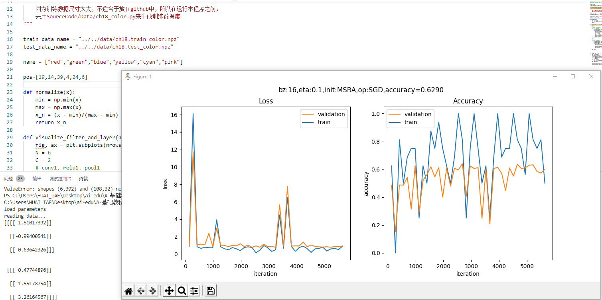
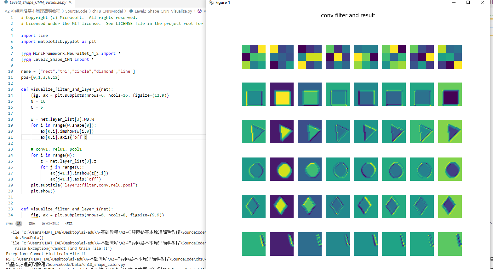
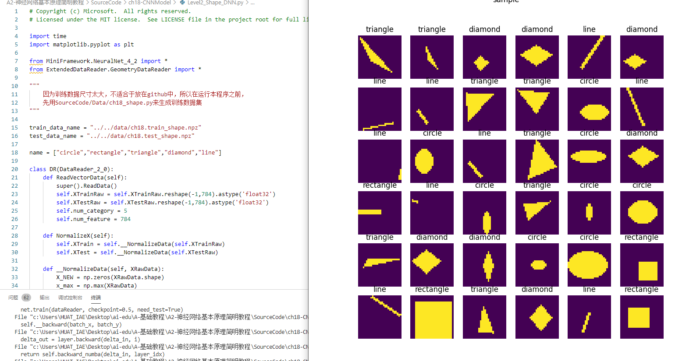

# 第八步  卷积神经网络


卷积神经网络是深度学习中的一个里程碑式的技术，有了这个技术，才会让计算机有能力理解图片和视频信息，才会有计算机视觉的众多应用。

在本部分的学习中，我们将会逐步介绍卷积的前向计算、卷积的反向传播、池化的前向计算与反向传播，然后用代码实现一个卷积网络并训练一些实际数据。

在后面我们还会介绍一些经典的卷积模型，向大师们学习一些解决问题的方法论问题。

由于我们侧重于讲解神经网络的工作原理，所以本书并不会深入到Computer Vision的领域中去，如：人脸识别、轮廓检测等等，所以，对这部分感兴趣的读者请继续阅读其它教材。


# 第17章 卷积神经网络原理

### 17.0.1 卷积神经网络的能力

卷积神经网络（CNN，Convolutional Neural Net)是神经网络的类型之一，在图像识别和分类领域中取得了非常好的效果，比如识别人脸、物体、交通标识等，这就为机器人、自动驾驶等应用提供了坚实的技术基础。


识别出四个人在一条船上

|

识别出一个农场中的车、狗、马、人等物体


两匹斑马


两个骑车人


### 17.0.2 卷积神经网络的典型结构

一个典型的卷积神经网络的结构如图17-5所示。


卷积神经网络的典型结构图


在一个典型的卷积神经网络中，会至少包含以下几个层：

- 卷积层
- 激活函数层
- 池化层
- 全连接分类层


图卷积核的作用


卷积的效果

||1|2|3|
|---|---|---|---|
|1|0,-1, 0<br>-1, 5,-1<br>0,-1, 0|0, 0, 0 <br> -1, 2,-1 <br> 0, 0, 0|1, 1, 1 <br> 1,-9, 1 <br> 1, 1, 1|
||sharpness|vertical edge|surround|
|2|-1,-2, -1 <br> 0, 0, 0<br>1, 2, 1|0, 0, 0 <br> 0, 1, 0 <br> 0, 0, 0|0,-1, 0 <br> 0, 2, 0 <br> 0,-1, 0|
||sobel y|nothing|horizontal edge|
|3|0.11,0.11,0.11 <br>0.11,0.11,0.11<br>0.11,0.11,0.11|-1, 0, 1 <br> -2, 0, 2 <br> -1, 0, 1|2, 0, 0 <br> 0,-1, 0 <br> 0, 0,-1|
||blur|sobel x|embossing|


## 17.1 卷积的前向计算

### 17.1.1 卷积的数学定义

#### 连续定义

$$h(x)=(f*g)(x) = \int_{-\infty}^{\infty} f(t)g(x-t)dt \tag{1}$$

卷积与傅里叶变换有着密切的关系。利用这点性质，即两函数的傅里叶变换的乘积等于它们卷积后的傅里叶变换，能使傅里叶分析中许多问题的处理得到简化。

#### 离散定义

$$h(x) = (f*g)(x) = \sum^{\infty}_{t=-\infty} f(t)g(x-t) \tag{2}$$

###  单入多出的升维卷积


单入多出的升维卷积


### 17.1.5 多入单出的降维卷积


多入单出的降维卷积


### 17.1.6 多入多出的同维卷积


多入多出的卷积运算


- 输入 Input Channel
- 卷积核组 WeightsBias
- 过滤器 Filter
- 卷积核 kernal
- 输出 Feature Map


三通道经过两组过滤器的卷积过程


### 17.1.8 步长 stride


步长为2的卷积


### 17.1.9 填充 padding


带填充的卷积


## 17.2 卷积前向计算代码实现

### 17.2.1 卷积核的实现

卷积核，实际上和全连接层一样，是权重矩阵加偏移向量的组合，区别在于全连接层中的权重矩阵是二维的，偏移矩阵是列向量，而卷积核的权重矩阵是四维的，偏移矩阵是也是列向量。

```Python
class ConvWeightsBias(WeightsBias_2_1):
    def __init__(self, output_c, input_c, filter_h, filter_w, init_method, optimizer_name, eta):
        self.FilterCount = output_c
        self.KernalCount = input_c
        self.KernalHeight = filter_h
        self.KernalWidth = filter_w
        ...

    def Initialize(self, folder, name, create_new):
        self.WBShape = (self.FilterCount, self.KernalCount, self.KernalHeight, self.KernalWidth)        
        ...
```


卷积核的组成


### 17.2.2 卷积前向运算的实现 - 方法
```Python
class ConvLayer(CLayer):
    def forward(self, x, train=True):
        self.x = x
        self.batch_size = self.x.shape[0]
        # 如果有必要的话，先对输入矩阵做padding
        if self.padding > 0:
            self.padded = np.pad(...)
        else:
            self.padded = self.x
        #end if
        self.z = conv_4d(...)
        return self.z
```

上述代码中的`conv_4d()`函数实现了17.1中定义的四维卷积运算：

```Python
def conv_4d(x, weights, bias, out_h, out_w, stride=1):
    batch_size = x.shape[0]
    input_channel = x.shape[1]
    output_channel = weights.shape[0]
    filter_height = weights.shape[2]
    filter_width = weights.shape[3]
    rs = np.zeros((batch_size, num_output_channel, out_h, out_w))

    for bs in range(batch_size):
        for oc in range(output_channel):
            rs[bs,oc] += bias[oc]
            for ic in range(input_channel):
                for i in range(out_h):
                    for j in range(out_w):
                        ii = i * stride
                        jj = j * stride
                        for fh in range(filter_height):
                            for fw in range(filter_width):
                                rs[bs,oc,i,j] += x[bs,ic,fh+ii,fw+jj] * weights[oc,ic,fh,fw]
```


#### 四维数组的展开

前面只说明了二维数组的展开形式，四维数组可以用同样的方式展开。

我们假定有2个输入样本，每个样本含有3个通道，每个通道上是$3\times 3$的数据，则样本的原始形状和展开形状分别是：
```
x =
(样本1)                 [样本2]
    (通道1)                 (通道1)
 [[[[ 0  1  2]           [[[27 28 29]
   [ 3  4  5]              [30 31 32]
   [ 6  7  8]]             [33 34 35]]
    (通道2)                 (通道2)
  [[ 9 10 11]             [[36 37 38]
   [12 13 14]              [39 40 41]
   [15 16 17]]             [42 43 44]]
    (通道3)                 (通道3)
  [[18 19 20]             [[45 46 47]
   [21 22 23]              [48 49 50]
   [24 25 26]]]            [51 52 53]]]]
------------------------------------------   
col_x =
 [[0.  1.  3.  4.|  9. 10. 12. 13.| 18. 19. 21. 22.]
 [ 1.  2.  4.  5.| 10. 11. 13. 14.| 19. 20. 22. 23.]
 [ 3.  4.  6.  7.| 12. 13. 15. 16.| 21. 22. 24. 25.]
 [ 4.  5.  7.  8.| 13. 14. 16. 17.| 22. 23. 25. 26.]
 ----------------+----------------+----------------
 [27. 28. 30. 31.| 36. 37. 39. 40.| 45. 46. 48. 49.]
 [28. 29. 31. 32.| 37. 38. 40. 41.| 46. 47. 49. 50.]
 [30. 31. 33. 34.| 39. 40. 42. 43.| 48. 49. 51. 52.]
 [31. 32. 34. 35.| 40. 41. 43. 44.| 49. 50. 52. 53.]]
```

从生成的$8\times 12$的矩阵中可以观察到：

- 前4行是样本1的数据，后4行是样本2的数据
- 前4列是通道1的数据，中间4列是通道2的数据，后4列是通道3的数据


## 17.3 卷积层的训练

同全连接层一样，卷积层的训练也需要从上一层回传的误差矩阵，然后计算：

1. 本层的权重矩阵的误差项
2. 本层的需要回传到下一层的误差矩阵

在下面的描述中，我们假设已经得到了从上一层回传的误差矩阵，并且已经经过了激活函数的反向传导。


### 17.3.3 有多个卷积核时的梯度计算


升维卷积

正向公式：

$$z_{111} = w_{111} \cdot a_{11} + w_{112} \cdot a_{12} + w_{121} \cdot a_{21} + w_{122} \cdot a_{22}$$
$$z_{112} = w_{111} \cdot a_{12} + w_{112} \cdot a_{13} + w_{121} \cdot a_{22} + w_{122} \cdot a_{23}$$
$$z_{121} = w_{111} \cdot a_{21} + w_{112} \cdot a_{22} + w_{121} \cdot a_{31} + w_{122} \cdot a_{32}$$
$$z_{122} = w_{111} \cdot a_{22} + w_{112} \cdot a_{23} + w_{121} \cdot a_{32} + w_{122} \cdot a_{33}$$

$$z_{211} = w_{211} \cdot a_{11} + w_{212} \cdot a_{12} + w_{221} \cdot a_{21} + w_{222} \cdot a_{22}$$
$$z_{212} = w_{211} \cdot a_{12} + w_{212} \cdot a_{13} + w_{221} \cdot a_{22} + w_{222} \cdot a_{23}$$
$$z_{221} = w_{211} \cdot a_{21} + w_{212} \cdot a_{22} + w_{221} \cdot a_{31} + w_{222} \cdot a_{32}$$
$$z_{222} = w_{211} \cdot a_{22} + w_{212} \cdot a_{23} + w_{221} \cdot a_{32} + w_{222} \cdot a_{33}$$

求$J$对$a_{22}$的梯度：

$$
\begin{aligned}
\frac{\partial J}{\partial a_{22}}&=\frac{\partial J}{\partial Z_{1}} \frac{\partial Z_{1}}{\partial a_{22}}+\frac{\partial J}{\partial Z_{2}} \frac{\partial Z_{2}}{\partial a_{22}} \\\\
&=\frac{\partial J}{\partial z_{111}} \frac{\partial z_{111}}{\partial a_{22}}+\frac{\partial J}{\partial z_{112}} \frac{\partial z_{112}}{\partial a_{22}}+\frac{\partial J}{\partial z_{121}} \frac{\partial z_{121}}{\partial a_{22}}+\frac{\partial J}{\partial z_{122}} \frac{\partial z_{122}}{\partial a_{22}} \\\\
&+\frac{\partial J}{\partial z_{211}} \frac{\partial z_{211}}{\partial a_{22}}+\frac{\partial J}{\partial z_{212}} \frac{\partial z_{212}}{\partial a_{22}}+\frac{\partial J}{\partial z_{221}} \frac{\partial z_{221}}{\partial a_{22}}+\frac{\partial J}{\partial z_{222}} \frac{\partial z_{222}}{\partial a_{22}} \\\\
&=(\delta_{z111} \cdot w_{122} + \delta_{z112} \cdot w_{121} + \delta_{z121} \cdot w_{112} + \delta_{z122} \cdot w_{111}) \\\\
&+(\delta_{z211} \cdot w_{222} + \delta_{z212} \cdot w_{221} + \delta_{z221} \cdot w_{212} + \delta_{z222} \cdot w_{211})\\\\
&=\delta_{z1} * W_1^{rot180} + \delta_{z2} * W_2^{rot180} 
\end{aligned}
$$

因此和公式8相似，先在$\delta_{in}$外面加padding，然后和对应的旋转后的卷积核相乘，再把几个结果相加，就得到了需要前传的梯度矩阵：

$$\delta_{out} = \sum_m \delta_{in\_m} * W^{rot180}_ m \tag{9}$$


### 17.3.7 计算卷积核梯度的实例说明


原图和经过横边检测算子的卷积结果

直线拟合与图像拟合的比较

||样本数据|标签数据|预测数据|公式|损失函数|
|---|---|---|---|---|---|
|直线拟合|样本点x|标签值y|预测直线z|$z=x \cdot w+b$|均方差|
|图片拟合|原始图片x|目标图片y|预测图片z|$z=x * w+b$|均方差|


训练部分的代码实现如下：

```Python
def train(x, w, b, y):
    output = create_zero_array(x, w)
    for i in range(10000):
        # forward
        jit_conv_2d(x, w, b, output)
        # loss
        t1 = (output - y)
        m = t1.shape[0]*t1.shape[1]
        LOSS = np.multiply(t1, t1)
        loss = np.sum(LOSS)/2/m
        print(i,loss)
        if loss < 1e-7:
            break
        # delta
        delta = output - y
        # backward
        dw = np.zeros(w.shape)
        jit_conv_2d(x, delta, b, dw)
        w = w - 0.5 * dw/m
    #end for
    return w
```


真实值和训练值的卷积结果区别


## 17.5 池化层


池化

- 最大值池化，是取当前池化视野中所有元素的最大值，输出到下一层特征图中。
- 平均值池化，是取当前池化视野中所有元素的平均值，输出到下一层特征图中。

其目的是：

- 扩大视野：就如同先从近处看一张图片，然后离远一些再看同一张图片，有些细节就会被忽略
- 降维：在保留图片局部特征的前提下，使得图片更小，更易于计算
- 平移不变性，轻微扰动不会影响输出：比如上图中最大值池化的4，即使向右偏一个像素，其输出值仍为4
- 维持同尺寸图片，便于后端处理：假设输入的图片不是一样大小的，就需要用池化来转换成同尺寸图片

一般我们都使用最大值池化。


### 17.5.2 池化的其它方式


步长为1的池化


### 17.5.3 池化层的训练


平均池化与最大池化


池化层反向传播的示例


#### Max Pooling

正向公式：

$$
w = max(a,b,e,f)
$$

反向公式（假设Input Layer中的最大值是b）：

$$
{\partial w \over \partial a} = 0, \quad {\partial w \over \partial b} = 1
$$

$$
{\partial w \over \partial e} = 0, \quad {\partial w \over \partial f} = 0
$$

因为a,e,f对w都没有贡献，所以偏导数为0，只有b有贡献，偏导数为1。

$$
\delta_a = {\partial J \over \partial a} = {\partial J \over \partial w} {\partial w \over \partial a} = 0
$$

$$
\delta_b = {\partial J \over \partial b} = {\partial J \over \partial w} {\partial w \over \partial b} = \delta_w \cdot 1 = \delta_w
$$

$$
\delta_e = {\partial J \over \partial e} = {\partial J \over \partial w} {\partial w \over \partial e} = 0
$$

$$
\delta_f = {\partial J \over \partial f} = {\partial J \over \partial w} {\partial w \over \partial f} = 0
$$

#### Mean Pooling

正向公式：

$$w = \frac{1}{4}(a+b+e+f)$$

反向公式（假设Layer-1中的最大值是b）：

$$
{\partial w \over \partial a} = \frac{1}{4}, \quad {\partial w \over \partial b} = \frac{1}{4}
$$

$$
{\partial w \over \partial e} = \frac{1}{4}, \quad {\partial w \over \partial f} = \frac{1}{4}
$$

因为a,b,e,f对w都有贡献，所以偏导数都为1：

$$
\delta_a = {\partial J \over \partial a} = {\partial J \over \partial w} {\partial w \over \partial a} = \frac{1}{4}\delta_w
$$

$$
\delta_b = {\partial J \over \partial b} = {\partial J \over \partial w} {\partial w \over \partial b} = \frac{1}{4}\delta_w
$$

$$
\delta_e = {\partial J \over \partial e} = {\partial J \over \partial w} {\partial w \over \partial e} = \frac{1}{4}\delta_w
$$

$$
\delta_f = {\partial J \over \partial f} = {\partial J \over \partial w} {\partial w \over \partial f} = \frac{1}{4}\delta_w
$$

### 17.5.4 实现方法1

按照标准公式来实现池化的正向和反向代码。

```Python
class PoolingLayer(CLayer):
    def forward_numba(self, x, train=True):
        ......

    def backward_numba(self, delta_in, layer_idx):
        ......
```

有了前面的经验，这次我们直接把前向和反向函数用numba方式来实现，并在前面加上@nb.jit修饰符：
```Python
@nb.jit(nopython=True)
def jit_maxpool_forward(...):
    ...
    return z

@nb.jit(nopython=True)
def jit_maxpool_backward(...):
    ...
    return delta_out
```

### 17.5.5 实现方法2


池化层的img2col实现

原始数据先做img2col变换，然后做一次np.max(axis=1)的max计算，会大大增加速度，然后把结果reshape成正确的矩阵即可。做一次大矩阵的max计算，比做4次小矩阵计算要快很多。

```Python
class PoolingLayer(CLayer):
    def forward_img2col(self, x, train=True):
        ......

    def backward_col2img(self, delta_in, layer_idx):
        ......
```


# 第18章 卷积神经网络应用

## 18.0 经典的卷积神经网络模型


LeNet模型结构图


1. 输入为单通道32x32灰度图
2. 使用6组5x5的过滤器，每个过滤器里有一个卷积核，stride=1，得到6张28x28的特征图
3. 使用2x2的池化，stride=2，得到6张14x14的特征图
4. 使用16组5x5的过滤器，每个过滤器里有6个卷积核，对应上一层的6个特征图，得到16张10x10的特征图
5. 池化，得到16张5x5的特征图
6. 接全连接层，120个神经元
7. 接全连接层，84个神经元
8. 接全连接层，10个神经元，softmax输出


ZFNet模型结构图


VGG16模型结构图


DenseNet模型结构图


## 18.1 实现颜色分类


颜色分类样本数据图


在样本数据中，一共有6种颜色，分别是：

- 红色 red
- 绿色 green
- 蓝色 blue
- 青色（蓝+绿） cyan
- 黄色（红+绿） yellow
- 粉色（红+蓝） pink

而这6种颜色是分布在5种形状之上的：

- 圆形
- 菱形
- 直线
- 矩形
- 三角形


#### 数据处理

由于输入图片是三通道的彩色图片，我们先把它转换成灰度图，

```Python
class GeometryDataReader(DataReader_2_0):
    def ConvertToGray(self, data):
        (N,C,H,W) = data.shape
        new_data = np.empty((N,H*W))
        if C == 3: # color
            for i in range(N):
                new_data[i] = np.dot(
                    [0.299,0.587,0.114], 
                    data[i].reshape(3,-1)).reshape(1,784)
        elif C == 1: # gray
            new_data[i] = data[i,0].reshape(1,784)
        #end if
        return new_data
```

向量[0.299,0.587,0.114]的作用是，把三通道的彩色图片的RGB值与此向量相乘，得到灰度图，三个因子相加等于1，这样如果原来是[255,255,255]的话，最后的灰度图的值还是255。如果是[255,255,0]的话，最后的结果是：

$$
\begin{aligned}
Y &= 0.299 \cdot R + 0.586 \cdot G + 0.114 \cdot B \\
&= 0.299 \cdot 255 + 0.586 \cdot 255 + 0.114 \cdot 0 \\
&=225.675
\end{aligned}
\tag{1}
$$

也就是说粉色的数值本来是(255,255,0)，变成了单一的值225.675。六种颜色中的每一种都会有不同的值，所以即使是在灰度图中，也会保留部分“彩色”信息，当然会丢失一些信息。这从公式1中很容易看出来，假设$B=0$，不同组合的$R、G$的值有可能得到相同的最终结果，因此会丢失彩色信息。

在转换成灰度图后，立刻用reshape(1,784)把它转变成矢量，该矢量就是每个样本的784维的特征值。

#### 搭建模型

我们搭建的前馈神经网络模型如下：

```Python
def dnn_model():
    num_output = 6
    max_epoch = 100
    batch_size = 16
    learning_rate = 0.01
    params = HyperParameters_4_2(
        learning_rate, max_epoch, batch_size,
        net_type=NetType.MultipleClassifier,
        init_method=InitialMethod.MSRA,
        optimizer_name=OptimizerName.SGD)

    net = NeuralNet_4_2(params, "color_dnn")
    
    f1 = FcLayer_2_0(784, 128, params)
    net.add_layer(f1, "f1")
    r1 = ActivationLayer(Relu())
    net.add_layer(r1, "relu1")

    f2 = FcLayer_2_0(f1.output_size, 64, params)
    net.add_layer(f2, "f2")
    r2 = ActivationLayer(Relu())
    net.add_layer(r2, "relu2")
    
    f3 = FcLayer_2_0(f2.output_size, num_output, params)
    net.add_layer(f3, "f3")
    s3 = ClassificationLayer(Softmax())
    net.add_layer(s3, "s3")

    return net
```

#### 搭建模型

```Python
def cnn_model():
    num_output = 6
    max_epoch = 20
    batch_size = 16
    learning_rate = 0.1
    params = HyperParameters_4_2(
        learning_rate, max_epoch, batch_size,
        net_type=NetType.MultipleClassifier,
        init_method=InitialMethod.MSRA,
        optimizer_name=OptimizerName.SGD)

    net = NeuralNet_4_2(params, "color_conv")
    
    c1 = ConvLayer((3,28,28), (2,1,1), (1,0), params)
    net.add_layer(c1, "c1")
    r1 = ActivationLayer(Relu())
    net.add_layer(r1, "relu1")
    p1 = PoolingLayer(c1.output_shape, (2,2), 2, PoolingTypes.MAX)
    net.add_layer(p1, "p1") 

    c2 = ConvLayer(p1.output_shape, (3,3,3), (1,0), params)
    net.add_layer(c2, "c2")
    r2 = ActivationLayer(Relu())
    net.add_layer(r2, "relu2")
    p2 = PoolingLayer(c2.output_shape, (2,2), 2, PoolingTypes.MAX)
    net.add_layer(p2, "p2") 

    params.learning_rate = 0.1

    f3 = FcLayer_2_0(p2.output_size, 32, params)
    net.add_layer(f3, "f3")
    bn3 = BnLayer(f3.output_size)
    net.add_layer(bn3, "bn3")
    r3 = ActivationLayer(Relu())
    net.add_layer(r3, "relu3")
    
    f4 = FcLayer_2_0(f3.output_size, num_output, params)
    net.add_layer(f4, "f4")
    s4 = ClassificationLayer(Softmax())
    net.add_layer(s4, "s4")

    return net
```

展示了在这个模型中各层的作用和参数。

模型各层的参数

|ID|类型|参数|输入尺寸|输出尺寸|
|---|---|---|---|---|
|1|卷积|2x1x1, S=1|3x28x28|2x28x28|
|2|激活|Relu|2x28x28|2x28x28|
|3|池化|2x2, S=2, Max|2x14x14|2x14x14|
|4|卷积|3x3x3, S=1|2x14x14|3x12x12|
|5|激活|Relu|3x12x12|3x12x12|
|6|池化|2x2, S=2, Max|3x12x12|3x6x6|
|7|全连接|32|108|32|
|8|归一化||32|32|
|9|激活|Relu|32|32|
|10|全连接|6|32|6|
|11|分类|Softmax|6|6|


## 18.3 实现几何图形及颜色分类


样本数据

样本数据分类和数量

||红色|蓝色|绿色|
|---|---|---|---|
|圆形|600:100|600:100|600:100|
|矩形|600:100|600:100|600:100|
|三角形|600:100|600:100|600:100|

### 18.3.2 用前馈神经网络解决问题

我们仍然先使用全连接网络来解决这个问题，搭建一个三层的网络如下：

```Python
ef dnn_model():
    num_output = 9
    max_epoch = 50
    batch_size = 16
    learning_rate = 0.01
    params = HyperParameters_4_2(
        learning_rate, max_epoch, batch_size,
        net_type=NetType.MultipleClassifier,
        init_method=InitialMethod.MSRA,
        optimizer_name=OptimizerName.Momentum)

    net = NeuralNet_4_2(params, "color_shape_dnn")
    
    f1 = FcLayer_2_0(784, 128, params)
    net.add_layer(f1, "f1")
    r1 = ActivationLayer(Relu())
    net.add_layer(r1, "relu1")

    f2 = FcLayer_2_0(f1.output_size, 64, params)
    net.add_layer(f2, "f2")
    r2 = ActivationLayer(Relu())
    net.add_layer(r2, "relu2")
    
    f3 = FcLayer_2_0(f2.output_size, num_output, params)
    net.add_layer(f3, "f3")
    s3 = ClassificationLayer(Softmax())
    net.add_layer(s3, "s3")

    return net
```


训练过程中损失函数值和准确度的变化


```
......
epoch=49, total_iteration=15199
loss_train=0.003370, accuracy_train=1.000000
loss_valid=0.510589, accuracy_valid=0.883333
time used: 25.34346342086792
testing...
0.9011111111111111
load parameters
0.8988888888888888
```
### 18.3.3 用卷积神经网络解决问题

下面我们来看看卷积神经网络能不能完成这个工作。首先搭建网络模型如下：

```Python
def cnn_model():
    num_output = 9
    max_epoch = 20
    batch_size = 16
    learning_rate = 0.1
    params = HyperParameters_4_2(
        learning_rate, max_epoch, batch_size,
        net_type=NetType.MultipleClassifier,
        init_method=InitialMethod.MSRA,
        optimizer_name=OptimizerName.SGD)

    net = NeuralNet_4_2(params, "shape_color_cnn")
    
    c1 = ConvLayer((3,28,28), (8,3,3), (1,1), params)
    net.add_layer(c1, "c1")
    r1 = ActivationLayer(Relu())
    net.add_layer(r1, "relu1")
    p1 = PoolingLayer(c1.output_shape, (2,2), 2, PoolingTypes.MAX)
    net.add_layer(p1, "p1") 

    c2 = ConvLayer(p1.output_shape, (16,3,3), (1,0), params)
    net.add_layer(c2, "c2")
    r2 = ActivationLayer(Relu())
    net.add_layer(r2, "relu2")
    p2 = PoolingLayer(c2.output_shape, (2,2), 2, PoolingTypes.MAX)
    net.add_layer(p2, "p2") 

    params.learning_rate = 0.1

    f3 = FcLayer_2_0(p2.output_size, 32, params)
    net.add_layer(f3, "f3")
    bn3 = BnLayer(f3.output_size)
    net.add_layer(bn3, "bn3")
    r3 = ActivationLayer(Relu())
    net.add_layer(r3, "relu3")
    
    f4 = FcLayer_2_0(f3.output_size, num_output, params)
    net.add_layer(f4, "f4")
    s4 = ClassificationLayer(Softmax())
    net.add_layer(s4, "s4")

    return net
```


训练过程中损失函数值和准确度的变化


测试结果

## 18.4 解决MNIST分类问题


前馈神经网络模型解决MNIST问题


卷积神经网络模型解决MNIST问题


模型中各层的功能和参数

|Layer|参数|输入|输出|参数个数|
|---|---|---|---|---|
|卷积层|8x5x5,s=1|1x28x28|8x24x24|200+8|
|激活层|2x2,s=2, max|8x24x24|8x24x24||
|池化层|Relu|8x24x24|8x12x12||
|卷积层|16x5x5,s=1|8x12x12|16x8x8|400+16|
|激活层|Relu|16x8x8|16x8x8||
|池化层|2x2, s=2, max|16x8x8|16x4x4||
|全连接层|256x32|256|32|8192+32|
|批归一化层||32|32||
|激活层|Relu|32|32||
|全连接层|32x10|32|10|320+10|
|分类层|softmax,10|10|10|


### 18.4.2 代码实现

```Python
def model():
    num_output = 10
    dataReader = LoadData(num_output)

    max_epoch = 5
    batch_size = 128
    learning_rate = 0.1
    params = HyperParameters_4_2(
        learning_rate, max_epoch, batch_size,
        net_type=NetType.MultipleClassifier,
        init_method=InitialMethod.Xavier,
        optimizer_name=OptimizerName.Momentum)

    net = NeuralNet_4_2(params, "mnist_conv_test")
    
    c1 = ConvLayer((1,28,28), (8,5,5), (1,0), params)
    net.add_layer(c1, "c1")
    r1 = ActivationLayer(Relu())
    net.add_layer(r1, "relu1")
    p1 = PoolingLayer(c1.output_shape, (2,2), 2, PoolingTypes.MAX)
    net.add_layer(p1, "p1") 
  
    c2 = ConvLayer(p1.output_shape, (16,5,5), (1,0), params)
    net.add_layer(c2, "23")
    r2 = ActivationLayer(Relu())
    net.add_layer(r2, "relu2")
    p2 = PoolingLayer(c2.output_shape, (2,2), 2, PoolingTypes.MAX)
    net.add_layer(p2, "p2")  

    f3 = FcLayer_2_0(p2.output_size, 32, params)
    net.add_layer(f3, "f3")
    bn3 = BnLayer(f3.output_size)
    net.add_layer(bn3, "bn3")
    r3 = ActivationLayer(Relu())
    net.add_layer(r3, "relu3")

    f4 = FcLayer_2_0(f3.output_size, 10, params)
    net.add_layer(f4, "f2")
    s4 = ClassificationLayer(Softmax())
    net.add_layer(s4, "s4")

    net.train(dataReader, checkpoint=0.05, need_test=True)
    net.ShowLossHistory(XCoordinate.Iteration)
```


训练过程中损失函数值和准确度的变化


### 18.4.4 可视化

#### 第一组的卷积可视化

1. 卷积核数值
2. 卷积核抽象
3. 卷积结果
4. 激活结果
5. 池化结果


卷积结果可视化


卷积核的抽象模式

|卷积核序号|1|2|3|4|5|6|7|8|
|:--:|:--:|:--:|:--:|:--:|:--:|:--:|:--:|:--:|
|抽象模式|右斜|下|中心|竖中|左下|上|右|左上|


### 18.6.1 提出问题


Cifar-10样本数据


### 18.6.2 环境搭建

1. 安装Python 3.6（本书中所有案例在Python 3.6上开发测试）
2. 安装CUDA（没有GPU的读者请跳过）
3. 安装cuDNN（没有GPU的读者请跳过）
4. 安装TensorFlow，有GPU硬件的一定要按照GPU版，没有的只能安装CPU版
5. 安装Keras

安装好后用pip list看一下，关键的几个包是：

```
Package              Version
-------------------- ---------
Keras                2.2.5
Keras-Applications   1.0.8
Keras-Preprocessing  1.1.0
matplotlib           3.1.1
numpy                1.17.0
tensorboard          1.13.1
tensorflow-estimator 1.13.0
tensorflow-gpu       1.13.1
```

### 18.6.3 代码实现

```Python
batch_size = 32
num_classes = 10
epochs = 25
data_augmentation = True
num_predictions = 20
save_dir = os.path.join(os.getcwd(), 'saved_models')
model_name = 'keras_cifar10_trained_model.h5'

# The data, split between train and test sets:
(x_train, y_train), (x_test, y_test) = cifar10.load_data()
print('x_train shape:', x_train.shape)
print(x_train.shape[0], 'train samples')
print(x_test.shape[0], 'test samples')

# Convert class vectors to binary class matrices.
y_train = keras.utils.to_categorical(y_train, num_classes)
y_test = keras.utils.to_categorical(y_test, num_classes)

model = Sequential()
model.add(Conv2D(32, (3, 3), padding='same',
                 input_shape=x_train.shape[1:]))
model.add(Activation('relu'))
model.add(Conv2D(32, (3, 3)))
model.add(Activation('relu'))
model.add(MaxPooling2D(pool_size=(2, 2)))
model.add(Dropout(0.25))

model.add(Conv2D(64, (3, 3), padding='same'))
model.add(Activation('relu'))
model.add(Conv2D(64, (3, 3)))
model.add(Activation('relu'))
model.add(MaxPooling2D(pool_size=(2, 2)))
model.add(Dropout(0.25))

model.add(Flatten())
model.add(Dense(512))
model.add(Activation('relu'))
model.add(Dropout(0.5))
model.add(Dense(num_classes))
model.add(Activation('softmax'))

# initiate RMSprop optimizer
opt = keras.optimizers.rmsprop(lr=0.0001, decay=1e-6)

# Let's train the model using RMSprop
model.compile(loss='categorical_crossentropy',
              optimizer=opt,
              metrics=['accuracy'])

x_train = x_train.astype('float32')
x_test = x_test.astype('float32')
x_train /= 255
x_test /= 255

if not data_augmentation:
    print('Not using data augmentation.')
    model.fit(x_train, y_train,
              batch_size=batch_size,
              epochs=epochs,
              validation_data=(x_test, y_test),
              shuffle=True)
else:
    ...
```

1. 先用卷积->激活->卷积->激活->池化->丢弃层，做为第一梯队，卷积核32个；
2. 然后再用卷积->激活->卷积->激活->池化->丢弃层做为第二梯队，卷积核64个；
3. Flatten和Dense相当于把池化的结果转成Nx512的全连接层，N是池化输出的尺寸，被Flatten扁平化了；
4. 再接丢弃层，避免过拟合；
5. 最后接10个神经元的全连接层加Softmax输出。


## 代码运行结果：









