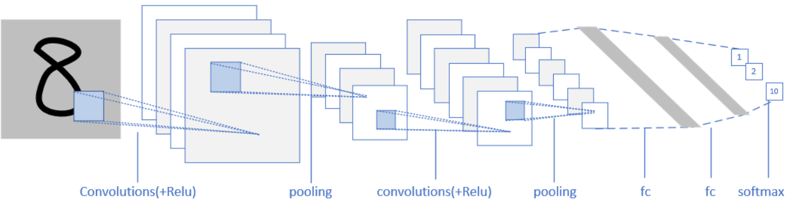
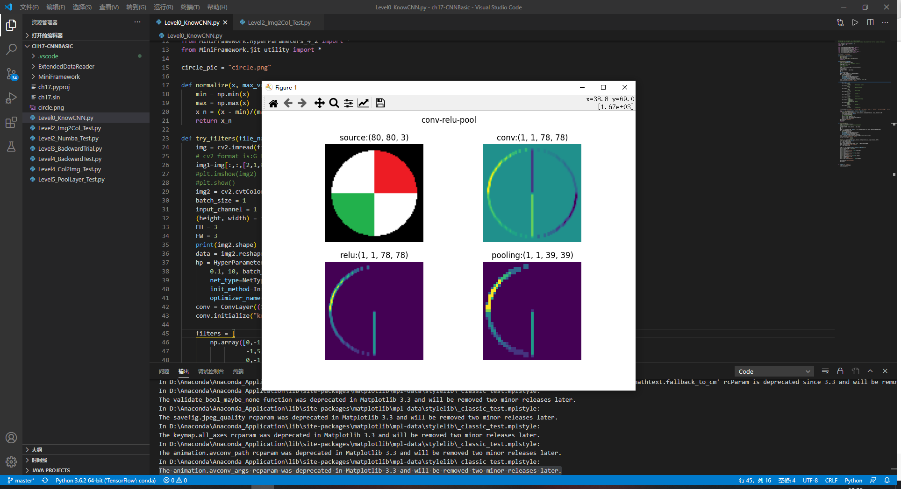
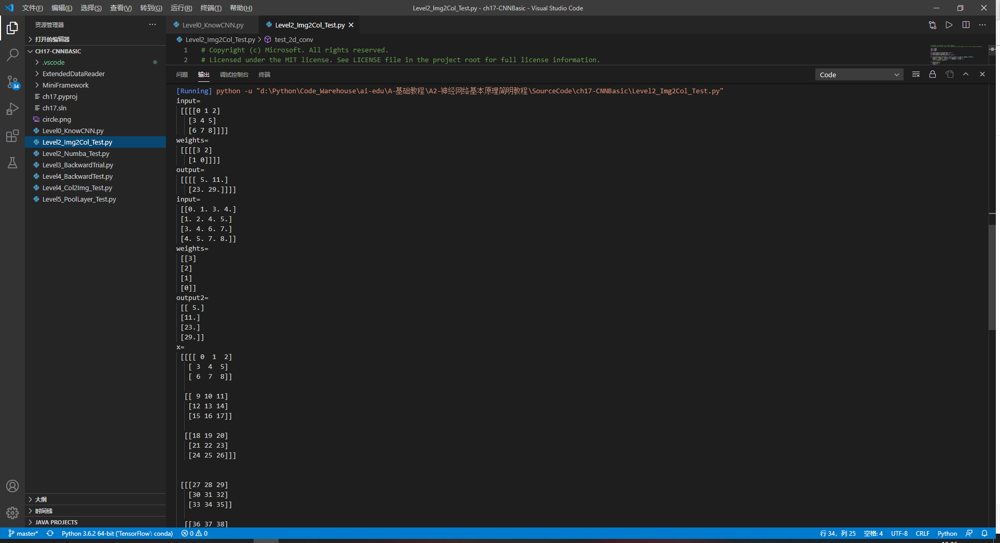
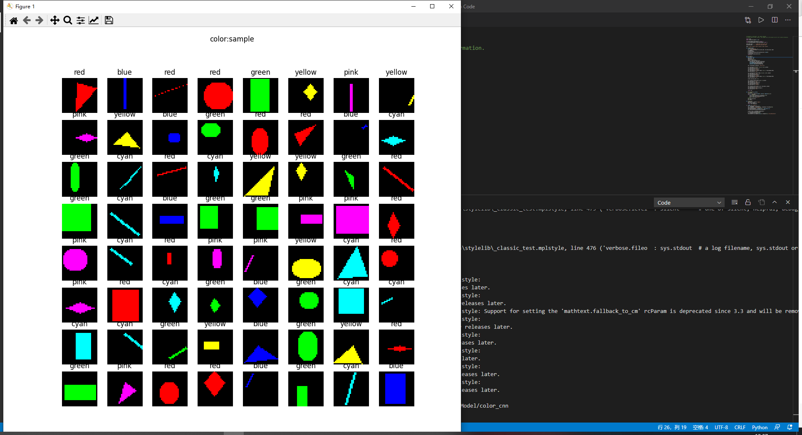
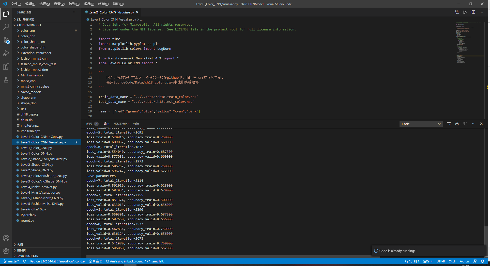
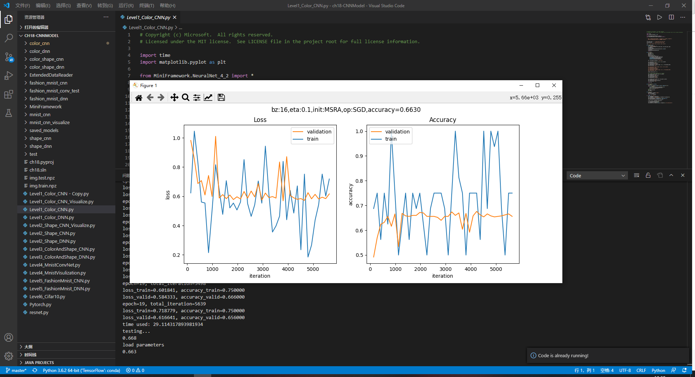

# 卷积神经网络

## 卷积神经网络的原理



卷积神经网络的层级结构：

1. 原始的输入是一张图片，可以是彩色的，也可以是灰度的或黑白的。这里假设是只有一个通道的图片，目的是识别0~9的手写体数字；
2. 第一层卷积，我们使用了4个卷积核，得到了4张feature map；激活函数层没有单独画出来，这里我们紧接着卷积操作使用了Relu激活函数；
3. 第二层是池化，使用了Max Pooling方式，把图片的高宽各缩小一倍，但仍然是4个feature map；
4. 第三层卷积，我们使用了4x6个卷积核，其中4对应着输入通道，6对应着输出通道，从而得到了6张feature map，当然也使用了Relu激活函数；
5. 第四层再次做一次池化，现在得到的图片尺寸只是原始尺寸的四分之一左右；
6. 第五层把第四层的6个图片展平成一维，成为一个fully connected层；
7. 第六层再接一个小一些的fully connected层；
8. 最后接一个softmax函数，判别10个分类。

## 前向计算原理

### 17.1.1 卷积的数学定义

#### 连续定义

$$h(x)=(f*g)(x) = \int_{-\infty}^{\infty} f(t)g(x-t)dt \tag{1}$$

卷积与傅里叶变换有着密切的关系。利用这点性质，即两函数的傅里叶变换的乘积等于它们卷积后的傅里叶变换，能使傅里叶分析中许多问题的处理得到简化。

#### 离散定义

$$h(x) = (f*g)(x) = \sum^{\infty}_{t=-\infty} f(t)g(x-t) \tag{2}$$

### 17.1.3 单入单出的二维卷积

二维卷积一般用于图像处理上。在二维图片上做卷积，如果把图像Image简写为$I$，把卷积核Kernal简写为$K$，则目标图片的第$(i,j)$个像素的卷积值为：

$$
h(i,j) = (I*K)(i,j)=\sum_m \sum_n I(m,n)K(i-m,j-n) \tag{3}
$$

可以看出，这和一维情况下的公式2是一致的。从卷积的可交换性，我们可以把公式3等价地写作：

$$
h(i,j) = (I*K)(i,j)=\sum_m \sum_n I(i-m,j-n)K(m,n) \tag{4}
$$

公式4的成立，是因为我们将Kernal进行了翻转。在神经网络中，一般会实现一个互相关函数(corresponding function)，而卷积运算几乎一样，但不反转Kernal：

$$
h(i,j) = (I*K)(i,j)=\sum_m \sum_n I(i+m,j+n)K(m,n) \tag{5}
$$

在图像处理中，自相关函数和互相关函数定义如下：

- 自相关：设原函数是f(t)，则$h=f(t) \star f(-t)$，其中$\star$表示卷积
- 互相关：设两个函数分别是f(t)和g(t)，则$h=f(t) \star g(-t)$

互相关函数的运算，是两个序列滑动相乘，两个序列都不翻转。卷积运算也是滑动相乘，但是其中一个序列需要先翻转，再相乘。所以，从数学意义上说，机器学习实现的是互相关函数，而不是原始含义上的卷积。但我们为了简化，把公式5也称作为卷积。这就是卷积的来源。

结论：

1. 我们实现的卷积操作不是原始数学含义的卷积，而是工程上的卷积，可以简称为卷积
2. 在实现卷积操作时，并不会反转卷积核

卷积计算过程：


### 17.1.5 多入单出的降维卷积

一张图片，通常是彩色的，具有红绿蓝三个通道。我们可以有两个选择来处理：

1. 变成灰度的，每个像素只剩下一个值，就可以用二维卷积
2. 对于三个通道，每个通道都使用一个卷积核，分别处理红绿蓝三种颜色的信息

显然第2种方法可以从图中学习到更多的特征，于是出现了三维卷积，即有三个卷积核分别对应书的三个通道，三个子核的尺寸是一样的，比如都是2x2，这样的话，这三个卷积核就是一个3x2x2的立体核，称为过滤器Filter，所以称为三维卷积。


图17-14 多入单出的降维卷积

在上图中，每一个卷积核对应着左侧相同颜色的输入通道，三个过滤器的值并不一定相同。对三个通道各自做卷积后，得到右侧的三张特征图，然后再按照原始值不加权地相加在一起，得到最右侧的白色特征图，这张图里面已经把三种颜色的特征混在一起了，所以画成了白色，表示没有颜色特征了。

虽然输入图片是多个通道的，或者说是三维的，但是在相同数量的过滤器的计算后，相加在一起的结果是一个通道，即2维数据，所以称为降维。这当然简化了对多通道数据的计算难度，但同时也会损失多通道数据自带的颜色信息。

### 17.1.6 多入多出的同维卷积

在上面的例子中，是一个过滤器Filter内含三个卷积核Kernal。我们假设有一个彩色图片为3x3的，如果有两组3x2x2的卷积核的话，会做什么样的卷积计算？看图17-15。


图17-15 多入多出的卷积运算

第一个过滤器Filter-1为棕色所示，它有三卷积核(Kernal)，命名为Kernal-1，Keanrl-2，Kernal-3，分别在红绿蓝三个输入通道上进行卷积操作，生成三个2x2的输出Feature-1,n。然后三个Feature-1,n相加，并再加上b1偏移值，形成最后的棕色输出Result-1。

对于灰色的过滤器Filter-2也是一样，先生成三个Feature-2,n，然后相加再加b2，最后得到Result-2。

之所以Feature-m,n还用红绿蓝三色表示，是因为在此时，它们还保留着红绿蓝三种色彩的各自的信息，一旦相加后得到Result，这种信息就丢失了。

## 反向传播原理


图17-28 原图和经过横边检测算子的卷积结果

左侧为原始图片（80x80的灰度图），右侧为经过3x3的卷积后的结果图片（78x78的灰度图）。由于算子是横边检测，所以只保留了原始图片中的横边。

卷积核矩阵：

$$
w=\begin{pmatrix}
  0 & -1 & 0 \\\\
  0 & 2 & 0 \\\\
  0 & -1 & 0
\end{pmatrix}
$$

现在我们转换一下问题：假设我们有一张原始图片（如左侧）和一张目标图片（如右侧），我们如何得到对应的卷积核呢？

我们在前面学习了线性拟合的解决方案，实际上这个问题是同一种性质的，只不过把直线拟合点阵的问题，变成了图像拟合图像的问题，如表17-3所示。

表17-3 直线拟合与图像拟合的比较

||样本数据|标签数据|预测数据|公式|损失函数|
|---|---|---|---|---|---|
|直线拟合|样本点x|标签值y|预测直线z|$z=x \cdot w+b$|均方差|
|图片拟合|原始图片x|目标图片y|预测图片z|$z=x * w+b$|均方差|

直线拟合中的均方差，是计算预测值与样本点之间的距离；图片拟合中的均方差，可以直接计算两张图片对应的像素点之间的差值。

为了简化问题，我们令b=0，只求卷积核w的值，则前向公式为：

$$
z = x * w
$$
$$
loss = \frac{1}{2}(z-y)^2
$$

反向求解w的梯度公式（从公式11得到）：

$$
\frac{\partial loss}{\partial w}=\frac{\partial loss}{\partial z}\frac{\partial z}{\partial w}=x * (z-y)
$$

即w的梯度为预测图片z减去目标图片y的结果，再与原始图片x做卷积，其中x为被卷积图片，z-y为卷积核。

训练部分的代码实现如下：

```Python
def train(x, w, b, y):
    output = create_zero_array(x, w)
    for i in range(10000):
        # forward
        jit_conv_2d(x, w, b, output)
        # loss
        t1 = (output - y)
        m = t1.shape[0]*t1.shape[1]
        LOSS = np.multiply(t1, t1)
        loss = np.sum(LOSS)/2/m
        print(i,loss)
        if loss < 1e-7:
            break
        # delta
        delta = output - y
        # backward
        dw = np.zeros(w.shape)
        jit_conv_2d(x, delta, b, dw)
        w = w - 0.5 * dw/m
    #end for
    return w
```

一共迭代10000次：

1. 用jit_conv_2d(x,w...)做一次前向计算
2. 计算loss值以便检测停止条件，当loss值小于1e-7时停止迭代
3. 然后计算delta值
4. 再用jit_conv_2d(x,delta)做一次反向计算，得到w的梯度
5. 最后更新卷积核w的值

运行结果：

```
......
3458 1.0063169744079507e-07
3459 1.0031151142628902e-07
3460 9.999234418532805e-08
w_true:
 [[ 0 -1  0]
 [ 0  2  0]
 [ 0 -1  0]]
w_result:
 [[-1.86879237e-03 -9.97261724e-01 -1.01212359e-03]
 [ 2.58961697e-03  1.99494606e+00  2.74435794e-03]
 [-8.67754199e-04 -9.97404263e-01 -1.87580756e-03]]
w allclose: True
y allclose: True
```

当迭代到3460次的时候，loss值小于1e-7，迭代停止。比较w_true和w_result的值，两者非常接近。用numpy.allclose()方法比较真实卷积核和训练出来的卷积核的值，结果为True。比如-1.86879237e-03，接近于0；-9.97261724e-01，接近于-1。

再比较卷积结果，当然也会非常接近，误差很小，allclose结果为True。用图示方法显示卷积结果比较如图17-29。


图17-29 真实值和训练值的卷积结果区别

人眼是看不出什么差异来的。由此我们可以直观地理解到卷积核的训练过程并不复杂。

## 池化的前向计算与反向传播

### 17.5.1 常用池化方法

池化 pooling，又称为下采样，downstream sampling or sub-sampling。

池化方法分为两种，一种是最大值池化 Max Pooling，一种是平均值池化 Mean/Average Pooling。如图17-32所示。


图17-32 池化

- 最大值池化，是取当前池化视野中所有元素的最大值，输出到下一层特征图中。
- 平均值池化，是取当前池化视野中所有元素的平均值，输出到下一层特征图中。

其目的是：

- 扩大视野：就如同先从近处看一张图片，然后离远一些再看同一张图片，有些细节就会被忽略
- 降维：在保留图片局部特征的前提下，使得图片更小，更易于计算
- 平移不变性，轻微扰动不会影响输出：比如上图中最大值池化的4，即使向右偏一个像素，其输出值仍为4
- 维持同尺寸图片，便于后端处理：假设输入的图片不是一样大小的，就需要用池化来转换成同尺寸图片

一般我们都使用最大值池化。

### 17.5.2 池化的其它方式

在上面的例子中，我们使用了size=2x2，stride=2的模式，这是常用的模式，即步长与池化尺寸相同。

我们很少使用步长值与池化尺寸不同的配置，所以只是提一下，如图17-33。


图17-33 步长为1的池化

上图是stride=1, size=2x2的情况，可以看到，右侧的结果中，有一大堆的3和4，基本分不开了，所以其池化效果并不好。

假设输入图片的形状是 $W_1 \times H_1 \times D_1$，其中W是图片宽度，H是图片高度，D是图片深度（多个图层），F是池化的视野（正方形），S是池化的步长，则输出图片的形状是：

$$
\begin{cases}
W_2 = (W_1 - F)/S + 1 \\\\
H_2 = (H_1 - F)/S + 1 \\\\
D_2 = D_1
\end{cases}
$$

池化层不会改变图片的深度，即D值前后相同。

### 17.5.3 池化层的训练

我们假设图17-34中，$[[1,2],[3,4]]$是上一层网络回传的残差，那么：

- 对于最大值池化，残差值会回传到当初最大值的位置上，而其它三个位置的残差都是0。
- 对于平均值池化，残差值会平均到原始的4个位置上。


图17-34 平均池化与最大池化


图17-35 池化层反向传播的示例

### 17.5.4 实现方法1

按照标准公式来实现池化的正向和反向代码。

```Python
class PoolingLayer(CLayer):
    def forward_numba(self, x, train=True):
        ......

    def backward_numba(self, delta_in, layer_idx):
        ......
```

有了前面的经验，这次我们直接把前向和反向函数用numba方式来实现，并在前面加上@nb.jit修饰符：
```Python
@nb.jit(nopython=True)
def jit_maxpool_forward(...):
    ...
    return z

@nb.jit(nopython=True)
def jit_maxpool_backward(...):
    ...
    return delta_out
```

### 17.5.5 实现方法2

池化也有类似与卷积优化的方法来计算，在图17-36中，我们假设大写字母为池子中的最大元素，并且用max_pool方式。


图17-36 池化层的img2col实现

原始数据先做img2col变换，然后做一次np.max(axis=1)的max计算，会大大增加速度，然后把结果reshape成正确的矩阵即可。做一次大矩阵的max计算，比做4次小矩阵计算要快很多。

```Python
class PoolingLayer(CLayer):
    def forward_img2col(self, x, train=True):
        ......

    def backward_col2img(self, delta_in, layer_idx):
        ......
```

### 17.5.6 性能测试

下面我们要比较一下以上两种实现方式的性能，来最终决定使用哪一种。

对同样的一批64个样本，分别用两种方法做5000次的前向和反向计算，得到的结果：

```
Elapsed of numba: 17.537396907806396
Elapsed of img2col: 22.51519775390625
forward: True
backward: True
```

numba方法用了17秒，img2col方法用了22秒。并且两种方法的返回矩阵值是一样的，说明代码实现正确。

## 经典卷积神经网络模型


图18-2 AlexNet模型结构图

1. 原始图片是3x224x224三通道彩色图片，分开到上下两块GPU上进行训练
2. 卷积，96核，11x11，stride=4，pad=0，输出96x55x55
3. LRN+池化，3x3，stride=2，pad=0，输出96x27x27
4. 卷积，256核，5x5，stride=1，pad=2，输出256x27x27
5. LRN+池化，3x3，stride=2，输出256x13x13
6. 卷积，384核，3x3，stride=1，pad=1，输出384x13x13
7. 卷积，384核，3x3，stride=1，pad=1，输出384x13x13
8. 卷积，256核，3x3，stride=1，pad=1，输出256x13x13
9. 池化，3x3，stride=2，输出256x6x6
10. 全连接层，4096个神经元，接Dropout和Relu
11. 全连接层，4096个神经元，接Dropout和Relu
12. 全连接层，1000个神经元做分类

### 18.0.5 GoogLeNet (2014)

GoogLeNet$^{[7]}$在2014的ImageNet分类任务上击败了VGG-Nets夺得冠军，其实力肯定是非常深厚的，GoogLeNet跟AlexNet,VGG-Nets这种单纯依靠加深网络结构进而改进网络性能的思路不一样，它另辟幽径，在加深网络的同时（22层），也在网络结构上做了创新，引入Inception结构代替了单纯的卷积+激活的传统操作（这思路最早由Network in Network提出）。GoogLeNet进一步把对卷积神经网络的研究推上新的高度。

图18-8是GoogLeNet的模型结构图。


图18-8 GoogLeNet模型结构图

蓝色为卷积运算，红色为池化运算，黄色为softmax分类。


图18-9 Inception结构图

图18-9的结构就是Inception，结构里的卷积stride都是1，另外为了保持特征响应图大小一致，都用了零填充。最后每个卷积层后面都立刻接了个ReLU层。在输出前有个叫concatenate的层，直译的意思是“并置”，即把4组不同类型但大小相同的特征响应图一张张并排叠起来，形成新的特征响应图。Inception结构里主要做了两件事：1. 通过3×3的池化、以及1×1、3×3和5×5这三种不同尺度的卷积核，一共4种方式对输入的特征响应图做了特征提取。2. 为了降低计算量。同时让信息通过更少的连接传递以达到更加稀疏的特性，采用1×1卷积核来实现降维。

这里想再详细谈谈1×1卷积核的作用，它究竟是怎么实现降维的。现在运算如下：下面图1是3×3卷积核的卷积，图2是1×1卷积核的卷积过程。对于单通道输入，1×1的卷积确实不能起到降维作用，但对于多通道输入，就不同了。假设你有256个特征输入，256个特征输出，同时假设Inception层只执行3×3的卷积。这意味着总共要进行 256×256×3×3的卷积（589000次乘积累加（MAC）运算）。这可能超出了我们的计算预算，比方说，在Google服务器上花0.5毫秒运行该层。作为替代，我们决定减少需要卷积的特征的数量，比如减少到64（256/4）个。在这种情况下，我们首先进行256到64的1×1卷积，然后在所有Inception的分支上进行64次卷积，接着再使用一个64到256的1×1卷积。

- 256×64×1×1 = 16000
- 64×64×3×3 = 36000
- 64×256×1×1 = 16000

现在的计算量大约是70000(即16000+36000+16000)，相比之前的约600000，几乎减少了10倍。这就通过小卷积核实现了降维。
现在再考虑一个问题：为什么一定要用1×1卷积核，3×3不也可以吗？考虑[50,200,200]的矩阵输入，我们可以使用20个1×1的卷积核进行卷积，得到输出[20,200,200]。有人问，我用20个3×3的卷积核不是也能得到[20,200,200]的矩阵输出吗，为什么就使用1×1的卷积核？我们计算一下卷积参数就知道了，对于1×1的参数总数：20×200×200×（1×1），对于3×3的参数总数：20×200×200×（3×3），可以看出，使用1×1的参数总数仅为3×3的总数的九分之一！所以我们使用的是1×1卷积核。

GoogLeNet网络结构中有3个LOSS单元，这样的网络设计是为了帮助网络的收敛。在中间层加入辅助计算的LOSS单元，目的是计算损失时让低层的特征也有很好的区分能力，从而让网络更好地被训练。在论文中，这两个辅助LOSS单元的计算被乘以0.3，然后和最后的LOSS相加作为最终的损失函数来训练网络。

GoogLeNet还有一个闪光点值得一提，那就是将后面的全连接层全部替换为简单的全局平均pooling，在最后参数会变的更少。而在AlexNet中最后3层的全连接层参数差不多占总参数的90%，使用大网络在宽度和深度允许GoogleNet移除全连接层，但并不会影响到结果的精度，在ImageNet中实现93.3%的精度，而且要比VGG还要快。

### 18.0.7 DenseNet (2017)

DenseNet$^{[9]}$ 是一种具有密集连接的卷积神经网络。在该网络中，任何两层之间都有直接的连接，也就是说，网络每一层的输入都是前面所有层输出的并集，而该层所学习的特征图也会被直接传给其后面所有层作为输入。下图是 DenseNet 的一个dense block示意图，一个block里面的结构如下，与ResNet中的BottleNeck基本一致：BN-ReLU-Conv(1×1)-BN-ReLU-Conv(3×3) ，而一个DenseNet则由多个这种block组成。每个DenseBlock的之间层称为transition layers，由BN−>Conv(1×1)−>averagePooling(2×2)组成。

图18-13是ResNets的模型结构。


图18-13 DenseNet模型结构图

DenseNet作为另一种拥有较深层数的卷积神经网络，具有如下优点：

1. 相比ResNet拥有更少的参数数量
2. 旁路加强了特征的重用
3. 网络更易于训练,并具有一定的正则效果
4. 缓解了gradient vanishing和model degradation的问题

何恺明先生在提出ResNet时做出了这样的假设：若某一较深的网络多出另一较浅网络的若干层有能力学习到恒等映射，那么这一较深网络训练得到的模型性能一定不会弱于该浅层网络。通俗的说就是如果对某一网络中增添一些可以学到恒等映射的层组成新的网路，那么最差的结果也是新网络中的这些层在训练后成为恒等映射而不会影响原网络的性能。同样DenseNet在提出时也做过假设：与其多次学习冗余的特征，特征复用是一种更好的特征提取方式。

## 实现颜色分类

### 18.1.2 用前馈神经网络解决问题

#### 数据处理

由于输入图片是三通道的彩色图片，我们先把它转换成灰度图，

```Python
class GeometryDataReader(DataReader_2_0):
    def ConvertToGray(self, data):
        (N,C,H,W) = data.shape
        new_data = np.empty((N,H*W))
        if C == 3: # color
            for i in range(N):
                new_data[i] = np.dot(
                    [0.299,0.587,0.114], 
                    data[i].reshape(3,-1)).reshape(1,784)
        elif C == 1: # gray
            new_data[i] = data[i,0].reshape(1,784)
        #end if
        return new_data
```

向量[0.299,0.587,0.114]的作用是，把三通道的彩色图片的RGB值与此向量相乘，得到灰度图，三个因子相加等于1，这样如果原来是[255,255,255]的话，最后的灰度图的值还是255。如果是[255,255,0]的话，最后的结果是：

$$
\begin{aligned}
Y &= 0.299 \cdot R + 0.586 \cdot G + 0.114 \cdot B \\
&= 0.299 \cdot 255 + 0.586 \cdot 255 + 0.114 \cdot 0 \\
&=225.675
\end{aligned}
\tag{1}
$$

也就是说粉色的数值本来是(255,255,0)，变成了单一的值225.675。六种颜色中的每一种都会有不同的值，所以即使是在灰度图中，也会保留部分“彩色”信息，当然会丢失一些信息。这从公式1中很容易看出来，假设$B=0$，不同组合的$R、G$的值有可能得到相同的最终结果，因此会丢失彩色信息。

在转换成灰度图后，立刻用reshape(1,784)把它转变成矢量，该矢量就是每个样本的784维的特征值。

### 18.1.3 用卷积神经网络解决问题

下面我们看看卷积神经网络的表现。我们直接使用三通道的彩色图片，不需要再做数据转换了。

#### 搭建模型

```Python
def cnn_model():
    num_output = 6
    max_epoch = 20
    batch_size = 16
    learning_rate = 0.1
    params = HyperParameters_4_2(
        learning_rate, max_epoch, batch_size,
        net_type=NetType.MultipleClassifier,
        init_method=InitialMethod.MSRA,
        optimizer_name=OptimizerName.SGD)

    net = NeuralNet_4_2(params, "color_conv")
    
    c1 = ConvLayer((3,28,28), (2,1,1), (1,0), params)
    net.add_layer(c1, "c1")
    r1 = ActivationLayer(Relu())
    net.add_layer(r1, "relu1")
    p1 = PoolingLayer(c1.output_shape, (2,2), 2, PoolingTypes.MAX)
    net.add_layer(p1, "p1") 

    c2 = ConvLayer(p1.output_shape, (3,3,3), (1,0), params)
    net.add_layer(c2, "c2")
    r2 = ActivationLayer(Relu())
    net.add_layer(r2, "relu2")
    p2 = PoolingLayer(c2.output_shape, (2,2), 2, PoolingTypes.MAX)
    net.add_layer(p2, "p2") 

    params.learning_rate = 0.1

    f3 = FcLayer_2_0(p2.output_size, 32, params)
    net.add_layer(f3, "f3")
    bn3 = BnLayer(f3.output_size)
    net.add_layer(bn3, "bn3")
    r3 = ActivationLayer(Relu())
    net.add_layer(r3, "relu3")
    
    f4 = FcLayer_2_0(f3.output_size, num_output, params)
    net.add_layer(f4, "f4")
    s4 = ClassificationLayer(Softmax())
    net.add_layer(s4, "s4")

    return net
```

表18-1展示了在这个模型中各层的作用和参数。

表18-1 模型各层的参数

|ID|类型|参数|输入尺寸|输出尺寸|
|---|---|---|---|---|
|1|卷积|2x1x1, S=1|3x28x28|2x28x28|
|2|激活|Relu|2x28x28|2x28x28|
|3|池化|2x2, S=2, Max|2x14x14|2x14x14|
|4|卷积|3x3x3, S=1|2x14x14|3x12x12|
|5|激活|Relu|3x12x12|3x12x12|
|6|池化|2x2, S=2, Max|3x12x12|3x6x6|
|7|全连接|32|108|32|
|8|归一化||32|32|
|9|激活|Relu|32|32|
|10|全连接|6|32|6|
|11|分类|Softmax|6|6|

为什么第一梯队的卷积用2个卷积核，而第二梯队的卷积核用3个呢？只是经过调参试验的结果，是最小的配置。如果使用更多的卷积核当然可以完成问题，但是如果使用更少的卷积核，网络能力就不够了，不能收敛。

## 实现几何图形的分类

### 18.2.2 用前馈神经网络解决问题

我们下面要考验一下神经网络的能力。我们先用前面学过的全连接网络来解决这个问题，搭建一个三层的网络如下：

```Python
def dnn_model():
    num_output = 5
    max_epoch = 50
    batch_size = 16
    learning_rate = 0.1
    params = HyperParameters_4_2(
        learning_rate, max_epoch, batch_size,
        net_type=NetType.MultipleClassifier,
        init_method=InitialMethod.MSRA,
        optimizer_name=OptimizerName.SGD)

    net = NeuralNet_4_2(params, "pic_dnn")
    
    f1 = FcLayer_2_0(784, 128, params)
    net.add_layer(f1, "f1")
    r1 = ActivationLayer(Relu())
    net.add_layer(r1, "relu1")

    f2 = FcLayer_2_0(f1.output_size, 64, params)
    net.add_layer(f2, "f2")
    r2 = ActivationLayer(Relu())
    net.add_layer(r2, "relu2")
    
    f3 = FcLayer_2_0(f2.output_size, num_output, params)
    net.add_layer(f3, "f3")
    s3 = ClassificationLayer(Softmax())
    net.add_layer(s3, "s3")

    return net
```

样本数据为28x28的灰度图，所以我们要把它展开成1x784的向量，第一层用128个神经元，第二层用64个神经元，输出层5个神经元接Softmax分类函数。

最后可以得到如下训练结果。


图18-22 训练过程中损失函数值和准确度的变化

在测试集上得到的准确度是89.8%，这已经超出笔者的预期了，本来猜测准确度会小于80%。有兴趣的读者可以再精调一下这个前馈神经网络网络，看看是否可以得到更高的准确度。

### 18.2.3 用卷积神经网络解决问题

下面我们来看看卷积神经网络能不能完成这个工作。首先搭建网络模型如下：

```Python
def cnn_model():
    num_output = 5
    max_epoch = 50
    batch_size = 16
    learning_rate = 0.1
    params = HyperParameters_4_2(
        learning_rate, max_epoch, batch_size,
        net_type=NetType.MultipleClassifier,
        init_method=InitialMethod.MSRA,
        optimizer_name=OptimizerName.SGD)

    net = NeuralNet_4_2(params, "shape_cnn")
    
    c1 = ConvLayer((1,28,28), (8,3,3), (1,1), params)
    net.add_layer(c1, "c1")
    r1 = ActivationLayer(Relu())
    net.add_layer(r1, "relu1")
    p1 = PoolingLayer(c1.output_shape, (2,2), 2, PoolingTypes.MAX)
    net.add_layer(p1, "p1") 

    c2 = ConvLayer(p1.output_shape, (16,3,3), (1,0), params)
    net.add_layer(c2, "c2")
    r2 = ActivationLayer(Relu())
    net.add_layer(r2, "relu2")
    p2 = PoolingLayer(c2.output_shape, (2,2), 2, PoolingTypes.MAX)
    net.add_layer(p2, "p2") 

    params.learning_rate = 0.1

    f3 = FcLayer_2_0(p2.output_size, 32, params)
    net.add_layer(f3, "f3")
    bn3 = BnLayer(f3.output_size)
    net.add_layer(bn3, "bn3")
    r3 = ActivationLayer(Relu())
    net.add_layer(r3, "relu3")
    
    f4 = FcLayer_2_0(f3.output_size, num_output, params)
    net.add_layer(f4, "f4")
    s4 = ClassificationLayer(Softmax())
    net.add_layer(s4, "s4")

    return net
```
表18-2展示了模型中各层的作用和参数。

表18-2 模型各层的作用和参数

|ID|类型|参数|输入尺寸|输出尺寸|
|---|---|---|---|---|
|1|卷积|8x3x3, S=1,P=1|1x28x28|8x28x28|
|2|激活|Relu|8x28x28|8x28x28|
|3|池化|2x2, S=2, Max|8x28x28|8x14x14|
|4|卷积|16x3x3, S=1|8x14x14|16x12x12|
|5|激活|Relu|16x12x12|16x12x12|
|6|池化|2x2, S=2, Max|16x6x6|16x6x6|
|7|全连接|32|576|32|
|8|归一化||32|32|
|9|激活|Relu|32|32|
|10|全连接|5|32|5|
|11|分类|Softmax|5|5|

经过50个epoch的训练后，我们得到的结果如图18-23。


图18-23 训练过程中损失函数值和准确度的变化

以下是打印输出的最后几行：

```
......
epoch=49, total_iteration=14099
loss_train=0.002093, accuracy_train=1.000000
loss_valid=0.163053, accuracy_valid=0.944000
time used: 259.32207012176514
testing...
0.935
load parameters
0.96
```

可以看到我们在测试集上得到了96%的准确度，比前馈神经网络模型要高出很多，这也证明了卷积神经网络在图像识别上的能力。

图18-24是部分测试集中的测试样本的预测结果。


图18-24 测试结果

绝大部分样本预测是正确的，只有最后一个样本，看上去应该是一个很扁的三角形，被预测成了菱形。


代码结果：





