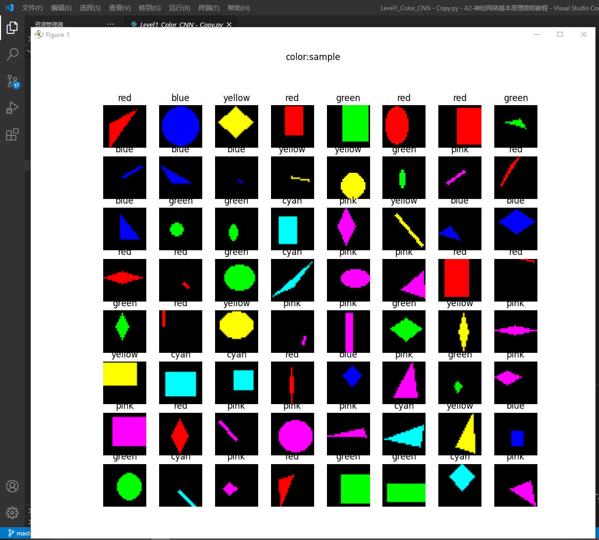
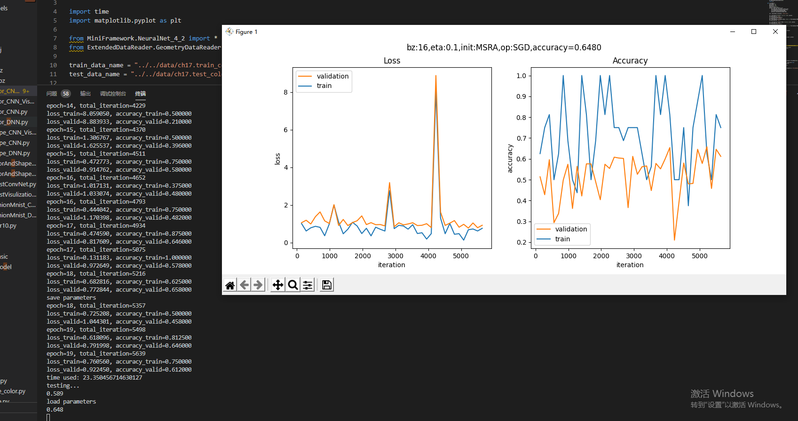
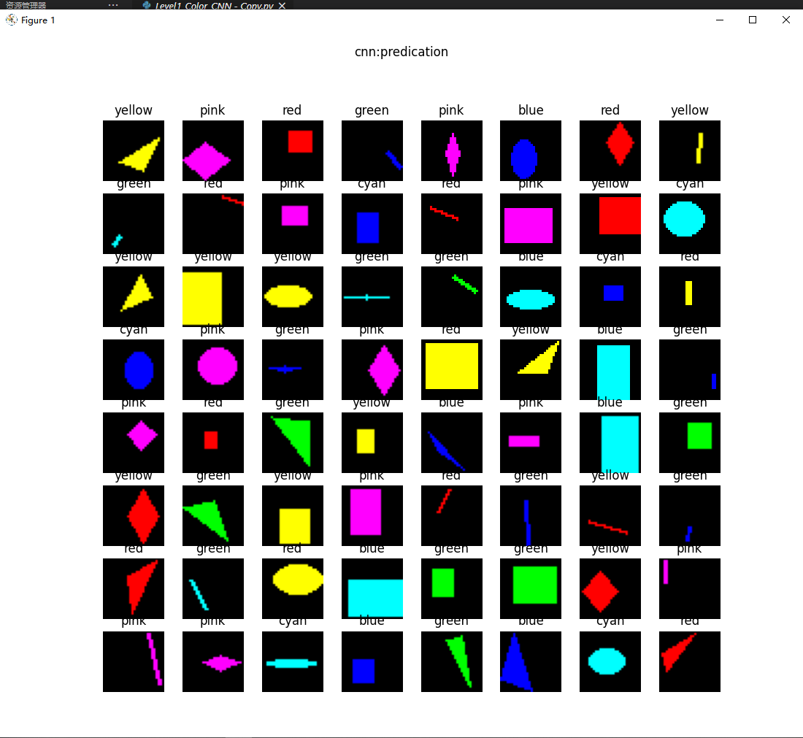
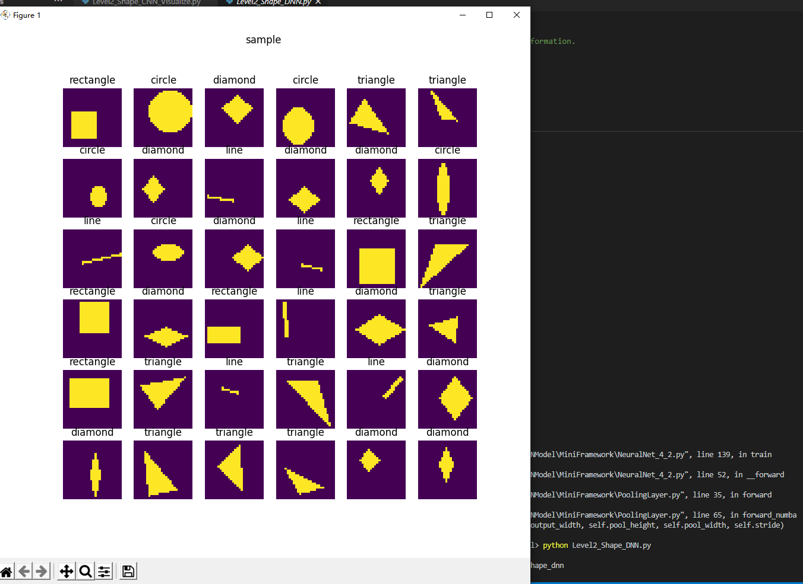
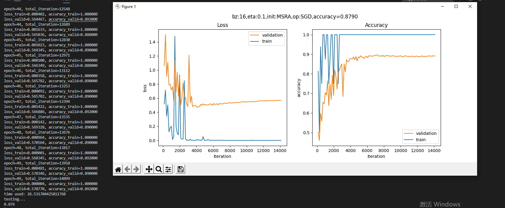
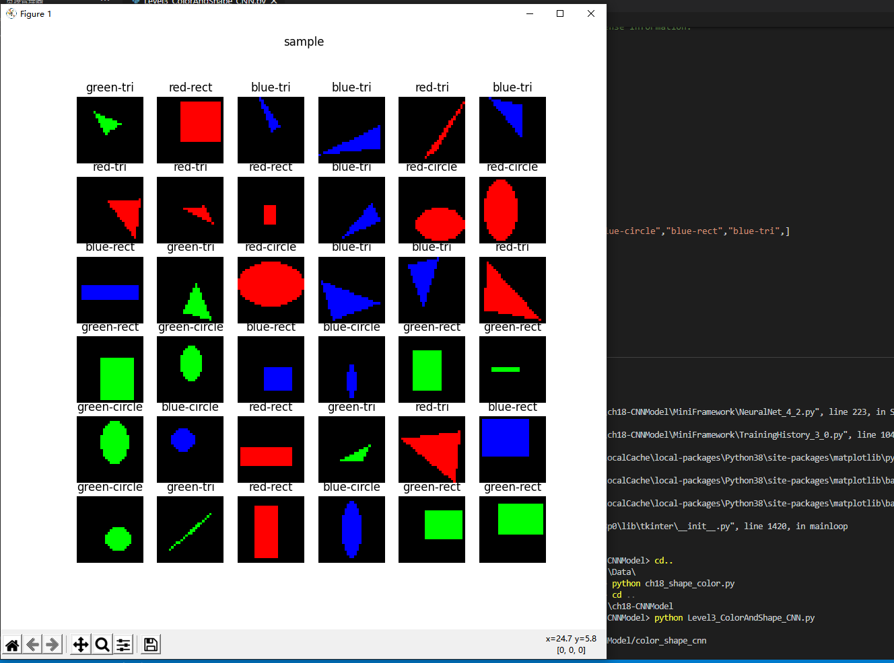
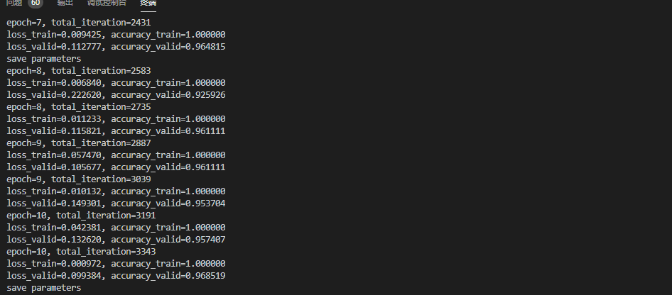
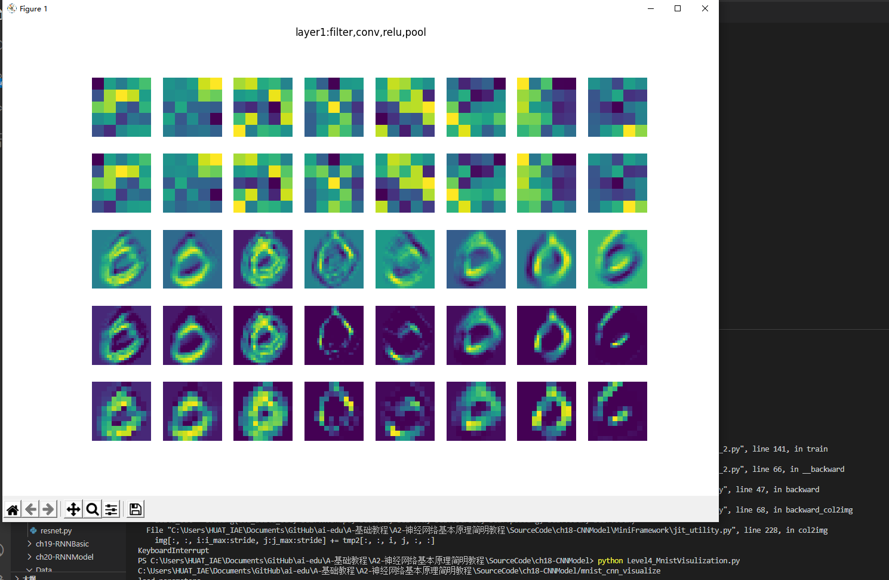

# 卷积神经网络

卷积神经网络是深度学习中的一个里程碑式的技术，有了这个技术，才会让计算机有能力理解图片和视频信息，才会有计算机视觉的众多应用。

### 卷积神经网络的能力

卷积神经网络（CNN，Convolutional Neural Net)是神经网络的类型之一，在图像识别和分类领域中取得了非常好的效果，比如识别人脸、物体、交通标识等，这就为机器人、自动驾驶等应用提供了坚实的技术基础。

在下面图17-1，卷积神经网络展现了识别人类日常生活中的各种物体的能力。


图17-1 识别出四个人在一条船上

### 卷积神经网络的典型结构

一个典型的卷积神经网络的结构如图17-5所示。


图17-5 卷积神经网络的典型结构图
在一个典型的卷积神经网络中，会至少包含以下几个层：

- 卷积层
- 激活函数层
- 池化层
- 全连接分类层
### 卷积核的作用

卷积网络之所以能工作，完全是卷积核的功劳。卷积核其实就是一个小矩阵，类似这样：

```
1.1  0.23  -0.45
0.1  -2.1   1.24
0.74 -1.32  0.01
```

这是一个3x3的卷积核，还会有1x1、5x5、7x7、9x9、11x11的卷积核。在卷积层中，我们会用输入数据与卷积核相乘，得到输出数据，就类似全连接层中的Weights一样，所以卷积核里的数值，也是通过反向传播的方法学习到的。

下面我们看看卷积核的具体作用。


图17-6 卷积核的作用

表17-2 各个卷积核的作用

|序号|名称|说明|
|---|---|---|
|1|锐化|如果一个像素点比周围像素点亮，则此算子会令其更亮|
|2|检测竖边|检测出了十字线中的竖线，由于是左侧和右侧分别检查一次，所以得到两条颜色不一样的竖线|
|3|周边|把周边增强，把同色的区域变弱，形成大色块|
|4|Sobel-Y|纵向亮度差分可以检测出横边，与横边检测不同的是，它可以使得两条横线具有相同的颜色，具有分割线的效果|
|5|Identity|中心为1四周为0的过滤器，卷积后与原图相同|
|6|横边检测|检测出了十字线中的横线，由于是上侧和下侧分别检查一次，所以得到两条颜色不一样的横线|
|7|模糊|通过把周围的点做平均值计算而“杀富济贫”造成模糊效果|
|8|Sobel-X|横向亮度差分可以检测出竖边，与竖边检测不同的是，它可以使得两条竖线具有相同的颜色，具有分割线的效果|
|9|浮雕|形成大理石浮雕般的效果|

图17-7中的四个子图，依次展示了：

1. 原图
2. 卷积结果
3. 激活结果
4. 池化结果


图17-7 原图经过卷积-激活-池化操作后的效果

1. 注意图一是原始图片，用cv2读取出来的图片，其顺序是反向的，即：

- 第一维是高度
- 第二维是宽度
- 第三维是彩色通道数，但是其顺序为BGR，而不是常用的RGB
###  卷积的数学定义

#### 连续定义

$$h(x)=(f*g)(x) = \int_{-\infty}^{\infty} f(t)g(x-t)dt \tag{1}$$

卷积与傅里叶变换有着密切的关系。利用这点性质，即两函数的傅里叶变换的乘积等于它们卷积后的傅里叶变换，能使傅里叶分析中许多问题的处理得到简化。

#### 离散定义

$$h(x) = (f*g)(x) = \sum^{\infty}_{t=-\infty} f(t)g(x-t) \tag{2}$$

### 一维卷积

符合卷积的定义，把它写成标准的形式就是公式2：

$$h(4)=(f*g)(4)=\sum _{t=1}^{3}f(t)g(4-t)$$

###  单入单出的二维卷积

二维卷积一般用于图像处理上。在二维图片上做卷积，如果把图像Image简写为$I$，把卷积核Kernal简写为$K$，则目标图片的第$(i,j)$个像素的卷积值为：

$$
h(i,j) = (I*K)(i,j)=\sum_m \sum_n I(m,n)K(i-m,j-n) \tag{3}
$$

可以看出，这和一维情况下的公式2是一致的。从卷积的可交换性，我们可以把公式3等价地写作：

$$
h(i,j) = (I*K)(i,j)=\sum_m \sum_n I(i-m,j-n)K(m,n) \tag{4}
$$

公式4的成立，是因为我们将Kernal进行了翻转。在神经网络中，一般会实现一个互相关函数(corresponding function)，而卷积运算几乎一样，但不反转Kernal：

$$
h(i,j) = (I*K)(i,j)=\sum_m \sum_n I(i+m,j+n)K(m,n) \tag{5}
$$

在图像处理中，自相关函数和互相关函数定义如下：

- 自相关：设原函数是f(t)，则$h=f(t) \star f(-t)$，其中$\star$表示卷积
- 互相关：设两个函数分别是f(t)和g(t)，则$h=f(t) \star g(-t)$

互相关函数的运算，是两个序列滑动相乘，两个序列都不翻转。卷积运算也是滑动相乘，但是其中一个序列需要先翻转，再相乘。所以，从数学意义上说，机器学习实现的是互相关函数，而不是原始含义上的卷积。但我们为了简化，把公式5也称作为卷积。这就是卷积的来源。

结论：

1. 我们实现的卷积操作不是原始数学含义的卷积，而是工程上的卷积，可以简称为卷积
2. 在实现卷积操作时，并不会反转卷积核


图17-12 卷积运算的过程
###  单入多出的升维卷积

原始输入是一维的图片，但是我们可以用多个卷积核分别对其计算，从而得到多个特征输出。如图17-13所示。


图17-13 单入多出的升维卷积

### 多入单出的降维卷积


图17-14 多入单出的降维卷积

##  多入多出的同维卷积


图17-15 多入多出的卷积运算

### 卷积编程模型

上图侧重于解释数值计算过程，而图17-16侧重于解释五个概念的关系：

- 输入 Input Channel
- 卷积核组 WeightsBias
- 过滤器 Filter
- 卷积核 kernal
- 输出 Feature Map


图17-16 三通道经过两组过滤器的卷积过程

### 步长 stride


图17-17 步长为2的卷积

### 填充 padding


图17-18 带填充的卷积
##  卷积前向计算代码实现
### 卷积核的实现

卷积核，实际上和全连接层一样，是权重矩阵加偏移向量的组合，区别在于全连接层中的权重矩阵是二维的，偏移矩阵是列向量，而卷积核的权重矩阵是四维的，偏移矩阵是也是列向量。


图17-19 卷积核的组成

### 卷积前向运算的实现 - 方法1
```Python
class ConvLayer(CLayer):
    def forward(self, x, train=True):
        self.x = x
        self.batch_size = self.x.shape[0]
        # 如果有必要的话，先对输入矩阵做padding
        if self.padding > 0:
            self.padded = np.pad(...)
        else:
            self.padded = self.x
        #end if
        self.z = conv_4d(...)
        return self.z
```
###  卷积前向运算的实现 - 方法2

既然动态语言速度慢，我们把它编译成静态方法，是不是会快一些呢？

很幸运，有这样一个开源项目：[numba](https://numba.pydata.org/)，它可以在运行时把`Python`编译成`C`语言执行，代码是用`C`语言“风格”编写的`Python`代码，而且越像`C`的话，执行速度越快。

我们先用`pip`安装`numba`包：

```
pip install numba
```

然后在需要运行时编译的函数前面加上一个装饰符：

```Python
@nb.jit(nopython=True)
def jit_conv_4d(x, weights, bias, out_h, out_w, stride=1):
    ...
```

为了明确起见，我们把`conv_4d`前面加上一个`jit`前缀，表明这个函数是经过`numba`加速的。然后运行循环10次的测试代码：

```
Time used for Numba: 0.0727994441986084
```

又一次出乎我们的预料，这次只用了0.07秒，比纯`Python`代码快了500多倍！

但是不要急，我们还需要检查一下其正确性。方法1输出结果为`output1`，Numba编译后的方法输出结果为`output2`，二者都是四维矩阵，我们用`np.allclose()`函数来比较它们的差异：

```Python
    print("correctness:", np.allclose(output1, output2, atol=1e-7))
```

得到的结果是：

```
correctness: True
```
## 卷积前向运算的实现 - 方法3

由于卷积操作是原始图片数据与卷积核逐点相乘的结果，所以遍历每个点的运算速度非常慢。在全连接层中，由于是两个矩阵直接相乘，所以速度非常快。我们是否可以把卷积操作转换为矩阵操作呢？

在Caffe框架中，巧妙地把逐点相乘的运算转换成了矩阵运算，大大提升了程序运行速度。这就是著名的`im2col`函数（我们在代码中命名为`img2col`)。

```Python
    def forward_img2col(self, x, train=True):
        self.x = x
        self.batch_size = self.x.shape[0]
        assert(self.x.shape == (self.batch_size, self.InC, self.InH, self.InW))
        self.col_x = img2col(x, self.FH, self.FW, self.stride, self.padding)
        self.col_w = self.WB.W.reshape(self.OutC, -1).T
        self.col_b = self.WB.B.reshape(-1, self.OutC)
        out1 = np.dot(self.col_x, self.col_w) + self.col_b
        out2 = out1.reshape(batch_size, self.OutH, self.OutW, -1)
        self.z = np.transpose(out2, axes=(0, 3, 1, 2))
        return self.z
```

#### 原理

我们观察一下图17-20。


图17-20 把卷积运算转换成矩阵运算
#### 四维数组的展开
```
x =
(样本1)                 [样本2]
    (通道1)                 (通道1)
 [[[[ 0  1  2]           [[[27 28 29]
   [ 3  4  5]              [30 31 32]
   [ 6  7  8]]             [33 34 35]]
    (通道2)                 (通道2)
  [[ 9 10 11]             [[36 37 38]
   [12 13 14]              [39 40 41]
   [15 16 17]]             [42 43 44]]
    (通道3)                 (通道3)
  [[18 19 20]             [[45 46 47]
   [21 22 23]              [48 49 50]
   [24 25 26]]]            [51 52 53]]]]
------------------------------------------   
col_x =
 [[0.  1.  3.  4.|  9. 10. 12. 13.| 18. 19. 21. 22.]
 [ 1.  2.  4.  5.| 10. 11. 13. 14.| 19. 20. 22. 23.]
 [ 3.  4.  6.  7.| 12. 13. 15. 16.| 21. 22. 24. 25.]
 [ 4.  5.  7.  8.| 13. 14. 16. 17.| 22. 23. 25. 26.]
 ----------------+----------------+----------------
 [27. 28. 30. 31.| 36. 37. 39. 40.| 45. 46. 48. 49.]
 [28. 29. 31. 32.| 37. 38. 40. 41.| 46. 47. 49. 50.]
 [30. 31. 33. 34.| 39. 40. 42. 43.| 48. 49. 51. 52.]
 [31. 32. 34. 35.| 40. 41. 43. 44.| 49. 50. 52. 53.]]
```
#### 权重数组的展开

对应的四维输入数据，卷积核权重数组也需要是四维的，其原始形状和展开后的形状如下：
```
weights=
(过滤器1)               (过滤器2)
    (卷积核1)               (卷积核1)
 [[[[ 0  1]             [[[12 13]
   [ 2  3]]               [14 15]]
    (卷积核2)               (卷积核2)
  [[ 4  5]               [[16 17]
   [ 6  7]]               [18 19]]
    (卷积核3)               (卷积核3)
  [[ 8  9]               [[20 21]
   [10 11]]]              [22 23]]]]
---------------------------------------
col_w=
 [[ 0 12]
  [ 1 13]
  [ 2 14]
  [ 3 15]
  [ 4 16]
  [ 5 17]
  [ 6 18]
  [ 7 19]
  [ 8 20]
  [ 9 21]
  [10 22]
  [11 23]]
```
### 计算反向传播的梯度矩阵

正向公式：

$$Z = W*A+b \tag{0}$$

其中，W是卷积核，*表示卷积（互相关）计算，A为当前层的输入项，b是偏移（未在图中画出），Z为当前层的输出项，但尚未经过激活函数处理。

我们举一个具体的例子便于分析。图17-21是正向计算过程。


图17-21 卷积正向运算


图17-22 卷积运算中的误差反向传播

最后可以统一成为一个简洁的公式：

$$\delta_{out} = \delta_{in} * W^{rot180} \tag{8}$$
### 步长不为1时的梯度矩阵还原

我们先观察一下stride=1和2时，卷积结果的差异如图17-23。


图17-23 步长为1和步长为2的卷积结果的比较

二者的差别就是中间那个结果图的灰色部分。如果反向传播时，传入的误差矩阵是stride=2时的2x2的形状，那么我们只需要把它补上一个十字，变成3x3的误差矩阵，就可以用步长为1的算法了。

###  有多个卷积核时的梯度计算

有多个卷积核也就意味着有多个输出通道。

也就是升维卷积，如图17-24。


图17-24 升维卷积

### 有多个输入时的梯度计算

当输入层是多个图层时，每个图层必须对应一个卷积核，如图17-25。


图17-25 多个图层的卷积必须有一一对应的卷积核

### 计算卷积核梯度的实例说明

下面我们会用一个简单的例子来说明卷积核的训练过程。我们先制作一张样本图片，然后使用“横边检测”算子做为卷积核对该样本进行卷积，得到对比如图17-28。


图17-28 原图和经过横边检测算子的卷积结果

左侧为原始图片（80x80的灰度图），右侧为经过3x3的卷积后的结果图片（78x78的灰度图）。由于算子是横边检测，所以只保留了原始图片中的横边。
##  卷积反向传播代码实现

### 方法1

完全按照17.3中的讲解来实现反向传播，但是由于有17.2中关于numba帮助，我们在实现代码时，可以考虑把一些模块化的计算放到独立的函数中，用numba在运行时编译加速。

```Python
    def backward_numba(self, delta_in, flag):
        # 如果正向计算中的stride不是1，转换成是1的等价误差数组
        dz_stride_1 = expand_delta_map(delta_in, ...)
        # 计算本层的权重矩阵的梯度
        self._calculate_weightsbias_grad(dz_stride_1)
        # 由于输出误差矩阵的尺寸必须与本层的输入数据的尺寸一致，所以必须根据卷积核的尺寸，调整本层的输入误差矩阵的尺寸
        (pad_h, pad_w) = calculate_padding_size(...)
        dz_padded = np.pad(dz_stride_1, ...)
        # 计算本层输出到下一层的误差矩阵
        delta_out = self._calculate_delta_out(dz_padded, flag)
        #return delta_out
        return delta_out, self.WB.dW, self.WB.dB

    # 用输入数据乘以回传入的误差矩阵,得到卷积核的梯度矩阵
    def _calculate_weightsbias_grad(self, dz):
        self.WB.ClearGrads()
        # 先把输入矩阵扩大，周边加0
        (pad_h, pad_w) = calculate_padding_size(...)
        input_padded = np.pad(self.x, ...)
        # 输入矩阵与误差矩阵卷积得到权重梯度矩阵
        (self.WB.dW, self.WB.dB) = calcalate_weights_grad(...)
        self.WB.MeanGrads(self.batch_size)

    # 用输入误差矩阵乘以（旋转180度后的）卷积核
    def _calculate_delta_out(self, dz, layer_idx):
        if layer_idx == 0:
            return None
        # 旋转卷积核180度
        rot_weights = self.WB.Rotate180()
        # 定义输出矩阵形状
        delta_out = np.zeros(self.x.shape)
        # 输入梯度矩阵卷积旋转后的卷积核，得到输出梯度矩阵
        delta_out = calculate_delta_out(dz, ..., delta_out)

        return delta_out
```
### 方法2

在前向计算中，我们试验了img2col的方法，取得了不错的效果。在反向传播中，也有对应的逆向方法，叫做col2img。下面我们基于它来实现另外一种反向传播算法，其基本思想是：把反向传播也看作是全连接层的方式，直接用矩阵运算代替卷积操作，然后把结果矩阵再转换成卷积操作的反向传播所需要的形状。

#### 代码实现

```Python
    def backward_col2img(self, delta_in, layer_idx):
        OutC, InC, FH, FW = self.WB.W.shape
        # 误差矩阵变换
        delta_in_2d = np.transpose(delta_in, axes=(0,2,3,1)).reshape(-1, OutC)
        # 计算Bias的梯度
        self.WB.dB = np.sum(delta_in_2d, axis=0, keepdims=True).T / self.batch_size
        # 计算Weights的梯度
        dW = np.dot(self.col_x.T, delta_in_2d) / self.batch_size
        # 转换成卷积核的原始形状
        self.WB.dW = np.transpose(dW, axes=(1, 0)).reshape(OutC, InC, FH, FW)# 计算反向传播误差矩阵
        dcol = np.dot(delta_in_2d, self.col_w.T)
        # 转换成与输入数据x相同的形状
        delta_out = col2img(dcol, self.x.shape, FH, FW, self.stride, self.padding)
        return delta_out, self.WB.dW, self.WB.dB
```
#### 多样本多通道的实例讲解

图17-31是两个样本的例子，输入通道为3，输出通道为2。


图17-31 两个样本三通道两个卷积核的例子

## 池化层

### 常用池化方法

池化 pooling，又称为下采样，downstream sampling or sub-sampling。

池化方法分为两种，一种是最大值池化 Max Pooling，一种是平均值池化 Mean/Average Pooling。如图17-32所示。


图17-32 池化

- 最大值池化，是取当前池化视野中所有元素的最大值，输出到下一层特征图中。
- 平均值池化，是取当前池化视野中所有元素的平均值，输出到下一层特征图中。

其目的是：

- 扩大视野：就如同先从近处看一张图片，然后离远一些再看同一张图片，有些细节就会被忽略
- 降维：在保留图片局部特征的前提下，使得图片更小，更易于计算
- 平移不变性，轻微扰动不会影响输出：比如上图中最大值池化的4，即使向右偏一个像素，其输出值仍为4
- 维持同尺寸图片，便于后端处理：假设输入的图片不是一样大小的，就需要用池化来转换成同尺寸图片

一般我们都使用最大值池化。
### 池化层的训练


- 对于最大值池化，残差值会回传到当初最大值的位置上，而其它三个位置的残差都是0。
- 对于平均值池化，残差值会平均到原始的4个位置上。


图17-34 平均池化与最大池化


图17-35 池化层反向传播的示例

## 经典的卷积神经网络模型

### LeNet (1998)

图18-1是卷积神经网络的鼻祖LeNet$^{[3]}$的模型结构。


图18-1 LeNet模型结构图

LeNet是卷积神经网络的开创者LeCun在1998年提出，用于解决手写数字识别的视觉任务。自那时起，卷积神经网络的最基本的架构就定下来了：卷积层、池化层、全连接层。

### AlexNet (2012)

AlexNet$^{[4]}$网络结构在整体上类似于LeNet，都是先卷积然后在全连接。但在细节上有很大不同。AlexNet更为复杂。AlexNet有60 million个参数和65000个神经元，五层卷积，三层全连接网络，最终的输出层是1000通道的Softmax。

AlexNet用两块GPU并行计算，大大提高了训练效率，并且在ILSVRC-2012竞赛中获得了top-5测试的15.3%的error rate，获得第二名的方法error rate是26.2%，差距非常大，足以说明这个网络在当时的影响力。

图18-2是AlexNet的模型结构。


图18-2 AlexNet模型结构图

## ZFNet (2013)

图18-3是ZFNet的结构示意图。


图18-3 ZFNet模型结构图
##  VGGNet (2015)


图18-7为VGG16（16层的VGG）模型结构。


图18-7 VGG16模型结构图

VGG比较出名的是VGG-16和VGG-19，最常用的是VGG-16。

VGGNet的卷积层有一个特点：特征图的空间分辨率单调递减，特征图的通道数单调递增，使得输入图像在维度上流畅地转换到分类向量。用通俗的语言讲，就是特征图尺寸单调递减，特征图数量单调递增。从上面的模型图上来看，立体方块的宽和高逐渐减小，但是厚度逐渐增加。

###  GoogLeNet (2014)


图18-8是GoogLeNet的模型结构图。


图18-8 GoogLeNet模型结构图

蓝色为卷积运算，红色为池化运算，黄色为softmax分类。


图18-9 Inception结构图
## 实现颜色分类

代码
```Python
import time
import matplotlib.pyplot as plt

from MiniFramework.NeuralNet_4_2 import *
from ExtendedDataReader.GeometryDataReader import *

train_data_name = "../../data/ch17.train_color.npz"
test_data_name = "../../data/ch17.test_color.npz"

name = ["red","green","blue","yellow","cyan","pink"]

def LoadData(mode):
    print("reading data...")
    dr = GeometryDataReader(train_data_name, test_data_name, mode)
    dr.ReadData()
    dr.NormalizeX()
    dr.NormalizeY(NetType.MultipleClassifier, base=0)
    dr.Shuffle()
    dr.GenerateValidationSet(k=10)
    return dr

def cnn_model():
    num_output = 6
    max_epoch = 20
    batch_size = 16
    learning_rate = 0.1
    params = HyperParameters_4_2(
        learning_rate, max_epoch, batch_size,
        net_type=NetType.MultipleClassifier,
        init_method=InitialMethod.MSRA,
        optimizer_name=OptimizerName.SGD)

    net = NeuralNet_4_2(params, "color_cnn")
    
    c1 = ConvLayer((3,28,28), (2,1,1), (1,0), params)
    net.add_layer(c1, "c1")
    r1 = ActivationLayer(Relu())
    net.add_layer(r1, "relu1")
    p1 = PoolingLayer(c1.output_shape, (2,2), 2, PoolingTypes.MAX)
    net.add_layer(p1, "p1") 

    c2 = ConvLayer(p1.output_shape, (3,3,3), (1,0), params)
    net.add_layer(c2, "c2")
    r2 = ActivationLayer(Relu())
    net.add_layer(r2, "relu2")
    p2 = PoolingLayer(c2.output_shape, (2,2), 2, PoolingTypes.MAX)
    net.add_layer(p2, "p2") 

    params.learning_rate = 0.1

    f3 = FcLayer_2_0(p2.output_size, 32, params)
    net.add_layer(f3, "f3")
    bn3 = BnLayer(f3.output_size)
    net.add_layer(bn3, "bn3")
    r3 = ActivationLayer(Relu())
    net.add_layer(r3, "relu3")
    
    f4 = FcLayer_2_0(f3.output_size, num_output, params)
    net.add_layer(f4, "f4")
    s4 = ClassificationLayer(Softmax())
    net.add_layer(s4, "s4")

    return net

def show_samples(x,y,title):
    x = x/255
    fig,ax = plt.subplots(nrows=8, ncols=8, figsize=(11,11))
    for i in range(64):
        ax[i//8,i%8].imshow(x[i].transpose(1,2,0))
        ax[i//8,i%8].set_title(name[y[i,0]])
        ax[i//8,i%8].axis('off')
    #endfor
    plt.suptitle(title)
    plt.show()

def train_cnn():
    dataReader = LoadData('image')
    net = cnn_model()
    return net, dataReader

if __name__ == '__main__':
    net, dataReader = train_cnn()
    x,y = dataReader.XTrainRaw[0:64], dataReader.YTrainRaw[0:64]
    show_samples(x,y,"color:sample")
    net.train(dataReader, checkpoint=0.5, need_test=True)
    net.ShowLossHistory(XCoordinate.Iteration)
    
    X_test,Y_test = dataReader.GetTestSet()
    Z = net.inference(X_test[0:64])
    X = dataReader.XTestRaw[0:64]
    show_samples(X,np.argmax(Z,axis=1).reshape(64,1),"cnn:predication")
```
运行结果



## 实现几何图形分类
代码
```Python
import time
import matplotlib.pyplot as plt

from MiniFramework.NeuralNet_4_2 import *
from ExtendedDataReader.GeometryDataReader import *

"""
    因为训练数据尺寸太大，不适合于放在github中，所以在运行本程序之前，
    先用SourceCode/Data/ch18_shape.py来生成训练数据集
"""

train_data_name = "../../data/ch18.train_shape.npz"
test_data_name = "../../data/ch18.test_shape.npz"

name = ["circle","rectangle","triangle","diamond","line"]

class DR(DataReader_2_0):
    def ReadVectorData(self):
        super().ReadData()
        self.XTrainRaw = self.XTrainRaw.reshape(-1,784).astype('float32')
        self.XTestRaw = self.XTestRaw.reshape(-1,784).astype('float32')
        self.num_category = 5
        self.num_feature = 784

    def NormalizeX(self):
        self.XTrain = self.__NormalizeData(self.XTrainRaw)
        self.XTest = self.__NormalizeData(self.XTestRaw)

    def __NormalizeData(self, XRawData):
        X_NEW = np.zeros(XRawData.shape)
        x_max = np.max(XRawData)
        x_min = np.min(XRawData)
        X_NEW = (XRawData - x_min)/(x_max-x_min)
        return X_NEW

def LoadData(mode):
    print("reading data...")
    dr = GeometryDataReader(train_data_name, test_data_name, mode)
    dr.ReadData()
    dr.NormalizeX()
    dr.NormalizeY(NetType.MultipleClassifier, base=0)
    dr.Shuffle()
    dr.GenerateValidationSet(k=10)
    return dr

def show_samples(x,y,title):
    fig,ax = plt.subplots(nrows=6, ncols=6, figsize=(9,9))
    for i in range(36):
        ax[i//6,i%6].imshow(x[i,0])
        ax[i//6,i%6].set_title(name[np.argmax(y[i])])
        ax[i//6,i%6].axis('off')
    #endfor
    plt.suptitle(title)
    plt.show()

def dnn_model():
    num_output = 5
    max_epoch = 50
    batch_size = 16
    learning_rate = 0.1
    params = HyperParameters_4_2(
        learning_rate, max_epoch, batch_size,
        net_type=NetType.MultipleClassifier,
        init_method=InitialMethod.MSRA,
        optimizer_name=OptimizerName.SGD)

    net = NeuralNet_4_2(params, "shape_dnn")
    
    f1 = FcLayer_2_0(784, 128, params)
    net.add_layer(f1, "f1")
    r1 = ActivationLayer(Relu())
    net.add_layer(r1, "relu1")

    f2 = FcLayer_2_0(f1.output_size, 64, params)
    net.add_layer(f2, "f2")
    r2 = ActivationLayer(Relu())
    net.add_layer(r2, "relu2")
    
    f3 = FcLayer_2_0(f2.output_size, num_output, params)
    net.add_layer(f3, "f3")
    s3 = ClassificationLayer(Softmax())
    net.add_layer(s3, "s3")

    return net

def train_dnn():
    dataReader = LoadData("vector")
    net = dnn_model()
    x,y = dataReader.GetBatchTrainSamples(36, 0)
    x = x.reshape(36,1,28,28)
    show_samples(x,y,"sample")
    return net, dataReader


if __name__ == '__main__':
    net,dataReader = train_dnn()    
    net.train(dataReader, checkpoint=0.5, need_test=True)
    net.ShowLossHistory(XCoordinate.Iteration)
  
    X_test,Y_test = dataReader.GetTestSet()
    X = X_test[0:36].reshape(36,1,28,28)
    Z = net.inference(X)
    show_samples(X,Z,"dnn:predication")

```
运行结果



## 实现几何图形及颜色分类
代码
```Python
import time
import matplotlib.pyplot as plt

from MiniFramework.NeuralNet_4_2 import *
from ExtendedDataReader.GeometryDataReader import *

"""
    因为训练数据尺寸太大，不适合于放在github中，所以在运行本程序之前，
    先用SourceCode/Data/ch18_shape_color.py来生成训练数据集
"""

train_data_name = "../../data/ch18.train_shape_color.npz"
test_data_name = "../../data/ch18.test_shape_color.npz"

name = ["red-circle","red-rect","red-tri","green-circle","green-rect","green-tri","blue-circle","blue-rect","blue-tri",]

def LoadData(mode):
    print("reading data...")
    dr = GeometryDataReader(train_data_name, test_data_name, mode)
    dr.ReadData()
    dr.NormalizeX()
    dr.NormalizeY(NetType.MultipleClassifier, base=0)
    dr.Shuffle()
    dr.GenerateValidationSet(k=10)
    return dr


def cnn_model():
    num_output = 9
    max_epoch = 20
    batch_size = 16
    learning_rate = 0.1
    params = HyperParameters_4_2(
        learning_rate, max_epoch, batch_size,
        net_type=NetType.MultipleClassifier,
        init_method=InitialMethod.MSRA,
        optimizer_name=OptimizerName.SGD)

    net = NeuralNet_4_2(params, "color_shape_cnn")
    
    c1 = ConvLayer((3,28,28), (8,3,3), (1,1), params)
    net.add_layer(c1, "c1")
    r1 = ActivationLayer(Relu())
    net.add_layer(r1, "relu1")
    p1 = PoolingLayer(c1.output_shape, (2,2), 2, PoolingTypes.MAX)
    net.add_layer(p1, "p1") 

    c2 = ConvLayer(p1.output_shape, (16,3,3), (1,0), params)
    net.add_layer(c2, "c2")
    r2 = ActivationLayer(Relu())
    net.add_layer(r2, "relu2")
    p2 = PoolingLayer(c2.output_shape, (2,2), 2, PoolingTypes.MAX)
    net.add_layer(p2, "p2") 

    params.learning_rate = 0.1

    f3 = FcLayer_2_0(p2.output_size, 32, params)
    net.add_layer(f3, "f3")
    bn3 = BnLayer(f3.output_size)
    net.add_layer(bn3, "bn3")
    r3 = ActivationLayer(Relu())
    net.add_layer(r3, "relu3")
    
    f4 = FcLayer_2_0(f3.output_size, num_output, params)
    net.add_layer(f4, "f4")
    s4 = ClassificationLayer(Softmax())
    net.add_layer(s4, "s4")

    return net

def show_samples(x,y,title):
    fig,ax = plt.subplots(nrows=6, ncols=6, figsize=(9,9))
    for i in range(36):
        ax[i//6,i%6].imshow(x[i].transpose(1,2,0))
        ax[i//6,i%6].set_title(name[np.argmax(y[i])])
        ax[i//6,i%6].axis('off')
    #endfor
    plt.suptitle(title)
    plt.show()


def train_cnn():
    dataReader = LoadData("image")
    net = cnn_model()
    x,y = dataReader.GetBatchTrainSamples(36, 0)
    show_samples(x,y,"sample")
    net.train(dataReader, checkpoint=0.5, need_test=True)
    net.ShowLossHistory(XCoordinate.Iteration)
    X_test,Y_test = dataReader.GetTestSet()
    X = dataReader.XTest[0:36]
    Z = net.inference(X_test[0:36])
    show_samples(X,Z,"cnn:predication")


    
if __name__ == '__main__':
    train_cnn()

```
运行截图


##  解决MNIST分类问题

###  模型搭建

在12.1中，我们用一个三层的神经网络解决MNIST问题，并得到了97.49%的准确率。当时使用的模型如图18-31。


图18-31 前馈神经网络模型解决MNIST问题

这一节中，我们将学习如何使用卷积网络来解决MNIST问题。首先搭建模型如图18-32。


图18-32 卷积神经网络模型解决MNIST问题

表18-5展示了模型中各层的功能和参数。

表18-5 模型中各层的功能和参数

|Layer|参数|输入|输出|参数个数|
|---|---|---|---|---|
|卷积层|8x5x5,s=1|1x28x28|8x24x24|200+8|
|激活层|2x2,s=2, max|8x24x24|8x24x24||
|池化层|Relu|8x24x24|8x12x12||
|卷积层|16x5x5,s=1|8x12x12|16x8x8|400+16|
|激活层|Relu|16x8x8|16x8x8||
|池化层|2x2, s=2, max|16x8x8|16x4x4||
|全连接层|256x32|256|32|8192+32|
|批归一化层||32|32||
|激活层|Relu|32|32||
|全连接层|32x10|32|10|320+10|
|分类层|softmax,10|10|10|
代码
```Python
import matplotlib.pyplot as plt

from Level4_MnistConvNet import *

def model():
    num_output = 10
    max_epoch = 5
    batch_size = 128
    learning_rate = 0.1
    params = HyperParameters_4_2(
        learning_rate, max_epoch, batch_size,
        net_type=NetType.MultipleClassifier,
        init_method=InitialMethod.Xavier,
        optimizer_name=OptimizerName.Momentum)

    net = NeuralNet_4_2(params, "mnist_cnn_visualize")
    
    c1 = ConvLayer((1,28,28), (8,5,5), (1,0), params)
    net.add_layer(c1, "c1")
    r1 = ActivationLayer(Relu())
    net.add_layer(r1, "relu1")
    p1 = PoolingLayer(c1.output_shape, (2,2), 2, PoolingTypes.MAX)
    net.add_layer(p1, "p1") 
  
    c2 = ConvLayer(p1.output_shape, (16,5,5), (1,0), params)
    net.add_layer(c2, "c2")
    r2 = ActivationLayer(Relu())
    net.add_layer(r2, "relu2")
    p2 = PoolingLayer(c2.output_shape, (2,2), 2, PoolingTypes.MAX)
    net.add_layer(p2, "p2")  

    f3 = FcLayer_2_0(p2.output_size, 32, params)
    net.add_layer(f3, "f3")
    bn3 = BnLayer(f3.output_size)
    net.add_layer(bn3, "bn3")
    r3 = ActivationLayer(Relu())
    net.add_layer(r3, "relu3")

    f4 = FcLayer_2_0(f3.output_size, 10, params)
    net.add_layer(f4, "f2")
    s4 = ClassificationLayer(Softmax())
    net.add_layer(s4, "s4")

    return net


def normalize(x):
    min = np.min(x)
    max = np.max(x)
    x_n = (x - min)/(max - min)
    return x_n

def deconv():
    print("loading data...")
    dataReader = LoadLessData()
    net = model()
    net.load_parameters()
    
    print("forward...")
    # forward
    x, y = dataReader.GetBatchTrainSamples(12, 0)
    print(x.shape)

    data = net.layer_list[0].forward(x)    # conv
    print(data.shape)

    data = net.layer_list[1].forward(data)    # relu
    print(data.shape)

    data = net.layer_list[2].forward(data)    # pooling
    print(data.shape)

    output = data
    output = normalize(data)
    fig,ax = plt.subplots(nrows=3, ncols=3, figsize=(12,12))
    for i in range(8):
        ax[i//3,i%3].imshow(output[7,i])
    plt.show()

    #i = np.argmax(np.sum(output, axis=0))


    for i in range(8):
        output[i,:,:,:]=output[7,:,:,:]

    for i in range(8):
        for j in range(8):
            output[i,j,:,:]=output[i,i,:,:]

    

    print("backward...")
    # backward
    data = net.layer_list[2].backward(output, 1)    # pooling
    print(data.shape)

    data = net.layer_list[1].forward(data, 1)    # relu, using forward as backward
    print(data.shape)

    data = net.layer_list[0].backward(data, 1)    # conv
    print(data.shape)

    output = normalize(data)

    fig,ax = plt.subplots(nrows=2, ncols=12, figsize=(12,5))
    for i in range(12):
        ax[0,i].imshow(x[i,0])
        ax[1,i].imshow(output[i,0])
    plt.show()


def visualize_filter_and_layer_1(net,dataReader):
    # conv layer 1 kernal
    w = net.layer_list[0].WB.W
    fig, ax = plt.subplots(nrows=5, ncols=8, figsize=(12,8))
    for i in range(w.shape[0]):
        ax[0,i].imshow(w[i,0])
        ax[0,i].axis('off')
        ax[1,i].imshow(w[i,0])
        ax[1,i].axis('off')
   
    X, Y = dataReader.GetTestSet()
    net.inference(X[0:20])
    for i in range(20):
        if np.argmax(Y[i]) == 0:
            break

    N = 1
    C = 8
    # conv1, relu1, pool1
    for j in range(3):
        if isinstance(net.layer_list[j], ActivationLayer):
            z = net.layer_list[j].a
        else:
            z = normalize(net.layer_list[j].z)
        for k in range(C):
            ax[j+2,k].imshow(z[i,k])
            ax[j+2,k].axis('off')
    plt.suptitle("layer1:filter,conv,relu,pool")
    plt.show()

if __name__ == '__main__':
    dataReader = LoadData()
    net = model()
    net.load_parameters()
    
    visualize_filter_and_layer_1(net, dataReader)
    #deconv()
```
运行截图

### 学习总结
- 数据的预处理
主要作用是将整个图像数据化为统一格式的、特征信息规范的数据。主要操作为去均值、归一化。
- 卷积层
主要作用是提取特征信息，并将特征信息映射至更高维度。一般设置多个卷积核（33或55的参数矩阵），让卷积核在一定步距下以滑动的方式与图像的每一部分做内积，并最终将内积后的值取和后加上偏置b。其中深度即是神经元的数量、卷积核的数量，每个卷积核代表一种纹理特征的提取方法，不同的卷积核只关注其特有的特征信息。在卷积核滑动的过程中为了使整个过程正常进行，会采用在原图像矩阵外再加一层填充值的方法。再者，为了防止滑动过程中某些边缘值结果不平滑，会使得滑动窗口在滑动前后有一定重叠的部分。
- 池化层
作用是将整个卷积后的数据降维，相当于图像压缩，图像缩小，可以去除整个图像中很多冗余特征信息，降低计算量的同时防止过拟合。
- 激励函数
将卷积层的输出结果做非线性变换，例如sigmoid函数是将整个输出结果映射到0-1之间。
- 全连接层
即为传统神经网络层的连接方式。

### 心得体会

通过学习，明白了卷积神经网络技术在深度学习中的重要性，有了这个技术，才会让计算机有能力理解图片和视频信息，才会有计算机视觉的众多应用。代码很难理解，通过程序的执行，更直观了理解图像识别、颜色分类、几何图形分类的原理。
