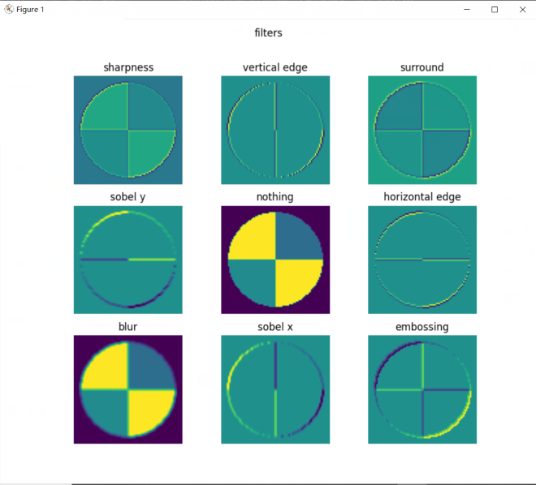
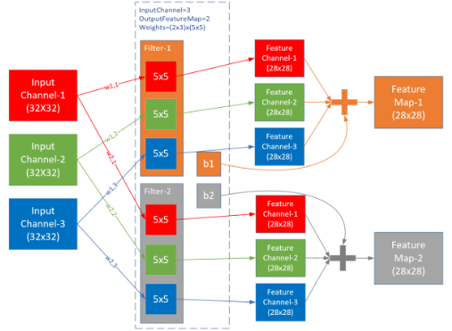
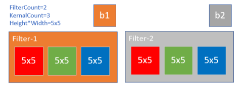
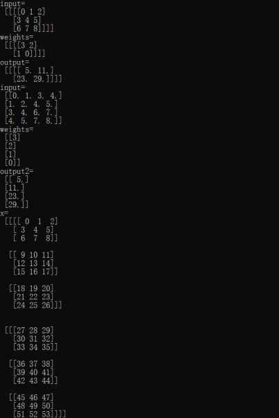
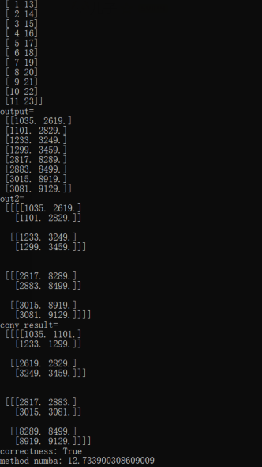
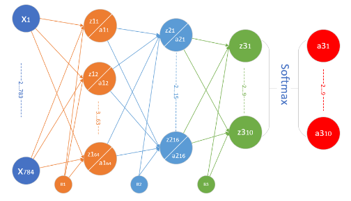
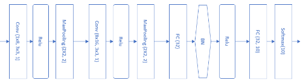
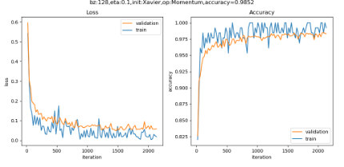

##  卷积神经网络的能力

卷积神经网络（CNN，Convolutional Neural Net)是神经网络的类型之一，在图像识别和分类领域中取得了非常好的效果，比如识别人脸、物体、交通标识等，这就为机器人、自动驾驶等应用提供了坚实的技术基础。

### 卷积神经网络的学习

可以看到在卷积-池化等一些列操作的后面，要接全连接层，这里的全连接层和我们在前面学习的深度网络的功能一模一样，都是做为分类层使用。

在最后一层的池化后面，把所有特征数据变成一个一维的全连接层，然后就和普通的深度全连接网络一样了，通过在最后一层的softmax分类函数，以及多分类交叉熵函数，对比图片的OneHot编码标签，回传误差值，从全连接层传回到池化层，通过激活函数层再回传给卷积层，对卷积核的数值进行梯度更新，实现卷积核数值的自我学习

- 平移不变性
  
  对于原始图A，平移后得到图B，对于同一个卷积核来说，都会得到相同的特征，这就是卷积核的权值共享。但是特征处于不同的位置，由于距离差距较大，即使经过多层池化后，也不能处于近似的位置。此时，后续的全连接层会通过权重值的调整，把这两个相同的特征看作同一类的分类标准之一。如果是小距离的平移，通过池化层就可以处理了。

- 旋转不变性

  对于原始图A，有小角度的旋转得到C，卷积层在A图上得到特征a，在C图上得到特征c，可以想象a与c的位置间的距离不是很远，在经过两层池化以后，基本可以重合。所以卷积网络对于小角度旋转是可以容忍的，但是对于较大的旋转，需要使用数据增强来增加训练样本。一个极端的例子是当6旋转90度时，谁也不能确定它到底是6还是9。

- 尺度不变性

  对于原始图A和缩小的图D，人类可以毫不费力地辨别出它们是同一个东西。池化在这里是不是有帮助呢？没有！因为神经网络对A做池化的同时，也会用相同的方法对D做池化，这样池化的次数一致，最终D还是比A小。如果我们有多个卷积视野，相当于从两米远的地方看图A，从一米远的地方看图D，那么A和D就可以很相近似了。这就是Inception的想法，用不同尺寸的卷积核去同时寻找同一张图片上的特征。





## 卷积的前向计算

### 卷积的数学定义

#### 连续定义

$$h(x)=(f*g)(x) = \int_{-\infty}^{\infty} f(t)g(x-t)dt $$

卷积与傅里叶变换有着密切的关系。利用这点性质，即两函数的傅里叶变换的乘积等于它们卷积后的傅里叶变换，能使傅里叶分析中许多问题的处理得到简化。

#### 离散定义

$$h(x) = (f*g)(x) = \sum^{\infty}_{t=-\infty} f(t)g(x-t) $$

### 一维卷积公式


符合卷积的定义，把它写成标准的形式就是下面的公式：

$$h(4)=(f*g)(4)=\sum _{t=1}^{3}f(t)g(4-t)$$

###  单入单出的二维卷积

二维卷积一般用于图像处理上。在二维图片上做卷积，如果把图像Image简写为$I$，把卷积核Kernal简写为$K$，则目标图片的第$(i,j)$个像素的卷积值为：

$$
h(i,j) = (I*K)(i,j)=\sum_m \sum_n I(m,n)K(i-m,j-n) \tag{3}
$$

可以看出，这和一维情况下的公式2是一致的。从卷积的可交换性，我们可以把公式3等价地写作：

$$
h(i,j) = (I*K)(i,j)=\sum_m \sum_n I(i-m,j-n)K(m,n) \tag{4}
$$

公式4的成立，是因为我们将Kernal进行了翻转。在神经网络中，一般会实现一个互相关函数(corresponding function)，而卷积运算几乎一样，但不反转Kernal：

$$
h(i,j) = (I*K)(i,j)=\sum_m \sum_n I(i+m,j+n)K(m,n) \tag{5}
$$

在图像处理中，自相关函数和互相关函数定义如下：

- 自相关：设原函数是f(t)，则$h=f(t) \star f(-t)$，其中$\star$表示卷积
- 互相关：设两个函数分别是f(t)和g(t)，则$h=f(t) \star g(-t)$

互相关函数的运算，是两个序列滑动相乘，两个序列都不翻转。卷积运算也是滑动相乘，但是其中一个序列需要先翻转，再相乘。所以，从数学意义上说，机器学习实现的是互相关函数，而不是原始含义上的卷积。但我们为了简化，把公式5也称作为卷积。这就是卷积的来源。

结论：

1. 我们实现的卷积操作不是原始数学含义的卷积，而是工程上的卷积，可以简称为卷积
2. 在实现卷积操作时，并不会反转卷积核

在传统的图像处理中，卷积操作多用来进行滤波，锐化或者边缘检测啥的。我们可以认为卷积是利用某些设计好的参数组合（卷积核）去提取图像空域上相邻的信息。

### 多入单出的降维卷积

一张图片，通常是彩色的，具有红绿蓝三个通道。可以有两个选择来处理：

1. 变成灰度的，每个像素只剩下一个值，就可以用二维卷积
2. 对于三个通道，每个通道都使用一个卷积核，分别处理红绿蓝三种颜色的信息

显然第2种方法可以从图中学习到更多的特征，于是出现了三维卷积，即有三个卷积核分别对应书的三个通道，三个子核的尺寸是一样的，比如都是2x2，这样的话，这三个卷积核就是一个3x2x2的立体核，称为过滤器Filter，所以称为三维卷积。

###  卷积编程模型

上图侧重于解释数值计算过程，而图17-16侧重于解释五个概念的关系：

- 输入 Input Channel
- 卷积核组 WeightsBias
- 过滤器 Filter
- 卷积核 kernal
- 输出 Feature Map


三通道经过两组过滤器的卷积过程

在此例中，输入是三维数据（3x32x32），经过2x3x5x5的卷积后，输出为三维（2x28x28），维数并没有变化，只是每一维内部的尺寸有了变化，一般都是要向更小的尺寸变化，以便于简化计算。

对于三维卷积，有以下特点：

1. 预先定义输出的feature map的数量，而不是根据前向计算自动计算出来，此例中为2，这样就会有两组WeightsBias
2. 对于每个输出，都有一个对应的过滤器Filter，此例中Feature Map-1对应Filter-1
3. 每个Filter内都有一个或多个卷积核Kernal，对应每个输入通道(Input Channel)，此例为3，对应输入的红绿蓝三个通道
4. 每个Filter只有一个Bias值，Filter-1对应b1，Filter-2对应b2
5. 卷积核Kernal的大小一般是奇数如：1x1, 3x3, 5x5, 7x7等，此例为5x5

对于上图，我们可以用在全连接神经网络中的学到的知识来理解：

1. 每个Input Channel就是特征输入，在上图中是3个
2. 卷积层的卷积核相当于隐层的神经元，上图中隐层有2个神经元
3. $W(m,n), m=[1,2], n=[1,3]$相当于隐层的权重矩阵$w_{11},w_{12},......$
4. 每个卷积核（神经元）有1个偏移值

## 卷积前向计算代码实现

###  卷积核的实现

卷积核，实际上和全连接层一样，是权重矩阵加偏移向量的组合，区别在于全连接层中的权重矩阵是二维的，偏移矩阵是列向量，而卷积核的权重矩阵是四维的，偏移矩阵是也是列向量。

```Python
class ConvWeightsBias(WeightsBias_2_1):
    def __init__(self, output_c, input_c, filter_h, filter_w, init_method, optimizer_name, eta):
        self.FilterCount = output_c
        self.KernalCount = input_c
        self.KernalHeight = filter_h
        self.KernalWidth = filter_w
        ...

    def Initialize(self, folder, name, create_new):
        self.WBShape = (self.FilterCount, self.KernalCount, self.KernalHeight, self.KernalWidth)        
        ...
```

卷积核的组成

以上图为例，各个维度的数值如下：

- FilterCount=2，第一维，过滤器数量，对应输出通道数。
- KernalCount=3，第二维，卷积核数量，对应输入通道数。两个Filter里面的Kernal数必须相同。
- KernalHeight=5，KernalWidth=5，卷积核的尺寸，第三维和第四维。同一组WeightsBias里的卷积核尺寸必须相同。

在初始化函数中，会根据四个参数定义`WBShape`，然后在`CreateNew`函数中，创建相应形状的`Weights`和`Bias`。

#### 四维数组的展开

前面只说明了二维数组的展开形式，四维数组可以用同样的方式展开。

我们假定有2个输入样本，每个样本含有3个通道，每个通道上是$3\times 3$的数据，则样本的原始形状和展开形状分别是：
```
x =
(样本1)                 [样本2]
    (通道1)                 (通道1)
 [[[[ 0  1  2]           [[[27 28 29]
   [ 3  4  5]              [30 31 32]
   [ 6  7  8]]             [33 34 35]]
    (通道2)                 (通道2)
  [[ 9 10 11]             [[36 37 38]
   [12 13 14]              [39 40 41]
   [15 16 17]]             [42 43 44]]
    (通道3)                 (通道3)
  [[18 19 20]             [[45 46 47]
   [21 22 23]              [48 49 50]
   [24 25 26]]]            [51 52 53]]]]
------------------------------------------   
col_x =
 [[0.  1.  3.  4.|  9. 10. 12. 13.| 18. 19. 21. 22.]
 [ 1.  2.  4.  5.| 10. 11. 13. 14.| 19. 20. 22. 23.]
 [ 3.  4.  6.  7.| 12. 13. 15. 16.| 21. 22. 24. 25.]
 [ 4.  5.  7.  8.| 13. 14. 16. 17.| 22. 23. 25. 26.]
 ----------------+----------------+----------------
 [27. 28. 30. 31.| 36. 37. 39. 40.| 45. 46. 48. 49.]
 [28. 29. 31. 32.| 37. 38. 40. 41.| 46. 47. 49. 50.]
 [30. 31. 33. 34.| 39. 40. 42. 43.| 48. 49. 51. 52.]
 [31. 32. 34. 35.| 40. 41. 43. 44.| 49. 50. 52. 53.]]
```

从生成的$8\times 12$的矩阵中可以观察到：

- 前4行是样本1的数据，后4行是样本2的数据
- 前4列是通道1的数据，中间4列是通道2的数据，后4列是通道3的数据

#### 权重数组的展开

对应的四维输入数据，卷积核权重数组也需要是四维的，其原始形状和展开后的形状如下：
```
weights=
(过滤器1)               (过滤器2)
    (卷积核1)               (卷积核1)
 [[[[ 0  1]             [[[12 13]
   [ 2  3]]               [14 15]]
    (卷积核2)               (卷积核2)
  [[ 4  5]               [[16 17]
   [ 6  7]]               [18 19]]
    (卷积核3)               (卷积核3)
  [[ 8  9]               [[20 21]
   [10 11]]]              [22 23]]]]
---------------------------------------
col_w=
 [[ 0 12]
  [ 1 13]
  [ 2 14]
  [ 3 15]
  [ 4 16]
  [ 5 17]
  [ 6 18]
  [ 7 19]
  [ 8 20]
  [ 9 21]
  [10 22]
  [11 23]]
```

至此，展开数组已经可以和权重数组做矩阵相乘了。

#### 结果数据的处理

原始数据展开成了$8\times 12$的矩阵，权重展开成了$12\times 2$的矩阵，所以最后的结果是$8\times 2$的矩阵：
```
[[1035.| 2619.]
 [1101.| 2829.]
 [1233.| 3249.]
 [1299.| 3459.]
 ------+-------
 [2817.| 8289.]
 [2883.| 8499.]
 [3015.| 8919.]
 [3081.| 9129.]]
```
这是两个样本的结果。如何把它拆开呢？是简单的左右分开就行了吗？这里要稍微动一下脑筋，推理一下：

1. 两个样本的原始数组x展开后的矩阵`col_x`是$8\times 12$，计算结果是$8\times 2$，如果原始数据只有一个样本，则展开矩阵`col_x`的形状是$4\times 12$，那么运算结果将会是$4\times 2$。所以，在上面这个$8\times 2$的矩阵中，前4行应该是第一个样本的卷积结果，后4行是第二个样本的卷积结果。
2. 如果输出通道只有一个，则权重矩阵`w`展开后的`col_w`只有一列，那么运算结果将会是$8\times 1$；两个输出通道的运算结果是$8\times 2$。所以第一列和第二列应该是两个通道的数据，而不是两个样本的数据。

也就是说，在这个数组中：

- 第1列的前4行是第1个样本的第1个通道的输出
- 第2列的前4行是第1个样本的第2个通道的输出
- 第1列的后4行是第2个样本的第1个通道的输出
- 第2列的后4行是第2个样本的第2个通道的输出

于是我们可以分两步得到正确的矩阵形状：

1. 先把数据变成2个样本 * 输出高度 * 输出宽度的形状：

```Python
out2 = output.reshape(batch_size, output_height, output_width, -1)
```

得到结果：

```
out2= 
[[[[1035. 2619.]
   [1101. 2829.]]
  [[1233. 3249.]
   [1299. 3459.]]]
 [[[2817. 8289.]
   [2883. 8499.]]
  [[3015. 8919.]
   [3081. 9129.]]]]
```

注意现在1035和2619在一个子矩阵中，这是不对的，因为它们应该属于两个通道，所以应该在两个子矩阵中。目前这个结果中的四维数据的顺序是：样本、行、列、通道。于是我们做第二步，把“通道”所在的第4维移到第2维，变成：样本、通道、行、列：

2. 把第4维数据放到第2维（由于是0-base的，所以是把第3维移到第1维的位置）：

```Python
out3 = np.transpose(out2, axes=(0, 3, 1, 2))
```

结果是：

```
conv result=
(样本1)                     (样本2)
    (通道1)                     (通道1)
 [[[[1035. 1101.]            [[[2817. 2883.]
   [1233. 1299.]]              [3015. 3081.]]
    (通道2)                     (通道2)
  [[2619. 2829.]              [[8289. 8499.]
   [3249. 3459.]]]             [8919. 9129.]]]]
```

#### 验证正确性

可以用方法1做为基准，如果用本节中的方法3可以得到同样的结果，就说明这种方式是正确的。

```Python
def test_4d_im2col():
    ......
    f1 = c1.forward_numba(x)
    f2 = c1.forward_img2col(x)
    print("correctness:", np.allclose(f1, f2, atol=1e-7))
```
得到的结果是：
```
correctness: True
```
上面的代码，首先生成了一个`ConvLayer`实例，然后分别调用内部实现的`forward_numba()`方法和`forward_img2col()`方法，得到`f1`和`f2`两个卷积结果矩阵，然后比较其数值，最后的返回值为`True`，说明`im2col`方法的正确性。

#### 性能测试

下面我们比较两种方法的性能。

```Python
def test_performance():
    ...
    print("compare correctness of method 1 and method 2:")
    print("forward:", np.allclose(f1, f2, atol=1e-7))
```

上述代码先生成一个`ConvLayer`实例，然后分别调用1000次`forward_numba()`方法和1000次`forward_img2col()`方法，最后得到的结果是：

```
method numba: 11.663846492767334
method img2col: 14.926148653030396
compare correctness of method 1 and method 2:
forward: True
```

`numba`方法会比`im2col`方法快3秒，目前看来`numba`方法稍占优势。但是如果没有`numba`的帮助，`im2col`方法会比方法1快几百倍。





## 卷积层的训练

同全连接层一样，卷积层的训练也需要从上一层回传的误差矩阵，然后计算：

1. 本层的权重矩阵的误差项
2. 本层的需要回传到下一层的误差矩阵

在下面的描述中，我们假设已经得到了从上一层回传的误差矩阵，并且已经经过了激活函数的反向传导。

##  解决MNIST分类问题

###  模型搭建

用一个三层的神经网络解决MNIST问题，并得到了97.49%的准确率。当时使用的模型如下图。


前馈神经网络模型解决MNIST问题

这一节中，我们将学习如何使用卷积网络来解决MNIST问题。首先搭建模型如下图


卷积神经网络模型解决MNIST问题

来展示了模型中各层的功能和参数。

下表是模型中各层的功能和参数

|Layer|参数|输入|输出|参数个数|
|---|---|---|---|---|
|卷积层|8x5x5,s=1|1x28x28|8x24x24|200+8|
|激活层|2x2,s=2, max|8x24x24|8x24x24||
|池化层|Relu|8x24x24|8x12x12||
|卷积层|16x5x5,s=1|8x12x12|16x8x8|400+16|
|激活层|Relu|16x8x8|16x8x8||
|池化层|2x2, s=2, max|16x8x8|16x4x4||
|全连接层|256x32|256|32|8192+32|
|批归一化层||32|32||
|激活层|Relu|32|32||
|全连接层|32x10|32|10|320+10|
|分类层|softmax,10|10|10|

卷积核的大小如何选取呢？大部分卷积神经网络都会用1、3、5、7的方式递增，还要注意在做池化时，应该尽量让输入的矩阵尺寸是偶数，如果不是的话，应该在上一层卷积层加padding，使得卷积的输出结果矩阵的宽和高为偶数。

###  代码实现

```Python
def model():
    num_output = 10
    dataReader = LoadData(num_output)

    max_epoch = 5
    batch_size = 128
    learning_rate = 0.1
    params = HyperParameters_4_2(
        learning_rate, max_epoch, batch_size,
        net_type=NetType.MultipleClassifier,
        init_method=InitialMethod.Xavier,
        optimizer_name=OptimizerName.Momentum)

    net = NeuralNet_4_2(params, "mnist_conv_test")
    
    c1 = ConvLayer((1,28,28), (8,5,5), (1,0), params)
    net.add_layer(c1, "c1")
    r1 = ActivationLayer(Relu())
    net.add_layer(r1, "relu1")
    p1 = PoolingLayer(c1.output_shape, (2,2), 2, PoolingTypes.MAX)
    net.add_layer(p1, "p1") 
  
    c2 = ConvLayer(p1.output_shape, (16,5,5), (1,0), params)
    net.add_layer(c2, "23")
    r2 = ActivationLayer(Relu())
    net.add_layer(r2, "relu2")
    p2 = PoolingLayer(c2.output_shape, (2,2), 2, PoolingTypes.MAX)
    net.add_layer(p2, "p2")  

    f3 = FcLayer_2_0(p2.output_size, 32, params)
    net.add_layer(f3, "f3")
    bn3 = BnLayer(f3.output_size)
    net.add_layer(bn3, "bn3")
    r3 = ActivationLayer(Relu())
    net.add_layer(r3, "relu3")

    f4 = FcLayer_2_0(f3.output_size, 10, params)
    net.add_layer(f4, "f2")
    s4 = ClassificationLayer(Softmax())
    net.add_layer(s4, "s4")

    net.train(dataReader, checkpoint=0.05, need_test=True)
    net.ShowLossHistory(XCoordinate.Iteration)
```

###  运行结果

训练5个epoch后的损失函数值和准确率的历史记录曲线如图18-33。


训练过程中损失函数值和准确度的变化

打印输出结果如下：

```
...
epoch=4, total_iteration=2133
loss_train=0.054449, accuracy_train=0.984375
loss_valid=0.060550, accuracy_valid=0.982000
save parameters
time used: 513.3446323871613
testing...
0.9865
```

最后可以得到98.65%的准确率，比全连接网络要高1个百分点。如果想进一步提高准确率，可以尝试增加卷积层的能力，比如使用更多的卷积核来提取更多的特征。

###  可视化

#### 第一组的卷积可视化

下图按行显示了以下内容：

1. 卷积核数值
2. 卷积核抽象
3. 卷积结果
4. 激活结果
5. 池化结果


卷积核是5x5的，一共8个卷积核，所以第一行直接展示了卷积核的数值图形化以后的结果，但是由于色块太大，不容易看清楚其具体的模式，那么第二行的模式是如何抽象出来的呢？

因为特征是未知的，所以卷积神经网络不可能学习出类似下面的两个矩阵中左侧矩阵的整齐的数值，而很可能是如同右侧的矩阵一样具有很多噪音，但是大致轮廓还是个左上到右下的三角形，只是一些局部点上有一些值的波动。

```
2  2  1  1  0               2  0  1  1  0
2  1  1  0  0               2  1  1  2  0
1  1  0 -1 -2               0  1  0 -1 -2
1  0 -1 -2 -3               1 -1  1 -4 -3
0 -1 -2 -3 -4               0 -1 -2 -3 -2
```

如何“看”出一个大概符合某个规律的模板呢？对此，笔者的心得是：

1. 摘掉眼镜（或者眯起眼睛）看第一行的卷积核的明暗变化模式；
2. 也可以用图像处理的办法，把卷积核形成的5x5的点阵做一个模糊处理；
3. 结合第三行的卷积结果推想卷积核的行为。

由此可以得到下表的模式。

下表是卷积核的抽象模式

|卷积核序号|1|2|3|4|5|6|7|8|
|:--:|:--:|:--:|:--:|:--:|:--:|:--:|:--:|:--:|
|抽象模式|右斜|下|中心|竖中|左下|上|右|左上|

这些模式实际上就是特征，是卷积网络自己学习出来的，每一个卷积核关注图像的一个特征，比如上部边缘、下部边缘、左下边缘、右下边缘等。这些特征的排列有什么顺序吗？没有。每一次重新训练后，特征可能会变成其它几种组合，顺序也会发生改变，这取决于初始化数值及样本顺序、批大小等等因素。

当然可以用更高级的图像处理算法，对5x5的图像进行模糊处理，再从中提取模式。

##  Cifar-10分类

Cifar 是加拿大政府牵头投资的一个先进科学项目研究所。Hinton、Bengio和他的学生在2004年拿到了 Cifar 投资的少量资金，建立了神经计算和自适应感知项目。这个项目结集了不少计算机科学家、生物学家、电气工程师、神经科学家、物理学家、心理学家，加速推动了 Deep Learning 的进程。从这个阵容来看，DL 已经和 ML 系的数据挖掘分的很远了。Deep Learning 强调的是自适应感知和人工智能，是计算机与神经科学交叉；Data Mining 强调的是高速、大数据、统计数学分析，是计算机和数学的交叉。

Cifar-10 是由 Hinton 的学生 Alex Krizhevsky、Ilya Sutskever 收集的一个用于普适物体识别的数据集。

###  环境搭建

我们将使用Keras$^{[1]}$来训练模型，因为Keras是一个在TensorFlow平台上经过抽象的工具，它的抽象思想与我们在前面学习过的各种Layer的概念完全一致，有利于读者在前面的基础上轻松地继续学习。环境搭建有很多细节，我们在这里不详细介绍，只是把基本步骤列出。

1. 安装Python 3.6（本书中所有案例在Python 3.6上开发测试）
2. 安装CUDA（没有GPU的读者请跳过）
3. 安装cuDNN（没有GPU的读者请跳过）
4. 安装TensorFlow，有GPU硬件的一定要按照GPU版，没有的只能安装CPU版
5. 安装Keras

安装好后用pip list看一下，关键的几个包是：

```
Package              Version
-------------------- ---------
Keras                2.2.5
Keras-Applications   1.0.8
Keras-Preprocessing  1.1.0
matplotlib           3.1.1
numpy                1.17.0
tensorboard          1.13.1
tensorflow-estimator 1.13.0
tensorflow-gpu       1.13.1
```

如果没有GPU，则"tensorflow-gpu"一项会是"tensorflow"。

###  代码实现

```Python
batch_size = 32
num_classes = 10
epochs = 25
data_augmentation = True
num_predictions = 20
save_dir = os.path.join(os.getcwd(), 'saved_models')
model_name = 'keras_cifar10_trained_model.h5'

# The data, split between train and test sets:
(x_train, y_train), (x_test, y_test) = cifar10.load_data()
print('x_train shape:', x_train.shape)
print(x_train.shape[0], 'train samples')
print(x_test.shape[0], 'test samples')

# Convert class vectors to binary class matrices.
y_train = keras.utils.to_categorical(y_train, num_classes)
y_test = keras.utils.to_categorical(y_test, num_classes)

model = Sequential()
model.add(Conv2D(32, (3, 3), padding='same',
                 input_shape=x_train.shape[1:]))
model.add(Activation('relu'))
model.add(Conv2D(32, (3, 3)))
model.add(Activation('relu'))
model.add(MaxPooling2D(pool_size=(2, 2)))
model.add(Dropout(0.25))

model.add(Conv2D(64, (3, 3), padding='same'))
model.add(Activation('relu'))
model.add(Conv2D(64, (3, 3)))
model.add(Activation('relu'))
model.add(MaxPooling2D(pool_size=(2, 2)))
model.add(Dropout(0.25))

model.add(Flatten())
model.add(Dense(512))
model.add(Activation('relu'))
model.add(Dropout(0.5))
model.add(Dense(num_classes))
model.add(Activation('softmax'))

# initiate RMSprop optimizer
opt = keras.optimizers.rmsprop(lr=0.0001, decay=1e-6)

# Let's train the model using RMSprop
model.compile(loss='categorical_crossentropy',
              optimizer=opt,
              metrics=['accuracy'])

x_train = x_train.astype('float32')
x_test = x_test.astype('float32')
x_train /= 255
x_test /= 255

if not data_augmentation:
    print('Not using data augmentation.')
    model.fit(x_train, y_train,
              batch_size=batch_size,
              epochs=epochs,
              validation_data=(x_test, y_test),
              shuffle=True)
else:
    ...
```

在这个模型中：

1. 先用卷积->激活->卷积->激活->池化->丢弃层，做为第一梯队，卷积核32个；
2. 然后再用卷积->激活->卷积->激活->池化->丢弃层做为第二梯队，卷积核64个；
3. Flatten和Dense相当于把池化的结果转成Nx512的全连接层，N是池化输出的尺寸，被Flatten扁平化了；
4. 再接丢弃层，避免过拟合；
5. 最后接10个神经元的全连接层加Softmax输出。

为什么每一个梯队都要接一个DropOut层呢？因为这个网络结果设计已经比较复杂了，对于这个问题来说很可能会过拟合，所以要避免过拟合。如果简化网络结构，又可能会造成训练时间过长而不收敛。


### 总结
- 数据的预处理
主要作用就是将整个图像数据化为统一格式的、特征信息规范的数据。主要操作为去均值、归一化。
- 卷积层
主要作用是提取特征信息，并将特征信息映射至更高维度。一般设置多个卷积核（33或55的参数矩阵），让卷积核在一定步距下以滑动的方式与图像的每一部分做内积，并最终将内积后的值取和后加上偏置b。其中深度即是神经元的数量、卷积核的数量，每个卷积核代表一种纹理特征的提取方法，不同的卷积核只关注其特有的特征信息。在卷积核滑动的过程中为了使整个过程正常进行，会采用在原图像矩阵外再加一层填充值的方法。再者，为了防止滑动过程中某些边缘值结果不平滑，会使得滑动窗口在滑动前后有一定重叠的部分。
- 池化层
作用是将整个卷积后的数据降维，相当于图像压缩，图像缩小，可以去除整个图像中很多冗余特征信息，降低计算量的同时防止过拟合。
- 激励函数
将卷积层的输出结果做非线性变换，例如sigmoid函数是将整个输出结果映射到0-1之间。
- 全连接层
即为传统神经网络层的连接方式。