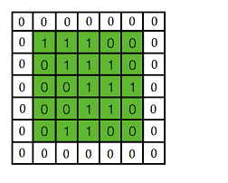
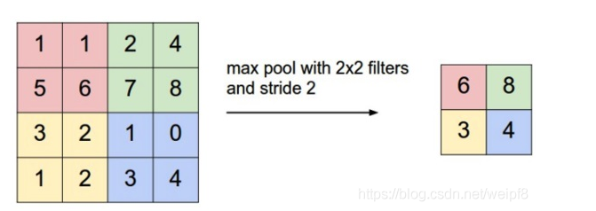
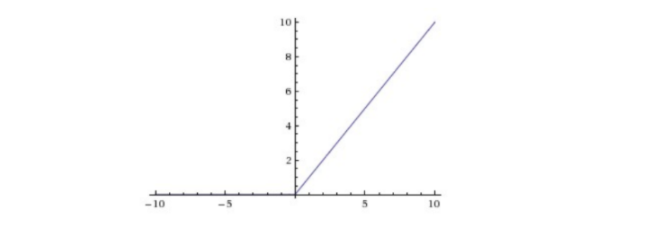
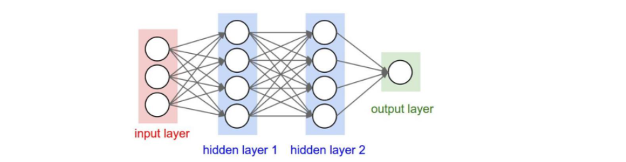

# 学习笔记

# 第四次作业 CNN

# 卷积神经网络

## CNN 概述

卷积神经网络（CNN，Convolutional Neural Net)是神经网络的类型之一，在图像识别和分类领域中取得了非常好的效果，比如识别人脸、物体、交通标识等，这就为机器人、自动驾驶等应用提供了坚实的技术基础。

卷积神经网络是一种前馈型神经网络, 受生物自然视觉认知机制启发而来的。现在, CNN 已经成为众多科学领域的研究热点之一, 特别是在模式分类领域, 由于该网络避免了对图像的复杂前期预处理, 可以直接输入原始图像, 因而得到了更为广泛的应用。可应用于图像分类, 目标识别, 目标检测, 语义分割等等。

深度学习是一种特殊的机器学习，通过学习将世界使用嵌套的概念层次来表示并实现巨大的功能和灵活性，其中每个概念都定义为与简单概念相关联，而更为抽象的表示则以较不抽象的方式来计算。

## CNN 结构介绍

第一层输入图片, 进行卷积(Convolution)操作, 得到第二层深度为 3 的特征图(Feature Map). 对第二层的特征图进行池化(Pooling)操作, 得到第三层深度为 3 的特征图. 重复上述操作得到第五层深度为 5 的特征图, 最后将这 5 个特征图, 也就是 5 个矩阵, 按行展开连接成向量, 传入全连接(Fully Connected)层, 全连接层就是一个 BP 神经网络. 图中的每个特征图都可以看成是排列成矩阵形式的神经元, 与 BP神经网络中的神经元大同小异. 下面是卷积和池化的计算过程。


### 卷积

对于一张输入图片, 将其转化为矩阵, 矩阵的元素为对应的像素值. 假设有一个 5 × 5 5 \times 55×5 的图像，使用一个 3 × 3 3 \times 33×3 的卷积核进行卷积，可得到一个 3 × 3 3 \times 33×3 的特征图. 卷积核也称为滤波器(Filter)。


具体的操作过程如下图所示:


黄色的区域表示卷积核在输入矩阵中滑动, 每滑动到一个位置, 将对应数字相乘并求和, 得到一个特征图矩阵的元素. 注意到, 动图中卷积核每次滑动了一个单位, 实际上滑动的幅度可以根据需要进行调整. 如果滑动步幅大于 1, 则卷积核有可能无法恰好滑到边缘, 针对这种情况, 可在矩阵最外层补零, 补一层零后的矩阵如下图所示:



可根据需要设定补零的层数. 补零层称为 Zero Padding, 是一个可以设置的超参数, 但要根据卷积核的大小, 步幅, 输入矩阵的大小进行调整, 以使得卷积核恰好滑动到边缘.

一般情况下, 输入的图片矩阵以及后面的卷积核, 特征图矩阵都是方阵, 这里设输入矩阵大小为 w ww, 卷积核大小为 k kk, 步幅为 s ss, 补零层数为 p pp, 则卷积后产生的特征图大小计算公式为:


上图是对一个特征图采用一个卷积核卷积的过程, 为了提取更多的特征, 可以采用多个卷积核分别进行卷积, 这样便可以得到多个特征图. 有时, 对于一张三通道彩色图片, 或者如第三层特征图所示, 输入的是一组矩阵, 这时卷积核也不再是一层的, 而要变成相应的深度。


上图中, 最左边是输入的特征图矩阵, 深度为 3, 补零(Zero Padding)层数为 1, 每次滑动的步幅为 2. 中间两列粉色的矩阵分别是两组卷积核, 一组有三个, 三个矩阵分别对应着卷积左侧三个输入矩阵, 每一次滑动卷积会得到三个数, 这三个数的和作为卷积的输出. 最右侧两个绿色的矩阵分别是两组卷积核得到的特征图。

### 池化

池化又叫下采样(Dwon sampling), 与之相对的是上采样(Up sampling). 卷积得到的特征图一般需要一个池化层以降低数据量. 池化的操作如下图所示:



和卷积一样, 池化也有一个滑动的核, 可以称之为滑动窗口, 上图中滑动窗口的大小为 2 × 2 2\times 22×2, 步幅为 2 22, 每滑动到一个区域, 则取最大值作为输出, 这样的操作称为 Max Pooling. 还可以采用输出均值的方式, 称为 Mean Pooling。

### 全连接 

经过若干层的卷积, 池化操作后, 将得到的特征图依次按行展开, 连接成向量, 输入全连接网络.

##  卷积的前向计算

###  卷积的数学定义

#### 连续定义

$$h(x)=(f*g)(x) = \int_{-\infty}^{\infty} f(t)g(x-t)dt \tag{1}$$

卷积与傅里叶变换有着密切的关系。利用这点性质，即两函数的傅里叶变换的乘积等于它们卷积后的傅里叶变换，能使傅里叶分析中许多问题的处理得到简化。

#### 离散定义

$$h(x) = (f*g)(x) = \sum^{\infty}_{t=-\infty} f(t)g(x-t) \tag{2}$$

###  一维卷积实例

有两枚骰子$f,g$，掷出后二者相加为4的概率如何计算？

第一种情况：$f(1)g(3), 3+1=4$，如图17-9所示。


图17-9 第一种情况

第二种情况：$f(2)g(2), 2+2=4$，如图17-10所示。


图17-10 第二种情况

第三种情况：$f(3)g(1), 1+3=4$，如图17-11所示。


图17-11 第三种情况

因此，两枚骰子点数加起来为4的概率为：

$$
\begin{aligned}
h(4) &= f(1)g(3)+f(2)g(2)+f(3)g(1) \\\\
&=f(1)g(4-1) + f(2)g(4-2) + f(3)g(4-3)
\end{aligned}
$$

符合卷积的定义，把它写成标准的形式就是公式2：

$$h(4)=(f*g)(4)=\sum _{t=1}^{3}f(t)g(4-t)$$

###  单入单出的二维卷积

二维卷积一般用于图像处理上。在二维图片上做卷积，如果把图像Image简写为$I$，把卷积核Kernal简写为$K$，则目标图片的第$(i,j)$个像素的卷积值为：

$$
h(i,j) = (I*K)(i,j)=\sum_m \sum_n I(m,n)K(i-m,j-n) \tag{3}
$$

可以看出，这和一维情况下的公式2是一致的。从卷积的可交换性，我们可以把公式3等价地写作：

$$
h(i,j) = (I*K)(i,j)=\sum_m \sum_n I(i-m,j-n)K(m,n) \tag{4}
$$

公式4的成立，是因为我们将Kernal进行了翻转。在神经网络中，一般会实现一个互相关函数(corresponding function)，而卷积运算几乎一样，但不反转Kernal：

$$
h(i,j) = (I*K)(i,j)=\sum_m \sum_n I(i+m,j+n)K(m,n) \tag{5}
$$

在图像处理中，自相关函数和互相关函数定义如下：

- 自相关：设原函数是f(t)，则$h=f(t) \star f(-t)$，其中$\star$表示卷积
- 互相关：设两个函数分别是f(t)和g(t)，则$h=f(t) \star g(-t)$

互相关函数的运算，是两个序列滑动相乘，两个序列都不翻转。卷积运算也是滑动相乘，但是其中一个序列需要先翻转，再相乘。所以，从数学意义上说，机器学习实现的是互相关函数，而不是原始含义上的卷积。但我们为了简化，把公式5也称作为卷积。这就是卷积的来源。

结论：

1. 我们实现的卷积操作不是原始数学含义的卷积，而是工程上的卷积，可以简称为卷积
2. 在实现卷积操作时，并不会反转卷积核

###  单入多出的升维卷积

原始输入是一维的图片，但是我们可以用多个卷积核分别对其计算，从而得到多个特征输出。如图17-13所示。


图17-13 单入多出的升维卷积

一张4x4的图片，用两个卷积核并行地处理，输出为2个2x2的图片。在训练过程中，这两个卷积核会完成不同的特征学习。

###  多入单出的降维卷积

一张图片，通常是彩色的，具有红绿蓝三个通道。我们可以有两个选择来处理：

1. 变成灰度的，每个像素只剩下一个值，就可以用二维卷积
2. 对于三个通道，每个通道都使用一个卷积核，分别处理红绿蓝三种颜色的信息

显然第2种方法可以从图中学习到更多的特征，于是出现了三维卷积，即有三个卷积核分别对应书的三个通道，三个子核的尺寸是一样的，比如都是2x2，这样的话，这三个卷积核就是一个3x2x2的立体核，称为过滤器Filter，所以称为三维卷积。


图17-14 多入单出的降维卷积

在上图中，每一个卷积核对应着左侧相同颜色的输入通道，三个过滤器的值并不一定相同。对三个通道各自做卷积后，得到右侧的三张特征图，然后再按照原始值不加权地相加在一起，得到最右侧的白色特征图，这张图里面已经把三种颜色的特征混在一起了，所以画成了白色，表示没有颜色特征了。

虽然输入图片是多个通道的，或者说是三维的，但是在相同数量的过滤器的计算后，相加在一起的结果是一个通道，即2维数据，所以称为降维。这当然简化了对多通道数据的计算难度，但同时也会损失多通道数据自带的颜色信息。

###  多入多出的同维卷积

在上面的例子中，是一个过滤器Filter内含三个卷积核Kernal。我们假设有一个彩色图片为3x3的，如果有两组3x2x2的卷积核的话，会做什么样的卷积计算？看图17-15。


图17-15 多入多出的卷积运算

第一个过滤器Filter-1为棕色所示，它有三卷积核(Kernal)，命名为Kernal-1，Keanrl-2，Kernal-3，分别在红绿蓝三个输入通道上进行卷积操作，生成三个2x2的输出Feature-1,n。然后三个Feature-1,n相加，并再加上b1偏移值，形成最后的棕色输出Result-1。

对于灰色的过滤器Filter-2也是一样，先生成三个Feature-2,n，然后相加再加b2，最后得到Result-2。

之所以Feature-m,n还用红绿蓝三色表示，是因为在此时，它们还保留着红绿蓝三种色彩的各自的信息，一旦相加后得到Result，这种信息就丢失了。

###  卷积编程模型

上图侧重于解释数值计算过程，而图17-16侧重于解释五个概念的关系：

- 输入 Input Channel
- 卷积核组 WeightsBias
- 过滤器 Filter
- 卷积核 kernal
- 输出 Feature Map


图17-16 三通道经过两组过滤器的卷积过程

在此例中，输入是三维数据（3x32x32），经过2x3x5x5的卷积后，输出为三维（2x28x28），维数并没有变化，只是每一维内部的尺寸有了变化，一般都是要向更小的尺寸变化，以便于简化计算。

对于三维卷积，有以下特点：

1. 预先定义输出的feature map的数量，而不是根据前向计算自动计算出来，此例中为2，这样就会有两组WeightsBias
2. 对于每个输出，都有一个对应的过滤器Filter，此例中Feature Map-1对应Filter-1
3. 每个Filter内都有一个或多个卷积核Kernal，对应每个输入通道(Input Channel)，此例为3，对应输入的红绿蓝三个通道
4. 每个Filter只有一个Bias值，Filter-1对应b1，Filter-2对应b2
5. 卷积核Kernal的大小一般是奇数如：1x1, 3x3, 5x5, 7x7等，此例为5x5

对于上图，我们可以用在全连接神经网络中的学到的知识来理解：

1. 每个Input Channel就是特征输入，在上图中是3个
2. 卷积层的卷积核相当于隐层的神经元，上图中隐层有2个神经元
3. $W(m,n), m=[1,2], n=[1,3]$相当于隐层的权重矩阵$w_{11},w_{12},......$
4. 每个卷积核（神经元）有1个偏移值

###  步长 stride

前面的例子中，每次计算后，卷积核会向右或者向下移动一个单元，即步长stride = 1。而在图17-17这个卷积操作中，卷积核每次向右或向下移动两个单元，即stride = 2。


图17-17 步长为2的卷积

在后续的步骤中，由于每次移动两格，所以最终得到一个2x2的图片。

###  填充 padding

如果原始图为4x4，用3x3的卷积核进行卷积后，目标图片变成了2x2。如果我们想保持目标图片和原始图片为同样大小，该怎么办呢？一般我们会向原始图片周围填充一圈0，然后再做卷积。如图17-18。


图17-18 带填充的卷积

### 输出结果

综合以上所有情况，可以得到卷积后的输出图片的大小的公式：

$$
H_{Output}= {H_{Input} - H_{Kernal} + 2Padding \over Stride} + 1
$$

$$
W_{Output}= {W_{Input} - W_{Kernal} + 2Padding \over Stride} + 1
$$

以图17-17为例：

$$H_{Output}={5 - 3 + 2 \times 0 \over 2}+1=2$$

以图17-18为例：

$$H_{Output}={4 - 3 + 2 \times 1 \over 1}+1=4$$

两点注意：

1. 一般情况下，我们用正方形的卷积核，且为奇数
2. 如果计算出的输出图片尺寸为小数，则取整，不做四舍五入

## 代码实现流程图


## 代码实现

### 卷积核

卷积核，实际上和全连接层一样，是权重矩阵加偏移向量的组合，区别在于全连接层中的权重矩阵是二维的，偏移矩阵是列向量，而卷积核的权重矩阵是四维的，偏移矩阵是也是列向量。

```Python
class ConvWeightsBias(WeightsBias_2_1):
    def __init__(self, output_c, input_c, filter_h, filter_w, init_method, optimizer_name, eta):
        self.FilterCount = output_c
        self.KernalCount = input_c
        self.KernalHeight = filter_h
        self.KernalWidth = filter_w
        ...

    def Initialize(self, folder, name, create_new):
        self.WBShape = (self.FilterCount, self.KernalCount, self.KernalHeight, self.KernalWidth)        
        ...
```


###  卷积前向运算的实现 
```Python
class ConvLayer(CLayer):
    def forward(self, x, train=True):
        self.x = x
        self.batch_size = self.x.shape[0]
        # 如果有必要的话，先对输入矩阵做padding
        if self.padding > 0:
            self.padded = np.pad(...)
        else:
            self.padded = self.x
        #end if
        self.z = conv_4d(...)
        return self.z
```

上述代码中的`conv_4d()`函数实现了17.1中定义的四维卷积运算：

```Python
def conv_4d(x, weights, bias, out_h, out_w, stride=1):
    batch_size = x.shape[0]
    input_channel = x.shape[1]
    output_channel = weights.shape[0]
    filter_height = weights.shape[2]
    filter_width = weights.shape[3]
    rs = np.zeros((batch_size, num_output_channel, out_h, out_w))

    for bs in range(batch_size):
        for oc in range(output_channel):
            rs[bs,oc] += bias[oc]
            for ic in range(input_channel):
                for i in range(out_h):
                    for j in range(out_w):
                        ii = i * stride
                        jj = j * stride
                        for fh in range(filter_height):
                            for fw in range(filter_width):
                                rs[bs,oc,i,j] += x[bs,ic,fh+ii,fw+jj] * weights[oc,ic,fh,fw]
```

## 池化层的训练

我们假设图17-34中，$[[1,2],[3,4]]$是上一层网络回传的残差，那么：

- 对于最大值池化，残差值会回传到当初最大值的位置上，而其它三个位置的残差都是0。
- 对于平均值池化，残差值会平均到原始的4个位置上。


图17-34 平均池化与最大池化


图17-35 池化层反向传播的示例

#### Max Pooling

严格的数学推导过程以图17-35为例进行。

正向公式：

$$
w = max(a,b,e,f)
$$

反向公式（假设Input Layer中的最大值是b）：

$$
{\partial w \over \partial a} = 0, \quad {\partial w \over \partial b} = 1
$$

$$
{\partial w \over \partial e} = 0, \quad {\partial w \over \partial f} = 0
$$

因为a,e,f对w都没有贡献，所以偏导数为0，只有b有贡献，偏导数为1。

$$
\delta_a = {\partial J \over \partial a} = {\partial J \over \partial w} {\partial w \over \partial a} = 0
$$

$$
\delta_b = {\partial J \over \partial b} = {\partial J \over \partial w} {\partial w \over \partial b} = \delta_w \cdot 1 = \delta_w
$$

$$
\delta_e = {\partial J \over \partial e} = {\partial J \over \partial w} {\partial w \over \partial e} = 0
$$

$$
\delta_f = {\partial J \over \partial f} = {\partial J \over \partial w} {\partial w \over \partial f} = 0
$$

#### Mean Pooling

正向公式：

$$w = \frac{1}{4}(a+b+e+f)$$

反向公式（假设Layer-1中的最大值是b）：

$$
{\partial w \over \partial a} = \frac{1}{4}, \quad {\partial w \over \partial b} = \frac{1}{4}
$$

$$
{\partial w \over \partial e} = \frac{1}{4}, \quad {\partial w \over \partial f} = \frac{1}{4}
$$

因为a,b,e,f对w都有贡献，所以偏导数都为1：

$$
\delta_a = {\partial J \over \partial a} = {\partial J \over \partial w} {\partial w \over \partial a} = \frac{1}{4}\delta_w
$$

$$
\delta_b = {\partial J \over \partial b} = {\partial J \over \partial w} {\partial w \over \partial b} = \frac{1}{4}\delta_w
$$

$$
\delta_e = {\partial J \over \partial e} = {\partial J \over \partial w} {\partial w \over \partial e} = \frac{1}{4}\delta_w
$$

$$
\delta_f = {\partial J \over \partial f} = {\partial J \over \partial w} {\partial w \over \partial f} = \frac{1}{4}\delta_w
$$

无论是max pooling还是mean pooling，都没有要学习的参数，所以，在卷积网络的训练中，池化层需要做的只是把误差项向后传递，不需要计算任何梯度。

###  实现方法

按照标准公式来实现池化的正向和反向代码。

```Python
class PoolingLayer(CLayer):
    def forward_numba(self, x, train=True):
        ......

    def backward_numba(self, delta_in, layer_idx):
        ......
```

有了前面的经验，这次我们直接把前向和反向函数用numba方式来实现，并在前面加上@nb.jit修饰符：
```Python
@nb.jit(nopython=True)
def jit_maxpool_forward(...):
    ...
    return z

@nb.jit(nopython=True)
def jit_maxpool_backward(...):
    ...
    return delta_out
```

## 学习总结

**卷积神经网络的层级结构**

- 数据输入层/ Input layer
- 卷积计算层/ CONV layer
- ReLU激励层 / ReLU layer
- 池化层 / Pooling layer
- 全连接层 / FC layer

**1.数据输入层**

该层要做的处理主要是对原始图像数据进行预处理，其中包括：
　　• 去均值：把输入数据各个维度都中心化为0，如下图所示，其目的就是把样本的中心拉回到坐标系原点上。
　　• 归一化：幅度归一化到同样的范围，如下所示，即减少各维度数据取值范围的差异而带来的干扰，比如，我们有两个维度的特征A和B，A范围是0到10，而B范围是0到10000，如果直接使用这两个特征是有问题的，好的做法就是归一化，即A和B的数据都变为0到1的范围。
　　• PCA/白化：用PCA降维；白化是对数据各个特征轴上的幅度归一化

**2.卷积计算层**

这一层就是卷积神经网络最重要的一个层次，也是“卷积神经网络”的名字来源。
在这个卷积层，有两个关键操作：
　　• 局部关联。每个神经元看做一个滤波器(filter)
　　• 窗口(receptive field)滑动， filter对局部数据计算

**3.激励层**

把卷积层输出结果做非线性映射。

CNN采用的激励函数一般为ReLU(The Rectified Linear Unit/修正线性单元)，它的特点是收敛快，求梯度简单，但较脆弱，图像如下。



**4.池化层**

池化层夹在连续的卷积层中间， 用于压缩数据和参数的量，减小过拟合。
简而言之，如果输入是图像的话，那么池化层的最主要作用就是压缩图像。

 

这里再展开叙述池化层的具体作用。

1. 特征不变性，也就是我们在图像处理中经常提到的特征的尺度不变性，池化操作就是图像的resize，平时一张狗的图像被缩小了一倍我们还能认出这是一张狗的照片，这说明这张图像中仍保留着狗最重要的特征，我们一看就能判断图像中画的是一只狗，图像压缩时去掉的信息只是一些无关紧要的信息，而留下的信息则是具有尺度不变性的特征，是最能表达图像的特征。

2. 特征降维，我们知道一幅图像含有的信息是很大的，特征也很多，但是有些信息对于我们做图像任务时没有太多用途或者有重复，我们可以把这类冗余信息去除，把最重要的特征抽取出来，这也是池化操作的一大作用。

3. 在一定程度上防止过拟合，更方便优化。

**5.全连接层**

两层之间所有神经元都有权重连接，通常全连接层在卷积神经网络尾部。也就是跟传统的神经网络神经元的连接方式是一样的：



### 问题反馈

  **为什么不用BP神经网络去做呢？**

1.全连接，权值太多，需要很多样本去训练，计算困难
　　• 应对之道：减少权值的尝试，局部连接，权值共享

　　卷积神经网络有两种神器可以降低参数数目。
　　第一种神器叫做局部感知野，一般认为人对外界的认知是从局部到全局的，而图像的空间联系也是局部的像素联系较为紧密，而距离较远的像素相关性则较弱。因而，每个神经元其实没有必要对全局图像进行感知，只需要对局部进行感知，然后在更高层将局部的信息综合起来就得到了全局的信息。
　　第二级神器，即权值共享

2.边缘过渡不平滑
　　• 应对之道：采样窗口彼此重叠

### 内容总结

卷积网络在本质上是一种输入到输出的映射，它能够学习大量的输入与输出之间的映射关系，而不需要任何输入和输出之间的精确的数学表达式，只要用已知的模式对卷积网络加以训练，网络就具有输入输出对之间的映射能力。

CNN一个非常重要的特点就是头重脚轻（越往输入权值越小，越往输出权值越多），呈现出一个倒三角的形态，这就很好地避免了BP神经网络中反向传播的时候梯度损失得太快。

卷积神经网络CNN主要用来识别位移、缩放及其他形式扭曲不变性的二维图形。由于CNN的特征检测层通过训练数据进行学习，所以在使用CNN时，避免了显式的特征抽取，而隐式地从训练数据中进行学习；再者由于同一特征映射面上的神经元权值相同，所以网络可以并行学习，这也是卷积网络相对于神经元彼此相连网络的一大优势。卷积神经网络以其局部权值共享的特殊结构在语音识别和图像处理方面有着独特的优越性，其布局更接近于实际的生物神经网络，权值共享降低了网络的复杂性，特别是多维输入向量的图像可以直接输入网络这一特点避免了特征提取和分类过程中数据重建的复杂度。

