# 第17章 卷积神经网络原理
## 17.0 卷积神经网络概述
### 17.0.1 卷积神经网络的能力

卷积神经网络（CNN，Convolutional Neural Net)是神经网络的类型之一，在图像识别和分类领域中取得了非常好的效果，比如识别人脸、物体、交通标识等，这就为机器人、自动驾驶等应用提供了坚实的技术基础

### 17.0.2 卷积神经网络的典型结构

一个典型的卷积神经网络的结构如图1所示。

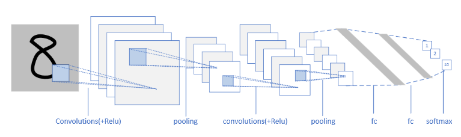
图1 卷积神经网络的典型结构图

层级结构：

1. 原始的输入是一张图片，可以是彩色的，也可以是灰度的或黑白的。这里假设是只有一个通道的图片，目的是识别0~9的手写体数字；
2. 第一层卷积，我们使用了4个卷积核，得到了4张feature map；激活函数层没有单独画出来，这里我们紧接着卷积操作使用了Relu激活函数；
3. 第二层是池化，使用了Max Pooling方式，把图片的高宽各缩小一倍，但仍然是4个feature map；
4. 第三层卷积，我们使用了4x6个卷积核，其中4对应着输入通道，6对应着输出通道，从而得到了6张feature map，当然也使用了Relu激活函数；
5. 第四层再次做一次池化，现在得到的图片尺寸只是原始尺寸的四分之一左右；
6. 第五层把第四层的6个图片展平成一维，成为一个fully connected层；
7. 第六层再接一个小一些的fully connected层；
8. 最后接一个softmax函数，判别10个分类。

在一个典型的卷积神经网络中，会至少包含以下几个层：

- 卷积层
- 激活函数层
- 池化层
- 全连接分类层

### 17.0.3 卷积核的作用
卷积核就是一个小矩阵，类似这样：

```
1.1  0.23  -0.45
0.1  -2.1   1.24
0.74 -1.32  0.01
```

这是一个3x3的卷积核，还会有1x1、5x5、7x7、9x9、11x11的卷积核。在卷积层中，我们会用输入数据与卷积核相乘，得到输出数据，就类似全连接层中的Weights一样，所以卷积核里的数值，也是通过反向传播的方法学习到的。

9个不同的卷积核在同一张图上运算后得到的结果
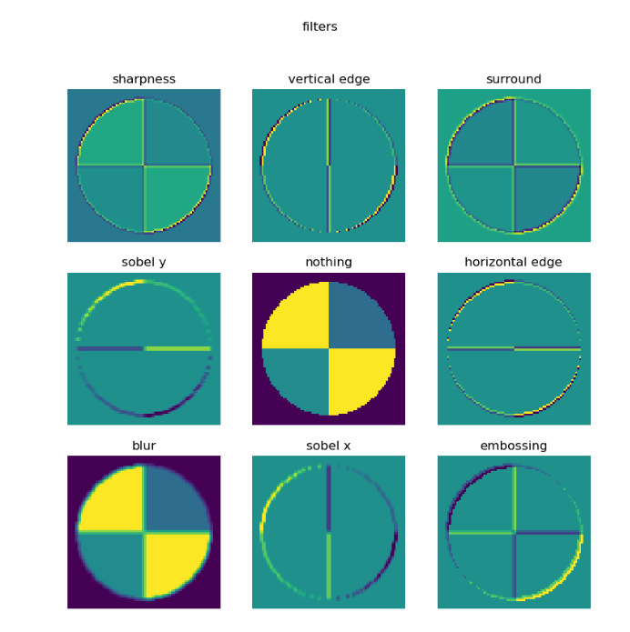

各卷积的效果

||1|2|3|
|---|---|---|---|
|1|0,-1, 0<br>-1, 5,-1<br>0,-1, 0|0, 0, 0 <br> -1, 2,-1 <br> 0, 0, 0|1, 1, 1 <br> 1,-9, 1 <br> 1, 1, 1|
||sharpness|vertical edge|surround|
|2|-1,-2, -1 <br> 0, 0, 0<br>1, 2, 1|0, 0, 0 <br> 0, 1, 0 <br> 0, 0, 0|0,-1, 0 <br> 0, 2, 0 <br> 0,-1, 0|
||sobel y|nothing|horizontal edge|
|3|0.11,0.11,0.11 <br>0.11,0.11,0.11<br>0.11,0.11,0.11|-1, 0, 1 <br> -2, 0, 2 <br> -1, 0, 1|2, 0, 0 <br> 0,-1, 0 <br> 0, 0,-1|
||blur|sobel x|embossing|

各个卷积核的作用

|序号|名称|说明|
|---|---|---|
|1|锐化|如果一个像素点比周围像素点亮，则此算子会令其更亮|
|2|检测竖边|检测出了十字线中的竖线，由于是左侧和右侧分别检查一次，所以得到两条颜色不一样的竖线|
|3|周边|把周边增强，把同色的区域变弱，形成大色块|
|4|Sobel-Y|纵向亮度差分可以检测出横边，与横边检测不同的是，它可以使得两条横线具有相同的颜色，具有分割线的效果|
|5|Identity|中心为1四周为0的过滤器，卷积后与原图相同|
|6|横边检测|检测出了十字线中的横线，由于是上侧和下侧分别检查一次，所以得到两条颜色不一样的横线|
|7|模糊|通过把周围的点做平均值计算而“杀富济贫”造成模糊效果|
|8|Sobel-X|横向亮度差分可以检测出竖边，与竖边检测不同的是，它可以使得两条竖线具有相同的颜色，具有分割线的效果|
|9|浮雕|形成大理石浮雕般的效果|

### 17.0.4 卷积后续的运算

1. 卷积
2. 激活
3. 池化

## 17.1 卷积的前向计算

### 17.1.1 卷积的数学定义

#### 连续定义

$$h(x)=(f*g)(x) = \int_{-\infty}^{\infty} f(t)g(x-t)dt \tag{1}$$

卷积与傅里叶变换有着密切的关系。利用这点性质，即两函数的傅里叶变换的乘积等于它们卷积后的傅里叶变换，能使傅里叶分析中许多问题的处理得到简化。

#### 离散定义

$$h(x) = (f*g)(x) = \sum^{\infty}_{t=-\infty} f(t)g(x-t) \tag{2}$$
 
### 17.1.2 单入单出的二维卷积


$$
h(i,j) = (I*K)(i,j)=\sum_m \sum_n I(i+m,j+n)K(m,n)
$$

结论：

1. 我们实现的卷积操作不是原始数学含义的卷积，而是工程上的卷积，可以简称为卷积
2. 在实现卷积操作时，并不会反转卷积核

按照公式，我们可以在4x4的图片上，用一个3x3的卷积核，通过卷积运算得到一个2x2的图片，运算的过程如图3所示。

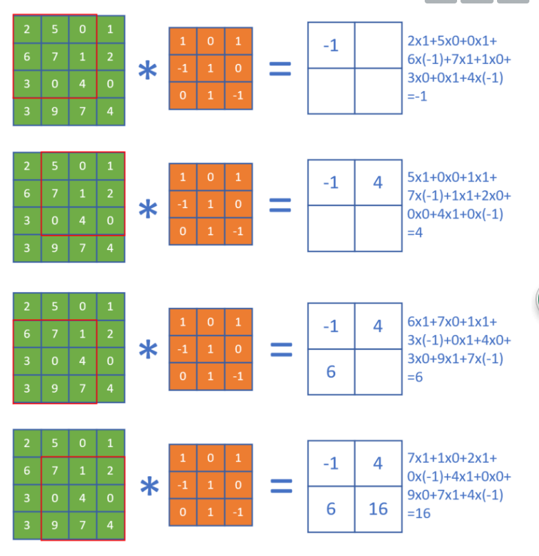
图3 卷积运算的过程

### 17.1.3 单入多出的升维卷积

原始输入是一维的图片，但是我们可以用多个卷积核分别对其计算，从而得到多个特征输出。如图4所示。

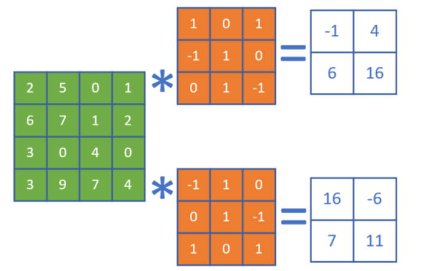


图4 单入多出的升维卷积

一张4x4的图片，用两个卷积核并行地处理，输出为2个2x2的图片。在训练过程中，这两个卷积核会完成不同的特征学习。

### 17.1.4 步长 stride

每次计算后，卷积核会向右或者向下移动一个单元，则步长stride = 1。，卷积核每次向右或向下移动两个单元，即stride = 2。

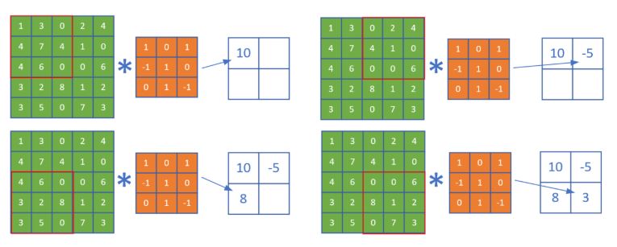
图5 步长为2的卷积

在后续的步骤中，由于每次移动两格，所以最终得到一个2x2的图片。

### 17.1.5 填充 padding

如果原始图为4x4，用3x3的卷积核进行卷积后，目标图片变成了2x2。如果我们想保持目标图片和原始图片为同样大小，一般我们会向原始图片周围填充一圈0，然后再做卷积。。

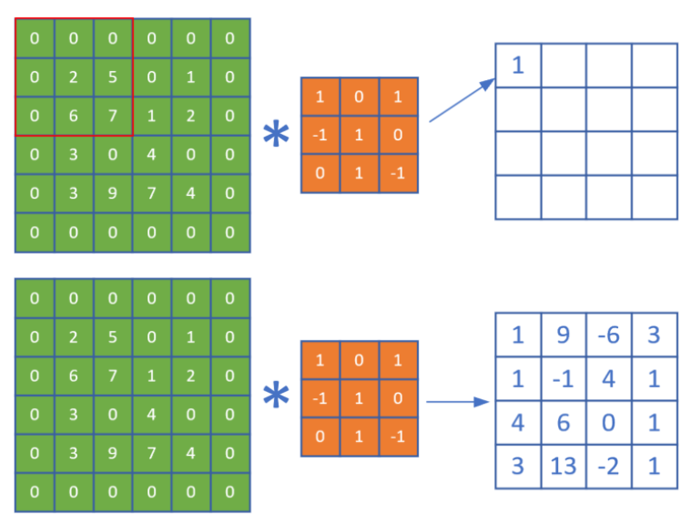

图6 带填充的卷积

## 17.2 卷积层的训练

同全连接层一样，卷积层的训练也需要从上一层回传的误差矩阵，然后计算：

1. 本层的权重矩阵的误差项
2. 本层的需要回传到下一层的误差矩阵

### 17.2.1 计算反向传播的梯度矩阵

正向公式：

$$Z = W*A+b $$
其中，W是卷积核，*表示卷积（互相关）计算，A为当前层的输入项，b是偏移（未在图中画出），Z为当前层的输出项，但尚未经过激活函数处理。

反向公式:
$$\delta_{out} = \delta_{in} * W^{rot180}$$

### 17.2.2 步长不为1时的梯度矩阵还原

我们先观察一下stride=1和2时，卷积结果的差异如图7。

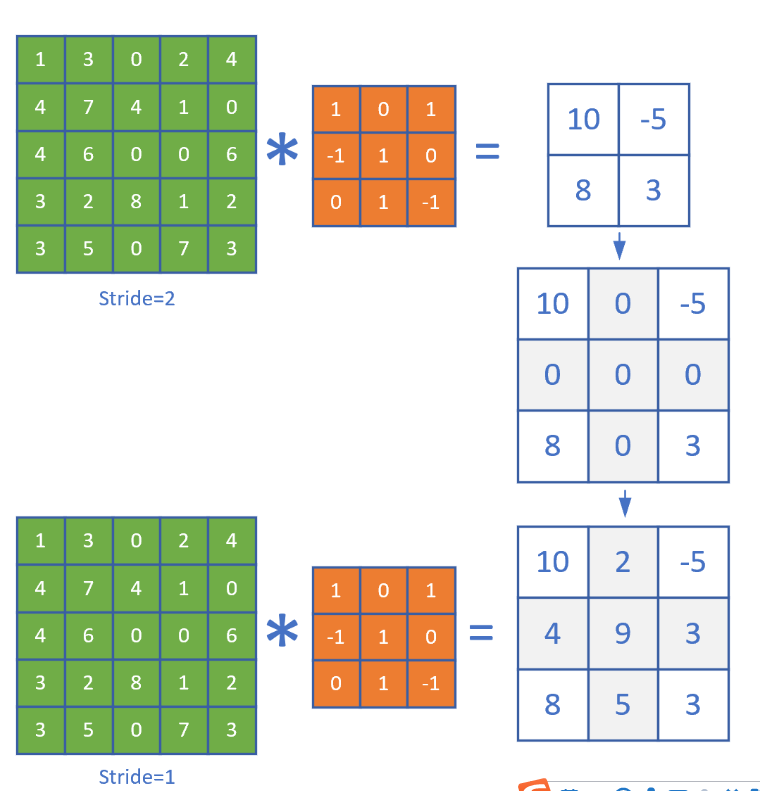

图7 步长为1和步长为2的卷积结果的比较

二者的差别就是中间那个结果图的灰色部分。如果反向传播时，传入的误差矩阵是stride=2时的2x2的形状，那么我们只需要把它补上一个十字，变成3x3的误差矩阵，就可以用步长为1的算法了。

以此类推，如果步长为3时，需要补一个双线的十字。所以，当知道当前的卷积层步长为S（S>1）时：

1. 得到从上层回传的误差矩阵形状，假设为$M \times N$
2. 初始化一个$(M \cdot S) \times (N \cdot S)$的零矩阵
3. 把传入的误差矩阵的第一行值放到零矩阵第0行的0,S,2S,3S...位置
4. 然后把误差矩阵的第二行的值放到零矩阵第S行的0,S,2S,3S...位置
5. ......


### 17.2.3 有多个卷积核时的梯度计算


需要前传的梯度矩阵：

$$\delta_{out} = \sum_m \delta_{in\_m} * W^{rot180}_ m $$


### 17.2.4 权重（卷积核）梯度计算


总结成一个公式：

$$\delta_w = A * \delta_{in} \tag{11}$$

### 17.2.5 偏移的梯度计算

$$
\delta_b = \delta_{in} \tag{13}
$$

每个卷积核W可能会有多个filter，或者叫子核，但是一个卷积核只有一个偏移，无论有多少子核。

## 17.3 池化层

### 17.3.1 常用池化方法

池化 pooling，又称为下采样，downstream sampling or sub-sampling。

池化方法分为两种，一种是最大值池化 Max Pooling，一种是平均值池化 Mean/Average Pooling。如图17-32所示。
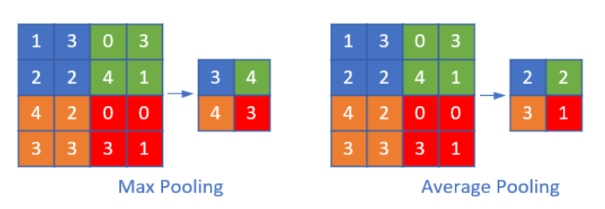
图8 池化

- 最大值池化，是取当前池化视野中所有元素的最大值，输出到下一层特征图中。
- 平均值池化，是取当前池化视野中所有元素的平均值，输出到下一层特征图中。

其目的是：

- 扩大视野：就如同先从近处看一张图片，然后离远一些再看同一张图片，有些细节就会被忽略
- 降维：在保留图片局部特征的前提下，使得图片更小，更易于计算
- 平移不变性，轻微扰动不会影响输出：比如上图中最大值池化的4，即使向右偏一个像素，其输出值仍为4
- 维持同尺寸图片，便于后端处理：假设输入的图片不是一样大小的，就需要用池化来转换成同尺寸图片

一般我们都使用最大值池化。

# 第18章 卷积神经网络应用

## 18.0 经典的卷积神经网络模型
### 18.0.1 LeNet (1998)

图9是卷积神经网络的鼻祖LeNet$^{[3]}$的模型结构。

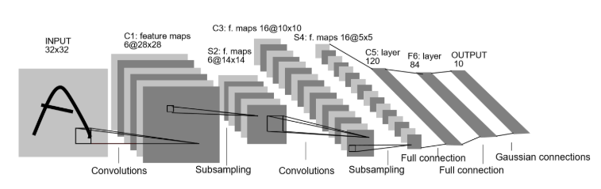
图9 LeNet模型结构图

1. 输入为单通道32x32灰度图
2. 使用6组5x5的过滤器，每个过滤器里有一个卷积核，stride=1，得到6张28x28的特征图
3. 使用2x2的池化，stride=2，得到6张14x14的特征图
4. 使用16组5x5的过滤器，每个过滤器里有6个卷积核，对应上一层的6个特征图，得到16张10x10的特征图
5. 池化，得到16张5x5的特征图
6. 接全连接层，120个神经元
7. 接全连接层，84个神经元
8. 接全连接层，10个神经元，softmax输出

### 18.0.2 AlexNet (2012)

AlexNet$^{[4]}$网络结构在整体上类似于LeNet，都是先卷积然后在全连接。但在细节上有很大不同。AlexNet更为复杂。AlexNet有60 million个参数和65000个神经元，五层卷积，三层全连接网络，最终的输出层是1000通道的Softmax。

AlexNet用两块GPU并行计算，大大提高了训练效率，并且在ILSVRC-2012竞赛中获得了top-5测试的15.3%的error rate，获得第二名的方法error rate是26.2%，差距非常大，足以说明这个网络在当时的影响力。

图10是AlexNet的模型结构。

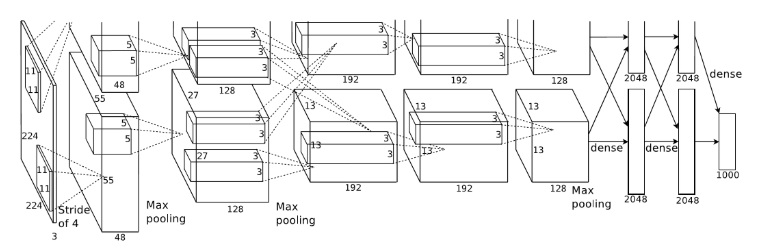
图10 AlexNet模型结构图

1. 原始图片是3x224x224三通道彩色图片，分开到上下两块GPU上进行训练
2. 卷积，96核，11x11，stride=4，pad=0，输出96x55x55
3. LRN+池化，3x3，stride=2，pad=0，输出96x27x27
4. 卷积，256核，5x5，stride=1，pad=2，输出256x27x27
5. LRN+池化，3x3，stride=2，输出256x13x13
6. 卷积，384核，3x3，stride=1，pad=1，输出384x13x13
7. 卷积，384核，3x3，stride=1，pad=1，输出384x13x13
8. 卷积，256核，3x3，stride=1，pad=1，输出256x13x13
9. 池化，3x3，stride=2，输出256x6x6
10. 全连接层，4096个神经元，接Dropout和Relu
11. 全连接层，4096个神经元，接Dropout和Relu
12. 全连接层，1000个神经元做分类

AlexNet的特点：

- 比LeNet深和宽的网络
  
  使用了5层卷积和3层全连接，一共8层。特征数在最宽处达到384。

- 数据增强
  
  针对原始图片256x256的数据，做了随机剪裁，得到224x224的图片若干张。

- 使用ReLU做激活函数
- 在全连接层使用DropOut
- 使用LRN
  
  LRN的全称为Local Response Normalizatio，局部响应归一化，是想对线性输出做一个归一化，避免上下越界。

### 18.0.3 ZFNet (2013)
图11是ZFNet的结构示意图。

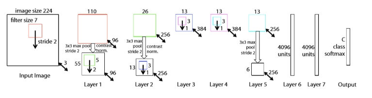

图11 ZFNet模型结构图

ZFNet首次系统化地对卷积神经网络做了可视化的研究，从而找到了AlexNet的缺点并加以改正，提高了网络的能力。总的来说，通过卷积神经网络学习后，我们学习到的特征，是具有辨别性的特征，比如要我们区分人脸和狗头，那么通过卷积神经网络学习后，背景部位的激活度基本很少，我们通过可视化就可以看到我们提取到的特征忽视了背景，而是把关键的信息给提取出来了。

### 18.0.4 VGGNet (2015)
图12为VGG16（16层的VGG）模型结构。

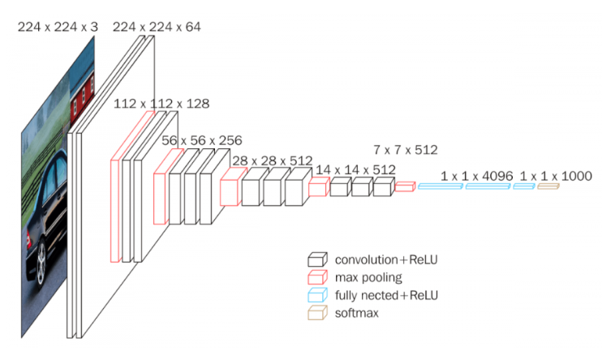

图12 VGG16模型结构图
VGGNet的卷积层有一个特点：特征图的空间分辨率单调递减，特征图的通道数单调递增，使得输入图像在维度上流畅地转换到分类向量。用通俗的语言讲，就是特征图尺寸单调递减，特征图数量单调递增。从上面的模型图上来看，立体方块的宽和高逐渐减小，但是厚度逐渐增加。

一些其它的特点如下：

1. 选择采用3x3的卷积核是因为3x3是最小的能够捕捉像素8邻域信息的尺寸。
2. 使用1x1的卷积核目的是在不影响输入输出的维度情况下，对输入进行形变，再通过ReLU进行非线性处理，提高决策函数的非线性。
3. 2个3x3卷积堆叠等于1个5x5卷积，3个3x3堆叠等于1个7x7卷积，感受野大小不变，而采用更多层、更小的卷积核可以引入更多非线性（更多的隐藏层，从而带来更多非线性函数），提高决策函数判决力，并且带来更少参数。
4. 每个VGG网络都有3个FC层，5个池化层，1个softmax层。
5. 在FC层中间采用dropout层，防止过拟合。

### 18.0.5 GoogLeNet (2014)
图13是GoogLeNet的模型结构图。


图13 GoogLeNet模型结构图

蓝色为卷积运算，红色为池化运算，黄色为softmax分类。
### 18.0.6 ResNets (2015)
图14是ResNets的模型结构。

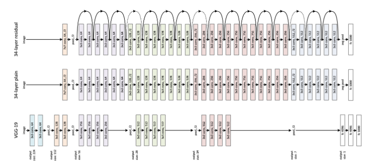

图14 ResNets模型结构图

ResNet称为残差网络。

若将输入设为X，将某一有参网络层设为H，那么以X为输入的此层的输出将为H(X)。一般的卷积神经网络网络如Alexnet/VGG等会直接通过训练学习出参数函数H的表达，从而直接学习X -> H(X)。
而残差学习则是致力于使用多个有参网络层来学习输入、输出之间的参差即H(X) - X即学习X -> (H(X) - X) + X。其中X这一部分为直接的identity mapping，而H(X) - X则为有参网络层要学习的输入输出间残差。

图15为残差学习这一思想的基本表示。

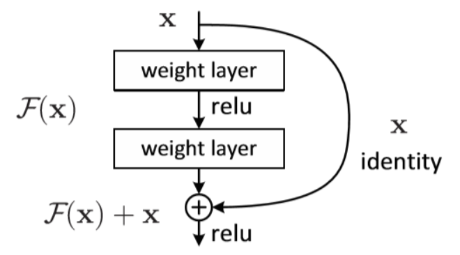


图16 残差结构示意图

图16展示了两种形态的残差模块，左图是常规残差模块，有两个3×3卷积核组成，但是随着网络进一步加深，这种残差结构在实践中并不是十分有效。针对这问题，右图的“瓶颈残差模块”（bottleneck residual block）可以有更好的效果，它依次由1×1、3×3、1×1这三个卷积层堆积而成，这里的1×1的卷积能够起降维或升维的作用，从而令3×3的卷积可以在相对较低维度的输入上进行，以达到提高计算效率的目的。

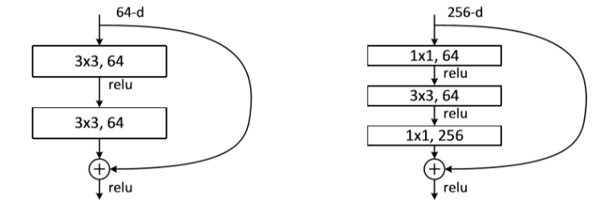

图16 两种形态的残差模块

### 18.0.7 DenseNet (2017)

DenseNet$^{[9]}$ 是一种具有密集连接的卷积神经网络。在该网络中，任何两层之间都有直接的连接，也就是说，网络每一层的输入都是前面所有层输出的并集，而该层所学习的特征图也会被直接传给其后面所有层作为输入。下图是 DenseNet 的一个dense block示意图，一个block里面的结构如下，与ResNet中的BottleNeck基本一致：BN-ReLU-Conv(1×1)-BN-ReLU-Conv(3×3) ，而一个DenseNet则由多个这种block组成。每个DenseBlock的之间层称为transition layers，由BN−>Conv(1×1)−>averagePooling(2×2)组成。

图17是ResNets的模型结构。

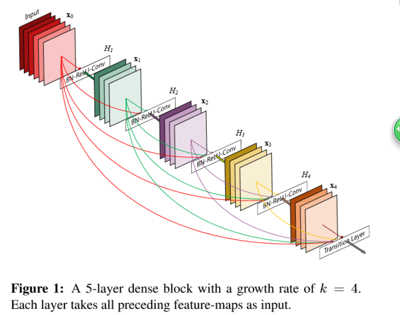
图17 DenseNet模型结构图

DenseNet作为另一种拥有较深层数的卷积神经网络，具有如下优点：

1. 相比ResNet拥有更少的参数数量
2. 旁路加强了特征的重用
3. 网络更易于训练,并具有一定的正则效果
4. 缓解了gradient vanishing和model degradation的问题

## 18.1 解决MNIST分类问题

### 18.1.1 模型搭建

图18 前馈神经网络模型解决MNIST问题

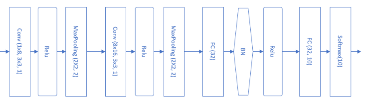

图19 卷积神经网络模型解决MNIST问题

下表展示了模型中各层的功能和参数。
模型中各层的功能和参数

|Layer|参数|输入|输出|参数个数|
|---|---|---|---|---|
|卷积层|8x5x5,s=1|1x28x28|8x24x24|200+8|
|激活层|2x2,s=2, max|8x24x24|8x24x24||
|池化层|Relu|8x24x24|8x12x12||
|卷积层|16x5x5,s=1|8x12x12|16x8x8|400+16|
|激活层|Relu|16x8x8|16x8x8||
|池化层|2x2, s=2, max|16x8x8|16x4x4||
|全连接层|256x32|256|32|8192+32|
|批归一化层||32|32||
|激活层|Relu|32|32||
|全连接层|32x10|32|10|320+10|
|分类层|softmax,10|10|10|

大部分卷积神经网络都会用1、3、5、7的方式递增，还要注意在做池化时，应该尽量让输入的矩阵尺寸是偶数，如果不是的话，应该在上一层卷积层加padding，使得卷积的输出结果矩阵的宽和高为偶数。

### 18.1.2 可视化

#### 第一组的卷积可视化

下图按行显示了以下内容：

1. 卷积核数值
2. 卷积核抽象
3. 卷积结果
4. 激活结果
5. 池化结果

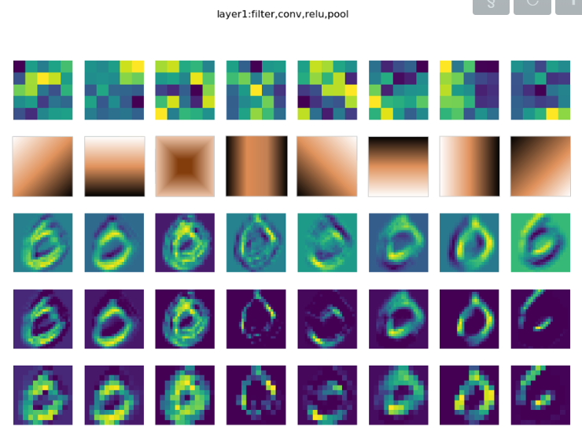

图20 卷积结果可视化

#### 第二组的卷积可视化

图21是第二组的卷积、激活、池化层的输出结果。

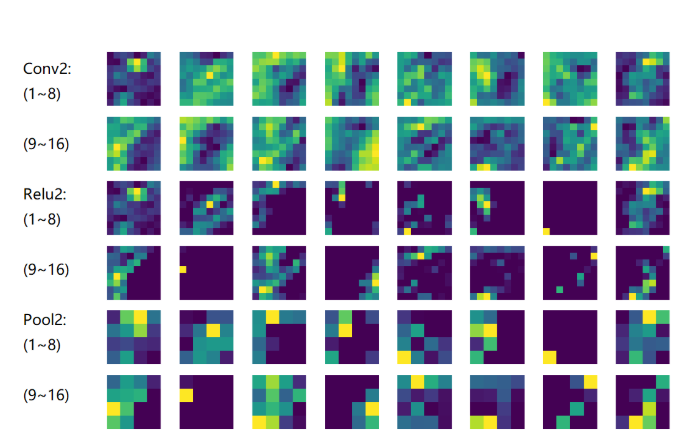
图21 第二组卷积核、激活、池化的可视化

- Conv2：由于是在第一层的特征图上卷积后叠加的结果，所以基本不能按照原图理解，但也能大致看出是是一些轮廓抽取的作用；
- Relu2：能看出的是如果黑色区域多的话，说明基本没有激活值，此卷积核效果就没用；
- Pool2：池化后分化明显的特征图是比较有用的特征，比如3、6、12、15、16；信息太多或者太少的特征图，都用途偏小，比如1、7、10、11。

## 18.2 Fashion-MNIST分类

### 18.2.1 提出问题

用10种物品代替了10个数字，图22是它们的部分样本。

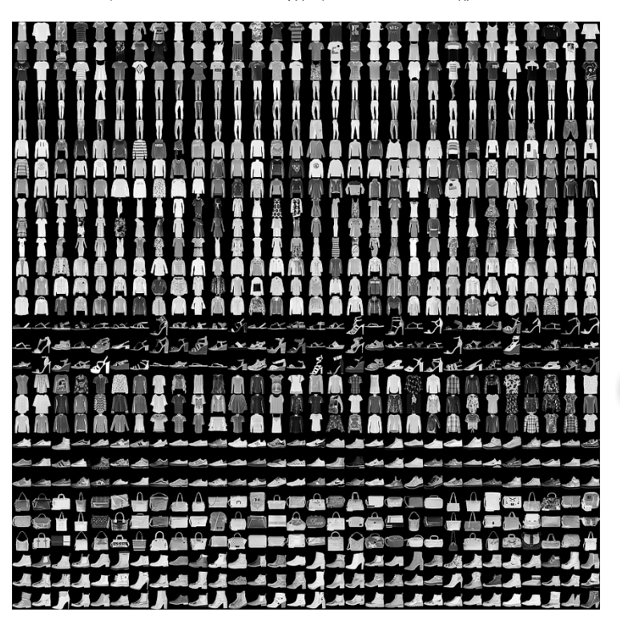

图22 部分样本图展示

每3行是一类样本，按样本类别（从0开始计数）分行显示：

1. T-Shirt，T恤衫（1-3行）
2. Trouser，裤子（4-6行）
3. Pullover，套头衫（7-9行）
4. Dress，连衣裙（10-12行）
5. Coat，外套（13-15行）
6. Sandal，凉鞋（16-18行）
7. Shirt，衬衫（19-21行）
8. Sneaker，运动鞋（22-24行）
9. Bag，包（25-27行）
10. Ankle Boot，短靴（28-30行）

### 18.2.2 用前馈神经网络来解决问题
在测试集上的前几个样本的预测结果如图23所示。

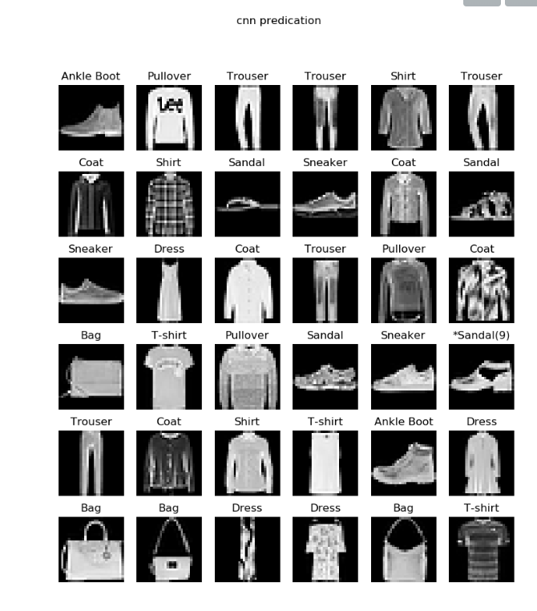
图23 测试结果

与前馈神经网络方案相比，这32个样本里只有一个错误，第4行最后一列，把第9类“短靴”预测成了“凉鞋”，因为这个样本中间有一个三角形的黑色块，与凉鞋的镂空设计很像。

## 18.3 Cifar-10分类
### 18.3.1 提出问题
使用Cifar-10数据集来进一步检验一下卷积神经网络的能力。

图24是Cifar-10的样本数据。

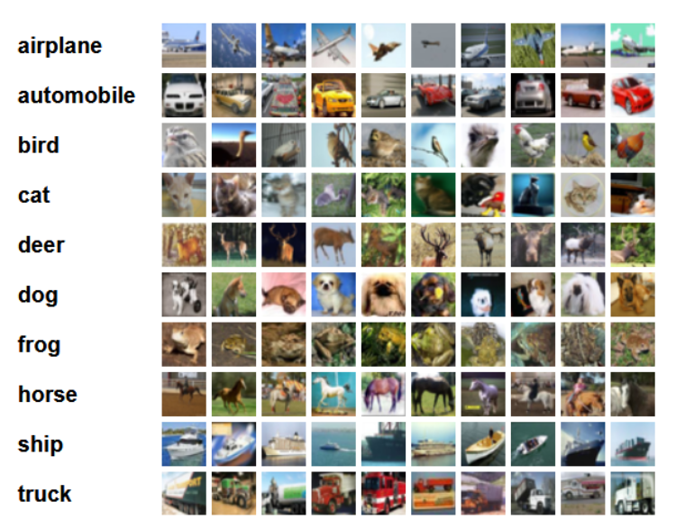

图24 Cifar-10样本数据

1. airplane，飞机，6000张
2. automobile，汽车，6000张
3. bird，鸟，6000张
4. cat，猫，6000张
5. deer，鹿，6000张
6. dog，狗，6000张
7. frog，蛙，6000张
8. horse，马，6000张
9. ship，船，6000张
10. truck，卡车，6000张

Cifar-10 由60000张32*32的 RGB 彩色图片构成，共10个分类。50000张训练，10000张测试。分为6个文件，5个训练数据文件，每个文件中包含10000张图片，随机打乱顺序，1个测试数据文件，也是10000张图片。这个数据集最大的特点在于将识别迁移到了普适物体，而且应用于多分类（姊妹数据集Cifar-100达到100类，ILSVRC比赛则是1000类）。

但是，面对彩色数据集，用CPU做训练所花费的时间实在是太长了，所以本节将学习如何使用GPU来训练神经网络。

### 18.3.2 训练结果

#### 在GPU上训练

在GPU上训练，每一个epoch大约需要1分钟；而在一个8核的CPU上训练，每个epoch大约需要2分钟（据笔者观察是因为并行计算占满了8个核）。所以即使读者没有GPU，用CPU训练还是可以接受的。以下是在GPU上的训练输出：

```
Epoch 1/25
1563/1563 [==============================] - 33s 21ms/step - loss: 1.8770 - acc: 0.3103 - val_loss: 1.6447 - val_acc: 0.4098
......
Epoch 25/25
1563/1563 [==============================] - 87s 55ms/step - loss: 0.8809 - acc: 0.6960 - val_loss: 0.7724 - val_acc: 0.7372

Test loss: 0.772429921245575
Test accuracy: 0.7372
```
经过25轮后，模型在测试集上的准确度为73.72%。

#### 在CPU上训练

在CPU上训练，只设置了10个epoch，一共半个小时时间，在测试集上达到63.61%的准确率。观察val_loss和val_acc的趋势，随着训练次数的增加，还可以继续优化。

```
Epoch 1/10
1563/1563 [==============================] - 133s 85ms/step - loss: 1.8563 - acc: 0.3198 - val_loss: 1.5658 - val_acc: 0.4343
......

Epoch 10/10
1563/1563 [==============================] - 131s 84ms/step - loss: 1.0972 - acc: 0.6117 - val_loss: 1.0426 - val_acc: 0.6361

10000/10000 [==============================] - 7s 684us/step
Test loss: 1.042622245979309
Test accuracy: 0.6361
```
# 总结
本章学习了关于卷积神经网络的一些知识，包括卷积神经网络的原理，反向传播的原理，池化的前向计算和反向传播，以及用一些经典的网络模型解决分类问题等。通过本次学习和复习了卷积神经网络的结构和内部的各个层，运行代码，也对一些概念有了更加深刻的体会。
