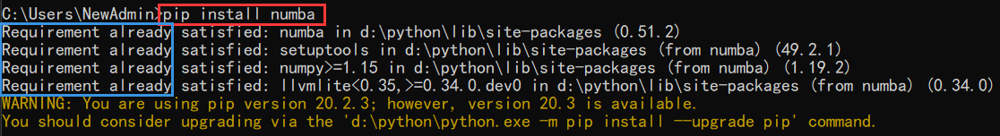
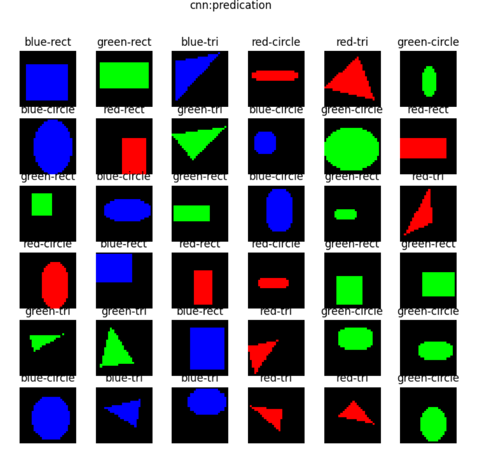

201809058  Wang Yulong  201809058
<font face=楷体>
CNN--卷积神经网络学习报告  
```
pip install opencv-contrib-python 
（如果需要用主模块和contrib模块，使用这个命令安装）
```

<center>图1 安装opencv2 </center>

```
pip install numba
```


<center>图2 安装numba </center>


>>> # <center> 卷积神经网络  </center>

>概述

定义：卷积神经网络（CNN，Convolutional Neural Net)是神经网络的类型之一，在图像识别和分类领域中取得了非常好的效果，比如识别人脸、物体、交通标识等，这就为机器人、自动驾驶等应用提供了坚实的技术基础。

层级结构：

1. 原始的输入是一张图片，可以是彩色的，也可以是灰度的或黑白的。这里假设是只有一个通道的图片，目的是识别0~9的手写体数字；
2. 第一层卷积，我们使用了4个卷积核，得到了4张feature map；激活函数层没有单独画出来，这里我们紧接着卷积操作使用了Relu激活函数；
3. 第二层是池化，使用了Max Pooling方式，把图片的高宽各缩小一倍，但仍然是4个feature map；
4. 第三层卷积，我们使用了4x6个卷积核，其中4对应着输入通道，6对应着输出通道，从而得到了6张feature map，当然也使用了Relu激活函数；
5. 第四层再次做一次池化，现在得到的图片尺寸只是原始尺寸的四分之一左右；
6. 第五层把第四层的6个图片展平成一维，成为一个fully connected层；
7. 第六层再接一个小一些的fully connected层；
8. 最后接一个softmax函数，判别10个分类。

一个典型的卷积神经网络中，会至少包含以下几层：

- 卷积层
- 激活函数层
- 池化层
- 全连接分类层

>卷积核的作用


<center>图1 卷积核</center>

表1 卷积的效果

||1|2|3|
|---|---|---|---|
|1|0,-1, 0<br>-1, 5,-1<br>0,-1, 0|0, 0, 0 <br> -1, 2,-1 <br> 0, 0, 0|1, 1, 1 <br> 1,-9, 1 <br> 1, 1, 1|
||sharpness|vertical edge|surround|
|2|-1,-2, -1 <br> 0, 0, 0<br>1, 2, 1|0, 0, 0 <br> 0, 1, 0 <br> 0, 0, 0|0,-1, 0 <br> 0, 2, 0 <br> 0,-1, 0|
||sobel y|nothing|horizontal edge|
|3|0.11,0.11,0.11 <br>0.11,0.11,0.11<br>0.11,0.11,0.11|-1, 0, 1 <br> -2, 0, 2 <br> -1, 0, 1|2, 0, 0 <br> 0,-1, 0 <br> 0, 0,-1|
||blur|sobel x|embossing|

第5个卷积核，叫做"nothing"。因为这个卷积核在与原始图片计算后得到的结果，和原始图片一模一样，所以我们看到的图5就是相当于原始图片，放在中间是为了方便和其它卷积核的效果做对比。


<center>图2  卷积核效果 </center>

1. 注意图一是原始图片，用cv2读取出来的图片，其顺序是反向的，即：

- 第一维是高度
- 第二维是宽度
- 第三维是彩色通道数，但是其顺序为BGR，而不是常用的RGB

1. 我们对原始图片使用了一个3x1x3x3的卷积核，因为原始图片为彩色图片，所以第一个维度是3，对应RGB三个彩色通道；我们希望只输出一张feature map，以便于说明，所以第二维是1；我们使用了3x3的卷积核，用的是sobel x算子。所以图二是卷积后的结果。

2. 图三做了一层Relu激活计算，把小于0的值都去掉了，只留下了一些边的特征。

3. 图四是图三的四分之一大小，虽然图片缩小了，但是特征都没有丢失，反而因为图像尺寸变小而变得密集，亮点的密度要比图三大而粗。

卷积编程模型


上图侧重于解释数值计算过程，而图17-16侧重于解释五个概念的关系：

- 输入 Input Channel
- 卷积核组 WeightsBias
- 过滤器 Filter
- 卷积核 kernal
- 输出 Feature Map

>>>颜色分类


<center>图3 颜色样本 </center>

在样本数据中，一共有6种颜色，分别是：

- 红色 red
- 绿色 green
- 蓝色 blue
- 青色（蓝+绿） cyan
- 黄色（红+绿） yellow
- 粉色（红+蓝） pink

而这6种颜色是分布在5种形状之上的：

- 圆形
- 菱形
- 直线
- 矩形
- 三角形

>>识别几何图形

有一种儿童玩具：在一个平板上面有三种形状的洞：圆形、三角形、正方形，让小朋友们拿着这三种形状的积木从对应的洞中穿过那个平板就算成功。如果形状不对是穿不过去的，比如一个圆形的积木无法穿过一个方形的洞。这就要求儿童先学会识别几何形状，学会匹配，然后手眼脑配合才能成功。

人工智能现在还是初期阶段，它能否达到3岁儿童的能力呢？先看一下图4所示的样本数据。


<center>图4 形状样本 </center>

一共有5种形状：圆形、菱形、直线、矩形、三角形。上图中列出了一些样本，由于图片尺寸是28x28的灰度图，所以在放大显示后可以看到很多锯齿，读者可以忽略。需要强调的是，每种形状的尺寸和位置在每个样本上都是有差异的，它们的大小和位置都是随机的，比如圆形的圆心位置和半径都是不一样的，还有可能是个椭圆。


<center>图5 前馈神经网络训练结果 </center>

>>>用卷积神经网络解决问题

下面我们来看看卷积神经网络能不能完成这个工作。首先搭建网络模型如下：

```Python
def cnn_model():
    num_output = 5
    max_epoch = 50
    batch_size = 16
    learning_rate = 0.1
    params = HyperParameters_4_2(
        learning_rate, max_epoch, batch_size,
        net_type=NetType.MultipleClassifier,
        init_method=InitialMethod.MSRA,
        optimizer_name=OptimizerName.SGD)

    net = NeuralNet_4_2(params, "shape_cnn")
    
    c1 = ConvLayer((1,28,28), (8,3,3), (1,1), params)
    net.add_layer(c1, "c1")
    r1 = ActivationLayer(Relu())
    net.add_layer(r1, "relu1")
    p1 = PoolingLayer(c1.output_shape, (2,2), 2, PoolingTypes.MAX)
    net.add_layer(p1, "p1") 

    c2 = ConvLayer(p1.output_shape, (16,3,3), (1,0), params)
    net.add_layer(c2, "c2")
    r2 = ActivationLayer(Relu())
    net.add_layer(r2, "relu2")
    p2 = PoolingLayer(c2.output_shape, (2,2), 2, PoolingTypes.MAX)
    net.add_layer(p2, "p2") 

    params.learning_rate = 0.1

    f3 = FcLayer_2_0(p2.output_size, 32, params)
    net.add_layer(f3, "f3")
    bn3 = BnLayer(f3.output_size)
    net.add_layer(bn3, "bn3")
    r3 = ActivationLayer(Relu())
    net.add_layer(r3, "relu3")
    
    f4 = FcLayer_2_0(f3.output_size, num_output, params)
    net.add_layer(f4, "f4")
    s4 = ClassificationLayer(Softmax())
    net.add_layer(s4, "s4")

    return net
```
表2展示了模型中各层的作用和参数。

>表2 模型各层的作用和参数

|ID|类型|参数|输入尺寸|输出尺寸|
|---|---|---|---|---|
|1|卷积|8x3x3, S=1,P=1|1x28x28|8x28x28|
|2|激活|Relu|8x28x28|8x28x28|
|3|池化|2x2, S=2, Max|8x28x28|8x14x14|
|4|卷积|16x3x3, S=1|8x14x14|16x12x12|
|5|激活|Relu|16x12x12|16x12x12|
|6|池化|2x2, S=2, Max|16x6x6|16x6x6|
|7|全连接|32|576|32|
|8|归一化||32|32|
|9|激活|Relu|32|32|
|10|全连接|5|32|5|
|11|分类|Softmax|5|5|

经过50个epoch的训练后，我们得到的结果如图6


<center>图6 前馈神经网络训练结果 </center>

```python
......
epoch=49, total_iteration=14099
loss_train=0.002093, accuracy_train=1.000000
loss_valid=0.163053, accuracy_valid=0.944000
time used: 259.32207012176514
testing...
0.935
load parameters
0.96
```
<font color=orange>
可以看到我们在测试集上得到了96%的准确度，比前馈神经网络模型要高出很多，这也证明了卷积神经网络在图像识别上的能力。</font>


<center>图7 图像识别训练结果 </center>

<font color=green>
绝大部分样本预测是正确的，只有最后第13个样本，看上去应该是一个很扁的三角形，被预测成了直线。</font>

>表3 8个卷积核的作用

|卷积核序号|作用|直线|三角形|菱形|矩形|圆形|
|:--:|---|:--:|:--:|:--:|:--:|:--:|
|1|左侧边缘|0|1|0|1|1|
|2|大色块区域|0|1|1|1|1|
|3|左上侧边缘|0|1|1|0|1|
|4|45度短边|1|1|1|0|1|
|5|右侧边缘、上横边|0|0|0|1|1|
|6|左上、右上、右下|0|1|1|0|1|
|7|左边框和右下角|0|0|0|1|1|
|8|左上和右下，及背景|0|0|1|0|1|

表3中，左侧为卷积核的作用，右侧为某个特征对于5种形状的判别力度，0表示该特征无法找到，1表示可以找到该特征。

1. 比如第一个卷积核，其作用为判断是否有左侧边缘，那么第一行的数据为[0,1,0,1,1]，表示对直线和菱形来说，没有左侧边缘特征，而对于三角形、矩形、圆形来说，有左侧边缘特征。这样的话，就可以根据这个特征把5种形状分为两类：

   - A类有左侧边缘特征：三角形、矩形、圆形
   - B类无左侧边缘特征：直线、菱形

2. 再看第二个卷积核，是判断是否有大色块区域的，只有直线没有该特征，其它4种形状都有。那么看第1个特征的B类种，包括直线、菱形，则第2个特征就可以把直线和菱形分开了。

3. 然后我们只关注A类形状，看第三个卷积核，判断是否有左上侧边缘，对于三角形、矩形、圆形的取值为[1,0,1]，即矩形没有左上侧边缘，这样就可以把矩形从A类中分出来。

4. 对于三角形和圆形，卷积核5、7、8都可以给出不同的值，这就可以把二者分开了。


<center>图8 颜色和图像识别训练结果 </center>


<center>图9 颜色和图像识别损失函数 </center>


>>> # <center> MINIST分类 </center>


<center>图10 卷积神经网络模型解决MNIST问题</center>

>表4 模型中各层的功能和参数

|Layer|参数|输入|输出|参数个数|
|---|---|---|---|---|
|卷积层|8x5x5,s=1|1x28x28|8x24x24|200+8|
|激活层|2x2,s=2, max|8x24x24|8x24x24||
|池化层|Relu|8x24x24|8x12x12||
|卷积层|16x5x5,s=1|8x12x12|16x8x8|400+16|
|激活层|Relu|16x8x8|16x8x8||
|池化层|2x2, s=2, max|16x8x8|16x4x4||
|全连接层|256x32|256|32|8192+32|
|批归一化层||32|32||
|激活层|Relu|32|32||
|全连接层|32x10|32|10|320+10|
|分类层|softmax,10|10|10|

卷积核的大小如何选取呢？大部分卷积神经网络都会用1、3、5、7的方式递增，还要注意在做池化时，应该尽量让输入的矩阵尺寸是偶数，如果不是的话，应该在上一层卷积层加padding，使得卷积的输出结果矩阵的宽和高为偶数。

>> 可视化

## 第一组的卷积可视化

下图按行显示了以下内容：

1. 卷积核数值
2. 卷积核抽象
3. 卷积结果
4. 激活结果
5. 池化结果


<center>图11 可视化识别结果</center>


表6 卷积核的抽象模式

|卷积核序号|1|2|3|4|5|6|7|8|
|:--:|:--:|:--:|:--:|:--:|:--:|:--:|:--:|:--:|
|抽象模式|右斜|下|中心|竖中|左下|上|右|左上|

这些模式实际上就是特征，是卷积网络自己学习出来的，每一个卷积核关注图像的一个特征，比如上部边缘、下部边缘、左下边缘、右下边缘等。这些特征的排列有什么顺序吗？没有。每一次重新训练后，特征可能会变成其它几种组合，顺序也会发生改变，这取决于初始化数值及样本顺序、批大小等等因素。


<center>图12 可视化识别损失函数</center>


<center>图13 可视化识别</center>


---
# <center>思想体会</center>

通过今天这次课的学习，我了解到了卷积神经网络(CNN)、深度神经网络（DNN）的基本定义及其在颜色识别、图形识别方面的应用。

由于图像中存在固有的局部模式（如人脸中的眼睛、鼻子、嘴巴等），所以将图像处理和神经网络结合引出卷积神经网络CNN。CNN是通过卷积核将上下层进行链接，同一个卷积核在所有图像中是共享的，图像通过卷积操作后仍然保留原先的位置关系。为了克服梯度消失，ReLU、maxout等传输函数代替了sigmoid，形成了如今DNN的基本形式。

总体而言，CNN的误差要远低于DNN。