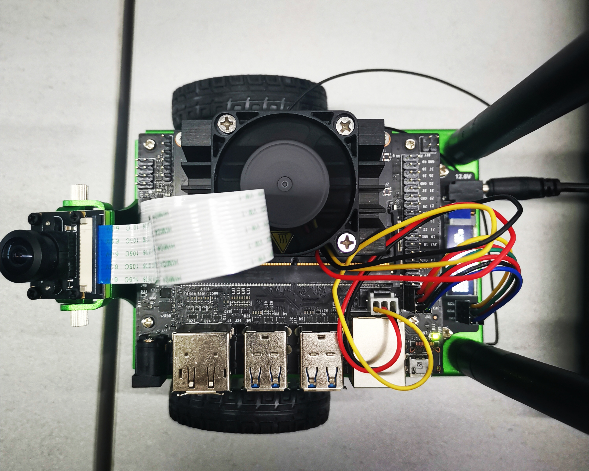
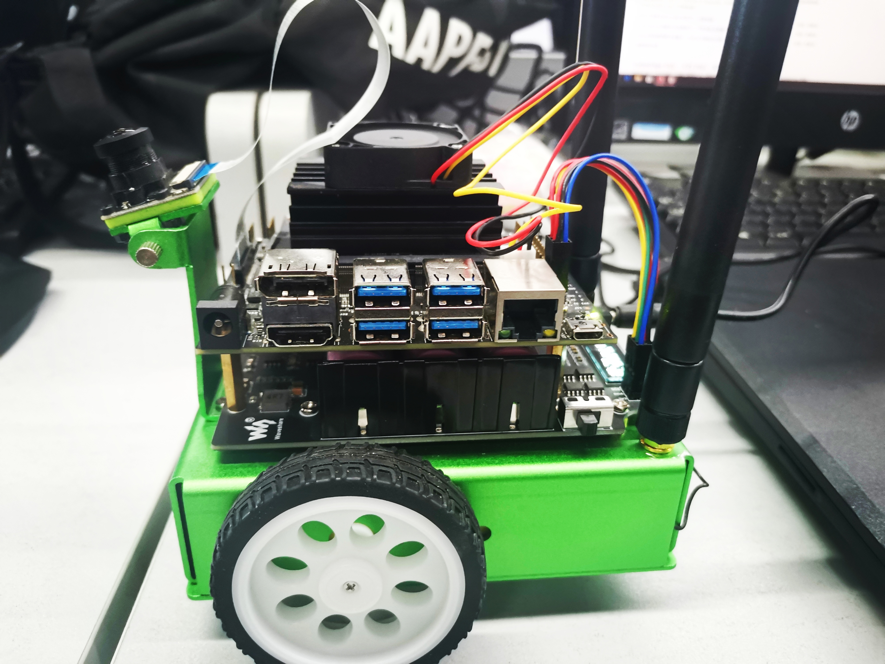

#  JetBot AI Kit 实验报告 | 实验一 组装小车 #
## 【第五组】 ##
### 组长：解敖201809023 ###
### 组员：汪统201809012 邹博堃201809019 郭小凡201809027 ###

## 实验步骤 ##

根据教程步骤组装小车。

安装成果如图所示：

## 实验小结 ##
本次的实验，培养了我们的动手能力，提高了团队之间的配合，提高了我们的在小车的安装过程中，我们对于jetbot小车的组成和零件有了更加熟悉的了解，对jetbot小车的器件安装有了一个更加深刻的认识，知道了jetbot小车的架构，对此有了一个初步的了解。