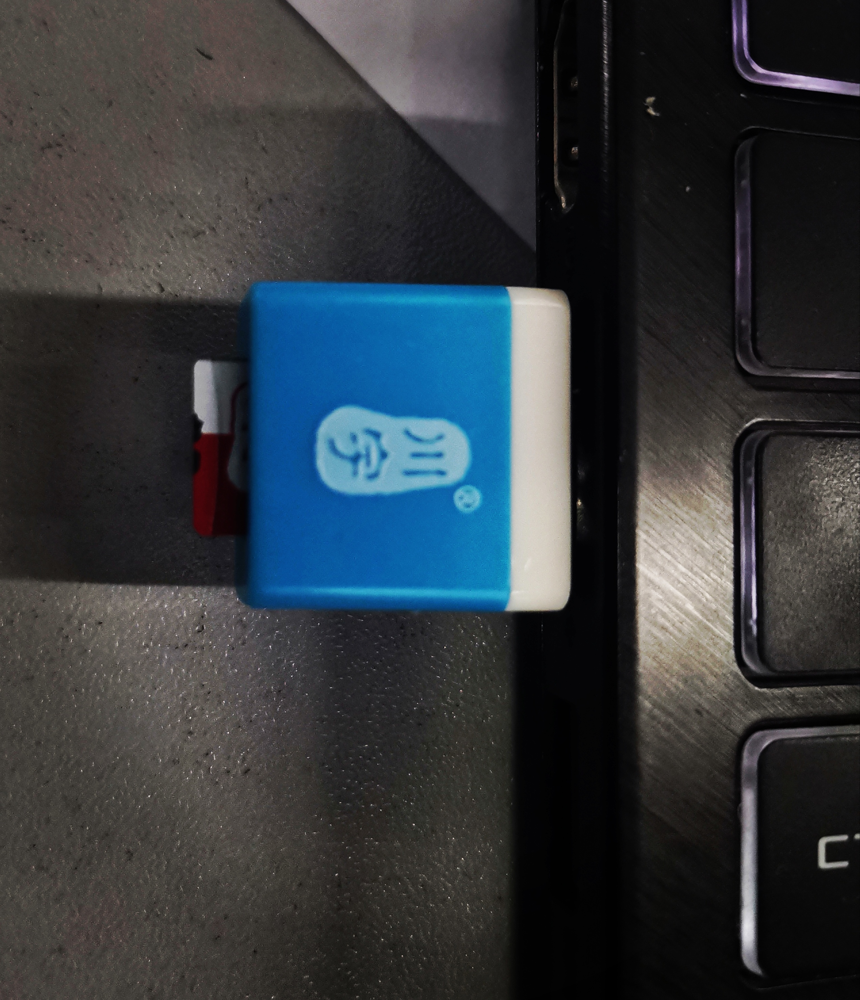
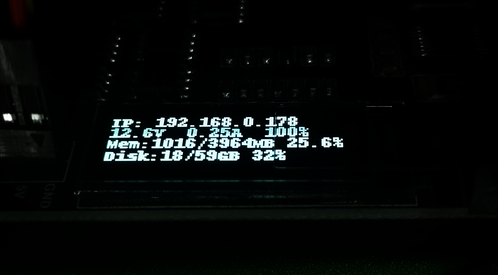
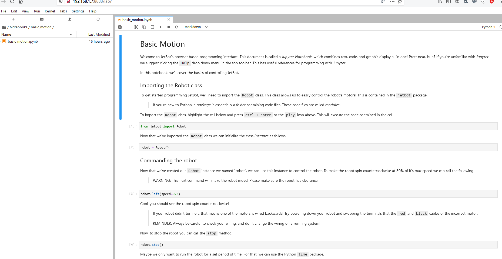

#  JetBot AI Kit 实验报告 | 实验二 安装镜像 #
## 【第五组】 ##
### 组长：解敖201809023 ###
### 组员：汪统201809012 邹博堃201809019 郭小凡201809027 ###

## 镜像烧写 ##

$实验步骤$

1. 下载JetBot镜像jetbot镜像，提取码t64u，并解压镜像文件。
2. 将SD卡放入读卡器中，与电脑链接。
3. 使用Etcher软件，选择镜像文件，将其烧写至SD卡上。



## 启动Jetson Nano ##

$实验步骤$

1. 将SD卡插入Jetson Nano 。
2. 连接HDMI显示器，键盘和鼠标到Nano。
3. 连接电源到Jetson Nano，上电启动Jetson Nano。

## 连接JetBot到WIFI ##
1. 登录系统，Jetbot系统的默认用户名和密码均为Jetbot。
2. 点击系统右上角网络图标连接WIFI
3. 关机断电。将Jetbot小车组装好。并启动Jetson nano。启动的时候系统会自动连接WIFI，并同时在OLED显示器上显示IP地址。



## Web浏览器连接JetBot ##

$实验步骤$

1. JetBot 正常连接WIFI之后，去掉HDMI显示器，USB键盘，鼠标。关机并断接电源。
2. 打开JetBot电源开关等待JetBot启动。
3. 正常启动之后再OLED屏幕上回显示有小车的IP地址。
4. 在浏览器输入JetBot的IP地址打开。



## 安装最新软件 ##

$实验步骤$

1. 在浏览器地址栏输入http://<jetbot_ip_address>:8888连接到小车。
2. 点击终端icon打开一个终端。
3. 输入如下指令下载安装新的软件库并将其覆盖旧的软件库。
   ```
   #git clone https://github.com/waveshare/jetbot
   #cd jetbot
   #sudo python3 setup.py install
   ```
   ```
   #cd
   #sudo apt-get install rsync
   #rsync -r jetbot/notebooks ~/Notebooks
   ```

## 配置电源模式 ##

$实验步骤$

1. 浏览器打开http://<jetbot_ip_address>:8888连接到小车，重新启动一个终端。
2. 输入命令，将小车切换为5W功耗模式。
   ```
   #sudo nvpmodel -m1
   ```
3. 输入命令，检查并确认JetBot处于5W功耗模式。
   ```
   #nvpmodel -q
   ```

## 实验小结 ##
在安装镜像的过程中，我们组的jetbot小车的电源出现了问题，导致小车无法正常的运行，后来发现是电池的原因。在安装镜像的时候虽然出现了些许的问题，但是在不断的探索过程中，所有的小问题都被我们慢慢的解决了。随着，一个又一个问题的解决，我们对于jetbot小车的认知又是更加的熟悉。