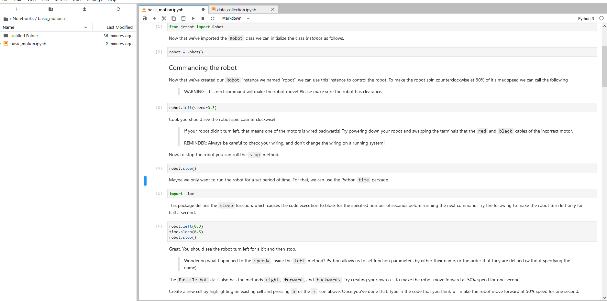
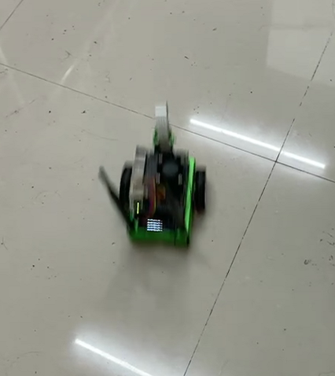

#  JetBot AI Kit 实验报告 | 实验三 电机驱动 
## 【第五组】 ##
### 组长：解敖201809023 ###
### 组员：汪统201809012 邹博堃201809019 郭小凡201809027 ###

## 实验步骤 ##

1. 在浏览器地址栏输入http://<jetbot_ip_address>:8888连接到小车，页面左侧打开/Notebooks/basic_motion/路径下的打开basic_motion.ipynb文件。
2. 运行语句robot.left(speed=0.3)，小车向左转圈。



## 代码及解析 ##

```

//导入Robot类

from jetbot import Robot

//初始化类实例

robot = Robot()

//控制小车以其最大速度的30%逆时针旋转

robot.left(speed=0.3)

//控制小车停止运动

robot.stop()

//控制小车运动一段时间

#import time

robot.left(0.3)
time.sleep(0.5)
robot.stop()

//单独控制小车

robot.set_motors(0.3, 0.6)
time.sleep(1.0)
robot.stop()

//可视化小车运动数值

import ipywidgets.widgets as widgets
from IPython.display import display

# create two sliders with range [-1.0, 1.0]
left_slider = widgets.FloatSlider(description='left', min=-1.0, max=1.0, step=0.01, orientation='vertical')
right_slider = widgets.FloatSlider(description='right', min=-1.0, max=1.0, step=0.01, orientation='vertical')

# create a horizontal box container to place the sliders next to eachother
slider_container = widgets.HBox([left_slider, right_slider])

# display the container in this cell's output
display(slider_container)

//连接计算机与小车，通过滑块控制小车运动

import traitlets

left_link = traitlets.link((left_slider, 'value'), (robot.left_motor, 'value'))
right_link = traitlets.link((right_slider, 'value'), (robot.right_motor, 'value'))

//仅使用滑块来显示小车运动数值，而不进行控制

left_link = traitlets.dlink((robot.left_motor, 'value'), (left_slider, 'value'))
right_link = traitlets.dlink((robot.right_motor, 'value'), (right_slider, 'value'))

//创建按钮控制小车

# create buttons
button_layout = widgets.Layout(width='100px', height='80px', align_self='center')
stop_button = widgets.Button(description='stop', button_style='danger', layout=button_layout)
forward_button = widgets.Button(description='forward', layout=button_layout)
backward_button = widgets.Button(description='backward', layout=button_layout)
left_button = widgets.Button(description='left', layout=button_layout)
right_button = widgets.Button(description='right', layout=button_layout)

# display buttons
middle_box = widgets.HBox([left_button, stop_button, right_button], layout=widgets.Layout(align_self='center'))
controls_box = widgets.VBox([forward_button, middle_box, backward_button])
display(controls_box)

//创建函数并添加到按钮on_click事件上

def stop(change):
    robot.stop()
    
def step_forward(change):
    robot.forward(0.4)
    time.sleep(0.5)
    robot.stop()

def step_backward(change):
    robot.backward(0.4)
    time.sleep(0.5)
    robot.stop()

def step_left(change):
    robot.left(0.3)
    time.sleep(0.5)
    robot.stop()

def step_right(change):
    robot.right(0.3)
    time.sleep(0.5)
    robot.stop()

stop_button.on_click(stop)
forward_button.on_click(step_forward)
backward_button.on_click(step_backward)
left_button.on_click(step_left)
right_button.on_click(step_right)

```

运动截图：



## 实验小结 ##
本次实验我们初步的完成了小车的电机驱动，通过修改代码上的参数，控制小车的速度和方向，使小车可以左转圈，对控制小车的代码有了一个初步的认知和了解。对于整个实验也有了一个了解和掌握，掌握了jetbot小车的运行。