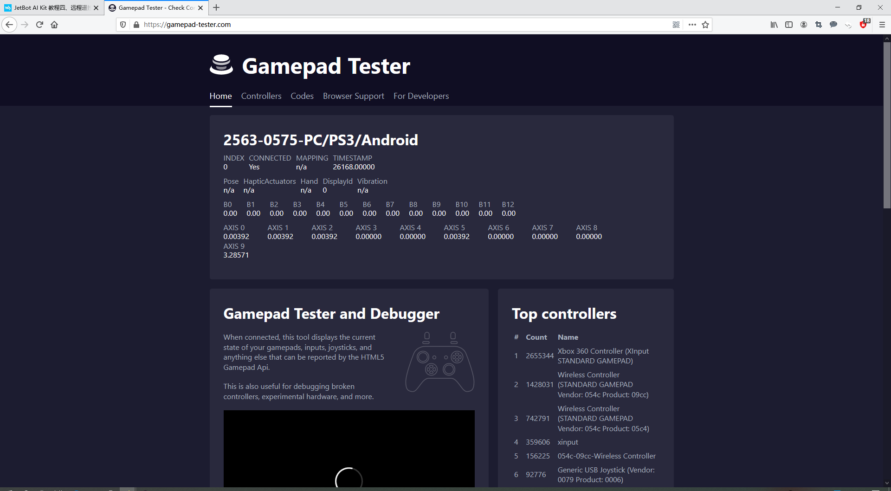
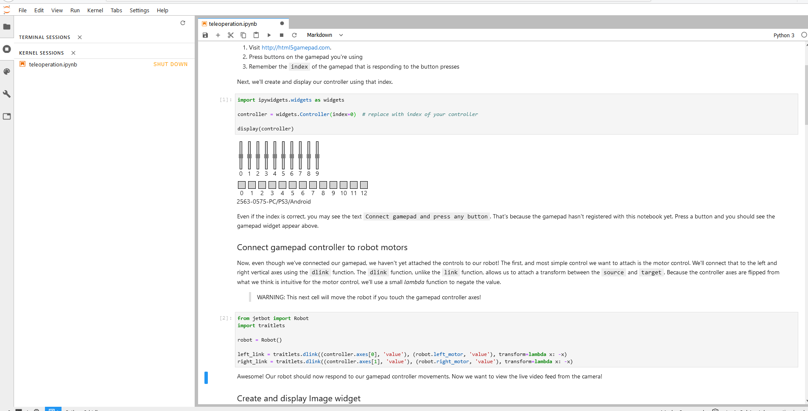

#  JetBot AI Kit 实验报告 | 实验四 远程遥控 #
## 【第五组】 ##
### 组长：解敖201809023 ###
### 组员：汪统201809012 邹博堃201809019 郭小凡201809027 ###


## 实验步骤 ##

1. 在浏览器地址栏输入http://<jetbot_ip_address>:8888连接到小车，左侧打开/Notebooks/teleoperation/路径下的teleoperation.ipynb文件。
2. 将游戏手柄接收器插到电脑USB口。
3. 打开https://html5gamepad.com/网页，检查是否可连接到遥控手柄，并记下对应设备的INDEX数值。



4. 按下遥控手柄按键对应的数值会变化。
5. 运行代码后窗口会输出游戏手柄对应的按键。



6. 修改axes值对应不同的按钮，此处为方便遥控改为axes[0], axels[1]。
7. 运行代码，显示当前摄像头拍摄到的画面。


8. “心跳”检查，当小车断网时小车会自动停止。
9.  通过按键控制小车拍照，改变button可以选择不同的按键。


10. 运行程序之后即可通过遥控手柄控制小车。Asex[0]控制左边轮子，Asex[1]控制右边笼子，button[0]控制拍照，左边图像显示摄像头实时画面，右边为拍摄的图片。


## 代码及解析 ##

```

//初始化并显示相机

import traitlets
import ipywidgets.widgets as widgets
from IPython.display import display
from jetbot import Camera, bgr8_to_jpeg

camera = Camera.instance(width=224, height=224)

image = widgets.Image(format='jpeg', width=224, height=224)  # this width and height doesn't necessarily have to match the camera

camera_link = traitlets.dlink((camera, 'value'), (image, 'value'), transform=bgr8_to_jpeg)

display(image)

//创建目录存储所有的数据。该段代码用于创建一个文件夹数据集，其中将包含两个子文件夹free和blocked，放置每个场景的图像。

mport os

blocked_dir = 'dataset/blocked'
free_dir = 'dataset/free'

# we have this "try/except" statement because these next functions can throw an error if the directories exist already
try:
    os.makedirs(free_dir)
    os.makedirs(blocked_dir)
except FileExistsError:
    print('Directories not created becasue they already exist')

//创建并显示一些按钮，后续可使用这些按钮来保存每个类标签的快照。

button_layout = widgets.Layout(width='128px', height='64px')
free_button = widgets.Button(description='add free', button_style='success', layout=button_layout)
blocked_button = widgets.Button(description='add blocked', button_style='danger', layout=button_layout)
free_count = widgets.IntText(layout=button_layout, value=len(os.listdir(free_dir)))
blocked_count = widgets.IntText(layout=button_layout, value=len(os.listdir(blocked_dir)))

display(widgets.HBox([free_count, free_button]))
display(widgets.HBox([blocked_count, blocked_button]))

//将每个类别的图像保存到按钮的on_click事件中。保存图片为压缩的JPEG格式。

from uuid import uuid1

def save_snapshot(directory):
    image_path = os.path.join(directory, str(uuid1()) + '.jpg')
    with open(image_path, 'wb') as f:
        f.write(image.value)

def save_free():
    global free_dir, free_count
    save_snapshot(free_dir)
    free_count.value = len(os.listdir(free_dir))
    
def save_blocked():
    global blocked_dir, blocked_count
    save_snapshot(blocked_dir)
    blocked_count.value = len(os.listdir(blocked_dir))
    
# attach the callbacks, we use a 'lambda' function to ignore the
# parameter that the on_click event would provide to our function
# because we don't need it.
free_button.on_click(lambda x: save_free())
blocked_button.on_click(lambda x: save_blocked())

//收集数据

display(image)
display(widgets.HBox([free_count, free_button]))
display(widgets.HBox([blocked_count, blocked_button]))

//关闭相机连接，以便后续使用。

camera.stop()

//将数据集文件夹压缩为单个zip文件。

!zip -r -q dataset.zip dataset

```

## 实验小结 ##
在本次实验中我们对小车施行远程控制，通过手柄控制小车的方向，同时我们进行了数据，通过实时收集小车摄像头传来的图片，进行数据统计，对远程控制小车的精准做了一个好的统计概括。同时在本次的实验中我们还学习和熟悉了收集数据的代码，对下一个实验目标巡线的实验数据收集有了一个更加好的效果。