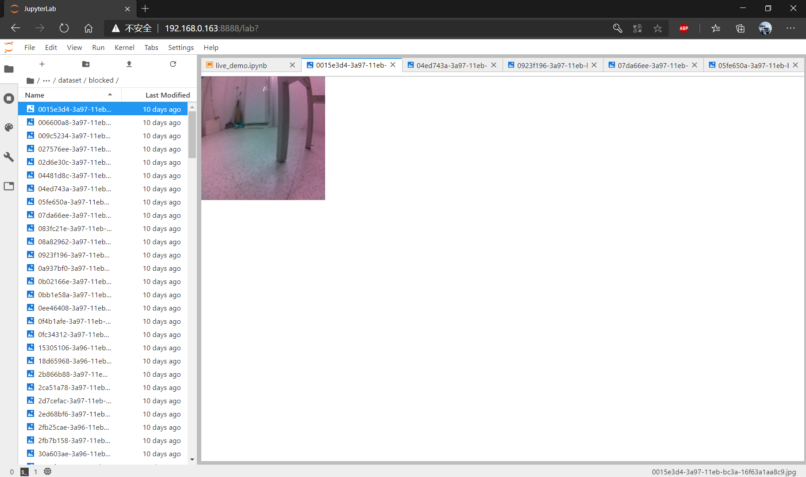
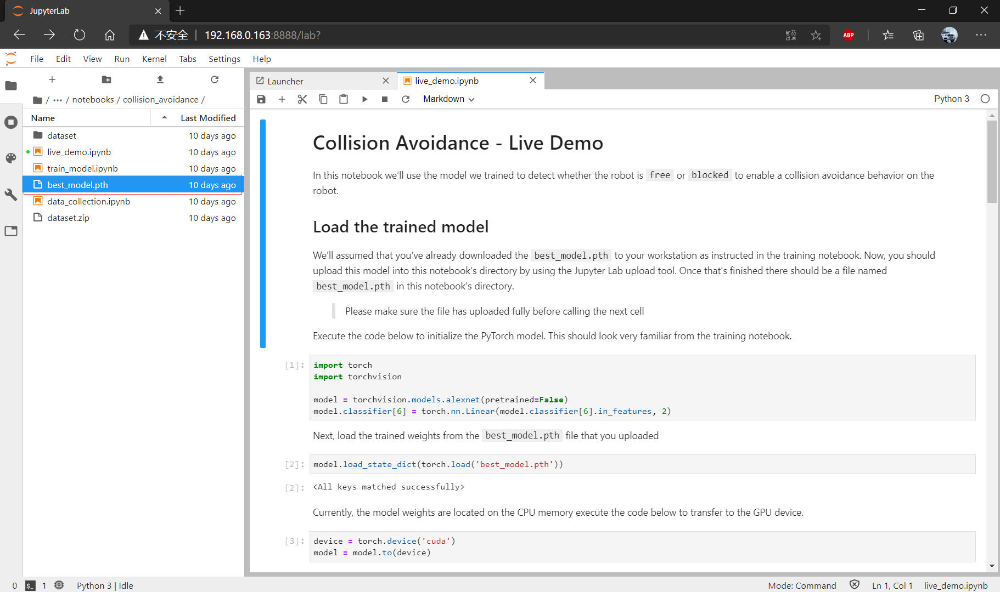
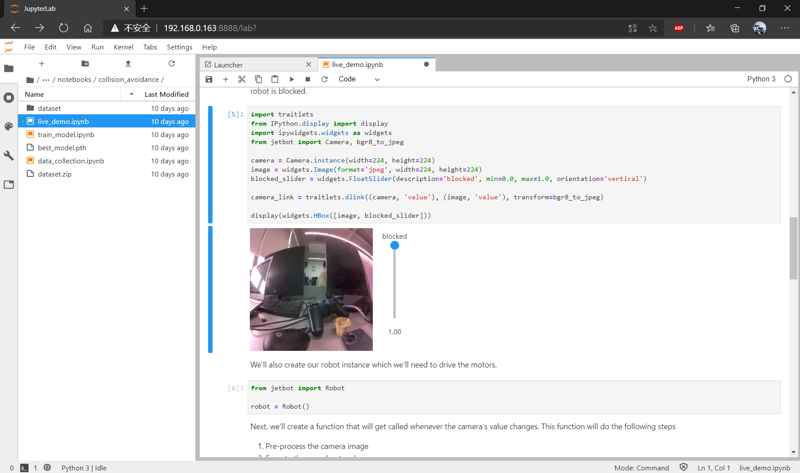

#  JetBot AI Kit 实验报告 | 实验五 自主避障 #
## 【第五组】 ##
### 组长：解敖201809023 ###
### 组员：汪统201809012 邹博堃201809019 郭小凡201809027 ###

## 在JetBot上收集数据 ##

$实验步骤$

1. 在浏览器地址栏输入http://<jetbot_ip_address>:8888连接到小车，页面左侧打开Notebooks/collision_avoidance/路径下的data_collection.ipynb文件。
2. 运行程序后出现如图所示界面，将小车放到不同的位置，如果前方没有障碍则点击add free. 如果小车前方有障碍就点击add blocked。



3. 运行程序打包图片，打包之后，在当前的目录下会出现一个dataset.zip压缩文件.

## 训练神经网络 ##

$实验步骤$

1. 在浏览器地址栏输入http://<jetbot_ip_address>:8888连接到小车，界面左侧打开Notebooks/collision_avoidance/路径下的train_model.ipynb文件。


2. 程序运行自动下载alexnet模型。下载程序后/home/jetbot/.torch/models目录下出现alexnet-owt-4df8aa71.pth文件。


3. 运行程序训练神经网络。训练完成，当前目录下出现best_mode.pth文件。



## 自助避障 ##

$实验步骤$

1. 在浏览器地址栏输入http://<jetbot_ip_address>:8888连接到小车，界面左侧打开Notebooks/collision_avoidance/路径下的live_demo.ipynb文件。

2. 运行程序后摄像头实时图像和滑条显示。其中：互调表示遇到障碍物的概率，0.00表示前方没有障碍物，1.00表示前方存在障碍物，小车需要转向避让。




## 代码及解析如下 ##

$加载训练模型$

```

//初始化PyTorch模型

import torch
import torchvision

model = torchvision.models.alexnet(pretrained=False)
model.classifier[6] = torch.nn.Linear(model.classifier[6].in_features, 2)

//加载经过训练的权重

model.load_state_dict(torch.load('best_model.pth'))

//将模型权重位于CPU内存执行下面的代码转移到GPU设备。

device = torch.device('cuda')
model = model.to(device)

```

$创建预处理函数$

```
//匹配训练模型的格式与相机的格式

import cv2
import numpy as np

mean = 255.0 * np.array([0.485, 0.456, 0.406])
stdev = 255.0 * np.array([0.229, 0.224, 0.225])

normalize = torchvision.transforms.Normalize(mean, stdev)

def preprocess(camera_value):
    global device, normalize
    x = camera_value
    x = cv2.cvtColor(x, cv2.COLOR_BGR2RGB)
    x = x.transpose((2, 0, 1))
    x = torch.from_numpy(x).float()
    x = normalize(x)
    x = x.to(device)
    x = x[None, ...]
    return x

//显示相机。
//创建滑动条显示机器人被阻塞的概率
//创建一个滑块控制机器人的基本速度

import traitlets
from IPython.display import display
import ipywidgets.widgets as widgets
from jetbot import Camera, bgr8_to_jpeg

camera = Camera.instance(width=224, height=224)
image = widgets.Image(format='jpeg', width=224, height=224)
blocked_slider = widgets.FloatSlider(description='blocked', min=0.0, max=1.0, orientation='vertical')
speed_slider = widgets.FloatSlider(description='speed', min=0.0, max=0.5, value=0.0, step=0.01, orientation='horizontal')

camera_link = traitlets.dlink((camera, 'value'), (image, 'value'), transform=bgr8_to_jpeg)

display(widgets.VBox([widgets.HBox([image, blocked_slider]), speed_slider]))

//创建robot实例驱动小车

from jetbot import Robot
robot = Robot()

//创建一个函数，每当摄像机的值发生变化时将调用该函数

import torch.nn.functional as F
import time

def update(change):
    global blocked_slider, robot
    x = change['new'] 
    x = preprocess(x)
    y = model(x)
    
    # we apply the `softmax` function to normalize the output vector so it sums to 1 (which makes it a probability distribution)
    y = F.softmax(y, dim=1)
    
    prob_blocked = float(y.flatten()[0])
    
    blocked_slider.value = prob_blocked
    
    if prob_blocked < 0.5:
        robot.forward(speed_slider.value)
    else:
        robot.left(speed_slider.value)
    
    time.sleep(0.001)
        
update({'new': camera.value})  # we call the function once to intialize

//停止小车避障行为

import time

camera.unobserve(update, names='value')

time.sleep(0.1)  # add a small sleep to make sure frames have finished processing

robot.stop()

//断开相机连接

camera_link.unlink()  # don't stream to browser (will still run camera)

//关闭相机，便于后续使用

camera.stop()

```

## 实验小结 ##
本次的实验我们通过运用神经网络架构，训练神经网络用来完成小车自动避障行为，在本次的实验中，我们对于神经网络有了一个更加完善的了解，同时对于小车自动避障有了初步的了解和认知，对于小车自动避障行为的代码有了初步的熟悉，同时该次实验还对我们的专业无人驾驶汽车中的自动避障有了一个更好的了解和认识，让我们对于无人驾驶有了新、仔细的知识了解。