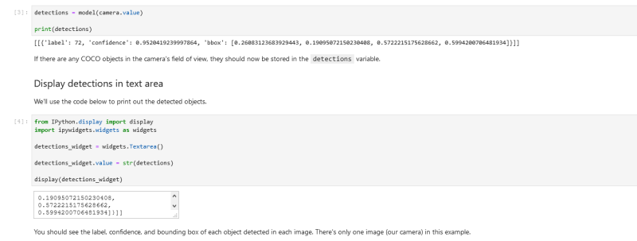
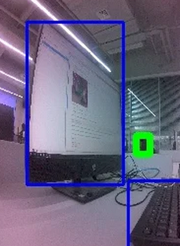

#  JetBot AI Kit 实验报告 | 实验六 目标跟踪 #
## 【第五组】 ##
### 组长：解敖201809023 ###
### 组员：汪统201809012 邹博堃201809019 郭小凡201809027 ###

## 实验步骤 ##

1. 在浏览器地址栏输入http://<jetbot_ip_address>:8888连接到小车，界面左侧打开Notebook/object_following/路径下的live_demo.ipynb文件。
2. 将训练完成的ssd_mobilenet_v2_coco.engine模型下载，解压后复制到当前文件夹目录下。
3. 将检测对象放到摄像头前面。
4. 运行程序，输出检测到的coco对象。若没有检测到对象则输出空数据[[ ]]。



5. 运行输出如图所示。




## 代码及解析 ##

```

//导入ObjectDetector类

from jetbot import ObjectDetector

model = ObjectDetector('ssd_mobilenet_v2_coco.engine')

//初始化摄像机，设置像素300x300

from jetbot import Camera

camera = Camera.instance(width=300, height=300)

//使用相机输入

detections = model(camera.value)

print(detections)

//打印检测到的对象

from IPython.display import display
import ipywidgets.widgets as widgets

detections_widget = widgets.Textarea()

detections_widget.value = str(detections)

display(detections_widget)

//调用函数打印第一张图像中检测到的第一个对象

image_number = 0
object_number = 0

print(detections[image_number][object_number])

```

$控制机器人跟随中心目标$
```

//加载碰撞检测模型

import torch
import torchvision
import torch.nn.functional as F
import cv2
import numpy as np

collision_model = torchvision.models.alexnet(pretrained=False)
collision_model.classifier[6] = torch.nn.Linear(collision_model.classifier[6].in_features, 2)
collision_model.load_state_dict(torch.load('../collision_avoidance/best_model.pth'))
device = torch.device('cuda')
collision_model = collision_model.to(device)

mean = 255.0 * np.array([0.485, 0.456, 0.406])
stdev = 255.0 * np.array([0.229, 0.224, 0.225])

normalize = torchvision.transforms.Normalize(mean, stdev)

def preprocess(camera_value):
    global device, normalize
    x = camera_value
    x = cv2.resize(x, (224, 224))
    x = cv2.cvtColor(x, cv2.COLOR_BGR2RGB)
    x = x.transpose((2, 0, 1))
    x = torch.from_numpy(x).float()
    x = normalize(x)
    x = x.to(device)
    x = x[None, ...]
    return x

//初始化小车

from jetbot import Robot

robot = Robot()

//显示所有可控制部件

from jetbot import bgr8_to_jpeg

blocked_widget = widgets.FloatSlider(min=0.0, max=1.0, value=0.0, description='blocked')
image_widget = widgets.Image(format='jpeg', width=300, height=300)
label_widget = widgets.IntText(value=1, description='tracked label')
speed_widget = widgets.FloatSlider(value=0.4, min=0.0, max=1.0, description='speed')
turn_gain_widget = widgets.FloatSlider(value=0.8, min=0.0, max=2.0, description='turn gain')

display(widgets.VBox([
    widgets.HBox([image_widget, blocked_widget]),
    label_widget,
    speed_widget,
    turn_gain_widget
]))

width = int(image_widget.width)
height = int(image_widget.height)

def detection_center(detection):
    """Computes the center x, y coordinates of the object"""
    bbox = detection['bbox']
    center_x = (bbox[0] + bbox[2]) / 2.0 - 0.5
    center_y = (bbox[1] + bbox[3]) / 2.0 - 0.5
    return (center_x, center_y)
    
def norm(vec):
    """Computes the length of the 2D vector"""
    return np.sqrt(vec[0]**2 + vec[1]**2)

def closest_detection(detections):
    """Finds the detection closest to the image center"""
    closest_detection = None
    for det in detections:
        center = detection_center(det)
        if closest_detection is None:
            closest_detection = det
        elif norm(detection_center(det)) < norm(detection_center(closest_detection)):
            closest_detection = det
    return closest_detection
        
def execute(change):
    image = change['new']
    
    # execute collision model to determine if blocked
    collision_output = collision_model(preprocess(image)).detach().cpu()
    prob_blocked = float(F.softmax(collision_output.flatten(), dim=0)[0])
    blocked_widget.value = prob_blocked
    
    # turn left if blocked
    if prob_blocked > 0.5:
        robot.left(0.3)
        image_widget.value = bgr8_to_jpeg(image)
        return
        
    # compute all detected objects
    detections = model(image)
    
    # draw all detections on image
    for det in detections[0]:
        bbox = det['bbox']
        cv2.rectangle(image, (int(width * bbox[0]), int(height * bbox[1])), (int(width * bbox[2]), int(height * bbox[3])), (255, 0, 0), 2)
    
    # select detections that match selected class label
    matching_detections = [d for d in detections[0] if d['label'] == int(label_widget.value)]
    
    # get detection closest to center of field of view and draw it
    det = closest_detection(matching_detections)
    if det is not None:
        bbox = det['bbox']
        cv2.rectangle(image, (int(width * bbox[0]), int(height * bbox[1])), (int(width * bbox[2]), int(height * bbox[3])), (0, 255, 0), 5)
    
    
        
    # otherwise go forward if no target detected
    if det is None:
        robot.forward(float(speed_widget.value))
        
    # otherwsie steer towards target
    else:
        # move robot forward and steer proportional target's x-distance from center
        center = detection_center(det)
        robot.set_motors(
            float(speed_widget.value + turn_gain_widget.value * center[0]),
            float(speed_widget.value - turn_gain_widget.value * center[0])
        )
    
    # update image widget
    image_widget.value = bgr8_to_jpeg(image)
    
execute({'new': camera.value})

//execute函数连接到相机控制帧更新

camera.unobserve_all()
camera.observe(execute, names='value')

//如果摄像头没有被阻挡，可以看到在检测到的物体周围有蓝色方框。目标对象将显示为绿色。

//当检测到目标时，小车该朝着目标方向行驶。如果它被一个物体挡住了，它就会向左转弯。

//手动断开与摄像机的处理并停止小车运行

import time

camera.unobserve_all()
time.sleep(1.0)
robot.stop()

//关闭相机，以便后续实验使用

camera.stop()

```

## 实验小结 ##
在本次的实验中我们进行了小车跟踪测试，通过运行代码设置目标对象，让小车进行跟踪。在本次的实验中，我们了解和发现小车的摄像头就类似于人的眼睛对环境进行检测，而当摄像头被挡住了之后，就和盲人一样，无法判断环境，找不到目标，无法进行跟踪。我们在实验中熟悉了objectdoctor类的代码，同时对于jetbot小车和无人驾驶汽车我们又有了全新的想法和观点。