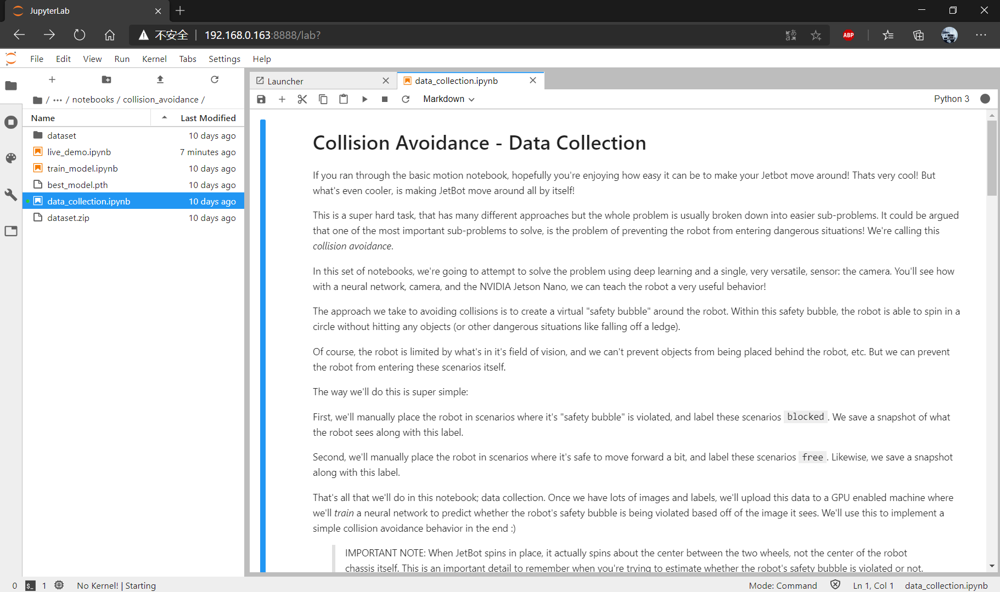
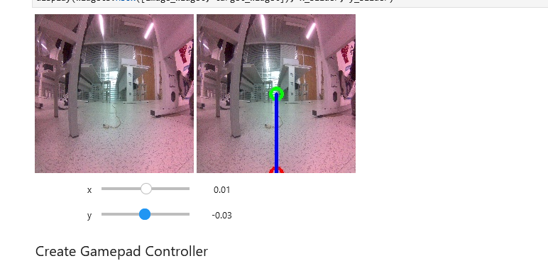
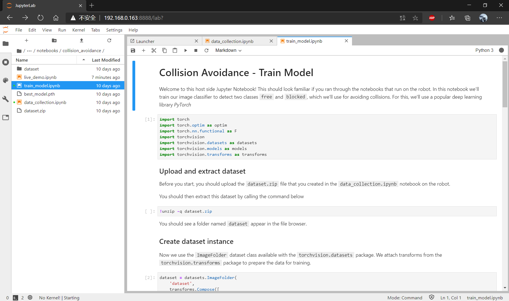
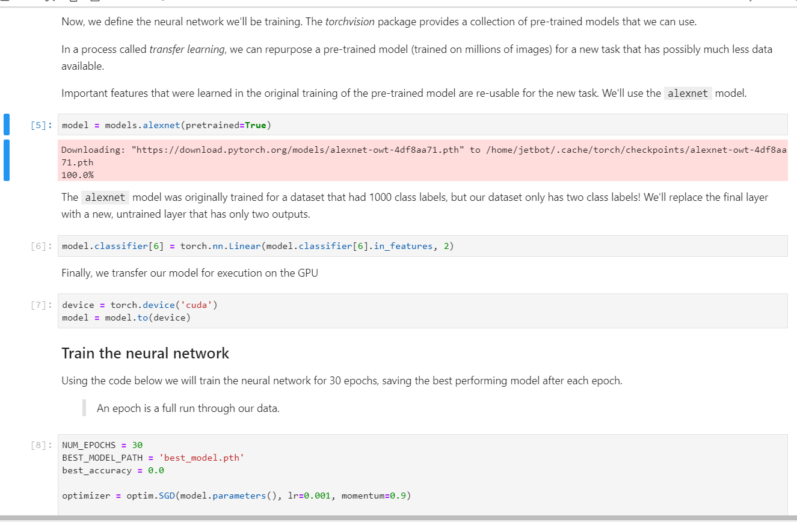
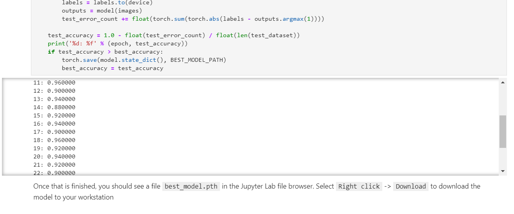

#  JetBot AI Kit 实验报告 | 实验七 目标巡线 #
## 【第五组】 ##
### 组长：解敖201809023 ###
### 组员：汪统201809012 邹博堃201809019 郭小凡201809027 ###

## 在JetBot上收集数据 ##

$实验步骤$

1. 在浏览器输入http://<jetbot_ip_address>:8888连接到小车，找到并打开Notebooks/road_following/路径下的data_collection.ipynb文件。



2. 程序运行后会显示当前摄像头的测试图像。
   

   
右边图像显示的绿点和蓝色线用于表示小车应该运行的路线。

3. 将输出窗口用新窗口打开。
4. 修改index为实际手柄对应的标号。修改axes为要控制的按键。

5. 修改button值，设置对应的按键为拍摄图片按键。

6. 将小车放置到线的不同位置，控制手柄的方向键，将绿色点拖到黑线上。蓝色线即表示小车应该运行的方向。然后按下按键拍照收集图片数据。count表示已经拍摄的图片数量。
7. 运行保存下来的拍摄的图片。


## 训练神经网络 ##

1. 在浏览器地址栏输入http://<jetbot_ip_address>:8888连接到小车，找到并打开Notebooks/road_following路径下的train_model.ipynb文件。



2. 下载神经模型



3. 训练神经模型，当前目录下生成best_steering_model_xy.pth文件。



## 自主巡线 ##

1. 在浏览器地址栏输入http://<jetbot_ip_address>:8888连接到小车，找到并打开Notebooks/road_following路径下的live_demo.ipynb文件。
2. 运行程序后会自动加载模型，打开摄像头实时显示图像。可通过拖动滑条改变摄像头拍摄图像参数的值。


3. 输出展示jetbot当前运行情况。


图中x，y表示当前图像预测的x,y值，可以表示转动角度。speed表示jetbot直线速度，steering表示转向速度。

4. 运行程序小车转动。


## 代码及解析 ##

```

//导入数据收集所需的所有库，使用OpenCV可视化和保存带有标签的图像

# IPython Libraries for display and widgets
import ipywidgets
import traitlets
import ipywidgets.widgets as widgets
from IPython.display import display

# Camera and Motor Interface for JetBot
from jetbot import Robot, Camera, bgr8_to_jpeg

# Python basic pakcages for image annotation
from uuid import uuid1
import os
import json
import glob
import datetime
import numpy as np
import cv2
import time

//数据收集，显示实时图像提要

from jupyter_clickable_image_widget import ClickableImageWidget

DATASET_DIR = 'dataset_xy'

# we have this "try/except" statement because these next functions can throw an error if the directories exist already
try:
    os.makedirs(DATASET_DIR)
except FileExistsError:
    print('Directories not created becasue they already exist')

camera = Camera()

# create image preview
camera_widget = ClickableImageWidget(width=camera.width, height=camera.height)
snapshot_widget = ipywidgets.Image(width=camera.width, height=camera.height)
traitlets.dlink((camera, 'value'), (camera_widget, 'value'), transform=bgr8_to_jpeg)

# create widgets
count_widget = ipywidgets.IntText(description='count')
# manually update counts at initialization
count_widget.value = len(glob.glob(os.path.join(DATASET_DIR, '*.jpg')))

def save_snapshot(_, content, msg):
    if content['event'] == 'click':
        data = content['eventData']
        x = data['offsetX']
        y = data['offsetY']
        
        # save to disk
        #dataset.save_entry(category_widget.value, camera.value, x, y)
        uuid = 'xy_%03d_%03d_%s' % (x, y, uuid1())
        image_path = os.path.join(DATASET_DIR, uuid + '.jpg')
        with open(image_path, 'wb') as f:
            f.write(camera_widget.value)
        
        # display saved snapshot
        snapshot = camera.value.copy()
        snapshot = cv2.circle(snapshot, (x, y), 8, (0, 255, 0), 3)
        snapshot_widget.value = bgr8_to_jpeg(snapshot)
        count_widget.value = len(glob.glob(os.path.join(DATASET_DIR, '*.jpg')))
        
camera_widget.on_msg(save_snapshot)

data_collection_widget = ipywidgets.VBox([
    ipywidgets.HBox([camera_widget, snapshot_widget]),
    count_widget
])

display(data_collection_widget)

//关闭相机，以便后续实验使用

camera.stop()

```

$训练模型$

```

//调用终端命令将数据集文件夹压缩为单个zip文件夹

def timestr():
    return str(datetime.datetime.now().strftime('%Y-%m-%d_%H-%M-%S'))

!zip -r -q road_following_{DATASET_DIR}_{timestr()}.zip {DATASET_DIR}

```

## 实验小结 ##
本次的实验，我们运用神经网络模型，运用了opencv可视化，并且对数据进行了收集，在本次的实验中我们对opencv的代码进行了解析和运用，对于小车的实验有了更好的认知和熟悉，对于我们对于jetbot小车的掌握有了更好的帮助。