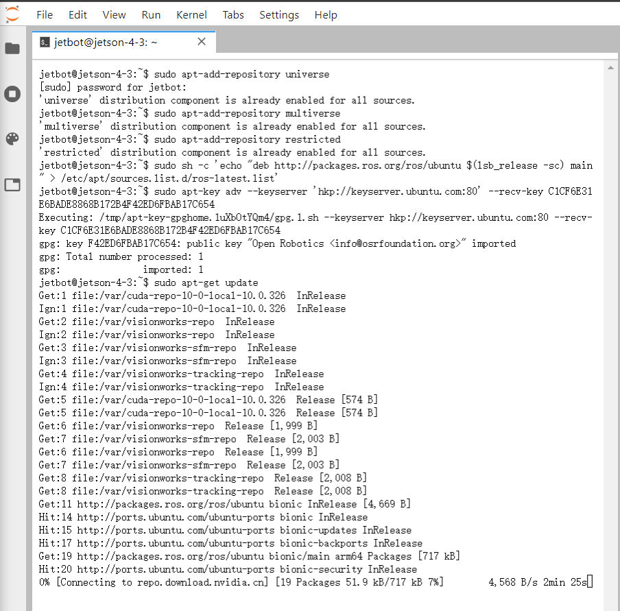
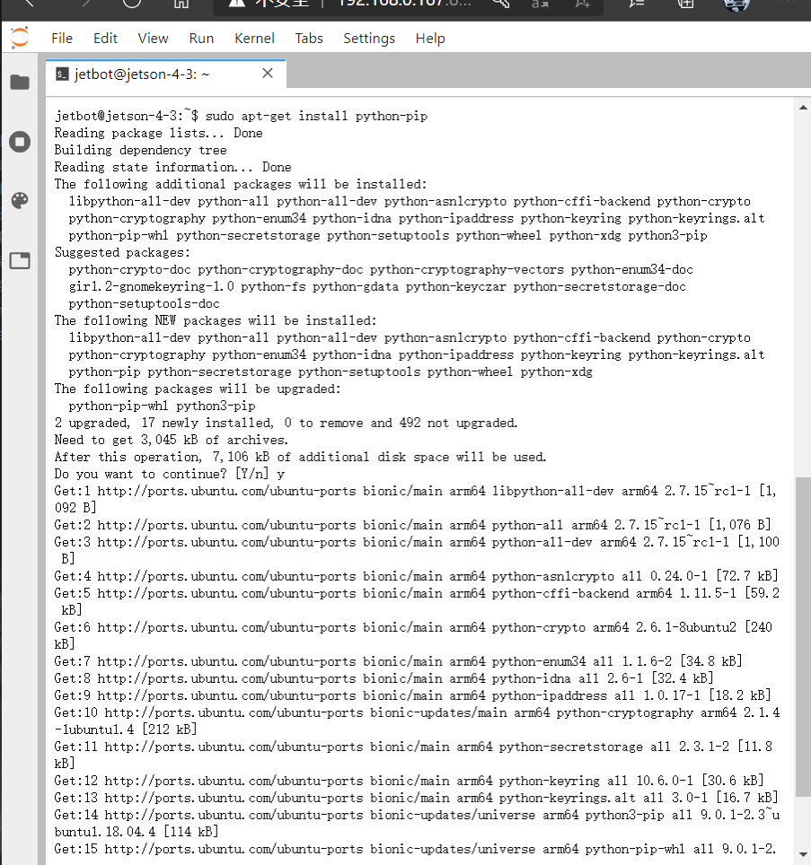
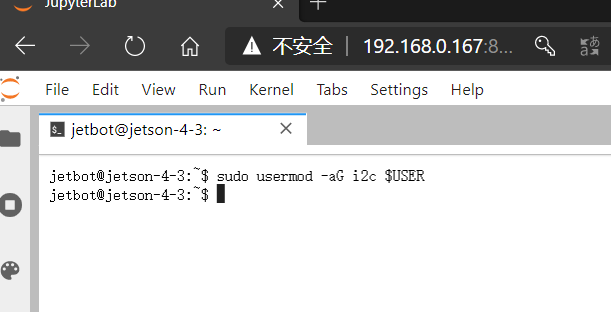
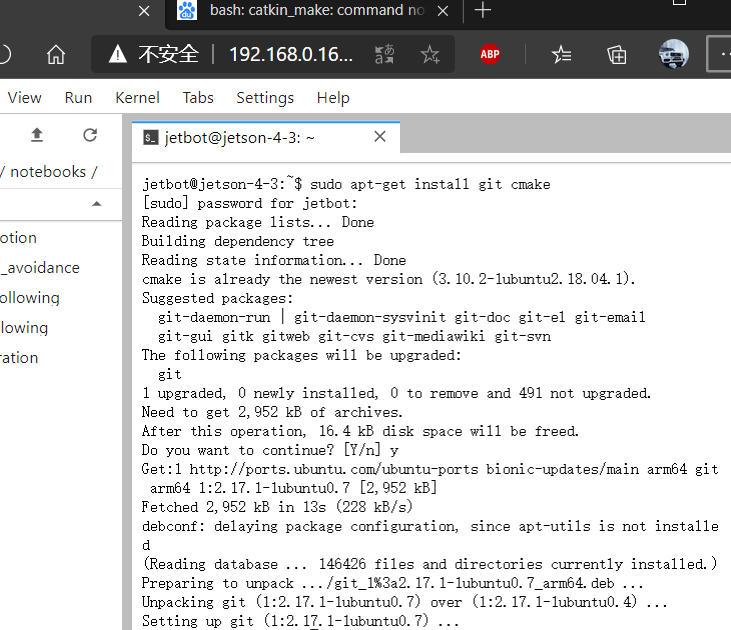
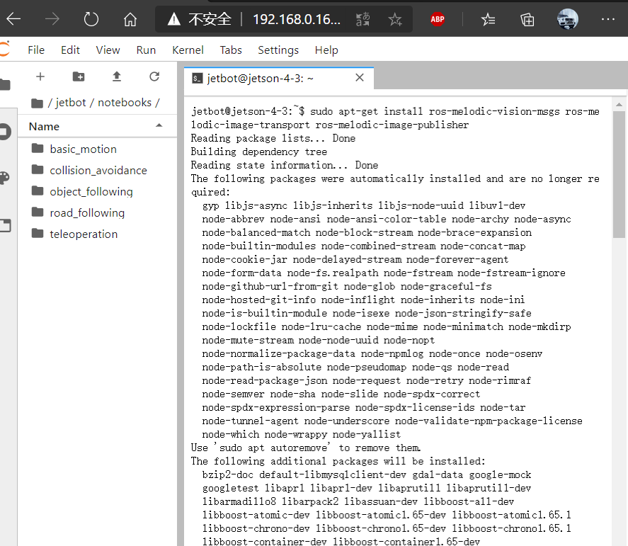
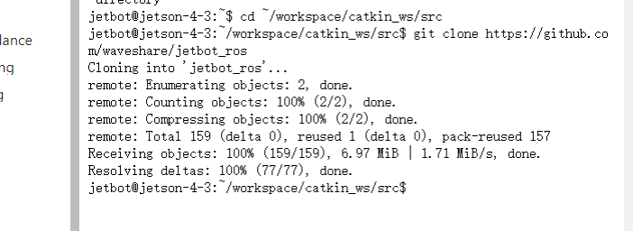
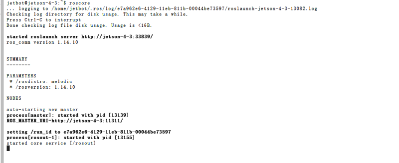
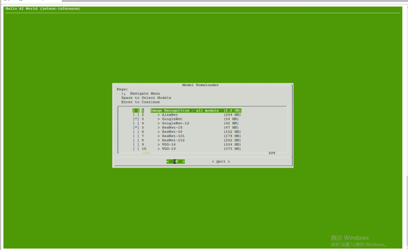

#  JetBot AI Kit 实验报告 | 实验八 ROS #
## 【第五组】 ##
### 组长：解敖201809023 ###
### 组员：汪统201809012 邹博堃201809019 郭小凡201809027 ###

## 安装melodic版本ROS ##

$实验步骤$

1. 输入指令安装系统镜像。



2. 安装python库。



3. 添加i2c到user用户组。



## 创建catkin工作空间 ##

$实验步骤$

1. 创建catkin工作空间保存ROS程序包。


2. 关闭当前运行指令的终端，重新打开一个新的终端，确认ROS安装成功。


## 编译安装 jetson-inference ##



## 编译安装 ros_deep_learning ##



## 编译安装 jetbot_ros ##



## 测试 jetbot ROS ##

1. 打开终端输入指令。
   
   ```
   roscore
   ```

   输出如下信息，ROS工作正常。



2. 重新开启一个终端，输入rosnode list可以查看jetbot_motors节点是否启动。
3. 输入rostopic list可以查看jetbot_motor节点监听的话题。


4. 开启一个新的终端测试电机命令，运行如下测试命令：
   ```
   #rostopic pub /jetbot_motors/cmd_str std_msgs/String --once "forward"
   #rostopic pub /jetbot_motors/cmd_str std_msgs/String --once "backward"
   #rostopic pub /jetbot_motors/cmd_str std_msgs/String --once "left"
   #rostopic pub /jetbot_motors/cmd_str std_msgs/String --once "right"
   #rostopic pub /jetbot_motors/cmd_str std_msgs/String --once "stop"
   ```

5. 使用OLED显示信息。
   新建一个终端运行OLED节点。
   ```
   rosrun jetbot_ros jetbot_oled.py
   ```

6. 使用键盘控制jetbot移动。
   新建一个终端运行teleop_key节点。
   ```
   rosrun jetbot_ros teleop_key.py
   ```
   程序运行后通过键盘输入W、S、D、A四个按键控制jetbot前后左右移动。


7. 使用游戏摇杆控制jetbot移动。
   将游戏手柄的USB接收器插到jetbot。
   新建一个终端输入以下命令。
   ```
   ls /dev/input
   ```


8. 输入命令测试设备是否正常工作：

```
sudo jstest /dev/input/js0
```
结果如下：


1. 使用摄像头实时监控。
    启动jetbot_camera节点，启动jetbot摄像头视频流。
    运行如下命令显示摄像头图像：
    ```
    rosrun rqt_image_view rqt_image_view
    ```




## 代码及解析 ##

```

//创建手柄控制器

import ipywidgets.widgets as widgets

controller = widgets.Controller(index=1)  # replace with index of your controller

display(controller)

//连接手柄控制器

from jetbot import Robot
import traitlets

robot = Robot()

left_link = traitlets.dlink((controller.axes[1], 'value'), (robot.left_motor, 'value'), transform=lambda x: -x)
right_link = traitlets.dlink((controller.axes[3], 'value'), (robot.right_motor, 'value'), transform=lambda x: -x)

//创建和显示图像小部件

image = widgets.Image(format='jpeg', width=300, height=300)

display(image)

//创建相机控制

from jetbot import Camera

camera = Camera.instance()

//连接相机到图像读取

from jetbot import bgr8_to_jpeg

camera_link = traitlets.dlink((camera, 'value'), (image, 'value'), transform=bgr8_to_jpeg)

//网络断开，小车停止

from jetbot import Heartbeat


def handle_heartbeat_status(change):
    if change['new'] == Heartbeat.Status.dead:
        camera_link.unlink()
        left_link.unlink()
        right_link.unlink()
        robot.stop()

heartbeat = Heartbeat(period=0.5)

# attach the callback function to heartbeat status
heartbeat.observe(handle_heartbeat_status, names='status')

//重新创建链接，重新连接相机和电机

left_link = traitlets.dlink((controller.axes[1], 'value'), (robot.left_motor, 'value'), transform=lambda x: -x)
right_link = traitlets.dlink((controller.axes[3], 'value'), (robot.right_motor, 'value'), transform=lambda x: -x)
camera_link = traitlets.dlink((camera, 'value'), (image, 'value'), transform=bgr8_to_jpeg)

//用手柄按钮保存快照

import uuid
import subprocess

subprocess.call(['mkdir', '-p', 'snapshots'])

snapshot_image = widgets.Image(format='jpeg', width=300, height=300)

def save_snapshot(change):
    # save snapshot when button is pressed down
    if change['new']:
        file_path = 'snapshots/' + str(uuid.uuid1()) + '.jpg'
        
        # write snapshot to file (we use image value instead of camera because it's already in JPEG format)
        with open(file_path, 'wb') as f:
            f.write(image.value)
            
        # display snapshot that was saved
        snapshot_image.value = image.value


controller.buttons[5].observe(save_snapshot, names='value')

display(widgets.HBox([image, snapshot_image]))
display(controller)

//关闭相机，以便后续使用

camera.stop()

```

## 实验小结 ##
在本次实验中，我们进行了一次完整的小车测试，对于实验的代码和流程有了更好的认知，并且我们克服这些困难，使我们自己不断的进步。当然通过对jetbot小车的实验使我们更加深刻的了解我们的专业无人驾驶汽车，对自我的专业有了一个更加深刻的认识，为以后的发展有了一个更好的基础