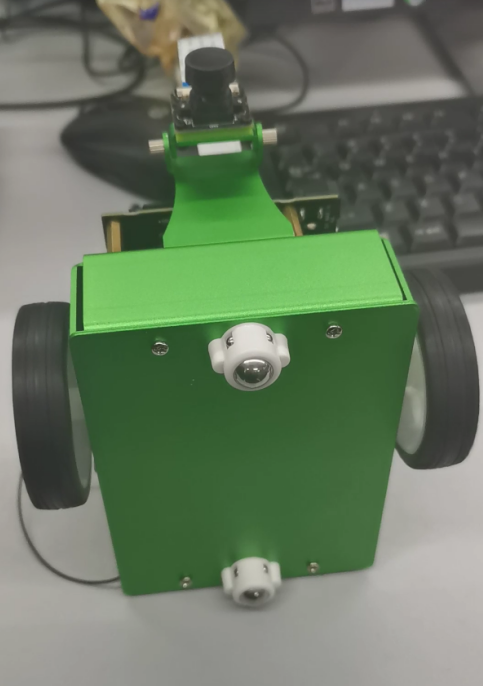
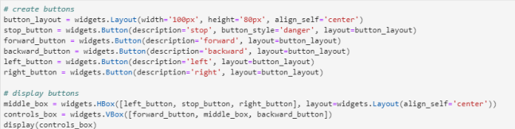
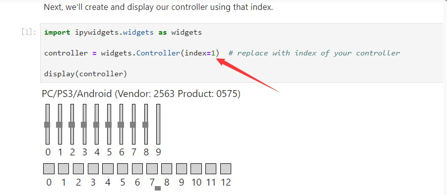
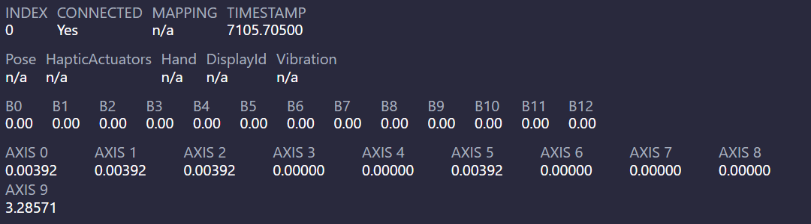
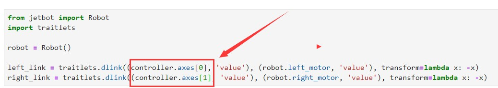
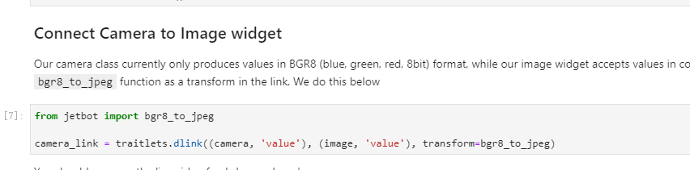
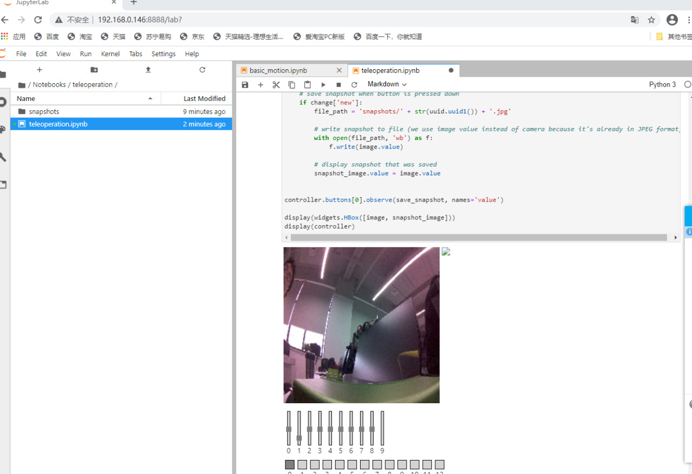
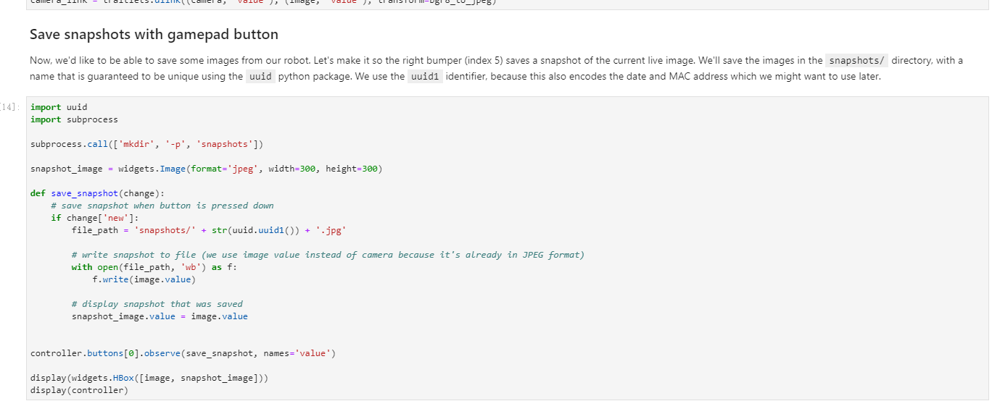

# 电机驱动

在浏览器地址栏输入http://<jetbot_ip_address>:8888连接到小车，左侧打开/Notebooks/basic_motion/。打开basic_motion.ipynb文件 


带有lpynb后缀的文件为lpython Notebook文件，包括注释文本和python程序。可以通过点击Run->Run Select Cells或者点击运行快捷图标▶来运行单段程序。 

【注意】文本中有详细的程序注释说明，认真阅读注释即可明白程序功能 

运行语句robot.left(speed=0.3)时，小车会向左转圈（需要确保小车有足够的空间移动）。运行此段程序后，会输出左右两条滑条，拖动滑条可以改变左右点击的转速



```
left_slider=widgets.FloatSlider(description='left',min=-1.0,max=1.0，step=0.01,orientation='vertical')
```
此代码可以看到可以控制左右轮的转速，分别可以设置最小值和最大值，规定范围后，创建容器，然后显示即可。


运行此段代码之后，你可以通过网页按键来控制小车的前后左右移动了。【注意】你可以通过右键该段代码->Create New View for Output 将输出窗口作为新页面打开。



这段代码是实现网页控制小车，stop button 直接对应”stop”即可，其他按键一样


# 远程遥控

    在浏览器地址栏输入http://<jetbot_ip_address>:8888连接到小车，左侧打开/Notebooks/teleoperation/。打开teleoperation.ipynb文件
    将游戏手柄接收器插到电脑USB口，【注意】接收器是要接到电脑而不是接到jetson nano上，游戏手柄需要接到打开JupyterLab网页的设备上。
    打开https://html5gamepad.com/网页，看下是否检查到遥控手柄。记下对应设备的INDEX数值为多少
    按下遥控手柄按键对应的数值会变化。几下对应按键的名称。 




注意程序中的index需要修改为实际遥控手柄对应的值，在刚才打开的网页中可以看到对应的INDEX。按下按键对应的按键图标会提示按键已按下 。





修改axes值对应不同的按钮，此处为方便遥控改为axes[0], axels[1] 




接下来连接摄像头



实际画面如下：



接下来用手柄保存快照，
```
controller.buttons[0].observe(save_snapshot, names='value')
```
此代码可以改变button可以选择不同的按键，此处为了方便控制选择buttons[0] 



## 总结以及心得体会

a.电机驱动：这个部分的实验主要就是跑代码，不是在运行就是在运行的路上。我们是在别人已经写好的代码上运行，没有任何难度，缺点是需要慢慢的运行，运行一段需要等几秒才能运行下一段，不然这个小车反应不过来就会动不了。这个实验主要就是小车的移动和转向。驱动电机是最基础的指令，可以通过自调speed来实现控速，经过测试速度区间在0.0-1.0，速度分级并不明显可见硬件指令的设计并没有太细，如上描述最小识别单位级是10^(-1)。顺序跑完代码感觉做基本的调试还是可能的，最后stop()函数——小车停转。
b.远程遥控：在做这个实验的时候，手柄出了问题。最开始是检查不到遥控手柄，然后检查了电池，发现电池其实是有点松了，解决了这个问题后就成功的检查到了手柄，还有就是手柄按键的index说实话现在还是没有记清楚。运行代码的时候要注意代码里的index值和你的按键的index值是否对应。不然可能按了按键没有反应。在实际连接操作的过程中发现十字键控制是左键为正方向，即左向前，右向后，下向左，上向右，当然这是代码中按键映射的问题，是可以调整的。
