如下长图所示 Display Live Camera Feed中显示出来了，巡线的检测,代码的运行如下
```Pyhton
camera = Camera()
image_widget = widgets.Image(format='jpeg', width=224, height=224)target_widget = widgets. Image(format='jpeg', width=224,height=224)
x_slider = widgets.FloatSlider(min=-1.0,max=1.0,step=0.001,description='x')y_slider = widgets.FloatSlider(min=-1.0, max=1.0, step=0.001,description='y')
def display_xy(camera_image):
image = np.copy(camera_image)x = x_slider.value
y= y_slider.value
x = int(x* 224/2+112)y = int(y* 224/ 2+112)
image =cv2.cirele(image, (x, y), 8,(0，255,0)，3)image = cv2.circle(image,(112,224), 8，(0, 0,255), 3)image =cv2.line(image,(x,y),(112,224),(255,0,0),3)jpeg_image = bgr8_to_jpeg(image)
return jpeg_image
time.sleep(1)
traitlets.dlink((camera, 'value'), (image_widget, 'value'), transform=bgr8_to_jpeg)traitlets.dlink((camera,'value'), (target_widget, 'value'), transform=display_xy)
display(widgets.HBox([image_widget,target_widget]), x_slider, y_slider)

```
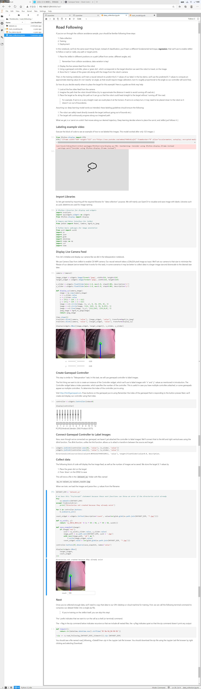
训练神经网络
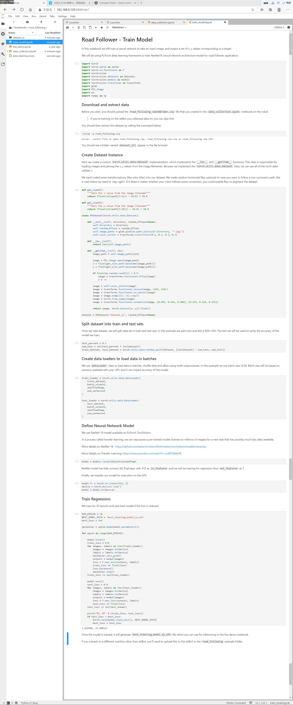
根据神经网络进行自主巡线
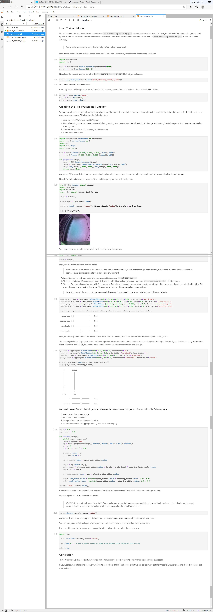
最中的实现视频如下

<video src="目标巡线.mp4" width="600px" height="400px" controls="controls"></video>

Ros如下
如下是添加包以及安装Rose
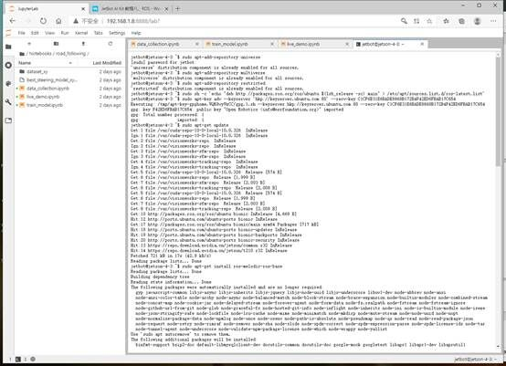
安装Python库
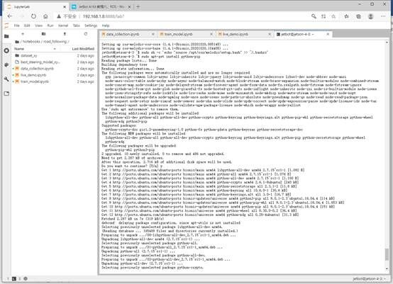
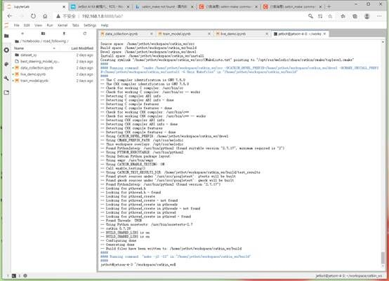
编译安装jetson-inference
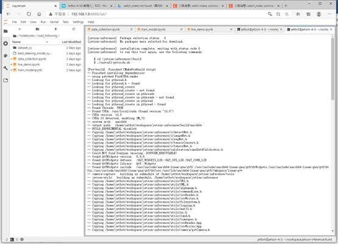
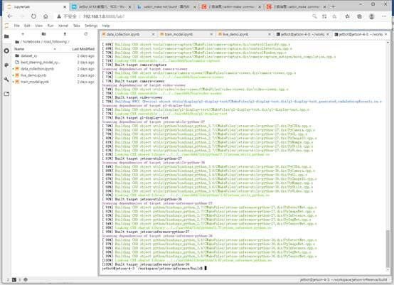
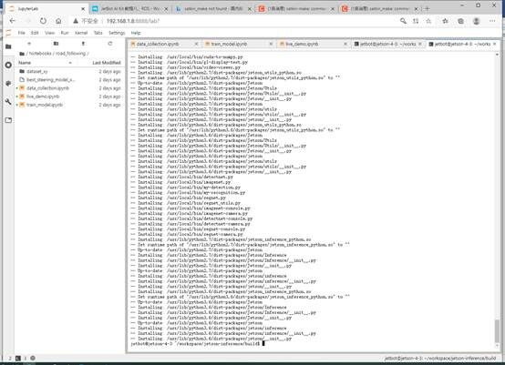
安装一下库
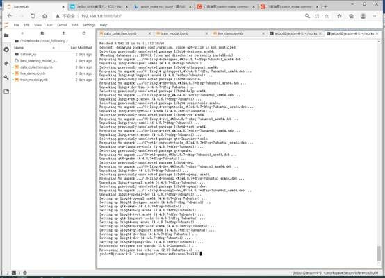
编译安装ros_deep_learning 编译安装jetbot_ros
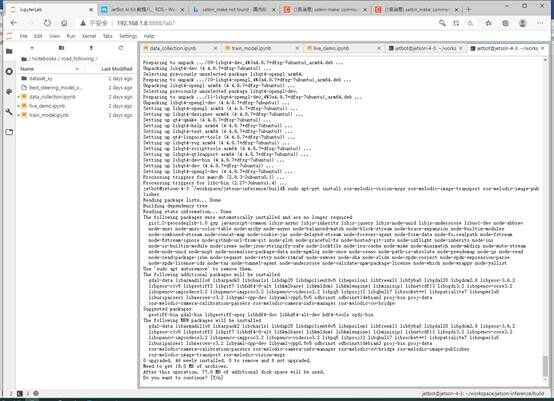
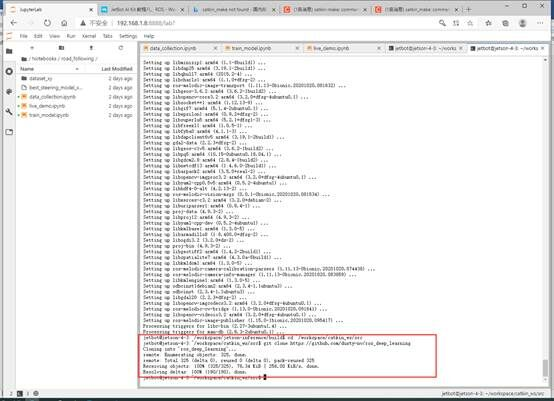
测试jetbot ROS roscore
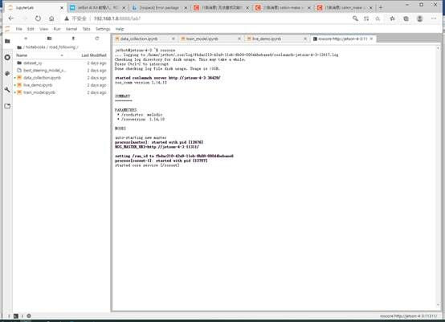

## 结果分析

后面的实验由于不断的报错，无法继续运行下去，已经尽力了，希望老师可以理解一下，不愿意抄袭别人的成果。我觉得还是很努力的。后面的实验做不了了哈

## 目标巡线和ROS的总结以及心得体会

a.目标巡线：这步我们用的黑色鼠标线作为寻线标准，通过素材识别获得了100张采集图，和上面的实验类似，通过学习程序学习之后。当我们实际运行时发现了问题。我们按照惯性思维为他设计了寻线路径，他是条直线。所以当线变得曲折时他停了下来，这是在是我们的失败，采集了100张直线实际上只采集了一张图片，我们不得不再一次进行图片采集。这是个很憨批的错误，然而当时做的时候忘记提醒了。因此我觉得训练模型是真的复杂，情况不能过于单一，最好是有各种情况，但是条件也不是很允许。
b.新认识的系统必然导致没见过的报错，ros的摸索和初始centos和liunx一样遇到各种这样的指令问题，提供的代码直接运行出现各种各样的错误已经见怪不怪了，这部分的实验进度缓慢我想也是可以理解的。没见过，多试试，总没错误的。

