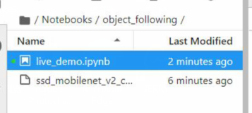
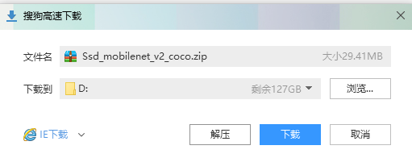
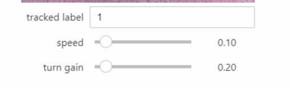
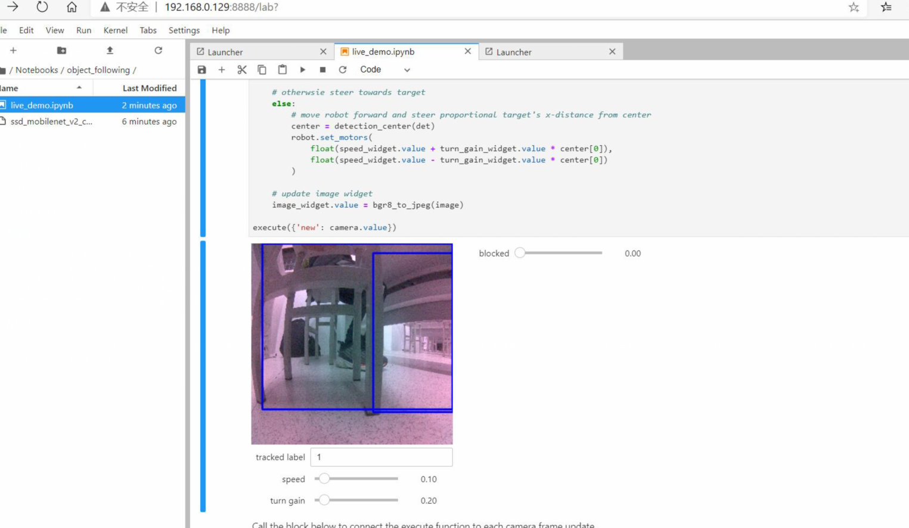

# 目标跟踪

 ## Object-detection

 1. 打开live_demo.ipynb文件。
   
 
 
 2. ssd_mobilenet_v2_coco.engine模型下载。
 
 

 3. 适当调节speed和turn gain的值。
 
 
 
 4. 实际效果

 

 ## 结果分析

 - 实验流程需要新的模型，直接下载训练好的文件即可。
 - 调整speed和turn gain的值会让小车运动更平滑，turn gain值过高会持续触发避障导致原地旋转。
 - 识别浅色物体效果不好，小件物体且为白色效果更不好。
 - 观察blocked值可以发现之前运行的避障系统效果尚可。
 - 识别速度并不是很快，建议开阔地域识别或者拿起小车识别（本组选择后者）

 ## 心得总结

 - 代码流程大同小异，先下载学习模型，这一步还省了一步素材采集。实际运行效果看起来还不错，可以识别桌子腿，鞋子和其他障碍物，但遗憾的是唯一不能识别的是我们用来测试的白色乒乓球，可能颜色和大小的问题导致识别失败，具体原因不明，block识别条也没有反应，我只能判断程序学习过程中出了问题。