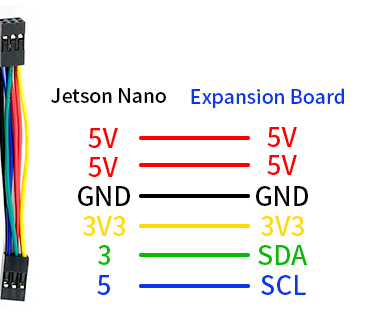
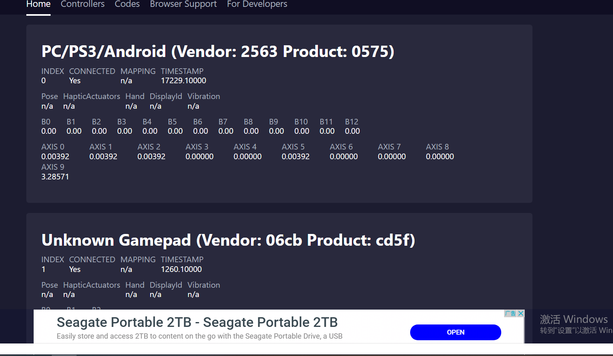
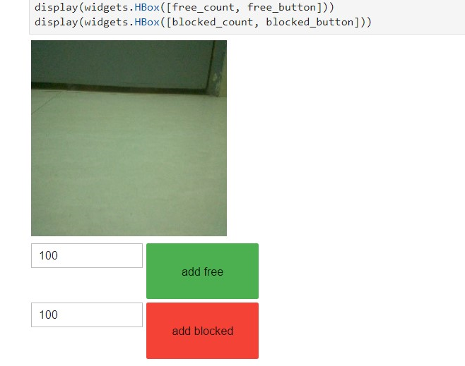
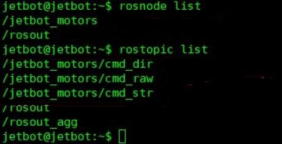
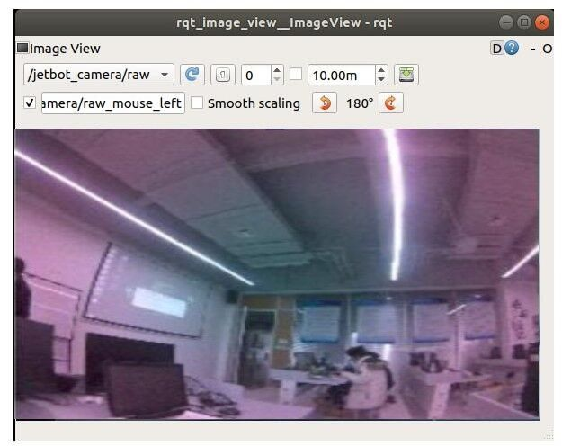

# 一，组装小车
参与成员：夏烜哲 陈远 雷忠灵 聂建桥

1. 将电机锁到金属盒，注意卡好孔位 
   
2. 将天线延长线锁到天线固定孔上，注意垫片位置，将延长线通过金属盒上的孔穿到外侧 
   
3. 将摄像头支架固定到金属盒上 
   
4. 将扩展板固定铜柱锁到金属盒上，准备安装扩展板 

5. 将长铜柱预先固定在扩展板上个，方便后面安装Jetson nano 

6. 将扩展板固定到金属盒上，调整好天线，并将电机线接入扩展板，左边接口连左边电机，右边接口连右边电机 

7. 将电池装入电池座，注意正负极方向，要参考白色丝印 

8. 将万向轮上的螺丝拆下，然后将万向轮固定到金属底板上 
   
9. 将金属底板固定到金属盒上 
    
10. 将车轮对好方向，装入电机中 

11. 将摄像头转入摄像头支架，注意摄像头之间要个一块亚克力板

12. 拆下Jetson nano核心板，将无线网卡装入，并接好天线 
    
13. 将胶棒天线装好 
    
14. 最好把6PIN排线按照丝印对应接好即可 

15. 组装好了之后，就可以将开关拨到ON上电测试了。注意电池第一次安装时候的时候需要用充电器充一会电才可以正常使用 

   

# 二，安装镜像

## 1、烧写JetBot镜像
下载JetBot镜像jetbot镜像，我们是通过老师提供的镜像文件下载使用
将SD卡（最小64G）通过读卡器插入到电脑 
使用Etcher软件，选择之前解压出来的镜像文件，并将其烧写到SD卡上 

## 2、启动Jetson Nano
将SD卡插入Jetson Nano (SD 卡槽位于Jetson Nano核心板的背面 
连接HDMI显示器，键盘和鼠标到Nano 
连接电源到Jetson Nano，上电启动Jetson Nano

## 3、连接JetBot到WIFI
由于后面的程序需要用到无线连接，所以这里需要先将Jetbot连接上WIFI 
登录系统，Jetbot系统的默认用户名和密码均为Jetbot 
点击系统右上角网络图标连接WIFI 
关机断电。将Jetbot小车组装好。并启动Jetson nano。启动的时候系统会自动连接WIFI，并同时在OLED显示器上显示IP地址 

## 4、Web浏览器连接JetBot
JetBot 正常连接WIFI之后，去掉HDMI显示器，USB键盘，鼠标。关机并去掉电源 
打开JetBot电源开关等待JetBot启动 
正常启动之后再OLED屏幕上回显示有小车的IP地址 
在浏览器输入JetBot的IP地址打开。Port为8888， 比如：192.168.32.10:8888 

以上步骤由于时间紧是在老师的帮助下完成的，截图就没有了，下面就可以进行正常的实验了。

# 三，电机驱动 

首先我们在浏览器地址栏输入小车上显示的ip地址加:8888连接到小车，然后左侧打开/Notebooks/basic_motion/。打开basic_motion.ipynb文件 

带有lpynb后缀的文件为lpython Notebook文件，包括注释文本和python程序。可以通过点击Run->Run Select Cells或者点击运行快捷图标▶来运行单段程序。 

运行语句robot.left(speed=0.3)时，小车会向左转圈（需要确保小车有足够的空间移动）。如果小车没有正常左转，可能是点击接线接错了，需要重新检查接线是否正确。 
运行此段程序后，会输出左右两条滑条，拖动滑条可以改变左右点击的转速 

运行此段代码之后，你可以通过网页按键来控制小车的前后左右移动了

最后可以通过代码来保持小车的正常工作，拖动滑条降低心跳频率后小车会停止转动 。

# 四，远程遥控 

连接小车的网页打开后，左侧打开/Notebooks/teleoperation/。打开teleoperation.ipynb文件 
将游戏手柄接收器插到电脑USB口，游戏手柄需要接到打开JupyterLab网页的设备上。 
打开https://html5gamepad.com/网页，看下是否检查到遥控手柄。记下对应设备的INDEX数值为多少 
按下遥控手柄按键对应的数值会变化。几下对应按键的名称。

运行代码后窗口会输出游戏手柄对应的按键。注意程序中的index需要修改为实际遥控手柄对应的值，在刚才打开的网页中可以看到对应的INDEX。按下按键对应的按键图标会提示按键已按下 ：

修改axes值对应不同的按钮，此处为方便遥控我们通常改为axes[0], axels[1]

运行到此时窗口会显示当前摄像头拍摄到的画面：

“心跳”检查，当小车断网时小车会自动停止 
通过按键控制小车拍照，改变button可以选择不同的按键，此处为了方便控制选择buttons[0]
运行程序之后即可通过遥控手柄控制小车。Asex[0]控制左边轮子，Asex[1]控制右边笼子，button[0]控制拍照，左边图像显示摄像头实时画面，右边为拍摄的图片，图片保存在snapshots文件下 

# 五，自主避障 

## 1，在JetBot上收集数据
进入jetbot页面后左侧打开Notebookscollision_avoidance/。打开data_collection.ipynb文件。 
运行程序后出现如图所示界面，将小车放到不同的位置，如果前方没有障碍则点击add free. 如果小车前方有障碍就点击add blocked。拍摄到的图片会保存在dataset文件夹中，尽可能多的拍摄各种情况的图片。可以尝试不同的方向，不同的亮度，不同的对象/碰撞类型，可以尝试不纹理的地板/物体
这么做是为了后面训练集，训练时由于场景的多样化，使得小车自主避障时更加优秀。

小车搜集到场景数据越多，避障的效果也就越好。所以尽可能多的获取不同的数据对避障效果非常重要。一般需要每种情况至少拍摄100张图片 
最后运行程序打包图片，打包之后，在当前的目录下会出现一个dataset.zip压缩文件 

## 2，训练神经网络

打开页面后，左侧打开Notebooks/collision_avoidance/，打开train_model.ipynb文件 
此处如果已经有了刚刚压缩的dataset.zip文件，则不需要再运行此语句进行解压，否则会提示是否覆盖已存在的文件 

程序运行到此处会下载alexnet模型，下载时间有点长。下载程序后/home/hetbot/.torch/models目录下会出现一个alexnet-owt-4df8aa71.pth文件。

最后运行程序训练神经网络，运行时间比较长。训练完成后，当前目录下会出现一个best_mode.pth文件，我们也可以看到训练的精度。

## 3，自助避障
在页面左侧打开Notebooks/collision_avoidance/。打开live_demo.ipynb文件 
运行程序后会显示摄像头实时图像和一条滑条。互调表示遇到障碍物的概率，0.00表示前方没有障碍物，1.00表示前方哟障碍物需要转向避让。 

当我们做避障测试时，如果速度快了一点，避障效果不明显我们应该适当调小一点速度，避免速度太快直接撞上障碍物。如果部分地方不能实现避障建议采集更多的数据。

# 六，目标跟踪 

打开jetbot页面后，在左侧打开Notebookobject_following/，打开live_demo.ipynb文件 
运行程序之前需要先将预先训练好的ssd_mobilenet_v2_coco.engine模型下载，解压后复制到当前文件夹目录下 
◾ 
运行此段代码之前，需要将检测对象放到摄像头前面。运行程序后会输出检测到的coco对象。没有检测到对象则输出空数据[[ ]]。输出信息通过查表可知检测到了苹果，苹果的ID为53。如果同时检测到多个对象则输出多个信息。

运行程序后输出如图所示，被检测到的物体周围画着蓝色的方框，目标对象（jetbot跟随目标）将显示绿色边框 

# 七，目标巡线 
## 1，在JetBot上收集数据
打开jetbot页面，找到Notebooks/road_following/。打开data_collection.ipynb文件

运行一段程序会显示当前摄像头的测试图像。右边图像会显示一个绿点和蓝色线。用于表示小车应该运行的路线。为方便后面的操作，我们将输出窗口用新窗口打开。

下面程序和游戏手柄遥控章节类似。修改index为实际手柄对应的标号。修改axes为要控制的按键。 

修改button值，设置对应的按键为拍摄图片按键 

下面开始收集数据，将小车放置到线的不同位置，控制手柄的方向键，将绿色点拖到黑线上。蓝色线即表示小车应该运行的方向。然后按下按键拍照收集图片。尽可能多的收集各种情况的图片，count表示已经拍摄的图片数量 

最后运行程序保存拍摄图片，当前目录下生成一个zip压缩文件

## 2，训练神经网络
在jetbot页面找到Notebooks/road_following, 打开train_model.ipynb文件。 
将上面生成的压缩文件解压，需要将road_following.zip改成对应的ZIP文件名，否则会提示文件不存在。如果是直接加入的图片数据就不用解压了。然后就是下载神经模型。

最后训练神经模型，当前目录下会生成best_steering_model_xy.pth文件 

## 3，自主巡线
打开jetbot页面，找到Notebooks/road_following，打开live_demo.ipynb文件 
运行程序加载模型，打开摄像头实时显示图像 
程序中有四个参数，可以通过拖动滑条改变参数的值，如果需要实现巡线功能需要根据实际情况调试参数，使巡线的效果更好。 

此输出展示jetbot的当前运行情况，x，y表示当前图像预测的x,y值，可以表示转动角度。speed表示jetbot直线速度，steering表示转向速度。

最后运行代码进行自主巡线线：

# 八、安装ROS

## 安装melodic版本ROS
Jetson Nano提供的系统镜像是基于18.04版本Ubuntu系统，支持直接用apt安装ROS.使用下面的指令，按顺序安装，注意安装过程中是否有报错。

输入
sudo apt-add-repository universe
sudo apt-add-repository multiverse
sudo apt-add-repository restricted
 
## 加入ROS资源到apt sources
sudo sh -c 'echo "deb http://packages.ros.org/ros/ubuntu $(lsb_release -sc) main" > /etc/apt/sources.list.d/ros-latest.list'
sudo apt-key adv --keyserver 'hkp://keyserver.ubuntu.com:80' --recv-key C1CF6E31E6BADE8868B172B4F42ED6FBAB17C654
 
## 安装ROS Base
sudo apt-get update
sudo apt-get install ros-melodic-ros-base
 
## 加入环境变量
sudo sh -c 'echo "source /opt/ros/melodic/setup.bash" >> ~/.bashrc'
## 安装python库

安装pip
$ sudo apt-get install python-pip
安装字典
$ pip install Adafruit-MotorHAT
$ pip install Adafruit-SSD1306
添加i2c到user用户组

sudo usermod -aG i2c $USER
创建catkin工作空间
创建catkin工作空间保存我们的ROS程序包

## 创建catkin工作区
mkdir -p ~/workspace/catkin_ws/src
cd ~/workspace/catkin_ws
catkin_make
 
添加catkin_ws参数 bashrc
sudo sh -c 'echo "source ~/workspace/catkin_ws/devel/setup.bash" >> ~/.bashrc'
关闭当前终端，重新打开一个新的终端。确认ROS是否安装成功

$ echo $ROS_PACKAGE_PATH 
/home/nvidia/workspace/catkin_ws/src:/opt/ros/melodic/share
## 编译安装jetson-inference
安装git and cmake（这个很重要）
sudo apt-get install git cmake
 
clone the repo and submodules
cd ~/workspace
git clone --recursive https://github.com/dusty-nv/jetson-inference
cd jetson-inference
 
创建文件夹
mkdir build
cd build
cmake ../
make
 
安装libraries
sudo make install
【注意】由于Jetson nano服务器均在国外，部分资源需要能够上外网才能可以获取，否则可能安装失败。另外需要安装一下库

sudo apt install libqt4-dev libglew-dev
编译安装ros_deep_learning
安装dependencies
sudo apt-get install ros-melodic-vision-msgs ros-melodic-image-transport ros-melodic-image-publisher
clone the repo
cd ~/workspace/catkin_ws/src
git clone https://github.com/dusty-nv/ros_deep_learning
 
接下来就开始深度学习
cd ../    # cd ~/workspace/catkin_ws
catkin_make
 
确定这个包被建立
rospack find ros_deep_learning
/home/nvidia/workspace/catkin_ws/src/ros_deep_learning
## 编译安装jetbot_ros
clone the repo

cd ~/workspace/catkin_ws/src
git clone https://github.com/waveshare/jetbot_ros
 
创建包

cd ../    # cd ~/workspace/catkin_ws
catkin_make
 
确认存在
rospack find jetbot_ros
/home/nvidia/workspace/catkin_ws/src/jetbot_ros
## 测试jetbot ROS
打开一个新终端，然后运行ros核心节点

roscore
输出信息如下，则ros正常工作

再新建一个终端，输入rosnode list可以查看jetbot_motors节点是否启动。输入rostopic list可以查看jetbot_motor节点监听的话题

cmd_str 通过发送字符串命令 (left/right/forward/backward/stop)控制jetbot运动。

## 使用摄像头实时监控
启动jetbot_camera节点，启动jetbot摄像头视频流

rosrun jetbot_ros jetbot_camera
将会发布图像格式为sensor_msgs::Image 的话题 jetbot_camera/raw

运行如下命令显示摄像头图像。

rosrun rqt_image_view rqt_image_view
会显示如下窗口，选择话题为/jetbot_camera/raw

