# JetBot Al Kit

## 组装小车
1. 将电机锁到金属盒，注意卡好孔位

2. 将天线延长线锁到天线固定孔上，注意垫片位置，将延长线通过金属盒上的孔穿到外侧
3. 将摄像头支架固定到金属盒上
4. 将扩展板固定铜柱锁到金属盒上，准备安装扩展板

5. 将长铜柱预先固定在扩展板上个，方便后面安装Jetson nano
6. 将扩展板固定到金属盒上，调整好天线并将电机线接入扩展板，左边接口连左边电机，右边接口连右边电机
7. 将电池装入电池座，注意正负极方向，要参考白色丝印
8. 将万向轮上的螺丝拆下，然后将万向轮固定到金属底板上
9. 将金属底板固定到金属盒上
10. 将车轮对好方向，装入电机中

11. 将摄像头转入摄像头支架，注意摄像头之间要个一块亚克力板
12. 拆下Jetson nano核心板，将无线网卡装入，并接好天线

13. 将胶棒天线装好
14. 最好把6PIN排线按照丝印对应接好即可

15. 组装好了之后，就可以将开关拨到ON上电测试了。注意电池第一次安装时候的时候需要用充电器充一会电才可以正常使用
## 安装镜像
一、 烧写JetBot镜像

下载JetBot镜像jetbot镜像，并解压出.img 镜像文件

将SD卡（最小64G）通过读卡器插入到电脑

使用Etcher软件，选择之前解压出来的镜像文件，并将其烧写到SD卡上


二、 启动Jetson Nano

将SD卡插入Jetson Nano (SD 卡槽位于Jetson Nano核心板的背面）

连接HDMI显示器，键盘和鼠标到Nano

连接电源到Jetson Nano，上电启动Jetson Nano

【注意】建议再没有安装小车的情况下先启动测试Jetson Nano， 以确保Jetson Nano硬件没有问题可以正常启动

三、连接JetBot到WIFI

由于后面的程序需要用到无线连接，所以这里需要先将Jetbot连接上WIFI

登录系统，Jetbot系统的默认用户名和密码均为Jetbot

点击系统右上角网络图标连接WIFI

关机断电。将Jetbot小车组装好。并启动Jetson nano。启动的时候系统会自动连接WIFI，并同时在OLED显示器上显示IP地址

四、Web浏览器连接JetBot

JetBot 正常连接WIFI之后，去掉HDMI显示器，USB键盘，鼠标。关机并去掉电源

打开JetBot电源开关等待JetBot启动

正常启动之后再OLED屏幕上回显示有小车的IP地址

在浏览器输入JetBot的IP地址打开。Port为8888， 比如：192.168.32.10:8888

五、安装最新软件

JetBot的GitHub上提供软件可能比预装在镜像的要新。注意：我们提供的程序和JetBot官方github给出的有点区别，你如果直接更新了官方最新的软件，程序将不再会显示当前的电池点电量，且电机无法正常驱动

在浏览器地址栏输入http://192.168.1.11:8888连接到小车

首次打开需要输入用户名和密码登录。默认用户名和密码均为jetbot


点击终端icon打开一个终端

输入以下的指令来安装新的软件库，这里给出的是微雪版本（相对于NVIDIA官方版本增加了电压显示）


然后将更新的软件库覆盖掉旧的软件库


六、配置电源模式

可以使用以下命令将Jetson Nano的功耗模式切换为5W模式，确保电池组可以正常供电

浏览器打开http://192.168.1.11:8888连接到小车，另启动一个终端

切换为5W功耗模式


检查一下确认JetBot处于5W功耗模式


此过程为老师帮助操作，我们只是大致了解流程。

## 电机驱动
1. 输入网址http://<192.181.1.11>:8888连接到小车，左侧打开/Notebooks/basic_motion/。打开basic_motion.ipynb文件

2. 依次运行语句,小车会根据代码行驶

3. 执行此段代码，小车会向左转圈

运行robot.stop()后，小车停止运动
4. 运行后会出现两条滑条，拖动滑条可以改变左右点击的转速

5. 运行此代码，可以通过网页按键来控制小车的前后左右移动

6. 运行此段代码，代码通过“心跳”来保持小车的正常工作，拖动滑条降低心跳频率后小车会停止转动


## 远程遥控
首先将电池安装到手柄上，将手柄接收器插到电脑USB接口上，打开手柄的电源键。然后游戏手柄需要接到打开JupyterLab网页的设备上。

在浏览器地址栏输入http://192.168.1.11:8888连接到小车，左侧打开/Notebooks/teleoperation/。打开teleoperation.ipynb文件

打开https://html5gamepad.com/网页，看是否检测到遥控手柄。摇动手柄，看网页上的数值是否发生变化，如果可以，就说明可以检测到遥控手柄。记下对应设备的INDEX数值显示为零。

运行这段代码后窗口会输出游戏手柄对应的按键。注意程序中的INDEX需要修改为实际遥控手柄对应的值，在刚才打开的网页中可以看到对应的INDEX。按下按键对应的按键图标会同步跳动以显示按钮可以正常工作。

修改axes值对应不同的按钮，这里为了方便遥控，我们将数值改为axes[0], axels[1]
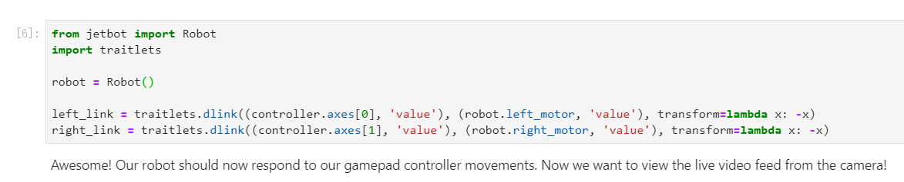
运行到这里的时候，窗口会显示当前摄像头拍摄到的画面，如下图所示：
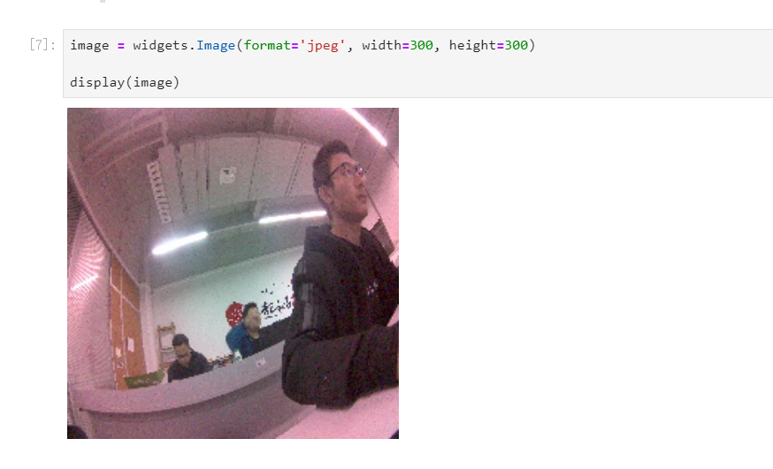
此处运行代码会进行“心跳”检查，当小车断网时小车会自动停止。

通过按键控制小车拍照，改变button可以选择不同的按键，此处为了方便控制选择buttons[0]

运行程序之后即可通过遥控手柄控制小车。Asex[0]控制左边轮子，Asex[1]控制右边笼子，button[0]控制拍照，左边图像显示摄像头实时画面，右边为拍摄的图片，图片保存在snapshots文件下


## 自主避障

JetBot 的自主避障功能分为三个步骤。收集数据，训练神经网络和自主避障。
### 收集数据

打开Notebooks/collision_avoidance/ 目录下的data_collection.ipynb文件。


这里是创建摄像头连接，将摄像头画面显示在网页上，注意不要修改摄像头的分辨率设置。

创建一个dataset目录，用来存放我们接下来收集的图片。dataset目录下创建两个文件夹，分别是blocked和free。blocked文件夹将用来存放避障场景图片，而free文件将用来存放畅通场景图片。老的目录。

创建两个按钮和两个显示框，按钮用来操作添加避障场景图片和畅通场景图片的。显示框分别显示的是当前已存放的图片数量。


如果当前的场景有障碍物，需要小车转弯的地方，就按下add blocked 红色按键。

如果当前的场景是畅通的，小车可以直行，就按下add free绿色按钮。就这样分别收集各种图片数据。为了保持较好的避障效果。建议你每种场景至少收集100张图片。（注意不是让你在同一个画面里面狂按100下，拍100张一样的图片，是要你收集100种需要避障和100种可以直走的场景图！！！）

最后一单元，在收集结束之后，运行该单元将你的图片打包。这里打包的目的是因为有的用户可能会使用不同的小车去做后面的模型训练，或者你想将你们的图片数据备份一下。如果你是在同一辆小车上把三个步骤都做完的，那你也可以不打包，直接跳过这个单元。


### 训练神经网络
打开/train_model.ipynb文件，注意该文件是在Notebooks/collision_avoidance模型下。

程序运行到此处会下载alexnet模型，下载时间有点长。下载程序后/home/hetbot/.torch/models目录下会出现一个alexnet-owt-4df8aa71.pth文件。


最后一单元就是模型训练了，这里会做30组训练，训练结束之后会生成一个best_model.pth的模型文件。等待训练完成即可。


### 自主避障
左侧打开Notebooks/collision_avoidance/。打开live_demo.ipynb文件
运行程序后会显示摄像头实时图像和一条滑条。互调表示遇到障碍物的概率，0.00表示前方没有障碍物，1.00表示前方哟障碍物需要转向避让。


根据避障值，来操作小车是直行还是转弯（避障）。如果你在做避障的时候，觉得小车速度太快可以降低robot.forward()里面的参数值来降低小车的前行速度，降低robot.left()里面的参数值来降低小车的转弯幅度。


【注意】部分语句运行时间可能比较长，JupyterLab右上角有程序运行提示标志。当小圆点为黑色时表示程序正在运行，白色表示空闲状态。

实时更新摄像头数据，便于观察


## 目标跟踪
在浏览器地址栏输入http://192.168.1.11:8888连接到小车，左侧打开Notebook/object_following/，打开live_demo.ipynb文件

运行程序之前需要先将预先训练好的ssd_mobilenet_v2_coco.engine模型下载，解压后复制到当前文件夹目录下

需要注意的是，这一部分的程序需要用到上一章自主避障中建立的模块，小车需要再同一个环境中进行。当上一步完成后，不要终止，直接进行本部分内容。

运行程序后输出如图所示，被检测到的物体周围画着蓝色的方框，目标对象（jetbot跟随目标）将显示绿色边框

可以适当调小speed和turn gain的值，避免jetbot运行速度太快。当jetbot检测到目标是会转向目标，如果被障碍物挡住jetbot会右转(部分是左转)。

## 目标巡航
##### 第一步 JetBot上收集数据
在这一章中，我们同样需要使用收集数据，巡线，自主运行这写步骤来实现自主巡线功能
1. 在浏览器地址栏输入http://192.168.1.11:8888连接到小车，找到Notebooks/road_following/。打开data_collection.ipynb文件
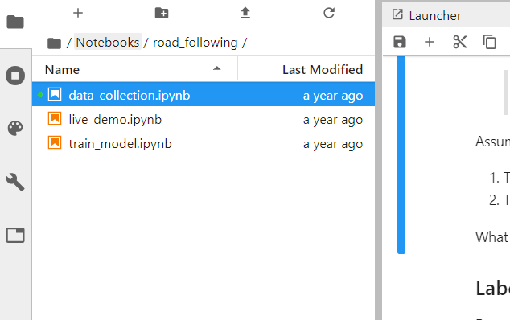
2. 运行程序后会显示一段youtube上的演示视频，国内客户观看不了视频
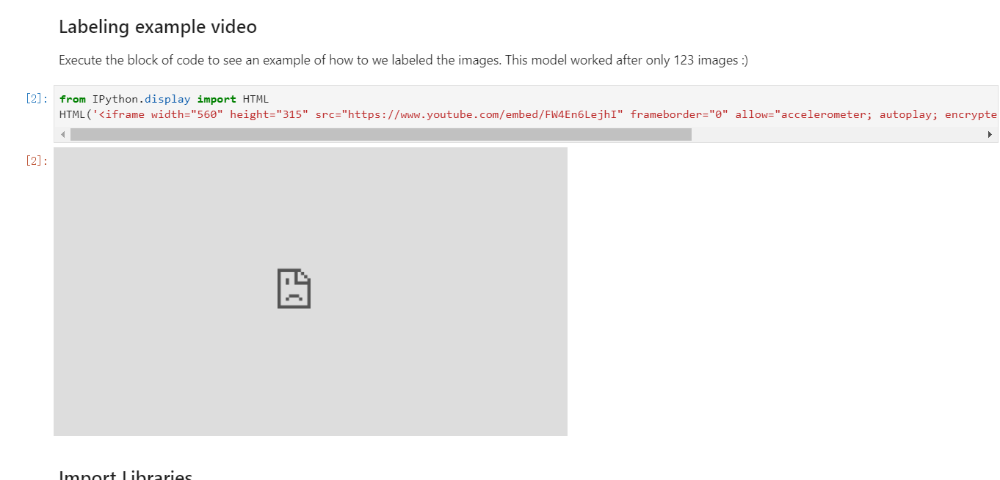
3. 显示当前摄像头的测试图像。右边图像会显示一个绿点和蓝色线。用于表示小车应该运行的路线
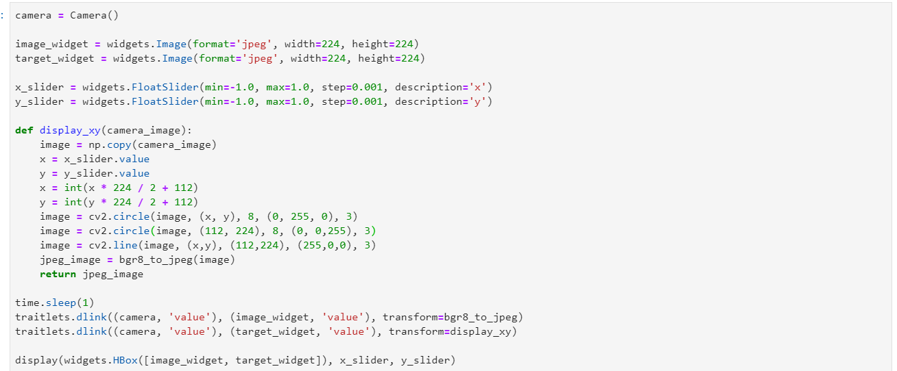
4. 修改index为实际手柄对应的标号0。修改axes为要控制的按键
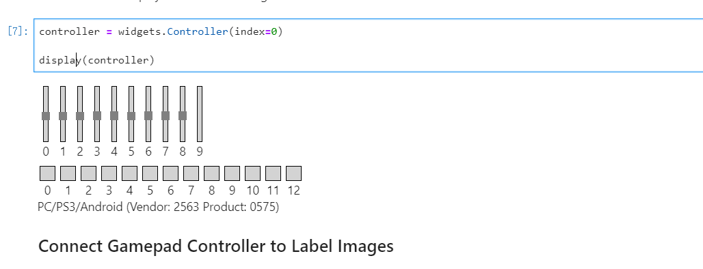
5. 按下HOME键，切换模式。使得指示灯为两个灯亮的状态
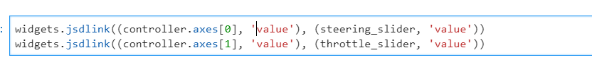
6. 修改button值，设置对应的按键为拍摄图片按键
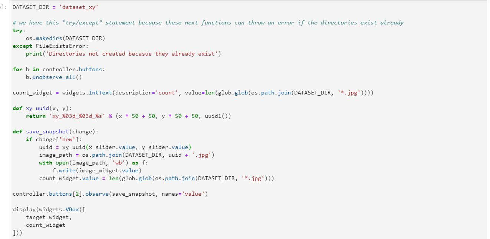
开始收集数据，将小车放置到线的不同位置，控制手柄的方向键，将绿色点拖到黑线上。蓝色线即表示小车应该运行的方向。然后按下按键拍照收集图片。尽可能多的收集各种情况的图片，count表示已经拍摄的图片数量
7. 最后运行程序保存拍摄图片，当前目录下生成一个zip压缩文件。
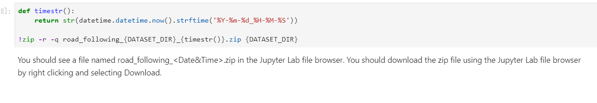

##### 第二步 训练神经网络
1. 找到Notebooks/road_following, 打开train_model.ipynb文件。
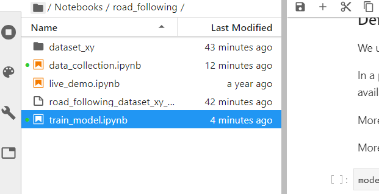
2. 下载神经模型
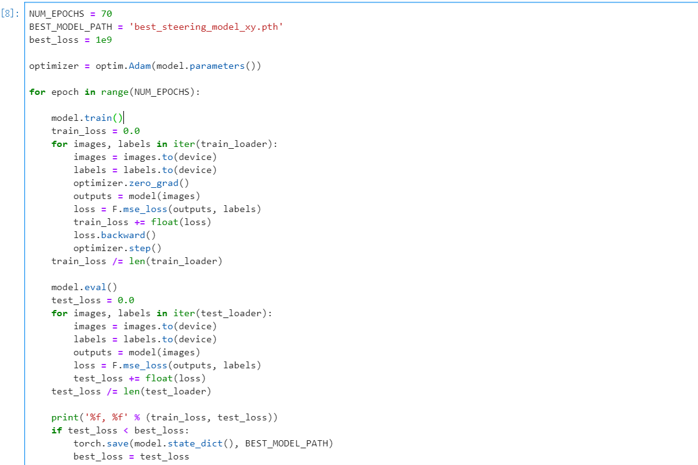

##### 第三步 自主巡线
1. 找到Notebooks/road_following，打开live_demo.ipynb文件
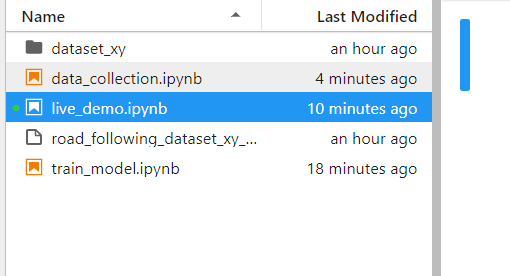
2. 程序中有四个参数，可以通过拖动滑条改变参数的值，如果需要实现巡线功能需要根据实际情况调试参数，使巡线的效果更好。
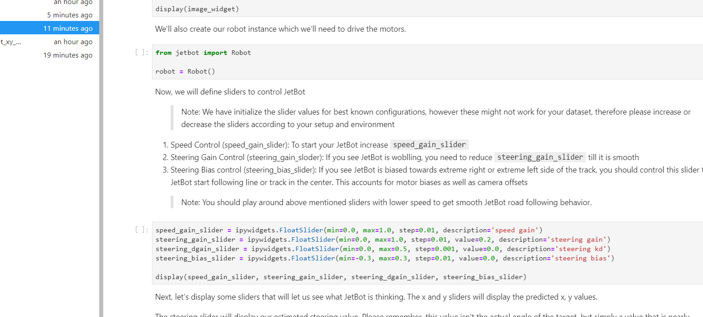
3. jetbot的当前运行情况，x，y表示当前图像预测的x,y值
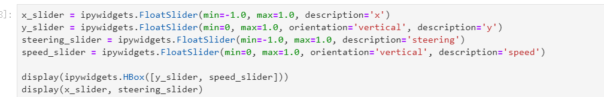
4. 调节小车速度

## ROS
1. 安装melodic版本ROS
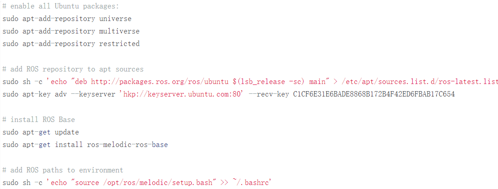
Jetson Nano提供的系统镜像是基于18.04版本Ubuntu系统，支持直接用apt安装ROS.使用下面的指令，按顺序安装，注意安装过程中是否有报错。
代码
```
# enable all Ubuntu packages:
sudo apt-add-repository universe
sudo apt-add-repository multiverse
sudo apt-add-repository restricted
 
# add ROS repository to apt sources
sudo sh -c 'echo "deb http://packages.ros.org/ros/ubuntu $(lsb_release -sc) main" > /etc/apt/sources.list.d/ros-latest.list'
sudo apt-key adv --keyserver 'hkp://keyserver.ubuntu.com:80' --recv-key C1CF6E31E6BADE8868B172B4F42ED6FBAB17C654
 
# install ROS Base
sudo apt-get update
sudo apt-get install ros-melodic-ros-base
 
# add ROS paths to environment
sudo sh -c 'echo "source /opt/ros/melodic/setup.bash" >> ~/.bashrc'
```
过程出错，未能成功完成实验
### 心得体会
通过此次的设计制作，使我们更加认识到了动手能力和理论知识的重要性，而理论与实践的结合更是重中之重。比如说在小车安装好之后的操作中有点下问题，跑得快的时候，尤其是瓷砖之间有缝隙，车子容易前后晃，并且遇到路不平的时候，有时会直接卡住。
当然我们也有很多不足，自身理论知识的欠缺和动手能力倒是不错就是部分细节可能不太注意，耽误了一段时间。最主要的就是，在实验的中途，小车和遥控手柄纷纷出现问题，这对我们的实验产生了很大的影响。虽然最后还是在老师以及同学的帮助下大致解决了这些问题，实现了大部分的实验调试，基本地完成了本次实验任务。但是还是有部分内容无法完成，就很遗憾。希望如果下次再有类似的事情的话，运气能好一些。并且下次能与更好的基础拥有更好的知识储备，更好的完成实验。


