# 课程报告
## 王涵（组长） 张博文 唐茂杰 曹博硕
# 目录
◾JetBot AI Kit 教程一、组装小车 
◾JetBot AI Kit 教程二、安装镜像 
◾JetBot AI Kit 教程三、电机驱动 
◾JetBot AI Kit 教程四、远程遥控 
◾JetBot AI Kit 教程五、自主避障 
◾JetBot AI Kit 教程六、目标跟踪 
◾JetBot AI Kit 教程七、目标巡线 

## 一、JetBot AI 小车组装步骤
1.打开网站，学习相关知识
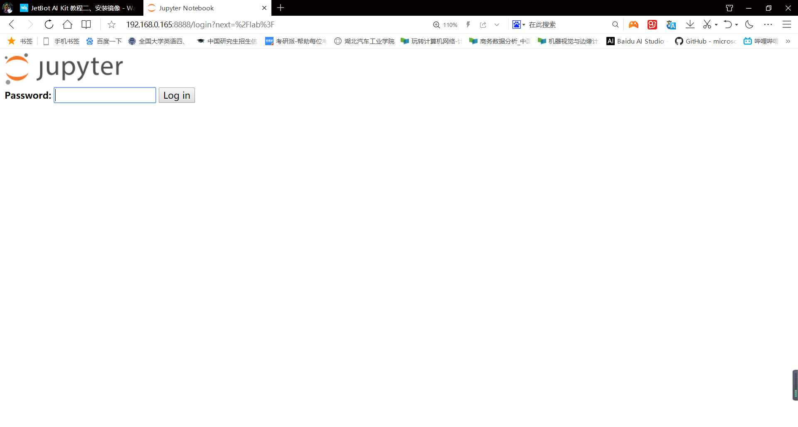
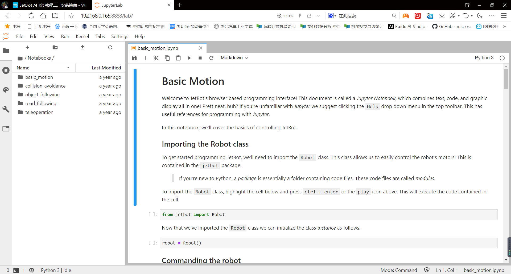

2.拿到实物，整理好配件和螺丝型号将摄像头支架固定到金属盒，调整好天线组装。

3.将开关拨到ON上电测试。
！ 电池第一次安装时候的时候需要用充电器充一会电才可以正常使用 
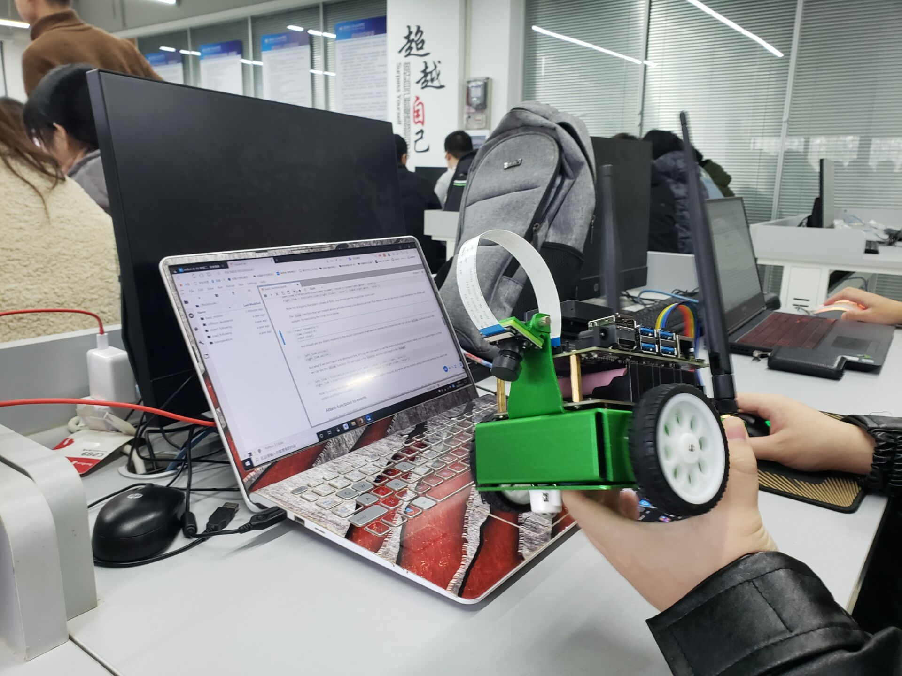

## 二、JetBot AI Kit 安装镜像 (本环节主要为教师完成)
1、烧写JetBot镜像
◾下载JetBot镜像jetbot镜像，提取码t64u，并解压出.img 镜像文件 

2、启动Jetson Nano
◾将SD卡插入Jetson Nano (SD 卡槽位于Jetson Nano核心板的背面 
◾连接HDMI显示器，键盘和鼠标到Nano 
◾连接电源到Jetson Nano，上电启动Jetson Nano 

3、连接JetBot到WIFI

由于后面的程序需要用到无线连接，所以这里需要先将Jetbot连接上WIFI 
◾登录系统，Jetbot系统的默认用户名和密码均为Jetbot 
◾点击系统右上角网络图标连接WIFI 
 

4、Web浏览器连接JetBot
◾JetBot 正常连接WIFI之后，去掉HDMI显示器，USB键盘，鼠标。关机并去掉电源 
◾打开JetBot电源开关等待JetBot启动 
◾正常启动之后再OLED屏幕上回显示有小车的IP地址 
◾在浏览器输入JetBot的IP地址打开。Port为8888， 比如：192.168.32.10:8888 

5、安装最新软件
◾JetBot的GitHub上提供软件可能比预装在镜像的要新。注意：我们提供的程序和JetBot官方github给出的有点区别，你如果直接更新了官方最新的软件，程序将不再会显示当前的电池点电量，且电机无法正常驱动 
◾在浏览器地址栏输入http://<jetbot_ip_address>:8888连接到小车 

6、配置电源模式
◾可以使用以下命令将Jetson Nano的功耗模式切换为5W模式，确保电池组可以正常供电 
◾浏览器打开http://<jetbot_ip_address>:8888连接到小车，另启动一个终端 
◾切换为5W功耗模式 

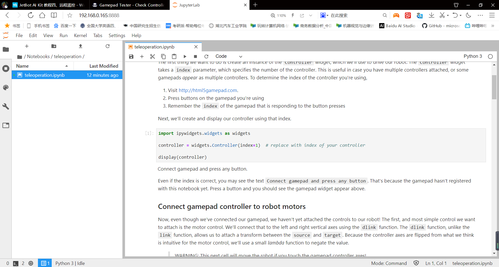

## 三、JetBot AI Kit 电机驱动 

1.在浏览器地址栏输入http://<jetbot_ip_address>:8888连接到小车，左侧打开/Notebooks/basic_motion/。打开basic_motion.ipynb文件 

2.带有lpynb后缀的文件为lpython Notebook文件，包括注释文本和python程序。可以通过点击Run->Run Select Cells或者点击运行快捷图标▶来运行单段程序。 【注意】文本中有详细的程序注释说明，认真阅读注释即可明白程序功能 
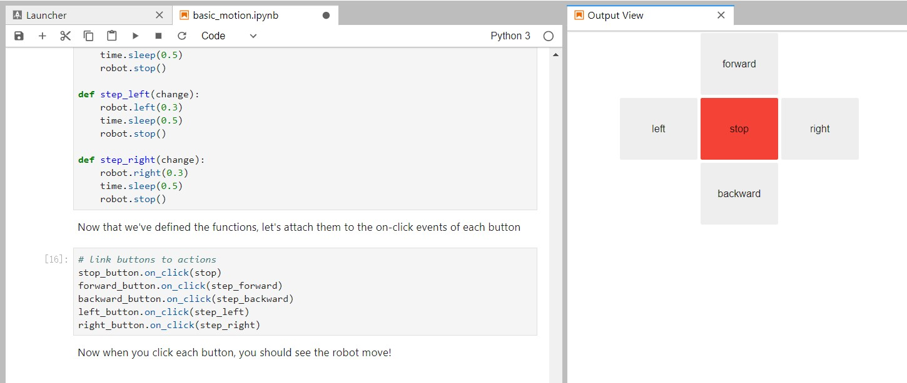

 
3.拖动滑条可以改变左右点击的转速 运行此段代码之后，你可以通过网页按键来控制小车的前后左右移动了。【注意】你可以通过右键该段代码->Create New View for Output 将输出窗口作为新页面打开。 
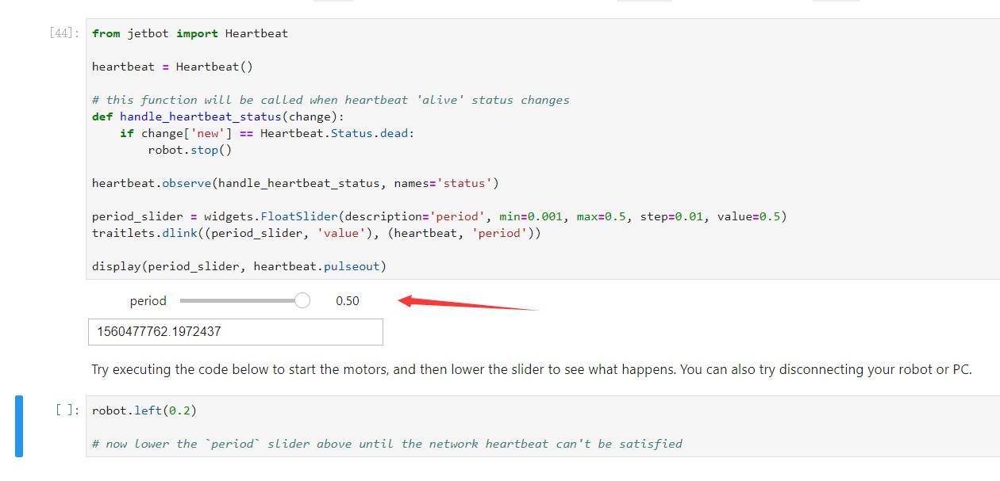

## 四、JetBot AI Kit 远程遥控 
1.在浏览器地址栏输入http://<jetbot_ip_address>:8888连接到小车，左侧打开/Notebooks/teleoperation/。打开teleoperation.ipynb文件 
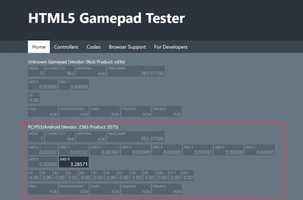

2.将游戏手柄接收器插到电脑USB口，【注意】接收器是要接到电脑而不是接到jetson nano上，游戏手柄需要接到打开JupyterLab网页的设备上。◾修改axes值对应不同的按钮，此处为方便遥控改为运行到此时窗口会显示当前摄像头拍摄到的画面 
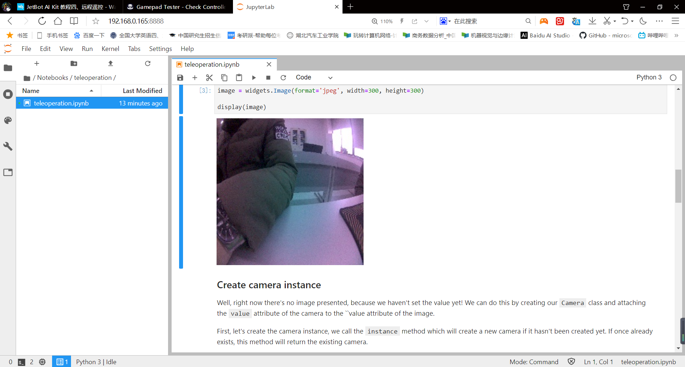
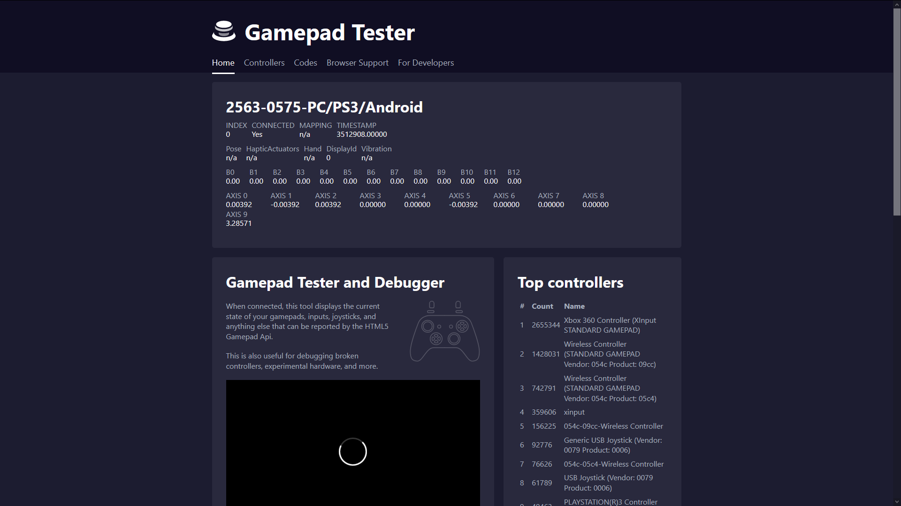
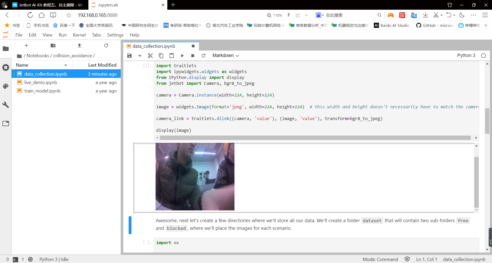

## 五、JetBot AI Kit 自主避障 
1.在JetBot上收集数据
◾在浏览器地址栏输入http://<jetbot_ip_address>:8888连接到小车，左侧打开Notebooks/collision_avoidance/。打开data_collection.ipynb文件。 
◾运行程序后出现如图所示界面，将小车放到不同的位置，如果前方没有障碍则点击add free. 如果小车前方有障碍就点击add blocked。拍摄到的图片会保存在dataset文件夹中，尽可能多的拍摄各种情况的图片。可以尝试不同的方向，不同的亮度，不同的对象/碰撞类型（墙、壁架等），可以尝试不纹理的地板/物体（有图案的、光滑的、玻璃等） 
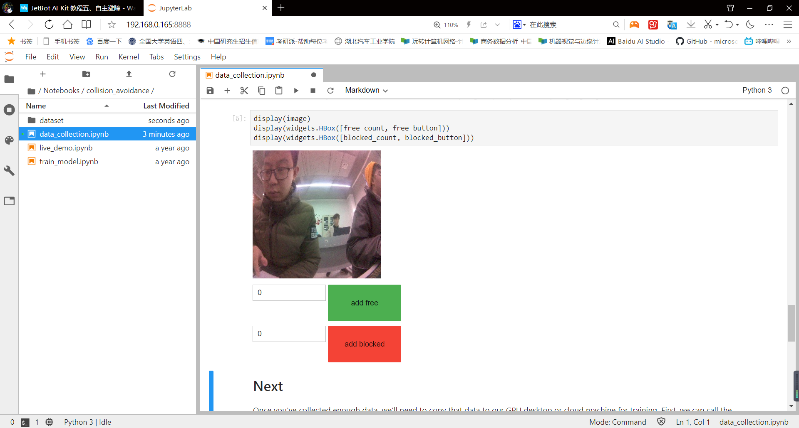
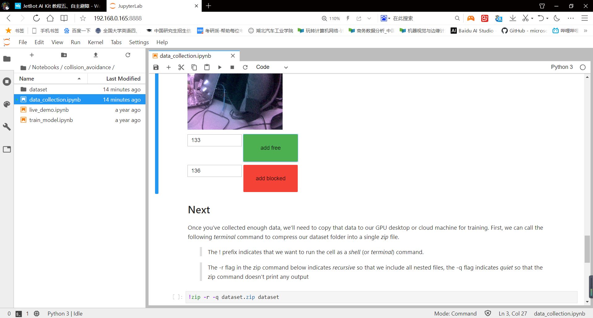

2.训练神经网络
◾在浏览器地址栏输入http://<jetbot_ip_address>:8888连接到小车，左侧打开Notebooks/collision_avoidance/，打开train_model.ipynb文件 
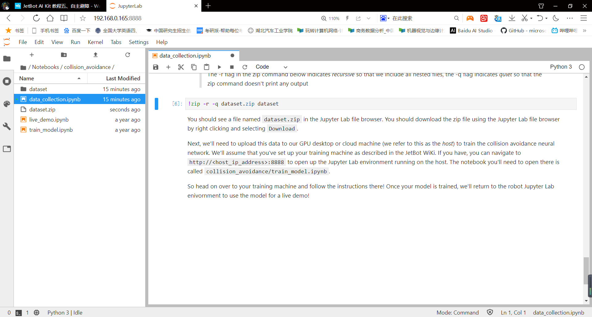◾

程序运行到此处会下载alexnet模型，下载时间有点长。下载程序后/home/hetbot/.torch/models目录下会出现一个alexnet-owt-4df8aa71.pth文件。 
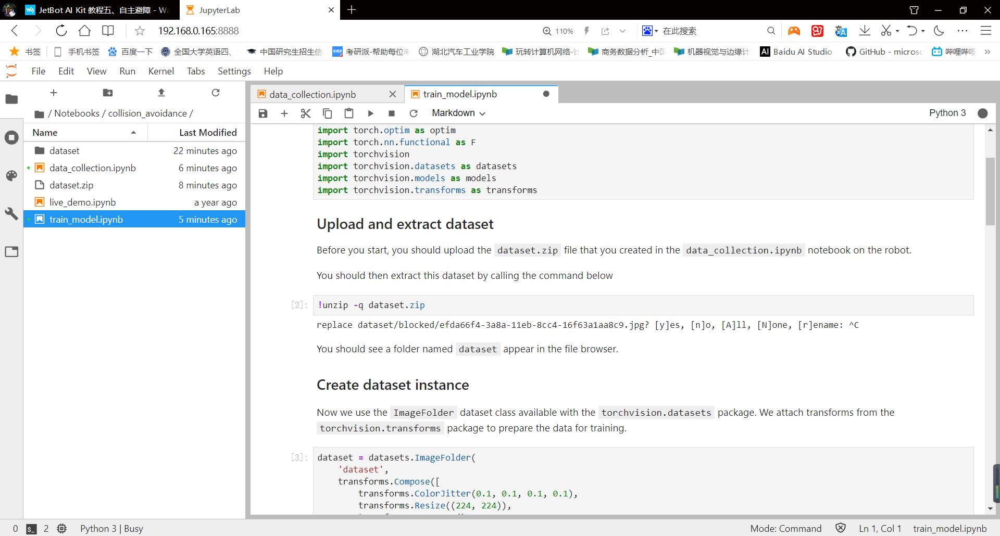
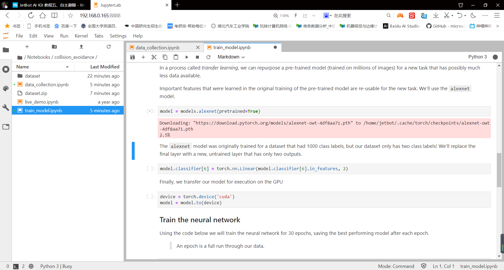
最后运行程序训练神经网络，运行时间比较长。训练完成后，当前目录下会出现一个best_mode.pth文件。 

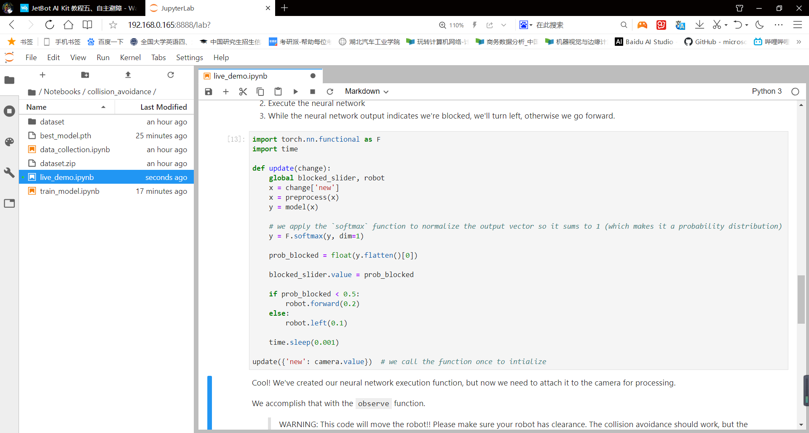

3.自助避障
◾在浏览器地址栏输入http://<jetbot_ip_address>:8888连接到小车，左侧打开Notebooks/collision_avoidance/。打开live_demo.ipynb文件 
◾运行程序后会显示摄像头实时图像和一条滑条。互调表示遇到障碍物的概率，0.00表示前方没有障碍物，1.00表示前方哟障碍物需要转向避让。
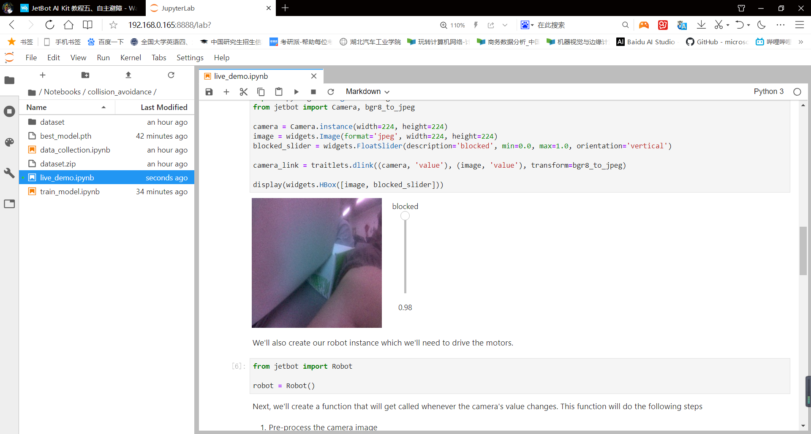

## 六、JetBot AI Kit 目标跟踪

1.使用预先训练好的coco数据集神经网络，可以检测90种不同的物体。包括人（index 0）,杯（index 47），苹果（index 54）等对象。具体可以检测对象可以查看完整数据列表 
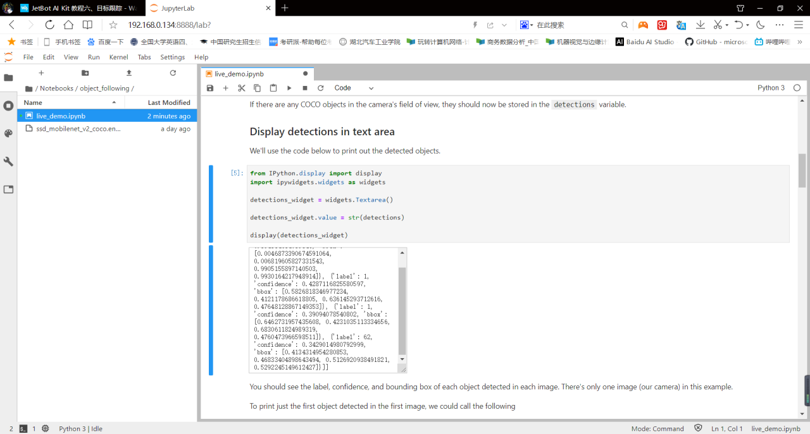
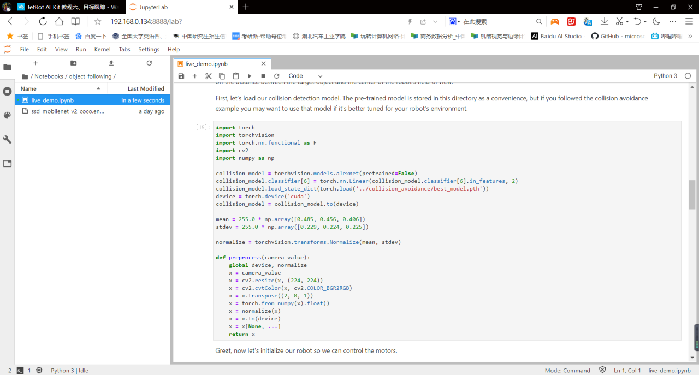

2.运行程序之前需要先将预先训练好的ssd_mobilenet_v2_coco.engine模型下载，解压后复制到当前文件夹目录下。没有检测到对象则输出空数据[[ ]]。输出信息通过查表可知检测到了苹果，苹果的ID为53。如果同时检测到多个对象则输出多个信息。 

3.运行程序后输出如图所示，被检测到的物体周围画着蓝色的方框，目标对象（jetbot跟随目标）将显示绿色边框 
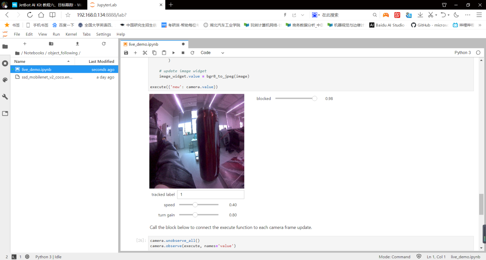
可以适当调小speed和turn gain的值，避免jetbot运行速度太快。 
◾当jetbot检测到目标是会转向目标，如果被障碍物挡住jetbot会左转 

## 七、JetBot AI Kit 目标巡线 
1.在JetBot上收集数据
在浏览器地址栏输入http://<jetbot_ip_address>:8888连接到小车，找到Notebooks/road_following/。打开data_collection.ipynb文件 

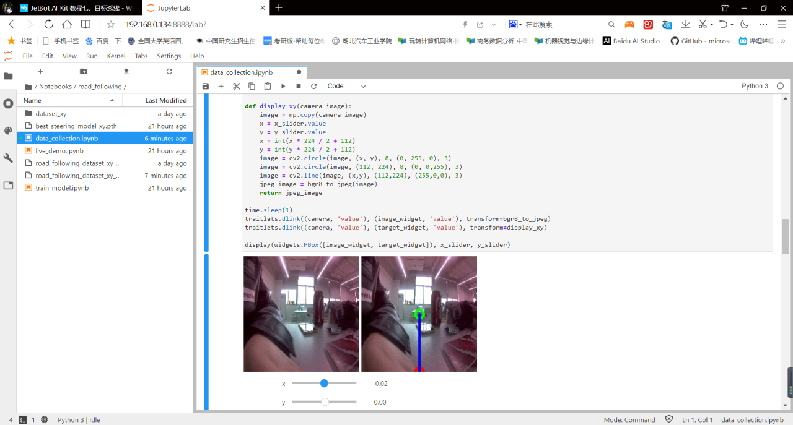
【注意】此处的axes按键必须Wie模拟按键，即可以输出小数。如果使用我们配置的游戏手柄，则需要按下HOME键，切换模式。使得指示灯为两个灯亮的状态 
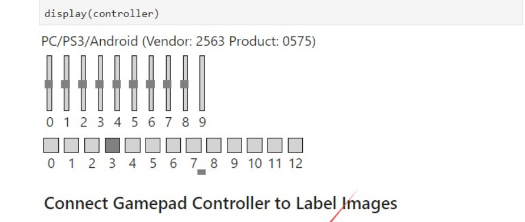
修改button值，设置对应的按键为拍摄图片按键 下面开始收集数据，将小车放置到线的不同位置，控制手柄的方向键，将绿色点拖到黑线上。蓝色线即表示小车应该运行的方向。然后按下按键拍照收集图片。尽可能多的收集各种情况的图片，count表示已经拍摄的图片数量 
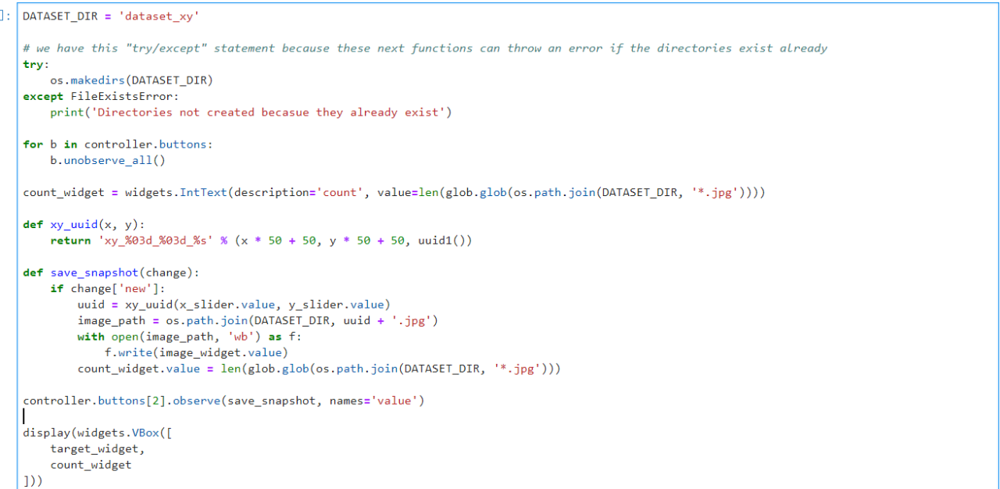

2.训练神经网络
◾在浏览器地址栏输入http://<jetbot_ip_address>:8888连接到小车，找到Notebooks/road_following, 打开train_model.ipynb文件。 
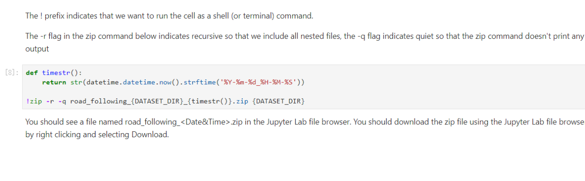
◾如果使用的是上一节手机到的数据，不需要解压，图片文件已经在当前目录下。 
◾如果需要另外解压文件，需要将road_following.zip改成对应的ZIP文件名，否则会提示文件不存在 
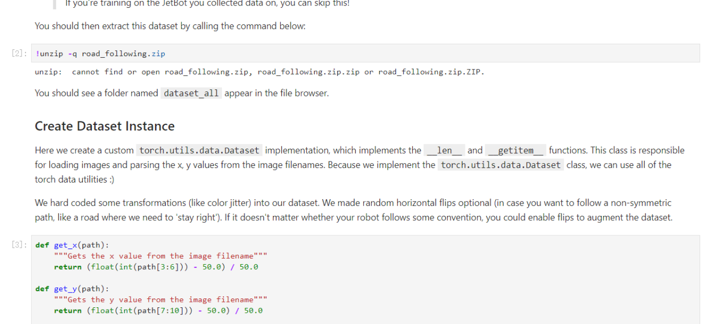
 ◾下载神经模型，过程可能比较久 
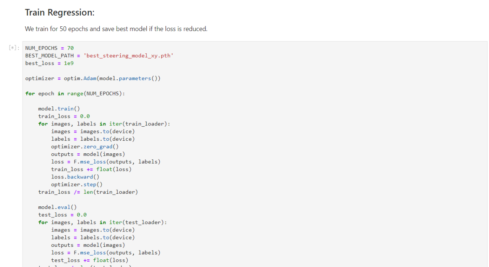
◾最后训练神经模型，当前目录下会生成best_steering_model_xy.pth文件 
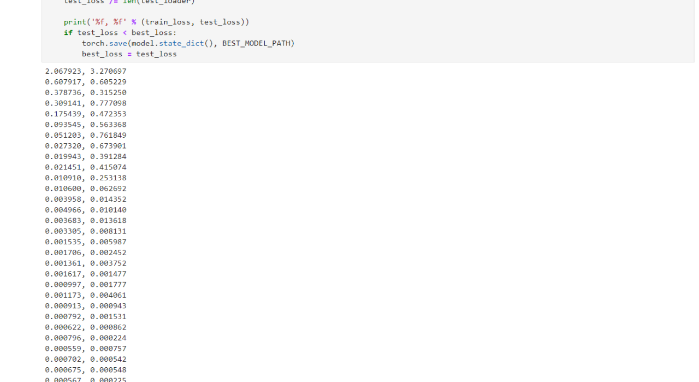
第三步：自主巡线
◾在浏览器地址栏输入http://<jetbot_ip_address>:8888连接到小车，找到Notebooks/road_following，打开live_demo.ipynb文件.运行程序加载模型，打开摄像头实时显示图像 
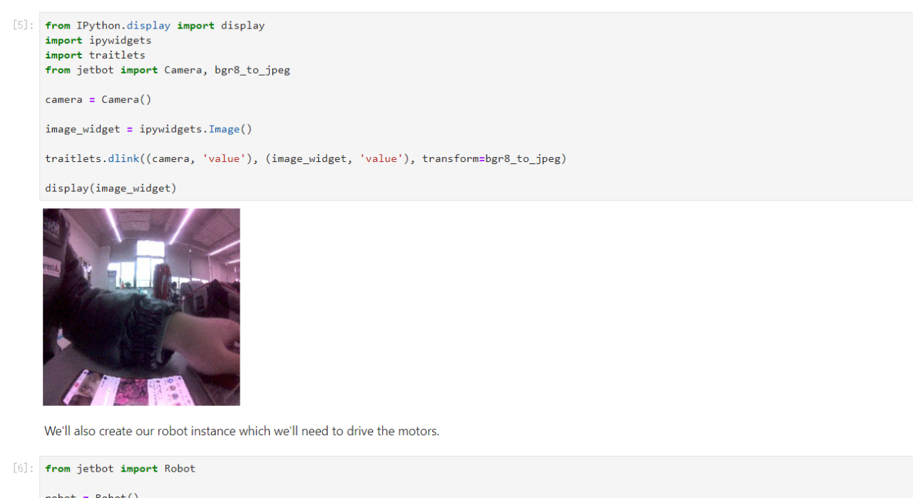
◾程序中有四个参数，可以通过拖动滑条改变参数的值，如果需要实现巡线功能需要根据实际情况调试参数，使巡线的效果更好。 
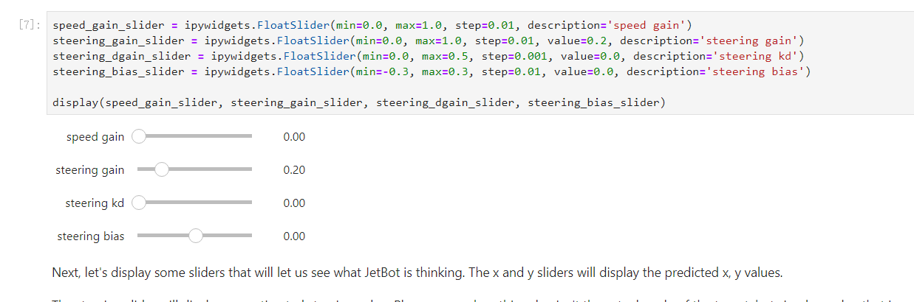
此输出展示jetbot的当前运行情况，x，y表示当前图像预测的x,y值，可以表示转动角度。speed表示jetbot直线速度，steering表示转向速度。
 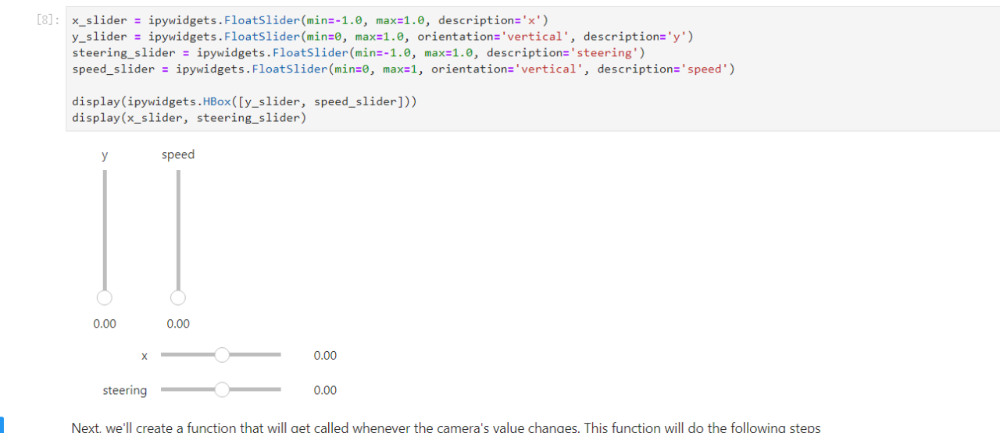

 

## 总结
JetBot是一个开源的全栈系统，使用现成的3D打印部件构建的智能小车。NVIDIA官网网站包含从头开始组装JetBot车辆所需的所有信息，包括详细的材料清单，用于3D打印车架的现成文件，逐步装配说明教程，以及使小车运转的软件。

这一款是专门为NVIDIA JetBot AI 项目设计的智能车套件，基于Jetson Nano Developer Kit。扩展板将OLED，电机驱动电路，电池保护电路等集成在一起，免去你焊接电路的烦恼，支持免卸载充电，无需反复拆卸电池。软件方面完全兼容NVIDIA JetBot AI项目，支持物体识别，目标追踪，自主巡线和避障等功能。

板载三节18650电池，7800mAh大容量，高达12.6V电压输出，电机动力更强
板载S-8254AA + AO4407A锂电池保护电路，具有防过充、防过放、防过流和短路保护功能
板载APW7313稳压芯片，可给Jetson Nano提供稳定的5V电压
板载TB6612FNG双H桥电机驱动芯片，可驱动左右两个电机工作
板载0.91寸128×32分辨率OLED，实时显示小车IP地址，内存，电量等情况
板载ADS1115 AD采集芯片，方便实时监控电池电量

## 心得体会

本次研究耗时两周，经过我们小组的通力协作，最终实现了小车自动避障的功能。并在理论上弄清了 AI 程序的基本原理，明晓了实现小车自动避障与追踪目标功能的过程细节。

我们小组通过查找国内外资料、付诸于实践、不断地修正过程中遇到的错误的方式，实现了从零到一的突破。我们成功地将无形的网络与可见的实体联系起来，以 jetbot 小车为载体实现了机器学习领域的尝鲜，也对机器学习和物联网的应用加深了理解。

同时，在研究的过程中，我们小组学会了如何更好的搜寻、整理资料，提升了阅读英文文档、团队协作、动手操作的能力，同时掌握了寻找过程中错误并分步调试的方法。

总之，本次 jetbot 小车实验带给我们小组所有人的，不止是实践能力的熟练，更是思想境界的提升。
