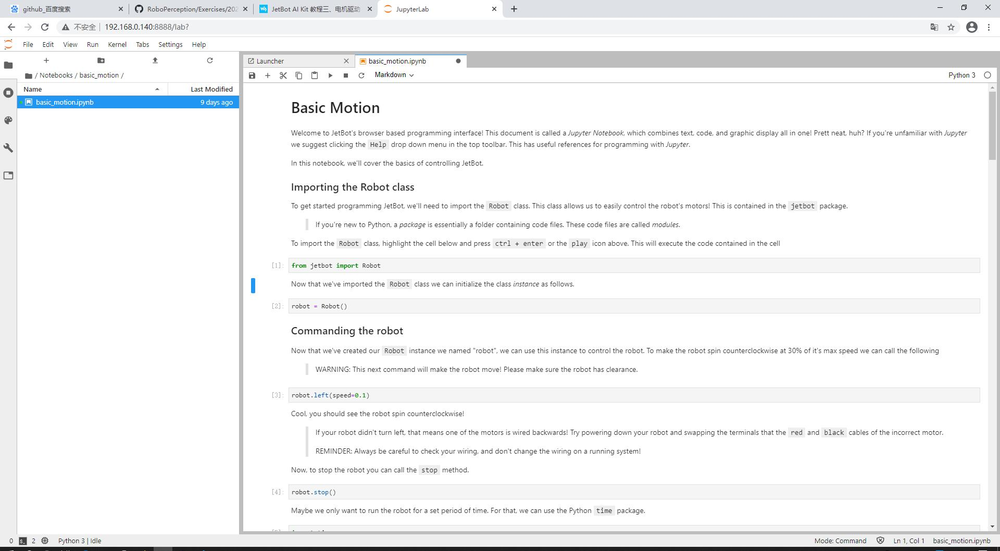
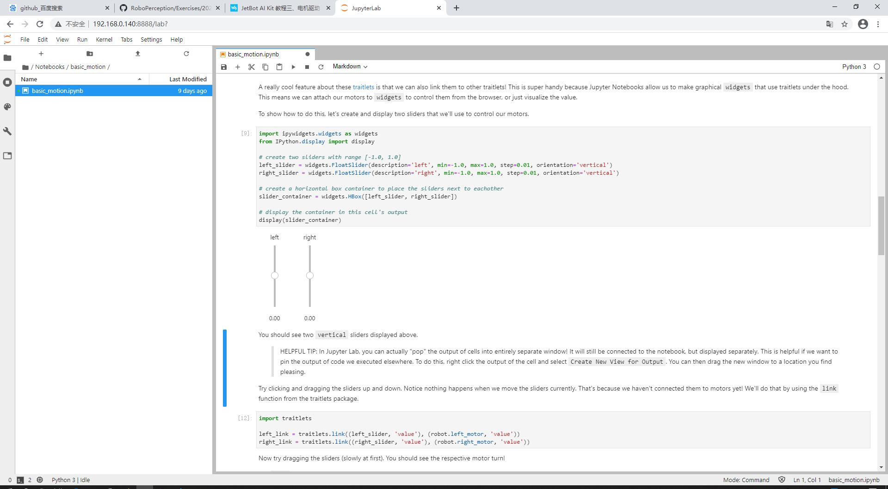
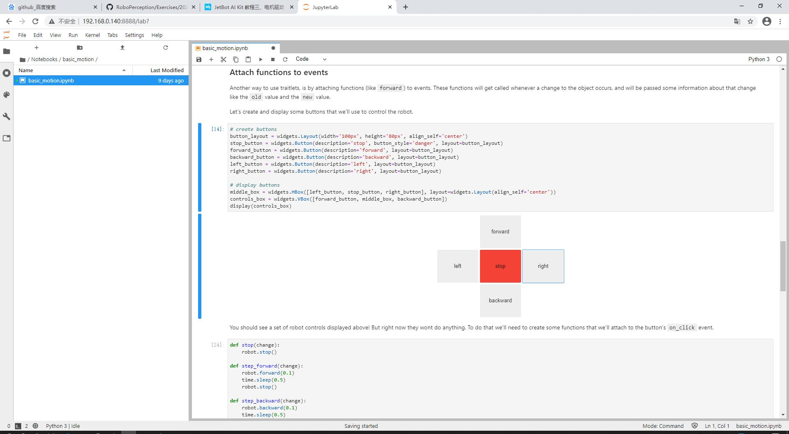

# 电机驱动

在浏览器地址栏输入http://192.168.0.140:8888/连接到小车，左侧打开/Notebooks/basic_motion/。打开basic_motion.ipynb文件


左右拉杆控制小车左右轮的速度


此段代码可以通过网页来控制小车移动


此段代码通过“心跳”来保持小车的正常工作，拖动滑条降低心跳频率后小车会停止转动

## 代码分析

```
robot.left(0.1) //让左轮以0.1速度旋转
time.sleep(0.5) //睡眠0.5秒
robot.stop() //小车停止运动
```

```
robot.forward(0.3) //以0.3速度前进
```

//创建按钮控制小车
```
# create buttons
button_layout = widgets.Layout(width='100px', height='80px', align_self='center')
stop_button = widgets.Button(description='stop', button_style='danger', layout=button_layout)
forward_button = widgets.Button(description='forward', layout=button_layout)
backward_button = widgets.Button(description='backward', layout=button_layout)
left_button = widgets.Button(description='left', layout=button_layout)
right_button = widgets.Button(description='right', layout=button_layout)
# display buttons
middle_box = widgets.HBox([left_button, stop_button, right_button], layout=widgets.Layout(align_self='center'))
controls_box = widgets.VBox([forward_button, middle_box, backward_button])
display(controls_box)
```
## 总结
这部分实验就是通过代码来控制小车的移动，可以在网页上通过摇杆控制小车