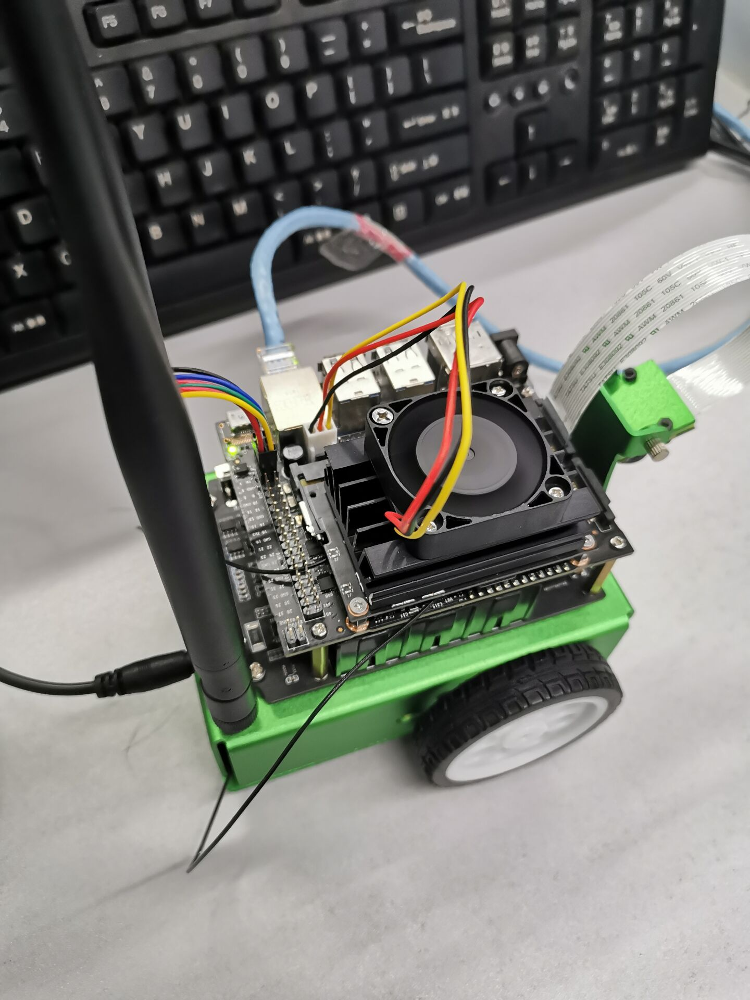

# 组装小车 

## 组装小车步骤

1.在组装小车前，首先要知道有哪些配件，包括电机、金属盒、天线、摄像头、扩展板、Jetson nano、电池座、万向轮、金属底板、车轮、无线网卡等以及螺丝型号。
2.将电机锁到金属盒，注意卡好孔位
3.将天线延长线锁到天线固定孔上，注意垫片位置，将延长线通过金属盒上的孔穿到外侧
4.将摄像头支架固定到金属盒上
5.将扩展板固定铜柱锁到金属盒上，准备安装扩展板
6.将长铜柱预先固定在扩展板上个，方便后面安装Jetson nano
7.将扩展板固定到金属盒上，调整好天线，并将电机线接入扩展板，左边接口连左边电机，右边接口连右边电机
8.将电池装入电池座，注意正负极方向，要参考白色丝印
9.将万向轮上的螺丝拆下，然后将万向轮固定到金属底板上
10.将金属底板固定到金属盒上
11.将车轮对好方向，装入电机中
12.将摄像头转入摄像头支架，注意摄像头之间要个一块亚克力板
13.拆下Jetson nano核心板，将无线网卡装入，并接好天线
14. 将胶棒天线装好
15. 最好把6PIN排线按照丝印对应接好即可
16.组装好了之后，就可以将开关拨到ON上电测试了。注意电池第一次安装时候的时候需要用充电器充一会电才可以正常使用

以下是我们小车组装成功截图：

## 结果分析

组装小车时需要将螺丝拧紧，不然可能会发生运行过程中散架的情况，因为我们需要对小车进行加固。

## 组装小车总结及心得体会
在组装小车之前首先要明确各零部件是什么，如电机，金属盒，天线，摄像头，扩展板，Jetson nano核心板和无线网卡等重要的零部件。在安装的过程中，虽然是按照过程一步步来，但是其中最令人困扰的就是螺旋丝的拧的过程，因为螺丝很小，加上我手很笨拙，安装时属实费力。同时根据设计图组装小车的过程中叶遇到了一些问题。镜头插槽安装方向反了，导致无法和支架安装；在插入处理芯片的时候没有合适的工具，导致芯片插入不牢固；镜头支架固定不牢固，导致小车运动时镜头不稳。至于最不应该犯的错误是风扇方向装反了，导致无法固定。不过问题都在同学和小组成员的帮助下解决了。但是按照过程来问题也不是很大，还是轻松完成。
