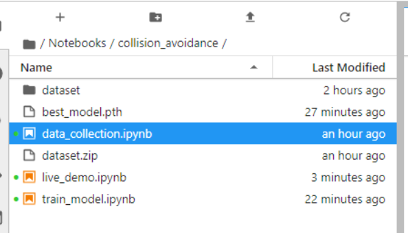
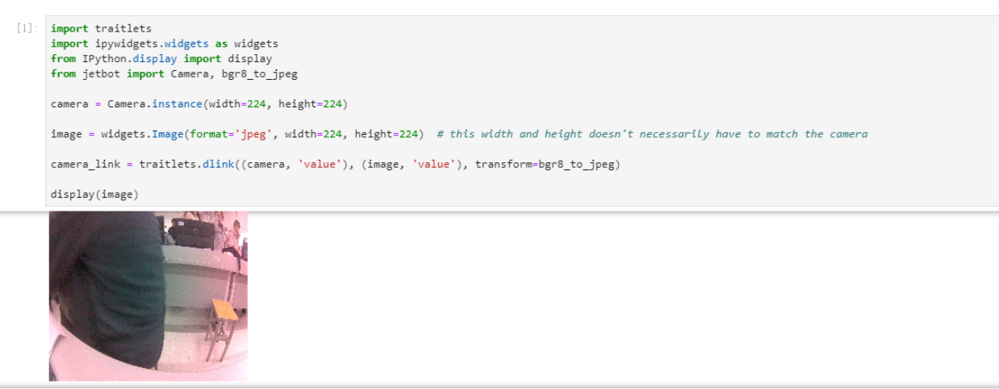
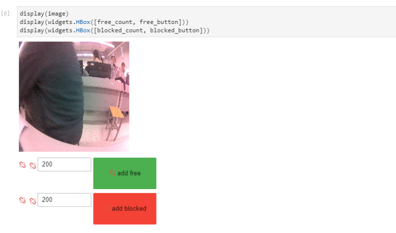
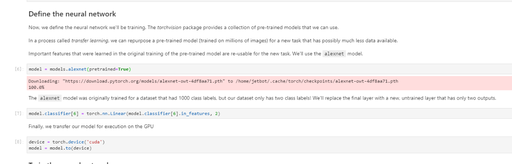
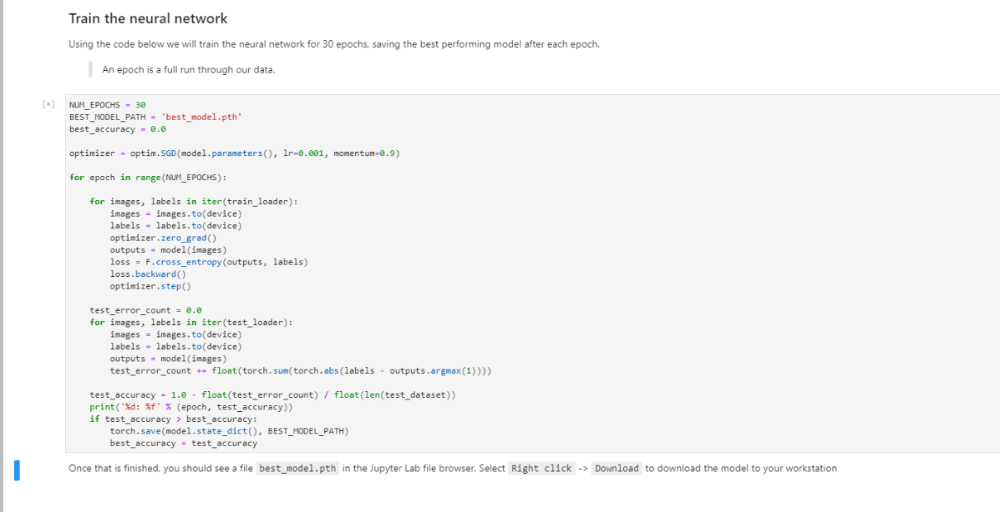
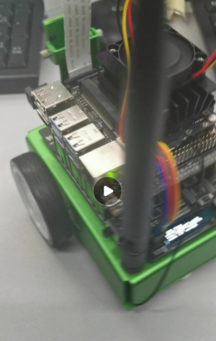

# 自主避障

 ## 1 在JetBot上收集数据

 1. 打开data_collection.ipynb文件
 
 

 2. 镜头测试

 

 3. 显示按键（实验后截图，图片有断连标示）

 

 1. 使用镜头收集数据（实验后截图，图片有断连标示）

 - 在无障碍位置add free
 - 在有障碍位置add blocked

 

 5. 把采集的数据打包
   
   

 ## 2 训练神经网络

 1. 打开train_model.ipynb文件

 

 2. 下载alexnet模型

 

 3. 运行程序训练神经网络

 

 ## 3 自助避障

 1. 打开live_demo.ipynb文件
   
 

 2. 实际运行

  

 ## 结果分析

 - 本次的实验思路很清晰——采样，模型，训练，运行。
 - 小车镜头的取样需要通过网络传输让我们可见，但是讲道理其内置的ubuntu系统和我们收到的信息是不同步的。
 - 采样过程尽量选取不同的物体，同一物体多次采样效果不佳。
 - 选择流畅的网络，否则获得的反馈信息可能延迟很大。

## 心得总结

 - 这是实验过程中第一次明显感受到的阻碍，也是重新设置网络的开始。网络真的对于图像识别有很大的作用，小车作为一个独立的单位并且需要移动，自然不能用串口对其作指令传输和信息采集，所以局域网的速度是决定小车识别速度的原因之一，这一点我深有体会。糟糕的网络问题会让图像显示有近30s的延迟，这注定我们第一次的实验不可能有结果。在调整好网络之后，模型下载，素材采集和学习过程都能很快的完成。由此发现，自动驾驶确实需要网络和其他硬件的发展才可能实现。