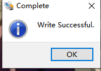
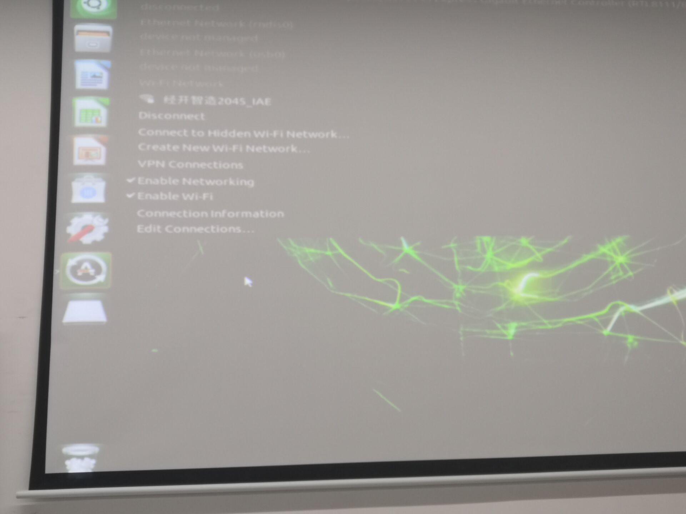
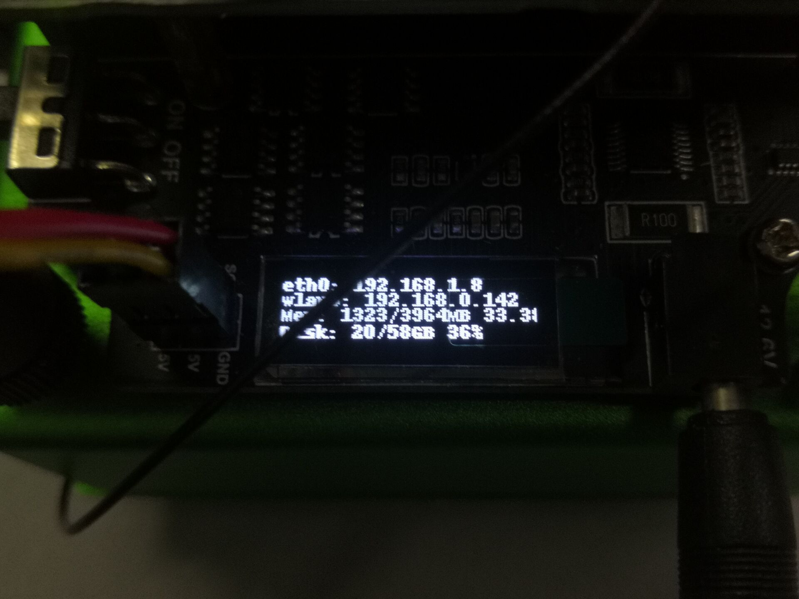
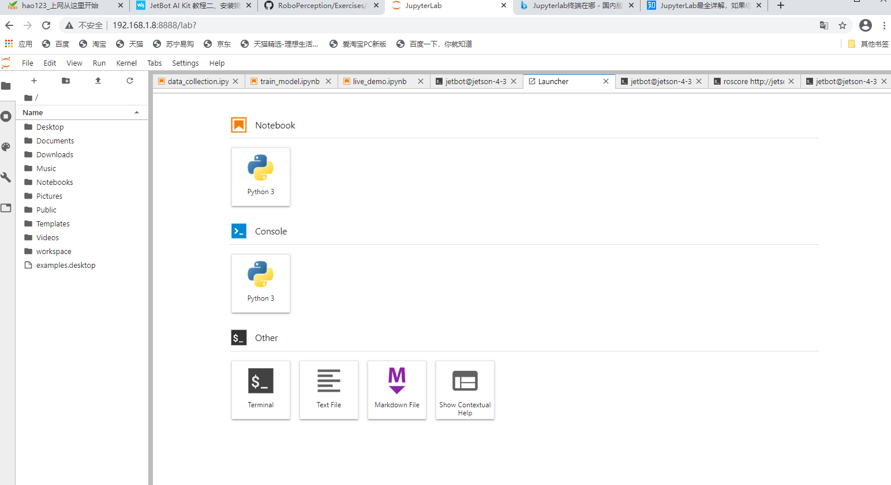

# 镜像的安装

## 步骤1、烧写JetBot镜像

1.下载JetBot镜像jetbot镜像，提取码t64u，并解压出.img 镜像文件
2.将SD卡（最小64G）通过读卡器插入到电脑
3.使用Etcher软件，选择之前解压出来的镜像文件，并将其烧写到SD卡上,烧写完成后，将SD卡弹出。
烧写成功截图如下



## 步骤2、启动Jetson Nano

1.将SD卡插入Jetson Nano (SD 卡槽位于Jetson Nano核心板的背面
2.连接HDMI显示器，键盘和鼠标到Nano
3.连接电源到Jetson Nano，上电启动Jetson Nano

检查完成后我们的硬件没有问题

## 步骤3、连接JetBot到WIFI

由于后面的程序需要用到无线连接，所以这里需要先将Jetbot连接上WIFI

1.登录系统，Jetbot系统的默认用户名和密码均为Jetbot
2.点击系统右上角网络图标连接WIFI
3.关机断电。将Jetbot小车组装好。并启动Jetson nano。启动的时候系统会自动连接WIFI，并同时在OLED显示器上显示IP地址
截图如下：



## 步骤4、Web浏览器连接JetBot

1.JetBot 正常连接WIFI之后，去掉HDMI显示器，USB键盘，鼠标。关机并去掉电源
2.打开JetBot电源开关等待JetBot启动
3.正常启动之后再OLED屏幕上回显示有小车的IP地址
4.在浏览器输入JetBot的IP地址打开。Port为8888， 比如：192.168.1.8:8888

## 步骤5、安装最新软件

JetBot的GitHub上提供软件可能比预装在镜像的要新。注意：我们提供的程序和JetBot官方github给出的有点区别，你如果直接更新了官方最新的软件，程序将不再会显示当前的电池点电量，且电机无法正常驱动
1.在浏览器地址栏输入http://192.168.1.8:8888连接到小车
2.首次打开需要输入用户名和密码登录。默认用户名和密码均为jetbot

3.打开一个终端
4.输入以下的指令来安装新的软件库，这里给出的是微雪版本（相对于NVIDIA官方版本增加了电压显示）
```
git clone https://github.com/waveshare/jetbot  通过git命令下载该版本
cd jetbot 进入jetbot目录
sudo python3 setup.py install 下载Python3
```
然后将更新的软件库覆盖掉旧的软件库
```
cd 进入主目录
sudo apt-get install rsync 安装rsync
rsync -r jetbot/notebooks ~/Notebooks 将新目录覆盖旧目录
```
步骤6、配置电源模式
1.可以使用以下命令将Jetson Nano的功耗模式切换为5W模式，确保电池组可以正常供电
2.浏览器打开http://192.168.1.8:8888连接到小车，另启动一个终端
切换为5W功耗模式
sudo nvpmodel -m1
3.检查一下确认JetBot处于5W功耗模式
nvpmodel -q

由于我们的软件库是从百度网盘上拷下来的，所以似乎并没有实现步骤5和步骤6

## 结果分析

在烧写的时候速度很慢，可能就我们组是这个情况。但是也不知道原因是什么，希望可以得到解决。后面的进入网站就很简单，直接输入小车网址就行。需要注意的是小车每次更改网络网址就会发生改变，需要根据小车网址进去。

## 安装镜像总结及心得体会

在老师的帮助下，在教室的主机上烧写一份镜像在sd卡上，然后将其插入到核心板上，之后确保Jetson Nano没有问题，组装后让小车连接WiFi，在浏览器上连接小车更新软件。做完实验二的步骤后，感觉实验才刚刚开始，能够成功进入JupyterLab网站，缺点是教室网很慢，很耽误时间。还有就是写入的速度很令人着急，所以找了写入与拷贝的区别——

拷贝：拷贝就相当于复制，区别不大。

写入：写入不仅仅复制了文件，同样保留了文件之间的组成形式，保留了功能。我们知道，以iso系统安装盘为例，电脑可以通过系统盘启动安装，但是你复制光盘的东西到U盘就不能启动安装，你需要通过软件写入，然后U盘里面就既包含文件又包含引导系统，可以当做启动光盘来装系统。