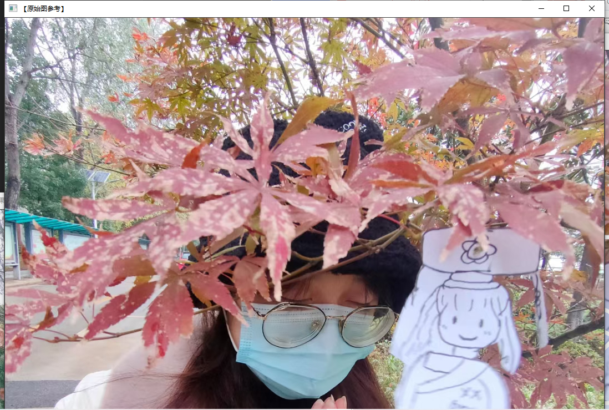
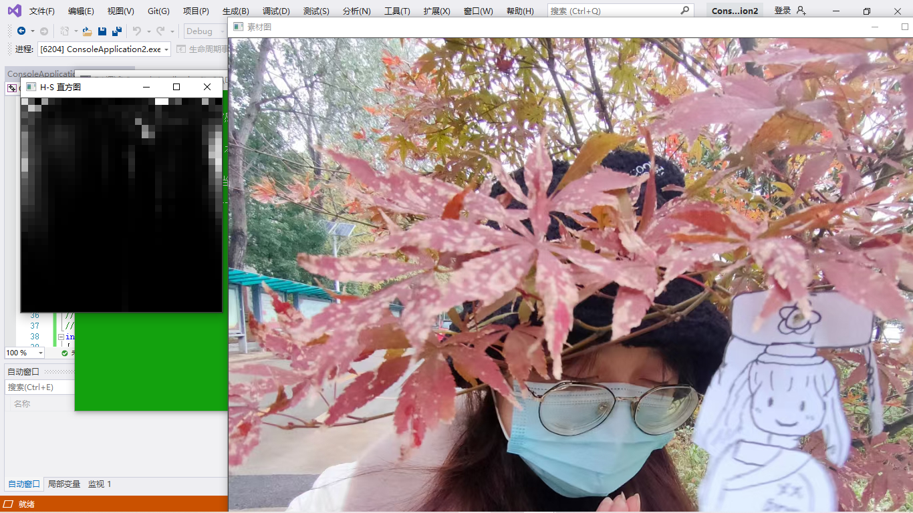
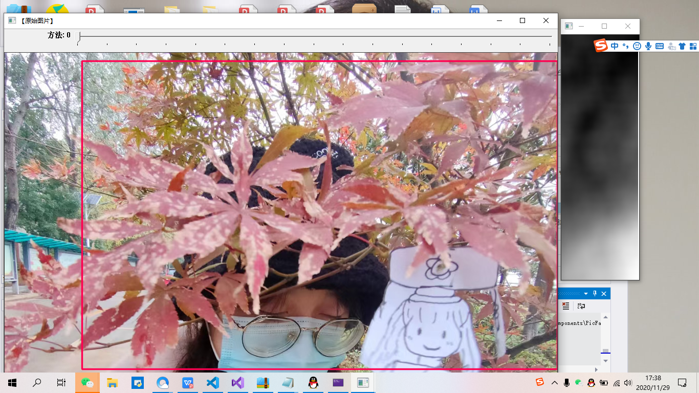

#### 图像处理
#### 线性滤波
##### 平滑处理
 平滑处理( smoothing)也称模糊处理( bluring)，是-种简单且使用频率很高的图像处理方法。平滑处理的用途有很多，最常见的是用来减少图像上的噪点或者失真。在涉及到降低图像分辨率时，平滑处理是非常好用的方法。
 ##### 图像与滤波器
图像滤波,指在尽量保留图像细节特征的条件下对目标图像的噪声进行抑制，是图像预处理中不可缺少的操作，其处理效果的好坏将直接影响到后续图像处理和分析的有效性和可靠性.消除图像中的噪声成分叫作图像的平滑化或滤波操作.信号或图像的能量大部分集中在幅度谱的低频和中频段，而在较高频段，有用的信息经常被噪声淹没.因此一个能降低高频成分幅度的滤波器就能够减弱噪声的影响.图像滤波的目的有两个:一个是抽出对象的特征作为图像识别的特征模式；另一个是为适应图像处理的要求，消除图像数字化时所混入的噪声.而对滤波处理的要求也有两条:一.是不能损坏图像的轮廓及边缘等重要信息：二是使图像清晰视觉效果好.平滑滤波是低频增强的空间域滤波技术.它的目的有两类：-~类是模糊:另一类是消除噪音.
##### 线性滤波器的简介
- 低通滤波器:允许低频率通过;
- 高通滤波器:允许高频率通过;
- 带通滤波器:允许一定范围频率通过;
- 带阻滤波器:阻止一定范围频率通过并且允许其他顿率通过;
- 全通速波器:允许所有频率通过，仅仅改变相位关系;
- 陷波滤波器（Band-Stop Filtcr):阻止一个狭窄颊率范围通过，是一种特殊 带阻滤波器。
##### 滤波和模糊
- 高斯滤波是指用高斯函数作为滤波函数的滤波操作
- 高斯模糊就是高斯低通滤波。
##### 领域算子与线性领域滤波
邻域算子(局部算子)是利用给定像素周围的像素值的决定此像素的最终输 出值的一种算子。而线性邻域滤波就是-种常用的邻域算子，像素的输出值取决 于输入像素的加权和，具体过程如图6.1所示。.
邻域算子除了用于局部色调调整以外，还可以用于图像滤波，以实现图像的 平滑和锐化，图像边缘增强或者图像噪声的去除。本节我们介绍的主角是线性邻 域滤波算子，即用不同的权重去结合一一个小邻域内的像素，来得到应有的处理效果。
##### 方框滤波
方框滤波被封装在一个名为boxblur的函数中，即boxblur函数的作用是使用方框滤波器来模糊一张图片，从scr输入，从dst输出。
##### 均值滤波
1.均值滤波的理论简析
均值滤波是典型的线性滤波算法，主要方法为邻域平均法，即用一片图像区 域的各个像素的均值来代替原图像中的各个像素值。一般需要在图像上对目标像 素给出一个模板(内核)，该模板包括了其周围的临近像素(比如以目标像素为中 心的周围8 (3x3-1)个像素，构成一个滤波模板，即去掉目标像素本身)。再用模 板中的全体像素的平均值来代替原来像素值。即对待处理的当前像素点(x.y), 选择一个模板，该模板由其近邻的若干像素组成，求模板中所有像素的均值，再 把该均值赋予当前像素点(x,y), 作为处理后图像在该点上的灰度点g (x,y)， 即 g (x,y) =1/mEf (x,y),其中m为该模板中包含当前像素在内的像素总个数。
2.均值滤波的缺陷
均值滤波本身存在着固有的缺陷，即它不能很好地保护图像细节，在图像去 噪的同时也破坏了图像的细节部分，从而使图像变得模糊，不能很好地去除噪声 点。
3.在OpenCV中使用均值滤波一-blur 函数
blur函数的作用是:对输入的图像sre进行均值滤波后用dst输出。
##### 高斯滤波
- 高斯滤波是一种线性平滑滤波，可以消除高斯噪声，广泛应用于图像处理的 减噪过程。通俗地讲，高斯滤波就是对整幅图像进行加权平均的过程，每一个像 素点的值，都由其本身和邻域内的其他像素值经过加权平均后得到。高斯滤波的 具体操作是:用一个模板(或称卷积、掩模)扫描图像中的每一个像素，用模板 确定的邻城内像素的加权平均灰度值去替代模板中心像素点的值。
- GaussianBlur函数的作用是用高斯滤波器来模糊一张图片，对输入的图像src进行高斯滤波后用dst输出。
#### 非线性滤波：中值滤波、双边滤波
##### 中值滤波
中值滤波（Median filter）是一种典型的非线性滤波技术，基本思想是用像素 点邻域灰度值的中值来代替该像素点的灰度值，该方法在去除脉冲噪声、椒盐噪 声的同时又能保留图像的边缘细节。
##### 中值滤波与均值滤波器比较
优势:在均值滤波器中，由于噪声成分被放入平均计算中，所以输出受到了 噪声的影响。但是在中值滤波器中，由于噪声成分很难选上，所以几乎不会影响 到输出。因此同样用3x3区域进行处理，中值滤波消除的噪声能力更胜- -筹。中. 值滤波无论是在消除噪声还是保存边缘方面都是--个不错的方法。
劣势:中值滤波花费的时间是均值滤波的5倍以上。.
##### 双边滤波
双边滤波(Bilateral filter) 是一种非线性的滤波方法，是结合图像的空间邻 近度和像素值相似度的-.种折中处理，同时考虑空域信息和灰度相似性，达到保 边去噪的目的，具有简单、非迭代、局部的特点。
双边滤波器的好处是可以做边缘保存(edge preserving)。 以往常用维纳滤波 或者高斯滤波去降噪，但二者都会较明显地模糊边缘，对于高频细节的保护效果 并不明显。
#### 中值滤波：medianBlur函数
medianBlur函数使用中值滤波器来平滑处理一张图片，从src输入，结果从dst输出。对于多通道图片，它对每一个通道都单独进行处理，并且支持就地操作。
#### 双边滤波：bilateralFilter函数
此函数的作用是双边滤波器来模糊处理一张图片，由src输入图片，结果于dst输出。
综合示例：
代码：

#### 形态学滤波（1）：膨胀与腐蚀
数学形态学(Mathematical morphology) 是- -门建立在格论和拓扑学基础之 上的图像分析学科，是数学形态学图像处理的基本理论。其基本的运算包括:二 值腐蚀和膨胀、二值开闭运算、骨架抽取、极限腐蚀、击中击不中变换、形态学 梯度、Top-hat 变换、颗粒分析、流域变换、灰值腐蚀和膨胀、灰值开闭运算、灰 值形态学梯度等。
膨胀与腐蚀能实现多种多样的功能如下
- 消除噪音
- 分割出独立的图像元素，在图像中连接相邻元素：
- 寻找图像中的明显的极大值区域或极小值区域；
- 求出图像的梯度。

#### 膨胀与腐蚀
代码：

#### 形态学滤波（2):开运算、闭运算、形态学梯度、顶帽、黑帽
- 开运算就是先腐蚀后膨胀的过程。
开运算可以用来消除小物体，在纤细点处分离物体，并且在平滑较大物体的边界的同时不明显改变其面积。
- 闭运算是先膨胀后腐蚀的过程。
闭运算能够排除小型黑洞
- 形态学梯度是膨胀图与俯视图之差。
形态学梯度来保留物体边缘轮廓。
- 顶帽运算是“开运算”的结果图之差，因为开运算带来的结果是放大了裂缝或者局部低亮度的区域。因此，从原图中减去开运算后的图，得到的效果图突出了比原图轮廓周围更明亮的区域。
顶帽运算往往用来分离比邻近点亮一些的斑块。
- 黑帽运算是闭运算的结果图与原图像之差。黑帽运算后的效果图突出了比原图轮廓周围区域更暗的区域，且这一操作和选择的核的大小相关。
黑帽运算用来分离比邻近点暗一些的斑块，效果图有着非常完美的轮廓。
综合示例：
代码

##### 漫水填充
定义：漫水填充法是一种用特定的颜色填充连通区域，通过设置可连通像素的上下 限以及连通方式来达到不同的填充效果的方法。漫水填充经常被用来标记或分离 图像的一部分，以便对其进行进一步处理或分析，也可以用来从输入图像获取掩 码区域，掩码会加速处理过程，或只处理掩码指定的像素点，操作的结果总是某 个连续的区域。
基本思想：所谓漫水填充，简单来说，就是自动选中了和种子点相连的区域，接着将该 区域替换成指定的颜色，这是个非常有用的功能，经常用来标记或者分离图像的 一部分进行处理或分析。漫水填充也可以用来从输入图像获取掩码区域，掩码会 加速处理过程，或者只处理掩码指定的像素点。
以此填充算法为基础，类似 PhotoShop的魔术棒选择工具就很容易实现了。 漫水填充（FloodFill）是查找和种子点连通的颜色相同的点，魔术棒选择工具则 是查找和种子点连通的颜色相近的点，把和初始种子像素颜色相近的点压进栈做 为新种子。
运行效果 

#### 图像金字塔与图片尺寸缩放
图像金字塔最初用于机器视觉和图像压缩，--幅图像的金字塔是-系列以金 字塔形状排列的，分辨率逐步降低且来源于同一张原始图的图像集合。其通过梯 次向下采样获得，直到达到某个终止条件才停止采样。
两种类型的图像金字塔：
- 高斯金字塔——用来向下采样，主要的图像金字塔。
- 拉普拉斯金字塔——用来从金字塔底层图像重建上层未采样图像，在数字图像处理中也即是预测残差，可以对图像进行最大程度的还原，配合高斯金字塔一起使用。
运行效果

#### 图像变换
##### 边缘检测
边缘检测的一般步骤：
1.【第一步】滤波
2.【第二波】增强
3.【第三步】检测
最优边缘检测的三个主要标准：
●低错误率:标识出尽可能多的实际边缘，同时尽可能地减少噪声产生的误 报。
●高定位性:标识出的边缘要与图像中的实际边缘尽可能接近。
●最小响应:图像中的边缘只能标识-次，并且可能存在的图像噪声不应标 识为边缘
canny边缘检测的步骤：
1.【第一步】消除噪声
2.【第二步】计算梯度幅值和方向
3.【第三步】非极大值抑制
3.【第四步】滞后阈值
##### sobel算子的基本概念
Sobel算子是-一个主要用于边缘检测的离散微分算子(discrete difentiation operator)。它结合了高斯平滑和微分求导，用来计算图像灰度函数的近似梯度。 在图像的任何一点使用此算子，都将会产生对应的梯度矢量或是其法矢量。
综合示例：边缘检测
代码演示：
效果：
#### 霍夫变换
霍夫变换概述：霍夫变换是图像处理中一种特征提取技术，该过程在一个参数空间中通过计算累计结果的局部最大值得到一个符合该特定形状的集合作为霍夫变换的结果。
opencv中霍夫线变换三种：
1.标准霍夫变换，由HoughLines函数调用。
2.多尺度霍夫变换，由HoughLines函数调用。
3.累计概率霍夫变换，由houghLinesp函数调用。
#####霍夫梯度法的原理是这样的:
1）首先对图像应用边缘检测，比如用canny 边缘检测。
(2）然后，对边缘图像中的每一个非零点，考虑其局部梯度，即用Sobel()函 数计算x和y方向的 Sobel一阶导数得到梯度。
(3）利用得到的梯度，由斜率指定的直线上的每一个点都在累加器中被累加， 这里的斜率是从一个指定的最小值到指定的最大值的距离。
(4）同时，标记边缘图像中每一个非О像素的位置。
(5）然后从二维累加器中这些点中选择候选的中心，这些中心都大于给定阙 值并且大于其所有近邻。这些候选的中心按照累加值降序排列，以便于最支持像 素的中心首先出现。
(6）接下来对每一个中心，考虑所有的非О像素。
(7）这些像素按照其与中心的距离排序。从到最大半径的最小距离算起，选 择非0像素最支持的一条半径。
(8）如果一个中心收到边缘图像非О像素最充分的支持，并且到前期被选择 的中心有足够的距离，那么它就会被保留下来。
#####霍夫梯度法的缺点
1）在霍夫梯度法中，我们使用Sobel导数来计算局部梯度，那么随之而来 的假设是，它可以视作等同于一条局部切线，这并不是一个数值稳定的做法。在 大多数情况下，这样做会得到正确的结果，但或许会在输出中产生一些噪声。
(2）在边缘图像中的整个非О像素集被看做每个中心的候选部分。因此，如 果把累加器的阈值设置偏低，算法将要消耗比较长的时间。此外，因为每一个中 心只选择一个圆，如果有同心圆，就只能选择其中的一个。
(3）因为中心是按照其关联的累加器值的升序排列的，并且如果新的中心过 于接近之前已经接受的中心的话，就不会被保留下来。且当有许多同心圆或者是 近似的同心圆时，霍夫梯度法的倾向是保留最大的一个圆。可以说这是一种比较 极端的做法，因为在这里默认Sobel导数会产生噪声，若是对于无穷分辨率的平 滑图像而言的话，这才是必须的。
综合示例代码：

##### 重映射
重映射概念： 重映射，就是把一幅图像中某位置的像素放置到另一个突变指定位置的过程。
##### 仿射变换
仿射变换定义：是指在几何中，一个向量空间进行一次线性变换并接上一个平移，变换为另一个向量空间的过程。它保持了二维图形的“平直性”和“平行性”
仿射变换三种常见的变换形式：
1.旋转(线性变换)
2.平移（向量加）
3.缩放（线性变换）
仿射变换的求法
1.已知X和T，而且已知它们是有联系的。接下来的工作就是求出矩阵M。 
2.己知M和X，想求得T。只要应用算式T-=M·X即可。对于这种联系的信 息可以用矩阵M清晰地表达（即给出明确的2×3矩阵)，也可以用两幅图片 点之间几何关系来表达。
综合示例：
代码演示： 

##### 直方图均衡化
直方图均衡化的概念和特点
直方图均衡化是灰度变换的一个重要应用，它高效且易于实现，广泛应用于图像增强处理中。图像的像素灰度变化是随机的，直方图的图形高低不齐，直方图均衡化就是用一定的算法使直方图大致平和的方法
代码演示：

#### 图像轮廓与图像分割修复
#### 综合示例程序：查找并绘制轮廓
代码演示：

#### 寻找物体的凸包
凸包：凸包(Convex Hull)是-一个计算几何(图形学)中常见的概念。简单来说， 给定二维平面上的点集，凸包就是将最外层的点连接起来构成的凸多边型，它是 能包含点集中所有点的。理解物体形状或轮廓的一种比较有用的方法便是计算一- 个物体的凸包，然后计算其凸缺陷(convexity defects)。很多复杂物体的特性能很 好地被这种缺陷表现出来。
凸包检测程序

综合程序：寻找和绘制物体的凸包

查找和绘制图像轮廓程序示例：

#### 分水岭算法
分水岭算法，是一种基于拓扑理论的数学形态学的分割方法，其基本思想 是把图像看作是测地学上的拓扑地貌，图像中每一点像素的灰度值表示该点的 海拔高度，每一个局部极小值及其影响区域称为集水盆，而集水盆的边界则形 成分水岭。分水岭的概念和形成可以通过模拟没入过程来说明:在每一个局部 极小值表面，刺穿- 一个小孔， 然后把整个模型慢慢浸入水中，随着浸入的加深， 每一个局部极小值的影响域慢慢向外扩展，在两个集水盆汇合处构筑大坝，即 形成分水岭。
分水岭的计算过程是一个迭代标注过程。分水岭比较经典的计算方法是由 L. Vincent 提出的。在该算法中，分水岭计算分两个步骤:一个是排序过程， 一个是淹没过程。首先对每个像素的灰度级进行从低到高的排序，然后在从低 到高实现淹没的过程中，对每一-个局部极小值在h阶高度的影响域采用先进先 出(FIFO)结构进行判断及标注。分水岭变换得到的是输入图像的集水盆图像, 集水盆之间的边界点，即为分水岭。显然，分水岭表示的是输入图像的极大值 点。
综合示例程序：
分水岭算法
演示结果：

图像修补演示结果：

#### 直方图与匹配
图像直方图（Image Histogram）是用以表示数字图像中亮度分布的直方图， 标绘了图像中每个亮度值的像素数。可以借助观察该直方图了解需要如何调整亮 度分布。这种直方图中，横坐标的左侧为纯黑、较暗的区域，而右侧为较亮、纯 白的区域。因此，一张较暗图片的图像直方图中的数据多集中于左侧和中间部分， 而整体明亮、只有少量阴影的图像则相反。计算机视觉领域常借助图像直方图来 实现图像的二值化。
直方图就是对数据进行统计的一种方法， 并且将统计值组 织到一系列事先定义好的bin当中。其中，bin 为直方图中经常用到的一个概念。 可翻译为“直条”或“组距”，其数值是从数据中计算出的特征统计量，这些数据 可以是诸如梯度、方向、色彩或任何其他特征。且无论如何，直方图获得的是数 据分布的统计图。通常直方图的维数要低于原始数据。总而言之，直方图是计算 机视觉中最经典的工具之一。
直方图的意义如下。
·直方图是图像中像素强度分布的图形表达方式。
·它统计了每一个强度值所具有的像素个数。
二维直方图的绘制：

一维直方图的绘制：

#### 直方图对比
对于直方图来说，一个不可或缺的工具便是用某些具体的标准来比较两个 直方图的相似度。要对两个直方图(比如说H和H2)进行比较，首先必须选 择一个衡量直方图相似度的对比标准(d(H,H))。 在OpenCV 2.X中，我们用 compareHist()函数来对比两个直方图的相似度，而此函数的返回值就是 d(H1,H2)。
#### 对比直方图：compareHist（）函数
compareHist（）函数用于对两幅直方图进行比较。
比较直方图的四种方法
- 相关，Correlation（method=CV_COMP_CORREL)
- 卡方，Chi-Square(method=CV_COMP_CHISQR)
- 直方图相交，intersection（method=CV_COMP_INTERSECT)
- Bhattacharyya距离（method=CV_COMP_BHATTACHARYYA)
程序测试
测试效果：
#### 反向投影
反向投影的概述：如果-幅图像的区域中显示的是一种结构纹理或者一个独特的物体，那么这 个区域的直方图可以看作- -个 概率函数，其表现形式是某个像素属于该纹理或物 体的概率。
而反向投影(back projection)就是一种记录给定图像中的像素点如何适应直 方图模型像素分布方式的一种方法。
简单的讲，所谓反向投影就是首先计算某- -特征的直方图模型，然后使用模 型去寻找图像中存在的该特征的方法。
反向投影的工作原理：
使用模型直方图检测测试图像中皮肤区域的检测步骤：
(1)对测试图像中的每个像素(iJ)，获取色调数据并找到该色调(hyrSu) 在直方图中的bin的位置。
(2)查询模型直方图中对应bin的数值。
(3)将此数值储存在新的反射投影图像中。也可以先归一化直方图数值到0-255范围，这样可以直接显示反射投影图像(单通道图像)。
(4)通过对测试图像中的每个像素采用以上步骤，可以得到最终的反射投影 图像。
（5）使用统计学的语言进行分析。反向投影储存的数值代表了测试图像中该像素属于皮肤区域的概率。
反向投影的作用
：反向投影用于在输入图像（通常较大）中查找与特定图像（通常较小或者仅 l个像素，以下将其称为模板图像）最匹配的点或者区域，也就是定位模板图像 出现在输入图像的位置。
反向投影的结果：
反向投影的结果包含了以每个输入图像像素点为起点的直方图对比结果。可 以把它看成是一个二维的浮点型数组、二维矩阵，或者单通道的浮点型图像。
程序测试
测试效果：

#### 模板匹配
模板匹配的概念与原理
模板匹配是一项在一幅图像中寻找与另一幅模板图像最匹配(相似)部分的 技术。在OpenCV2和OpenCV3中，模板匹配由MatchTemplate()函数完成。需要 注意，模板匹配不是基于直方图的，而是通过在输入图像上滑动图像块，对实际 的图像块和输入图像进行匹配的-种匹配方法。
6种图像匹配方法可供使用
- 1.平方差匹配法 method=TM_SQDIFF
- 2.归一化平方差匹配法 method=TM_SQDIFF_NORMED
- 3.相关匹配法 method=TM_CCORR
- 4.归一化相关匹配法 method=TM_CCORR_NORMED
- 5.系数匹配法 method=TM_CCOEFF
- 6.化相关系数匹配法 method=TM_CCOEFF_NORMED
代码示例
运行效果：
