## 第一章OpenCV
#### 1.OpenCV的安装

#### 2.图像显示
用imread函数载入到新版本的图像存储数据结构Mat类中，然后用imshow函数显示
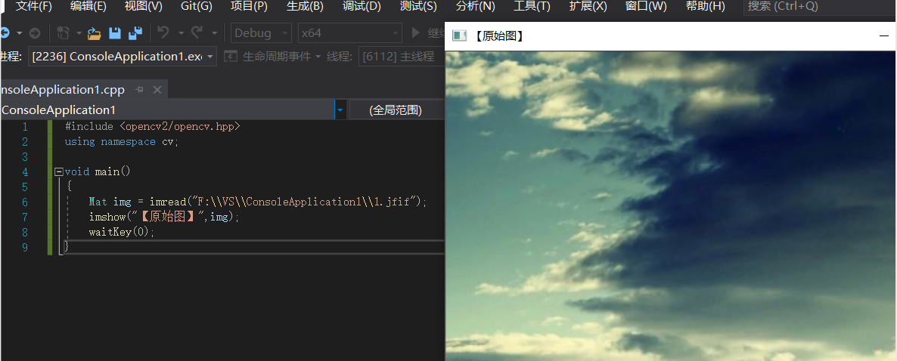
#### 3.图像腐蚀
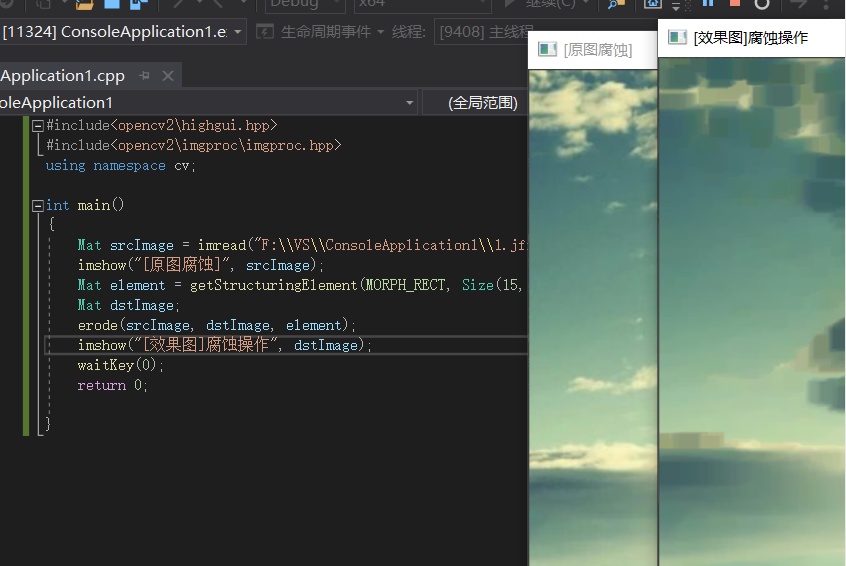
#### 4.图像模糊
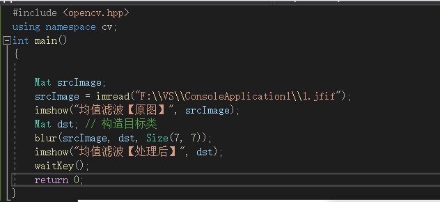

#### 5.canny边缘检测
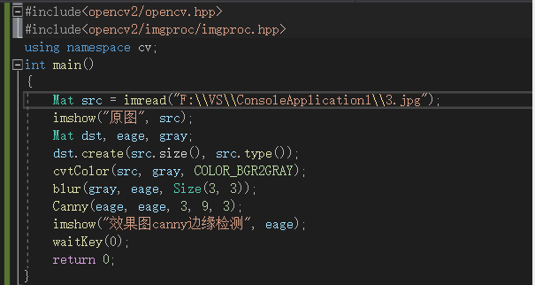
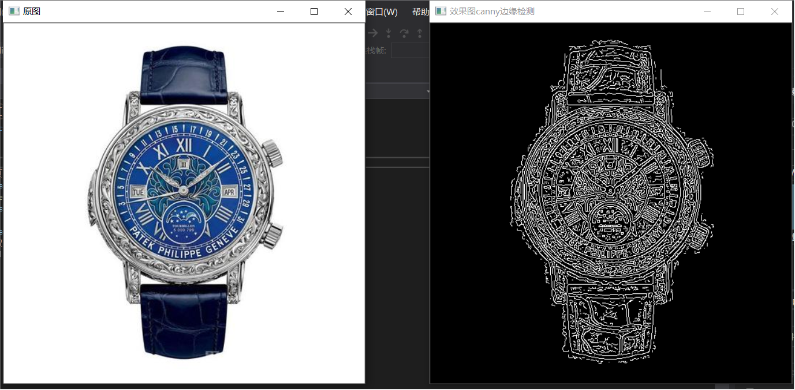
#### 6.读取播放视频
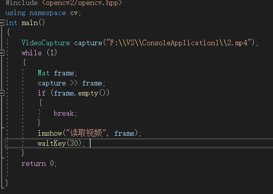
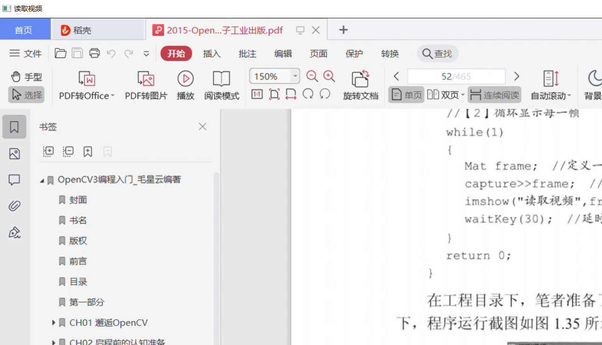
#### 7.调用摄像头采集图像

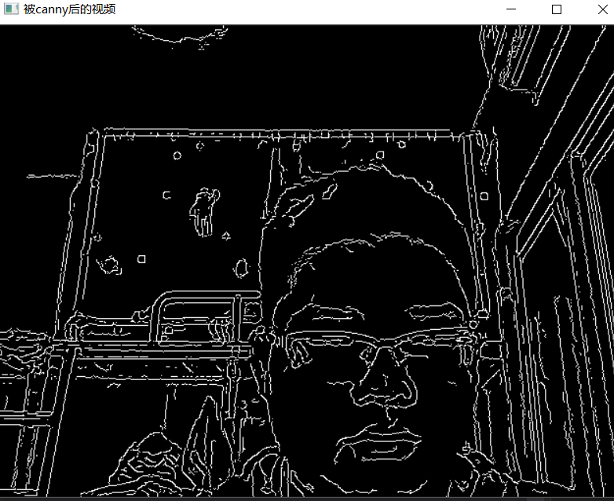

## 第二章认知准备
#### 1."opencv.hpp"头文件
opencv.hpp中包含了Opencv中各模块的头文件,原则上仅写上#include<opencv2/opencv.hpp>即可，为了方面理解会写上下面相应的模块：
```
#include"opencv2/core/core_c.h"

#include"opencv2/core/core.hpp"

#include"opencv2/flann/miniflann.hpp"

#include"opencv2/imgproc/imgproc_c.h"

#include"opencv2/imgproc/imgproc.hpp"

#include"opencv2/photo/photo.hpp"

#include"opencv2/video/video.hpp"

#include"opencv2/features2d/features2d.hpp"

#include"opencv2/objdetect/objdetect.hpp"

#include"opencv2/calib3d/calib3d.hpp"

#include"opencv2/ml/ml.hpp"

#include"opencv2/highgui/highgui_c.h"

#include"opencv2/highgui/highgui.hpp"

#include"opencv2/contrib/contrib.hpp"
```
#### 2.命名规范约定

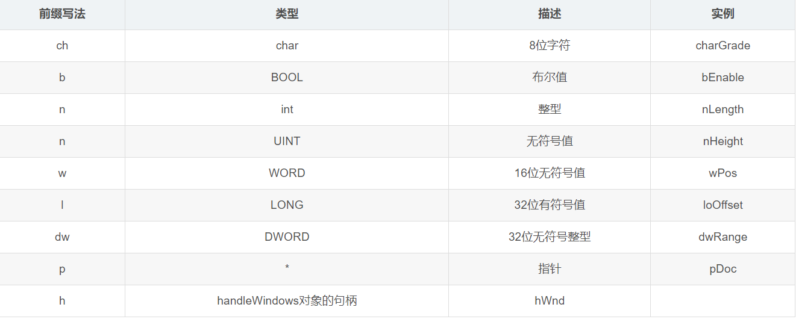
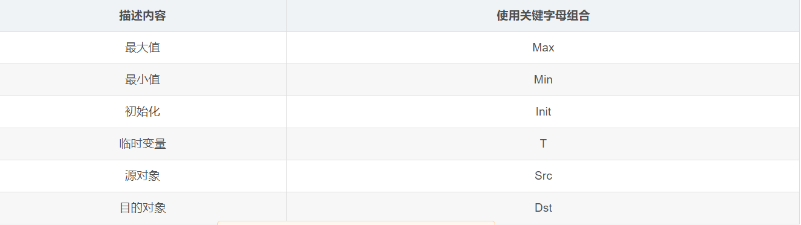
#### 3.argc与argv参数解惑
第一个参数argc用来存放命令行参数的个数
第二个参数argv是指针数组，它是用来存放命令行中各个参数和命令字的字符串的
这里，argc的值和argv[]各元素的值都是系统自动组赋值的
1、int argc：类型为整形。用来统计程序运行时发送给main函数的命令行参数个数，在Vsiual Studio中默认值为1。
2、char * argv[]：为字符串数组，用来存放指向的字符串参数的指针数组，每一个元素指向一个参数。
argv[0]:指向程序运行的全路径名     
argv[1]:指向在DOS命令行中执行程序名后的第一个字符串
argv[2]:指向执行程序名后的第二个字符串
argv[3]:指向执行程序名后的第三个字符串 
argv[argc]:为NULL
#### 4.格式输出函数printf()
格式输出函数的一般形式
$ 函数原型： int printf(char * format[,argument,…]);$
函数功能：按规定格式向输出设备（一般为显示器）输出数据，并返回实际输出的字符数，若出错，则返回负数。
它使用的一般形式为：
$ printf("格式控制字符串",输出项列表);$
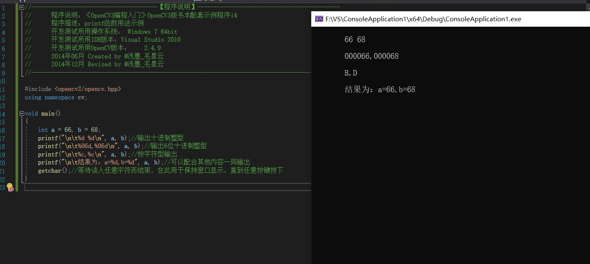

## HighGUI图形用户界面初步
#### 图像的载入、显示、输出
图像的载入和显示
- imread函数
Mat imread(const string& filename, intflags=1 );  
- namedWindow函数
用于创建一个窗口
void namedWindow(const string& winname,int flags=WINDOW_AUTOSIZE ); 
- imshow函数
在指定的窗口中显示一幅图像
void imshow(const string& winname, InputArray mat);
- 输出图像到文件——imwrite函数
bool imwrite(const string& filename,InputArray img, const vector<int>& params=vector<int>() ); 
1. 第一个参数，const string&类型的filename，填需要写入的文件名就行了，带上后缀，比如，“123.jpg”这样。
2. 第二个参数，InputArray类型的img，一般填一个Mat类型的图像数据就行了。
3. 第三个参数，const vector<int>&类型的params，表示为特定格式保存的参数编码，它有默认值vector<int>()，所以一般情况下不需要填写

利用imwrite函数生成图像
运行结果：
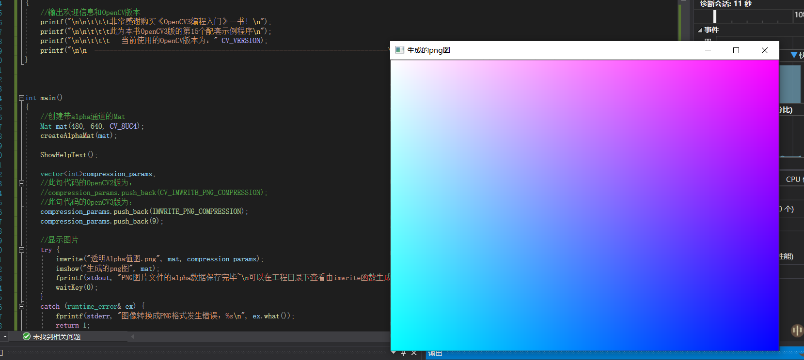
综合示例：图像的载入、显示与输出
代码实现：
运行结果：

学习总结：
第一章基本了解了OpenCV和其周边概念，分析了其基本框架。学习并完成OpenCV的下载、安装与配置。通过四个小的图像处理程序，基本了解了OpenCV对图像的处理。最后了解OpenCV调用摄像头的方式。
第二章了解并学习了OpenCV的相关实用知识，在学习的过程中对OpenCV也有了一个宏观的认识。此外还有一些命名规范的约定和C语言基础函数的复习。
第三章学习了opencv高层GUI图形用户界面模块highgui中最重要的几个方面，加强对opencv功能的了解
心得体会：
初步了解openCV的功能，分析了其基本框架，为之后学习奠定基础
OpenCV命名空间2种访问方法
（1）代码开头加：usingnamespace cv;
（2）每个类或函数前加：cv::
Mat类
（1）Mat类用于保存图像及其他矩阵数据，默认尺寸0
（2）定义Mat对象： cv::Mat pic(320，640，cv::Scalar(100));