#  初识OPENCV及简易安装

## 一. 安装OPENCV
1. 下载OPENCV4.5.0
2. 配置环境变量，将OPENCV的下载路径加入到环境变量PATH里面
3. 在Vstudio中调配，【1】创建新C++控制面板工程【2】在右侧属性管理器中双击Debug，链接包含目录和库目录，添加附加依赖项
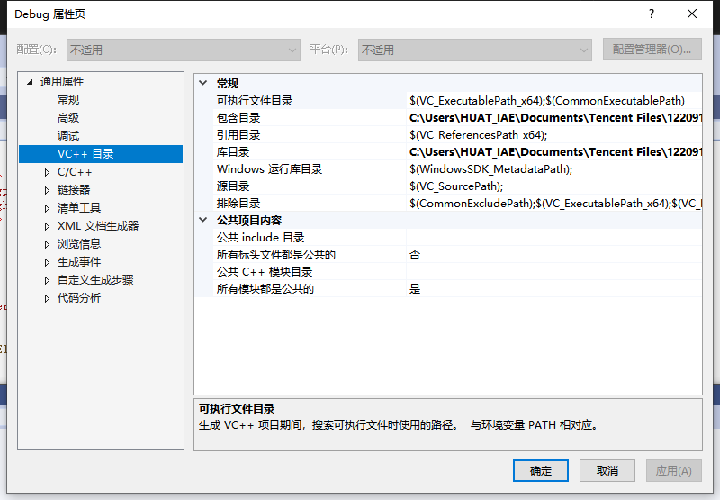
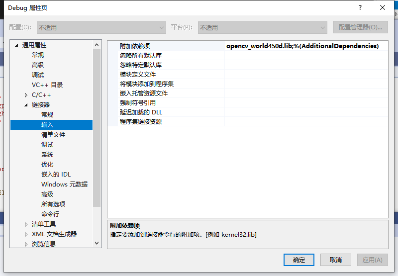
4. 使用测试程序尝试是否成功 
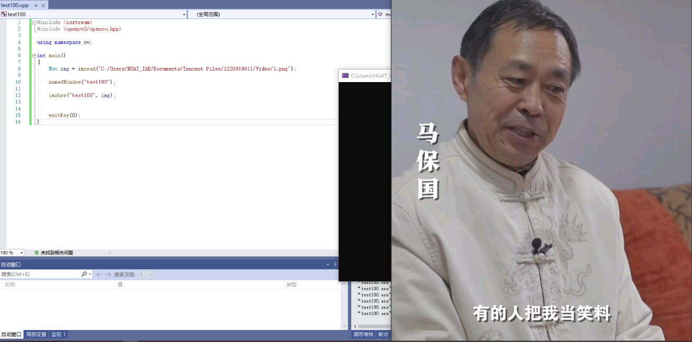
5. 到此完成

### 1.1 遇到问题及解决
1. 编译时出现上千个错误，
2. 原因：Vstudio为安装最新版本，需获取最新版本重新更新
更新后需要重新按上述配置一次，否则依旧报错

1. 编译时和图片有关代码显示错误
2. 原因：图片路径未表示正确，需再次检查，并注意使用"\\"或"/"来表示图片所在路径
   
## 二. 快速上手的图像处理
    在这章会学习到OPENCV处理图像，视频的方式。显示图像已在安装OPENCV中完成
### 2.1 图像腐蚀
```c++
#include <iostream>
#include <stdio.h>
#include <opencv2/opencv.hpp>
#include <opencv2/imgproc/imgproc.hpp>
#include <opencv2/highgui/highgui.hpp>
#include <opencv2/opencv.hpp>
using namespace cv;

int main(void)
{
	
	Mat  img = imread("C:/Users/HUAT_IAE/Documents/Tencent Files/1220919811/Video/1.png");

	imshow("test01", img);
	Mat ele = getStructuringElement(MORPH_RECT, Size(15, 15));
	Mat dsImage;
	erode(img, dsImage, ele);
//rode(img, dsImage, ele);
	imshow("trw", dsImage);
	waitKey(0);
}
```
**效果图展示**

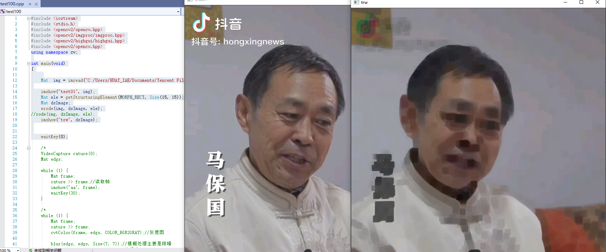

### 2.2 模糊图片
```c++
#include <iostream>
#include <stdio.h>
#include <opencv2/opencv.hpp>
#include <opencv2/imgproc/imgproc.hpp>
#include <opencv2/highgui/highgui.hpp>
#include <opencv2/opencv.hpp>
using namespace cv;

int main(void)
{

	Mat  img = imread("C:/Users/HUAT_IAE/Documents/Tencent Files/1220919811/Video/1.png");
	imshow("均值滤波teacher.ma", img);
	Mat dstImage;
	blur(img, dstImage, Size(8, 8));
	imshow("均值滤波teacher.ma", dstImage);
	waitKey(0);
}
```
**效果显示**
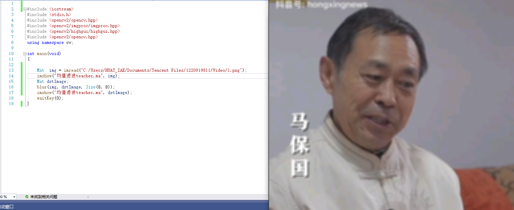

### 2.3 canny边缘检测
```c++
  #include <opencv2/opencv.hpp>
    #include<opencv2/imgproc/imgproc.hpp>
    using namespace cv;

    int main( )
    {
	    //【0】载入原始图  
	    Mat srcImage = imread("1.jpg");  //工程目录下应该有一张名为1.jpg的素材图
	    imshow("【原始图】Canny边缘检测", srcImage); 	//显示原始图 
	    Mat dstImage,edge,grayImage;	//参数定义

	    //【1】创建与src同类型和大小的矩阵(dst)
	    dstImage.create( srcImage.size(), srcImage.type() );

	    //【2】将原图像转换为灰度图像
	    //此句代码的OpenCV2版为：
	    //cvtColor( srcImage, grayImage, CV_BGR2GRAY );
	    //此句代码的OpenCV3版为：
	    cvtColor( srcImage, grayImage, COLOR_BGR2GRAY );

	    //【3】先用使用 3x3内核来降噪
	    blur( grayImage, edge, Size(3,3) );

	    //【4】运行Canny算子
	    Canny( edge, edge, 3, 9,3 );

	    //【5】显示效果图 
	    imshow("【效果图】Canny边缘检测", edge); 

	    waitKey(0); 

	    return 0; 
    }
```
**效果展示**
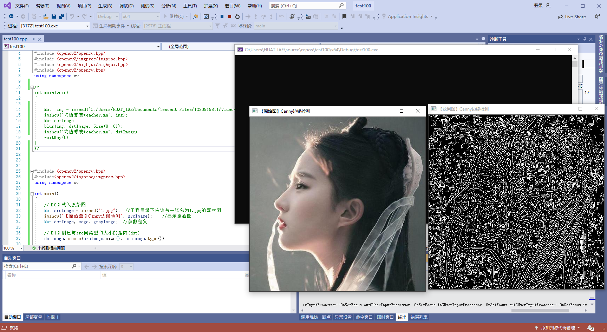

### 2.4 视频读取播放
```c++
#include <iostream>
#include <stdio.h>
#include <opencv2/opencv.hpp>
#include <opencv2/imgproc/imgproc.hpp>
#include <opencv2/highgui/highgui.hpp>
#include <opencv2/opencv.hpp>
#include <opencv2/opencv.hpp>
using namespace cv;

int main()
{
	VideoCapture capture("1.avi");
	while (1)
	{
		Mat frame;
		capture >> frame;
		imshow("video.", frame);
		waitKey(30);
	}
	return 0;
}
```
**结果展示**
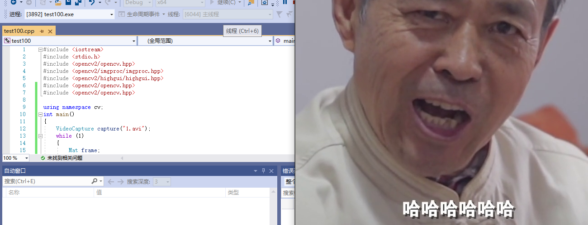

### 2.5 摄像头采集视频
```c++
#include <iostream>
#include <stdio.h>
#include <opencv2/opencv.hpp>
#include <opencv2/imgproc/imgproc.hpp>
#include <opencv2/highgui/highgui.hpp>
#include <opencv2/opencv.hpp>
#include <opencv2/opencv.hpp>

using namespace cv;
int main()
{
	VideoCapture capture(0);
	while (1)
	{
		Mat frame;
		capture >> frame;
		imshow("video.", frame);
		waitKey(30);
	}
	return 0;
}
```
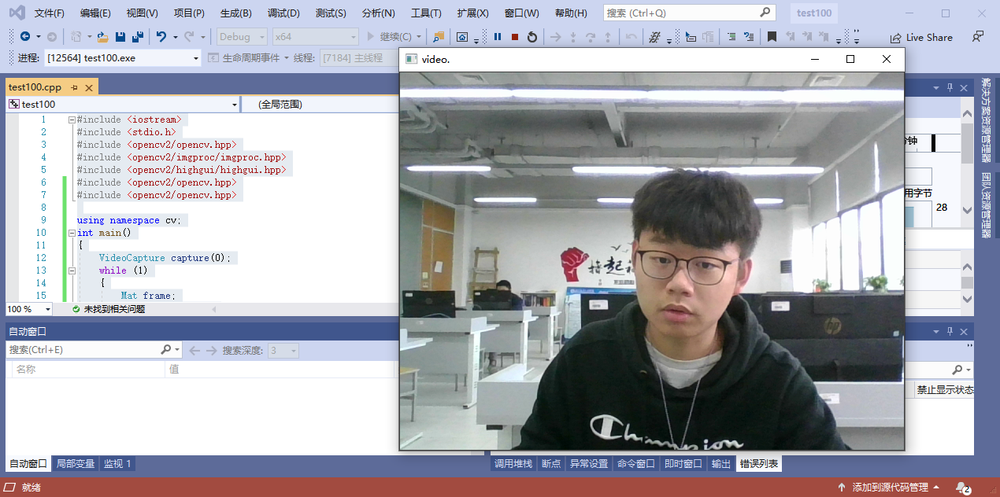

## 三. opencv深入学习
使用opencv内的测试程序了解opencv的更多功能
### 彩色跟踪程序
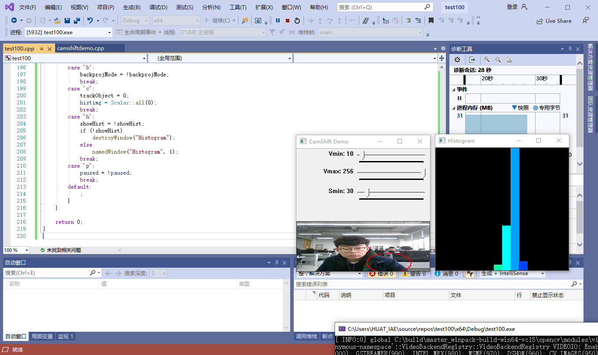
### 光流法跟踪

### 点追踪
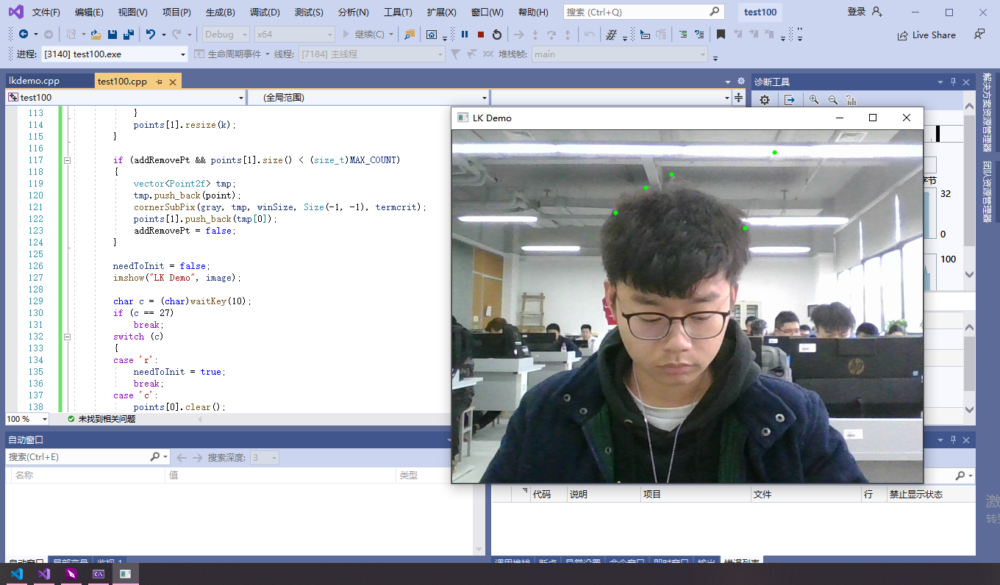
### 人脸识别
将"…\opencv\sources\data\haarcascades"路径下的"harcascade_eye_tree_eyeglasses.xml"和"haarcascade frontalface alt.xml"文件复制到和源文件同一目录中并运行"..opencv\sources\samples\cpp\tutorial_code\objectDetection"路径下的objectDetection.cpp文件

## 四，基本绘图

### 4.1 图片的载入，显示和输出
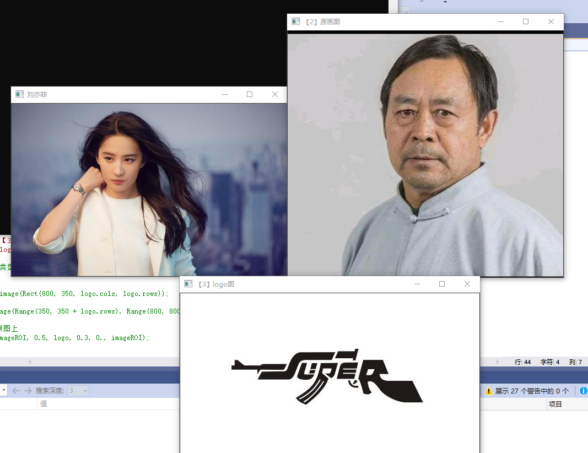
### 4.2 滑动条的创建和使用
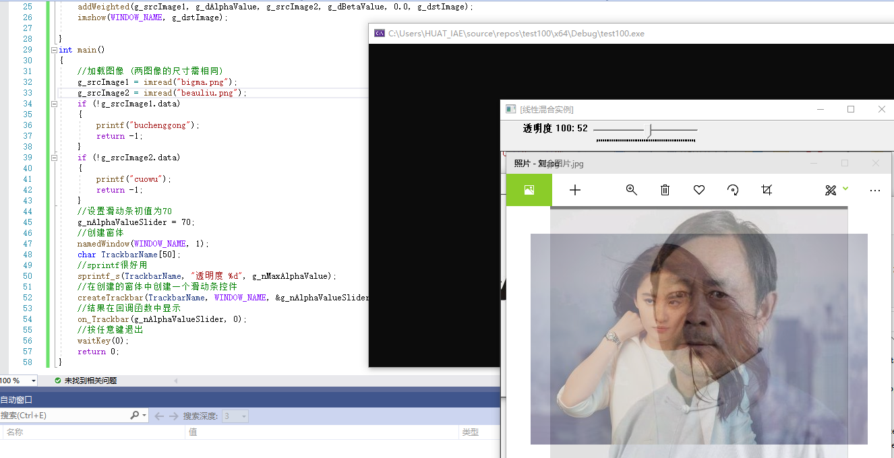
### 4.3 鼠标的使用
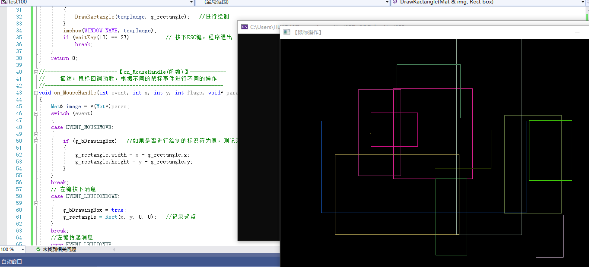

## 五,实验总结
1. 本次课程学习了如何用opencv显示图片，如何对图片进行一些特殊处理。课上掌握了调用摄像头，并学习了用摄像头捕捉固定点和显示颜色，学会使用opencv自动捕捉人脸。
2. 随后学习了利用opencv来创建滑动条调节透明度，用鼠标绘制方形，以及整合图片logo。