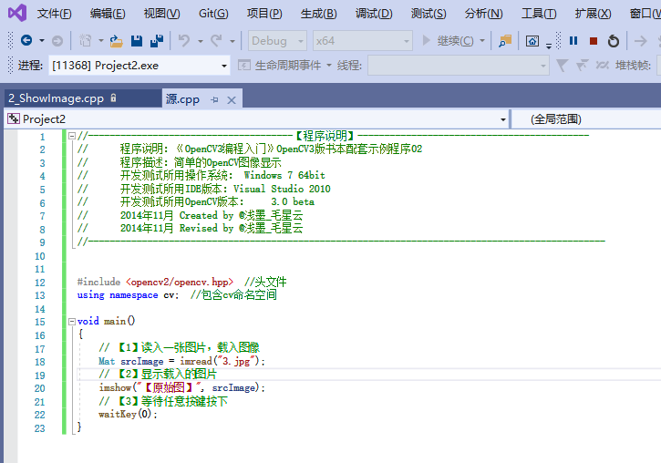
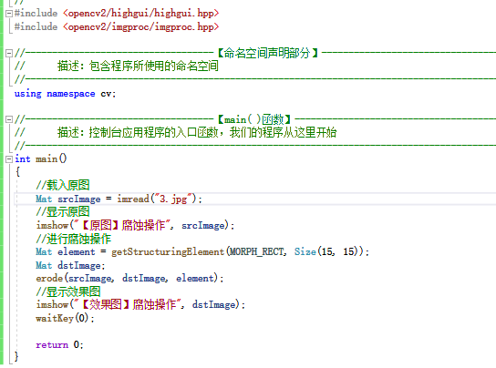
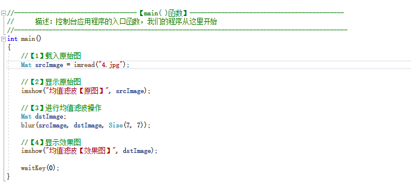
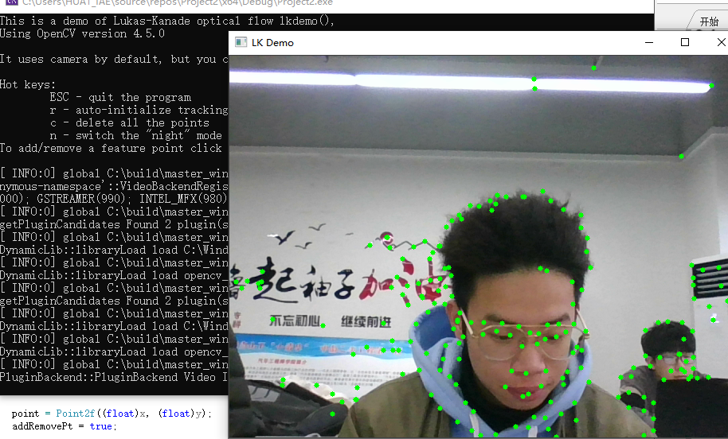
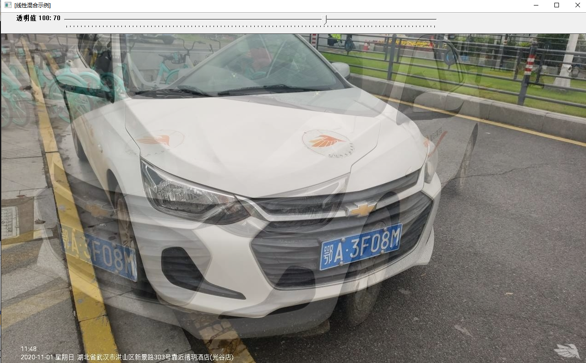
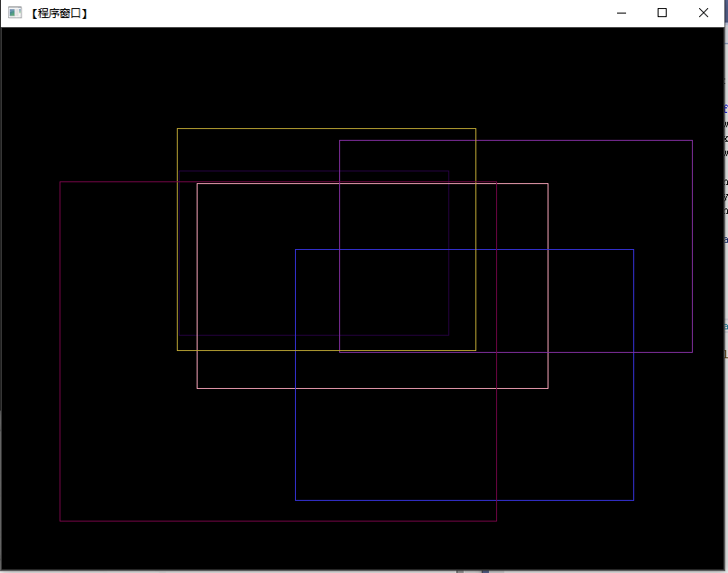

# 学习笔记

# 第一章节

## OpenCV 概述

### OpenCV 简介

OpenCV的全称是Open Source Computer Vision Library，直译就是“开源计算机视觉库”。取代表开源的单词“Open”、 "Computer”的首字母“C”以及“Vision”的首字母“V”，组合命名为“OpenCV”。

OpenCV于1999年由Intel建立，如今由 Willow Garage提供支持。它是一个基于开源发行的跨平台计算机视觉库，可以运行在 Linux、Windows、Mac OS、Android、iOS、Maemo、FreeBSD、OpenBSD等操作系统上。OpenCV由一系列C函数和C++类构成，轻量且高效。强大的OpenCV除了用C/C++语言进行开发和使用之外，还支持使用C#、Ch、Ruby等编程语言，同时提供了对Python、Ruby,MATLAB等语言的接口，实现了图像处理和计算机视觉方面的很多通用算法。

### OpenCV 应用概述

OpenCV被广泛应用于许多领域、产品和研究成果，具体包括卫星地图和电子地图的拼接、扫描图像对齐、医学图像去噪（消噪或滤波)、图像中的物体分析、安全和入侵检测系统、自动监视和安全系统，以及制造业中的产品质量检测系统、摄像机标定、军事应用、无人飞行器、无人汽车和无人水下机器人。此外，还可以将视觉识别技术用在声谱图上，用OpenCV进行声音和音乐识别。

OpenCV可用于解决如下领域的问题：
1.人机交互
2.物体识别
3.图像分区
4.人脸识别
5.动作识别
6.运动跟踪
7.机器人

### Opencv 安装配置

- 1. 下载安装包并安装
  
  

- 2. 寻找路径和配置环境变量

**路径**：

  


**重启（生效环境）**

- 3. 新建项目：

**创建**


**添加空文件**


**添加文件c++**:


- 4. 配置属性
  
 **打开属性**：
 
 

 **修改包含文件**;
 
 

 **修改库目录**：

 

 **修改链接文件**:

 

 - 5.测试安装
  
  

## 熟悉OpenCV操作

### 图像显示

#### 函数解释

在OpenCV图像显示过程非常简单，只需用imread函数载入到新版本的图像存储数据结构Mat类中，然后用imshow函数显示即可。

(1）第一个参数，const string&类型的filename，填我们需要载入的图片路径名。在 Windows 操作系统下，OpenCV的 imread函数支持如下类型的图像载入

(2）第二个参数，int类型的flags，为载入标识，它指定一个加载图像的颜色类型。可以看到它自带默认值1，所以有时候这个参数在调用时可以忽略。在看了下面的讲解之后，我们就会发现，如果在调用时忽略这个参数，就表示载入三通道的彩色图像。这个参数可以在OpenCV中标识图像格式的枚举体中取值。

打开 Visual Studio，新建一个控制台项目，然后新建一个cpp文件，在其中添加代码，放置一张以网络上下载的图片，并改名为程序代码中指定的“3.jpg"，然后运行程序。

####  代码实例



#### 实验结果


### 图像腐蚀

#### 函数解释

我们运用OpenCV实现最基本的形态学运算之一——腐蚀，即用图像中的暗色部分“腐蚀”掉图像中的高亮部分。图像形态学操作在后文有详细讲解，这里我们先一起了解一下:同样是新建控制台项目，新建cpp源文件，放置名为“1-jpg”的图片到工程目录下（和l cpp源文件同一目录下)。

#### 代码实例



#### 实验结果


###  图像模糊

#### 函数解释

我们用OpenCV对图像进行均值滤波操作，模糊一幅图像的代码如何书写。主要使用进行均值滤波操作的 blur函数，程序代码非常好理解，载入并显示原始图后，调用一次 blur函数，最后显示效果图。原始图和效果图分别如图。

#### 代码实例



#### 实验结果


### canny边缘检测

#### 函数解释

我们何用OpenCV进行canny边缘检测。载入图像，并将其转成灰度图，再用blur函数进行图像模糊以降噪，然后用canny函数进行边缘检测,最后进行显示。

#### 代码实例


#### 实验结果


# 第二章节

## 彩色目标跟踪：Camshift

### 函数解释

彩色目标跟踪，程序的用法是根据鼠标框选区域的色度光谱来进行摄像头读入的视频目标的跟踪。其主要采用CamShift 算法，全称是“Continuously Adaptive Mean-SHIFT”，是对MeanShift 算法的改进，被称为连续自适应的MeanShift算法。打开本书配套的第8个示例程序（或者是在…'opencv'sources'sampleslcpp目录下找到名为camshiftdemo.cpp的文件，自行修改部分代码。实际路径会因为OpenCV版本的不同略有差异)，编译并运行，用鼠标在窗口中框选要跟踪的区域。

### 实验结果


## 光流：optical flow

#### 函数解释

optical flow是目前运动图像分析的重要方法，光流用来指定时变图像中模式的运动速度，因为当物体在运动时，在图像上对应点的亮度模式也在运动。这种图像亮度模式的表观运动（ apparentmotion）就是光流。光流表达了图像的变化，由于它包含了目标运动的信息，因此可被观察者用来确定目标的运动情况。

#### 实验结果


## 点追踪：Ikdemo

#### 函数解释

在opencv'lsourcesisamples'cpp目录下（实际路径会因为OpenCV版本的不同略有差异）的lkdemo.cpp文件中，存放着这样一个精彩的例程。程序运行后，会自动启用摄像头，这时按键盘上的“r”键来启动自动点追踪。

#### 实验结果



## 人脸识别

#### 函数解释

人脸识别是图像处理与OpenCV非常重要的应用之一，OpcnCV官方专门有教程和代码讲解其实现方法。此示例程序就是使用objdetect模块检测摄像头视频流中的人脸，位于…opencvlsources'lsamples'cpp'tutorial_codelobjectDetection路径之下。需要额外注意的是，需要将“…-lopencv'sources'data'haarcascades”路径下的“haarcascade_eye_tree_eyeglasses.xml”和“haarcascade_frontalface_alt.xml”文件复制到和源文件同一目录中，才能正确运行。运行程序，将自己的脸对准摄像头，或者放置一张照片对准摄像头任其捕获，便可以发现程序准确地识别出了人脸，并用彩色的圆将脸圈出。

#### 实验结果


# 第三章节

## 图像的载入、显示和输出到文件

**命名空间**：

`命名空间随标准C++而引入，相当于一个灵活的文件域（全局域），以关键字namespace开头给其起个名字，并用大括号把定义区域括起来（声明块）。
在域外使用域内成员时，需要加上命名空间名作为前缀，再加上域操作符“：：”，可以使用嵌套定义。
如果在关键字namespace之前使用using，就不必使用限定修饰名，即可以一次性使命名空间中所有成员都可以直接被使用。`

`此外，最好放在包含文件下一个位置，否则会出现异常`

**imread()函数**：
 
 `本函数可以从文件夹读取图片，也可以为Mat数据开放空间`

 ```C++
 A= imread ( "1.jpg"，CV_LOAD_IMAGE_COLOR);//这里为矩阵开辟内存
 Mat srcImage =imread("D:\\Alcibiado\\Work\\001.jpg");//读文件
 ```

**imshow()函数**:

- 函数原型：
  
  	- void imshow (const string& winname,InputArray mat);
  	- 第一个参数: const string&类型的winname，填需要显示的窗口标识名称。第二个参数:InputArray类型的mat，填需要显示的图像。
- 示例：
  
```C++
	imshow("效", edge);//显示图片
```

**namedwindow()函数**:

- 函数原型：
    
	- void namedwindow (const string& winname,int flags=WINDOw_AUTOSIZE ) ;
	- (1)第一个参数，const string&型的name，填写被用作窗口的标识符的窗口名称。(2）第二个参数，int类型的flags ，窗口的标识，可以填如下几种值

```C++
	namedWindow("timgttt");//创建本窗口
```

**imwirte()函数**：

- 函数原型：
  
	- bool imwrite(const string& filename,InputArray img,const vector<int>& arams=vector<int>());
	- (1）第一个参数，const string&类型的filename，填需要写入的文件名。注意要带上后缀，如“123.jpg”。(2）第二个参数，InputArray类型的img，一般填一个Mat类型的图像数据。(3）第三个参数，const vector<int>&类型的 params，表示为特定格式保存的参数编码。它有默认值vector<int>()，所以一般情况下不需要填写。而如果要填写的话，有下面这些需要了解的地方:
  
- 示例：

```C++
	imwrite("透明Alpha值图.png", mat,compression _params) ;//双引号的内容必要有格式
```
## 滑动条的创建和使用

### 函数解释

createTrackbar函数用于创建一个可以调整数值的滑动条（常常也被称作轨迹条)，并将滑动条附加到指定的窗口上，使用起来很方便。需要记住，它往往会和一个回调函数配合起来使用。先看下它的函数原型。

createTrackbar函数为我们创建了一个具有特定名称和范围的轨迹条(Trackbar，或者说是滑块范围控制工具)，指定一个和轨迹条位置同步的变量，而且要指定回调函数 onChange（第五个参数)，在轨迹条位置改变的时候来调用这个回调函数，并且，创建的轨迹条显示在指定的 winname（第二个参数）所代表的窗口上。

至于回调函数，就是一个通过函数指针调用的函数。如果我们把函数的指针(地址）作为参数传递给另一个函数，当这个指针被用来调用其所指向的函数时，就称其为回调函数。回调函数不由该函数的实现方直接调用，而是在特定的事件或条件发生时由另外的一方调用，用于对该事件或条件进行响应。

- 第一个参数：const string&类型的 trackbarname，轨迹条的名字，用来代表我们创建的轨迹条。

- 第二个参数，const string&类型的winname，窗口的名字，表示这个轨迹条会依附到哪个窗口上，即对应namedWindow()创建窗口时填的某一个窗口名。
- 第三个参数，int*类型的value，一个指向整型的指针，表示滑块的位置。在创建时，滑块的初始位置就是该变量当前的值。
- 第四个参数，int类型的count，表示滑块可以达到的最大位置的值。滑块最小位置的值始终为0。
- 第五个参数，TrackbarCallback类型的onChange它有默认值0。这是一个指向回调函数的指针，每次滑块位置改变时，这个函数都会进行回调。并且这个函数的原型必须为void XxXX(int，void*);，其中第一个参数是轨迹条的位置，第二个参数是用户数据（看下面的第六个参数)。如果回调是NULL指针，则表示没有回调函数的调用，仅第三个参数value有变化。
- 第六个参数，void*类型的userdata，也有默认值0。这个参数是用户传给回调函数的数据，用来处理轨迹条事件。如果使用的第三个参数value 实参是全局变量的话，完全可以不去管这个userdata参数。

#### 代码演示


#### 实验结果



## 鼠标操作

### 函数解释

OpenCV中的鼠标操作和滑动条的消息映射方式很类似，都是通过一个中介函数配合一个回调函数来实现的。创建和指定滑动条回调函数的函数为createTrackbar，而指定鼠标操作消息回调函数的函数为SetMouseCallback。

- 第一个参数，const string&类型的winname，窗口的名字。·第二个参数，MouseCallback类型的onMouse.
- 第二个参数，MouseCallback类型的onMouse.
- 第三个参数，void*类型的userdata，用户定义的传递到回调函数的参数，有默认值0。

### 实验结果



## 章节总结

### 第一章节

OpenCV3的配置方法, OpenCV3官方对配置过程已经简化了,将OpenCV2中的近20个ib文件浓缩成了opencv_ts300.lib.openev_world300.lib(Release版本)这两个。所以区别也是在第五步链接库的配置处，将OpenCV2中的那一大串lib对应地改为openev_ts300.lib、openev_world300.lib ( Release版本）或opencv_ts300d.lib、openev_world30Od.lib( Debug版本）即可。

**总结**：总的来说，opencv提供的是一种计算机视觉的框架，可以用于多种平台之上。

### 第二章节

-  类名混合使用大小写，首字母大写
-  类型定义，包括枚举和 typedef，混合使用大小写，首字母大写
-  枚举类型除了混合使用大小写外，总以复数形式表示
-  局部变量混合使用大小写，且首字母小写，其名字应该与底层数据类型无关，而且应该反映该变量所代表的事物
-  子程序参数的格式混合使用大小写，且每个单词首字母大写，其名字应该与底层数据类型无关，而且应该反映该变量所代表的事物
- 对类的多个子程序可见（且只对该类可见)的成员变量名用m_前缀局部变量名用g_前缀
-  具名常量全部大写
-  宏全部大写，单词间用分隔符“_”隔开
-  枚举类型成员名用能反映其基础类型的、单数形式的前缀。

**main参数**

- argc和 argc 中的 arg 指的是“参数”。其中，argc为整数，用来统计运行程序时送给main函数的命令行参数的个数;而* argv[ ]:为字符串数组，用来存放指向字符串参数的指针数组，每一个元素指向一个参数。

**总结**：在本章中，我们学习了很多非常实用的知识，使大家可以对OpenCV有一个宏观的认知，也给大家提供了一些脱离书本依靠官方文档自学的思路，比如对OpenCV官方例程的引导与赏析，和如何编译OpenCV总计四十四万多行的源代码。此外，还有一些命名规范的约定和相关C语言基础函数的复习。本章内容授之以鱼，更授之以渔，相信通过本章内容的学习，可以对OpenCV有一个更加全面的认识。

### 第三章节

本章中，我们学习了OpenCV的高层GUI图形用户界面模块highgui中最重要的几个方面，分别是图像的载入、显示与输出图像到文件，以及如何使用滑动条如何进行鼠标操作。