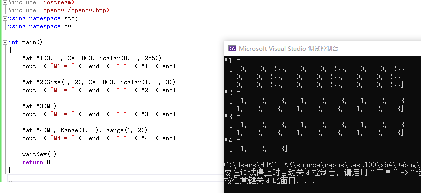
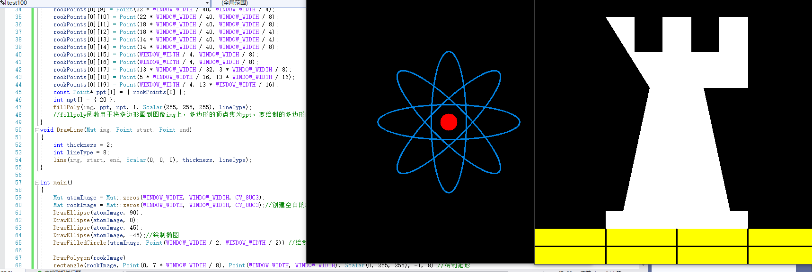
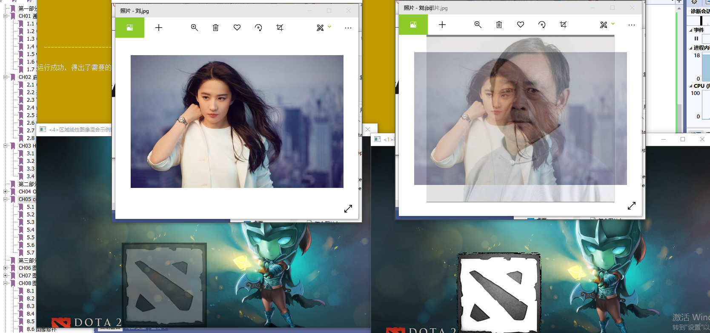

# 基础图像容器 Mat


## 一．基础图像容器Mat类的使用


## 二. 基本图形绘制
```c++
#include <iostream>
#include <opencv2/opencv.hpp>
#define WINDOW_NAME1 "[绘制图1]"
#define WINDOW_NAME2 "[绘制图2]"
#define WINDOW_WIDTH  600
using namespace cv;
void DrawEllipse(Mat img, double angle)
{
	int thickness = 2;
	int lineType = 8;
	ellipse(img, Point(WINDOW_WIDTH / 2, WINDOW_WIDTH / 2), Size(WINDOW_WIDTH / 4, WINDOW_WIDTH / 16), angle, 0, 360, Scalar(225, 129, 0), thickness, lineType);
	//将椭圆画到img图像上，椭圆中心点为point，并且大小位于矩形Size，椭圆的旋转角度为angle。扩展的弧度为0度到360度，线宽为thickness，线型为lineType，图形的颜色为scalar
}
void DrawFilledCircle(Mat img, Point center)
{
	int thickness = -1;
	int lineType = 8;
	circle(img, center, WINDOW_WIDTH / 32, Scalar(0, 0, 255), thickness, lineType);
	//圆的半径为WINDOW_WIDTH
}
void DrawPolygon(Mat img)
{
	int lineType = 8;
	Point rookPoints[1][20];
	rookPoints[0][0] = Point(WINDOW_WIDTH / 4, 7 * WINDOW_WIDTH / 8);
	rookPoints[0][1] = Point(3 * WINDOW_WIDTH / 4, 7 * WINDOW_WIDTH / 8);
	rookPoints[0][2] = Point(3 * WINDOW_WIDTH / 4, 13 * WINDOW_WIDTH / 16);
	rookPoints[0][3] = Point(11 * WINDOW_WIDTH / 16, 13 * WINDOW_WIDTH / 16);
	rookPoints[0][4] = Point(19 * WINDOW_WIDTH / 32, 3 * WINDOW_WIDTH / 8);
	rookPoints[0][5] = Point(3 * WINDOW_WIDTH / 4, 3 * WINDOW_WIDTH / 8);
	rookPoints[0][6] = Point(3 * WINDOW_WIDTH / 4, WINDOW_WIDTH / 8);
	rookPoints[0][7] = Point(26 * WINDOW_WIDTH / 40, WINDOW_WIDTH / 8);
	rookPoints[0][8] = Point(26 * WINDOW_WIDTH / 40, WINDOW_WIDTH / 4);
	rookPoints[0][9] = Point(22 * WINDOW_WIDTH / 40, WINDOW_WIDTH / 4);
	rookPoints[0][10] = Point(22 * WINDOW_WIDTH / 40, WINDOW_WIDTH / 8);
	rookPoints[0][11] = Point(18 * WINDOW_WIDTH / 40, WINDOW_WIDTH / 8);
	rookPoints[0][12] = Point(18 * WINDOW_WIDTH / 40, WINDOW_WIDTH / 4);
	rookPoints[0][13] = Point(14 * WINDOW_WIDTH / 40, WINDOW_WIDTH / 4);
	rookPoints[0][14] = Point(14 * WINDOW_WIDTH / 40, WINDOW_WIDTH / 8);
	rookPoints[0][15] = Point(WINDOW_WIDTH / 4, WINDOW_WIDTH / 8);
	rookPoints[0][16] = Point(WINDOW_WIDTH / 4, WINDOW_WIDTH / 8);
	rookPoints[0][17] = Point(13 * WINDOW_WIDTH / 32, 3 * WINDOW_WIDTH / 8);
	rookPoints[0][18] = Point(5 * WINDOW_WIDTH / 16, 13 * WINDOW_WIDTH / 16);
	rookPoints[0][19] = Point(WINDOW_WIDTH / 4, 13 * WINDOW_WIDTH / 16);
	const Point* ppt[1] = { rookPoints[0] };
	int npt[] = { 20 };
	fillPoly(img, ppt, npt, 1, Scalar(255, 255, 255), lineType);
	//fillpoly函数用于将多边形画到图像img上，多边形的顶点集为ppt，要绘制的多边形的顶点数目为npt，要绘制的多边形的数目为1，
}
void DrawLine(Mat img, Point start, Point end)
{
	int thickness = 2;
	int lineType = 8;
	line(img, start, end, Scalar(0, 0, 0), thickness, lineType);
}

int main()
{
	Mat atomImage = Mat::zeros(WINDOW_WIDTH, WINDOW_WIDTH, CV_8UC3);
	Mat rookImage = Mat::zeros(WINDOW_WIDTH, WINDOW_WIDTH, CV_8UC3);//创建空白的Mat图像
	DrawEllipse(atomImage, 90);
	DrawEllipse(atomImage, 0);
	DrawEllipse(atomImage, 45);
	DrawEllipse(atomImage, -45);//绘制椭圆
	DrawFilledCircle(atomImage, Point(WINDOW_WIDTH / 2, WINDOW_WIDTH / 2));//绘制圆心

	DrawPolygon(rookImage);
	rectangle(rookImage, Point(0, 7 * WINDOW_WIDTH / 8), Point(WINDOW_WIDTH, WINDOW_WIDTH), Scalar(0, 255, 255), -1, 8);//绘制矩形
	DrawLine(rookImage, Point(0, 15 * WINDOW_WIDTH / 16), Point(WINDOW_WIDTH, 15 * WINDOW_WIDTH / 16));
	DrawLine(rookImage, Point(WINDOW_WIDTH / 4, 7 * WINDOW_WIDTH / 8), Point(WINDOW_WIDTH / 4, WINDOW_WIDTH));
	DrawLine(rookImage, Point(WINDOW_WIDTH / 2, 7 * WINDOW_WIDTH / 8), Point(WINDOW_WIDTH / 2, WINDOW_WIDTH));
	DrawLine(rookImage, Point(3 * WINDOW_WIDTH / 4, 7 * WINDOW_WIDTH / 8), Point(3 * WINDOW_WIDTH / 4, WINDOW_WIDTH));

	imshow(WINDOW_NAME1, atomImage);
	moveWindow(WINDOW_NAME1, 0, 200);
	imshow(WINDOW_NAME2, rookImage);
	moveWindow(WINDOW_NAME2, WINDOW_WIDTH, 200);
	waitKey(0);
	return 0;

}
```


## 4.3 初级图像混合


## 4.4 多通道图像混合


# 总结

本次课学习了绘制基本底层图案，通过简单的图案画出稍微复杂的美丽图形。随后学习了图片的混合，需要注意图片的大小会导致logo和底图无法对应。最好的方式是都调整到（0，0）。最后学习了调整不同颜色，非常有意思。