# ch04 opencv数据结构与基本绘图
opencv作为一个计算机视觉库，其主要工作是处理和操作并进一步了解这些形式和信息。因此，理解opencv是如何存储和处理图像是非常有必要的。
### Mat结构的使用
关于mat类，首先我们知道的是：
1、 不必再手动为其开辟空间；
2、 不必再在不需要时立即将空间释放。
> Mat是一个类，由两个数据部分组成：矩阵头（包含矩阵尺寸、存储方法、存储地址等信息）和一个指向存储结构所有像素值的矩阵（根据所选存储方法的不同，矩阵可以是不同的维数）的指针。

### 像素值的存储方法
> 像素值需要指定颜色空间和数据类型。

**颜色系统**
* RGB:最常见，因为人眼采用相似的工作机制，也被显示设备所采用。
* HSV和HLS把颜色分解成色调、饱和度和亮度/明度。
* YCrCb：在JPEG图像格式中广泛使用。
* CIE L*a*b*：一种在感知上均匀的颜色系统，适合用来度量两个颜色之间的距离。
  
每个组成元素都有其自己的定义域，而定义域取决于其数据类型，如何存储一个元素决定了我们在其定义域上能够控制的精度。尽管使用三个char（1字节，8位）型元素已经可以表示1600万种可能的颜色，但若使用float（4字节，32位）或double(8字节，64位)则能给出更加精细的颜色分辨能力。但同时，增加元素的尺寸也会增加图像所占用的内存空间。

### 创建Mat对象的七种方法
Mat不但是一个非常有用的图像容器类，同时也是一个通用的矩阵类，我们可以用它来创建和操作多维矩阵。
**七种方法**  *以下内容摘自课本*
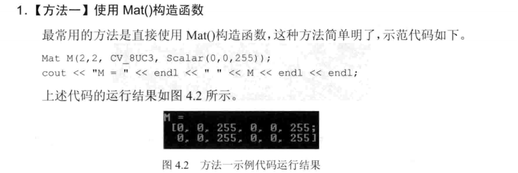
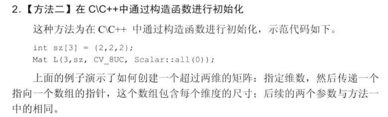
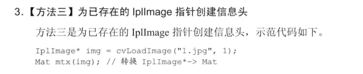
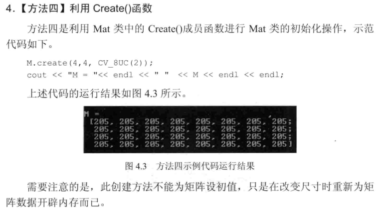
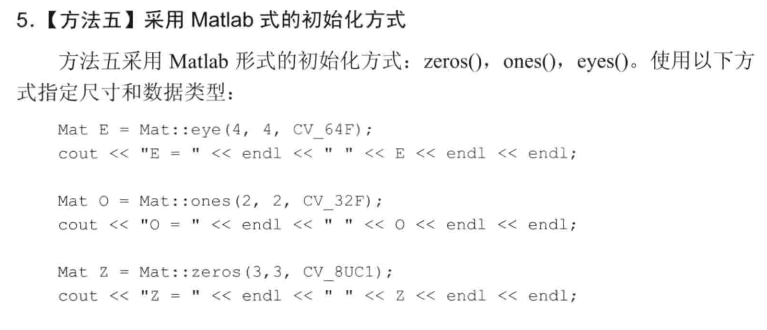
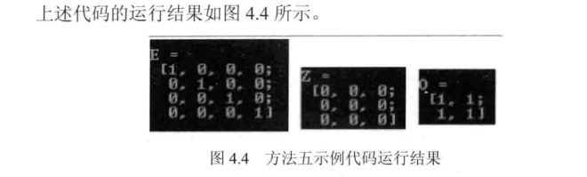
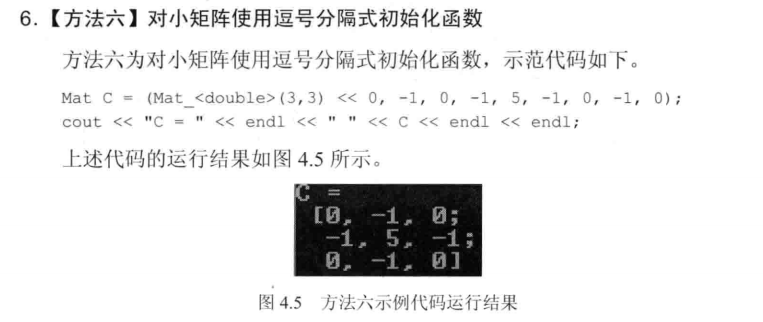
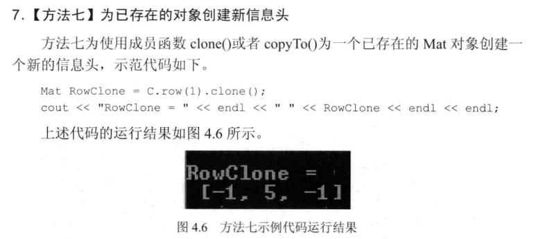

> opencv几种风格的格式化输出方法：OpenCv默认风格，Python风格，逗号分隔风格，Numpy风格，C语言风格

#### 示例程序：基础图像容器Mat类的使用
程序说明
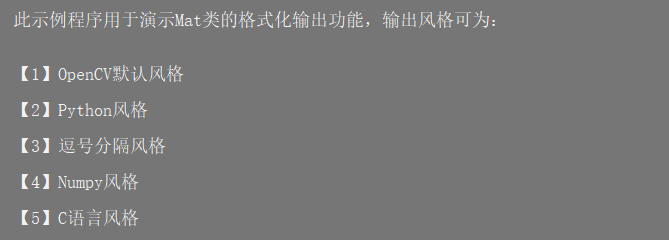
>实验结果
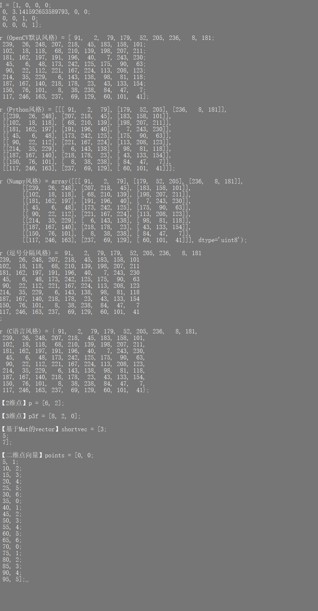

### 常用数据结构和函数
#### 点的表示：Point类
#### 颜色的表示：Scalar类
Scalar（）表示具有4个元素的数组，在opencv中被大量用于传递像素值，如RGB颜色值。
>Scalar（a, b, c ）定义的RGB颜色值：红色分量为c，绿色分量为b，蓝色分量为a。

#### 尺寸的表示：Size类
#### 矩形的表示：Rect类
Rect类的成员变量有x、y、width、height，分别为左上角点的坐标和矩形的宽和高。常用的成员函数有：Size（）返回值Size；area()返回矩形的面积；contains(Point)判断点是否在矩形内；inside(Rect)函数判断矩形是否在该矩形内；tl（）返回左上角点坐标；br（）返回右小角点坐标。
> 求两个矩形的交集和并集：
> Rect rect = rect1 & rect2;
> Rect rect = rect1 | rect2;

> 让矩形进行平移操作和缩放操作：
> Rect rectShift = rect1 + point;
> Rect rectShift = rect1 + size;

#### 颜色空间转换：evtColor()函数
evtColor()函数是opencv里的颜色空间转换函数，可以实现RGB颜色向HSV、HSI等颜色空间的转换，也可以转换为灰度空间。
### 基本图形的绘制
**涉及到的绘制函数如下**
* 用于绘制直线的line函数；
* 用于绘制椭圆的ellipse函数；
* 用于绘制矩形的rectangle函数；
* 用于绘制圆的cicle函数；
* 用于绘制填充的多边形的fillPoly函数。

> 程序实验结果示例
> 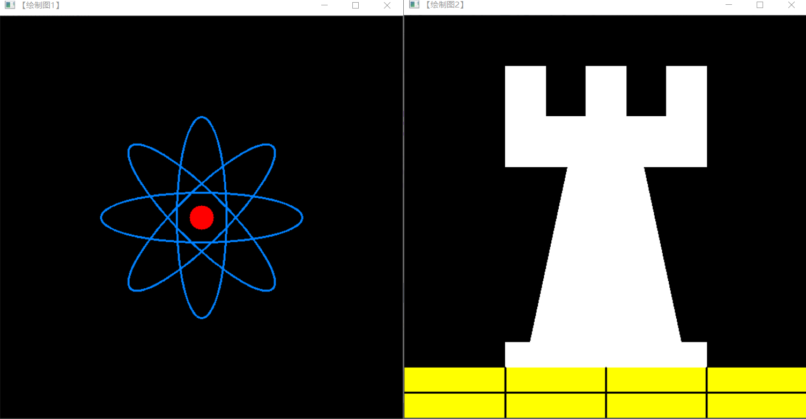

#### ch04小结
从这一章节学习到了经常使用的一些数据结构，主要是基础图像容器Mat的用法。还学习了绘制图形的基本函数，并且通过实验以及代码分析加深了自己的理解。


# ch05 core组件进阶
### 访问图像中的像素
#### 颜色空间的缩减
颜色空间缩减（color space reduction）在很多应用中可以大大降低运算复杂度。
> 颜色空间的缩减做法是：将现有颜色空间值除以某个输入值，以获得较少的颜色数。比如颜色值0到9可取为新值0.

#### LUT函数：Look up table操作
用于批量进行图像元素查找、扫描与操作图像。
#### 计时函数
* getTickCount()函数返回CPU自某个事件以来走过的时钟周期数
* getTickFrequency()函数返回CPU一秒钟所走的时钟周期数。

#### 访问像素的方法
* 方法一 指针访问：C操作符[]；
> 用指针访问像素
``` C++
//---------------------------------【colorReduce( )函数】---------------------------------
//          描述：使用【指针访问：C操作符[ ]】方法版的颜色空间缩减函数
//----------------------------------------------------------------------------------------------
void colorReduce(Mat& inputImage, Mat& outputImage, int div)
{
	//参数准备
	outputImage = inputImage.clone();  //拷贝实参到临时变量
	int rowNumber = outputImage.rows;  //行数
	int colNumber = outputImage.cols * outputImage.channels();  //列数 x 通道数=每一行元素的个数

	//双重循环，遍历所有的像素值
	for (int i = 0; i < rowNumber; i++)  //行循环
	{
		uchar* data = outputImage.ptr<uchar>(i);  //获取第i行的首地址
		for (int j = 0; j < colNumber; j++)   //列循环
		{
			// ---------【开始处理每个像素】-------------     
			data[j] = data[j] / div * div + div / 2;
			// ----------【处理结束】---------------------
		}  //行处理结束
	}
}
```
> 运行结果
> 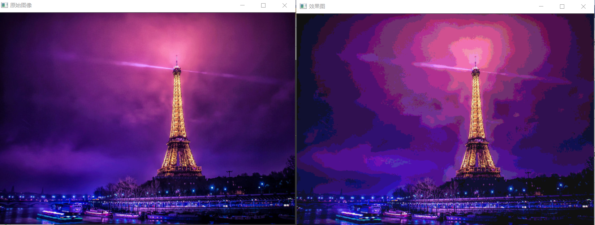

* 方法二 迭代器iterator;
> 用迭代器访问像素
```C++
//-------------------------------------【colorReduce( )函数】-----------------------------
//		描述：使用【迭代器】方法版的颜色空间缩减函数
//----------------------------------------------------------------------------------------------
void colorReduce(Mat& inputImage, Mat& outputImage, int div)  
{  
	//参数准备
	outputImage = inputImage.clone();  //拷贝实参到临时变量
	//获取迭代器
	Mat_<Vec3b>::iterator it = outputImage.begin<Vec3b>();  //初始位置的迭代器
	Mat_<Vec3b>::iterator itend = outputImage.end<Vec3b>();  //终止位置的迭代器

	//存取彩色图像像素
	for(;it != itend;++it)  
	{  
		// ------------------------【开始处理每个像素】--------------------
		(*it)[0] = (*it)[0]/div*div + div/2;  
		(*it)[1] = (*it)[1]/div*div + div/2;  
		(*it)[2] = (*it)[2]/div*div + div/2;  
		// ------------------------【处理结束】----------------------------
	}  
}  
```
> 运行结果


* 方法三 动态地址计算
> 用动态地址计算配合at访问像素
```C++
//----------------------------------【colorReduce( )函数】-------------------------------
//          描述：使用【动态地址运算配合at】方法版本的颜色空间缩减函数
//----------------------------------------------------------------------------------------------
void colorReduce(Mat& inputImage, Mat& outputImage, int div)
{
	//参数准备
	outputImage = inputImage.clone();  //拷贝实参到临时变量
	int rowNumber = outputImage.rows;  //行数
	int colNumber = outputImage.cols;  //列数

	//存取彩色图像像素
	for (int i = 0; i < rowNumber; i++)
	{
		for (int j = 0; j < colNumber; j++)
		{
			// ------------------------【开始处理每个像素】--------------------
			outputImage.at<Vec3b>(i, j)[0] = outputImage.at<Vec3b>(i, j)[0] / div * div + div / 2;  //蓝色通道
			outputImage.at<Vec3b>(i, j)[1] = outputImage.at<Vec3b>(i, j)[1] / div * div + div / 2;  //绿色通道
			outputImage.at<Vec3b>(i, j)[2] = outputImage.at<Vec3b>(i, j)[2] / div * div + div / 2;  //红是通道
			// -------------------------【处理结束】----------------------------
		}  // 行处理结束     
	}
}
```
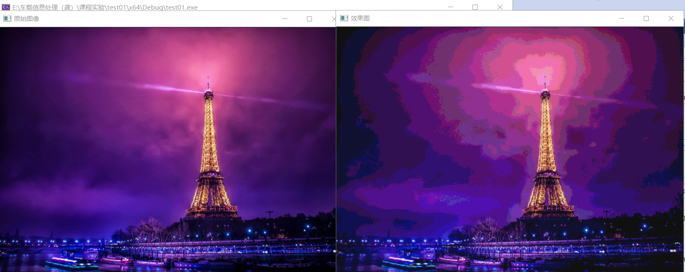

### ROI区域图像叠加&图像混合
#### 感兴趣的区域：ROI
在图像处理领域，我们常常需要设置感兴趣的区域ROI，来专注或者简化工作过程。也就是从图像中选择一个图像区域，这个区域是图像分析的重点。使用ROI指定想读入的目标，可以减少处理时间，增加精度，让图像处理更加方便。
定义ROI区域的两种方法：
* 使用表示矩阵区域的Rect
  它指定矩形的左上角坐标（构造函数的前两个参数）和矩阵的长宽（构造函数的后两个参数）以定义一个矩形区域。
* 指定感兴趣行或列的范围Range
  它指从起始索引到终止索引（不包括终止索引）的一连段连续序列。

#### 线性混合操作
线性混合操作是一种典型的二元（两个输入）的像素操作，它的理论公式如下：
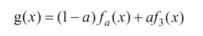
** 主要运用opencv中addWeighted函数--计算数组加权和 **

#### 实验示例：初级图像混合
```C++
//----------------------------------【ROI_AddImage( )函数】----------------------------------
// 函数名：ROI_AddImage（）
//	描述：利用感兴趣区域ROI实现图像叠加
//----------------------------------------------------------------------------------------------
bool  ROI_AddImage()
{

	// 【1】读入图像
	Mat srcImage1 = imread("E:\\车载信息处理（龚）\\【OpenCV3版】《OpenCV3编程入门》书本配套源代码\\【1】书本正篇程序源代码\\【5】第五章\\【25】初级图像混合\\25_初级图像混合\\dota_pa.jpg");
	Mat logoImage = imread("E:\\车载信息处理（龚）\\【OpenCV3版】《OpenCV3编程入门》书本配套源代码\\【1】书本正篇程序源代码\\【5】第五章\\【25】初级图像混合\\25_初级图像混合\\dota_logo.jpg");
	if (!srcImage1.data) { printf("读取srcImage1错误~！ \n"); return false; }
	if (!logoImage.data) { printf("读取logoImage错误~！ \n"); return false; }

	// 【2】定义一个Mat类型并给其设定ROI区域
	Mat imageROI = srcImage1(Rect(200, 250, logoImage.cols, logoImage.rows));

	// 【3】加载掩模（必须是灰度图）
	Mat mask = imread("E:\\车载信息处理（龚）\\【OpenCV3版】《OpenCV3编程入门》书本配套源代码\\【1】书本正篇程序源代码\\【5】第五章\\【25】初级图像混合\\25_初级图像混合\\dota_logo.jpg", 0);

	//【4】将掩膜拷贝到ROI
	logoImage.copyTo(imageROI, mask);

	// 【5】显示结果
	namedWindow("<1>利用ROI实现图像叠加示例窗口");
	imshow("<1>利用ROI实现图像叠加示例窗口", srcImage1);

	return true;
}

//---------------------------------【LinearBlending（）函数】-------------------------------------
// 函数名：LinearBlending（）
// 描述：利用cv::addWeighted（）函数实现图像线性混合
//--------------------------------------------------------------------------------------------
bool  LinearBlending()
{
	//【0】定义一些局部变量
	double alphaValue = 0.5;
	double betaValue;
	Mat srcImage2, srcImage3, dstImage;

	// 【1】读取图像 ( 两幅图片需为同样的类型和尺寸 )
	srcImage2 = imread("E:\\车载信息处理（龚）\\【OpenCV3版】《OpenCV3编程入门》书本配套源代码\\【1】书本正篇程序源代码\\【5】第五章\\【25】初级图像混合\\25_初级图像混合\\mogu.jpg");
	srcImage3 = imread("E:\\车载信息处理（龚）\\【OpenCV3版】《OpenCV3编程入门》书本配套源代码\\【1】书本正篇程序源代码\\【5】第五章\\【25】初级图像混合\\25_初级图像混合\\rain.jpg");

	if (!srcImage2.data) { printf("读取srcImage2错误！ \n"); return false; }
	if (!srcImage3.data) { printf("读取srcImage3错误！ \n"); return false; }

	// 【2】进行图像混合加权操作
	betaValue = (1.0 - alphaValue);
	addWeighted(srcImage2, alphaValue, srcImage3, betaValue, 0.0, dstImage);

	// 【3】显示原图窗口
	imshow("<2>线性混合示例窗口【原图】", srcImage2);
	imshow("<3>线性混合示例窗口【效果图】", dstImage);

	return true;

}
//---------------------------------【ROI_LinearBlending（）】-------------------------------------
// 函数名：ROI_LinearBlending（）
// 描述：线性混合实现函数,指定区域线性图像混合.利用cv::addWeighted（）函数结合定义
//			  感兴趣区域ROI，实现自定义区域的线性混合
//--------------------------------------------------------------------------------------------
bool  ROI_LinearBlending()
{

	//【1】读取图像
	Mat srcImage4 = imread("E:\\车载信息处理（龚）\\【OpenCV3版】《OpenCV3编程入门》书本配套源代码\\【1】书本正篇程序源代码\\【5】第五章\\【25】初级图像混合\\25_初级图像混合\\dota_pa.jpg");
	Mat logoImage = imread("E:\\车载信息处理（龚）\\【OpenCV3版】《OpenCV3编程入门》书本配套源代码\\【1】书本正篇程序源代码\\【5】第五章\\【25】初级图像混合\\25_初级图像混合\\dota_logo.jpg");

	if (!srcImage4.data) { printf("读取srcImage4错误~！ \n"); return false; }
	if (!logoImage.data) { printf("读取logoImage错误~！ \n"); return false; }

	//【2】定义一个Mat类型并给其设定ROI区域
	Mat imageROI;
	//方法一
	imageROI = srcImage4(Rect(200, 250, logoImage.cols, logoImage.rows));
	//方法二
	//imageROI= srcImage4(Range(250,250+logoImage.rows),Range(200,200+logoImage.cols));

	//【3】将logo加到原图上
	addWeighted(imageROI, 0.5, logoImage, 0.3, 0., imageROI);

	//【4】显示结果
	imshow("<4>区域线性图像混合示例窗口", srcImage4);

	return true;
}
```
> 运行结果
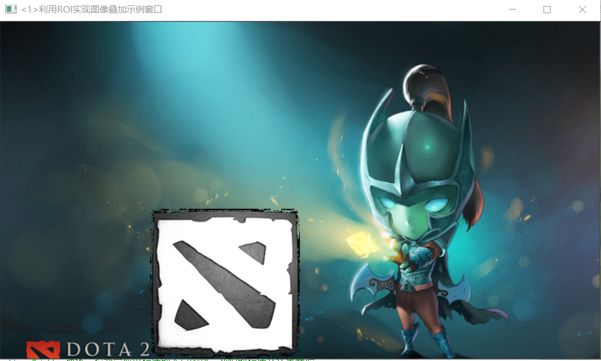
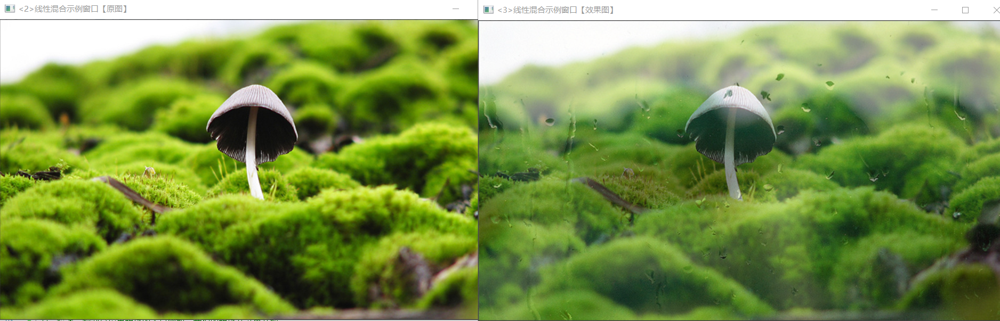
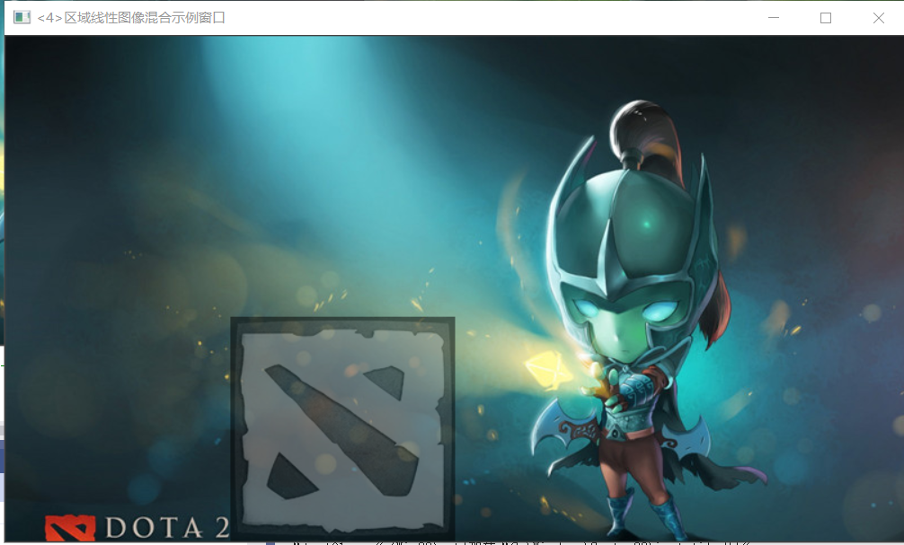

### 分离颜色通道、多通道图像混合
#### 通道分离：split()函数
用于将一个多通道数组分离成几个单通道数组
#### 通道合并：merge()函数
merge()函数是split()函数的逆向操作——将多个数组合并成一个多通道的数组。它通过组合一些给定的单通道数组将这些孤立的单通道数组合并成一个多通道数组，从而创建出一个由多个通道陈列组合的多通道阵列。

### 图像对比度、亮度值调整
点操作的特点：仅仅根据输入像素值（有时可加上某些全局信息或参数），来计算相应的输出像素值。这类算子包括亮度（brightness）和对比度（contrast）调整、颜色校正和变换。
#### 示例程序
> 图像对比度、亮度值调整
```C++
//-----------------------------【ContrastAndBright( )函数】------------------------------------
//	描述：改变图像对比度和亮度值的回调函数
//-----------------------------------------------------------------------------------------------
static void ContrastAndBright(int, void*)
{

	// 创建窗口
	namedWindow("【原始图窗口】", 1);

	// 三个for循环，执行运算 g_dstImage(i,j) = a*g_srcImage(i,j) + b
	for (int y = 0; y < g_srcImage.rows; y++)
	{
		for (int x = 0; x < g_srcImage.cols; x++)
		{
			for (int c = 0; c < 3; c++)
			{
				g_dstImage.at<Vec3b>(y, x)[c] = saturate_cast<uchar>((g_nContrastValue * 0.01) * (g_srcImage.at<Vec3b>(y, x)[c]) + g_nBrightValue);
			}
		}
	}

	// 显示图像
	imshow("【原始图窗口】", g_srcImage);
	imshow("【效果图窗口】", g_dstImage);
}
```
> 运行结果
  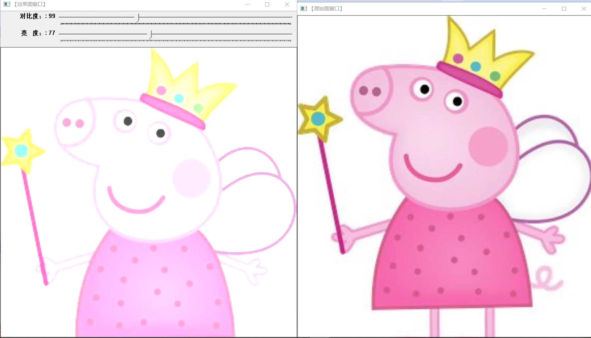

### 离散傅里叶变换
离散傅里叶变换是指傅里叶变换在时域和频域上都呈现离散的形式，将时域信号的采样变换为在离散时间傅里叶变换频域的采样。
#### dft（）函数
dft（）函数的作用是对一维或二维浮点数组进行正向或反向离散傅里叶变换。
** dft标识符取值列表 **
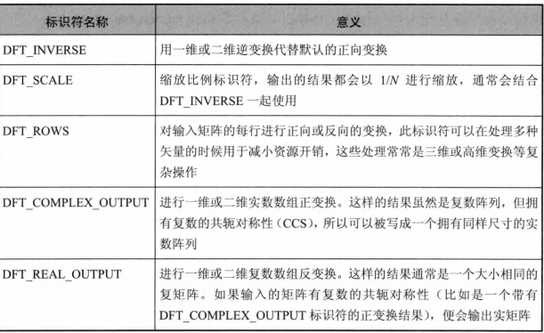
#### 返回DFT最优尺寸大小：getOptimalDFTSize()函数
getOptimalDFTSize()函数返回给定量尺寸的傅里叶最优尺寸大小。为了提高离散傅里叶变换的运行速度，需要扩充图像，而具体扩充多少，就由这个函数计算得到。
#### 扩充图像边界：copyMakeBorder()函数
#### 计算二维矢量的幅值：magnitude（）函数
#### 计算自然对数：log（）函数
#### 矩阵归一化：normalize（）函数
#### 示例程序：离散傅里叶变换
```C++
int main()
{

	//【1】以灰度模式读取原始图像并显示
	Mat srcImage = imread("E:\\车载信息处理（龚）\\timg.jpg", 0);
	if (!srcImage.data) { printf("读取图片错误，请确定目录下是否有imread函数指定图片存在~！ \n"); return false; }
	imshow("原始图像", srcImage);

	ShowHelpText();

	//【2】将输入图像延扩到最佳的尺寸，边界用0补充
	int m = getOptimalDFTSize(srcImage.rows);
	int n = getOptimalDFTSize(srcImage.cols);
	//将添加的像素初始化为0.
	Mat padded;
	copyMakeBorder(srcImage, padded, 0, m - srcImage.rows, 0, n - srcImage.cols, BORDER_CONSTANT, Scalar::all(0));

	//【3】为傅立叶变换的结果(实部和虚部)分配存储空间。
	//将planes数组组合合并成一个多通道的数组complexI
	Mat planes[] = { Mat_<float>(padded), Mat::zeros(padded.size(), CV_32F) };
	Mat complexI;
	merge(planes, 2, complexI);

	//【4】进行就地离散傅里叶变换
	dft(complexI, complexI);

	//【5】将复数转换为幅值，即=> log(1 + sqrt(Re(DFT(I))^2 + Im(DFT(I))^2))
	split(complexI, planes); // 将多通道数组complexI分离成几个单通道数组，planes[0] = Re(DFT(I), planes[1] = Im(DFT(I))
	magnitude(planes[0], planes[1], planes[0]);// planes[0] = magnitude  
	Mat magnitudeImage = planes[0];

	//【6】进行对数尺度(logarithmic scale)缩放
	magnitudeImage += Scalar::all(1);
	log(magnitudeImage, magnitudeImage);//求自然对数

	//【7】剪切和重分布幅度图象限
	//若有奇数行或奇数列，进行频谱裁剪      
	magnitudeImage = magnitudeImage(Rect(0, 0, magnitudeImage.cols & -2, magnitudeImage.rows & -2));
	//重新排列傅立叶图像中的象限，使得原点位于图像中心  
	int cx = magnitudeImage.cols / 2;
	int cy = magnitudeImage.rows / 2;
	Mat q0(magnitudeImage, Rect(0, 0, cx, cy));   // ROI区域的左上
	Mat q1(magnitudeImage, Rect(cx, 0, cx, cy));  // ROI区域的右上
	Mat q2(magnitudeImage, Rect(0, cy, cx, cy));  // ROI区域的左下
	Mat q3(magnitudeImage, Rect(cx, cy, cx, cy)); // ROI区域的右下
	//交换象限（左上与右下进行交换）
	Mat tmp;
	q0.copyTo(tmp);
	q3.copyTo(q0);
	tmp.copyTo(q3);
	//交换象限（右上与左下进行交换）
	q1.copyTo(tmp);
	q2.copyTo(q1);
	tmp.copyTo(q2);

	//【8】归一化，用0到1之间的浮点值将矩阵变换为可视的图像格式
	//此句代码的OpenCV2版为：
	//normalize(magnitudeImage, magnitudeImage, 0, 1, CV_MINMAX); 
	//此句代码的OpenCV3版为:
	normalize(magnitudeImage, magnitudeImage, 0, 1, NORM_MINMAX);

	//【9】显示效果图
	imshow("频谱幅值", magnitudeImage);
	waitKey();

	return 0;
}
```
> 运行结果
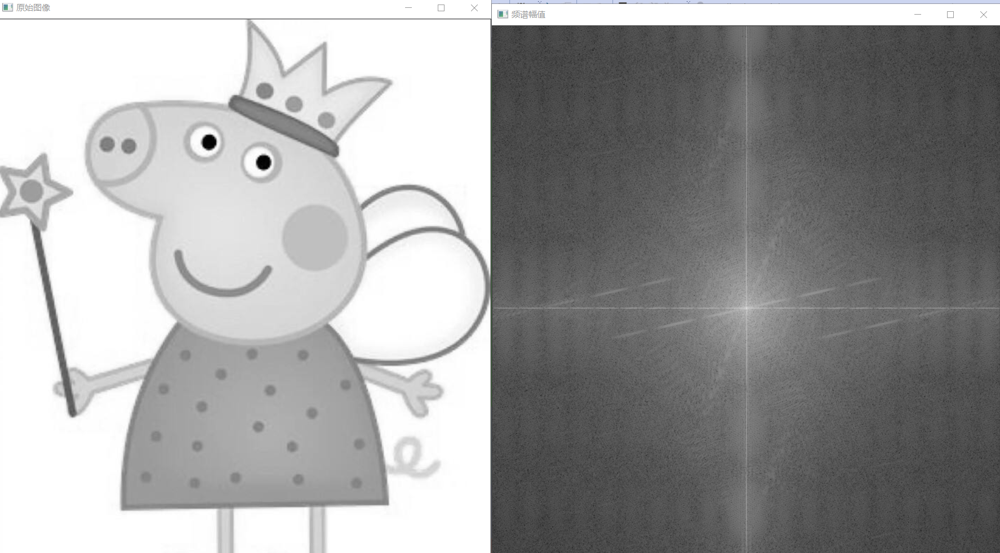

### 输入输出XML和YAML文件
#### XML和YAML文件
> XML为可扩展标识语言，是一种语义/结构化语言，它描述了文档的结构和语义。
> YAML为不是一种置标语言，是一个可读性高，用来表达资料序列的格式。

#### ch05小结
在本章节中学习了core模块的一些进阶知识点——操作图像中的像素、图像混合、分离颜色通道、调节图像的对比度和亮度、进行傅里叶变换以及输入输出XML和YAML文件。并且在这个过程中感受到一些命令的实现都是基于数学公式的，推导理解数学公式的能力也很重要。