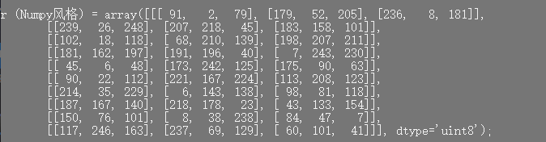
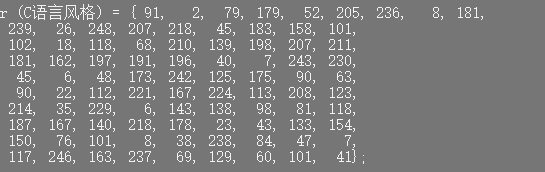
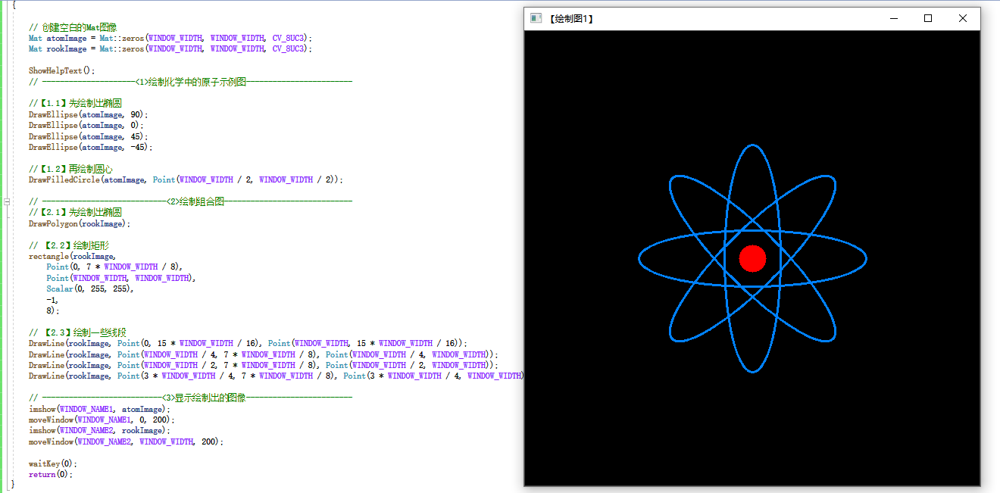
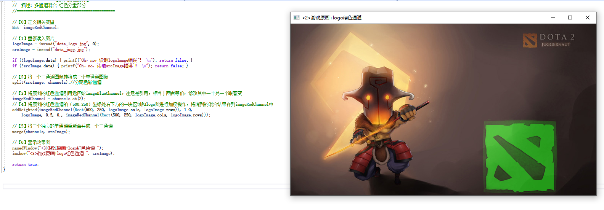
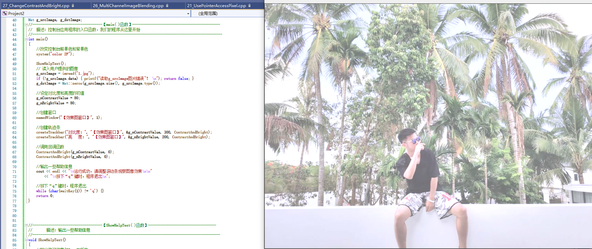
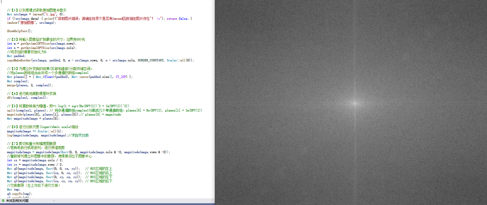

# 学习笔记

# 第四章节

## 基础图像容器 Mat

### 数字图像存储概述

Mat是一个容器类，支持C++中一般容器对元素的操作，同时作为一种矩阵数据存储类，由两个数据部分构成：1、矩阵头：包含矩阵尺寸、存储方式、存储地址等信息；2、指向存储所有像素值的矩阵的指针。矩阵头的尺寸是常数，但尺寸本身的尺寸会因图像的不同而不同。
通常创建和传递矩阵时会造成很大开销，在进行较大矩阵复制时，OpenCV引入了计数机制，让每个Mat对象都有自己的信息头，但共享同一个矩阵，者通过让矩阵指针指向同一地址实现，所以拷贝构造函数只复制信息头和矩阵指针，而不复制矩阵，避免了大量的空间时间开销。
然而某些时候你还是会复制矩阵本身，（不只是信息头和矩阵指针），这时可以使用函数clone()和copyTo()函数。

构造Mat矩阵时：

- 使用赋值运算符和拷贝构造函数只复制信息头，改变任何一个矩阵都会影响到其他矩阵。
- 使用函数Clone()和copyTo()来复制一幅图像的矩阵，新创建的矩阵和原矩阵相互独立，改变其中一个矩阵不会影响到其他矩阵。

#### Mat结构使用

Mat是一个类，由两个数据部分组成:矩阵头（包含矩阵尺寸、存储方法、存储地址等信息）和一个指向存储所有像素值的矩阵（根据所选存储方法的不同，矩阵可以是不同的维数）的指针。矩阵头的尺寸是常数值，但矩阵本身的尺寸会依图像的不同而不同，通常比矩阵头的尺寸大数个数量级。因此，当在程序中传递图像并创建副本时，大的开销是由矩阵造成的，而不是信息头。OpenCV是一个图像处理库，囊括了大量的图像处理函数，为了解决问题通常要使用库中的多个函数，因此在函数中传递图像是常有的事。同时不要忘了我们正在讨论的是计算量很大的图像处理算法，因此，除非万不得已，不应该进行大图像的复制，因为这会降低程序的运行速度。

OpenCV使用了引用计数机制。其思路是让每个Mat对象有自己的信息头，但共享同一个矩阵。这通过让矩阵指针指向同一地址而实现。而拷贝构造函数则只复制信息头和矩阵指针，而不复制矩阵。

#### 创建 Mat对象的方法

- 1、使用Mat( )构造函数

在构造函数中很多地方都用到Type，Type可以是CV_8UC1、CV_16UC3、CV_64FC4等等，
比如，CV_8UC3表示8位3通道unsigned整型。

数据共享：指不同Mat图像矩阵矩阵指针指向同一个矩阵地址，当改变一个矩阵时其他矩阵也会跟着改变。

- 2、使用Create( )函数创建Mat类

【注意】使用create( )函数无法初始化Mat类，只是在改变尺寸时重新为矩阵数据开辟内存而已。也就是说，如果create()函数指定的参数与图像之前的尺寸相同，则不进行实质的内存申请操作，如果尺寸不同，则减少原始数据内存的索引并重新申请内存。

- 3、使用MATLAB风格创建Mat类

OpenCV也可以使用Matlab的风格创建函数如：zeros(),ones()和eyes(),在使用这些函数时只需要指定图像的大小和类型。

- 4、使用子类Mat_创建Mat矩阵
  
OpenCV定义了一个Mat的模板子类为Mat_，使用逗号分隔式初始化小型矩阵。

- 5、使用clone( )或copyTo方法创建Mat矩阵
  
copyTo( )是深拷贝，但是否申请新的内存空间，取决于dst矩阵头中的大小信息是否与src一至，若一致则只深拷贝并不申请新的空间，否则先申请空间后再进行拷贝。

clone( )是完全的深拷贝，在内存中申请新的空间。

关于clone()、copyTo()、和”=”（重赋值运算符重载）三种实现矩阵赋值的方式的比较：
       ~~~~~~      ”=”是使用重载的方式将矩阵值赋值给新的矩阵，而这种方式下，被赋值的矩阵和赋值矩阵之间共享数据，改变任何一个矩阵的值会影响到另外一个矩阵。而clone()和copyTo()两种方法在赋值后，两个矩阵的存储空间是独立的，不存在共享数据的情况。

- 6、IplImage指针转Mat矩阵
  
IPLImage指针创建信息头可实现IPLImage*到Mat矩阵转换。

### Opencv 格式化输出方法

- 1【Opencv 默认风格】

- 2【Python 风格】

- 3【Numpy 风格】
  

- 4【逗号分隔风格】
  

- 5【C 语言风格】
  

#### 代码展示

#include "opencv2/core/core.hpp"
#include "opencv2/highgui/highgui.hpp"
#include <iostream>
using namespace std;
using namespace cv;

//-----------------------------【ShowHelpText( )函数】--------------------------------------
//		描述：输出帮助信息
//-------------------------------------------------------------------------------------------------
static void ShowHelpText()
{
	//输出欢迎信息和OpenCV版本
	printf("\n\n\t\t\t非常感谢购买《OpenCV3编程入门》一书！\n");
	printf("\n\n\t\t\t此为本书OpenCV3版的第19个配套示例程序\n");
	printf("\n\n\t\t\t   当前使用的OpenCV版本为：" CV_VERSION );
	printf("\n\n  ----------------------------------------------------------------------------\n");

	//输出一些帮助信息
	printf("\n\n\n\t欢迎来到【基本图像容器-Mat类】示例程序~\n\n"); 	
	printf("\n\n\t程序说明：\n\n\t此示例程序用于演示Mat类的格式化输出功能，输出风格可为：");
	printf("\n\n\n\t【1】OpenCV默认风格");
	printf("\n\n\t【2】Python风格");
	printf("\n\n\t【3】逗号分隔风格");
	printf("\n\n\t【4】Numpy风格");
	printf("\n\n\t【5】C语言风格\n\n");
	printf("\n  --------------------------------------------------------------------------\n");

}

//--------------------------------------【main( )函数】-----------------------------------------
//          描述：控制台应用程序的入口函数，我们的程序从这里开始执行
//-----------------------------------------------------------------------------------------------
int main(int,char**)
{
	//改变控制台的前景色和背景色
	system("color 8F"); 

	//显示帮助文字
	ShowHelpText();

	Mat I = Mat::eye(4, 4, CV_64F);
	I.at<double>(1,1) = CV_PI;
	cout << "\nI = " << I << ";\n" << endl;

	Mat r = Mat(10, 3, CV_8UC3);
	randu(r, Scalar::all(0), Scalar::all(255));

	//此段代码的OpenCV2版为：
	//cout << "r (OpenCV默认风格) = " << r << ";" << endl << endl;
	//cout << "r (Python风格) = " << format(r,"python") << ";" << endl << endl;
	//cout << "r (Numpy风格) = " << format(r,"numpy") << ";" << endl << endl;
	//cout << "r (逗号分隔风格) = " << format(r,"csv") << ";" << endl<< endl;
	//cout << "r (C语言风格) = " << format(r,"C") << ";" << endl << endl;
	//此段代码的OpenCV3版为：
	cout << "r (OpenCV默认风格) = " << r << ";" << endl << endl;
	cout << "r (Python风格) = " << format(r, Formatter::FMT_PYTHON) << ";" << endl << endl;
	cout << "r (Numpy风格) = " <<  format(r, Formatter::FMT_NUMPY )<< ";" << endl << endl;
	cout << "r (逗号分隔风格) = " << format(r, Formatter::FMT_CSV   )<< ";" << endl<< endl;
	cout << "r (C语言风格) = " <<  format(r, Formatter::FMT_C     ) << ";" << endl << endl;

	Point2f p(6, 2);
	cout << "【2维点】p = " << p << ";\n" << endl;

	Point3f p3f(8, 2, 0);
	cout << "【3维点】p3f = " << p3f << ";\n" << endl;

	vector<float> v;
	v.push_back(3);
	v.push_back(5);
	v.push_back(7);

	cout << "【基于Mat的vector】shortvec = " << Mat(v) << ";\n"<<endl;

	vector<Point2f> points(20);
	for (size_t i = 0; i < points.size(); ++i)
		points[i] = Point2f((float)(i * 5), (float)(i % 7));

	cout << "【二维点向量】points = " << points<<";";

	getchar();//按任意键退出

	return 0;

}

## 输出其他常用数据结构

### 输出二维点

- 1.输出二维点
  

- 2.输出三维点
  

- 3.输出基于Mat 
  

- 4.输出std::vector点

### 代码展示

#include "opencv2/core/core.hpp"
#include "opencv2/highgui/highgui.hpp"
#include <iostream>
using namespace std;
using namespace cv;

int main(int, char**)
{
	Point2f p(6, 2);
	cout << "【2维点】p = " << p << ";\n" << endl;

	Point3f p3f(8, 2, 0);
	cout << "【3维点】p3f = " << p3f << ";\n" << endl;

	vector<float> v;
	v.push_back(3);
	v.push_back(5);
	v.push_back(7);

	cout << "【基于Mat的vector】shortvec = " << Mat(v) << ";\n" << endl;

	vector<Point2f> points(20);
	for (size_t i = 0; i < points.size(); ++i)
		points[i] = Point2f((float)(i * 5), (float)(i % 7));

	cout << "【二维点向量】points = " << points << ";";

	 
     return 0;
}

### 基本图形绘制

#### 涉及函数

- 用于绘制直线的line函数;
- 用于绘制椭圆的ellipse函数;
- 用于绘制矩形的rectangle函数;
- 用于绘制圆的circle函数;
- 用于绘制填充的多边形的fillPoly函数。

#### DrowEllipse()函数的方法

函数DrawEllipse 调用了OpenCV中的ellipse函数，将椭圆画到图像img 上，椭圆中心为点(WINDOw_WIDTH/2.0,WINDOw_WIDTH/2.0 )，并且大小位于矩形(WINDOw_WIDTH/4.0,WINDOw_WIDTH/16.0 )内。椭圆旋转角度为angle，扩展的弧度从О度到360度。图形颜色为Scalar(255,129,0)代表的蓝色，线宽(thickness)为2，线型(lineType)为8(8联通线型)。

#### 实验结果

#### DrawPolygon()函数写法

函数 DrawPolygon()调用了OpenCV中的 fillPoly函数，用于将多边形画到图像img 上，其中多边形的顶点集为ppt，要绘制的多边形顶点数目为npt，要绘制的多边形数量仅为1，多边形的颜色定义为白色Scalar(255,255,255)。

#### 实验结果

# 第五章节

## 函数总结

### 计算数组加权和

addweighted()这个函数的作用是计算两个数组(图像阵列)的加权和。原型如下:
void (InputArray src1,double alpha，InputArray src2，double beta,doublegamana,outputArray dst, int dtype=-1) ;

- ·第一个参数，InputArray类型的src1，表示需要加权的第一个数组，常常填一个Mat;
- 第二个参数，double类型的alpha，表示第一个数组的权重;
- 第三个参数，InputArray 类型的 src2，表示第二个数组，它需要和第一个数组拥有相同的尺寸和通道数;
- 第四个参数，double类型的beta，表示第二个数组的权重值;
- 第五个参数，double类型的gamma，一个加到权重总和上的标量值。其含义通过接下来列出的式子自然会理解;
- 第六个参数，OutputArray类型的 dst，输出的数组，它和输入的两个数组拥有相同的尺寸和通道数;
- 第七个参数，int类型的dtype，输出阵列的可选深度，有默认值-1。当两个输入数组具有相同的深度时，这个参数设置为-1（默认值)，即等同于src1.depth()。
  
### 通道分离：split()函数

split函数用于将一个多通道数组分离成几个单通道数组。这里的 array按语境翻译为数组或者阵列。
这个split函数的C++版本有两个原型，分别是:
- C++: void split(const Mat& src, Mat*mvbegin);
- C++: void split(InputArray m,OutputArrayOfArrays mv);
  
变量介绍如下:
- ·第一个参数，InputArray类型的m或者const Mat&类型的src，填我们需要进行分离的多通道数组。
- ·第二个参数，OutputArrayOfArrays类型的mv，填函数的输出数组或者输出的vector容器。
  
split函数分割多通道数组转换成独立的单通道数组，公式如下: mv[c](I)= src(I)。

### 通道合并：merge（）函数

mergeO函数是split(函数的逆向操作——将多个数组合并成一个多通道的数组。它通过组合一些给定的单通道数组，将这些孤立的单通道数组合并成一个多通道的数组，从而创建出一个由多个单通道阵列组成的多通道阵列。它有两个基于C++的函数原型如下。

- 第一个参数，mv。填需要被合并的输入矩阵或vector容器的阵列，这个mv参数中所有的矩阵必须有着一样的尺寸和深度。
- 第二个参数，count。当mv为一个空白的C数组时，代表输入矩阵的个数，这个参数显然必须大于1。
- 第三个参数，dst。即输出矩阵，和 mv[0]拥有一样的尺寸和深度，并且通道的数量是矩阵阵列中的通道的总数。
  
merge函数的功能是将一些数组合并成一个多通道的数组。关于组合的细节，输出矩阵中的每个元素都将是输出数组的串接。其中，第i个输入数组的元素被视为mvi]。C一般用其中的Mat:.at()方法对某个通道进行存取，也就是这样用:channels.at(O)。

### 图像对比度、亮度值调整、

首先了解一下算子的概念。一般的图像处理算子都是一个函数，它接受一个或多个输入图像，并产生输出图像。下面是算子的一般形式。
g(x)= h(f(x))或者g(x)=h(J。(x)--- f ,(x))

本节所讲解的图像亮度和对比度的调整操作，其实属于图像处理变换中比较简单的一种——点操作( pointoperators)。点操作有一个特点:仅仅根据输入像素值(（有时可加上某些全局信息或参数)，来计算相应的输出像素值。这类算子包括亮度(brightness）和对比度( contrast）调整、颜色校正(colorcorrection）和变换( transformations)。

两种最常用的点操作(（或者说点算子)是乘上一个常数（对应对比度的调节)以及加上一个常数（对应亮度值的调节)。公式如下:g(i.j)=a*fi,j)+b

看到这个式子，我们关于图像亮度和对比度调整的策略就比较好理解了。其中:

- ·参数fx)表示源图像像素。
- ·参数g(x)表示输出图像像素。
- 参数a（需要满足a>0）被称为增益(gain)，常常被用来控制图像的对比度。
- ·参数b通常被称为偏置(bias)，常常被用来控制图像的亮度。而更近一步，我们这样改写这个式子:g(i.j)=a*fi,j)+b
  
其中，i和j表示像素位于第i行和第j列，这个式子可以用来作为我们在OpenCV中控制图像的亮度和对比度的理论公式。

### 离散傅里叶

#### 基本原理

对一张图像使用傅立叶变换就是将它分解成正弦和余弦两部分。也就是将图像从空间域(spatial domain)转换到频域(frequency domain)。这一转换的理论基础来自于以下事实：任一函数都可以表示成无数个正弦和余弦函数的和的形式。傅立叶变换就是一个用来将函数分解的工具。 2维图像的傅立叶变换可以用以下数学公式表达:
$F(k,l) = \displaystyle\sum\limits_{i=0}^{N-1}\sum\limits_{j=0}^{N-1} f(i,j)e^{-i2\pi(\frac{ki}{N}+\frac{lj}{N})}e^{ix} = \cos{x} + i\sin {x}$

式中 f 是空间域(spatial domain)值， F 则是频域(frequency domain)值。 转换之后的频域值是复数， 因此，显示傅立叶变换之后的结果需要使用实数图像(real image) 加虚数图像(complex image), 或者幅度图像(magitude image)加相位图像(phase image)。 在实际的图像处理过程中，仅仅使用了幅度图像，因为幅度图像包含了原图像的几乎所有我们需要的几何信息。然而，如果你想通过修改幅度图像或者相位图像的方法来间接修改原空间图像，你需要使用逆傅立叶变换得到修改后的空间图像，这样你就必须同时保留幅度图像和相位图像了。

在此示例中，我将展示如何计算以及显示傅立叶变换后的幅度图像。由于数字图像的离散性，像素值的取值范围也是有限的。比如在一张灰度图像中，像素灰度值一般在0到255之间。 因此，我们这里讨论的也仅仅是离散傅立叶变换(DFT)。 如果你需要得到图像中的几何结构信息，那你就要用到它了。

在频域里面，对于一幅图像，高频部分代表了图像的细节、纹理信息；低频部分代表了图像的轮廓信息。如果对一幅精细的图像使用低通滤波器，那么滤波后的结果就剩下了轮廓了。这与信号处理的基本思想是相通的。如果图像受到的噪声恰好位于某个特定的“频率”范围内，则可以通过滤波器来恢复原来的图像。傅里叶变换在图像处理中可以做到：图像增强与图像去噪，图像分割之边缘检测，图像特征提取，图像压缩等等。

### Xml,YAml

#### XML和YAML文件简介

本节我们将一起认识XML和、YAML这两种文件类型。

所谓XML,即eXtensibleMarkupLanguage,翻译成中文为“可扩展标识语言”。首先，XML是一种元标记语言。所谓“元标记”，就是开发者可以根据自身需要定义自己的标记，比如可以定义标记<book>、<name>。任何满足XML命名规则的名称都可以标记，这就向不同的应用程序打开了的大门。此外，XML是一种语义/结构化语言，它描述了文档的结构和语义。

YAML是"YAML Ain’t a Markup Language”（译为"YAML不是一种置标语言”）的递回缩写。在开发的这种语言时，YAML的原是："Yet Another Markup Language”（仍是一种置标语言），但为了强调这种语言以数据为中心，而不是以置标语言为重点，而用返璞词进行重新命名。YAML是一个可读性高，用来表达资料序列的格式。它参考了其他多种语言，包括：XML、C语言、Python、Perl,以及电子邮件格式RFC2822。

.yml和.yaml同为YAML格式的后名

 

总之，YAML试图用一种比更敏捷的方式，来完成XML所完成的任务。
2 . Filestorage类操作文件的使用引导

XML和YAML是使用非常广泛的文件格式，可以利用XML或者YAML格式的文件存储和还原各式各样的数据结构。当然，它们还可以存储和载入任意复
杂的数据结构，其中就包括了OpenCV相关周边的数据结构，以及各种原始数据类型，如整数和浮点数字和文本字符串．

我们一般使用如下过程来写入或者读取数据到XML或YAML文件中。
（1)实例化一个FileStorage类的对象，用默认带参数的构造函數完成初始化，或者用FileStorage::open()成员函数辅助初始化。
（2）使用流操作符<<进行文件写入操作，或者>>进行文件读取操作，类似c++中的文件输入输出流。
（3）使用FileStorage::release()函数析构掉FileStorage类对象，同时关闭文件。

#### 三个步骤实例讲解

    〖第一步〗XML、YAML文件的打开
    （1）准备文件写操作
    FileStoruge是OpenCV中XML和YAML文件的存储类，封装了所有相关的信息。它是OpenCV从文件中读数据或向文件中写数据时必须要使用的一个类。

    此类的构造函数为FileStorage::FileStorage，有两个重载，如下。
    C++：

    FiIeStOrage::FileStorage
 

    C++：

    FiIeStorage::FileStorage(const string & source,int flags,const string& encoding=string())
  

    构造函数在实际使用中，方法一般有两种。
    1）对于第二种带参数的构造函数，进行写操作范例如下。

    FileStorage fs;
    fs.open("abc.xml",FileStorage::WRITE);
       

    2）对于第一种不带参数的构造函数，可以使用其成员函数FileStorage::open进行数据的与操作，范例如下。

    FileStorage fs;
    fs.open("abc.xml",FileStorage::READ);
         

    （2）准备文件读操作
    上面讲到的都是以FileStorage::WRITE为标识符的写操作，而读操作，采用FileStronge::READ标识符即可，相关示例代码如下。
    1)第一种方式

    FileStorage fs("abc.xml",FileStorage::READ);
   

    2）第二种方式

    FileStorage fs;
    	fs.open("abc.xml",FileStroage::READ);
        

    〖第二步〗进行文件的读取操作
    （1）文本和数字的输入和输出
    定义好FileStorage类对象之后，写入文件可以使用“<<”运算符，例如：

    fs<<"iterationNr"<<100;
   

    而读取文件，使用“>>”运算符，例如：

    int itNr;
    fs["iterationNr"]>>itNr;
    itNr=(int)fs["iterationNr"];
       

    （2）OpenCV数据结构的输入和输出
    关于OpenCV数据结构的输入和输出，和基本的C++形式相同，范例如下。

    //数据结构的初始化
    	Mat R = Mat_<uchar>::eye(3, 3);
    	Mat T = Mat_<double>::zeros(3, 1);

    	//向Mat中写入数据
    	fs << "R" << R;
    	fs << "T" << T;

    	//从Mat中读出数据
    	fs["R"] >> R;
    	fs["T"] >> T;
        
    〖第三步〗vector(arrays)和maps的输入和输出
    对于vector结构的输入和输出，要注意在第一个元素前加上"["，在最后一个元素前加上“]”。例如：

    //开始读入string文本序列
    	fs << "strings" << "[";
    	fs << "image1.jpg" << "Awesomeness" << "baboon.jpg";
    	fs << "]";
        

    而对于map结构的操作，使用的符号是“{”和“}”，例如：

    fs << "Mapping";
    	fs << "{" << "One" << 1;
    	fs << "Two" << 2 << "}";
         

    读取这些结构的时候，会用到FileNode和Fileodelterator数据结构。对Filestorage类的“[”、“]”操作符会返回FileNode数据类型；对于一连串的node，可以使用FileNodeIterator结构，例如：

    FileNode n = fs["strings"];//读取字符串序列以得到节点
    	if (n.type()!=FileNode::SEQ)
    	{
    		cerr << "发生错误！字符串不是一个序列！" << endl;
    		return 1;
    	}

    	//遍历节点
    	FileNodeIterator it = n.begin(), it_end = n.end();
    	for (; it != it_end; it++)
    	{
    		cout << (string)*it << endl;
    	}
       

    〖第四步〗关闭文件
    需要注意的是，文件关闭操作会在FileStroage类销毁的同时自动进行，但我们也可显式调用其析构函数FileStroage::release()实现。FileStroage::release()函数会析构掉FileStroage类对象，同时关闭文件。
    调用过程非常简单，如下。

    fs.release();

### 实验结果展示

#### 多通道图像混合

#### 图像对比度、亮度值调整

#### 离散傅里叶变换

#### XML和 YAML

### 章节总结

#### 第四章节

本章我们主要学习了经常会遇到的各种数据结构，主要是基础图像容器Mat的用法。

**基本知识**：图形是由数字矩阵进行存储的。

**Mat的使用**:

- (1)不必再手动为其开辟空间。
- (2）不必再在不需要时立即将空间释放。
  
**复制的函数**:

- 一般的赋值情况为：是创建一个新的指针
- 如果使用cv.clone()或者copyTo()则是真正意义上的复制，会占用存储空间
- 清理数据时，由计数机制实现
  
**像素值的存储**：

- 1. RGB是最常见的，这是因为人眼采用相似的工作机制，它也被显示设备所采用
- 2. HSV和 HLS把颜色分解成色调、饱和度和亮度/明度。这是描述颜色更自然的方式，比如可以通过抛弃最后一个元素，使算法对输入图像的光照条件不敏感
- 3. YCrCb在JPEG图像格式中广泛使用
- 4. CIE L*ab*是一种在感知上均匀的颜色空间，它适合用来度量两个颜色之间的距离
  

**重点分析**：
- OpenCV函数中输出图像的内存分配是自动完成的(如果不特别指定的话)。
- 使用OpenCV的C++接口时不需要考虑内存释放问题。
- 赋值运算符和拷贝构造函数（构造函数)只复制信息头。
- 使用函数clone(或者copy To0来复制一幅图像的矩阵。

#### 第五章节

本节中，我们学习了core模块的一些进阶知识点——操作图像中的像素、图像混合、分离颜色通道、调节图像的对比度和亮度、进行离散傅里叶变换，以及输入输出XML和YAML文件。

**存储**：图片是以多通道（多列）数字矩阵存储的
**颜色空间缩减**：`将每个像素的值经过计算，投射到某一范围内，操作时对每一个像素进行操作`

**Look up table操作**：`用LUT对图像建立一个表，然后再进行查找`
**计时函数**：
- getTickCount()函数返回CPU自某个事件(如启动电脑)以来走过的时钟周期数。
- getTickFrequency()函数返回CPU一秒钟所走的时钟周期数。这样，我们就能轻松地以秒为单位对某运算计时。

**访问像素**:
`指针访问像素，由于多通道的原因在计算数量时要乘以通道数`

**用途**:

这个区域是图像分析所关注的重点。圈定这个区域，以便进行进一步的处理。而且，使用ROI指定

想读入的目标，可以减少处理时间，增加精度，给图像处理带来不小的便利。
