# ch_6 图像处理

 ### 6.1 线性滤波:方框滤波、均值滤波、高斯滤波
 
 #### 6.1.1 平滑处理

 - 平滑处理(smoothing)也称模糊处理(bluring)，是一种简单且使用频率很高的图像处理方法。平滑处理的用途有很多，最常见的是用来减少图像上的噪点或者失真。在涉及到降低图像分辨率时，平滑处理是非常好用的方法。

 #### 6.1.2 图像滤波与滤波器

 - 图像滤波：指在尽量保留图像细节特征的条件下对目标图像的噪声进行抑制，是图像预处理中不可缺少的操作，其处理效果的好坏将直接影响到后续图像处理和分析的有效性和可靠性。
 
 - 图像滤波的目的有两个:
            
       1)抽出对象的特征作为图像识别的特征模式。
      
       2)为适应图像处理的要求，消除图像数字化时所混入的噪声。

 - 关于滤波器，一种形象的比喻是:可以把滤波器想象成一个包含加权系数的窗口，当使用这个滤波器平滑处理图像时，就把这个窗口放到图像之上，透过这个窗口来看我们得到的图像。

 - 5种常用的图像平滑处理操作方法：
      
       方框滤波- BoxBlur函数
       均值滤波(邻域平均滤波)- Blur函数
       高斯滤波- GaussianBlur函数
       中值滤波- medianBlur函数
       双边滤波- bilateralFilter函数

 #### 6.1.3 线性滤波器的简介

 - 线性滤波器:线性滤波器经常用于剔除输入信号中不想要的频率或者从许多频率中选择一个想要的频率。
 
 - 几种常见的线性滤波器如下。
      
       低通滤波器:允许低频率通过。
       高通滤波器:允许高频率通过。
       带通滤波器:允许一定范围频率通过。
       带阻滤波器:阻止一定范围频率通过并且允许其他频率通过。
       全通滤波器:允许所有频率通过，仅仅改变相位关系。
       陷波滤波器( Band-Stop Filter): 阻止一个狄窄频率范围通过，是一种特殊带阻滤波器。

 #### 6.1.4 滤波和模糊
 
 - 高斯滤波是指用高斯函数作为滤波函数的滤波操作。
 
 - 高斯模糊就是高斯低通滤波。

 #### 6.1.5 邻域算子与线性邻域滤波

 - 邻域算子(局部算子)：是利用给定像素周围的像素值的决定此像素的最终输出值的一种算子。
 
 - 线性邻域滤波：是一种常用的邻域算子，像素的输出值取决于输入像素的加权和。

 #### 6.1.6 方框滤波
 
 - 方框滤波(box Fiter)被封装在一个名为boxblur的函数中，即boxblur函数的作用是使用方框滤波器(box filter)来模糊一张图片， 从sre输入，从dst输出。
  
 #### 6.1.7 均值滤波

 - 均值滤波是典型的线性滤波算法，主要方法为邻域平均法，即用一片图像区域的各个像素的均值来代替原图像中的各个像素值。一般需要在图像上对目标像素给出一个模板(内核),该模板包括了其周围的临近像素(比如以目标像素为中心的周围8 (3x3-1)个像素，构成一个滤波模板，即去掉目标像素本身)。再用模板中的全体像素的平均值来代替原来像素值。

 #### 6.1.8 高斯滤波

 - 高斯滤波是一种线性平滑滤波，可以消除高斯噪声，广泛应用于图像处理的减噪过程。通俗地讲，高斯滤波就是对整幅图像进行加权平均的过程，每一个像素点的值，都由其本身和邻域内的其他像素值经过加权平均后得到。高斯滤波的具体操作是:用一个模板(或称卷积、掩模)扫描图像中的每一个像素，用模板确定的邻域内像素的加权平均灰度值去替代模板中心像素点的值。

 #### 6.1.9 线性滤波相关
  
 - 方框滤波
 
 - 实机演示效果
 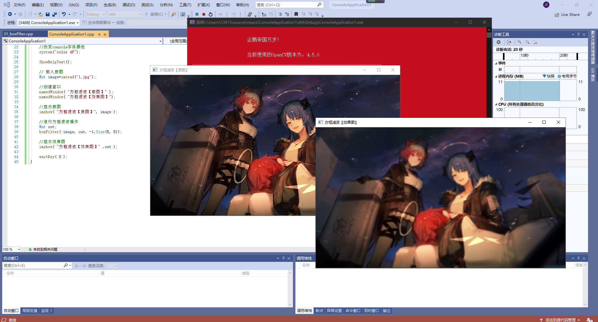
 
 - 均值滤波

 - 实机演示效果
 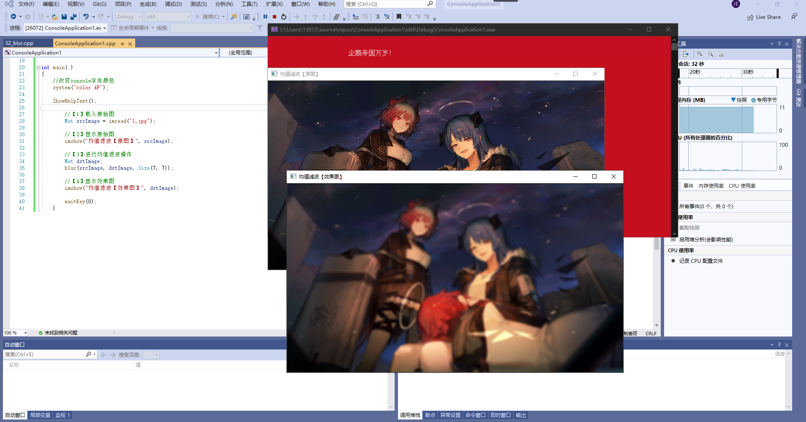

 #### 6.1.10 OpenCV中GaussianBlur函数源码剖析

 - 高斯滤波

 - 实机演示效果
 

 #### 6.1.12 图像线性滤波综合示例

 - 实机演示效果
 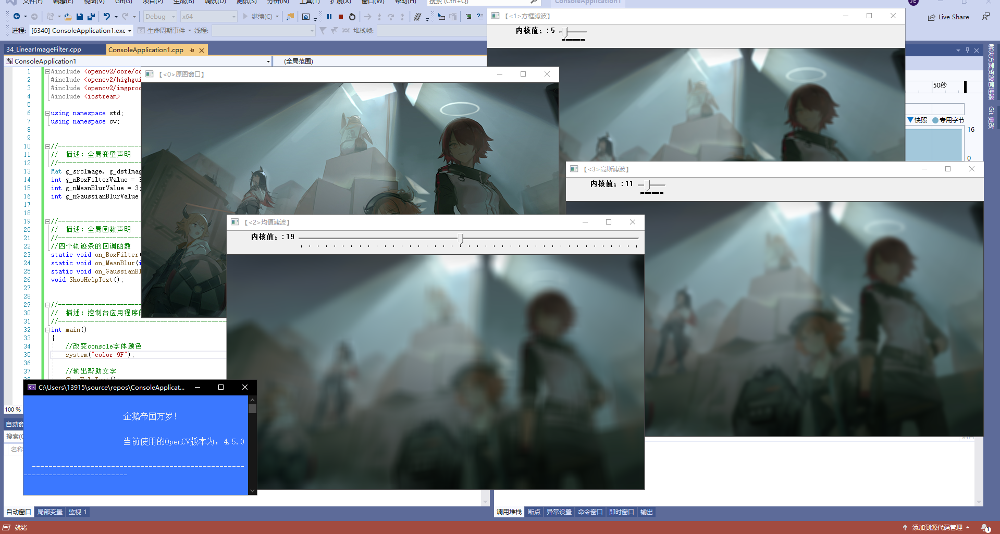

 ### 6.2 非线性滤波:中值滤波、双边滤波

 #### 6.2.1  非线性滤波概述

 - 在很多情况下，使用邻域像素的非线性滤波会得到更好的效果。比如在噪声是散粒噪声而不是高斯噪声，即图像偶尔会出现很大的值的时候，用高斯滤波器对图像进行模糊的话，噪声像素是不会被去除的，它们只是转换为更为柔和但仍然可见的散粒。这就到了中值滤波登场的时候了。

 #### 6.2.2 中值滤波

 - 中值滤波(Median filter)是一种典型的非线性滤波技术，基本思想是用像素点邻域灰度值的中值来代替该像素点的灰度值，该方法在去除脉冲噪声、椒盐噪声的同时又能保留图像的边缘细节。

 #### 6.2.3 双边滤波

 - 双边滤波( Bilateral filter) 是一种非线性的滤波方法，是结合图像的空间邻近度和像素值相似度的一种折中处理，同时考虑空域信息和灰度相似性，达到保边去噪的目的，具有简单、非迭代、局部的特点。
  
 #### 6.2.4 非线性滤波相关核心API函数

 - 中值滤波: medianBlur 函数
 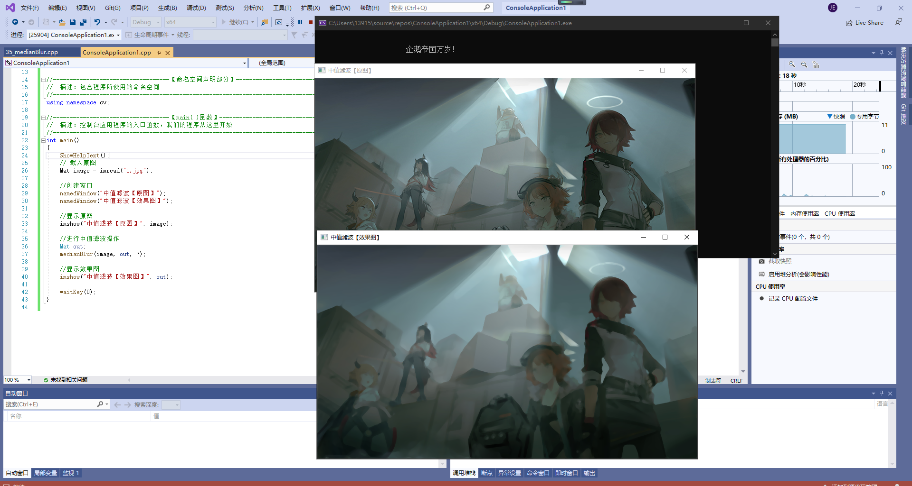

 - 双边滤波：bilateralFilter 函数
 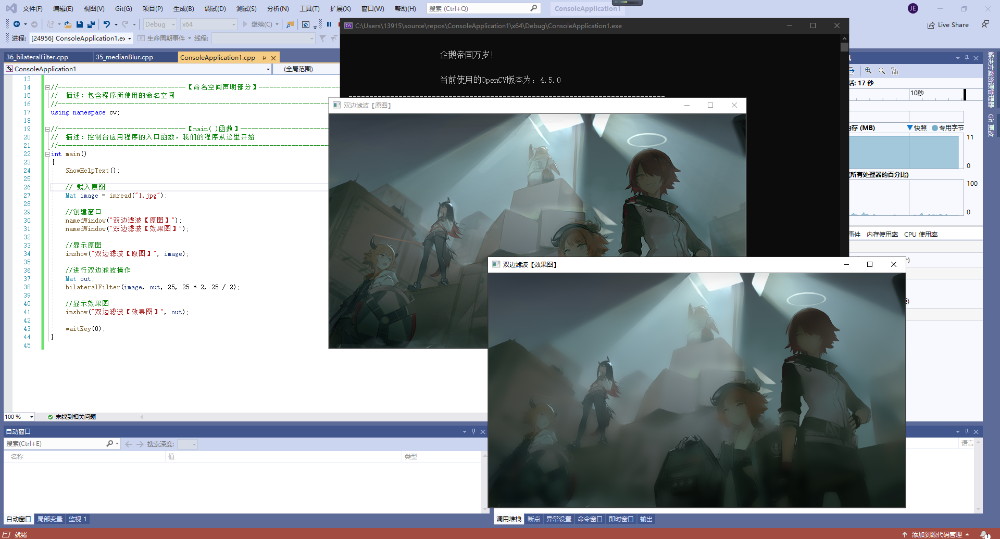

 #### 6.2.5 OpenCV中的5种图像滤波综合示例

 - 实机演示效果
 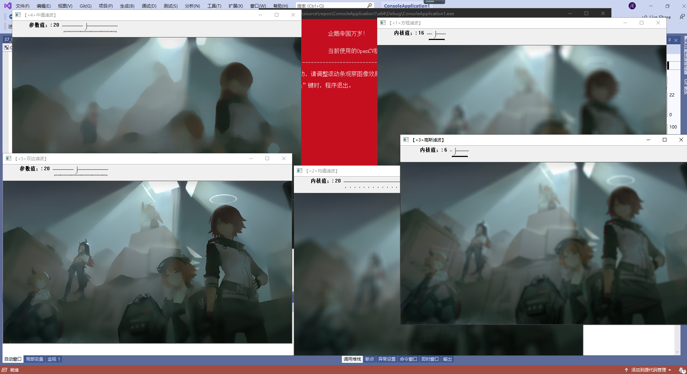

 ### 6.3 形态学滤波(1):腐蚀与膨胀

 #### 6.3.1 形态学概述

 - 形态学(morphology) 一词通常表示生物学的一个分支， 该分支主要研究动植物的形态和结构。而我们图像处理中的形态学，往往指的是数学形态学。

 - 数学形态学( Mathematical morphology) 是一门建立在格论和拓扑学基础之上的图像分析学科，是数学形态学图像处理的基本理论。其基本的运算包括:二值腐蚀和膨胀、二值开闭运算、骨架抽取、极限腐蚀、击中击不中变换、形态学梯度、Top-hat 变换、颗粒分析、流域变换、灰值腐蚀和膨胀、灰值开闭运算、灰值形态学梯度等。

 - 最基本的形态学操作有两种——**“膨胀”和“腐蚀”**，可以实现的基本功能如下：
  
       1) 消除噪声。
       2) 分割(isolate) 出独立的图像元素，在图像中连接(join)相邻的元素:。
       3) 寻找图像中的明显的极大值区域或极小值区域。
       4) 求出图像的梯度。

 #### 6.3.2 膨胀
 
 - 膨胀(dilate) ：
      
       是求局部最大值的操作。从数学角度来说，膨胀或者腐蚀操作就是将图像(或图像的一部分区域，称之为A)与核(称之为B)进行卷积。

 - 核：
  
       核可以是任何形状和大小，它拥有一个单独定义出来的参考点，我们称其为锚点(anchorpoint)。多数情况下，核是一个小的，中间带有参考点和实心正方形或者圆盘。其实，可以把核视为模板或者掩码。

 #### 6.3.3 腐蚀

 - 腐蚀(erode)：
     
       和膨胀是一对相反的操作，是求局部最小值的操作。

 #### 6.3.4 相关OpenCV源码分析溯源

 - 在...\opencv\sources\modules\imgproc\src\morph.cpp路径中，我们可以发现erode(腐蚀)函数和dilate(膨胀)函数的源码。

 #### 6.3.5 相关核心API函数

 1. 膨胀: dilate 函数
 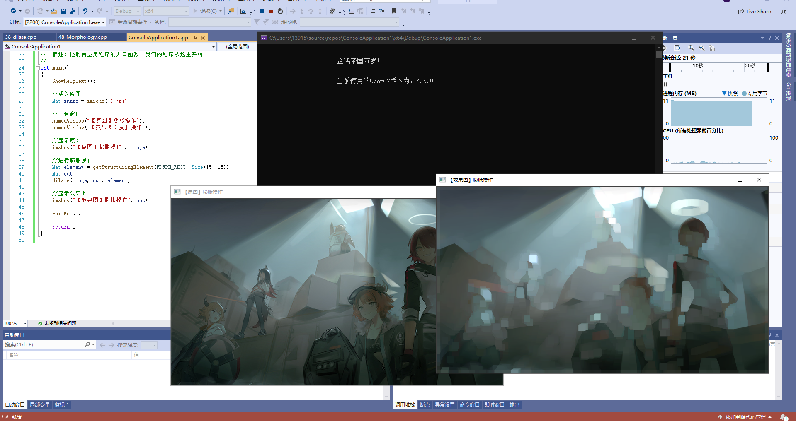

 2. 腐蚀: erode函数
 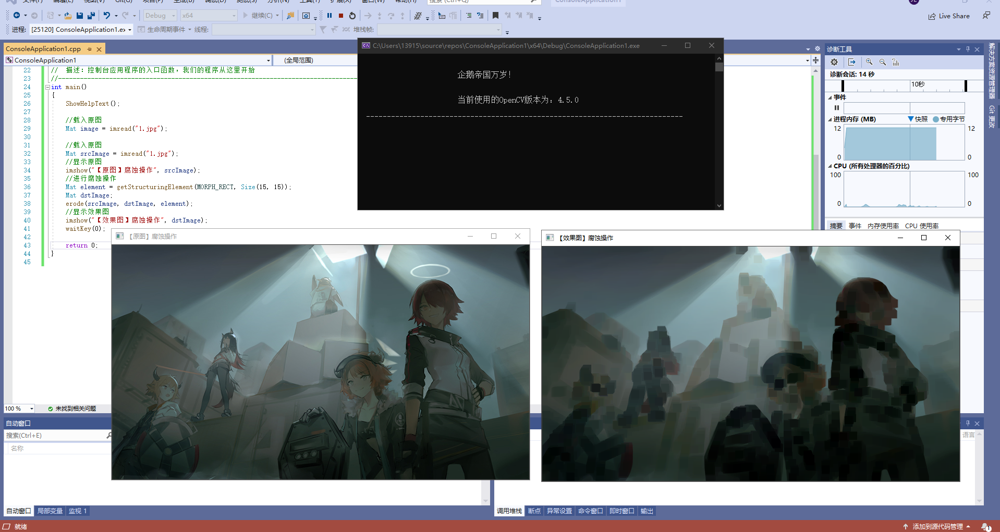

 #### 6.3.6 综合示例:腐蚀与膨胀

 - 实机演示效果
 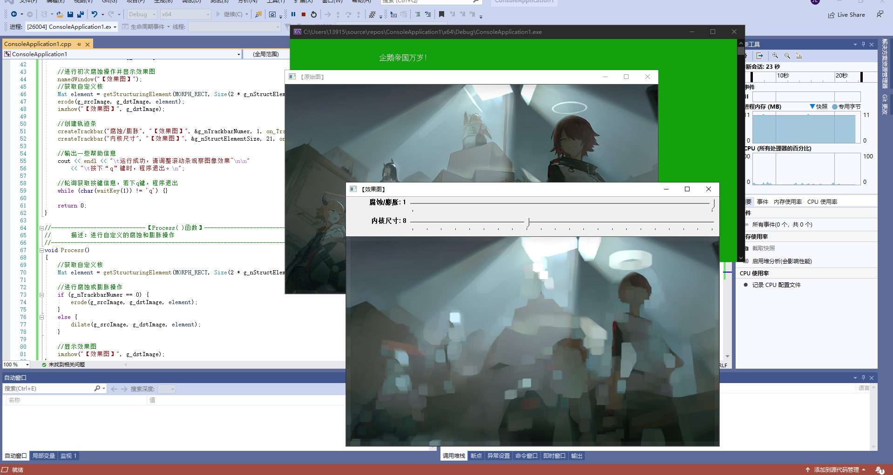

 ### 6.4 形态学滤波(2):开运算、闭运算、形态学梯度、顶帽、黑帽

 #### 6.4.1 开运算

 - 开运算(Opening Operation)，其实就是先腐蚀后膨胀的过程。其数学表达式如下:

     ***dst=open (src, element)=dilate (erode (src, element) )***

 - 开运算可以用来消除小物体，在纤细点处分离物体，并且在平滑较大物体的边界的同时不明显改变其面积。

 #### 6.4.2 闭运算

 - 先膨胀后腐蚀的过程称为闭运算(Closing Operation)，其数学表达式如下:
  
     ***dst=clese (src, element)=erode (dilate (src, element) )***

 - 闭运算能够排除小型黑洞(黑色区域)。
  
 #### 6.4.3 形态学梯度
 
 - 形态学梯度(Morphological Gradient)是膨胀图与腐蚀图之差，数学表达式如下:

     ***dat=morph-grad (src,element)=dilate (src, element)- erode (src, element)***

 - 对二值图像进行这一操作 可以将团块(blob) 的边缘突出出来。我们可以用形态学梯度来保留物体的边缘轮廓。
  
 #### 6.4.4 顶帽

 - 顶帽运算(Top Hat)又常常被译为”礼帽“运算，是原图像与上文刚刚介绍的“开运算”的结果图之差，数学表达式如下:

     ***dst=tophat (sre, element)=src-open (src, element)***
 
 - 因为开运算带来的结果是放大了裂缝或者局部低亮度的区域。因此，从原图中减去开运算后的图，得到的效果图突出了比原图轮廓周围的区域更明亮的区域，且这一操作与选择的核的大小相关。

 - 顶帽运算往往用来分离比邻近点亮一些的斑块。 在一-幅图像 具有大幅的背景，而微小物品比较有规律的情况下，可以使用顶帽运算进行背景提取。
  
 #### 6.4.5 黑帽

 - 黑帽(Black Hat)运算是闭运算的结果图与原图像之差。数学表达式为:

     ***dst=blackhat (src, element)=close (src, element)- sre***

 - 黑帽运算后的效果图突出了比原图轮廓周围的区域更暗的区域，且这一操作和选择的核的大小相关。
 
 - 黑帽运算用来分离比邻近点暗一些的斑块， 效果图有着非常完美的轮廓。

 #### 6.4.6 形态学滤波 OpenCV 源码分析溯源
  
 - morphologyEx函数：它利用基本的膨胀和腐蚀技术，来执行更加高级的形态学变换，如开闭运算、形态学梯度、“顶帽”、“黑帽”等。

 - morphologyEx函数其实就是内部的一个大switch而已，根据不同的标识符取不同的操作。

 #### 6.4.7 核心API函数: morphologyEx()

 - 上面已经讲到，morphologyEx 雨数利用基本的膨胀和腐蚀技术，来执行更加高级形态学变换，如开闭运算、形态学梯度、“顶帽”、“黑帽”等。
  
        C++: void morphologyEx (
        InputArray src,
        OutputArray dst,
        int op,
        InputArraykernel,
        Pointanchor-Point(-1,-1)，
        intiterations-l,
        intborderType-BORDER_ CONSTANT,
        constScalars & bordervalue=morphologyDefaultBordervalue() ) ;

 1. 第一个参数，InputArray类型的sre， 输入图像，即源图像，填Mat类的对象即可。图像位深应该为以下5种之一:CV_ 8U、CV_ 16U.CV_ 16S.CV_ 32F和CV_ _64F。
 
 2. 第二个参数，OutputArray 类型的dst, 即目标图像，函数的输出参数，需要和源图片有一样的尺寸和类型。
 
 3. 第三个参数，int类型的op,表示形态学运算的类型。

 #### 6.4.8 各形态学操作使用范例一览

 1. 用morphologyEx进行图像膨胀
 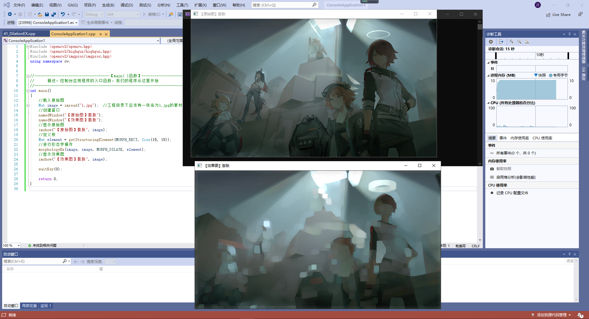

 2. 用morphologyEx进行图像腐蚀
 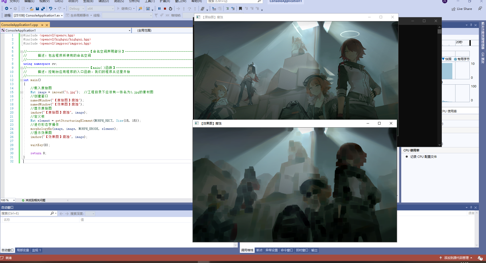

 3. 用morphologyEx进行图像开运算
 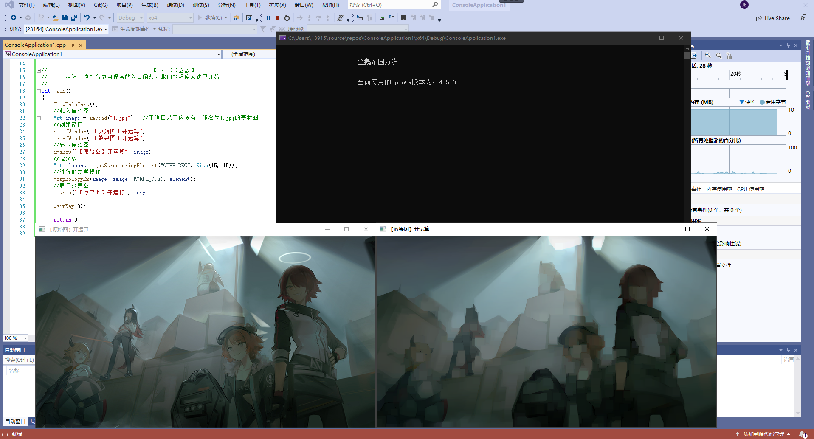   

 4. 用morphologyEx进行图像闭运算
 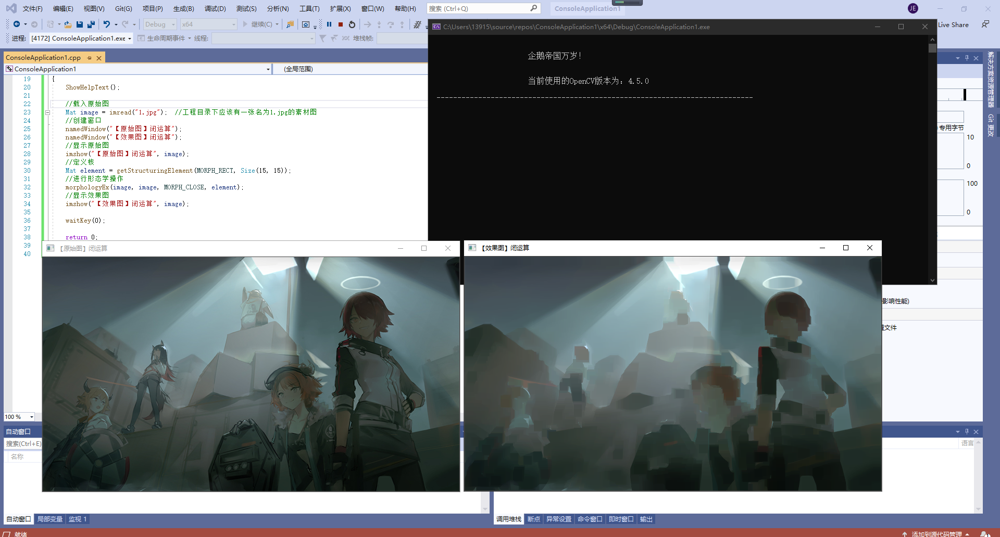

 5. 用morphologyEx进行形态学梯度运算
 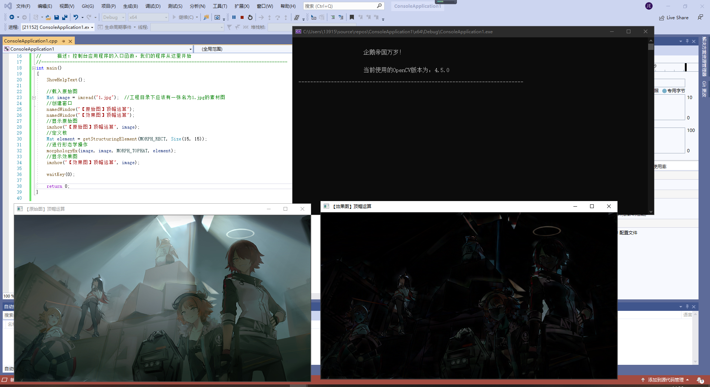

 6. 用morphologyEx进行形态学黑帽运算
 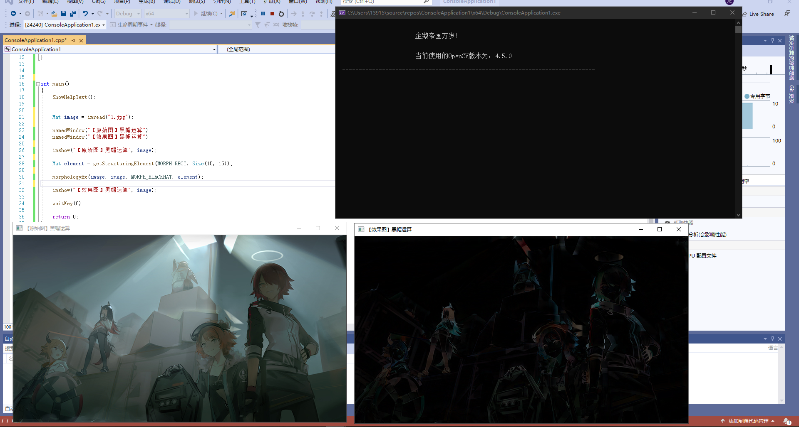 

 #### 6.4.9 综合示例:形态学滤波

 - 实机演示效果
 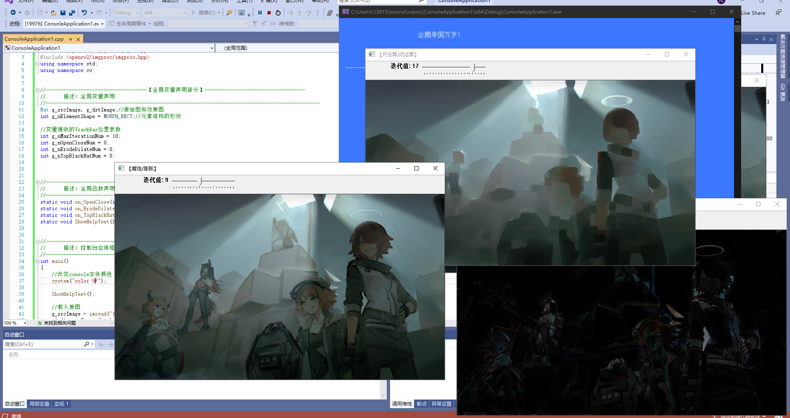

 ### 6.5 漫水填充

 #### 6.5.1 漫水填充的定义

 - 漫水填充法是一种用特定的颜色填充连通区域，通过设置可连通像素的上下限以及连通方式来达到不同的填充效果的方法。漫水填充经常被用来标记或分离图像的一部分，以便对其进行进一步处理或分析，也可以用来从输入图像获取掩码区域，掩码会加速处理过程，或只处理掩码指定的像素点，操作的结果总是某个连续的区域。

 #### 6.5.2 漫水填充法的基本思想

 - 所谓漫水填充，简单来说，就是自动选中了和种子点相连的区域，接着将该区域替换成指定的颜色，这是个非常有用的功能，经常用来标记或者分离图像的一部分进行处理或分析。漫水填充也可以用来从输入图像获取掩码区域，掩码会加速处理过程，或者只处理掩码指定的像素点。

 #### 6.5.3 实现漫水填充算法: floodFill 函数

 - 在OpenCV中，漫水填充算法由flooil函数实现，其作用是用我们指定的颜色从种子点开始填充一个连接域。连通性由像素值的接近程度来衡量。

 - 代码和运行演示
 

 #### 6.5.4 综合示例:漫水填充

 - 代码和运行演示
 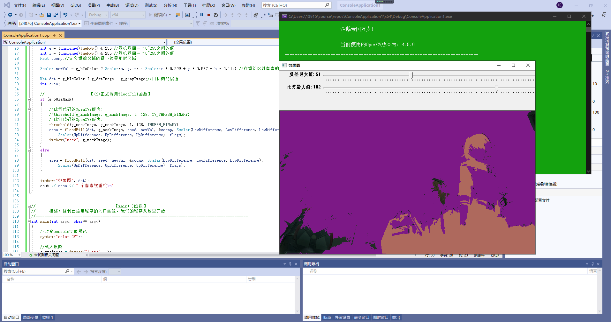
 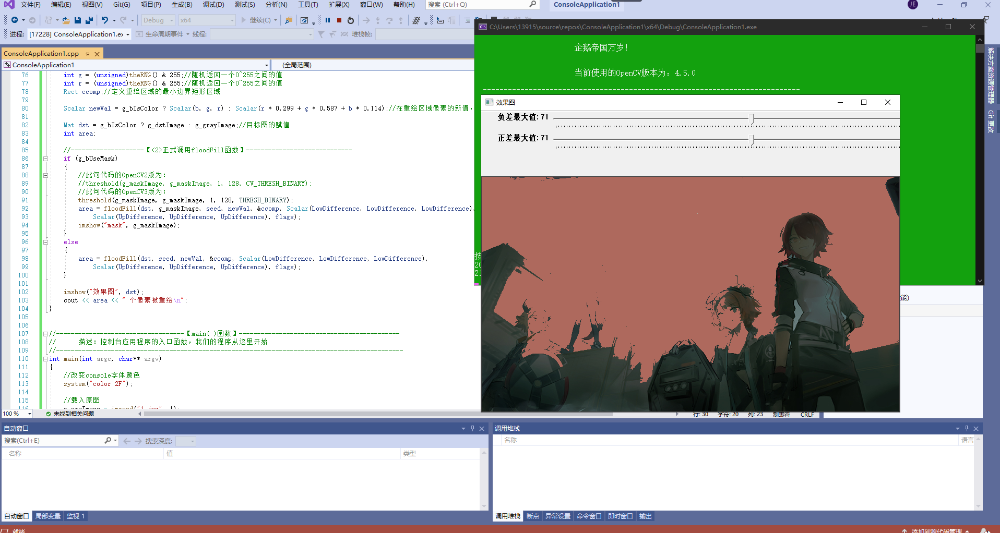

 ### 6.6 图像金字塔与图片尺寸缩放

 #### 6.6.1 引言

 - 我们经常会将某种尺寸的图像转换为其他尺寸的图像，如果要放大或者缩小图片的尺寸，笼统来说，可以使用OpenCV提供的如下两种方法。
    
        1) resize函数。
        
        2) pyrUpO、pyrDown()函数。即图像金字塔相关的两个函数，对图像进行向上采样和向下采样的操作。

 #### 6.6.2 关于图像金字塔
 
 - 图像金字塔是图像中多尺度表达的一-种， 最主要用于图像的分割，是一种以多分辨率来解释图像的有效但概念简单的结构。
 
 - 图像金字塔最初用于机器视觉和图像压缩，- -幅图像的金字塔是一系列以金字塔形状排列的，分辨率逐步降低且来源于同一张原始图的图像集合。其通过梯次向下采样获得，直到达到某个终止条件才停止采样。

 - 金字塔的底部是待处理图像的高分辨率表示，而顶部是低分辨率的近似。

 #### 6.6.3 高斯金字塔

 - 高斯金字塔是通过高斯平滑和亚采样获得一些列下采样图像，也就是说第K层高斯金字塔通过平滑、亚采样就可以获得K+1层高斯图像。高斯金字塔包含了一系列低通滤波器，其截止频率从上一层到下-层以因子2逐渐增加，所以高斯金字塔可以跨越很大的频率范围。

 #### 6.6.4 拉普拉斯金字塔
 
 - 拉普拉斯金字塔是通过源图像减去先缩小后再放大的图像的一系列图像构成的。

 #### 6.6.5 尺寸调整: resize()函数
 
 - resize()为OpenCV中专门用来调整图像大小的函数。此函数将源图像精确地转换为指定尺寸的目标图像。如果源图像中设置了ROI (Region Of Interest ，感兴趣区域)，那么resize()函数会对源图像的ROI区域进行调整图像尺寸的操作，来输出到目标图像中。若目标图像中已经设置了ROI区域，不难理解resize()将会对源图像进行尺寸调整并填充到目标图像的ROI中。
 
 - 代码和运行演示
 ![avatar]ch_6/(resize_1.png)

 #### 6.6.6 图像金字塔相关API函数

 1. 向上采样: pyrUp()函数
     
        pyrUp()函数的作用是向上采样并模糊一张图像， 说白了就是放大一张图片。
  
 - 代码和运行演示
 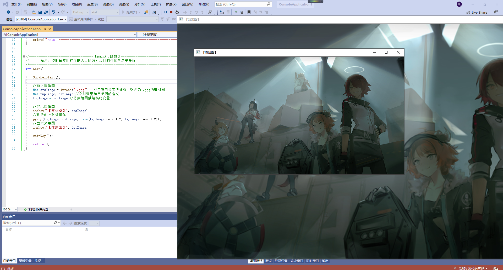

 2. 采样: pyrDown()函数
   
        pyrDown(函数的作用是向下采样并模糊一张图片， 说白了就是缩小-张图片。

 - 代码和运行演示
 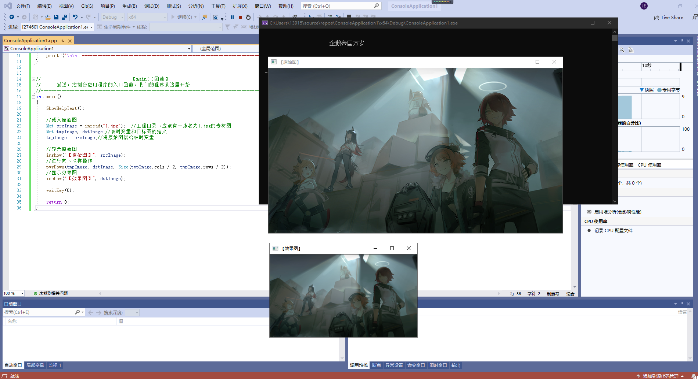

 #### 6.6.7 综合示例:图像金'字塔与图片尺寸缩放

 - 代码和运行演示
 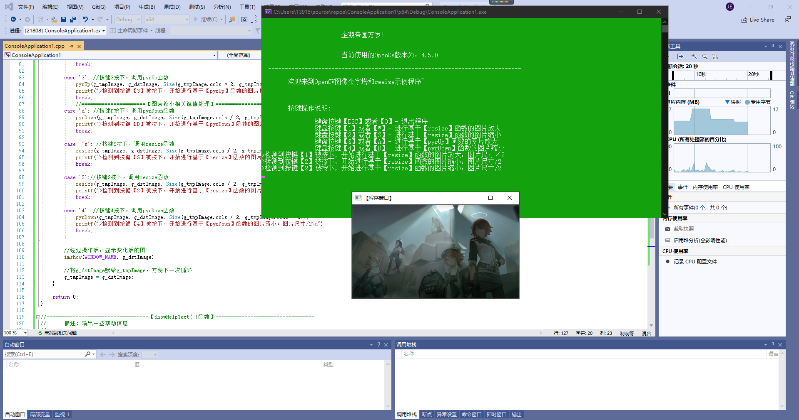

 ### 6.7 阈值化
 
 #### 6.7.1 固定阈值操作: Threshold()函数

 - 函数Threshold())对单通道数组应用固定阈值操作。该函数的典型应用是对灰度图像进行阈值操作得到二值图像，(compare()函数也可以达到此目的)或者是去掉噪声，例如过滤很小或很大象素值的图像点。

 #### 6.7.2 自适应阈值操作: adaptiveThreshold()函数

 - adaptiveThreshold()函数的作用是对矩阵采用自适应阈值操作，支持就地操作。
 
 #### 6.7.3 示例程序:基本阀值操作

 - 代码和运行演示
 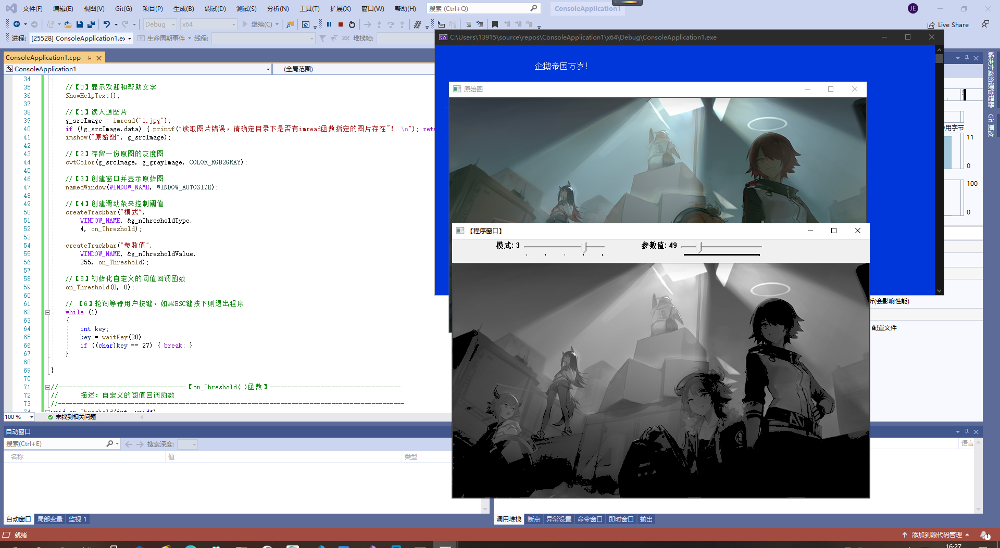

# ch_7 图像变换

 ### 7.1 基于OpenCV的边缘检测

 #### 7.1.1 边缘检测的一般步骤

 1. 滤波

 2. 增强
 
 3. 检测

 #### 7.1.2 canny 算子

 - Canny边缘检测算子是John F.Canny 于1986 年开发出来的-一个多级边缘检测算法。更为重要的是，Canny 创立了边缘检测计算理论(Computational theory of edge detection), 解释了这项技术是如何工作的。Canny 边缘检测算法以Canny的名字命名，被很多人推崇为当今最优的边缘检测的算法。

 - 最优边缘检测三个主要评价标准：
   
        低错误率:标识出尽可能多的实际边缘，同时尽可能地减少噪声产生的误报
    
        高定位性:标识出的边缘要与图像中的实际边缘尽可能接近。
 
        最小响应:图像中的边缘只能标识一次，并且可能存在的图像噪声不应标识为边缘。

 - 示例程序: Canny 边缘检测
 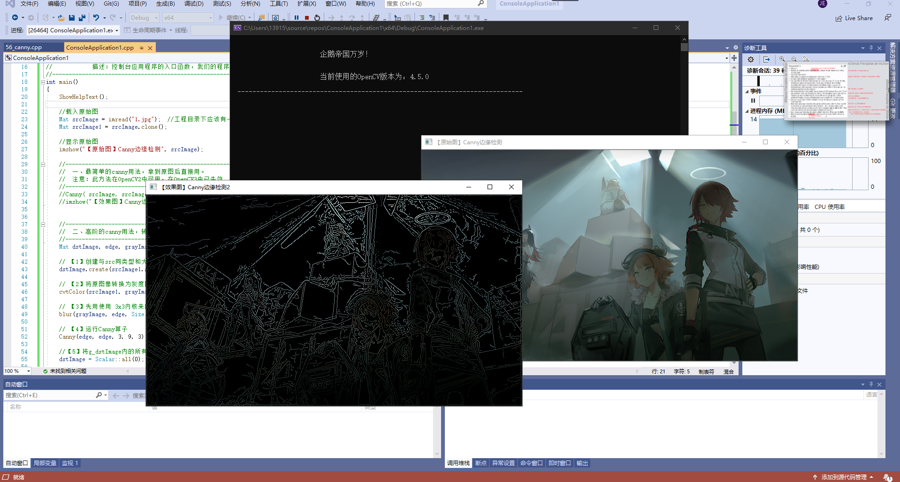

 #### 7.1.3 sobel 算子

 - Sobel算子是一个主要用于边缘检测的离散微分算子(discrete differentiation operator)。它结合了高斯平滑和微分求导，用来计算图像灰度函数的近似梯度。在图像的任何一点使用此算子，都将会产生对应的梯度矢量或是其法矢量。

 - 示例程序: Sobel 算子的使用
 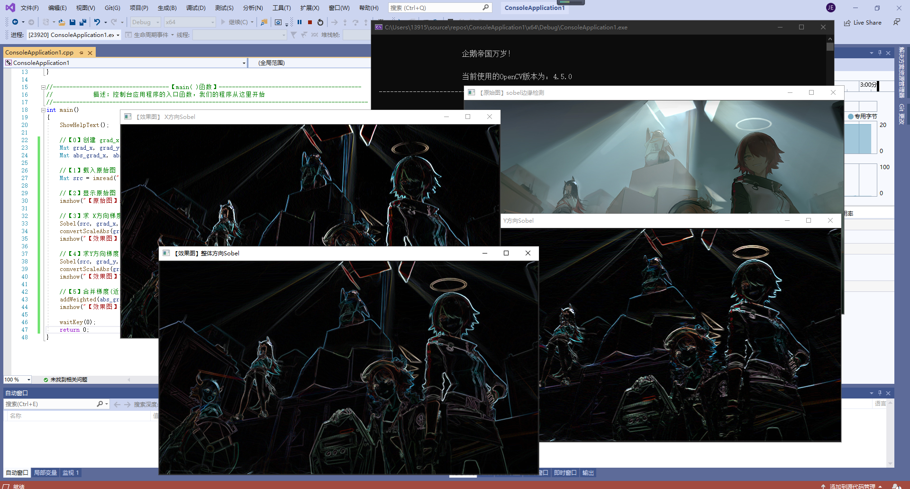

 #### 7.1.4 Laplacian 算子

 - Laplacian算子是n维欧几里德空间中的一个二阶微分算子，定义为梯度grad的散度div。因此如果f是二阶可微的实函数，则f的拉普拉斯算子定义如下。

       (1)f的拉普拉斯算子也是笛卡儿坐标系xi中的所有非混合二阶偏导数求和。

       (2)作为一个二阶微分算子，拉普拉斯算子把C函数映射到C函数。对于k≥2，表达式(1) (或(2)定义了一个算子△: C(R)- +C(R)。

 - 示例程序: Laplacian 算子的使用
 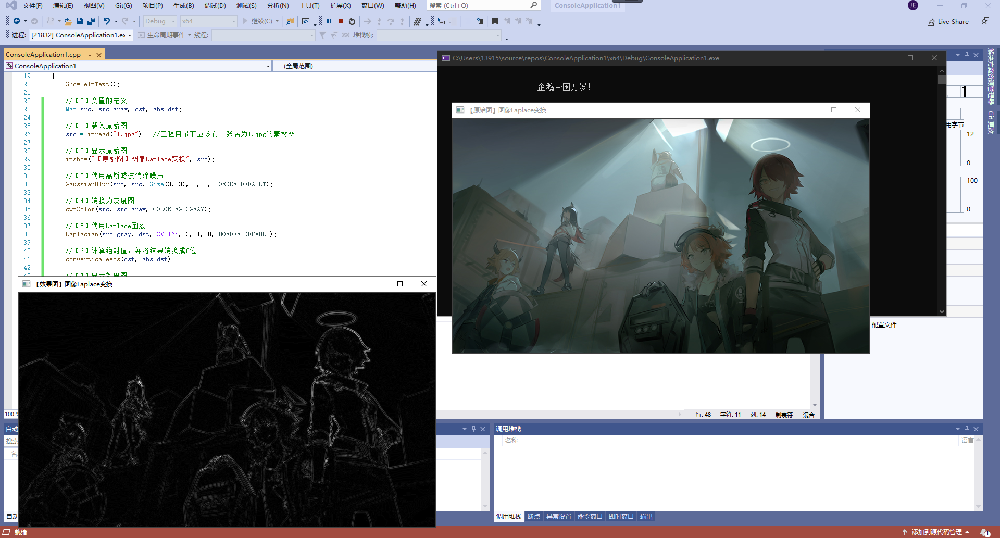

 #### 7.1.5 scharr 滤波器

 - 计算图像差分: Scharr()函数使用Scharr滤波器运算符计算x或y方向的图像差分。其实它的参数变量和Sobel基本上是一样的， 除了没有ksize核的大小。

 - 示例程序: Scharr 滤波器
 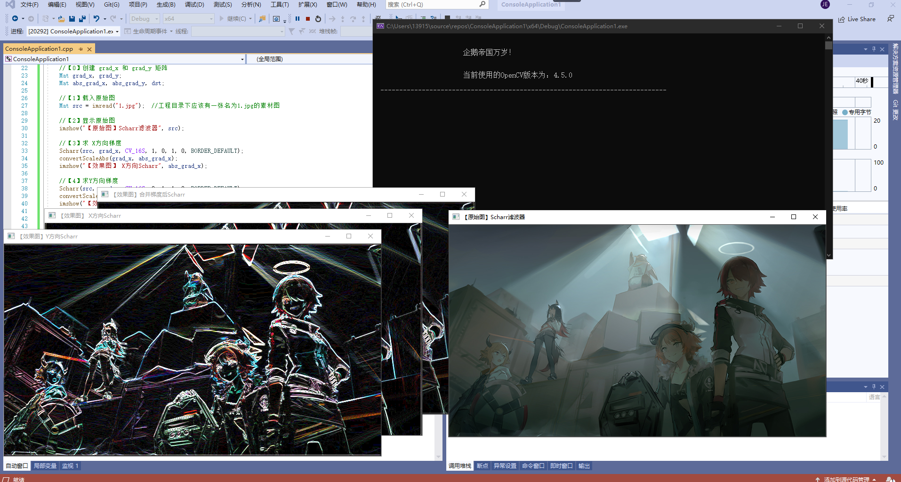

 #### 7.1.6 综合示例:边缘检测

 - 代码和运行演示
 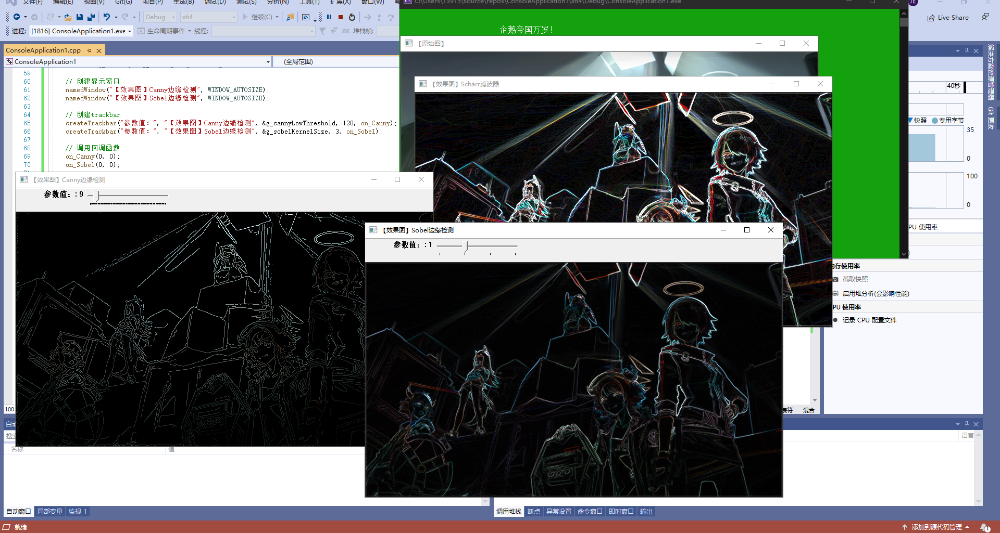

 ### 7.2 霍夫变换

 #### 7.2.1 霍夫变换概述

 - 霍夫变换(Hough Transform)是图像处理中的一种特 征提取技术，该过程在一个参数空间中通过计算累计结果的局部最大值得到一个符合该特定形状的集合作为霍夫变换结果。

 #### 7.2.2 OpenCV中的霍夫线变换

 - 总结一下，OpenCV中的霍夫线变换有如下三种:

        1)标准霍夫变换(StandardHough Transform, SHT),由HoughLines函数调用。

        2)多尺度霍夫变换(Multi-ScaleHough Transform, MSHT)，由HoughLines函数调用。

        3)累计概率霍夫变换( ProgressiveProbabilistie Hough Transform, PPHT)， 由HoughLinesP函数调用。

 #### 7.2.3 霍夫线变换的原理

 - 一般来说，一条直线能够通过在平面θ-r寻找交于一点的曲线数量来检测。而越多曲线交于一点也就意味着这个交点表示的直线由更多的点组成。一般来说我们可以通过设置直线上点的阅值来定义多少条曲线交于一点，这样才认为检测到了一条直线。

 #### 7.2.4 标准霍夫变换: HoughLines()函数

 - 此函数可以找出采用标准霍夫变换的二值图像线条。在OpenCV中，我们可以用其来调用标准霍夫变换SHT和多尺度霍夫变换MSHT的OpenCV内建算法。

        C++: void HoughLines (InputArray image, OutputArray lines, double rho,double theta, int threshold, double srn=0， double stn=0 )

 - HoughLines 函数用法示例
 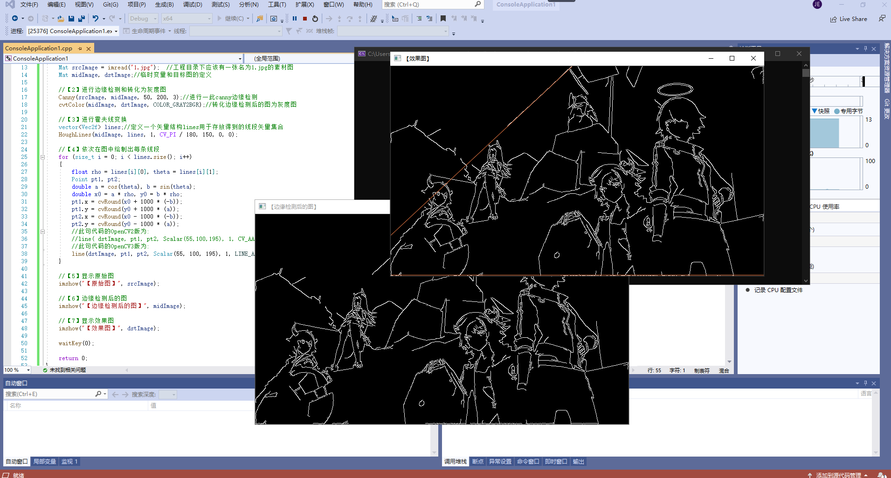

 #### 7.2.5 累计概率霍夫变换: HoughLinesP()函数

  - 此函数在HoughLines的基础上，在末尾加了一个代表Probabilistic (概率)的P，表明它可以采用累计概率霍夫变换(PPHT)来找出二值图像中的直线。

        C++: void HoughLinesP (InputArray image, outputArray lines, double rho,double theta， int threshold， double minLineLength-0, doublemaxLineGap-0 )

 - HoughLinesP 函数用法示例
 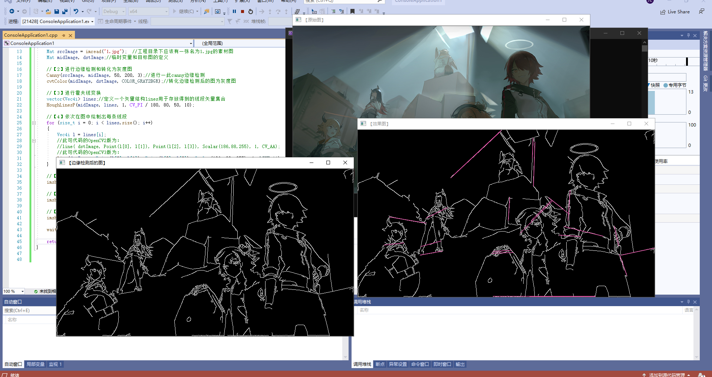

 #### 7.2.6 霍夫圆变换
 
 - 霍夫圆变换的基本原理和上面讲的霍夫线变化大体上是很类似的，只是点对应的二维极径极角空间被三维的圆心点x、y和半径r空间取代。说“大体上类似’的原因是，如果完全用相同的方法的话，累加平面会被三维的累加容器所代替一在这三维中，一维是x，一维是y，另外一维是圆的半径r。这就意味着需要大量的内存而且执行效率会很低，速度会很慢。

 #### 7.2.7 霍夫梯度法的原理
 
 - 霍夫梯度法的原理是这样的:

        (1)首先对图像应用边缘检测，比如用canny边缘检测。
        
        (2)然后，对边缘图像中的每一个非零点，考虑其局部梯度，即用Sobel()函数计算x和y方向的Sobel一阶 导数得到梯度。
    
        (3)利用得到的梯度，由斜率指定的直线上的每一个点都在累加器中被累加，这里的斜率是从一个指定的最小值到指定的最大值的距离。

        (4)同时，标记边缘图像中每一个非0像素的位置。

        (5)然后从二维累加器中这些点中选择候选的中心，这些中心都大于给定阀值并且大于其所有近邻。这些候选的中心按照累加值降序排列，以便于最支持像素的中心首先出现。

        (6)接下来对每一个中心，考虑所有的非0像素。

        (7)这些像素按照其与中心的距离排序。从到最大半径的最小距离算起，选择非0像素最支持的一 条半径。

        (8)如果一个中心收到边缘图像非0像素最充分的支持，并且到前期被选择的中心有足够的距离，那么它就会被保留下来。

 #### 7.2.9 霍夫圆变换: HoughCircles()函数

 - HoughCircles函数可以利用霍夫变换算法检测出灰度图中的圆。它相比之前的HoughLines和HoughLinesP,比较明显的一个区别是不需要源图是二值的，而HoughLines和HoughLinesP都需要源图为二值图像。

       C++: void HoughCircles (InputArray image, outputArray circles, int method,double dp, double minDist， double paraml-100, double param2-100， intminRadius=0，int maxRadius=0 )

 - HoughCircles函数用法示例
 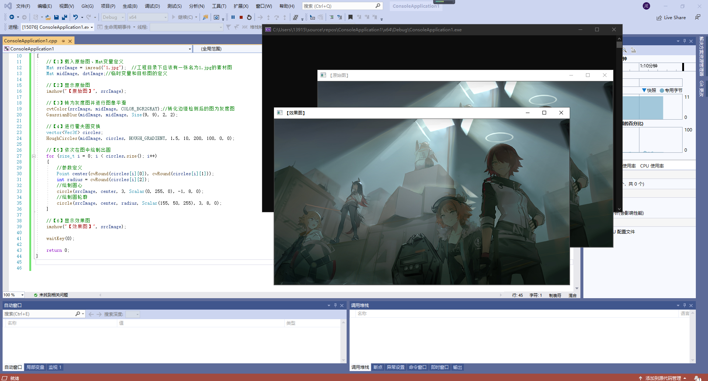

 #### 7.2.10 综合示例:霍夫变换
 
 - 代码和运行演示
 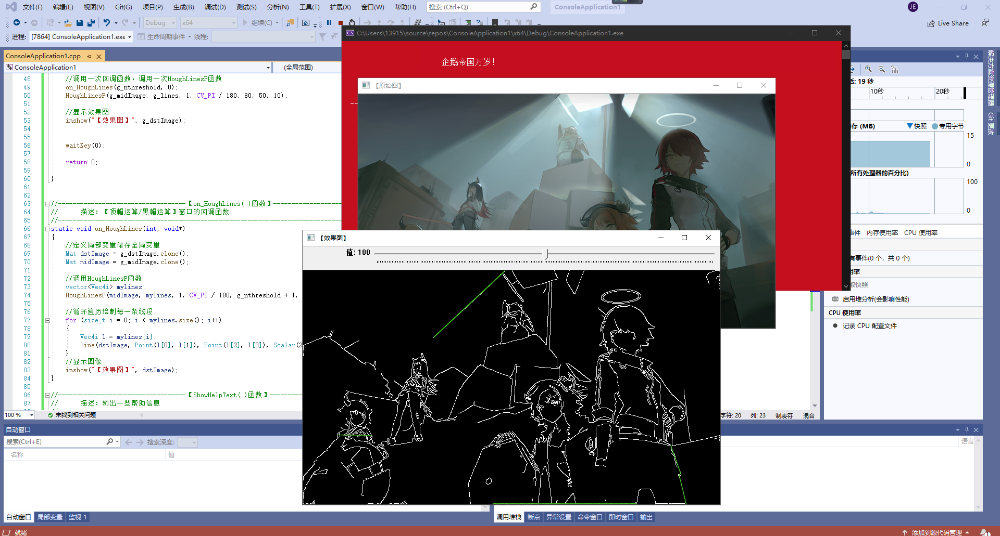

 ### 7.3 重映射

 #### 7.3.1 重映射的概念

 - 重映射，就是把一幅图像中某位置的像素放置到另一个图片指定位置的过程。为了完成映射过程，需要获得一些插值为非整数像素的坐标，因为源图像与目标图像的像素坐标不是一一对应的。一般情况下，我们通过重映射来表达每个像素的位置。

 #### 7.3.2 实现重映射: remap()函數

 - remap()函数会根据指定的映射形式，将源图像进行重映射几何变换，基于的公式如下:

      ***dst(xy)=sre(map>(cxy).map(xv))***

 - 需要注意，此函数不支持就地(in-place) 操作。看看其原型和参数。

       C+: void remap (InputArray src, OoutputArraydst, InputArray mapl, InputArray map2，int interpolation， intborde rMode-BORDER_ CONSTANT,const Scalar& borderValue-Scalar() )

 #### 7.3.3 基础示例程序:基本重映射
 
 - 代码和运行演示
 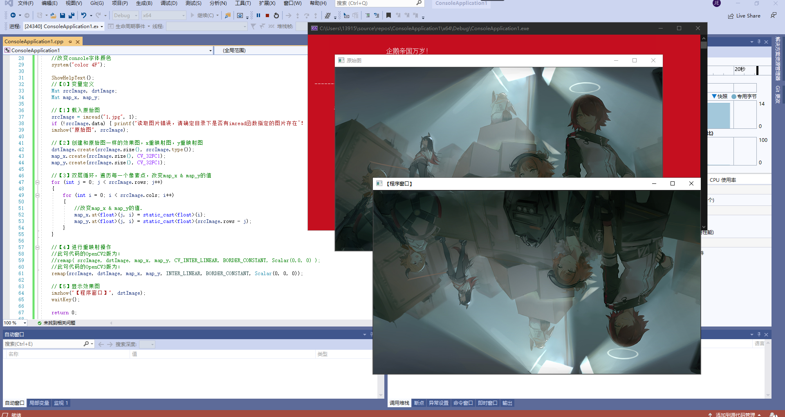

 #### 7.3.4 综合示例程序:实现多种重映射

 - 代码和运行演示
 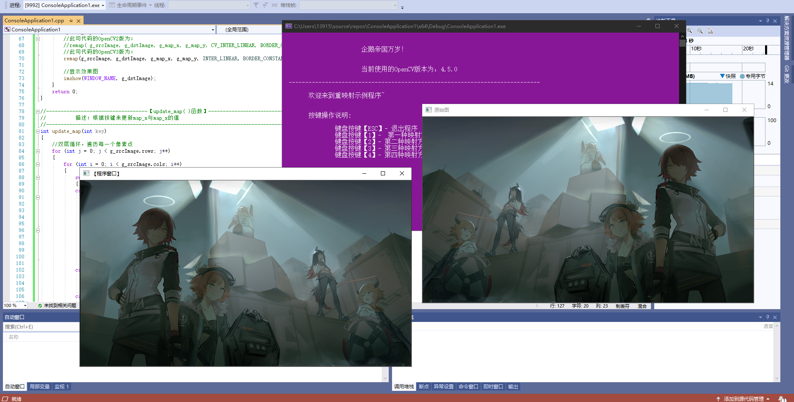

 ### 7.4 仿射变换

 #### 7.4.1 认识仿射变换

 - 仿射变换(Afine Transformation或Affine Map)，又称仿射映射，是指在几何中，一个向量空间进行一次线性变换并接上一个平移，变换为另一个向量空间的过程。它保持了二维图形的“平直性”(直线经过变换之后依然是直线)和“平行性”(二维图形之间的相对位置关系保持不变，平行线依然是平行线，且直线上点的位置顺序不变)。

 #### 7.4.2 仿射变换的求法

 - 仿射变换表示的就是两幅图片之间的一种联系， 关于这种联系的信息大致可从以下两种场景获得。

        1)已知X和T，而且已知它们是有联系的。接下来的工作就是求出矩阵M。

        2)已知M和X，想求得T.只要应用算式T=M. X即可。对于这种联系的信息可以用矩阵M清晰地表达(即给出明确的2x3矩阵),也可以用两幅图片点之间几何关系来表达。

 #### 7.4.3 进行仿射变换: warpAffine() 函数

 - warpAffine函数的作用是依据以下公式子，对图像做仿射变换。

 ***dst (x,y)-src (M1x+ M:2y+ Mu3。M:1x+ Mzzy+ M23)***

 - 函数原型如下:
  
        C++: void warpAffine (InputArray src, OutputArray dst, InputArray M，Sizedsize，int flags=INTER_ LINEAR，intborderMode=BORDER_ CONSTANT， constScalar& bordervalue=Scalar()

 #### 7.4.4 计算二维旋转变换矩阵: getRotationMatrix2D() 函数

 - getRotationMatrix2D() 函数用于计算二维旋转变换矩阵。变换会将旋转中心映射到它自身。
  
        C++: Mat getRotationMatrix2D (Point2fcenter, double angle, double scale)

 - 第一个参数，Point2f类型的center, 表示源图像的旋转中心。

 - 第二个参数，double类型的angle, 旋转角度。角度为正值表示向逆时针旋转(坐标原点是左上角)。

 - 第三个参数，double类型的scale, 缩放系数。

 #### 7.4.5 示例程序:仿射变换

 - 代码和运行演示
 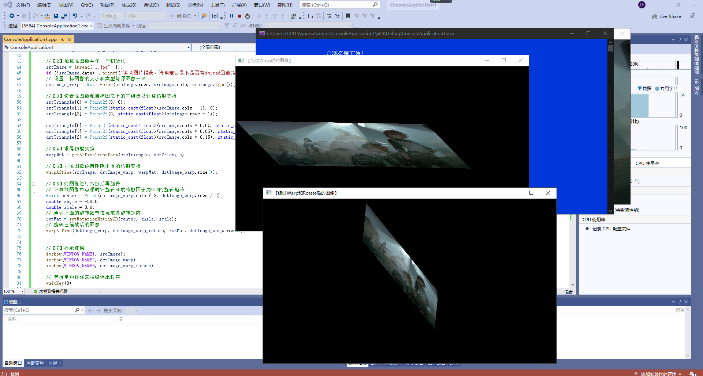

 ### 7.5 直方图均衡化

 #### 7.5.1 直方图均衡化的概念和特点

 - 直方图均衡化是灰度变换的一个重要应用，它高效且易于实现，广泛应用于图像增强处理中。图像的像素灰度变化是随机的，直方图的图形高低不齐，直方图均衡化就是用一定的算法使直方图大致平和的方法。
 
 #### 7.5.2 实现直方图均衡化: equalizeHist() 函数

 - 在OpenCV中，直方图均衡化的功能实现equalizeHist图数完成。我们一起看看它的函数描述。

        C++: void equalizeHist (InputArray src, outputArray dst)
 
 1. 第一个参数，Inputrray类型的sre, 输入图像，即源图像，填Mat类的对象即可，需为8位单通道的图像。

 2. 第二个参数，Ouputrray类型的dst, 函数调用后的运算结果存在这里，需和源图片有一样的尺寸和类型。

 #### 7.5.3 示例程序:直方图均衡化

 - 代码和运行演示
 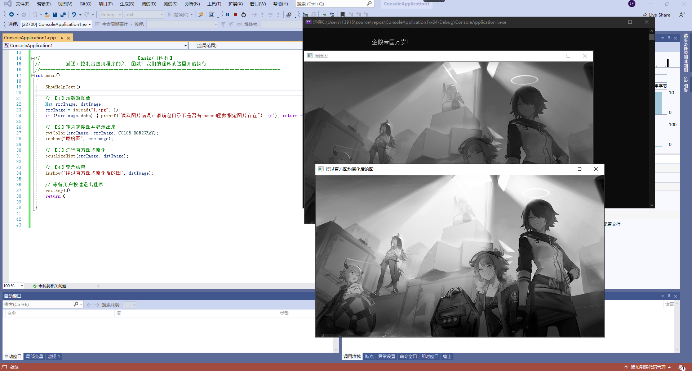

# ch_8 图像轮廓与图像分割修复

 ### 8.1 查找并绘制轮廓

 #### 8.1.1 寻找轮廓: findContours() 函数

 - findContours()函数用于在二值图像中寻找轮廓。

        C++: void findContours (InputOutputArray image, OutputArrayOfArrays .contours, OutputArray hierarchy, int mode, int method, Pointoffset=Point ())

 #### 8.1.2 绘制轮廓: drawContours()函数

 - drawContours()函数用于在图像中绘制外部或内部轮廓。

        C++: void drawContours (InputoutputArray image, InputArrayOfArrayscontours, int contourIdx， const Scalar& color, int thickness-l， intlineType-8, InputArray hierarchy-noArray(), int maxLevel-INT_ MAX, Pointoffset=Point())

 #### 8.1.3 基础示例程序:轮廓查找

 - 代码和运行演示
 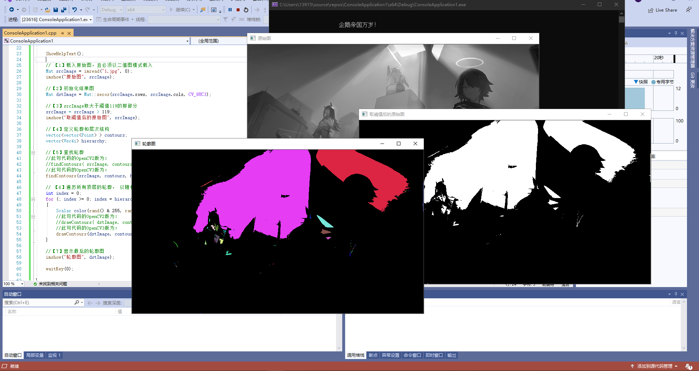

 #### 8.1.4 综合示例程序:查找并绘制轮廓

 - 代码和运行演示
 

 ### 8.2 寻找物体的凸包

 #### 8.2.1 凸包

 - 凸包(Convex Hull)是一-个计算几何(图形学)中常见的概念。简单来说，给定二维平面上的点集，凸包就是将最外层的点连接起来构成的凸多边型，它是能包含点集中所有点的。理解物体形状或轮廓的一种比较有用的方法便是计算一个物体的凸包，然后计算其凸缺陷(convexity defects)。很多复杂物体的特性能很好地被这种缺陷表现出来。

 #### 8.2.2 寻找凸包: convexHull() 函数

 - 上文已经提到过，convexHull()函 数用于寻找图像点集中的凸包，其原型声明如下。
  
        C++: void convexHull (InputArray points, OutputArray hull, boolclockwise-false, bool returnPoints=true )

 #### 8.2.3 基础示例程序:凸包检测基础

 - 代码和运行演示
 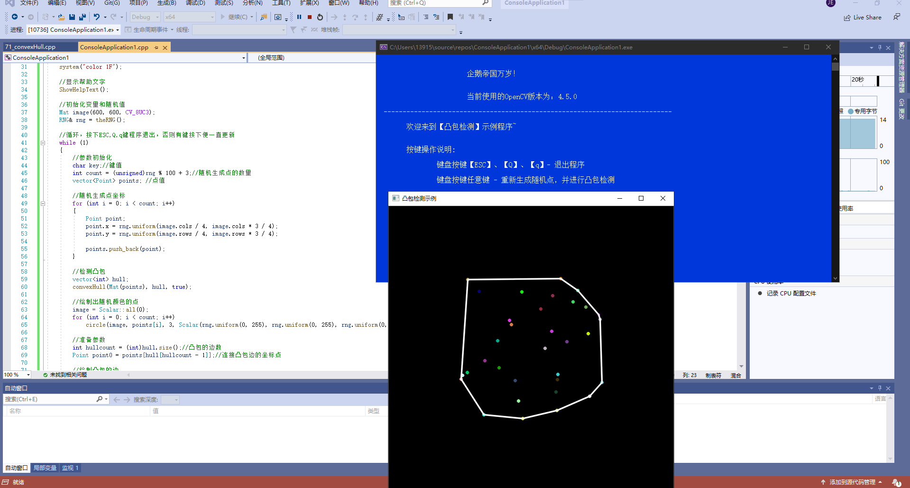

 #### 8.2.4 综合示例程序:寻找和绘制物体的凸包

 - 代码和运行演示
 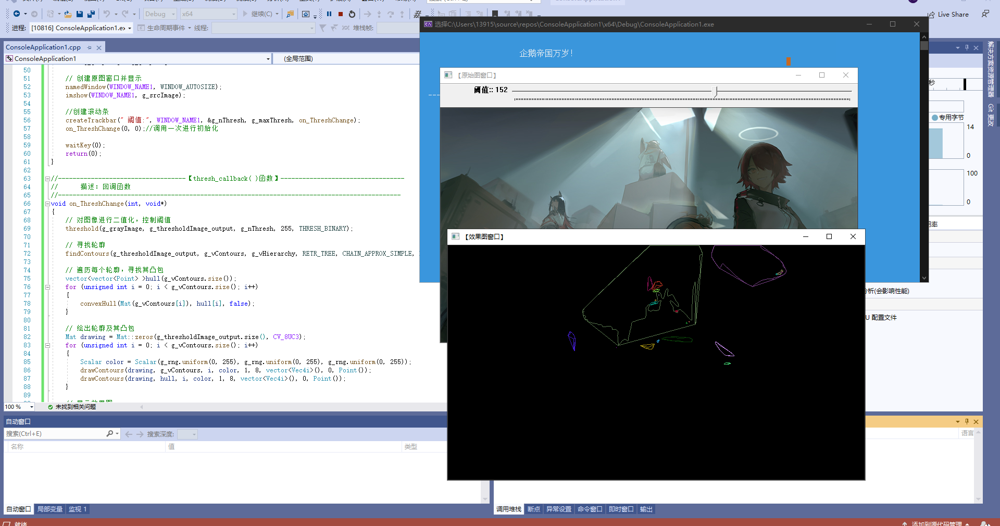

 ### 8.3 使用多边形将轮廓包围

 #### 8.3.1 返回外部矩形边界: boundingRect() 函数

 - 此函数计算并返回指定点集最外面(up-right) 的矩形边界。

 #### 8.3.2 寻找最小包围矩形: minAreaRect() 函数

 - 此函数用于对给定的2D点集，寻找可旋转的最小面积的包围矩形。

 #### 8.3.3 寻找最小包围圆形: minEnclosingCircle() 函数

 - minEnclosingCircle函数的功能是利用一种迭代算法， 对给定的2D点集，去寻找面积最小的可包围它们的圆形。

 #### 8.3.4 用椭圆拟合二维点集: ftllipse() 函数

 - 此函数的作用是用椭圆拟合二维点集。

 #### 8.3.5 逼近多边形曲线: approxPolyDP() 函数

 - approxPolyDP函数的作用是用指定精度過近多边形曲线。

 #### 8.3.6 基础示例程序:创建包围轮廓的矩形边界

 - 代码和运行演示
 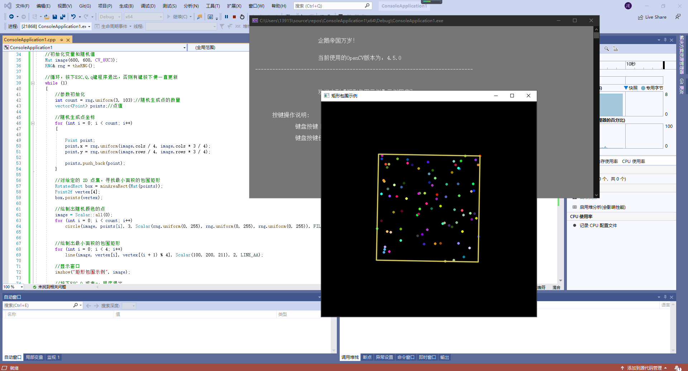

 #### 8.3.7 基础示例程序:创建包围轮廓的圆形边界

 - 代码和运行演示
 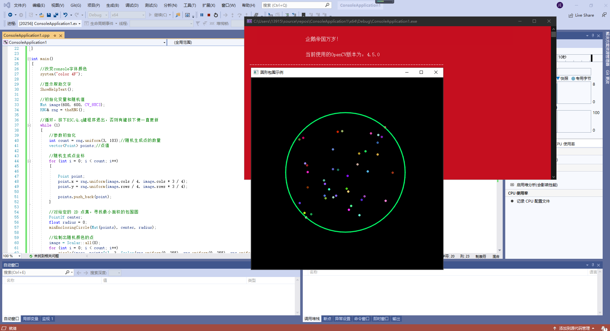

 #### 8.3.8 综合示例程序:使用多边形包围轮廓

 - 代码和运行演示
 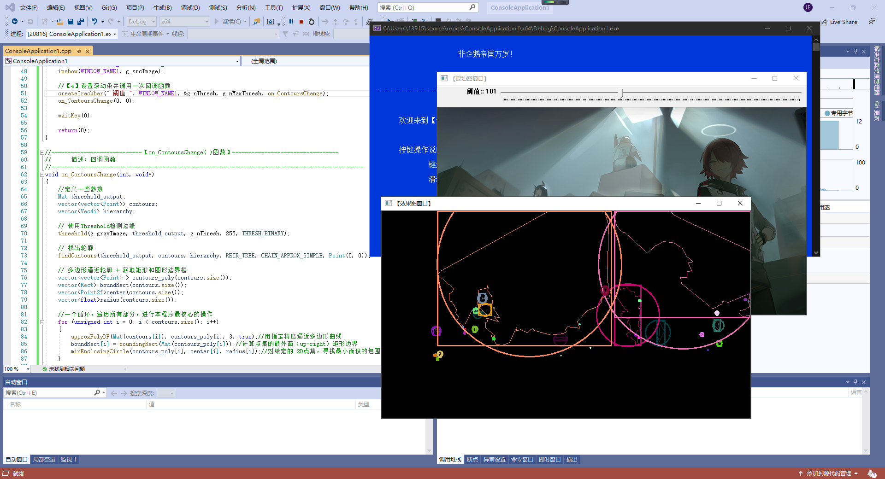

 ### 8.4 图像的矩

 #### 8.4.1 矩的计算: moments() 函数

 - moments()函数用于计算多边形和光栅形状的最高达三阶的所有矩。矩用来计算形状的重心、面积，主轴和其他形状特征，如7Hu不变量等。

 #### 8.4.2 计算轮廓面积: contourArea() 函数

 - contourArea()函数用于计算整个轮廓或部分轮廓的面积

 #### 8.4.3 计算轮廓长度: areLength() 函数

 - arcL ength()函数用于计算封闭轮廓的周长或曲线的长度。

 #### 8.4.4 综合示例程序:查找和绘制图像轮廓矩

 - 代码和运行演示
 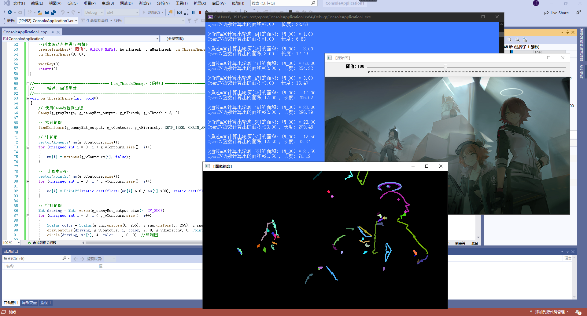

 ### 8.5 分水岭算法

 #### 8.5.1 实现分水岭算法: watershed() 函数

 - 函数watershed实现的分水岭算法是基于标记的分割算法中的一种。在把图像传给函数之前，我们需要大致勾画标记出图像中的期望进行分割的区域，它们被标记为正指数。所以，每一个区域都会被标记为像素值1.2、3等，表示成为一个或者多个连接组件。这些标记的值可以使用findContours()函数和drawContours()函数由二进制的掩码检索出来。不难理解，这些标记就是即将绘制出来的分割区域的“种子”，而没有标记清楚的区域，被置为0。在函数输出中，每一个标记中的像素被设置为“种子”的值，而区域间的值被设置为-1。

 #### 8.5.2 综合示例程序:分水岭算法

 - 代码和运行演示
 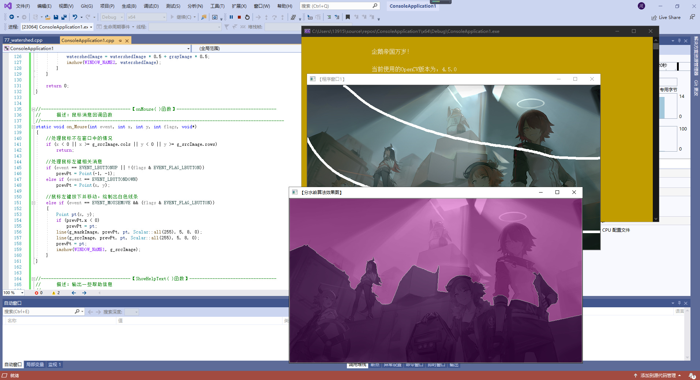

 ### 8.6 图像修补

 #### 8.6.1 实现图像修补: inpaint() 函数

 - 在新版OpenCV中，图像修补技术由inpaint丽数实现，它可以用来从扫描的照片中清除灰尘和划痕，或者从静态图像或视频中去除不需要的物体。其原型声明如下。

        C++: void inpaint (InputArray src, InputArray inpaintMask, outputArraydst, double inpaintRadius, int flags)

 #### 8.6.2 综合示例程序:图像修补

 - 代码和运行演示
 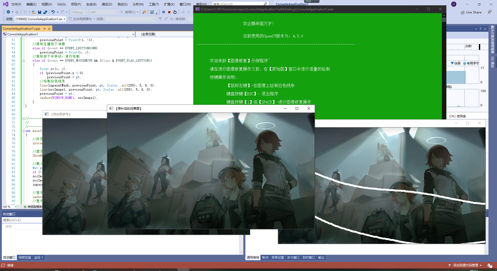

 # ch_9 直方图与匹配

 ### 9.1 图像直方图概述

 - 直方图广泛运用于很多计算机视觉运用当中，通过标记帧与帧之间显著的边缘和颜色的统计变化，来检测视频中场景的变化。在每个兴趣点设置-一个有相近特征的直方图所构成“标签”，用以确定图像中的兴趣点。边缘、色彩、角度等直方图构成了可以被传递给目标识别分类器的一-个通用特征类型。色彩和边缘的直方图序列还可以用来识别网络视频是否被复制。
  
 ### 9.2 直方图的计算与绘制
 
 #### 9.2.1 计算直方图: calcHist() 函数

 - 在OpenCV中，calcHist()函数用 于计算一个或者多个阵列的直方图。

 #### 9.2.2 找寻最值: minMaxLoc() 函数

 - minMaxLoc()函数的作用是在数组中找到全局最小值和最大值。

 #### 9.2.3 示例程序:绘制H-S直方图

 - 代码和运行演示
 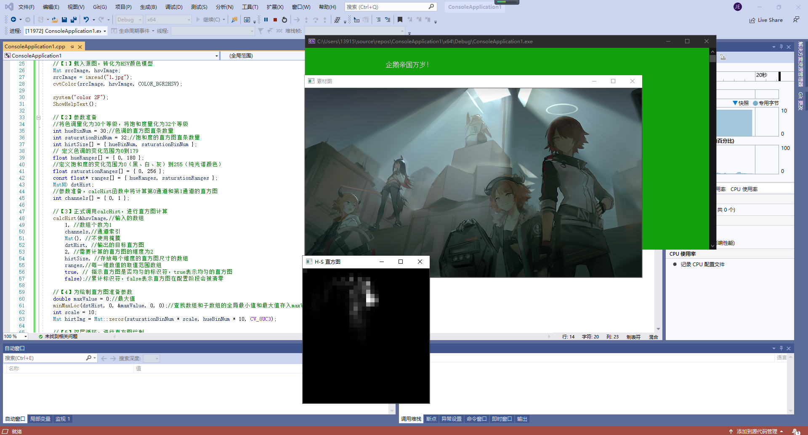

 #### 9.2.4 示例程序:计算并绘制图像一维直方图

 - 代码和运行演示
 

 #### 9.2.5 示例程序:绘制RGB三色直方图
 
 - 代码和运行演示
 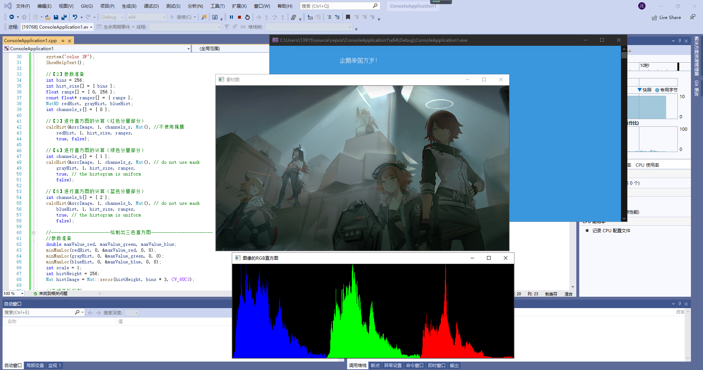

 ### 9.3 直方图对比

 #### 9.3.1 对比直方图: compareHist() 函数

 - compareHist()函数用于对两幅直方图进行比较。

 #### 9.3.2 示例程序:直方图对比

 - 代码和运行演示
 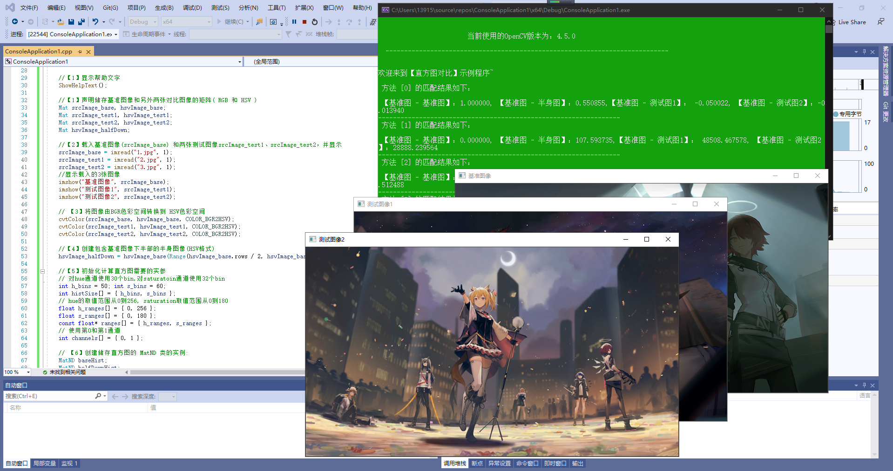

 ### 9.4 反向投影

 #### 9.4.1 引言

 - 而反向投影(back projection)就是一种记录给定图像中的像素点如何适应直方图模型像素分布方式的一种方法。简单的讲，所谓反向投影就是首先计算某一特征的直方图模型，然后使用模型去寻找图像中存在的该特征的方法。

 #### 9.4.2 反向投影的工作原理

 - 而我们要做的，就是使用模型直方图(代表手掌的皮肤色调)来检测测试图像中的皮肤区域。以下是检测步骤。

        (1)对测试图像中的每个像素(p(j)，获取色调数据并找到该色调(hyjSu)在直方图中的bin的位置。

        (2)查询模型直方图中对应bin的数值。

        (3)将此数值储存在新的反射投影图像中。也可以先归一化直方图数值到.0-255范围，这样可以直接显示反射投影图像(单通道图像)。

        (4)通过对测试图像中的每个像素采用以上步骤，可以得到最终的反射投影图像。

 #### 9.4.3 反向投影的作用

 - 反向投影用于在输入图像(通常较大)中查找与特定图像(通常较小或者仅1个像素，以下将其称为模板图像)最匹配的点或者区域，也就是定位模板图像出现在输入图像的位置。

 #### 9.4.4 反向投影的结果

 - 反向投影的结果包含了以每个输入图像像素点为起点的直方图对比结果。可以把它看成是--个二维的浮点型数组、二维矩阵，或者单通道的浮点型图像。

 #### 9.4.5 计算反向投影: calcBackProject() 函数

 - calcBackProject()函数用于计算直方图的反向投影。

 #### 9.4.6 通道复制: mixChannels() 函数

 - 此函数由输入参数复制某通道到输出参数特定的通道中。

 #### 9.4.7 综合程序:反向投影

 - 代码和运行演示
 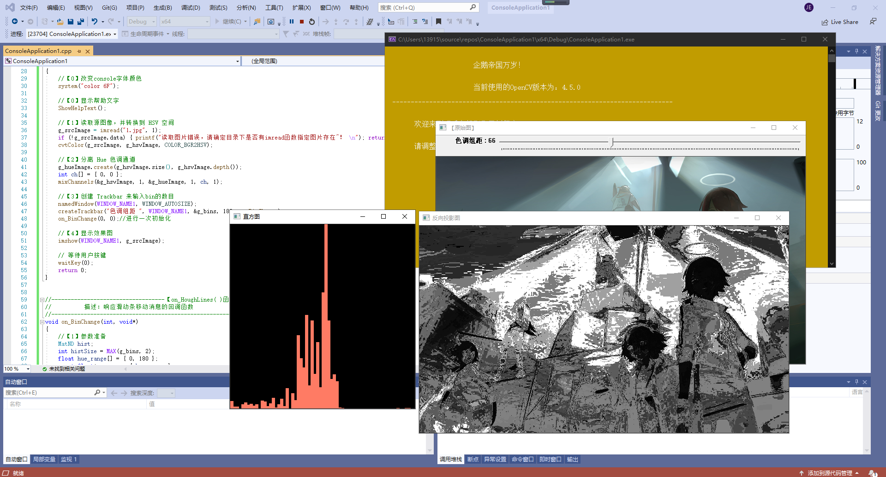

 ### 9.5 模板匹配

 #### 9.5.1 模板匹配的概念与原理

 - 模板匹配是一项在一-幅图像中寻找 与另一幅模板图像最匹配(相似)部分的技术。在OpenCV2和OpenCV3中，模板匹配由MatchTemplate()函数完成。需要注意，模板匹配不是基于直方图的，而是通过在输入图像上滑动图像块，对实际的图像块和输入图像进行匹配的一种匹配方法。

 #### 9.5.2 实现模板匹配: matchTemplate() 函数

  - matchTemplate()用于匹配出和模板重叠的图像区域。

 #### 9.5.3 综合示例:模板匹配

 - 代码和运行演示
 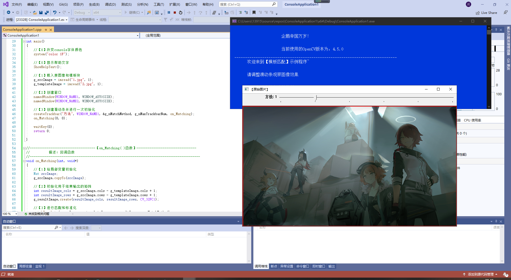

