## 线性滤波：方框滤波，均值滤波，高斯滤波

### 平滑处理

平滑处理也称模糊处理，是一种简单且使用频率很高的图像处理方法。平滑处理的用途有很多，最常见的是用来减少图像上的噪点或者失真。在涉及到降低图像分辨率时，平滑处理是非常好用的方法。

### 图像滤波还有滤波器

图像滤波的目的有两个:
1.抽出对象的特征作为图像识别的特征模式;
2.为适应图像处理的要求，消除图像数字化时所混入的噪声。

而对滤波处理的要求也有两条:
1.是不能损坏图像的轮廓及边缘等重要信息;
2.是使图像清晰视觉效果好。

平滑滤波是低频增强的空间域滤波技术，它的目的有两类:
1.模糊
2.消除噪音

滤波器的种类：（前三个是我们要学的重点）
●方框滤波一BoxBlur 函数
●均值滤波(邻域平均滤波)一Blur 函数
●高斯滤波一 GaussianBlur函数
●中值滤波一 medianBlur函数
●双边滤波一-bilateralFilter 函数

### 方框滤波( box Filter )

方框滤波被封装在一个名为boxblur的函数中，即boxblur函数的作用是使用方框滤波器来模糊一张图片， 从src输入，从dst输出。

参数详解如下。
●第一个参数，InputArray类型的src， 输入图像，即源图像，填Mat类的对象即可。该函数对通道是独立处理的，且可以处理任意通道数的图片。但需要注意，待处理的图片深度应该为CV_ 8U、CV_ 16U、 CV_ 16S、 CV_ _32F以及CV_ 64F之一。
●第二个参数，OutputArray类型的dst， 即目标图像，需要和源图片有一样的尺寸和类型。
●第三个参数，int类型的ddepth，输出图像的深度，-1代表使用原图深度,.即src.depthQ（）。
●第四个参数，Size类型(对Size类型稍后有讲解)的ksize, 内核的大小。一般用Size(w,h)来表示内核的大小，其中w为像素宽度，h为像素高度。Size (3,3)就表示3x3的核大小，Size (5,5)就表示5x5的核大小。
●第五个参数，Point类型的anchor, 表示锚点(即被平滑的那个点)。注意它有默认值Point(-1,-1)。 如果这个点坐标是负值的话，就表示取核的中心为锚点，所以默认值Point(-1,-1)表 示这个锚点在核的中心。
●第六个参数，bool 类型的normalize, 默认值为true，一个标识符，表示内核是否被其区域归一化 (normalized)了。
●第七个参数，int类型的borderType,用于推断图像外部像素的某种边界模式。有默认值BORDER_ DEFAULT,我们一般不去管它。

### 相关实验

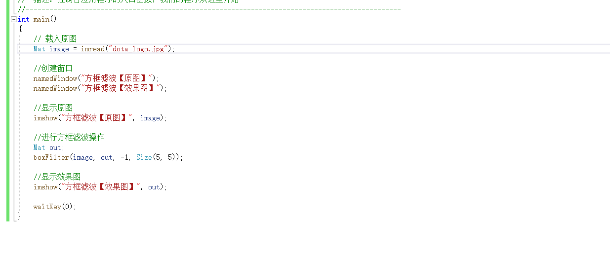

### 均值滤波（blur）

均值滤波，是最简单的一种滤波操作，输出图像的每一个像素是核窗口内输入图像对应像素的平均值(所有像素加权系数相等)，其实说白了它就是归一化后的方框滤波。我们在下文进行源码剖析时会发现，blur 函数内部中其实就是调用了一 下boxFilter。

●第一个参数，InputArray类型的sre， 输入图像，即源图像，填Mat类的对象即可。该函数对通道是独立处理的，且可以处理任意通道数的图片。但需要注意的是，待处理的图片深度应该为CV_ 8U、CV_ 16U、CV_ 16S、CV_ 32F以及CV_ _64F 之一-。
●第二个参数，OutputArray 类型的dst， 即目标图像，需要和源图片有一样的尺寸和类型。比如可以用Mat::Clone， 以源图片为模板，来初始化得到如假包换的目标图。
●第三个参数，Size类型(对Size类型稍后有讲解)的ksize， 内核的大小。一般写作Size(w,h)来表示内核的大小(其中，w为像素宽度，h为像素高度)。Size(3,3)就表示3x3的核大小，Size(5,5)就表示 5x5的核大小
●第四个参数，Point类型的anchor， 表示锚点(即被平滑的那个点)，注意它有默认值Point(-1,-1)。 如果这个点坐标是负值，就表示取核的中心为锚
点，所以默认值Point(-1,-1)表示这个锚点在核的中心。
●第五个参数，int类型的borderType, 用于推断图像外部像素的某种边界模式。有默认值BORDER_ DEFAULT,我们一般不去管它。

### 相关实验

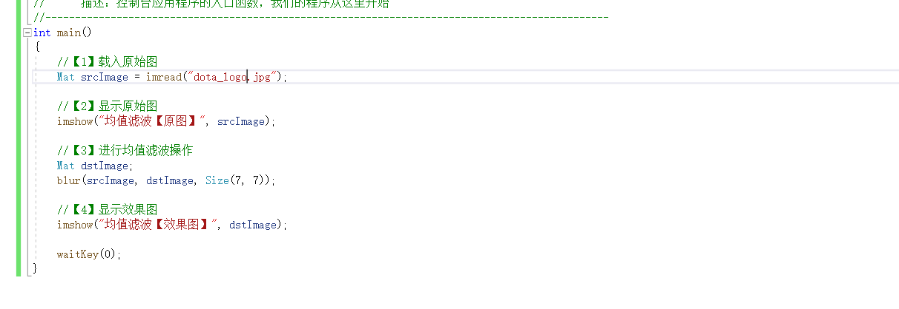

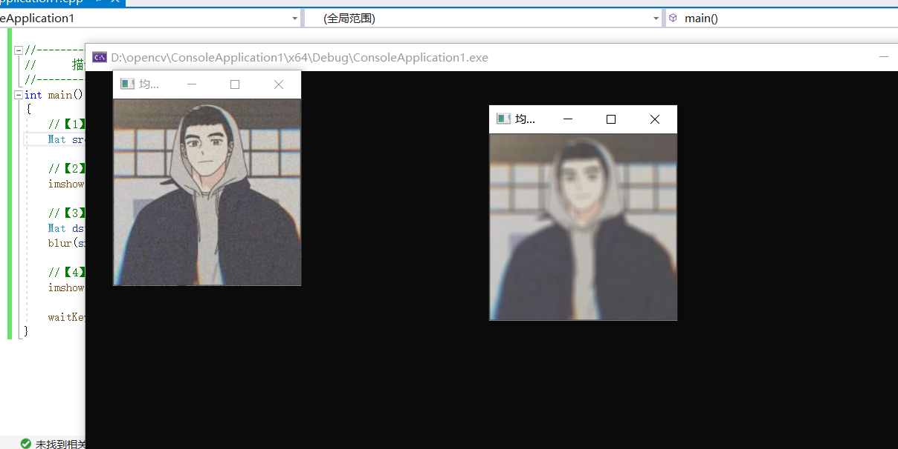

### 高斯滤波（GaussianBlur）

●第一个参数，InputArray类型的src， 输入图像，即源图像，填Mat类的对象即可。它可以是单独的任意通道数的图片，但需要注意的是，其图片深度应该为CV_ _8U、CV_ 16U、CV_ 16S、CV_ _32F以及CV_ 64F之一。
●第二个参数，OutputArray 类型的dst， 即目标图像，需要和源图片有一样的尺寸和类型。比如可以用Mat:Clone， 以源图片为模板，来初始化得到如假包换的目标图。
●第三个参数，Size 类型的ksize 高斯内核的大小。其中ksize.width 和ksize.height可以不同,但它们都必须为正数和奇数,或者是零,这都由sigma计算而来。
●第四个参数，double类型的sigmaX, 表示高斯核函数在X方向的的标准偏差。
●第五个参数，double类型的sigmaY,表示高斯核函数在Y方向的的标准偏差。若sigmaY为零，就将它设为sigmaX;如果sigmaX和sigmaY都是0,那么就由ksize.width和ksize.height 计算出来。为了结果的正确性着想，最好是把第三个参数Size、第四个参数sigmaX和第五个参数sigmaY全部指定到。
●第六个参数，int类型的borderType， 用于推断图像外部像素的某种边界模式。有默认值BORDER_ DEFAULT,我们一般不去管它。

### 相关实验

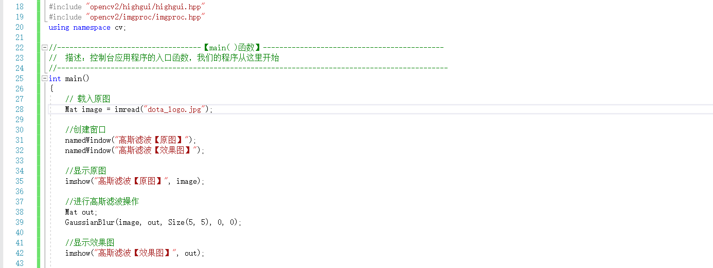

### 图像线性滤波综合示例

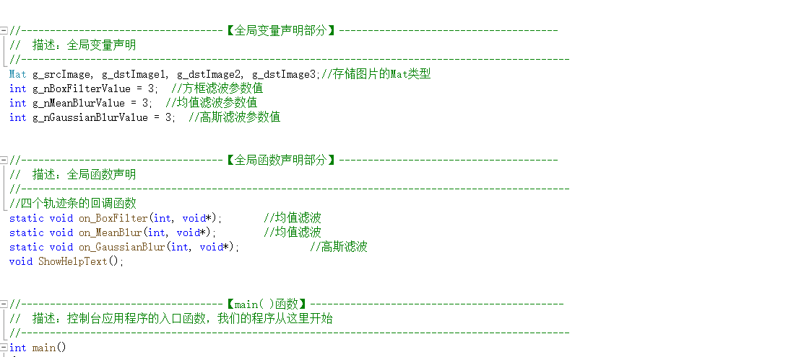

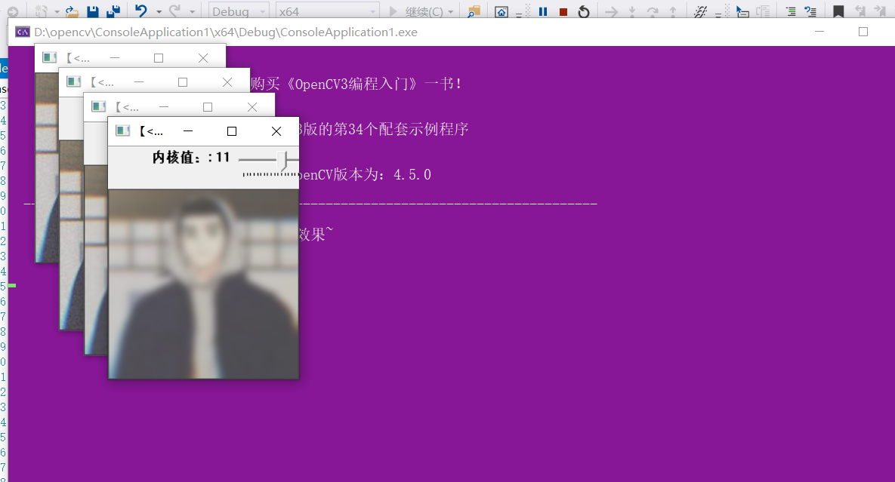

#### 以上便是我们对线性滤波的学习，接下来我们会学习到非线性滤波中的俩大类

非线性滤波和线性滤波的区别：线性滤波器的原始数据与滤波结果是一种算术运算，即用加减乘除等运算实现，如均值滤波器（模板内像素灰度值的平均值）、高斯滤波器（高斯加权平均值）等。由于线性滤波器是算术运算，有固定的模板，因此滤波器的转移函数是可以确定并且是唯一的（转移函数即模板的傅里叶变换）。
非线性滤波器的原始数据与滤波结果是一种逻辑关系，即用逻辑运算实现，如最大值滤波器、最小值滤波器、中值滤波器等，是通过比较一定邻域内的灰度值大小来实现的，没有固定的模板，因而也就没有特定的转移函数（因为没有模板作傅里叶变换），另外，膨胀和腐蚀也是通过最大值、最小值滤波器实现的。

## 非线性滤波：中值滤波，双边滤波

### 中值滤波

中值滤波是一种典型的非线性滤波技术，基本思想是用像素点邻域灰度值的中值来代替该像素点的灰度值，该方法在去除脉冲噪声、椒盐噪声的同时又能保留图像的边缘细节。

●中值滤波与均值滤波器比较：
优势:在均值滤波器中，由于噪声成分被放入平均计算中，所以输出受到了噪声的影响。但是在中值滤波器中，由于噪声成分很难选上，所以几乎不会影响到输出。因此同样用3x3区域进行处理，中值滤波消除的噪声能力更胜一筹。中值滤波无论是在消除噪声还是保存边缘方面都是-一个不错的方法。
劣势:中值滤波花费的时间是均值滤波的5倍以上。

### 相关实验

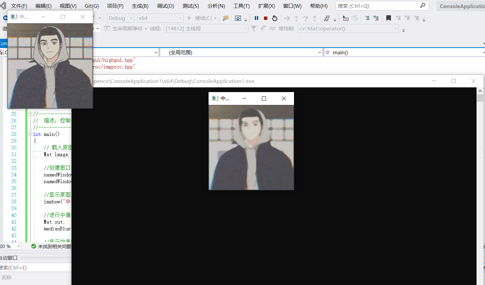

### 双边滤波

双边滤波( Bilateral filter) 是一种 非线性的滤波方法，是结合图像的空间邻近度和像素值相似度的一种折中处理，同时考虑空域信息和灰度相似性，达到保边去噪的目的，具有简单、非迭代、局部的特点。双边滤波器的好处是可以做边缘保存(edge preserving)。 以往常用维纳滤波或者高斯滤波去降噪，但二者都会较明显地模糊边缘，对于高频细节的保护效果并不明显。双边滤波器顾名思义，比高斯滤波多了一个高斯方差sigma-d,它是基于空间分布的高斯滤波函数，所以在边缘附近，离得较远的像素不会对边缘上的像素值影响太多，这样就保证了边缘附近像素值的保存。但是，由于保存了过多的高频信息，对于彩色图像里的高频噪声，双边滤波器不能够干净地滤掉，只能对于低频信息进行较好地滤波。

### 相关实验

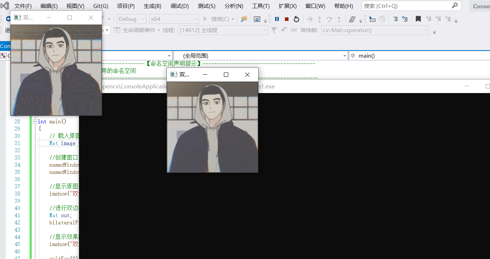

### 五种图像滤波综合示例

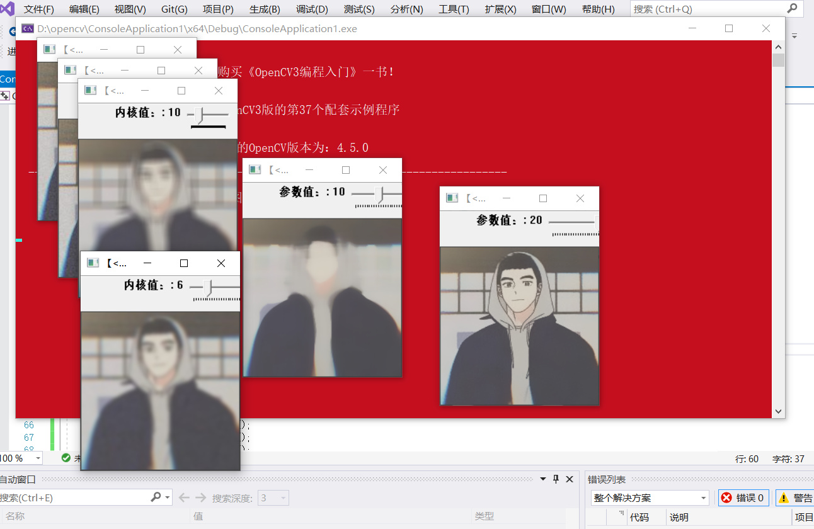

## 形态学滤波：腐蚀与膨胀

膨胀与腐蚀能实现多种多样的功能，主要如下：
●消除噪声;
●分割(isolate) 出独立的图像元素，在图像中连接(join) 相邻的元素;
●寻找图像中的明显的极大值区域或极小值区域;
●求出图像的梯度。

### 什么是“膨胀”

膨胀(dilate)就是求局部最大值的操作。从数学角度来说，膨胀或者腐蚀操作就是将图像(或图像的一部分区域，称之为A)与核(称之为B)进行卷积。核可以是任何形状和大小，它拥有一个单独定义出来的参考点，我们称其为锚点(anchorpoint)。多数情况下，核是一个小的，中间带有参考点和实心正方形或者圆盘。其实，可以把核视为模板或者掩码。

### 相关代码

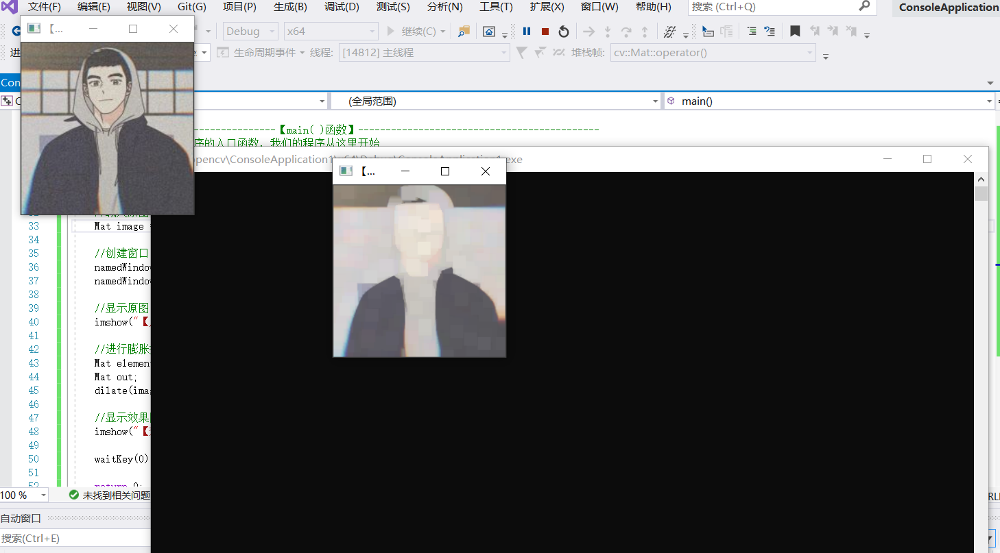

### 什么是“腐蚀”

简单地说，腐蚀就是求局部最小值的操作。

### 相关代码

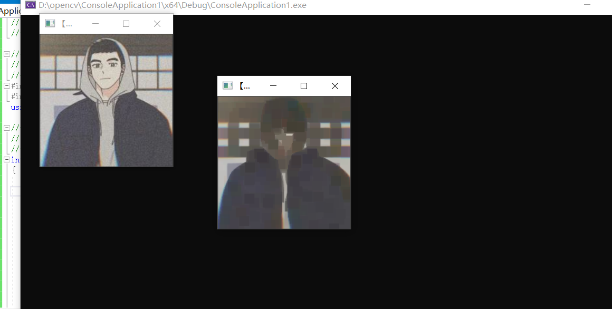

### 腐蚀与膨胀综合示例

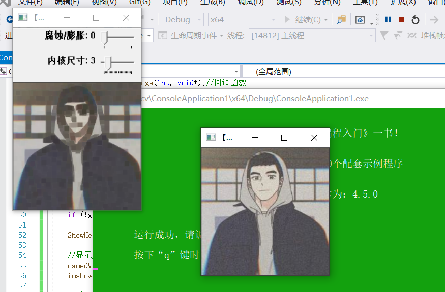

## 形态学滤波：开运算，闭运算，形态学梯度，顶帽，黑帽

### 开运算：

简单的说就是先腐蚀后膨胀的过程。开运算可以用来消除小物体，在纤细点处分离物体，并且在平滑较大物体的边界的同时不明显改变其面积。

### 用morphologyEx进行图像开运算实验

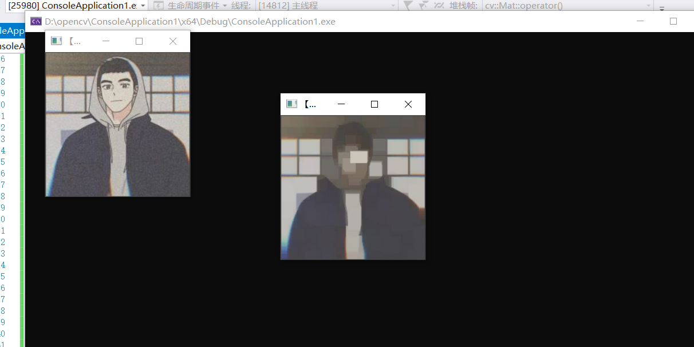

### 闭运算：

就是与开运算相反，先膨胀后腐蚀的过程。闭运算可以排除小型黑洞。

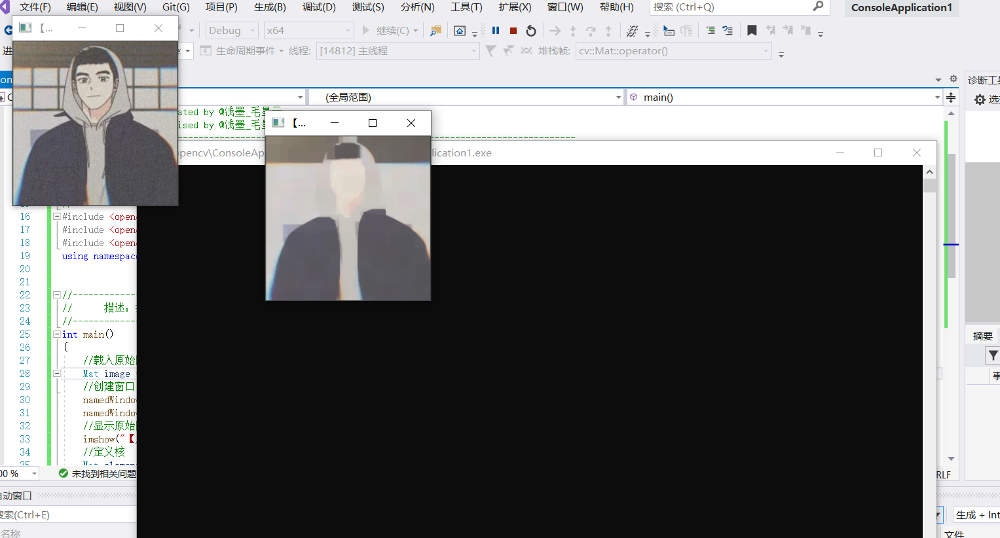

### 总结：
其实我们通过比较俩个实验截图就可以知道，实验结果都是差不多的。不同的就是实验步骤，先后顺序。开运算先腐蚀后膨胀，去除了小的黑点，方块边缘变得圆润了，也就是开运算对图像轮廓进行平滑。
而闭运算先膨胀后腐蚀，把中心比较大的块连接为一个整体，填补了空白的缝隙。

### 形态学梯度

膨胀图与腐蚀图之差。我们可以用形态学梯度来保留物体的边缘轮廓。

### 用morphologyEx进行形态学梯度实验

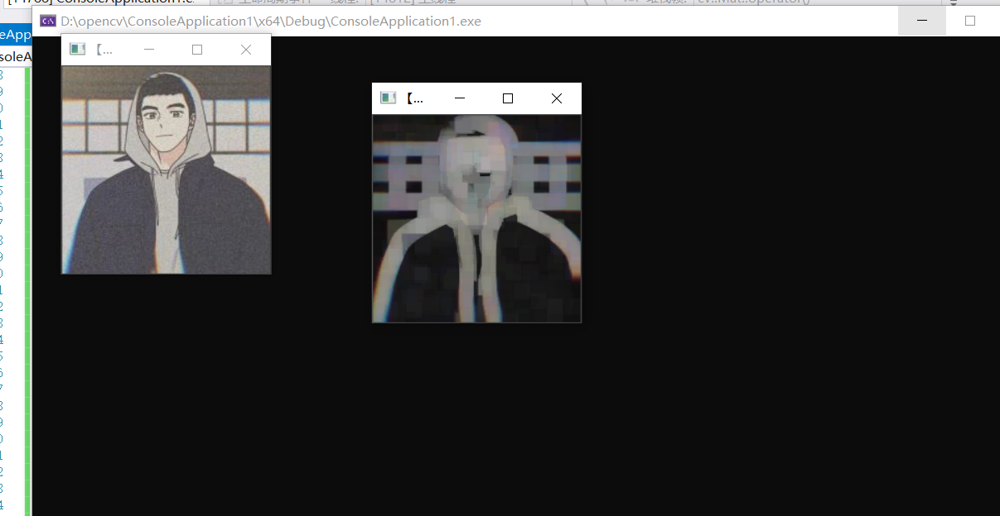

这个实验与前面的对边，可以清楚的看到图像的轮廓。

### 顶帽

因为开运算带来的结果是放大了裂缝或者局部低亮度的区域。因此，从原图中减去开运算后的图，得到的效果图突出了比原图轮廓周围的区域更明亮的区域，且这一操作与选择的核的大小相关。

### 用morphologyEx进行顶帽实验

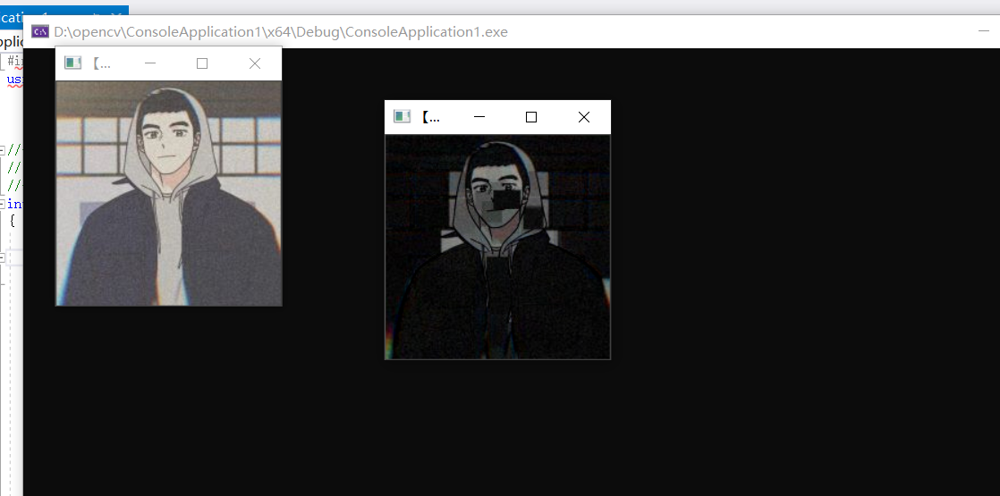

### 黑帽

黑帽运算后的效果图突出了比原图轮廓周围的区域更暗的区域，且这一操作和选择的核的大小相关。所以，黑帽运算用来分离比邻近点暗--.些的斑块，效果图有着非常完美的轮廓。

### 用morphologyEx进行黑帽实验

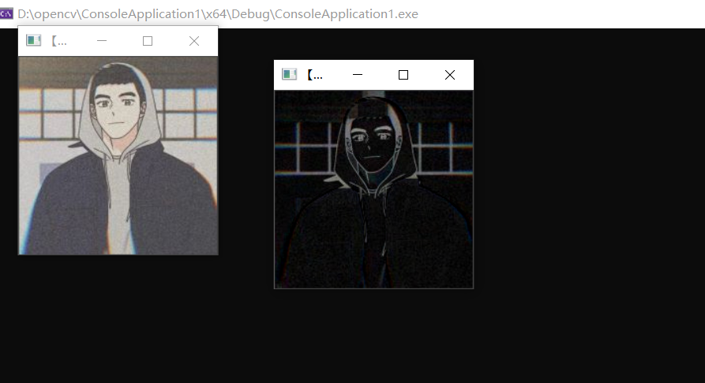

### 各形态学操作对比实验

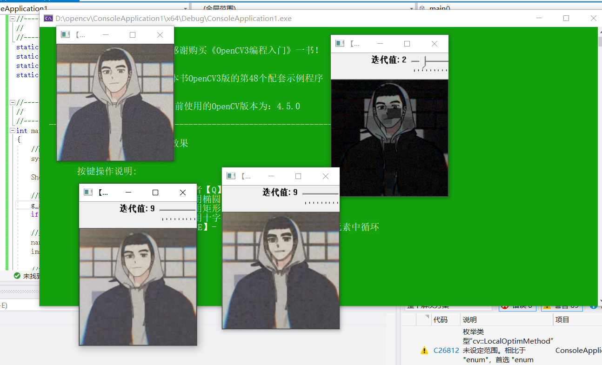

## 漫水填充

漫水填充法是一-种用特定的颜色填充连通区域，通过设置可连通像素的上下限以及连通方式来达到不同的填充效果的方法。漫水填充经常被用来标记或分离图像的一.部分，以便对其进行进- -步处理或分析，也可以用来从输入图像获取掩码区域，掩码会加速处理过程，或只处理掩码指定的像素点，操作的结果总是某个连续的区域。

(1)第一个参数，InputOutputArray类型的image,输入/输出1通道或3通道，8位或浮点图像，具体参数由之后的参数指明。
(2)第二个参数，InputOutputArray 类型的mask,这是第二个版本的floodFill独享的参数,表示操作掩模。它应该为单通道, 8位，长和宽上都比输入图像image大两个像素点的图像。第二个版本的floodFill 需要使用以及更新掩膜，所以对于这个mask 参数，我们一-定要将其准备好并填在此处。需要注意的是，漫水填充不会填充掩膜mask的非零像素区域。例如，--个边缘检测算子的输出可以用来
作为掩膜，以防止填充到边缘。同样的，也可以在多次的函数调用中使用同一个掩膜，以保证填充的区域不会重叠。另外需要注意的是，掩膜mask会比需填充的图像大，所以mask 中与输入图像(x,y)像素点相对应的点的坐标为(x+1,y+1)。
(3)第三个参数，Point 类型的seedPoint，漫水填充算法的起始点。
(4)第四个参数，Scalar 类型的newVal，像素点被染色的值，即在重绘区域像素的新值。
(5)第五个参数，Rect*类型的 rect， 有默认值0，-一个可选的参数，用于设置floodFill函数将要重绘区域的最小边界矩形区域。
(6)第六个参数，Scalar类型的loDiff， 有默认值Scalar()， 表示当前观察像素值与其部件邻域像素值或者待加入该部件的种子像素之间的亮度或颜色之负差(lower brightness/color difference)的最大值。
(7)第七个参数，Scalar 类型的upDiff,有默认值Scalar()， 表示当前观察像素值与其部件邻域像素值或者待加入该部件的种子像素之间的亮度或颜色之正差(lower brightness/color difference)的最大值。
(8)第八个参数，int 类型的flags,操作标志符，此参数包含三个部分，比较复杂，我们一起详细看看。

### floodfill函数实验

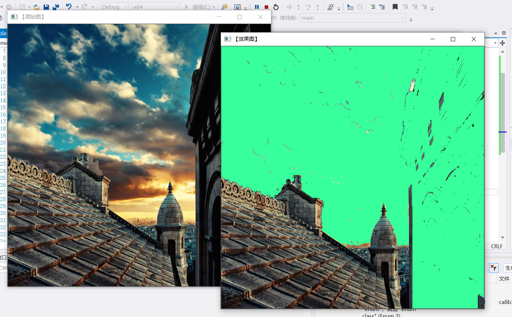

## 图像金字塔与图片尺寸缩放

俩种方式：
●resize 函数。这是最直接的方式
●pyrUp0、pyrDown()函数。即图像金字塔相关的两个函数，对图像进行向上采样和向下采样的操作。

俩种类型图片金字塔：
●高斯金字塔(Gaussianpyramid) 一用来向 下采样，主要的图像金字塔。
●拉普拉斯金字塔(Laplacianpyramid) 一用来从金字塔低层图像重建上层未采样图像，在数字图像处理中也即是预测残差，可以对图像进行最大程度的还原，配合高斯金字塔一起使用。

### 高斯金字塔

高斯金字塔是通过高斯平滑和亚采样获得一些列下采样图像，也就是说第K层高斯金字塔通过平滑、亚采样就可以获得K+1层高斯图像。高斯金字塔包含了一系列低通滤波器， 其截止频率从上一-层到下- -层以因子2逐渐增加，所以高斯金字塔可以跨越很大的频率范围。

### 拉普拉斯金字塔

Gi表示第i层的图像。而UP0操作是将源图像中位置为(x,y)的像素映射到目标图像的(2x+1,2y+1)位置，即在进行向上取样。符号网表示卷积，gsxs为 5x5的高斯内核。

### 尺寸调整：resize（）函数

此函数将源图像精确地转换为指定尺寸的目标图像。如果源图像中设置了ROI，那么resize()函数会对源图像的ROI区域进行调整图像尺寸的操作,来输出到目标图像中。若目标图像中已经设置了ROI区域，不难理解resize()将会对源图像进行尺寸调整并填充到目标图像的ROI中。

### 实验结果

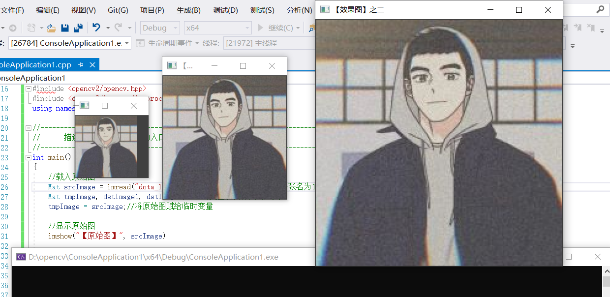

### 向上采样 pyrup（）函数

pyrUp)函数的作用是向上采样并模糊一-张图像， 说白了就是放大一张图片。

●第一个参数，InputArray 类型的src，输入图像，即源图像，填Mat类的对象即可。
●第二个参数，OutputArray类型的dst, 输出图像，和源图片有一 样的尺寸和类型。
●第三个参数，const Size&类型的dstsize, 输出图像的大小;有默认值Size(),即默认情况下，由Size (src.cols*2， src.rows*2) 来进行计算。

### 实验结果

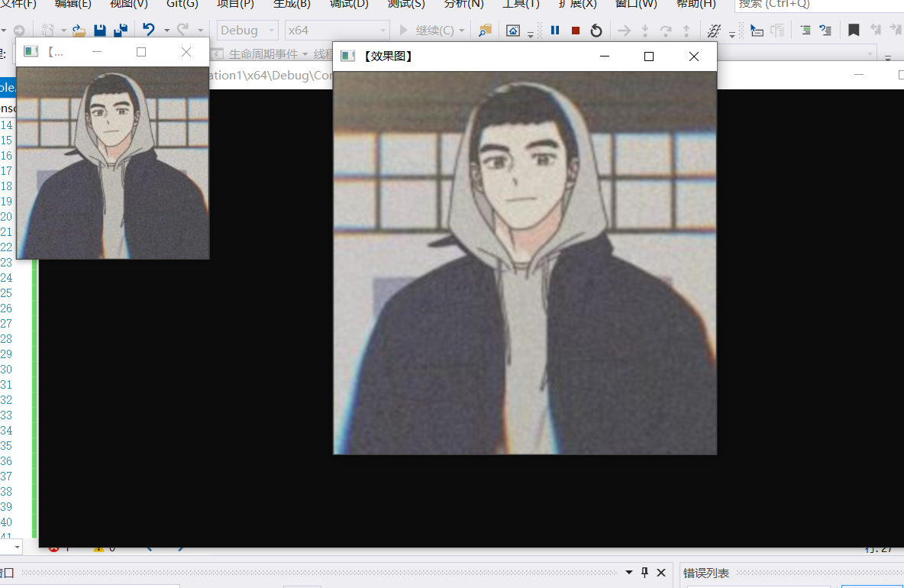

### 采样: pyrDown()函数

pyrDown(函数的作用是向下采样并模糊一张图片， 说白了就是缩小一张图片。

### 实验结果

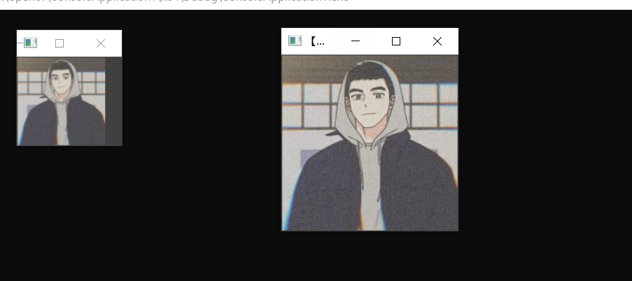

## 阈值化

阈值可以被视作最简单的图像分割方法。比如，从一副图像中利用阈值分割出我们需要的物体部分(当然这里的物体可以是一部分或 者整体)。这样的图像分割方法基于图像中物体与背景之间的灰度差异，而且此分割属于像素级的分割。为了从一副图像中提取出我们需要的部分，应该用图像中的每一一个 像素点的灰度值与选取的阈值进行比较，并作出相应的判断。注意:阈值的选取依赖于具体的问题。即物体在不同的图像中有可能会有不同的灰度值。

涉及到的俩个函数：
●固定阈值操作 Threshold（）函数
●自适应阈值操作 adaptiveThreshold（）函数

### 相关实验

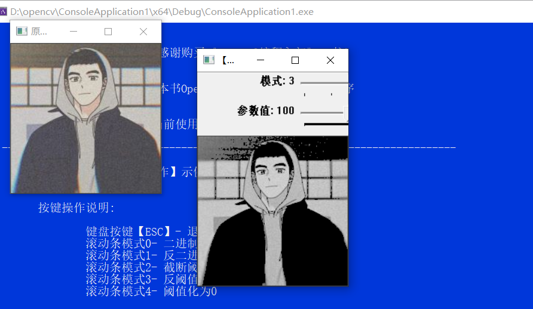

## 小结

我们学习了各种利用OpenCV进行图像处理的方法。包括属于线性滤波的方框滤波、均值滤波与高斯滤波，属于非线性滤波的中值滤波、双边滤波; 两种基本形态学操作一膨胀 与腐蚀; 5种高级形态学滤波操作一开运算、 闭运算、形态学梯度、顶帽以及黑帽;还有漫水填充算法、图像金字塔、图像缩放、阈值化。涉及到的内容可谓非常丰富。相信学完此章的内容，你对OpenCV的了解已经上了一个层次。

## 基于opencv的边缘检测（目的：找到最优的边缘检测办法）

一般步骤：
●滤波
●增强
●检测

canny的检测步骤：
●消除噪声
●计算梯度幅值和方向
●非极大值抑郁
●滞后阈值

评价标准：
●低错误率:标识出尽可能多的实际边缘，同时尽可能地减少噪声产生的误报。
●高定位性:标识出的边缘要与图像中的实际边缘尽可能接近。
●最小响应:图像中的边缘只能标识--次，并且可能存在的图像噪声不应标识为边缘。

### canny函数用法实验

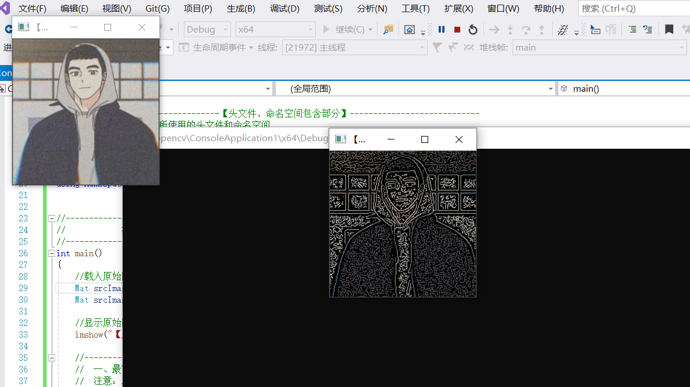

## 霍夫变换

霍夫变换是图像处理中的一种特征提取技术，该过程在一个参数空间中通过计算累计结果的局部最大值得到一个符合该特定形状的集合作为霍夫变换结果。

OpenCV支持三种不同的霍夫线变换，它们分别是:
●标准霍夫变换
●多尺度霍夫变换
●累计概率霍夫变换

### 霍夫线变换原理

●在笛卡尔坐标系:可由参数斜率和截距(m,b) 表示。
●在极坐标系:可由参数极径和极角(r, 0)表示。

### 标准霍夫变换: HoughLines()函数

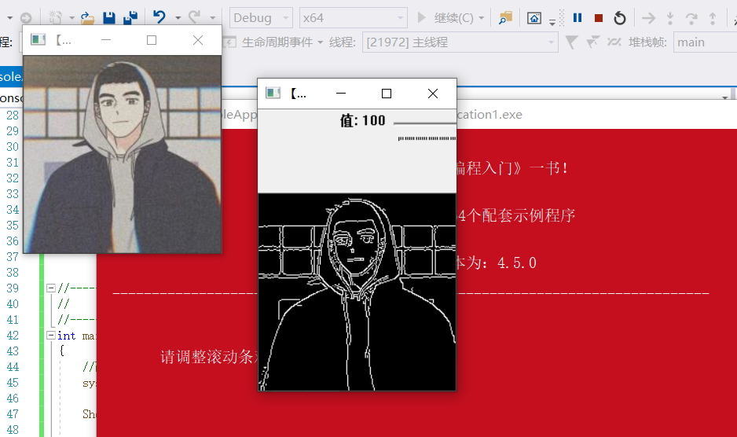

## 重映射

重映射，就是把一幅图像中某位置的像素放置到另--个图片指定位置的过程。为了完成映射过程，需要获得一些插值为非整数像素的坐标，因为源图像与目标.图像的像素坐标不是一一对应的。一般情况下，我们通过重映射来表达每个像素的位置(x,y)。

### 实现重映射: remap函数

remap(函数会根据指定的映射形式，将源图像进行重映射几何变换。

### remap函数实验

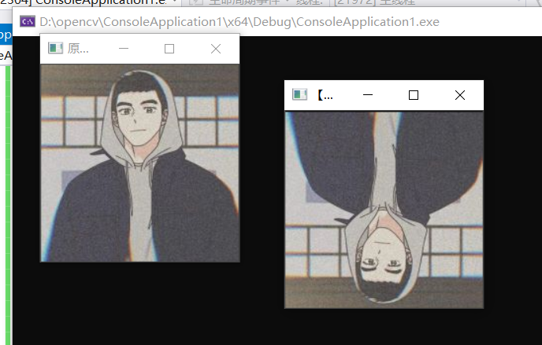

### 实验实现多重映射

可以用按键控制四种不同的映射模式。

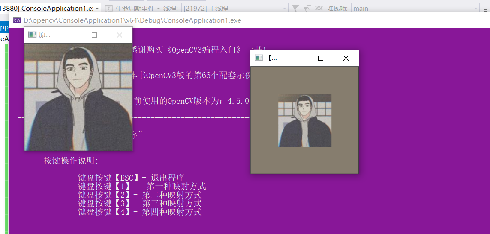

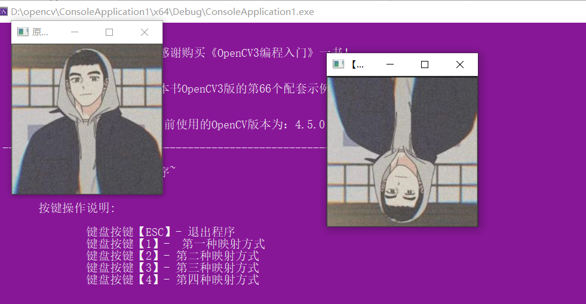

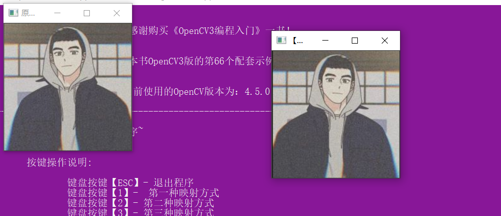

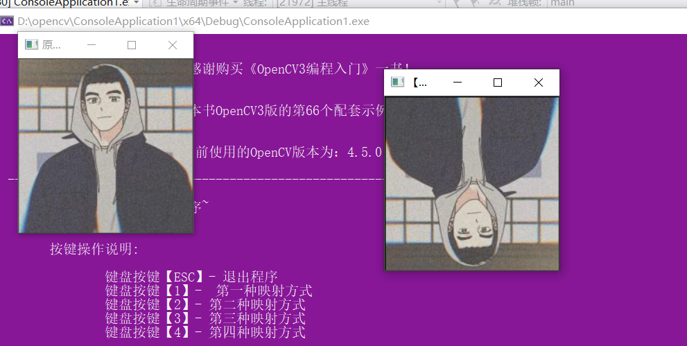

## 仿射变换

仿射变换，又称仿射映射，是指在几何中，一个向量空间进行一次线性变换并接上一个平移，变换为另一个向量空间的过程。它保持了二维图形的“平直性”(直线经过变换之后依然是直线)和“平行性”(二维图形之间的相对位置关系保持不变，平行线依然是平行线，且直线上点的位置顺序不变)。一个任 意的仿射变换都能表示为乘以一一个矩阵(线性变换)接着再加上一个向量(平移)的形式。

用仿射变换来表示三种常见的变换形式:
●旋转，rotation (线性变换)
●平移，translation(向量加)
●缩放，scale(线性变换)

### 仿射变换综合实验

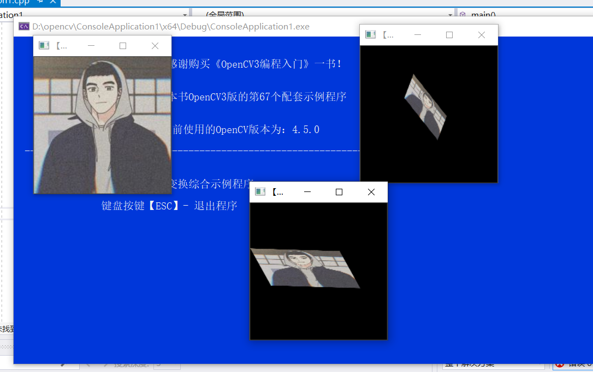

## 直方图均衡化

直方图均衡化是灰度变换的一个重要应用，它高效且易于实现，广泛应用于图像增强处理中。图像的像素灰度变化是随机的，直方图的图形高低不齐，直方图均衡化就是用一定的算法使直方图大致平和的方法。

### 直方图均衡化实验

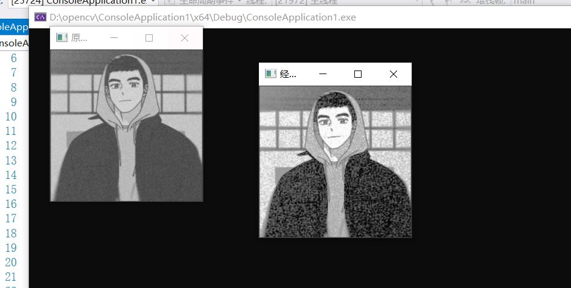

在原始图像对比度本来就很高的情况下，如果再均衡化则灰度调和，对比度会降低。在泛白缓和的图像中，均衡化会合并一些象素灰度，从而增大对比度。均衡化后的图片如果再对其均衡化，则图像不会有任何变化。

## 小结

我们学习了很多类型的图像变换方法
●canny算子
●sobel算子
●Laplace 算子
●scharr滤波器
●进行图像特征提取的霍夫线变换、霍夫圆变换，重映射和仿射变换以及直方图均衡化。

## 查找并绘制轮廓

一个轮廓一般对应一系列的点，也就是图像中的一条曲线。其表示方法可能根据不同的情况而有所不同。在OpenCV中，可以用findContours()函数从二值图像中查找轮廓。

### findContours（）函数

我们用这个函数的目的是用来寻找轮廓。

### drawContours（）函数

我们用这个函数的目的是用来绘制轮廓。

### 查找并绘制轮廓综合示例

此程序利用了图像平滑技术（blur()）函数和边缘检测技术（canny()函数)，根据滑动条的调节，可以动态地检测出图形的轮廓。

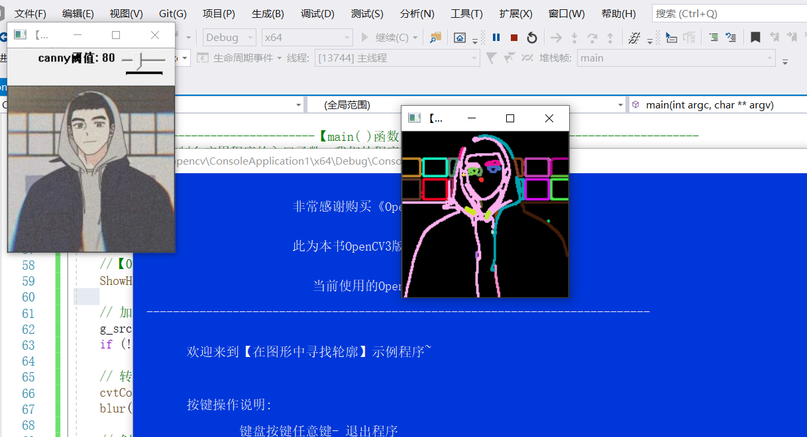

## 寻找物体的凸包

### 什么是“凸包”

凸包是一个计算几何(图形学)中常见的概念。简单来说，给定二维平面上的点集，凸包就是将最外层的点连接起来构成的凸多边型，它是能包含点集中所有点的。理解物体形状或轮廓的一种比较有用的方法便是计算一个物体的凸包，然后计算其凸缺陷。很多复杂物体的特性能很好地被这种缺陷表现出来。

### convexHull()函数

寻找凸包

●第一个参数，InputArray 类型的points, 输入的二维点集，可以填Mat类型或者stl::vector.
●第二个参数，OutputArray类型的hull, 输出参数，函数调用后找到的凸包。
●第三个参数，bool类型的clockwise,操作方向标识符。当此标识符为真时，输出的凸包为顺时针方向。否则，就为逆时针方向。并且是假定坐标系的x轴指向右，y轴指向上方。
●第四个参数，bool类型的returnPoints, 操作标志符，默认值true。 当标志符为真时，函数返回各凸包的各个点。否则，它返回凸包各点的指数。当输出数组是stl::vector时，此标志被忽略。

### 寻找和绘制物体的凸包

## 使用多边形将轮廓包围

简单的来说就是如何根据轮廓来提取多边形。看到人的脑袋我们或许可以想到原型，看到电脑，我们会想到矩形。

我们依旧要利用一些函数来讲解这个实验

### boundingRect()函数

此函数计算并返回指定点集最外面(up-right) 的矩形边界。

### minAreaRect（）函数

此函数用于对给定的2D点集，寻找可旋转的最小面积的包围矩形。

### minEnclosingCircle（）函数

minEnclosingCircle函数的功能是利用一种迭代算法，对给定的2D点集，去寻找面积最小的可包围它们的圆形。

●第一个参数, InputArray类型的points,输入的二维点集,可以为st::vector<>或Mat类型。
●第二个参数，Point2f& 类型的center， 圆的输出圆心。
●第三个参数，float& 类型的radius，圆的输出半径。

### fitEllipse（）函数

此函数的作用是用椭圆拟合二维点集。

### approxPolyDP（）函数

approxPolyDP函数的作用是用指定精度逼近多边形曲线。

### 创建包围轮廓的矩形边界

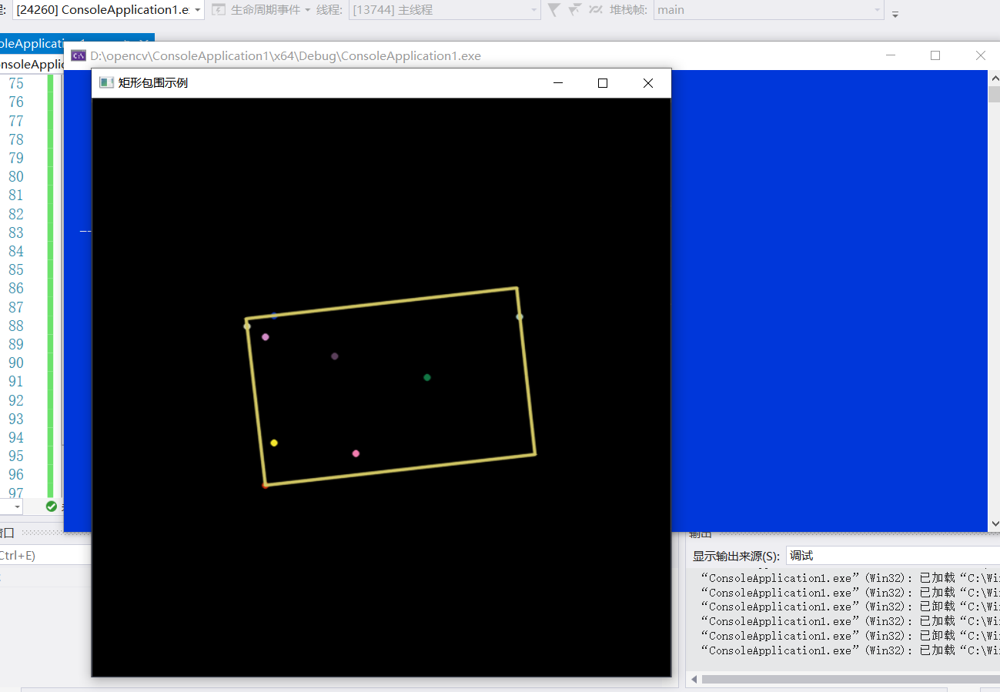

### 创建包围轮廓的圆形边界

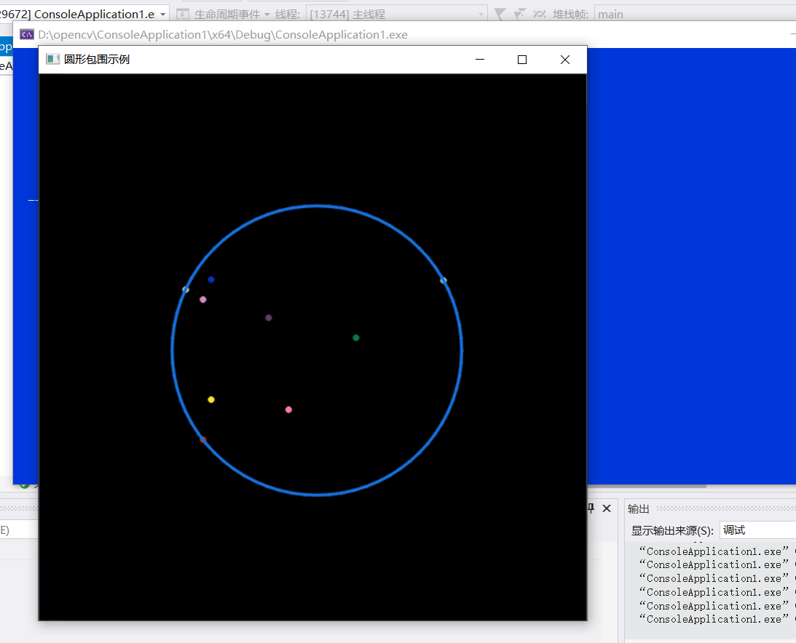

## 图像的矩

矩函数在图像分析中有着广泛的应用，如模式识别、目标分类、目标识别与方位估计、图像编码与重构等。-一个从一幅数字图形中计算出来的矩集，通常描述了该图像形状的全局特征，并提供了大量的关于该图像不同类型的几何特性信息，比如大小、位置、方向及形状等。图像矩的这种特性描述能力被广泛地应用在各种图像处理、计算机视觉和机器人技术领域的目标识别与方位估计中。一阶矩与形状有关，二阶矩显示曲线围绕直线平均值的扩展程度，三阶矩则是关于平均值的对称性的测量。由二阶矩和三阶矩可以导出一-组共7个不变矩。而不变矩是图像的统计特性，满足平移、伸缩、旋转均不变的不变性，在图像识别领域得到了广泛的应用。

### 问题：在opencv中 通过什么函数可以计算矩？

●使用moments计算图像所有的矩(最高到3阶)
●使用contourArea来计算轮廓面积
●使用arcLength来计算轮廓或曲线长度

### moments（）函数

moments()函数用于计算多边形和光栅形状的最高达三阶的所有矩。矩用来计算形状的重心、面积，主轴和其他形状特征，如7Hu不变量等。

### contourArea（）函数

计算轮廓面积

### arcLength()函数

arcLength（）函数用于计算封闭轮廓的周长或曲线的长度。

### 查找和绘制图像轮廓矩

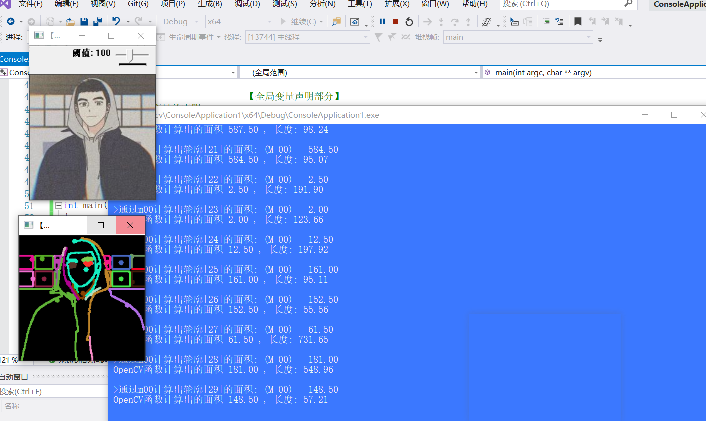

## 分水岭算法

分水岭算法，是一种基于拓扑理论的数学形态学的分割方法，其基本思想是把图像看作是测地学上的拓扑地貌，图像中每一点像素的灰度值表示该点的海拔高度，每一个局部极小值及其影响区域称为集水盆，而集水盆的边界则形成分水岭。分水岭的概念和形成可以通过模拟浸入过程来说明:在每一个局部极小值表面，刺穿-个小孔，然后把整个模型慢慢浸入水中，随着浸入的加深，每一个局部极小值的影响域慢慢向外扩展，在两个集水盆汇合处构筑大坝，即形成分水岭。

### 实现分水岭算法:watershed（）函数

函数watershed实现的分水岭算法是基于标记的分割算法中的-一种。在把图像传给函数之前，我们需要大致勾画标记出图像中的期望进行分割的区域，它们被标记为正指数。所以，每-一个区域都会被标记为像素值1、2、3等，表示成为一个或者多个连接组件。这些标记的值可以使用findContours()函数和drawContours()函数由二进制的掩码检索出来。不难理解，这些标记就是即将绘制出来的分割区域的“种子”，而没有标记清楚的区域，被置为0。在函数输出中，每一个标记中的像素被设置为“种子”的值，而区域间的值被设置为-1。

### 分水岭算法

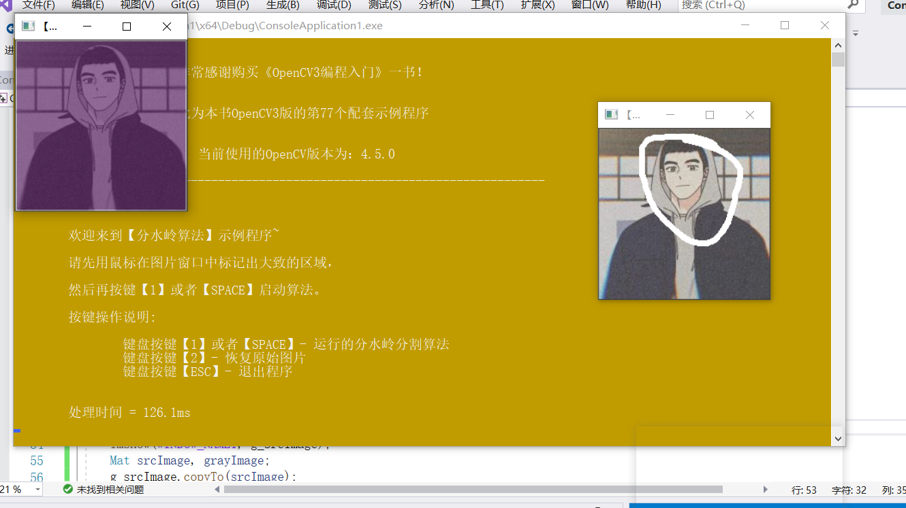

## 图像修补

图像修补就是说利用那些已经被破坏区域的边缘，即边缘的颜色和结构，繁殖和混合到损坏的图像中，以达到图像修补的目的。

### 实现图像修补: inpaint()函数

在新版OpenCV中，图像修补技术由inpaint函数实现，它可以用来从扫描的照片中清除灰尘和划痕，或者从静态图像或视频中去除不需要的物体。
我们也可以理解为美颜功能。

●第一个参数，InputArray类型的sIre， 输入图像，即源图像，填Mat类的对象即可，且需为8位单通道或者三通道图像。
●第二个参数，InputArray 类型的inpaintMask，修复掩膜，为8位的单通道图像。其中的非零像素表示需要修补的区域。
●第三个参数，OutputArray 类型的dst， 函数调用后的运算结果存在这里，和源图片有一样的尺寸和类型。
●第四个参数，double 类型的inpaintRadius,需要修补的每个点的圆形邻域，为修复算法的参考半径。
●第五个参数，int类型的flags, 修补方法的标识符。

### 图像修补综合示例

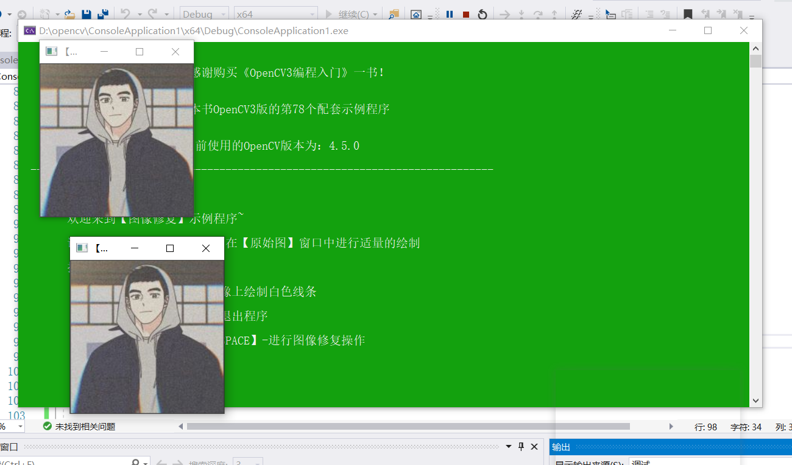

## 小结

我们学习了查找轮并绘制轮廓，然后学习了如何寻找到物体的凸包，接着是使用多边形来包围轮廓，以及计算一个图像的矩。在本章后面几节，还学习了分水岭算法和图像修补操作的实现方法。
几乎所有的算法都是与函数有关。

## 图像直方图概述

直方图广泛运用于很多计算机视觉运用当中，通过标记帧与帧之间显著的边缘和颜色的统计变化，来检测视频中场景的变化。在每个兴趣点设置-一个有相近特征的直方图所构成“标签”，用以确定图像中的兴趣点。边缘、色彩、角度等直.方图构成了可以被传递给目标识别分类器的一-个通用特征类型。色彩和边缘的直方图序列还可以用来识别网络视频是否被复制。

图像直方图是用以表示数字图像中亮度分布的直方图，标绘了图像中每个亮度值的像素数。可以借助观察该直方图了解需要如何调整亮度分布。这种直方图中，横坐标的左侧为纯黑、较暗的区域，而右侧为较亮、纯白的区域。因此，一张较暗图片的图像直方图中的数据多集中于左侧和中间部分，而整体明亮、只有少量阴影的图像则相反。计算机视觉领域常借助图像直方图来实现图像的二值化。

直方图的意义：
●直方图是图像中像素强度分布的图形表达方式。
●它统计了每一个强度值所具有的像素个数。

## 直方图的计算与绘制

直方图的计算在OpenCV中可以使用calcHist()函数，而计算完成之后，可以采用OpenCV中的绘图函数，如绘制矩形的rectangle()函数，绘制线段的line()来完成。

### 计算直图: calcHist()函数

计算一个或多个阵列的直方图。

### 找寻最值: minMaxLoc（）函数

minMaxLoc()函数的作用是在数组中找到全局最小值和最大值。

### 绘制H-S直方图

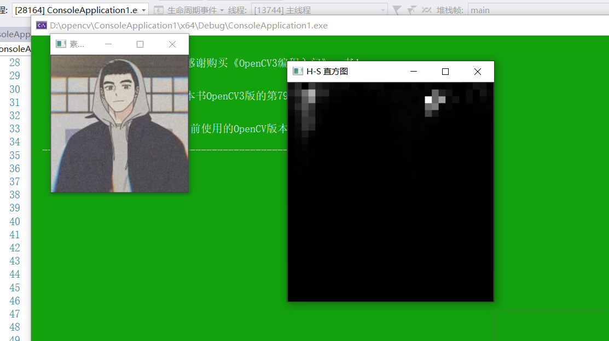

### 计算并绘制图像一维直方图

### 绘制RGB三色直方图

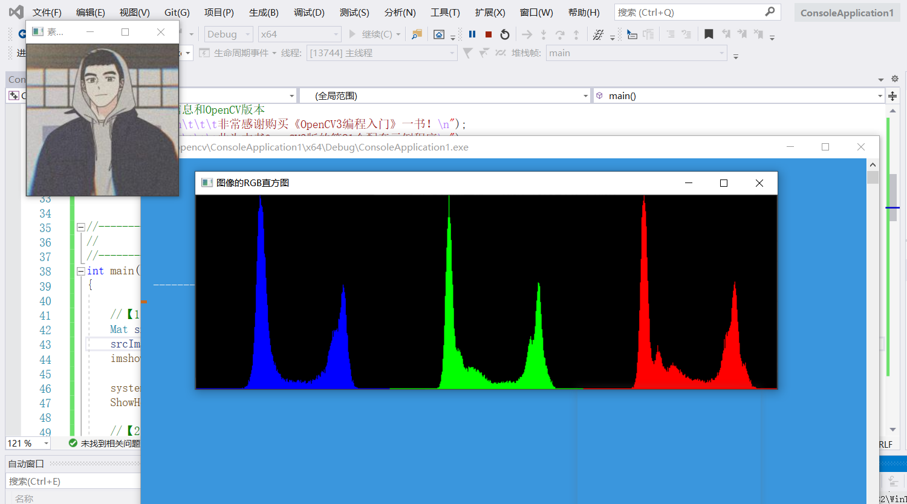

## 直方图对比

对于直方图来说，一个不可或缺的工具便是用某些具体的标准来比较两个直方图的相似度。要对两个直方图(比如说H和H2)进行比较，首先必须选择一个衡量直方图相似度的对比标准(d(H,H2))。 在OpenCV 2.X中，我们用compareHist()函数来对比两个直方图的相似度，而此函数的返回值就是d(H,H2)。

### 对比直方图: compareHist()函数

比较俩个直方图，可以采用四种方法：
●相关
●卡方
●直方图相交
●距离

### 直方图对比示例

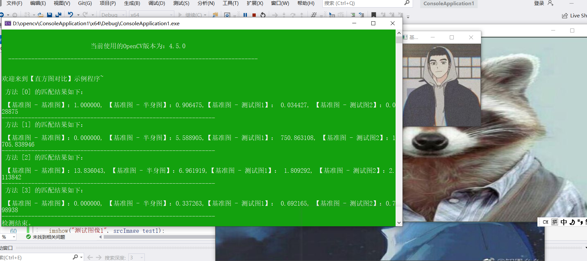

## 反向投影

### 原理：

(1)对测试图像中的每个像素(p(ij))， 获取色调数据并找到该色调(hi;j,Sij)在直方图中的bin的位置。
(2)查询模型直方图中对应bin的数值。
(3)将此数值储存在新的反射投影图像中。也可以先归一化直方图数值到0-255范围，这样可以直接显示反射投影图像(单通道图像)。
(4)通过对测试图像中的每个像素采用以上步骤，可以得到最终的反射投影图像。
(5)使用统计学的语言进行分析。反向投影中储存的数值代表了测试图像中该像素属于皮肤区域的概率。比如以图9.17为例，亮起的区域是皮肤区域的概率更大，而更暗的区域则表示是皮肤的概率更低。另外，可以注意到，手掌内部和边缘的阴影影响了检测的精度。

### 作用

反向投影用于在输入图像(通常较大)中查找与特定图像(通常较小或者仅1个像素，以下将其称为模板图像)最匹配的点或者区域，也就是定位模板图像出现在输入图像的位置。

### 结果

反向投影的结果包含了以每个输入图像像素点为起点的直方图对比结果。可以把它看成是一-个二维的浮点型数组、二维矩阵，或者单通道的浮点型图像。

### 计算反向投影: calcBackProject()函数

●第一个参数，const Mat*类型的images, 输入的数组(或数组集)，它们须为相同的深度(CV_ 8U或CV_ _32F)和相同的尺寸，而通道数则可以任意。.
●第二个参数，int类型的nimages, 输入数组的个数，也就是第一一个参数中存放了多少张“图像”，有几个原数组。
●第三个参数，const int*类型的channels, 需要统计的通道(dim)索引。第一个数组通道从0到images[0].channels<)-1 ，而第二个数组通道从images[0].channels()计算到images[0].channels() + images[1].channels()-1。
●第四个参数，InputArray 类型的hist,输入的直方图。
●第五个参数，OutputArray类型的backProject, 目标反向投影阵列，其须为单通道，并且和image[0]有相同的大小和深度。
●第六个参数，const float**类型的rangges， 表示每-一个维度数组(第六个参数dims)的每-维的边界阵列，可以理解为每一-维数值的取值范围。
●第七个参数，doublescale，有默认值1，输出的方向投影可选的缩放因子，默认值为1。
●第八个参数，bool类型的uniform, 指示直方图是否均匀的标识符，有默认值true。

### 通道复制:mixChannels（）函数

此函数为重排图像通道提供了比较先进的机制。其实，之前我们接触到的split()和merge(),以及evtColor()的某些形式，都只是mixChannels()的一部分。

### 反向投影示例

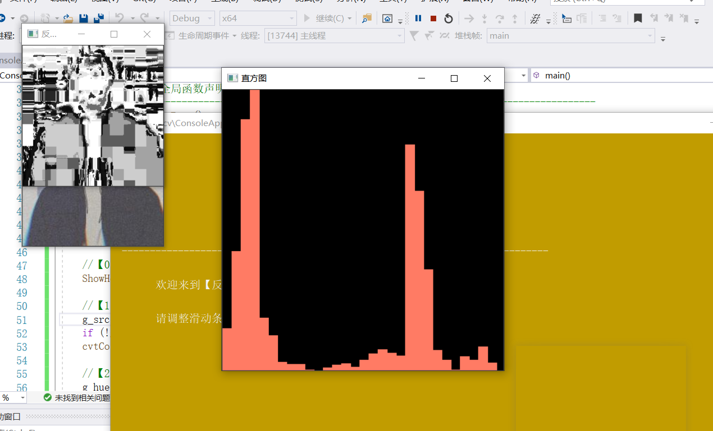

## 模块匹配

### 概念和原理：

模板匹配是一项在一幅图像中寻找与另一幅模板图像最匹配(相似)部分的技术。在OpenCV2和OpenCV3中，模板匹配由MatchTemplate()函数完成。需要注意，模板匹配不是基于直方图的，而是通过在输入图像上滑动图像块，对实际的图像块和输入图像进行匹配的一种匹配方法。

### 实现模板匹配:matchTemplate（）函数

六种图像匹配方法：
●平方差匹配法
●归一化平方差匹配法
●相关匹配法
●归一化相关匹配法
●系数匹配法
●化相关系数匹配法

## 小结

这张讲解了，而简单点说，直方图就是对数据进行统计的一种方法。然后还讲到了反向投影和模板匹配。所谓反向投影就是首先计算某一特征的直方图模型，最后使用模型去寻找图像中存在的该特征的方法。而模板匹配是一项在一幅图像中寻找与另一幅模板图像最匹配(相似)部分的技术。经过老师的讲解，让我更加清楚了板块匹配，以及代码的运行。

