## CH06

### 31_方框滤波boxFilter函数的使用

方框滤波（box Filter）被封装在一个名为boxblur的函数中，即boxblur函数的作用是使用方框滤波器（box filter）来模糊一张图片。函数原型为：

```  C++
void boxFilter(InputArray src, OutputArray dst, int ddepth, Size ksize, Point anchor = 
	Point(-1, -1), boolnormalize = true, int borderType = BORDER_DEFAULT)
```

参数详解
第一个参数,InputArray类型的src,输入图像,即源图像,填Mat类的对象即可
第二个参数,OutputArray类型的dst,即目标图像,需要和源图片有一样的尺寸和类型。
第三个参数,int类型的ddepth,输出图像的深度,-1代表使用原图深度,即src.depth()。
第四个参数,Size类型的ksize,内核的大小(Size(w,h),w 为像素宽度, h为像素高度)
第五个参数,Point类型的anchor,表示锚点（即被平滑的那个点）,注意他有默认值Point(-1,-1)
第六个参数,bool类型的normalize,默认值为true,表示内核是否被其区域归一化（normalized）了

第七个参数,int类型的borderType,用于推断图像外部像素的某种边界模式。有默认值BORDER_DEFAULT

运行测试：


### 32_均值滤波blur函数的使用

均值滤波，是最简单的一种滤波操作，输出图像的每一个像素是核窗口内输入图像对应像素的像素的平均值( 所有像素加权系数相等)，其实说白了它就是归一化后的方框滤波。函数原型为：(参数含义与方框滤波相同)
```C++
void blur(InputArray src, OutputArraydst, Size ksize, Point anchor = 
         Point(-1,-1), int borderType = BORDER_DEFAULT)
```

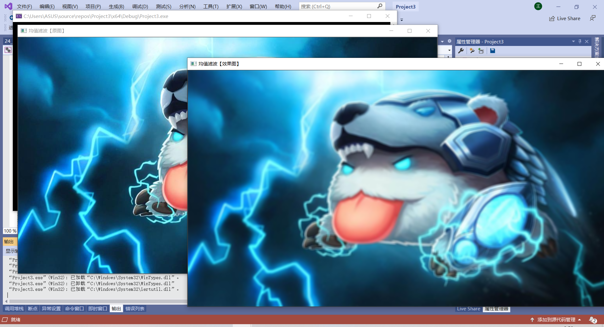

### 33_高斯模糊GaussianBlur函数的用法

高斯滤波是一种线性平滑滤波，适用于消除高斯噪声，广泛应用于图像处理的减噪过程。高斯滤波的具体操作是：用一个模板（或称卷积、掩模）扫描图像中的每一个像素，用模板确定的邻域内像素的加权平均灰度值去替代模板中心像素点的值。函数原型为：(除第四五个参数不同之外其余与方框滤波相同，因此只详细说明第四五个参数)
``` c++
void GaussianBlur(InputArray src,OutputArray dst, Size ksize, 
    double sigmaX, double sigmaY = 0, int borderType = BORDER_DEFAULT)
```
参数详解：

第四个参数，double类型的sigmaX，表示高斯核函数在X方向的的标准偏差。
第五个参数，double类型的sigmaY，表示高斯核函数在Y方向的的标准偏差。若sigmaY为零，就将它设为sigmaX，如果sigmaX和sigmaY都是0，那么就由ksize.width和ksize.height计算出来。

运行测试：
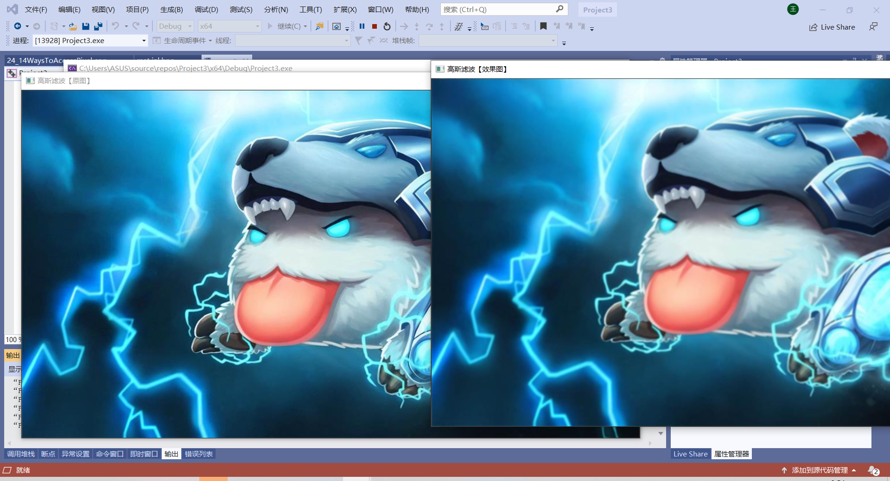

### 34_线性图像滤波综合示例

运行测试：


### 35_MedianBlur函数用法示例

medianBlur函数使用中值滤波器来平滑（模糊）处理一张图片，从src输入，而结果从dst输出。

且对于多通道图片，每一个通道都单独进行处理，并且支持就地操作（In-placeoperation）。

 

函数原型：

```C++
void medianBlur(InputArray src, OutputArray dst, int ksize)
```

参数详解：

第一个参数，InputArray类型的src，函数的输入参数，填1、3或者4通道的Mat类型的图像；当ksize为3或者5的时候，图像深度需为CV_8U，CV_16U，或CV_32F其中之一，而对于较大孔径尺寸的图片，它只能是CV_8U。
第二个参数，OutputArray类型的dst，即目标图像，函数的输出参数，需要和源图片有一样的尺寸和类型。我们可以用Mat::Clone，以源图片为模板，来初始化得到如假包换的目标图。
第三个参数，int类型的ksize，孔径的线性尺寸（aperture linear size），注意这个参数必须是大于1的奇数，比如：3，5，7，9 ...
中值滤波（Median filter）是一种典型的非线性滤波技术，基本思想是用像素点邻域灰度值的中值来代替该像素点的灰度值，该方法在去除脉冲噪声、椒盐噪声的同时又能保留图像边缘细节，．

中值滤波是基于排序统计理论的一种能有效抑制噪声的非线性信号处理技术，其基本原理是把数字图像或数字序列中一点的值用该点的一个邻域中各点值的中值代替，让周围的像素值接近的真实值，从而消除孤立的噪声点，对于斑点噪声（speckle noise）和椒盐噪声（salt-and-pepper noise）来说尤其有用，因为它不依赖于邻域内那些与典型值差别很大的值。中值滤波器在处理连续图像窗函数时与线性滤波器的工作方式类似，但滤波过程却不再是加权运算。

运行测试：
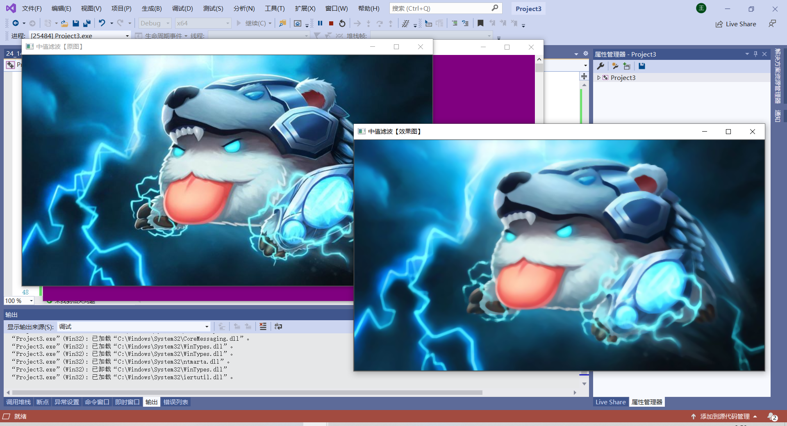
### 36_双边滤波bilateralFilter函数使用示例
双边滤波与高斯滤波器相比，对于图像的边缘信息能过更好的保存。其原理为一个与空间距离相关的高斯函数与一个灰度距离相关的高斯函数相乘。

对于高斯滤波，仅用空间距离的权值系数核与图像卷积后，确定中心点的灰度值。即认为离中心点越近的点，其权重系数越大。
双边滤波中加入了对灰度信息的权重，即在邻域内，灰度值越接近中心点灰度值的点的权重更大，灰度值相差大的点权重越小。此权重大小，则由值域高斯函数确定。
两者权重系数相乘，得到最终的卷积模板。由于双边滤波需要每个中心点邻域的灰度信息来确定其系数，所以其速度与比一般的滤波慢很多，而且计算量增长速度为核大小的平方。

运行测试：

### 37_图像滤波综合示例

运行测试：
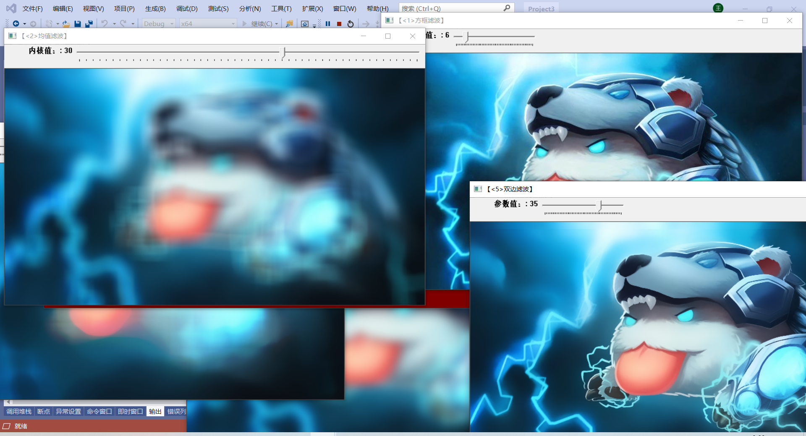
### 38_图像膨胀dilate函数用法示例
膨胀（dilate）就是求局部最大值的操作。从数学角度来说，膨胀或者腐蚀操作就是将图像（或图像的一部分区域，称之为A）与核（称之为B）进行卷积。
核可以是任何形状和大小，它拥有一个单独定义出来的参考点，我们称其为锚点( anchorpoint)。多数情况下，核是一个小的，中间带有参考点和实心正方形或者圆盘。其实，可以把核视为模板或者掩码。
而膨胀就是求局部最大值的操作。核B与图形卷积，即计算核B覆盖的区域的像素点的最大值，并把这个最大值赋值给参考点指定的像素。这样就会使图像中的高亮区域逐渐增长.

运行测试：
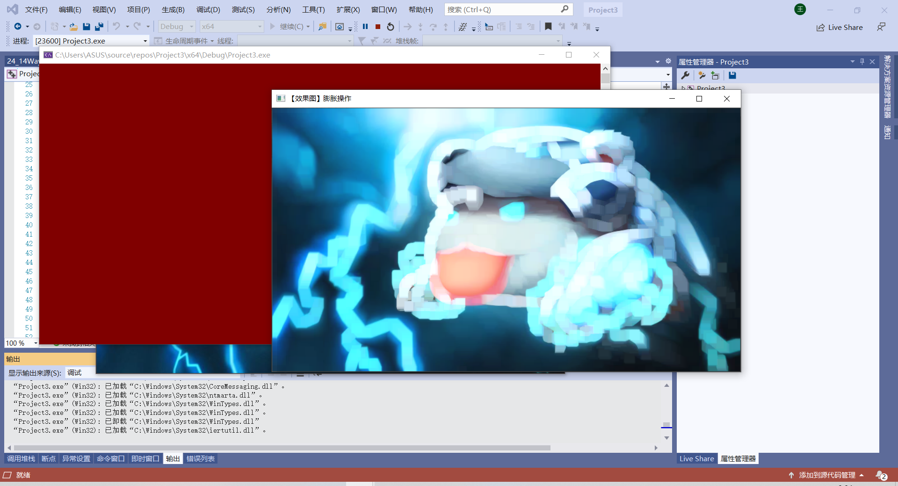
### 39_图像腐蚀erode函数用法示例
膨胀和腐蚀（erode）是相反的一对操作，所以腐蚀就是求局部最小值的操作。

运行测试：
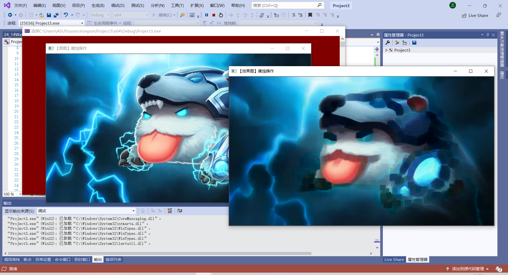
### 40_图像腐蚀与膨胀综合示例

运行测试：
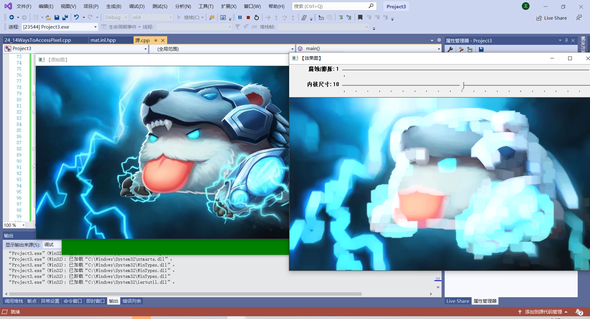
### 41_用morphologyEx进行图像膨胀
发现用morphologyEx() 的 MORPH_DILATE操作和 dilate（）操作得到的效果一模一样
运行测试：
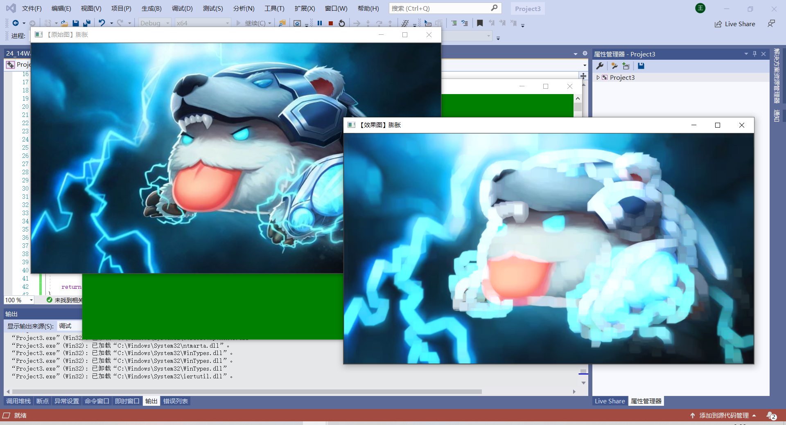
### 42_用morphologyEx进行图像腐蚀
发现用morphologyEx() 的 MORPH_DILATE操作和 dilate（）操作得到的效果一模一样
运行测试：
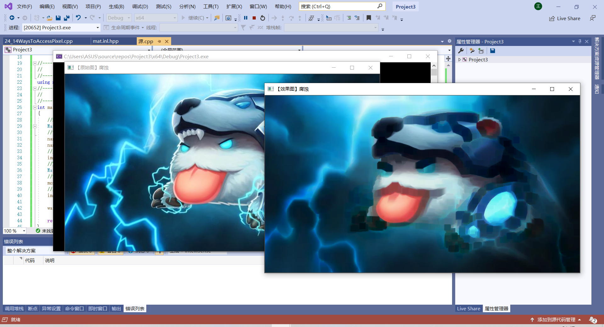
### 43_用morphologyEx进行图像开运算
开运算(Opening Operation)，其实就是先腐蚀后膨胀的过程。其数学表达式如下:
<em>
dst=open (src,element ) =dilate(erode ( src,element))
</em>
开运算可以用来消除小物体，在纤细点处分离物体，并且在平滑较大物体的边界的同时不明显改变其面积。。

运行测试：
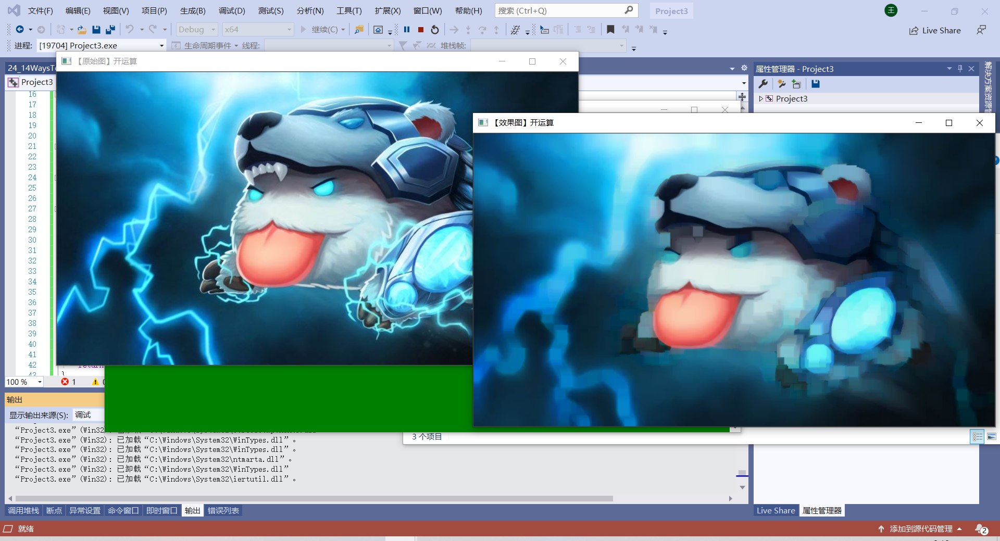
### 44_用morphologyEx进行图像闭运算
先膨胀后腐蚀的过程称为闭运算(Closing Operation)，其数学表达式如下
<em>:dst=clese(src,element) = erode (dilate(src,element) )</em>
闭运算能够排除小型黑洞（黑色区域)。

运行测试：
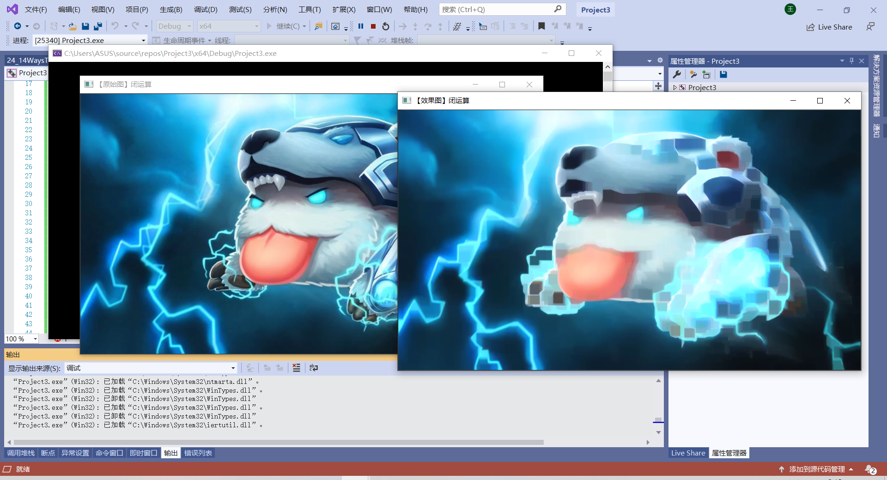
### 45_用morphologyEx进行形态学梯度运算
形态学梯度(Morphological Gradient）是膨胀图与腐蚀图之差，数学表达式如下:
<em>
dst=morph-grad(src,element)= dilate(src,element)- erode(src,element)
</em>
对二值图像进行这一操作可以将团块（blob）的边缘突出出来。我们可以用形态学梯度来保留物体的边缘轮廓,

运行测试：
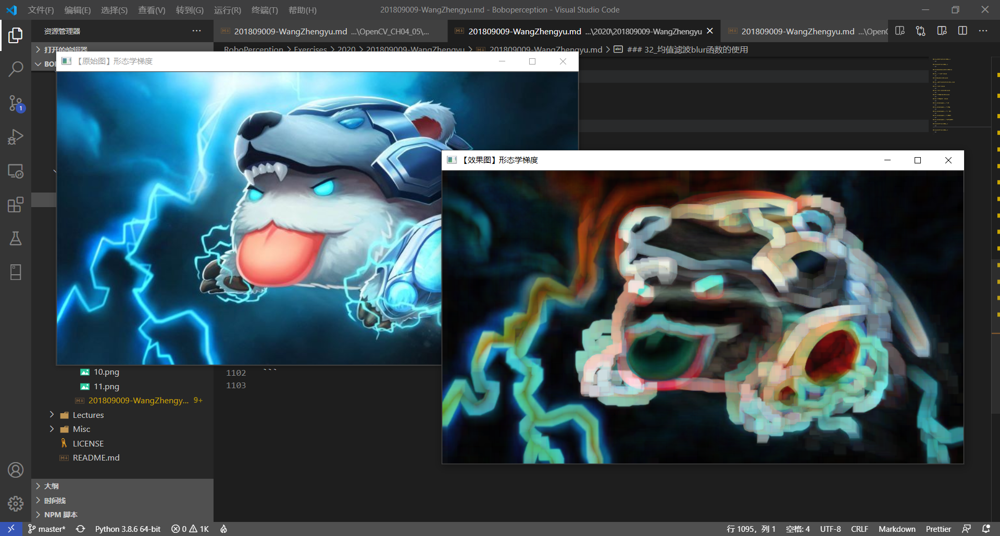
### 46_用morphologyEx进行形态学顶帽运算
顶帽运算（Top Hat）又常常被译为”礼帽“运算，是原图像与上文刚刚介绍的“开运算”的结果图之差，数学表达式如下:
<em>
dst=tophat (src,element) =src-open(src,element)
</em>
因为开运算带来的结果是放大了裂缝或者局部低亮度的区域。因此，从原图中减去开运算后的图,得到的效果图突出了比原图轮廓周围的区域更明亮的区域，且这一操作与选择的核的大小相关。
顶帽运算往往用来分离比邻近点亮一些的斑块。在一幅图像具有大幅的背景，
而微小物品比较有规律的情况下，可以使用顶帽运算进行背景提取。

运行测试：
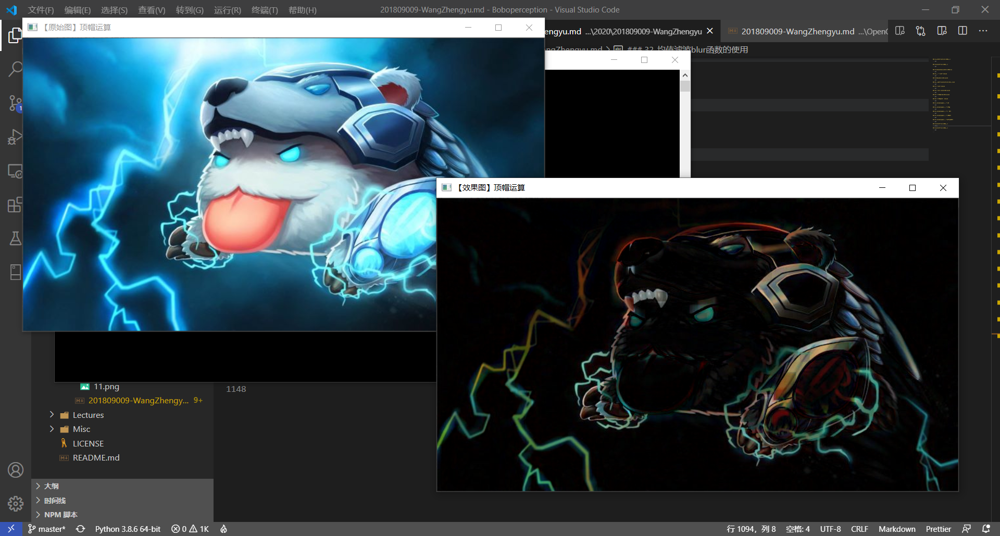
### 47_用morphologyEx进行形态学黑帽运算
黑帽(Black Hat）运算是闭运算的结果图与原图像之差。数学表达式为:dst=blackhat (src,element)=close(src,element)- src
黑帽运算后的效果图突出了比原图轮廓周围的区域更暗的区域，且这一操作和选择的核的大小相关。
所以，黑帽运算用来分离比邻近点暗一些的斑块，效果图有着非常完美的轮廓。
运行测试：
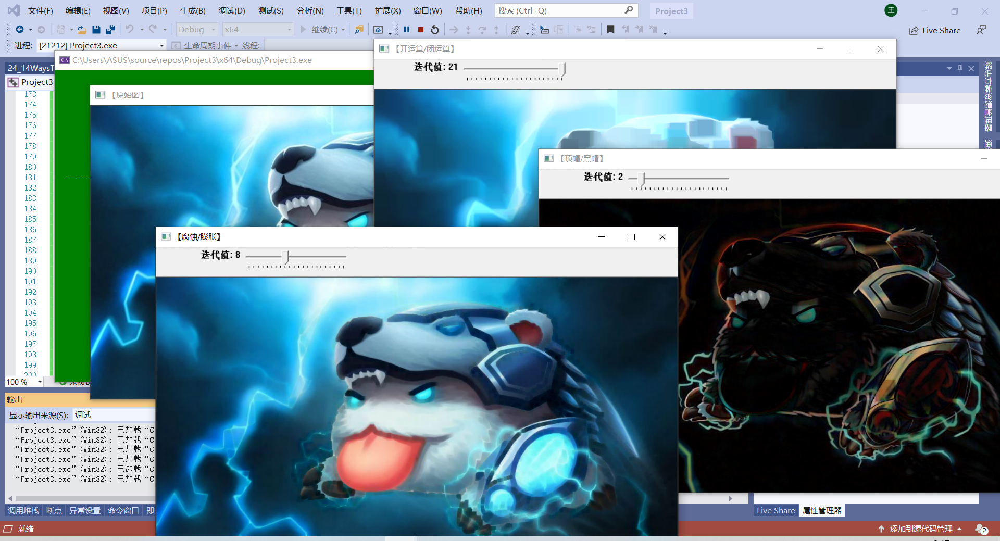
### 48_形态学图像处理综合示例

运行测试：
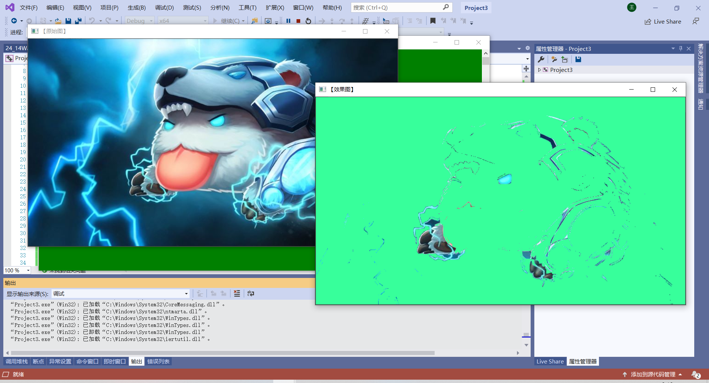
### 49_漫水填充floodFill函数用法示例
- 漫水填充的定义
	漫水填充法是一种用特定的颜色填充连通区域，通过设置可连通像素的上下限以及连通方式来达到不同的填充效果的方法。漫水填充经常被用来标记或分离图像的一部分，以便对其进行进一步处理或分析，也可以用来从输入图像获取掩码区域，掩码会加速处理过程，或只处理掩码指定的像素点，操作的结果总是某个连续的区域。

所谓漫水填充，简单来说，就是自动选中了和种子点相连的区域，接着将该区域替换成指定的颜色，这是个非常有用的功能，经常用来标记或者分离图像的一部分进行处理或分析。漫水填充也可以用来从输入图像获取掩码区域，掩码会加速处理过程，或者只处理掩码指定的像素点。
以此填充算法为基础，类似 PhotoShop的魔术棒选择工具就很容易实现了。漫水填充（FloodFill）是查找和种子点连通的颜色相同的点，魔术棒选择工具则是查找和种子点连通的颜色相近的点，把和初始种子像素颜色相近的点压进栈做为新种子。

运行测试：
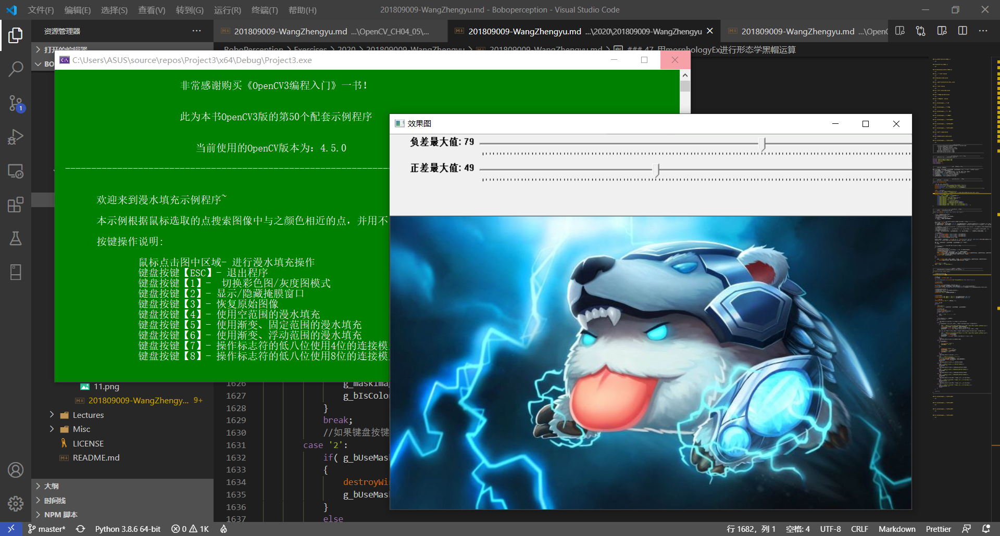
### 50_漫水填充算法综合示例

运行测试：
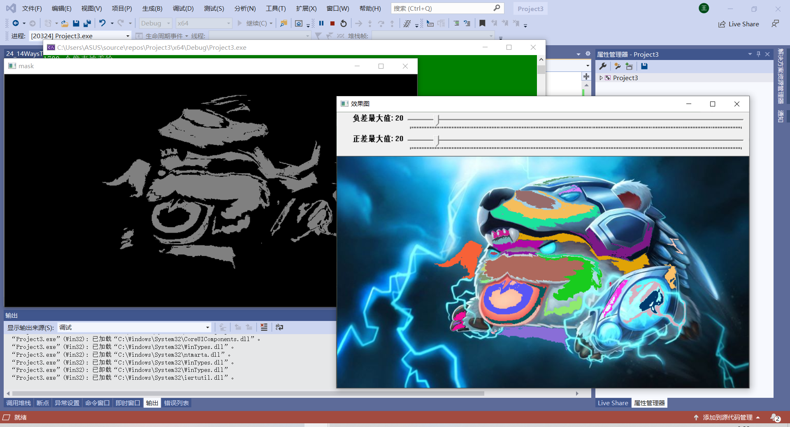
### 51_resize函数用法示例
resize函数的形式

void resize(InputArray src, OutputArray dst, Size dsize, double fx=0, double fy=0, int interpolation=INTER_LINEAR)  

参数说明：
src - 原图
dst - 目标图像。当参数dsize不为0时，dst的大小为size；否则，它的大小需要根据src的大小，参数fx和fy决定。dst的类型（type）和src图像相同
dsize - 目标图像大小
所以，参数dsize和参数(fx, fy)不能够同时为0
fx - 水平轴上的比例因子。
fy - 垂直轴上的比例因子。
最后一个参数插值方法，是默认值，放大时最好选 INTER_LINEAR ，缩小时最好选 INTER_AREA。

运行测试：

### 52_pyrUp函数用法示例

向上采样:pyrUp()函数
pyrUp()函数的作用是向上采样并模糊一张图像，说白了就是放大一张图片。C++: void pyrup(InputArray src,outputArraydst,const size&
dstsize=Size () , int borderType=BORDER_DEFAULT )
·第一个参数，InputArray类型的src，输入图像，即源图像，填Mat类的对象即可。
第二个参数，OutputArray类型的 dst，输出图像，和源图片有一样的尺寸和类型。
第三个参数，const Size&类型的dstsize，输出图像的大小;有默认值Size()，即默认情况下，由 Size ( src.cols*2，src.rows*2）来进行计算，且一直需要满足下列条件:
l dstsize.width-src.cols*2 |≤(dstsize.width mod2)l dstsize.height-src.rows*2 |≤(dstsize.heiht mod2)
·第四个参数，int类型的borderType，边界模式，一般不用去管它。
pyrUp函数执行高斯金字塔的采样操作,其实它也可以用于拉普拉斯金字塔的。首先，它通过插入可为零的行与列，对源图像进行向上取样操作，然后将结果与pyrDown()乘以4的内核做卷积。

运行测试：
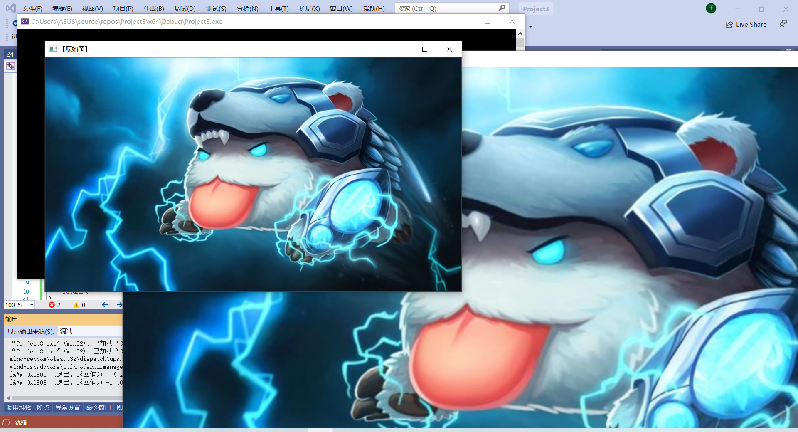
### 53_pyrDown函数用法示例
pyrDown()函数的作用是向下采样并模糊一张图片，说白了就是缩小一张图片。C++: void pyrDown(InputArray src,outputArray dst,const Size&
dstsize=Size(), int borderType=BORDER_DEFAULT)
·第一个参数，InputArray类型的src，输入图像，即源图像，填Mat类的对象即可。
第二个参数，OutputArray类型的 dst，输出图像，和源图片有一样的尺寸和类型。
·第三个参数，const Size&类型的dstsize，输出图像的大小;有默认值 Size()，即默认情况下，由 Size Size((src.cols+1)/2，(src.rows+1)/2)来进行计算，且一直需要满足下列条件:
l dstsize.width*2-src.cols |≤2dstsize.heigth*2-src.rows |≤2

运行测试：
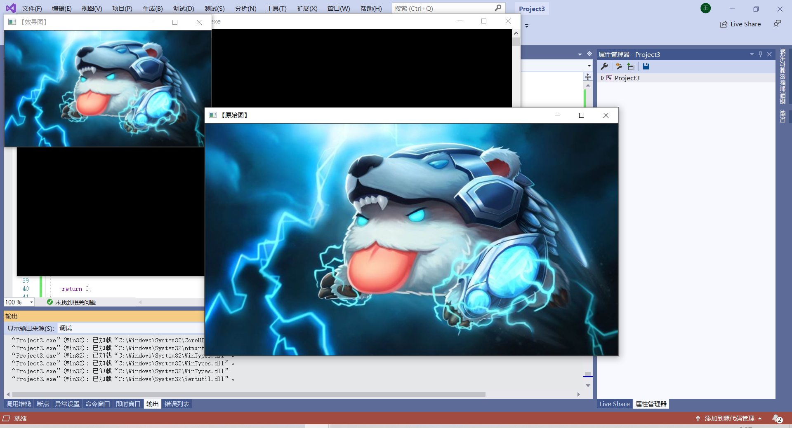
### 54_图像金字塔和resize综合示例

运行测试：
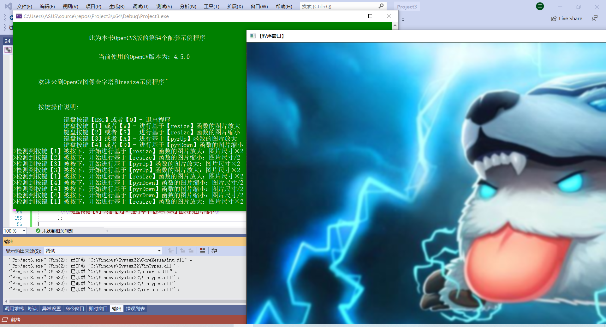
### 55_基本阈值操作
在对各种图形进行处理操作的过程中，我们常常需要对图像中的像素做出取舍与决策，直接剔除一些低于或者高于一定值的像素。
阈值可以被视作最简单的图像分割方法。比如，从一副图像中利用阈值分割出我们需要的物体部分(当然这里的物体可以是一部分或者整体)。这样的图像分割方法基于图像中物体与背景之间的灰度差异，而且此分割属于像素级的分割。为了从一副图像中提取出我们需要的部分，应该用图像中的每一个像素点的灰度值与选取的阙值进行比较，并作出相应的判断。注意:阈值的选取依赖于具体的问题。即物体在不同的图像中有可能会有不同的灰度值。
一旦找到了需要分割的物体的像素点，可以对这些像素点设定一些特定的值来表示。例如，可以将该物体的像素点的灰度值设定为“O”(黑色)，其他的像素点的灰度值为“255”(白色)。当然像素点的灰度值可以任意，但最好设定的两种颜色对比度较强，以方便观察结果。
在OpenCV 2.x中，Threshold()函数（基本阈值操作）和 adaptiveThreshold()函数（自适应阈值操作）可以完成这样的要求。它们的基本思想是:给定一个数组和一个阈值，然后根据数组中的每个元素的值是高于还是低于阈值而进行一些处理。
运行测试：
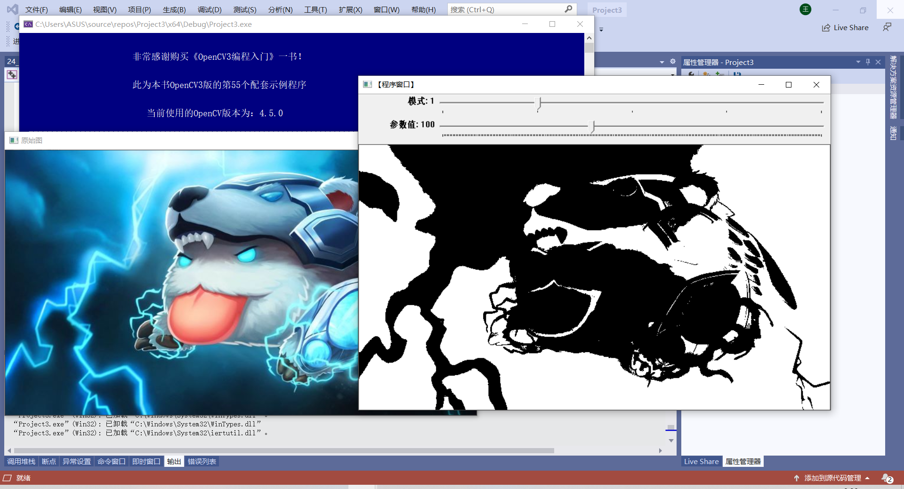

## CH07
7.1.1边缘检测的一般步骤

在具体介绍之前，先来一起看看边缘检测的一般步骤。
1. 【第一步】滤波
	边缘检测的算法主要是基于图像强度的一阶和二阶导数，但导数通常对噪声很敏感，因此必须采用滤波器来改善与噪声有关的边缘检测器的性能。常见的滤波方法主要有高斯滤波，即采用离散化的高斯函数产生一组归一化的高斯核，然后基于高斯核函数对图像灰度矩阵的每一点进行加权求和。
2. 【第二步】增强
	增强边缘的基础是确定图像各点邻域强度的变化值。增强算法可以将图像灰度点邻域强度值有显著变化的点凸显出来。在具体编程实现时，可通过计算梯度幅值来确定。
3. 【第三步】检测
	经过增强的图像，往往邻域中有很多点的梯度值比较大，而在特定的应用中，这些点并不是要找的边缘点，所以应该采用某种方法来对这些点进行取舍。实际工程中，常用的方法是通过阈值化方法来检测。
	另外，需要注意，下文中讲到的Laplacian算子、sobel算子和 Scharr算子都是带方向的，所以，示例中我们分别写了X方向、Y方向和最终合成的的效果图。

### 56_canny函数用法示例
1. canny 算子简介
	Canny边缘检测算子是John F.Canny于 1986年开发出来的一个多级边缘检测算法。更为重要的是，Canny 创立了边缘检测计算理论(Computational theoryofedge detection)，解释了这项技术是如何工作的。Canny边缘检测算法以Canny的名字命名，被很多人推崇为当今最优的边缘检测的算法。
	其中，Canny的目标是找到一个最优的边缘检测算法，让我们看一下最优边缘检测的三个主要评价标准。
	·低错误率:标识出尽可能多的实际边缘，同时尽可能地减少噪声产生的误报。
	·高定位性:标识出的边缘要与图像中的实际边缘尽可能接近。
	·最小响应:图像中的边缘只能标识一次，并且可能存在的图像噪声不应标识为边缘。
	为了满足这些要求，Canny使用了变分法，这是一种寻找满足特定功能的函数的方法。最优检测用4个指数函数项的和表示，但是它非常近似于高斯函数的一阶导数。
2. Canny边缘检测:Canny()函数
	Canny函数利用Canny 算子来进行图像的边缘检测操作。
```C++
 void Canny(InputArray image,outputArray edges，double threshold1,double threshold2，int aperturesize=3,bool L2gradient=false )
```
·第一个参数，InputArray类型的 image，输入图像，即源图像，填Mat类的对象即可，且需为单通道8位图像。
·第二个参数，OutputArray类型的edges，输出的边缘图，需要和源图片有一样的尺寸和类型。
·第三个参数，double类型的 threshold1，第一个滞后性阈值。第四个参数，double类型的threshold2，第二个滞后性阈值。
第五个参数，int类型的apertureSize，表示应用Sobel算子的孔径大小，其有默认值3。
第六个参数，bool类型的L2gradient，一个计算图像梯度幅值的标识，有默认值false。
需要注意的是，这个函数阈值1和阈值2两者中较小的值用于边缘连接，而较大的值用来控制强边缘的初始段，推荐的高低阈值比在2:1到3:1之间。

运行测试：
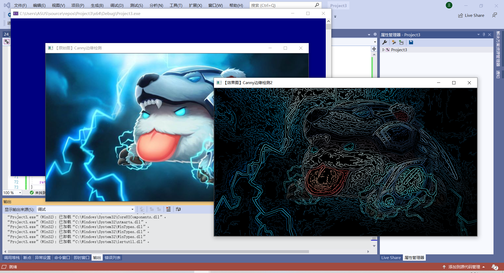
### 57_sobel函数用法示例
1. sobel算子的基本概念
	Sobel算子是一个主要用于边缘检测的离散微分算子(discrete differentiationoperator)。它结合了高斯平滑和微分求导，用来计算图像灰度函数的近似梯度。在图像的任何一点使用此算子，都将会产生对应的梯度矢量或是其法矢量。
2. 使用Sobel算子:Sobel()函数
	Sobel函数使用扩展的Sobel 算子，来计算一阶、二阶、三阶或混合图像差分。
```C++: 
void sobel (
InputArray src,outputArray dst,int ddepth,
int dx,
int dy,
int ksize=3,double scale=1,double delta=0 ,
int borderType=BORDER_DEFAULT );
```
(1）第一个参数，InputArray类型的src，为输入图像，填Mat类型即可。
(2）第二个参数，OutputArray类型的 dst，即目标图像，函数的输出参数，需要和源图片有一样的尺寸和类型。
(3）第三个参数，int类型的 ddepth，输出图像的深度，支持如下src.depth(和 ddepth的组合:
·若src.depth()= cV_8U，取 ddepth =-1/CV_16S/CV_32F/CV_64F·若 src.depth() = cV_16U/CV_16S，取 ddepth =-1/CV_32F/CV_64F·若src.depth( = CV_32F，取 ddepth=-1/CV_32F/CV_64F
·若src.depth(= cV_64F，取ddepth =-1/CV_64F
(4）第四个参数，int类型dx，x方向上的差分阶数。(5)第五个参数，int类型dy，y方向上的差分阶数。
(6）第六个参数，int类型ksize，有默认值3，表示Sobel核的大小;必须取1、3、5或7。
(7）第七个参数，double类型的scale，计算导数值时可选的缩放因子，默认值是1，表示默认情况下是没有应用缩放的。可以在文档中查阅 getDerivKernels的相关介绍，来得到这个参数的更多信息。
(8）第八个参数，double类型的delta，表示在结果存入目标图（第二个参数dst）之前可选的 delta 值，有默认值0。
(9）第九个参数，int类型的 borderType，边界模式，默认值为 BORDER_DEFAULT。这个参数可以在官方文档中 borderInterpolate处得到更详细的信息。
一般情况下，都是用ksize x ksize内核来计算导数的。然而，有一种特殊情况——当ksize为1时，往往会使用3x1或者1x 3的内核。且这种情况下，并没有进行高斯平滑操作。

运行测试：
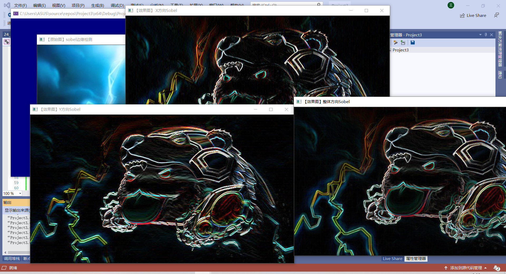
### 58_Laplacian函数用法示例
1. Laplacian算子简介
	Laplacian 算子是n维欧几里德空间中的一个二阶微分算子，定义为梯度grad的散度div。因此如果f是二阶可微的实函数。
2. 计算拉普拉斯变换: Laplacian()函数
	Laplacian函数可以计算出图像经过拉普拉斯变换后的结果。
```C++:
 void Laplacian(InputArray src,outputArray dst, int ddepth,intksize=1, double scale=1, double delta=0 ,
intborderType=BORDER_DEFAULT );
```
·第一个参数，InputArray类型的 image，输入图像，即源图像，填Mat类的对象即可，且需为单通道8位图像。
·第二个参数，OutputArray类型的edges，输出的边缘图，需要和源图片有一样的尺寸和通道数。
·第三个参数，int类型的ddept，目标图像的深度。
·第四个参数，int类型的ksize，用于计算二阶导数的滤波器的孔径尺寸，大小必须为正奇数，且有默认值1。
·第五个参数，double类型的scale，计算拉普拉斯值的时候可选的比例因子，有默认值1。
第六个参数，double类型的delta，表示在结果存入目标图(第二个参数dst)之前可选的delta值，有默认值0。
·第七个参数，int类型的 borderType，边界模式，默认值为BORDERDEFAULT。这个参数可以在官方文档中 borderInterpolate()处得到更详细的信息。

运行测试：

### 59_Scharr函数用法示例
计算图像差分:Scharr()函数
使用Scharr 滤波器运算符计算x或y方向的图像差分。其实它的参数变量和Sobel基本上是一样的，除了没有ksize核的大小。
```C++: 
void scharr(
InputArray src,//源图outputArray dst,//目标图int ddepth,//图像深度
int dx, il x方向上的差分阶数int dy , i ly方向上的差分阶数double scale=1,//缩放因子double delta=0,l/ delta值
intborderType=BORDER_DEFAULT )//边界模式
```
(1）第一个参数，InputArray类型的src，为输入图像，填Mat类型即可。
(2）第二个参数，OutputArray类型的 dst，即目标图像，函数的输出参数，需要和源图片有一样的尺寸和类型。
(3）第三个参数，int类型的ddepth，输出图像的深度，支持如下src.depth()和 ddepth的组。
运行测试：
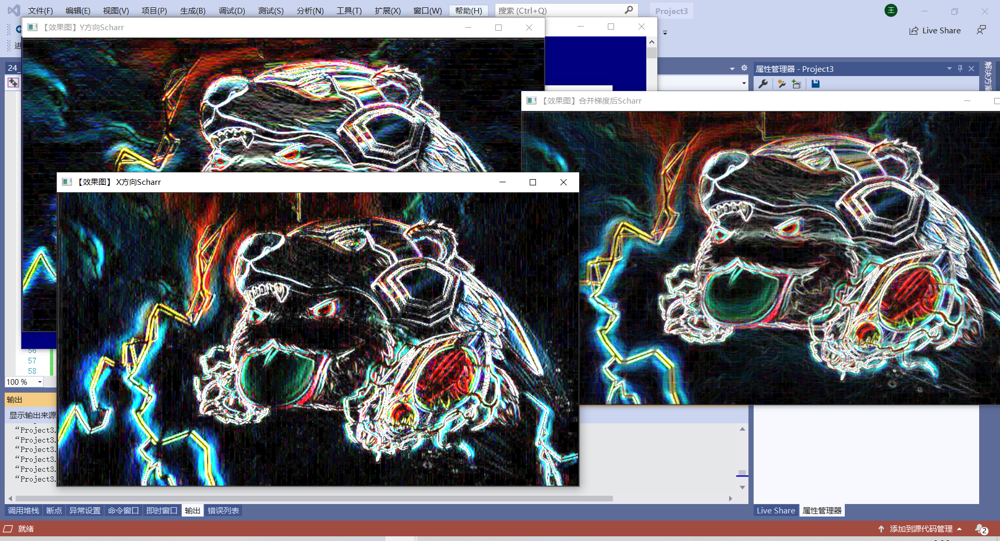
### 60_边缘检测综合示例

运行测试：
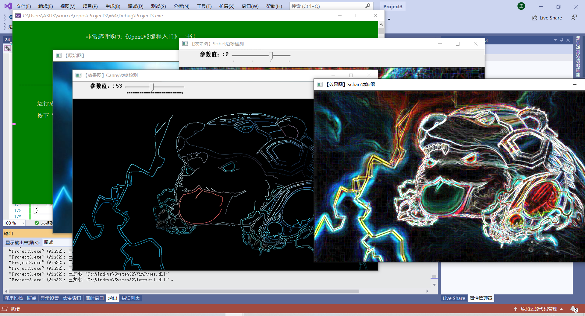
### 61_HoughLines函数用法示例
霍夫线变换是一种用来寻找直线的方法.在使用霍夫线变换之前,首先要对图像进行边缘检测的处理，即霍夫线变换的直接输入只能是边缘二值图像。
OpenCV支持三种不同的霍夫线变换，它们分别是:标准霍夫变换(StandardHough Transform,SHT)、多尺度霍夫变换(Multi-Scale Hough Transform，MSHT)和累计概率霍夫变换（Progressive Probabilistic Hough Transform，PPHT)。
其中，多尺度霍夫变换（MSHT）为经典霍夫变换(SHT)在多尺度下的一个变种。而累计概率霍夫变换(PPHT)算法是标准霍夫变换（SHT)算法的一个改进，它在一定的范围内进行霍夫变换，计算单独线段的方向以及范围，从而减少计算量，缩短计算时间。之所以称PPHT为“概率”的，是因为并不将累加器平面内的所有可能的点累加，而只是累加其中的一部分，该想法是如果峰值如果足够高，只用一小部分时间去寻找它就够了。按照猜想，可以实质性地减少计算时间。
在OpenCV中，可以用HoughLines函数来调用标准霍夫变换（SHT)和多尺度霍夫变换（MSHT)。
而HoughLinesP函数用于调用累计概率霍夫变换 PPHT。累计概率霍夫变换执行效率很高，所有相比于HoughLines函数，我们更倾向于使用HoughLinesP函数。
总结一下，OpenCV中的霍夫线变换有如下三种:
标准霍夫变换(StandardHough Transform，SHT)，由 HoughLines 函数调用。多尺度霍夫变换（Multi-ScaleHough Transform，MSHT)，由 HoughLines函数调用。
累计概率霍夫变换(ProgressiveProbabilistic Hough Transform，PPHT)，由HoughLinesP函数调用。


运行测试：
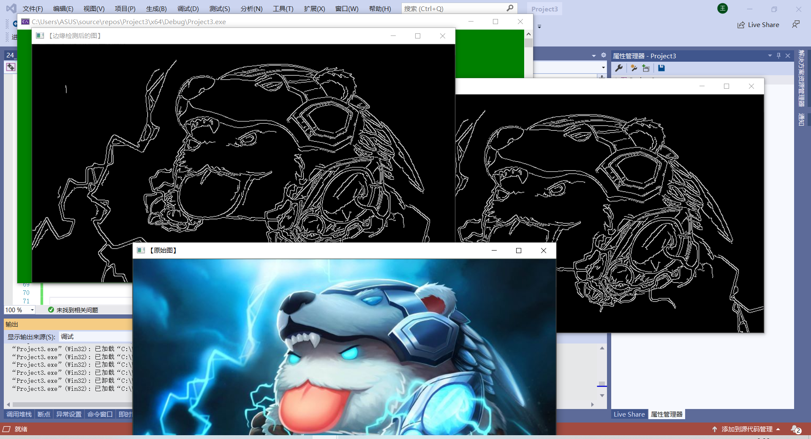
### 62_HoughLinesP函数用法示例
此函数在HoughLines的基础上，在末尾加了一个代表 Probabilistic(概率)的P，表明它可以采用累计概率霍夫变换（PPHT）来找出二值图像中的直线。
C++: void HoughLinesP (InputArray image，outputArray lines,double rho,double theta, int threshold,double minLineLength=0,double
maxLineGap=o )
·第一个参数，InputArray类型的 image，输入图像，即源图像。需为8位的单通道二进制图像，可以将任意的源图载入进来后由函数修改成此格式后，再填在这里。
·第二个参数，InputArray类型的 lines，经过调用HoughLinesP函数后存储
了检测到的线条的输出矢量,每一条线由具有4个元素的矢量(x_1,y_1,x_2,y_2)表示，其中，(x_1,y_1)和(x_2,y_2)是是每个检测到的线段的结束点。·第三个参数，double类型的rho，以像素为单位的距离精度。另一种表述方式是直线搜索时的进步尺寸的单位半径。
·第四个参数，double类型的theta，以弧度为单位的角度精度。另一种表述方式是直线搜索时的进步尺寸的单位角度。
·第五个参数，int类型的 threshold，累加平面的阈值参数，即识别某部分为图中的一条直线时它在累加平面中必须达到的值。大于阈值 threshold的线段才可以被检测通过并返回到结果中。
·第六个参数，double类型的 minLineLength，有默认值0，表示最低线段的长度，比这个设定参数短的线段就不能被显现出来。
·第七个参数，double类型的 maxLineGap，有默认值0，允许将同一行点与点之间连接起来的最大的距离。

运行测试：
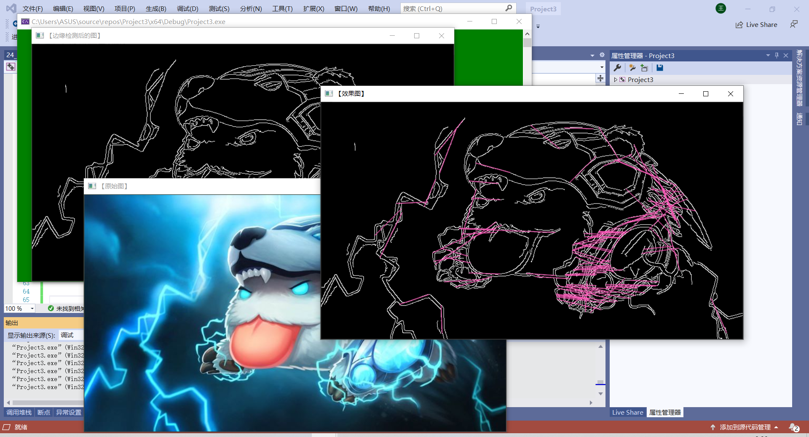
### 63_HoughCircles函数用法示例
HoughCircles函数可以利用霍夫变换算法检测出灰度图中的圆。它相比之前的HoughLines和 HoughLinesP，比较明显的一个区别是不需要源图是二值的，而HoughLines和 HoughLinesP都需要源图为二值图像。
```C++: 
void Houghcircles(InputArray image,outputArray circles,int method,double dp,double minDist，double paraml=100, double param2=100，intminRadius=0, int maxRadius=0 )
```
·第一个参数，InputArray类型的 image，输入图像，即源图像，需为8位的灰度单通道图像。
第二个参数，InputArray类型的circles，经过调用HoughCircles 函数后此参数存储了检测到的圆的输出矢量，每个矢量由包含了3个元素的浮点矢量(x,y,radius)表示。
第三个参数，int类型的method，即使用的检测方法，目前OpenCV中就霍夫梯度法一种可以使用，它的标识符为HOUGH_GRADIENT (OpenCV2中可写作CV_HOUGH_GRADIENT)，在此参数处填这个标识符即可。
第四个参数，double类型的dp，用来检测圆心的累加器图像的分辨率于输入图像之比的倒数，且此参数允许创建一个比输入图像分辨率低的累加器。例如，如果dp=1时，累加器和输入图像具有相同的分辨率。如果dp=2，累加器便有输入图像一半那么大的宽度和高度。
第五个参数，double类型的 minDist，为霍夫变换检测到的圆的圆心之间的最小距离，即让算法能明显区分的两个不同圆之间的最小距离。这个参数如果太小的话，多个相邻的圆可能被错误地检测成了一个重合的圆。反之，这个参数设置太大，某些圆就不能被检测出来。
·第六个参数，double类型的 paraml，有默认值100。它是第三个参数method设置的检测方法的对应的参数。对当前唯一的方法霍夫梯度法

运行测试：
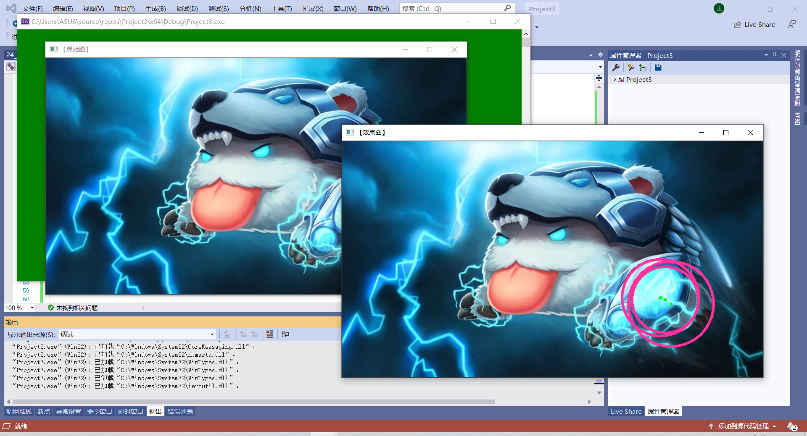
### 64_霍夫线变换综合示例

运行测试：
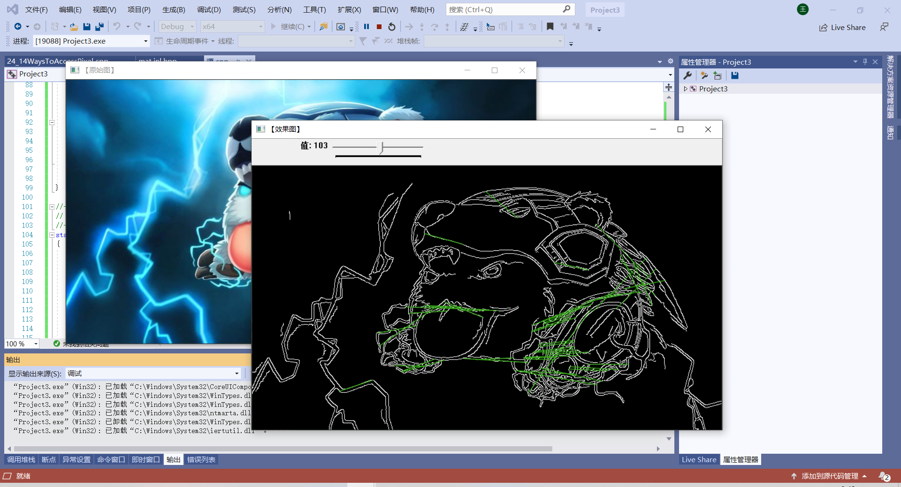
### 65_remap函数用法示例
重映射,就是把一幅图像中某位置的像素放置到另一个图片指定位置的过程。为了完成映射过程，需要获得一些插值为非整数像素的坐标，因为源图像与目标图像的像素坐标不是一一对应的。一般情况下，我们通过重映射来表达每个像素的位置(x,y)，像这样:
g(x,y)= f ( h(x,y))
在这里，g()是目标图像，f()是源图像，而h(x,y)是作用于(x,y)的映射方法函数。来看个例子。若有一幅图像I，对其按照下面的条件作重映射:
h(x,y) = (1.cols - x,y )
图像会按照x轴方向发生翻转。

运行测试：
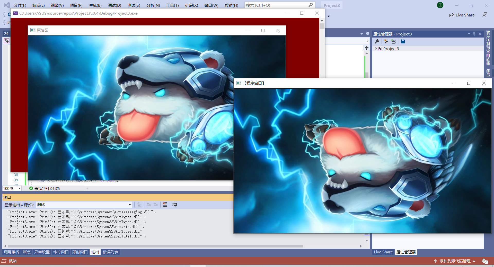
### 66_实现多种重映射综合示例

运行测试：
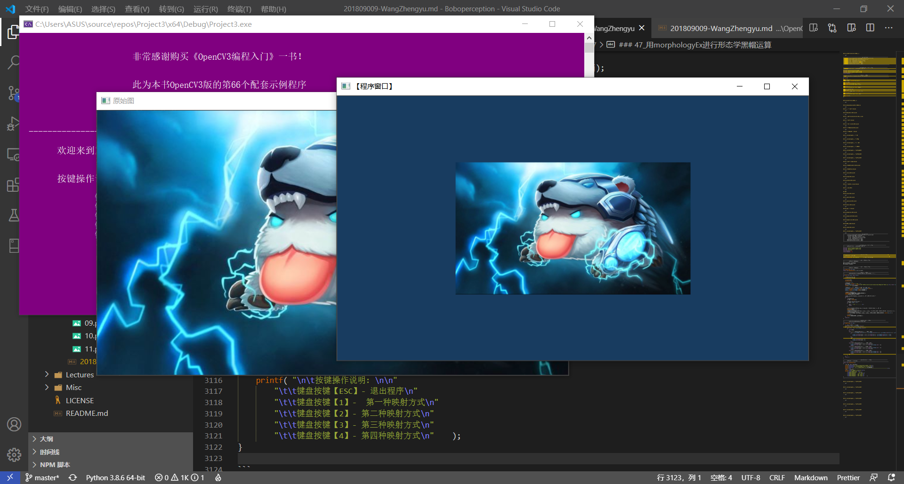

### 67_仿射变换综合示例
仿射变换（Affine Transformation或 Affine Map)，又称仿射映射，是指在几何中，一个向量空间进行一次线性变换并接上一个平移，变换为另一个向量空间的过程。它保持了二维图形的“平直性”(直线经过变换之后依然是直线〉和“平行性”(二维图形之间的相对位置关系保持不变，平行线依然是平行线，且直线上点的位置顺序不变)。
一个任意的仿射变换都能表示为乘以一个矩阵（线性变换）接着再加上一个向量（平移）的形式。
那么，我们能够用仿射变换来表示如下三种常见的变换形式:·旋转，rotation(线性变换)
· 平移，translation(向量加)·缩放，scale(线性变换)
进行更深层次的理解，仿射变换代表的是两幅图之间的一种映射关系。而我们通常使用2x3的矩阵来表示仿射变换。

运行测试：
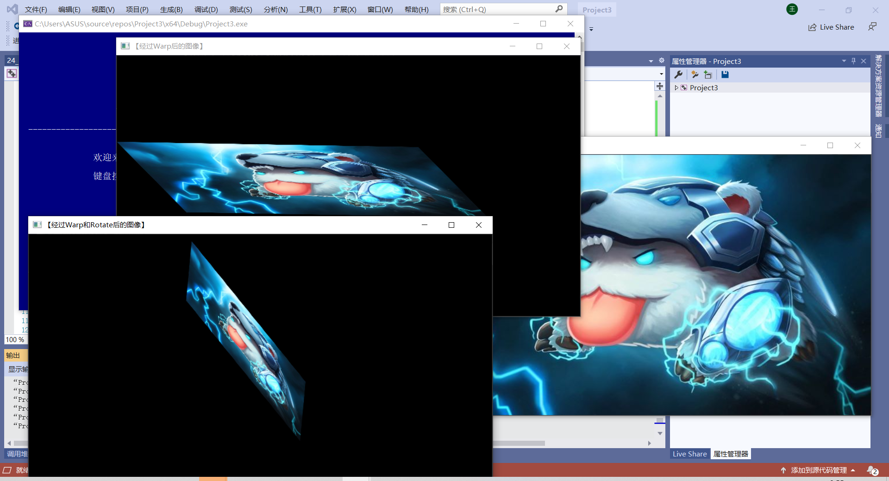
### 68_直方图均衡化
直方图均衡化是通过拉伸像素强度分布范围来增强图像对比度的一种方法。
均衡化处理后的图像只能是近似均匀分布。均衡化图像的动态范围扩大了，
但其本质是扩大了量化间隔，而量化级别反而减少了，因此，原来灰度不同的象素经处理后可能变的相同，形成了一片相同灰度的区域，各区域之间有明显的边界，从而出现了伪轮廓。
在原始图像对比度本来就很高的情况下，如果再均衡化则灰度调和，对比度会降低。在泛白缓和的图像中，均衡化会合并一些象素灰度，从而增大对比度。均衡化后的图片如果再对其均衡化，则图像不会有任何变化。

运行测试：
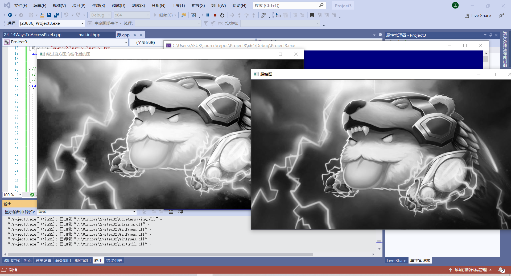
## CH08

### 69_基础轮廓查找
findContours()函数用于在二值图像中寻找轮廓。
```C++:
 void findContours(InputoutputArray image，outputArrayofArrayscontours，outputArray hierarchy, int mode,int method，Point offset=Point ())
```
·第一个参数，InputArray类型的image，输入图像，即源图像，填Mat类的对象即可，且需为8位单通道图像。图像的非零像素被视为1，О像素值被保留为0，所以图像为二进制。我们可以使用compare()、inrange()、threshold()、adaptivethreshold()、cannyO)等函数由灰度图或彩色图创建二进制图像。此函数会在提取图像轮廓的同时修改图像的内容。
第二个参数，OutputArrayOfArrays类型的contours、检测到的轮廓、函数调用后的运算结果存在这里。每个轮廓存储为一个点向量，即用point类型的vector表示。
第三个参数，OutputArray类型的hierarchy，可选的输出向量，包含图像的拓扑信息。其作为轮廓数量的表示,包含了许多元素。每个轮廓contours[ i ]对应4个hierarchy元素hierarchy[ i ][ o ]一hierarchy[ i ][ 3]，分别表示后一个轮廓、前一个轮廓、父轮廓、内嵌轮廓的索引编号。如果没有对应项，对应的hierarchy[i]值设置为负数。
第四个参数，int类型的 mode，轮廓检索模式.

运行测试：
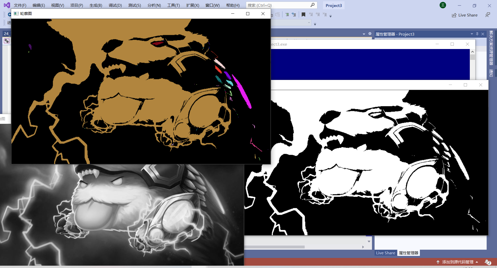
### 70_查找并绘制轮廓综合示例

运行测试：
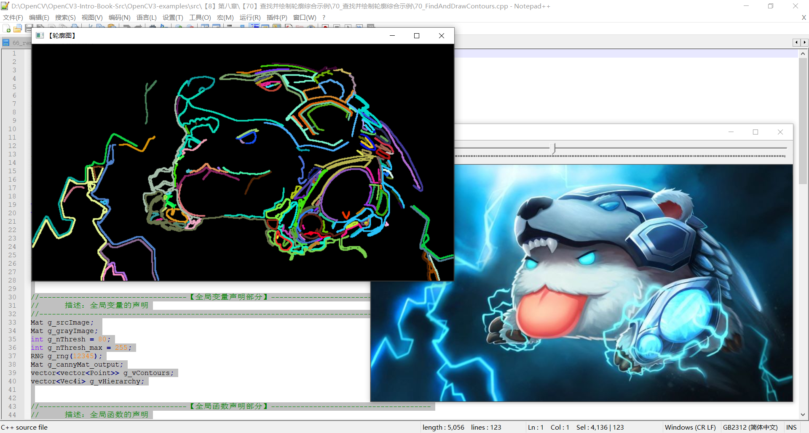
### 71_凸包检测基础
凸包(Convex Hull）是一个计算几何（图形学）中常见的概念。简单来说，给定二维平面上的点集，凸包就是将最外层的点连接起来构成的凸多边型，它是能包含点集中所有点的。理解物体形状或轮廓的一种比较有用的方法便是计算一个物体的凸包，然后计算其凸缺陷(convexity defects)。很多复杂物体的特性能很好地被这种缺陷表现出来。

运行测试：
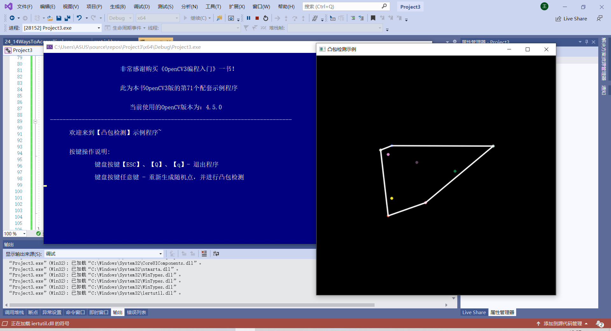
### 72_寻找和绘制物体的凸包
上文已经提到过，convexHull()函数用于寻找图像点集中的凸包，其原型声明如下。
```C++
 void convexHull(InputArray points,outputArray hull,boolclockwise=false,bool returnPoints=true )
```
第一个参数，InputArray类型的 points，输入的二维点集，可以填Mat类型或者std::vectoro
·第二个参数，OutputArray类型的 hull，输出参数，函数调用后找到的凸包。·第三个参数，bool类型的clockwise，操作方向标识符。当此标识符为真时，输出的凸包为顺时针方向。否则，就为逆时针方向。并且是假定坐标系的x轴指向右，y轴指向上方。
第四个参数，bool类型的returnPoints，操作标志符，默认值 true。当标志符为真时，函数返回各凸包的各个点。否则，它返回凸包各点的指数。当输出数组是std::vector 时，此标志被忽略。

运行测试：
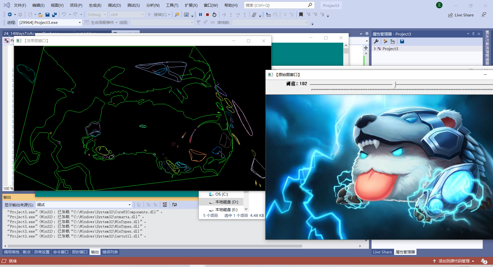
### 73_创建包围轮廓的矩形边界
返回外部矩形边界:boundingRect(函数
此函数计算并返回指定点集最外面（ up-right）的矩形边界。
```C++
Rect boundingRect (InputArray points)
```
其唯一的一个参数为输入的二维点集，可以是 std::vector 或 Mat类型。

运行测试：
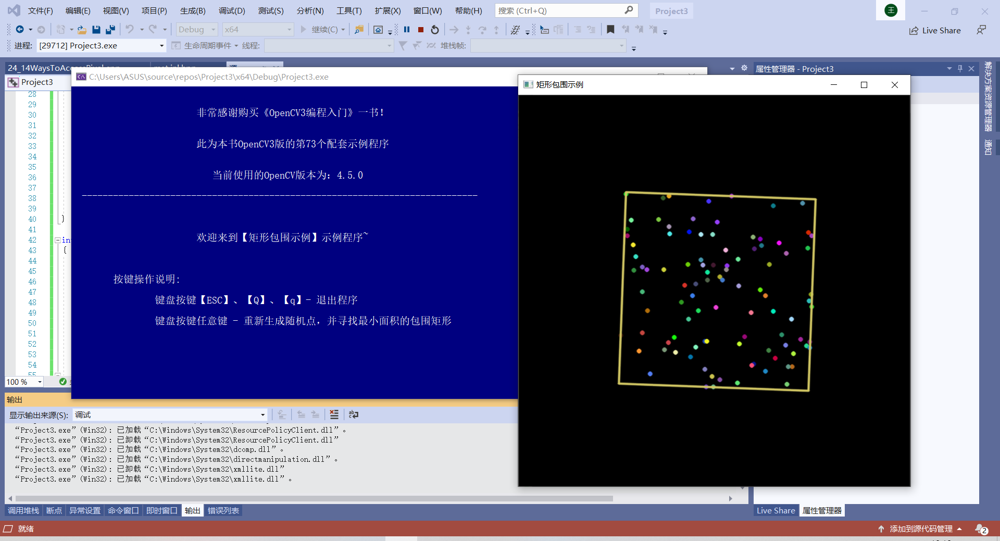
### 74_创建包围轮廓的圆形边界
寻找最小包围圆形: minEnclosingCircle(函数
minEnclosingCircle函数的功能是利用一种迭代算法，对给定的2D点集，去寻找面积最小的可包围它们的圆形。
```C++  
void minEnclosingCircle (InputArray points,Point2f& center,float&radius)
```
第一个参数, InputArray类型的points,输入的二维点集,可以为std::vector<>
或Mat类型。
第二个参数，Point2f&类型的center，圆的输出圆心。·第三个参数，float&类型的radius，圆的输出半径。

运行测试：
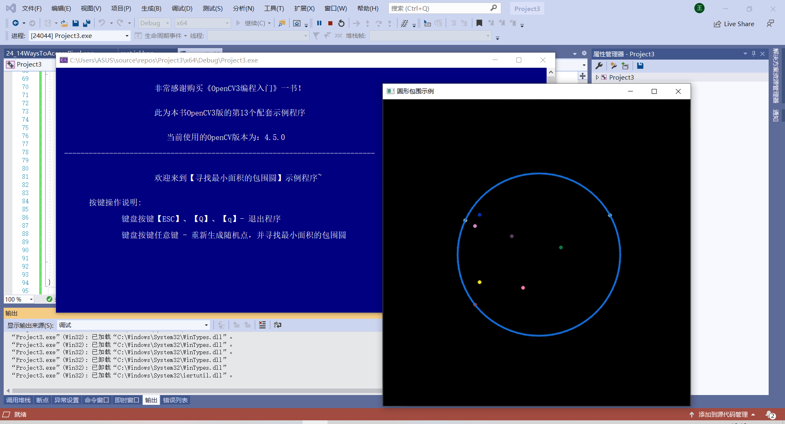
### 75_创建包围轮廓的矩形和圆形边界框

运行测试：

### 76_查找和绘制图片轮廓矩
用椭圆拟合二维点集:fitEllipse()函数
此函数的作用是用椭圆拟合二维点集。
```C++
RotatedRect fitEllipse (InputArray points)
```
其唯一的一个参数为输入的二维点集，可以为std::vector>或Mat类型。
逼近多边形曲线: approxPolyDPO函数
approxPolyDP函数的作用是用指定精度逼近多边形曲线。
```C++
 void approxPolyDP (InputArray curve，outputArray approxCurve,double epsilon,bool closed)
 ```
·第一个参数，InputArray类型的curve，输入的二维点集，可以为std:vecto或Mat类型。
·第二个参数，OutputArray类型的approxCurve，多边形逼近的结果，其类型应该和输入的二维点集的类型一致。
·第三个参数，double类型的epsilon，逼近的精度，为原始曲线和即近似曲线间的最大值。
第四个参数，bool类型的 closed，如果其为真，则近似的曲线为封闭曲线(第一个顶点和最后一个顶点相连)，否则，近似的曲线曲线不封闭。

运行测试：
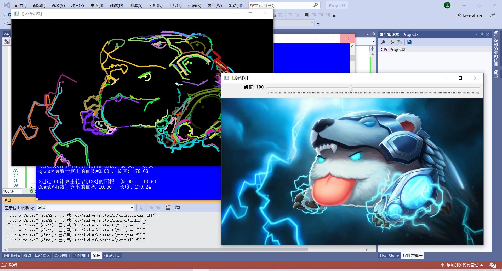
### 77_分水岭算法
在许多实际运用中，我们需要分割图像，但无法从背景图像中获得有用信息。分水岭算法 ( watershed algorithm）在这方面往往是非常有效的。此算法可以将图像中的边缘转化成“山脉”，将均匀区域转化为“山谷”，这样有助于分割目标。
分水岭算法，是一种基于拓扑理论的数学形态学的分割方法，其基本思想是把图像看作是测地学上的拓扑地貌，图像中每一点像素的灰度值表示该点的海拔高度，每一个局部极小值及其影响区域称为集水盆，而集水盆的边界则形成分水岭。分水岭的概念和形成可以通过模拟浸入过程来说明:在每一个局部极小值表面，刺穿一个小孔，然后把整个模型慢慢浸入水中，随着浸入的加深，每一个局部极小值的影响域慢慢向外扩展，在两个集水盆汇合处构筑大坝，即形成分水岭。
分水岭的计算过程是一个迭代标注过程。分水岭比较经典的计算方法是由L. Vincent提出的。在该算法中，分水岭计算分两个步骤:一个是排序过程，一个是淹没过程。首先对每个像素的灰度级进行从低到高的排序，然后在从低到高实现淹没的过程中，对每一个局部极小值在h阶高度的影响域采用先进先出(FIFO）结构进行判断及标注。分水岭变换得到的是输入图像的集水盆图像，集水盆之间的边界点，即为分水岭。显然，分水岭表示的是输入图像的极大值点。
也就是说，分水岭算法首先计算灰度图像的梯度;这对图像中的“山谷”或没有纹理的“盆地”(亮度值低的点）的形成是很有效的，也对“山头”或图像中有主导线段的“山脉”(山脊对应的边缘)的形成有效。然后开始从用户指定点(或者算法得到点）开始持续“灌注”盆地直到这些区域连成一片。基于这样产生的标记就可以把区域合并到0一起，合并后的区域又通聚集的方式进行分割，好像图像被“填充”起来一样。

运行测试：
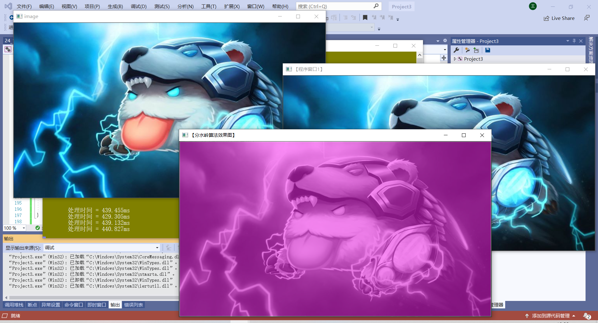
### 78_图像修补
在实际应用中，我们的图像常常会被噪声腐蚀，这些噪声或者是镜头上的灰尘或水滴，或者是旧照片的划痕，或者由于图像的部分本身已经损坏。而“图像修复”(Inpainting)，就是妙手回春，解决这些问题的良方。图像修复技术简单来说，就是利用那些已经被破坏区域的边缘，即边缘的颜色和结构，繁殖和混合到损坏的图像中，以达到图像修补的目的。

运行测试：
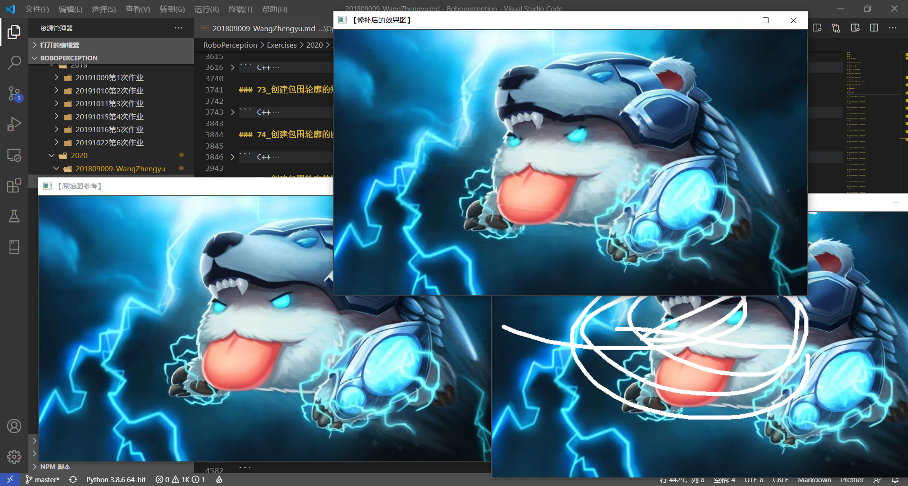
### 79_H-S二维直方图的绘制
其实，简单点说，直方图就是对数据进行统计的一种方法，并且将统计值组织到一系列事先定义好的 bin当中。其中，bin为直方图中经常用到的一个概念，可翻译为“直条”或“组距”，其数值是从数据中计算出的特征统计量，这些数据可以是诸如梯度、方向、色彩或任何其他特征。且无论如何，直方图获得的是数据分布的统计图。通常直方图的维数要低于原始数据。总而言之，直方图是计算机视觉中最经典的工具之一。
在统计学中，直方图（Histogram）是一种对数据分布情况的图形表示，是一种二维统计图表,它的两个坐标分别是统计样本和该样本对应的某个属性的度量。
我们在图像变换的那一章中讲过直方图的均衡化，它是通过拉伸像素强度分布范围来增强图像对比度的一种方法。大家在自己的心目中应该已经对直方图有一定的理解和认知。下面就来看一看对图像直方图比较书面化的解释。
图像直方图（Image Histogram）是用以表示数字图像中亮度分布的直方图，标绘了图像中每个亮度值的像素数。可以借助观察该直方图了解需要如何调整亮度分布。这种直方图中，横坐标的左侧为纯黑、较暗的区域，而右侧为较亮、纯白的区域。因此，一张较暗图片的图像直方图中的数据多集中于左侧和中间部分，而整体明亮、只有少量阴影的图像则相反。计算机视觉领域常借助图像直方图来实现图像的二值化。
直方图的意义如下。
直方图是图像中像素强度分布的图形表达方式。·它统计了每一个强度值所具有的像素个数。

运行测试：
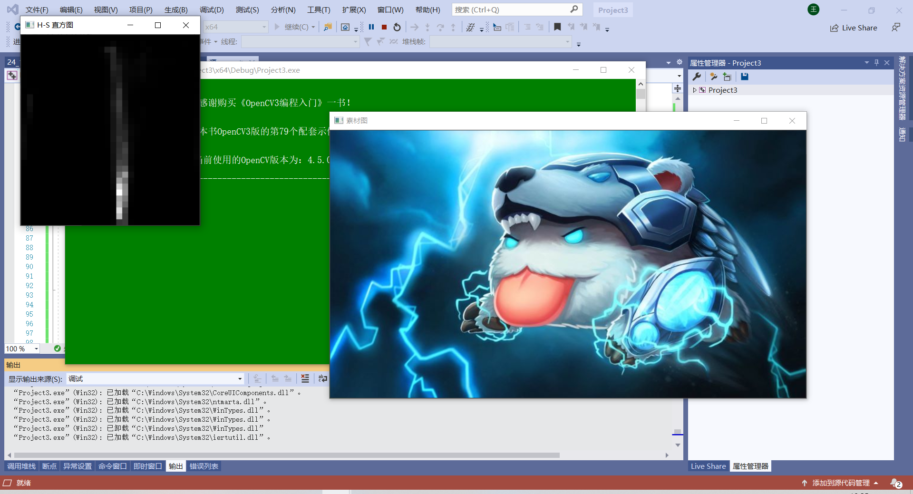
### 80_一维直方图的绘制
minMaxLoc()函数的作用是在数组中找到全局最小值和最大值。它有两个版本的原型，在此介绍常用的那一个版本。
```C++
void minMaxLoc(InputArray src，double* minval，double* maxVal=0,Point* minLoc=0，Point* maxLoc=0，InputArray mask=noArray ( ) )
```
·第一个参数，InputArray类型的src，输入的单通道阵列。
·第二个参数，double*类型的minVal，返回最小值的指针。若无须返回，此值置为NULL。
·第三个参数，double*类型的 max Val，返回的最大值的指针。若无须返回，此值置为NULL。
第四个参数，Point*类型的minLoc，返回最小位置的指针（二维情况下)。若无须返回，此值置为NULL。
·第五个参数，Point*类型的maxLoc，返回最大位置的指针（二维情况下)。若无须返回，此值置为NULL。
·第六个参数，InputArray类型的 mask，用于选择子阵列的可选掩膜。

运行测试：
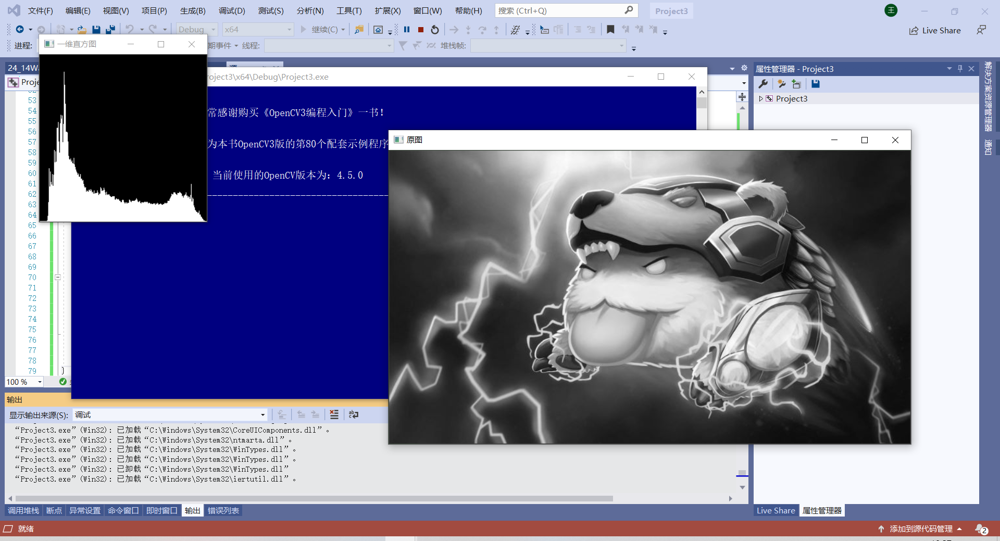
### 81_RGB三色直方图的绘制

运行测试：
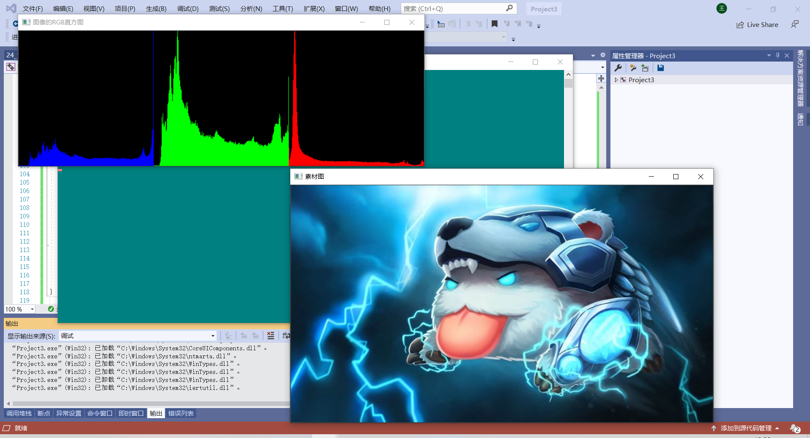
### 82_直方图对比
对于直方图来说，一个不可或缺的工具便是用某些具体的标准来比较两个直方图的相似度。要对两个直方图（比如说H和H）进行比较，首先必须选择一个衡量直方图相似度的对比标准（d(H ,Hz))。在OpenCV 2.X中，我们用compareHist()函数来对比两个直方图的相似度，而此函数的返回值就是d(H,Hz)。

运行测试：

### 83_反向投影
如果一幅图像的区域中显示的是一种结构纹理或者一个独特的物体，那么这个区域的直方图可以看作一个概率函数，其表现形式是某个像素属于该纹理或物体的概率。
而反向投影（back projection）就是一种记录给定图像中的像素点如何适应直方图模型像素分布方式的一种方法。
简单的讲，所谓反向投影就是首先计算某一特征的直方图模型，然后使用模型去寻找图像中存在的该特征的方法。

运行测试：
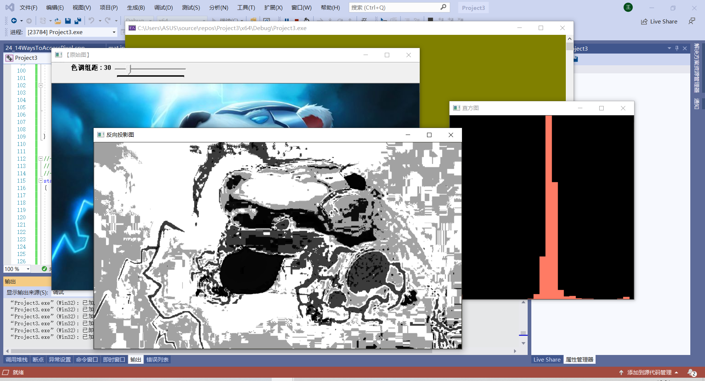

### 84_模板匹配

模板匹配是一项在一幅图像中寻找与另一幅模板图像最匹配（相似）部分的技术。在 OpenCV2和 OpenCV3中，模板匹配由MatchTemplate()函数完成。需要注意，模板匹配不是基于直方图的，而是通过在输入图像上滑动图像块，对实际的图像块和输入图像进行匹配的一种匹配方法。

运行测试：
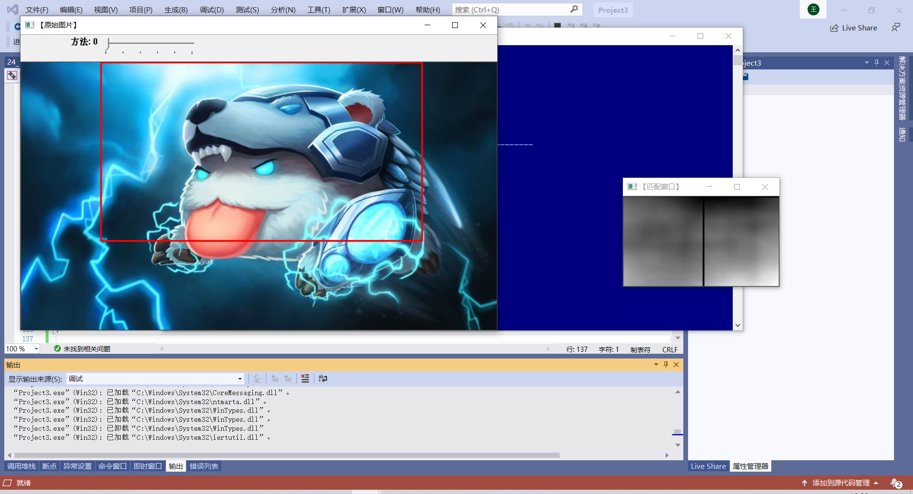

## CH09

### 85_cornerHarris函数用法示例

1. 兴趣点与角点

在图像处理和与计算机视觉领域，兴趣点（ interest points)，也被称作关键点(key points)、特征点( feature points)。它被大量用于解决物体识别、图像识别、图像匹配、视觉跟踪、三维重建等一系列的问题。我们不再观察整幅图，而是选择某些特殊的点，然后对它们进行局部有的放矢地分析。如果能检测到足够多的这种点，同时它们的区分度很高，并且可以精确定位稳定的特征，那么这个方法就具有实用价值。
图像特征类型可以被分为如下三种:
·边缘
·角点(感兴趣关键点)
·斑点(Blobs)(感兴趣区域)
其中，角点是个很特殊的存在。如果某一点在任意方向的一个微小变动都会引起灰度很大的变化，那么我们就把它称之为角点。角点作为图像上的特征点，包含有重要的信息，在图像融合和目标跟踪及三维重建中有重要的应用价值。它们在图像中可以轻易地定位，同时，在人造物体场景，比如门、窗、桌等处也随处可见。因为角点位于两条边缘的交点处，代表了两个边缘变化的方向上的点，所以它们是可以精确定位的二维特征，甚至可以达到亚像素的精度。又由于其图像梯度有很高的变化，这种变化是可以用来帮助检测角点的。需要注意的是，角点与位于相同强度区域上的点不同，与物体轮廓上的点也不同，因为轮廓点难以在相同的其他物体上精确定位。
另外，关于角点的具体描述可以有如下几种:
·一阶导数(即灰度的梯度)的局部最大所对应的像素点;·两条及两条以上边缘的交点;
·图像中梯度值和梯度方向的变化速率都很高的点;
角点处的一阶导数最大，二阶导数为零，它指示了物体边缘变化不连续的方向。

运行测试：
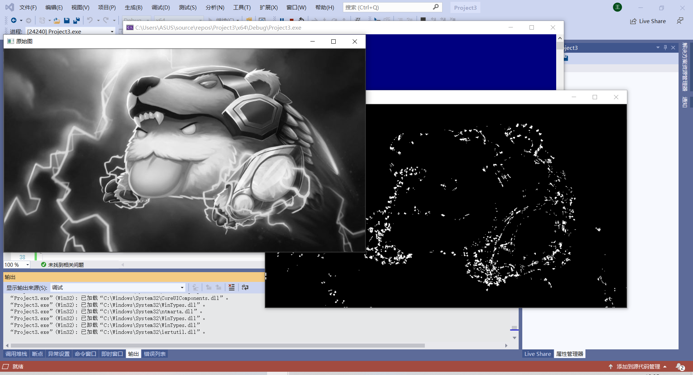

### 86_Harris角点检测

harris角点检测是一种直接基于灰度图像的角点提取算法，稳定性高，尤其对L型角点检测精度高。但由于采用了高斯滤波，运算速度相对较慢，角点信息有丢失和位置偏移的现象，而且角点提取有聚簇现象。

运行测试：
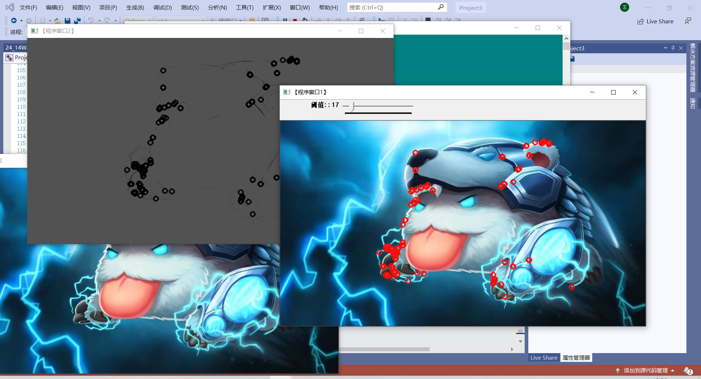

### 87_Shi-Tomasi角点检测

Shi-Tomasi角点检测概述
除了利用Harris进行角点检测之外，我们通常还可以利用Shi-Tomasi方法进行角点检测。Shi-Tomasi算法是Harris 算法的改进，此算法最原始的定义是将矩阵M的行列式值与M的迹相减，再将差值同预先给定的阈值进行比较。后来Shi和Tomasi提出改进了方法，若两个特征值中较小的一个大于最小阈值，则会得到强角点。
由于Shi-Tomasi算子是1994年在文章《Good Features to Track》中被提出的,OpenCV实现此算法的函数名便定义为goodFeaturesToTrack。下面我们来看看此函数的用法。

运行测试：
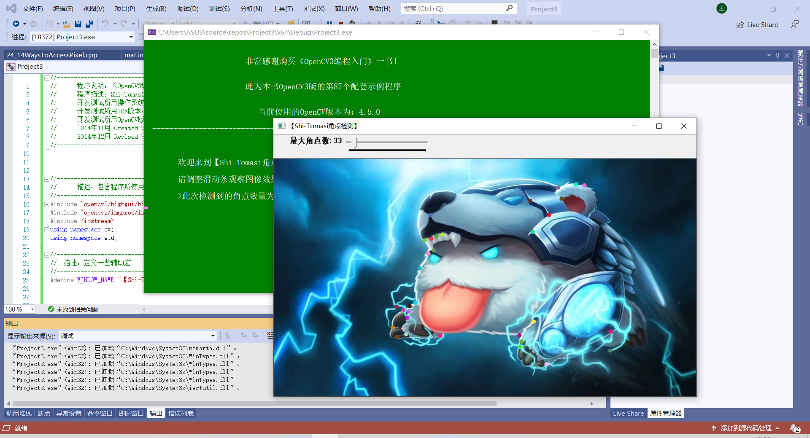

### 88_亚像素级角点检测

若我们进行图像处理的目的不是提取用于识别的特征点而是进行几何测量，这通常需要更高的精度，而函数 goodFeaturesToTrack()只能提供简单的像素的坐标值，也就是说，有时候会需要实数坐标值而不是整数坐标值。
亚像素级角点检测的位置在摄像机标定、跟踪并重建摄像机的轨迹，或者重建被跟踪目标的三维结构时，是一个基本的测量值。

运行测试：
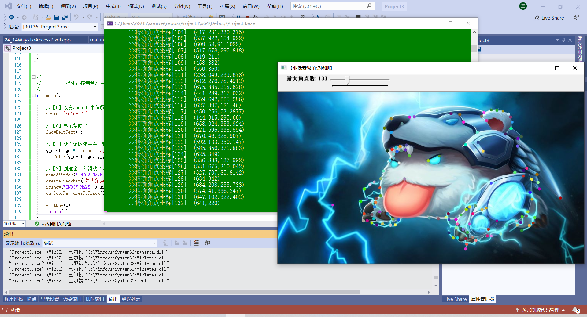


## 总结

CH06中学习了各种利用OpenCV进行图像处理的方法。包括属于线性滤波的方框滤波、均值滤波与高斯滤波，属于非线性滤波的中值滤波、双边滤波;两种基本形态学操作——膨胀与腐蚀;5种高级形态学滤波操作——开运算、闭运算、形态学梯度、顶帽以及黑帽;还有漫水填充算法、图像金字塔、图像缩放、阈值化。涉及到的内容可谓非常丰富。相信学完此章的内容，我对OpenCV的了解已经上了一个层次。

CH07中学习了很多类型的图像变换方法。包括利用OpenCV进行边缘检测所用到的canny 算子、sobel算子，Laplace算子以及 scharr滤波器;进行图像特征提取的霍夫线变换、霍夫圆变换，重映射和仿射变换以及直方图均衡化。

CH08中先学习了查找轮并绘制轮廓，然后学习了如何寻找到物体的凸包，接着是使用多边形来包围轮廓，以及计算一个图像的矩。在本章后面几节，还学习了分水岭算法和图像修补操作的实现方法。

CH09中学习了广泛运用于很多计算机视觉运用当中的直方图,而简单点说，直方图就是对数据进行统计的一种方法。然后还讲到了反向投影和模板匹配。所谓反向投影就是首先计算某一特征的直方图模型，最后使用模型去寻找图像中存在的该特征的方法。而模板匹配是一项在一幅图像中寻找与另一幅模板图像最匹配（相似）部分的技术。

## 心得

通过这几章的学习，让我对OpenCV有了一个全面的了解，同样我还有一些不足，因为时间的短暂，我还没有彻底的研究透代码，等后面空闲下来后，逐个的研究代码，这肯定会对我对OpenCV的理解有更大的帮助。


