# CH06-CH09的学习笔记

## CH06 图像处理

### 6.1线性滤波:方框滤波、均值滤波、高斯滤波

#### 6.1.1平滑处理

平滑处理(smoothing）也称模糊处理(bluring)，是一种简单且使用频率很高的图像处理方法。平滑处理的用途有很多，最常见的是用来减少图像上的噪点或者失真。在涉及到降低图像分辨率时，平滑处理是非常好用的方法。

#### 6.1.2图像滤波与滤波器

- 定义：在尽量保留图像细节特征的条件下对目标图像的噪声进行抑制，是图像预处理不可缺少的操作
- 消除图像中的噪声成分叫作图像的平滑化或滤波操作。
- 目的：
1.抽出对象的特征作为图像识别的特征模式（模糊）;
2.为适应图像处理的要求，消除图像数字化时所混入的噪声。（消除噪音）

- 种类如下：
1.方框滤波———BoxBlur函数（线性）
2.均值滤波(邻域平均滤波）——Blur函数（线性）
3.高斯滤波———GaussianBlur 函数（线性）
4.中值滤波———medianBlur函数（非线性）
5.双边滤波bilateralFilter 函数（非线性）

#### 6.1.3线性滤波器的简介
几种常见的线性滤波器如下。
- 低通滤波器:允许低频率通过;
- 高通滤波器:允许高频率通过;
- 带通滤波器:允许一定范围领率通过;
- 带阻滤波器:阻止一定范围须率通过并且允许其他频率通过;
- 全通滤波器:允许所有频率通过，仅仅改变相位关系;
- 陷波滤波器（Band-Stop Filter):阻止一个狭窄频率范围通过，是一种特殊带阻滤波器。

#### 6.1.4滤波和模糊

- 滤波是将信号中特定波段频率滤除的操作，是抑制和防止干扰的一项重要措施。

- 低通就是模糊，高通就是锐化

- 高斯滤波是用高斯函数作为滤波函数的滤波操作

- 高斯模糊就是高斯低通滤波

#### 6.1.5 邻域算子与线性邻域站波

- 邻域算子（局部算子）是利用给定像素周围的像素值的决定此像素的最终输出值的一种算子。而线性邻域滤波就是一种常用的邻域算子，像素的输出值取决于输入像素的加权和

- 作用：用于局部色调调整以外，还可以用于图像滤波，实现图像的平滑和锐化等

#### 6.1.6 方框滤波（ box Filter )
```
函数原型如下。
C++: void boxFilter(InputArray src,outputArray dst,int ddepth，sizeksize，Point anchor=Point (-1,-1 ), booinormalize=true, int
borderType=BORDER_DEFAULT ,
```
- InputArray类型的src,输入图像，图片深度为CV_8u,CV_16U,CV_16S,CV_32F,CV_64F
- OutputArray类型的dst，需要和源图片有一样的尺寸和类型
- int类型的ddepth输出图像的深度，-1表示使用原图的深度.
-  Size类型的ksize，内核的大小
。
- Point类型的anchor，表示锚点(平滑的点)，Point(-1,-1)表示取核的中心为锚点
- bool类型的normalize，默认值为 true，一个标识符
表示内在是否被其区域归一化
- int类型的borderType,
推断图像外部像素的某种边界模式

函数运行截图如下图所示：
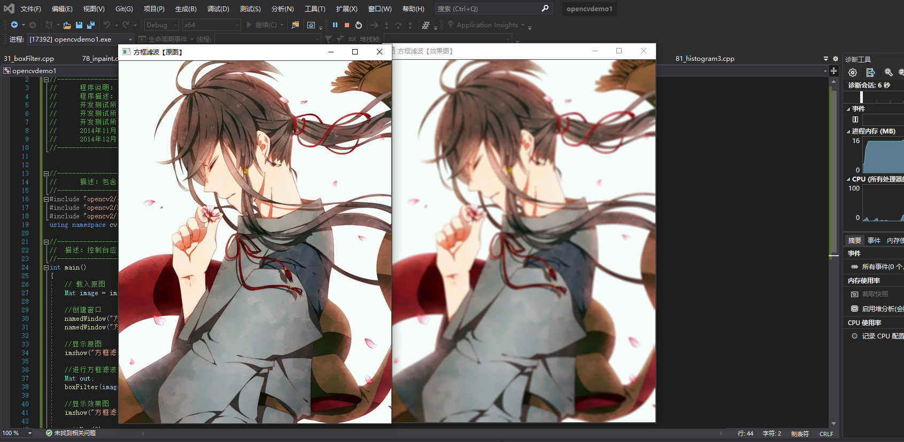

#### 6.1.7均值滤波（blur）
定义：用一片图像区域的各个像素的均值来代替原图像中的各个像素值
缺点：让图像变得模糊

函数运行截图如下图所示：
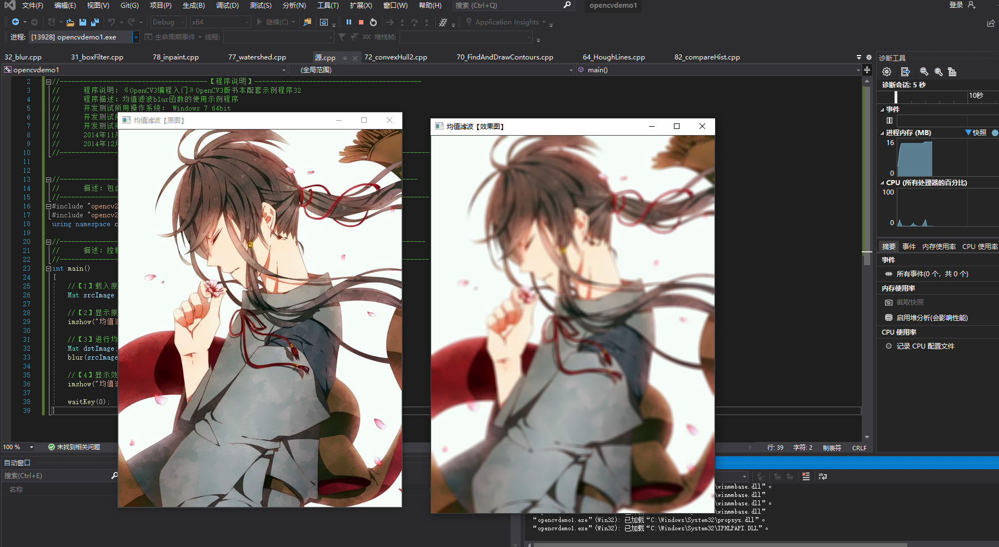

#### 6.1.8高斯滤波（GaussianBlur）
定义：一种线性平滑滤波，对整幅图像进行加权平均
具体操作：用一个模板（或称卷积、掩模）扫描图像中的每一个像素，用模板确定的邻域内像素的加权平均灰度值去替代模板中心像素点的值。
视觉效果：就像是经过一个半透明屏幕在观察图像

函数运行截图如下图所示：
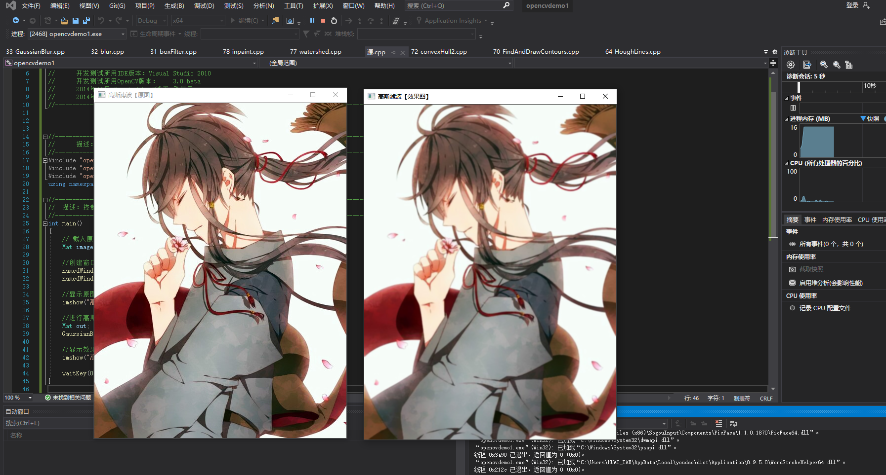

#### 6.1.9 图像线性滤波综合示例

函数运行截图如下图所示：
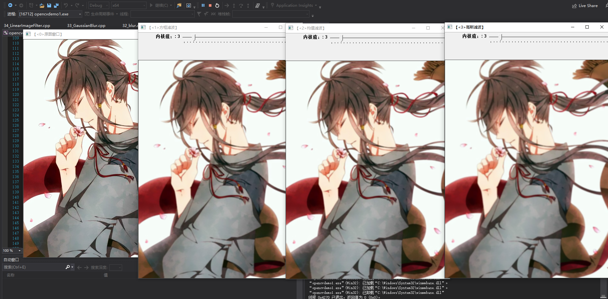

### 6.2非线性滤波:中值滤波、双边滤波

#### 6.2.1非线性滤波概述
每个像素的输出值是一些输入像素的加权和。线性滤波器易于构造，并且易于从频率响应角度来进行分析。
在很多情况下，使用邻域像素的非线性滤波会得到更好的效果。比如在噪声是散粒噪声而不是高斯噪声，即图像偶尔会出现很大的值的时候，用高斯滤波器对图像进行模糊的话，噪声像素是不会被去除的，它们只是转换为更为柔和但仍然可见的散粒。这就到了中值滤波登场的时候了。

#### 6.2.2中值滤波
定义：中值滤波（Median filter）是一种典型的非线性滤波技术，基本思想是用像素点邻域灰度值的中值来代替该像素点的灰度值，该方法在去除脉冲噪声、椒盐噪声的同时又能保留图像的边缘细节。

函数运行截图如下图所示：
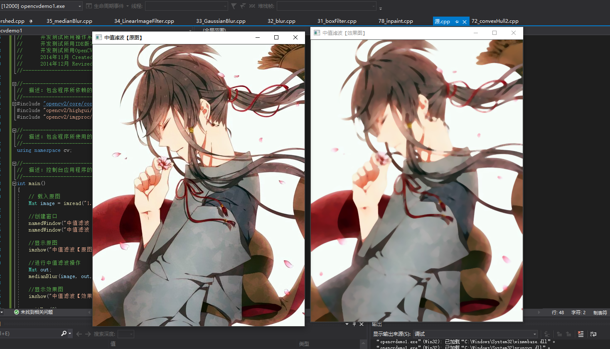

#### 6.2.3 双边滤波
定义：双边滤波(Bilateral filter）是一种非线性的滤波方法，是结合图像的空间邻近度和像素值相似度的一种折中处理，同时考虑空域信息和灰度相似性，达到保边去噪的目的,具有简单、非迭代、局部的特点。


函数运行截图如下图所示：
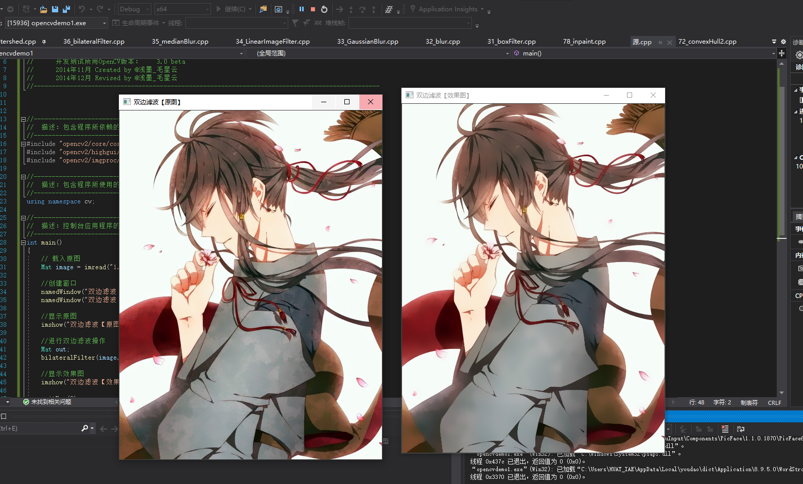

#### 6.2.4 OpenCV中的5种图像滤波综合示例


函数运行截图如下图所示：
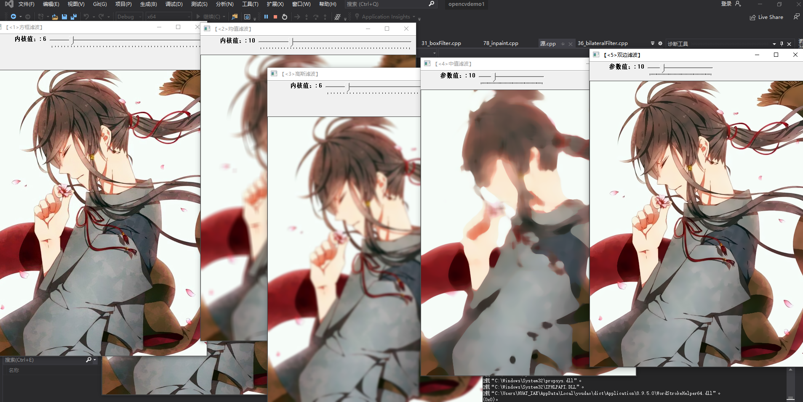

### 6.3 形态学滤波( 1):腐蚀与膨胀

#### 6.3.1什么是形态学？
定义：简单来讲，形态学操作就是基于形状的一系列图像处理操作。OpenCV为进行图像的形态学变换提供了快捷、方便的函数。最基本的形态学操作有两种，分别是:膨胀（dilate）与腐蚀(crode)。
膨胀与腐蚀能实现多种多样的功能，主要如下。
- 消除噪声;
- 分割（ isolate）出独立的图像元素，在图像中连接(join）相邻的元素;
-  寻找图像中的明显的极大值区域或极小值区域;
- 求出图像的梯度。

#### 6.3.2膨胀
定义：膨胀（dilate）就是求局部最大值的操作。从数学角度来说，膨胀或者腐蚀操作就是将图像（或图像的一部分区域，称之为A）与核（称之为B）进行卷积。
核可以是任何形状和大小，它拥有一个单独定义出来的参考点，我们称其为锚点( anchorpoint)。多数情况下，核是一个小的，中间带有参考点和实心正方形或者圆盘。其实，可以把核视为模板或者掩码。
而膨胀就是求局部最大值的操作。核B与图形卷积，即计算核B覆盖的区域的像素点的最大值，并把这个最大值赋值给参考点指定的像素。这样就会使图像中的高亮区域逐渐增长，如图6.20所示。这就是膨胀操作的初衷。

函数运行截图如下图所示：
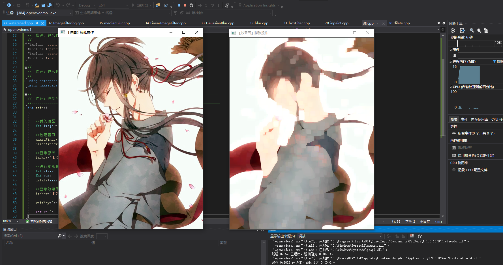

#### 6.3.3 腐蚀
定义：求局部最小值的操作


函数运行截图如下图所示：
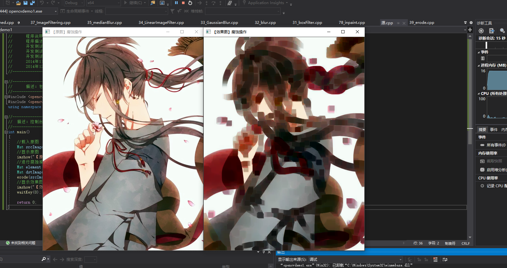

### 6.4 形态学滤波（2）开运算、闭运算、形态学梯度、顶帽和黑帽
morphologyEx函数，它利用基本的膨胀和腐蚀技术，来执行更加高级的形态学变换，如开闭运算、形态学梯度、“顶帽”、黑帽”
#### 6.4.1 开运算
定义：开运算（Opening Operation)，其实就是先腐蚀后膨胀的过程。其数学表达式如下:
dst=open (src,element) =dilate(erode (src,element )

函数运行截图如下图所示：
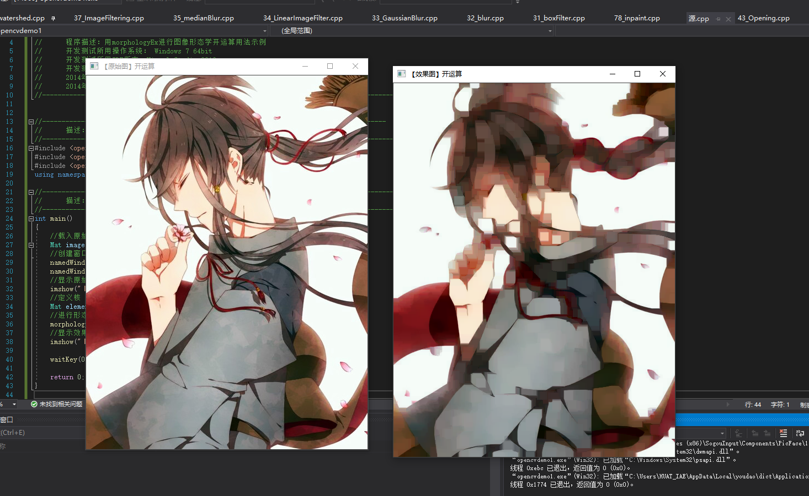

#### 6.4.2 闭运算
定义：先膨胀后腐蚀的过程称为闭运算(Closing Operation)，其数学表达式如下:dst=clese(src,element)= erode(dilate(src,element) )

函数运行截图如下图所示：
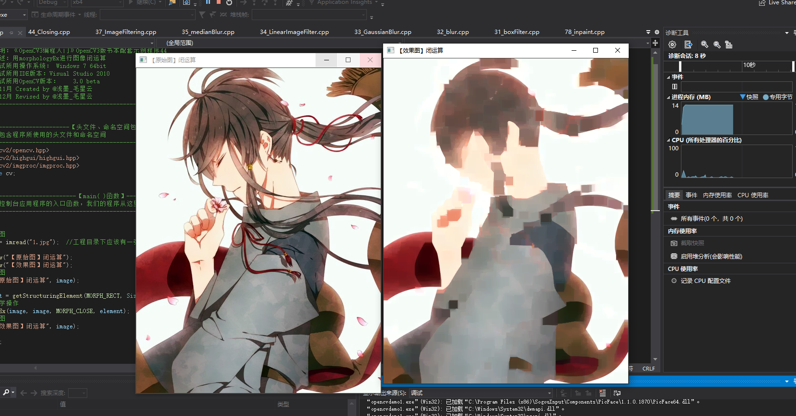

#### 6.4.3形态学梯度
定义：形态学梯度(Morphological Gradient）是膨胀图与腐蚀图之差，数学表达式如下:
dst=morph-grad(src,element) = dilate (src,element)- erode (src,element)
 
 函数运行截图如下图所示：
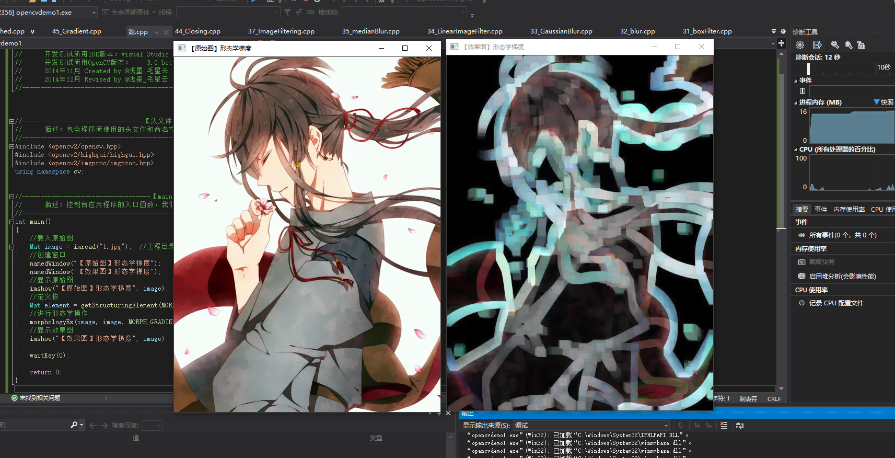

#### 6.4.4 顶帽
顶帽运算(Top Hat）又常常被译为”礼帽“运算，是原图像与上文刚刚介绍的“开运算”的结果图之差，数学表达式如下:
dst=tophat (src,element)-src-open(src,element )

 函数运行截图如下图所示：
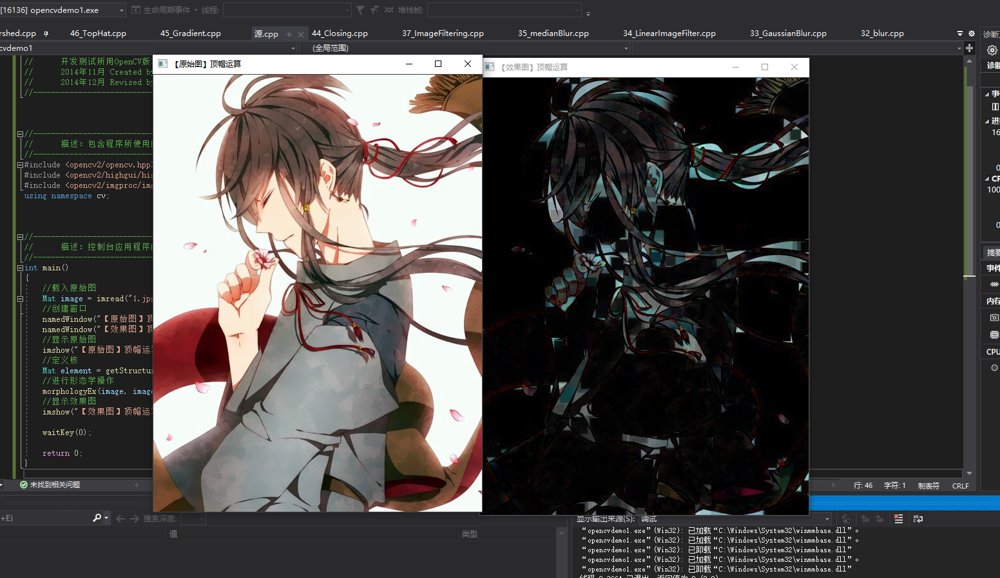

#### 6.4.5黑帽
黑帽(Black Hat）运算是闭运算的结果图与原图像之差。数学表达式为;dst-blackhat isrc,element ) -close (src,element)- src

函数运行截图如下图所示：
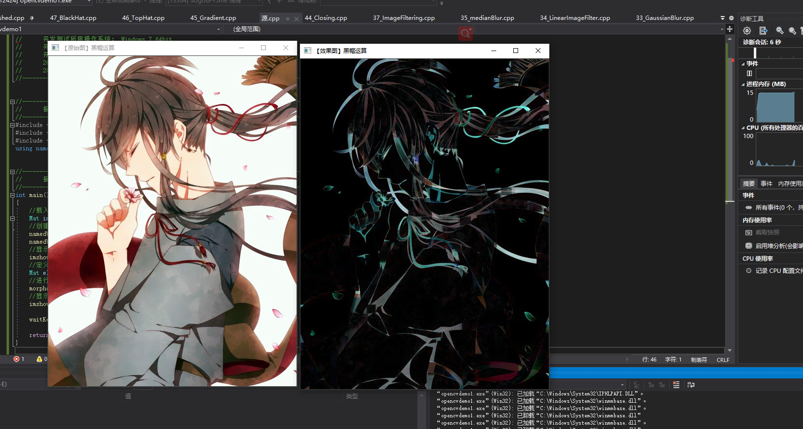

### 6.5 漫水填充
定义：漫水填充法是一种用特定的颜色填充连通区域，通过设置可连通像素的上下限以及连通方式来达到不同的填充效果的方法。漫水填充经常被用来标记或分离图像的一部分，以便对其进行进一步处理或分析，也可以用来从输入图像获取掩码区域，掩码会加速处理过程，或只处理掩码指定的像素点，操作的结果总是某个连续的区域。

函数运行截图如下图所示：
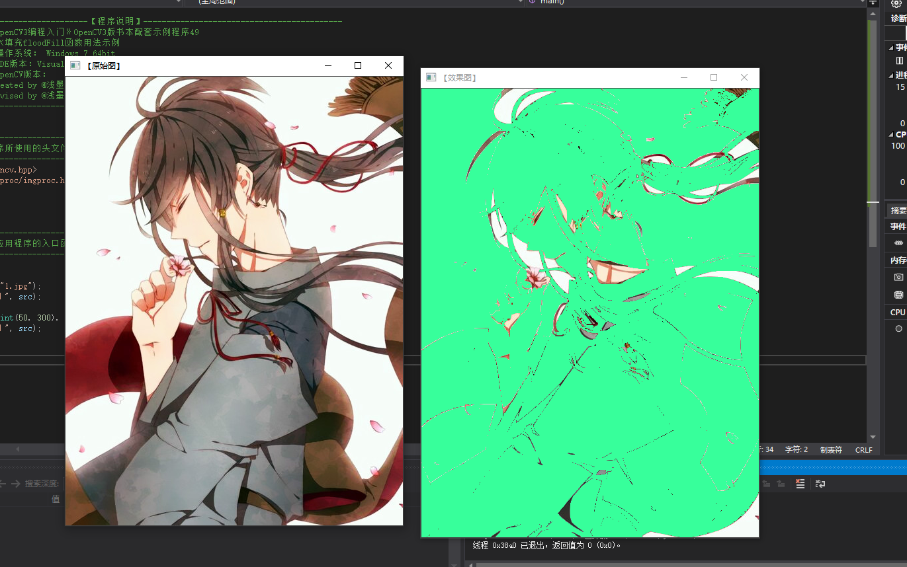

### 6.6  图像金字塔与图片尺寸缩放

尺寸缩放：1.resize函数
         2.pyrUp函数
         3.pyrDown函数
  
resize函数运行截图如下图所示：
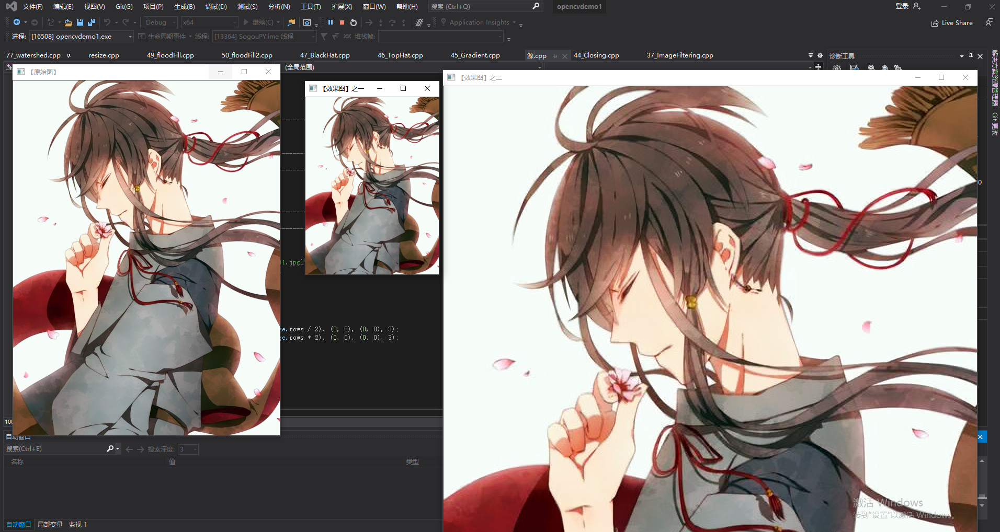

pyrUp函数运行截图如下图所示：
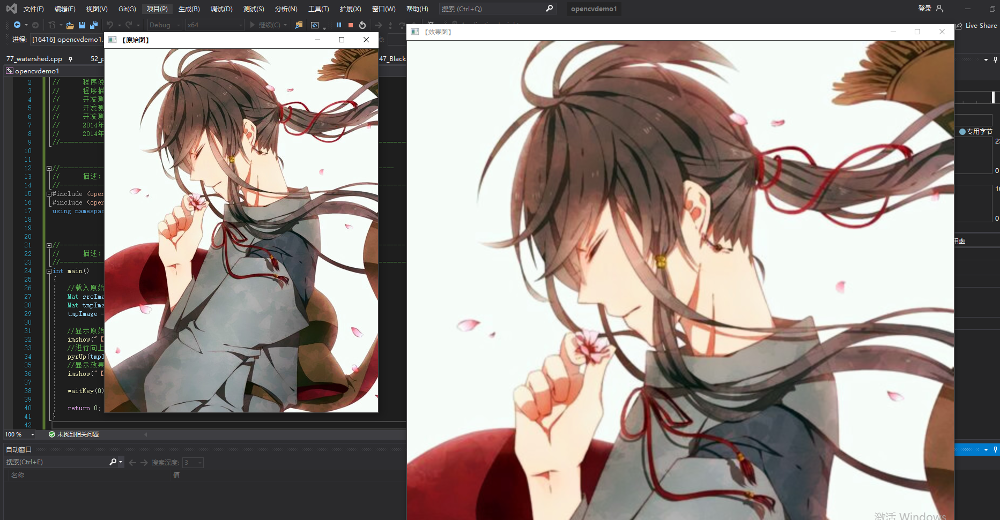

pyrDown函数运行截图如下图所示：
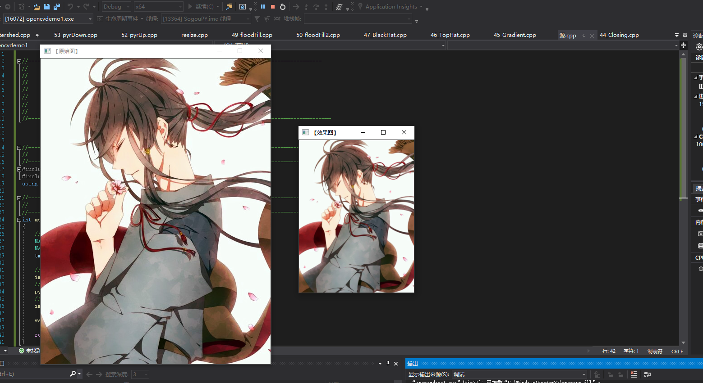       
#### 6.6.1 图像金字塔
定义：金字塔的底部是待处理图像的高分辨率表示，而顶部是低分辨率的近似。
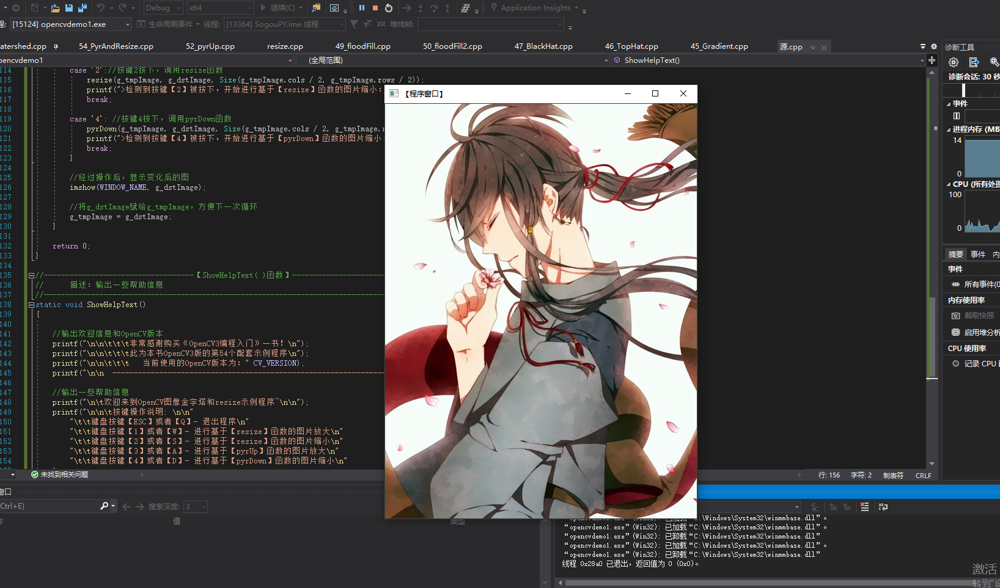 

### 6.7阈值化

#### 6.7.1固定阈值操作：Threshold（）函数
定义：函数Threshold()对单通道数组应用固定阈值操作。该函数的典型应用是对灰度图像进行阙值操作得到二值图像，( compare()函数也可以达到此目的）或者是去掉噪声，例如过滤很小或很大象素值的图像点。

#### 6.7.2自适应阈值操作：adaptiveThreshold（）函数
adaptiveThreshold(函数的作用是对矩阵采用自适应阈值操作，支持就地操作。函数原型如下。
C++: void adaptiveThreshold(InputArray src，outputArray dst，doublemaxValue，int adaptiveMethod，int thresholdType，int blockSize，doublec)

#### 6.7.3基本阈值操作程序

运行截图如下图所示：
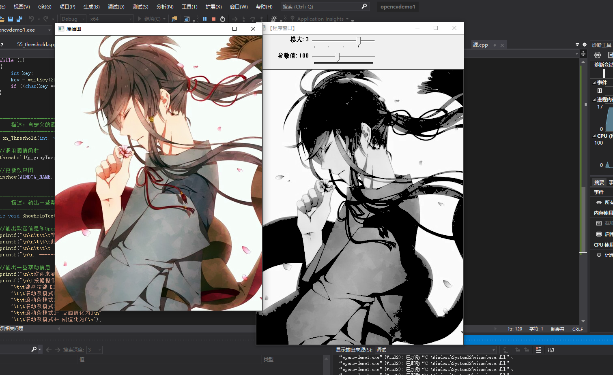

### 6.8章节小结
本章中我们学习了各种利用OpenCV进行图像处理的方法。包括属于线性滤波的方框滤波、均值滤波与高斯滤波，属于非线性滤波的中值滤波、双边滤波;两种基本形态学操作——膨胀与腐蚀;5种高级形态学滤波操作——开运算、闭运算、形态学梯度、顶帽以及黑帽;还有漫水填充算法、图像金字塔、图像缩放、阈值化。对vs的使用也越加熟练，但是我基本只是把代码跑了一遍，但是并没有真正记住函数的使用方法，真真记不住


## CH07图像变换
定义：将一幅图像转变成图像数据的另一种表现形式
### 7.1边缘检测
步骤：1.滤波
      2.增强
      3.检测

#### 7.1.1canny算子
目的：找到最优边缘算法（低错误率，高定位性，最小响应）
步骤：1.消除噪声
      2.计算梯度幅值和方向
      3.非极大值抑制
      4.滞后阈值（需要一个高阈值和一个低阈值
   函数运行截图如下图所示：
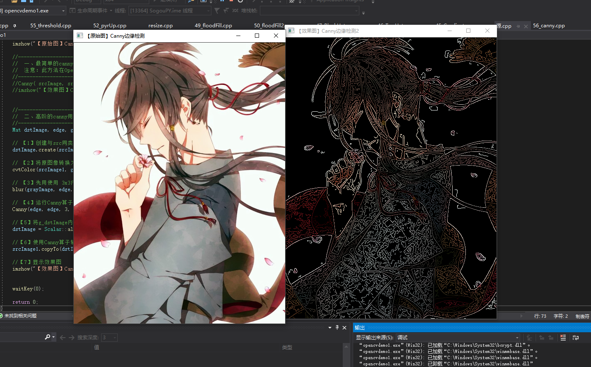

#### 7.1.2 sobel算子
定义：Sobel算子是一个主要用于边缘检测的离散微分算子( discrete differentiationoperator)。它结合了高斯平滑和徼分求导，用来计算图像灰度函数的近似梯度。在图像的任何一点使用此算子，都将会产生对应的梯度矢量或是其法矢量。

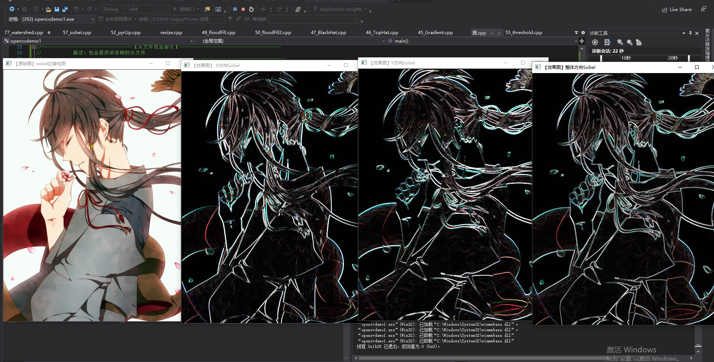

#### 7.1.3 Laplacian算子
定义：Laplacian算子是n维欧儿里德空间中的一个二阶微分算子，定义为梯度grad的散度div。

 函数运行截图如下图所示：
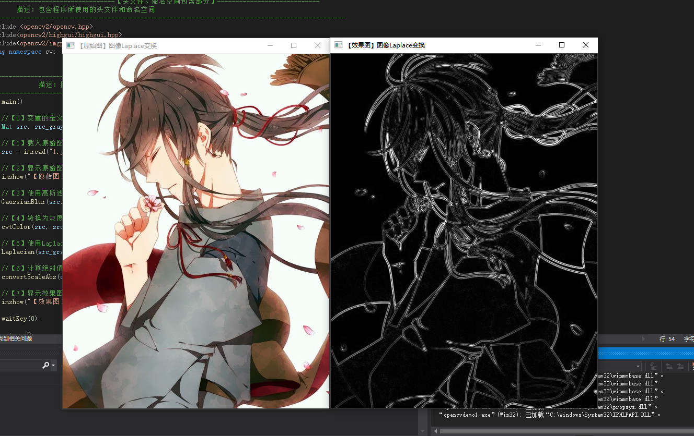

#### 7.1.4 scharr滤波器
配合sobel算子而存在


 运行截图如下图所示：
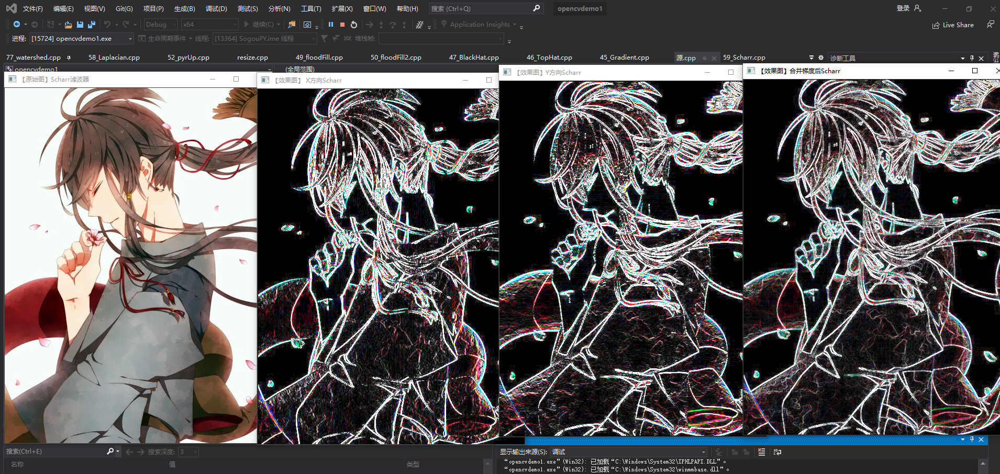

### 7.2 霍夫变换（用第二种极坐标系来表示直线）

总结一下，OpenCV中的霍夫线变换有如下三种:
- 标准霍夫变换(StandardHough Transform，SHT)，由HoughLines 函数调用。
- 多尺度霍夫变换(Multi-ScaleHough Transform，MSHT)，由 HoughLines函数调用。
- 累计概率霍夫变换（ProgressiveProbabilistic Hough Transform，PPHT)，由HoughLinesP函数调用。

#### 7.2.1标准霍夫变换：HoughLines（）函数
此函数可以找出采用标准霍夫变换的二值图像线条

 运行截图如下图所示：
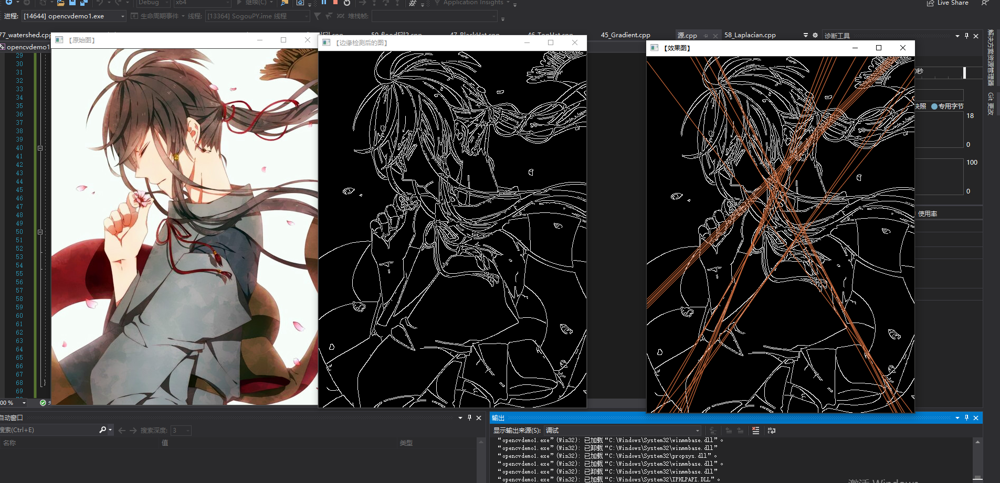

#### 7.2.2 累积概率霍夫变换：HoughLinesPng（）函数
此函数可以找出采用累积概率霍夫变换来找出二值图像中的直线
 运行截图如下图所示：

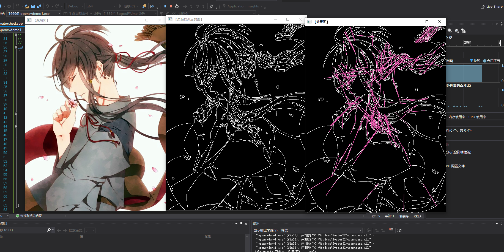

#### 7.2.3霍夫圆变换
和霍夫线变化基本类似

运行截图如下图所示：
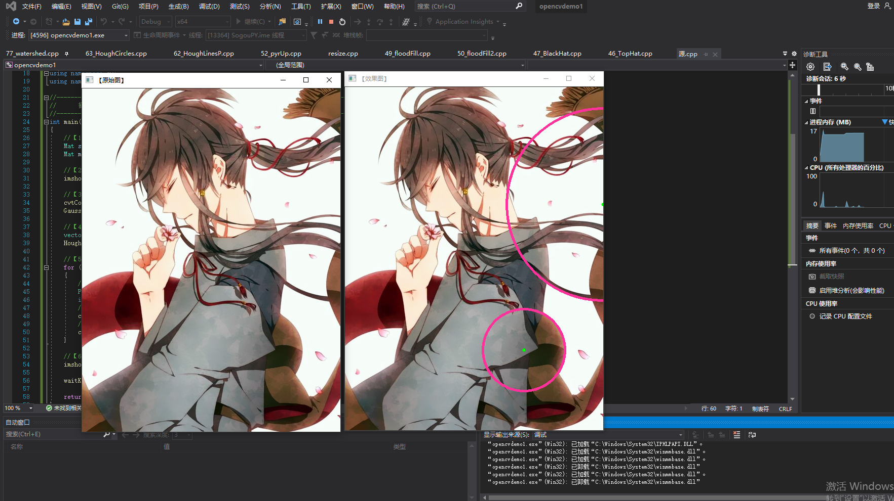

### 7.3重映射
概念：重映射,就是把一幅图像中某位置的像素放置到另一个图片指定位置的过程。为了完成映射过程，需要获得一些插值为非整数像素的坐标，因为源图像与目标图像的像素坐标不是一一对应的。一般情况下，我们通过重映射来表达每个像素的位置（x,y)

基本重映射运行截图如下
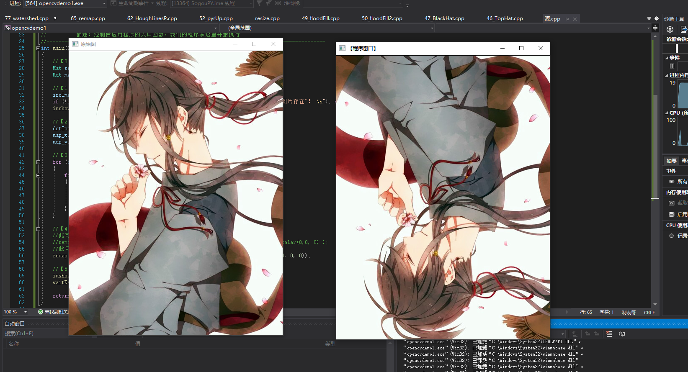

多种重映射运行截图如下


### 7.3仿射变换（可以用来表示旋转平移和缩放）
定义：仿射变换(Affine Transformation或Affine Map)，又称仿射映射，是指在几何中，一个向量空间进行一次线性变换并接上一个平移，变换为另一个向量空间的过程。它保持了二维图形的“平直性”(直线经过变换之后依然是直线〉和“平行性”(二维图形之间的相对位置关系保持不变，平行线依然是平行线，且直线上点的位置顺序不变)。
一个任意的仿射变换都能表示为乘以一个矩阵（线性变换）接着再加上一个向量(平移）的形式。

运行截图如下
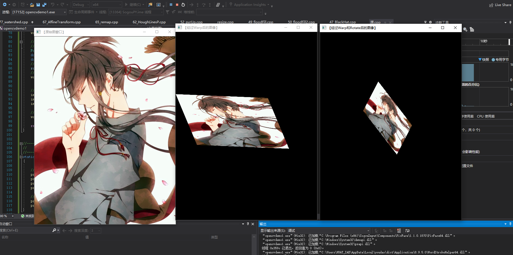

### 7.5 直方图均衡化
扩大图像的动态范围

运行截图如下
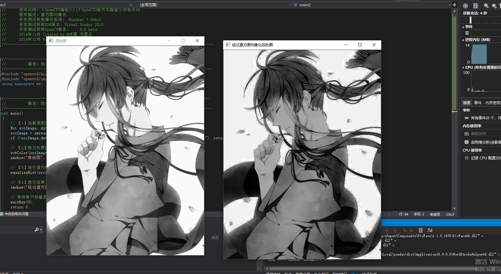

### 7.6本章小结
在这章中我们学习了很多类型的图像变换方法。包括利用OpenCV进行边缘检测所用到的canny 算子、sobel 算子，Laplace算子以及scharr 滤波器:进行图像特征提取的霍夫线变换、霍夫圆变换，重映射和仿射变换以及直方图均衡化。结合图像的变化对这些知识有了些许了解

## CH08 图像轮廓和图像分割修复

### 8.1寻找并绘制轮廓
#### 8.1.1寻找轮廓:findContours()函数
用于在二值图像中寻找轮廓

#### 8.1.2绘制轮廓：drawContours（）函数
用于在图像中绘制外部或者内部轮廓

#### 8.1.3基础轮廓查找

程序运行截图如下：
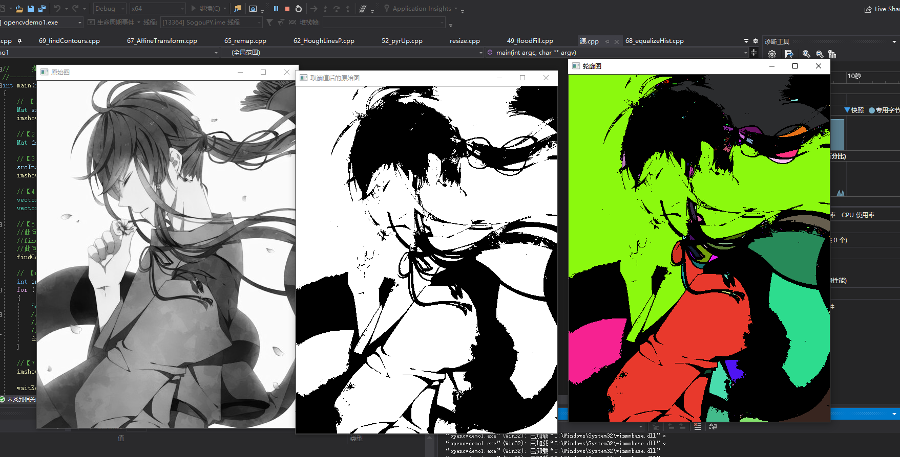

#### 查找并绘制轮廓综合示例

程序运行截图如下：
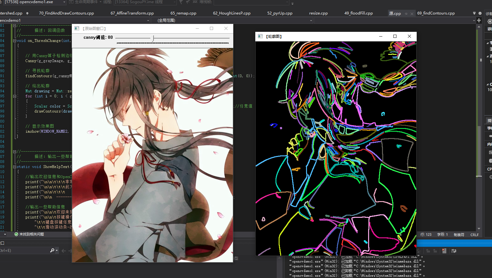

### 8.2寻找物体的凸包
定义：最外层的店连接起来的凸多边形

#### 8.2.1 寻找凸包 ：convexHull（）函数
上文已经提到过，convexHull()函数用于寻找图像点集中的凸包，其原型声明如下。
C++: void convexHull(InputArray points，OutputArray hull,boolclockwise-false, bool returnPoints=true )

#### 8.2.2
基础示例程序:凸包检测基础
程序运行截图如下：
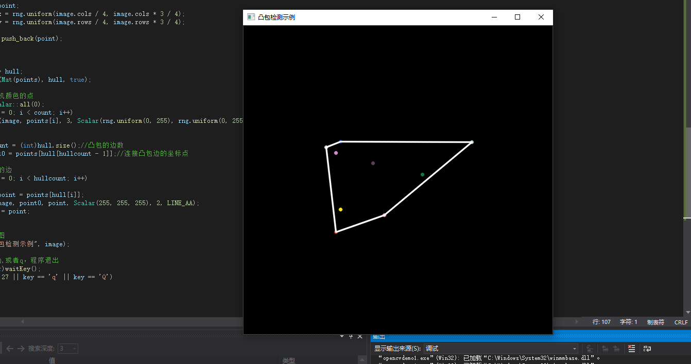

#### 8.2.3 综合示例程序:寻找和绘制物体的凸包
程序运行截图如下：
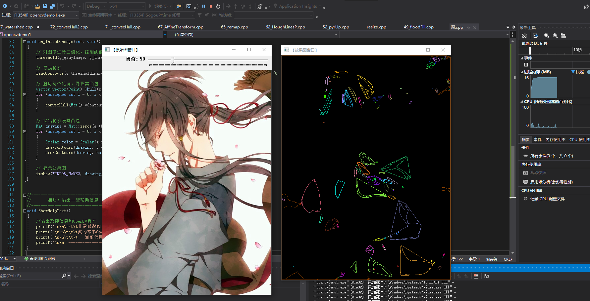

### 8.3 使用多边形将轮廓包围

#### 8.3.1 返回外部矩形边界: boundingRect(函数
此函数计算并返回指定点集最外面(up-right）的矩形边界。

#### 8.3.2 寻找最小包围矩形:minAreaRectO函数
函数用于对给定的2D点集，寻找可旋转的最小面积的包围矩形。

#### 8.3.3 寻找最小包围圆形:minEnclosingCircle()函数
minEnclosingCirclc函数的功能是利用一种迭代算法，对给定的2D点集，去寻找面积最小的可包围它们的圆形。

#### 8.3.4 用椭圆拟合二维点集:fitEllipse(函数
此函数的作用是用椭圆拟合二维点集。
C++: RotatedRect fitEllipse (InputArray pointsy

#### 8.3.5逼近多边形曲线: approxPolyDP(O)函数
approxPolyDP函数的作用是用指定精度逼近多边形曲线。
C++: void approxPolyDP(InputArray curve，outputArray approxCurve,double epsilon,bool closed）

#### 8.3.6基础示例程序:创建包围轮廓的矩形边界
程序运行截图如下：
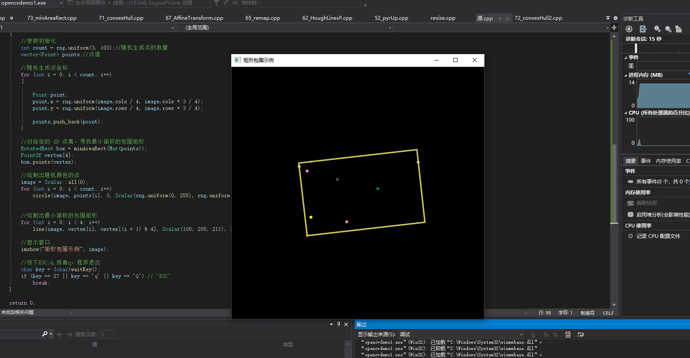

#### 8.3.7 基础示例程序:创建包围轮廓的圆形边界
程序运行截图如下：
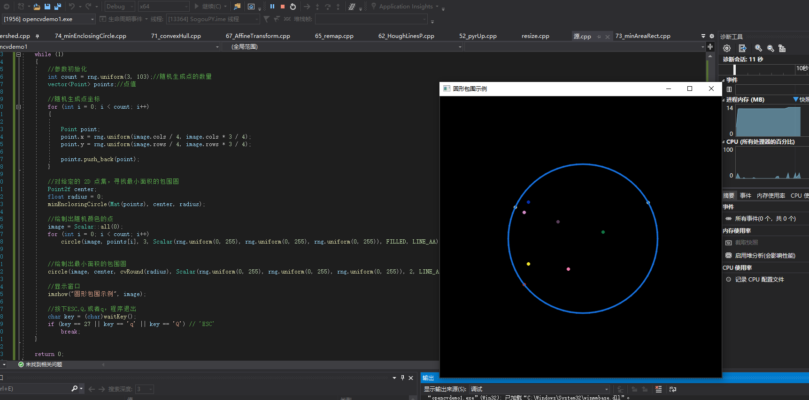

#### 8.3.8 综合示例程序:使用多边形包围轮廓
程序运行截图如下：
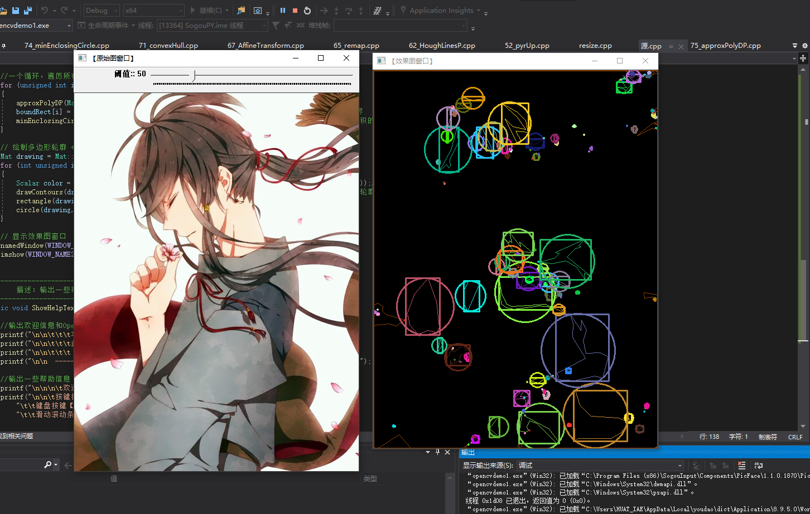

### 8.4图像的矩
作用:描述了该图像的全局特征并提供了大量的关于该图像不同类型的几何特性信息如大小，位置和方向等
组成函数：1.moments（计算图像所有的距）
      2.contourArea（计算轮廓面积）
      3.arcLength（计算轮廓或者曲线长度）

#### 8.4.1综合示例程序:查找和绘制图像轮廓矩

程序运行截图如下：
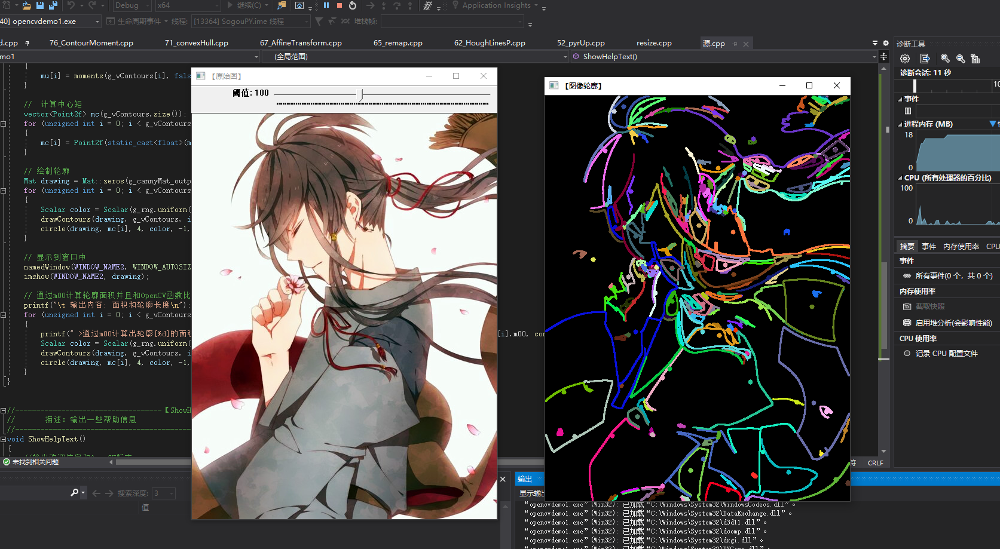

### 8.5 分水岭算法
分水岭的计算过程是一个迭代标注过程。分水岭比较经典的计算方法是由. Vincent提出的。在该算法中，分水岭计算分两个步骤;一个是排序过程，一个是淹没过程。首先对每个像素的灰度级进行从低到高的排序，然后在从低到高实现淹没的过程中，对每一个局部极小值在 h阶高度的影响域采用先进先(FIFO）结构进行判断及标注。分水岭变换得到的是输入图像的集水盆图像,某水盆之间的边界点，即为分水岭。显然，分水岭表示的是输入图像的极大值点。
程序运行截图如下：
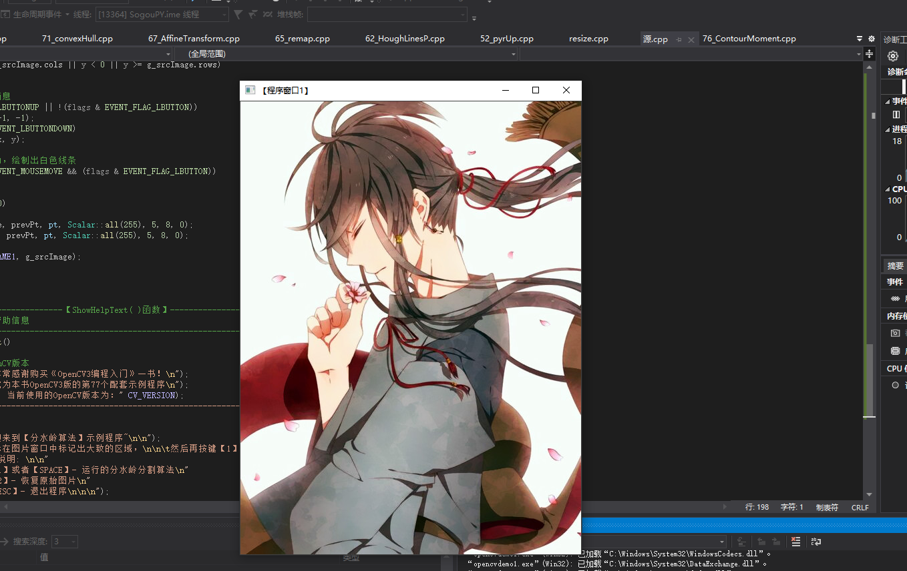

### 8.6 图像修补
利用那些已经被破坏区域的边缘，即边缘的颜色和结构，繁殖和混合到损坏的图像中，以达到图像修补的目的。

#### 8.6.1实现图像修补: inpaint（）函数
在新版OpenCV中，图像修补技术由inpaint函数实现，它可以用来从扫描的照片中清除灰尘和划痕，或者从静态图像或视频中去除不需要的物体。其原型声明如下。
C++: void inpaint InputArray src，InputArray inpaintMask，OutputArraydst, double inpaintRadius, int flags)

#### 8.6.2 综合示例程序:图像修补

程序运行截图如下：
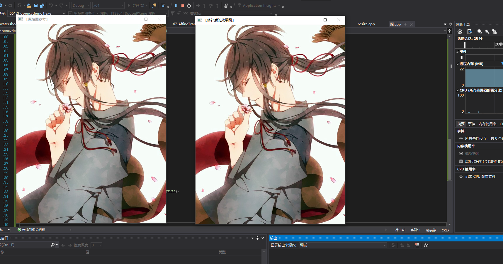

#### 8.7本章小结
本章中，我们先学习了查找轮并绘制轮廓，然后学习了如何寻找到物体的凸包，接着是使用多边形来包围轮廓，以及计算一个图像的矩。在本章后面几节，还学习了分水岭算法和图像修补操作的实现方法。图像修补只适用于老照片之类的，正常照片没有效果

## CH09 直方图与匹配

### 9.1 图像直方图概述
定义：图像直方图（Image Histogram）是用以表示数字图像中亮度分布的直方图，标绘了图像中每个亮度值的像素数。可以借助观察该直方图了解需要如何调整亮度分布。这种直方图中，横坐标的左侧为纯黑、较暗的区域，而右侧为较亮、纯白的区域。因此，一张较暗图片的图像直方图中的数据多集中于左侧和中间部分，而整体明亮、只有少量阴影的图像则相反。计算机视觉领域常借助图像直方图来实现图像的二值化。

意义：
- 直方图是图像中像素强度分布的图形表达方式。
- 它统计了每一个强度值所具有的像素个数。

### 9.2 直方图的计算和绘制

#### 9.2.1 计算直方图：calcHist（）函数
用于计算一个或者多个阵列的直方图
#### 9.2.2找寻最值: minMaxLoc()函数
minMaxLoc()函数的作用是在数组中找到全局最小值和最大值。

#### 9.2.3 示例程序:绘制H一S直方图

程序运行截图如下：
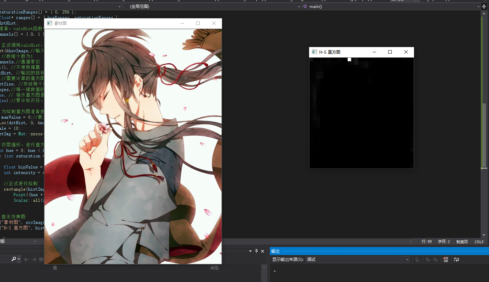


#### 9.2.4 示例程序:计算并绘制图像一维直方图

程序运行截图如下：
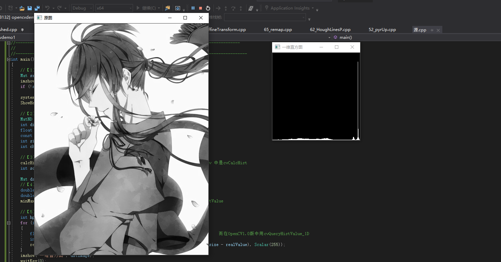

### 9.3 直方图对比
对于直方图来说，一个不可或缺的工具便是用某些具体的标准来比较两个直方图的相似度。

#### 9.3.1对比直方图: compareHist()函数
compareHist()函数用于对两幅直方图进行比较。有两个版本的C++原型，如下。
C++: double compareHist(InputArray Hl，InputArray H2，int method)C++: double compareHist(const SparseMat& Hl,const SparseMat& H2,int method)
它们的前两个参数是要比较的大小相同的直方图，第三个变量是所选择的距离标准。可采用如下4种方法，比较两个直方图(H1表示第一个，H2表示第二个):

#### 9.3.2示例程序:直方图对比
程序运行截图如下：
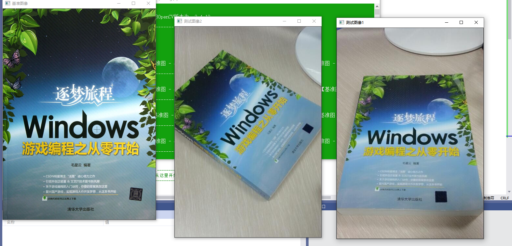

### 9.4 反向投影
定义：反向投影(back projection）就是一种记录给定图像中的像素点如何适应直方图模型像素分布方式的一种方法。
简单的讲，所谓反向投影就是首先计算某一特征的直方图模型，然后使用模型去寻找图像中存在的该特征的方法。

作用：反向投影用于在输入图像（通常较大）中查找与特定图像（通常较小或者仅l个像素，以下将其称为模板图像）最匹配的点或者区域，也就是定位模板图像出现在输入图像的位置

#### 9.4.1计算反向投影：calcBackProject（）函数
calcBackProject(函数用于计算直方图的反向投影。
C++: void calcBackProject (const Mat* images,
int nimages,
const int* channels,InputArray hist,
outputArray backProject,const float* * ranges,double scale=i,
bool uniform=true )

#### 9.4.2通道复制: mixChannels(函数
此函数由输入参数复制某通道到输出参数特定的通道中。

程序运行截图如下：
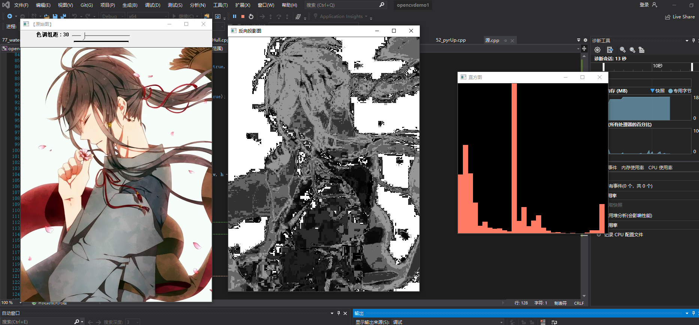

### 9.5 模板匹配

#### 9.5.1
实现模板匹配: matchTemplate(）函数match Templatc(用于匹配出和模板重叠的图像区域。
C++: void matchTemplate (InputArray image，InputArray templ，outputArrayresult, int method)

#### 9.5.2综合示例:模板匹配

程序运行截图如下：
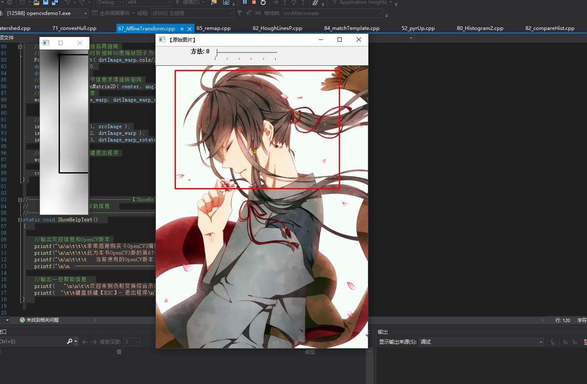

### 9.6本章小结
本章我们学习了广泛运用于很多计算机视觉运用当中的直方图,而简单点说，直方图就是对数据进行统计的一种方法。然后还讲到了反向投影和模板匹配。所谓反向投影就是首先计算某一特征的直方图模型，最后使用模型去寻找图像中存在的该特征的方法。而模板匹配是一项在一幅图像中寻找与另一幅模板图像最匹配（相似）部分的技术。模型匹配在查找一些事物时具有极大的作用


