# CH06 图像处理
 ## 6.1 线性滤波：方框滤波、均值滤波、高斯滤波

### **平滑处理**

平滑处理( smoothing)也称模糊处理(bluring)， 是-种简单且使用频率很高的图像处理方法。平滑处理的用途有很多，最常见的是用来减少图像上的噪点或者失真。在涉及到降低图像分辨率时，平滑处理是非常好用的方法。
### **图像滤波与滤波器**

图像滤波,指在尽量保留图像细节特征的条件下对目标图像的噪声进行抑制，是图像预处理中不可缺少的操作，其处理效果的好坏将直接影响到后续图像处理和分析的有效性和可靠性。

消除图像中的噪声成分叫作图像的平滑化或滤波操作。信号或图像的能量大部分集中在幅度谱的低频和中频段，而在较高频段,有用的信息经常被噪声淹没。因此-一个能降低高频成分幅度的滤波器就能够减弱噪声的影响。

图像滤波的目的有两个:

一个是抽出对象的特征作为图像识别的特征模式；另一个是为适应图像处理的要求，消除图像数字化时所混入的噪声。

而对滤波处理的要求也有两条:一是不能损坏图像的轮廓及边缘等重要信息;二是使图像清晰视觉效果好。

平滑滤波是低频增强的空间域滤波技术。它的目的有两类:一类是模糊；另一类是消除噪音。

空间域的平滑滤波一般采用简单平均法进行，就是求邻近像元点的平均亮度值。邻域的大小与平滑的效果直接相关，邻域越大平滑的效果越好，但邻域过大，平滑也会使边缘信息损失的越大，从而使输出的图像变得模糊，因此需合理选择邻域的大小。

**线性滤波器简介**

线性滤波器用于时变输入信号的线性运算（en:linear operator）。线性滤波器在电子学和数字信号处理中应用非常普遍，它们也用于机械工程和其它技术领域。
线性滤波器经常用于剔除输入信号中不想要的频率或者从许多频率中选择一个想要的频率。滤波器和滤波器技术类型非常广泛，这篇文章将给出一个总的描述。
不论它们是电子的、电力的还是机械的，也不论它们的频率范围或者时间尺度有多大，线性滤波器的数学理论都是通用的。

●低通滤波器:允许低频率通过;

●高通滤波器:允许高频率通过;

●带通滤波器:允许-定范围频率通过;

●带阻滤波器:阻止- -定范围频率通过并且允许其他频率通过;

●全通滤波器:允许所有频率通过，仅仅改变相位关系;

●陷波滤波器(Band-Stop Filter): 阻止一个狭窄频率范围通过，是一 种特殊带阻滤波器。

**滤波和模糊**

滤波是将信号中特定波段频率滤除的操作，是抑制和防止干扰的一项重要措施。

我们可以以高斯滤波为例子。滤波可以分为低通滤波和高通滤波两种：高斯高通就是锐化，高斯低通是模糊。

可以简单的理解为：高斯滤波是指用高斯函数作为滤波函数的滤波操作，高斯模糊就是高斯低通滤波。

**邻域算子与线性邻域滤波**

邻域算子（局部算子）是利用给定像素周围的像素值的决定此像素的最终输出值的一种算子。而线性邻域滤波是一种常用的邻域算子，像素的输出值取决于输入像素的加权和，具体过程如下图。

    邻域算子除了用于局部色调调整以外，还可以用于图像滤波，实现图像的平滑和锐化，图像边缘增强或者图像噪声的去除。本篇文章，我们介绍的主角是线性邻域滤波算子，即用不同的权重去结合一个小邻域内的像素，来得到应有的处理效果。

在新版本的OpenCV中，提供了如下三种常用的线性滤波操作，他们分别被封装在单独的函数中，使用起来非常方便：

     

   ----方框滤波 boxblur函数

  ----均值滤波  blur函数

  ----高斯滤波  GaussianBlur函数

 **方框滤波（box Filter）**

    方框滤波（box Filter）被封装在一个名为boxblur的函数中，即boxblur函数的作用是使用方框滤波器（box filter）来模糊一张图片，从src输入，从dst输出。    

均值滤波是方框滤波归一化（normalized）后的特殊情况。其中，归一化就是把要处理的量都缩放到一个范围内,比如(0,1)，以便统一处理和直观量化。

   而非归一化（Unnormalized）的方框滤波用于计算每个像素邻域内的积分特性，比如密集光流算法（dense optical flow algorithms）中用到的图像倒数的协方差矩阵（covariance matrices of image derivatives）

  如果我们要在可变的窗口中计算像素总和，可以使用integral()函数。

**均值滤波**

均值滤波，是最简单的一种滤波操作，输出图像的每一个像素是核窗口内输入图像对应像素的像素的平均值( 所有像素加权系数相等)，其实说白了它就是归一化后的方框滤波。

我们在下文进行源码剖析时会发现，blur函数内部中其实就是调用了一下boxFilter。

下面开始讲均值滤波的内容吧。

  

   1）均值滤波的理论简析

   均值滤波是典型的线性滤波算法，主要方法为邻域平均法，即用一片图像区域的各个像素的均值来代替原图像中的各个像素值。一般需要在图像上对目标像素给出一个模板（内核），该模板包括了其周围的临近像素（比如以目标像素为中心的周围8（3x3-1）个像素，构成一个滤波模板，即去掉目标像素本身）。再用模板中的全体像素的平均值来代替原来像素值。即对待处理的当前像素点（x，y），选择一个模板，该模板由其近邻的若干像素组成，求模板中所有像素的均值，再把该均值赋予当前像素点（x，y），作为处理后图像在该点上的灰度个g（x，y），即个g（x，y）=1/m ∑f（x，y） ，其中m为该模板中包含当前像素在内的像素总个数。

     

   2）均值滤波的缺陷

    均值滤波本身存在着固有的缺陷，即它不能很好地保护图像细节，在图像去噪的同时也破坏了图像的细节部分，从而使图像变得模糊，不能很好地去除噪声点。

 

   3）在OpenCV中使用均值滤波——blur函数

   blur函数的作用是，对输入的图像src进行均值滤波后用dst输出

  **高斯滤波**
     

    1）高斯滤波的理论简析

    高斯滤波是一种线性平滑滤波，适用于消除高斯噪声，广泛应用于图像处理的减噪过程。通俗的讲，高斯滤波就是对整幅图像进行加权平均的过程，每一个像素点的值，都由其本身和邻域内的其他像素值经过加权平均后得到。高斯滤波的具体操作是：用一个模板（或称卷积、掩模）扫描图像中的每一个像素，用模板确定的邻域内像素的加权平均灰度值去替代模板中心像素点的值 

大家常常说高斯滤波最有用的滤波操作，虽然它用起来，效率往往不是最高的。

高斯模糊技术生成的图像，其视觉效果就像是经过一个半透明屏幕在观察图像，这与镜头焦外成像效果散景以及普通照明阴影中的效果都明显不同。高斯平滑也用于计算机视觉算法中的预先处理阶段，以增强图像在不同比例大小下的图像效果（参见尺度空间表示以及尺度空间实现）。从数学的角度来看，图像的高斯模糊过程就是图像与正态分布做卷积。由于正态分布又叫作高斯分布，所以这项技术就叫作高斯模糊。

图像与圆形方框模糊做卷积将会生成更加精确的焦外成像效果。由于高斯函数的傅立叶变换是另外一个高斯函数，所以高斯模糊对于图像来说就是一个低通滤波操作。

  高斯滤波器是一类根据高斯函数的形状来选择权值的线性平滑滤波器。高斯平滑滤波器对于抑制服从正态分布的噪声非常有效。

  其中，高斯分布参数Sigma决定了高斯函数的宽度。对于图像处理来说，常用二维零均值离散高斯函数作平滑滤波器。

   2）在OpenCV中使用高斯滤波——GaussianBlur函数

  GaussianBlur函数的作用是用高斯滤波器来模糊一张图片，对输入的图像src进行高斯滤波后用dst输出。它将源图像和指定的高斯核函数做卷积运算，并且支持就地过滤（In-placefiltering）。

  **方框滤波boxFilter函数的使用**

  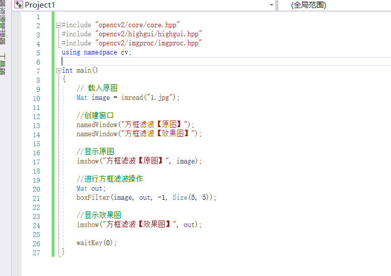

  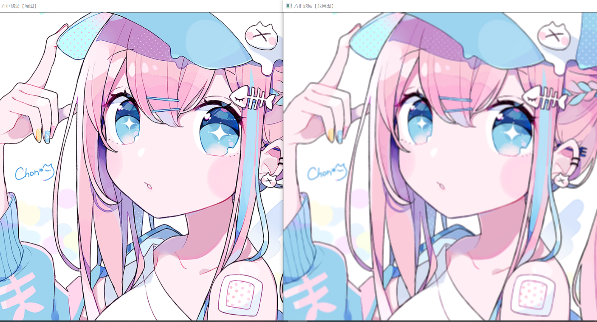

 **均值滤波blur函数的使用**

 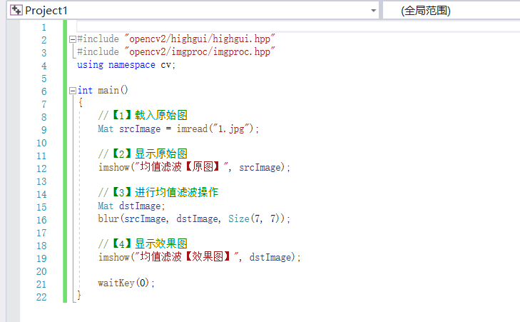

 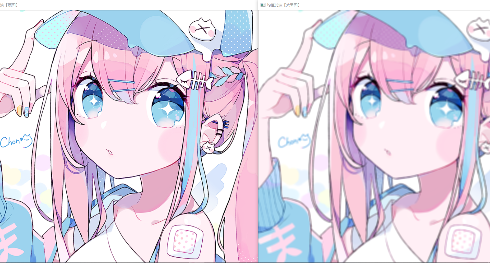

**高斯模糊GaussianBlur函数的用法**

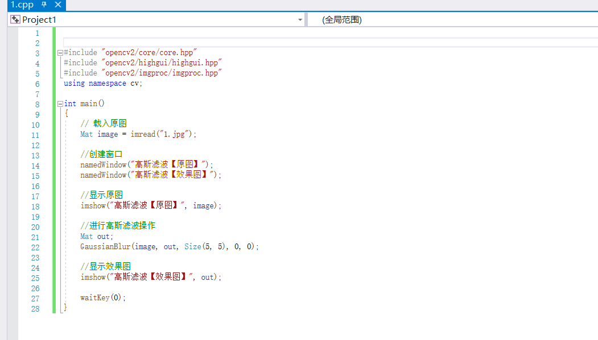

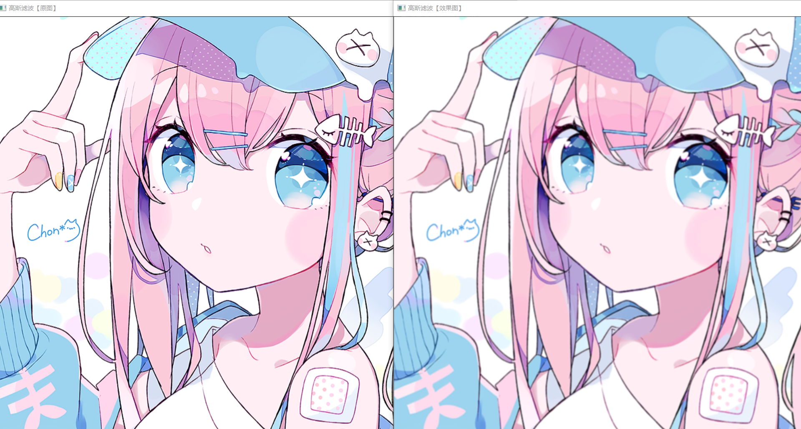

**线性图像滤波综合示例**

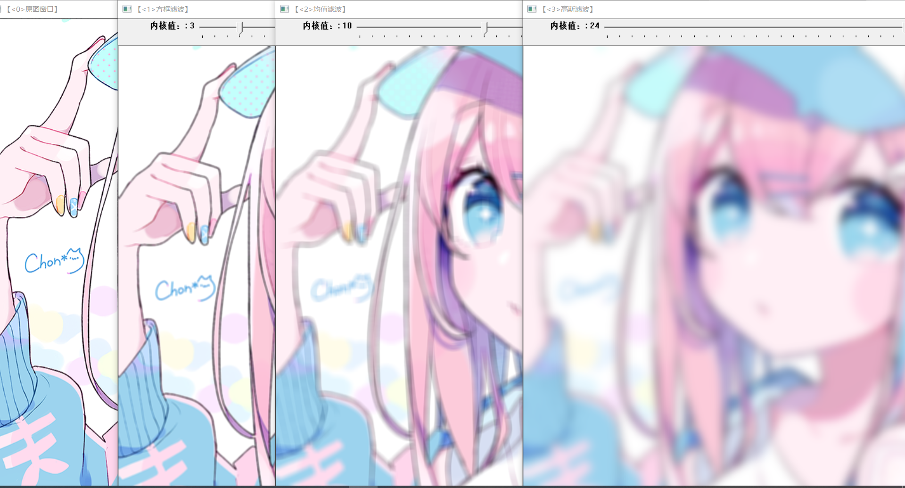

## 6.2 非线性滤波：中值滤波、双边滤波

**非线性滤波概述**

从连续的(或离散的)输入数据中滤除噪声和干扰以提取有用信息的过程称为滤波，而相应的装置称为滤波器。根据滤波器的输出是否为输入的线性函数，可将它分为线性滤波器和非线性滤波器两种。非线性滤波的原始数据与滤波结果是一种逻辑关系，即用逻辑运算实现，如最大值滤波器、最小值滤波器、中值滤波器等，是通过比较一定邻域内的灰度值大小来实现的，没有固定的模板，因而也就没有特定的转移函数，另外，膨胀和腐蚀也是通过最大值、最小值滤波器实现的 [1]  。
对一般的非线性滤波问题的研究相当活跃，常用的非线性滤波有扩展卡尔曼滤波(EKF)、不敏卡尔曼滤波(UKF)、粒子滤波(PF)等。
一般的非线性最优滤波可归结为求条件期望的问题。对于有限多个观测值的情形，条件期望原则上可以用贝叶斯公式来计算。但即使在比较简单的场合，这样得出的结果也是相当繁杂的，无论对实际应用或理论研究都很不方便。与卡尔曼滤波类似，人们也希望能给出非线性滤波的某种递推算法或它所满足的随机微分方程。但一般它们并不存在，因此必须对所讨论的过程X与Y加以适当的限制。非线性滤波的研究工作相当活跃，它涉及随机过程论的许多近代成果，如随机过程一般理论、鞅、随机微分方程、点过程等。其中一个十分重要的问题，是研究在什么条件下，存在一个鞅M，使得在任何时刻,M和Y 都包含同样的信息；这样的M称为Y 的新息过程。对于一类所谓“条件正态过程”，已经给出了非线性最优滤波的可严格实现的递推算式。在实际应用上，对非线性滤波问题往往采用各种线性近似的方法。

**中值滤波**

中值滤波（Median filter）是一种典型的非线性滤波技术，基本思想是用像素点邻域灰度值的中值来代替该像素点的灰度值，该方法在去除脉冲噪声、椒盐噪声的同时又能保留图像边缘细节。

中值滤波是基于排序统计理论的一种能有效抑制噪声的非线性信号处理技术，其基本原理是把数字图像或数字序列中一点的值用该点的一个邻域中各点值的中值代替，让周围的像素值接近的真实值，从而消除孤立的噪声点，对于斑点噪声（speckle noise）和椒盐噪声（salt-and-pepper noise）来说尤其有用，因为它不依赖于邻域内那些与典型值差别很大的值。中值滤波器在处理连续图像窗函数时与线性滤波器的工作方式类似，但滤波过程却不再是加权运算。

中值滤波在一定的条件下可以克服常见线性滤波器如最小均方滤波、方框滤波器、均值滤波等带来的图像细节模糊，而且对滤除脉冲干扰及图像扫描噪声非常有效，也常用于保护边缘信息, 保存边缘的特性使它在不希望出现边缘模糊的场合也很有用，是非常经典的平滑噪声处理方法。
中值滤波的改进改进——加权中值滤波：在中值滤波的基础上加以改进，其性能在一定程度上优于中值滤波。

**中值滤波与均值滤波器比较**

中值滤波器与均值滤波器比较的优势：在均值滤波器中，由于噪声成分被放入平均计算中，所以输出受到了噪声的影响，但是在中值滤波器中，由于噪声成分很难选上，所以几乎不会影响到输出。因此同样用3x3区域进行处理，中值滤波消除的噪声能力更胜一筹。中值滤波无论是在消除噪声还是保存边缘方面都是一个不错的方法。

中值滤波器与均值滤波器比较的劣势：中值滤波花费的时间是均值滤波的5倍以上。

**双边滤波**

双边滤波（Bilateral filter）是一种非线性的滤波方法，是结合图像的空间邻近度和像素值相似度的一种折衷处理，同时考虑空域信息和灰度相似性，达到保边去噪的目的。具有简单、非迭代、局部的特点。

双边滤波器的好处是可以做边缘保存（edge preserving），一般过去用的维纳滤波或者高斯滤波去降噪，都会较明显地模糊边缘，对于高频细节的保护效果并不明显。

双边滤波器，顾名思义比高斯滤波多了一个高斯方差sigma－d，它是基于空间分布的高斯滤波函数，所以在边缘附近，离的较远的像素不会太多影响到边缘上的像素值，这样就保证了边缘附近像素值的保存。但是由于保存了过多的高频信息，对于彩色图像里的高频噪声，双边滤波器不能够干净的滤掉，只能够对于低频信息进行较好的滤波。

### **非线性滤波相关核心API函数**

中值滤波medianBlur函数

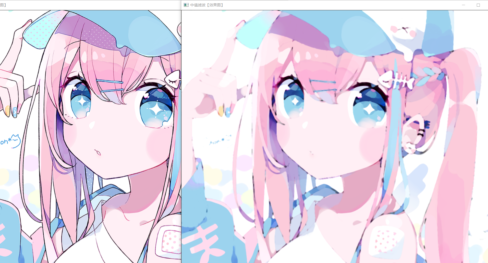

双边滤波：bilateralFilter函数

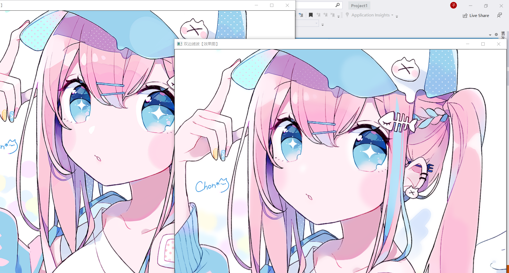

### **图像滤波综合示例**

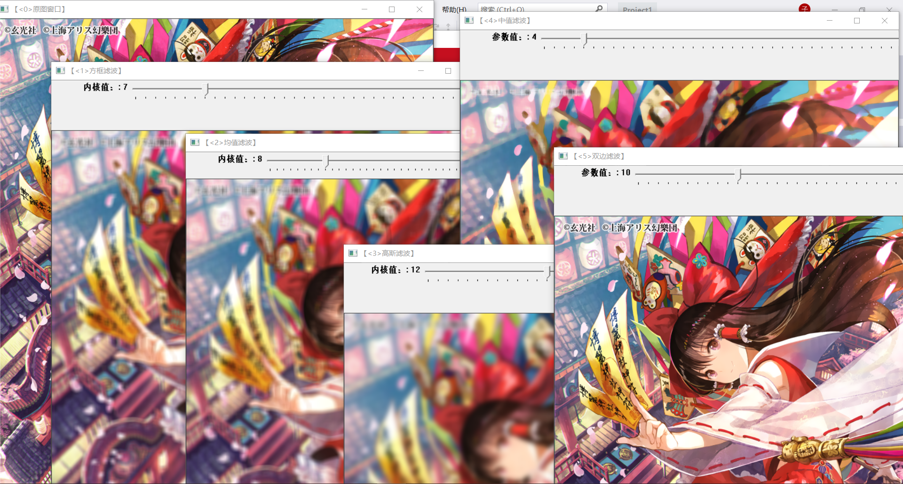

## 6.3形态学滤波：腐蚀与膨胀

### **形态学概述**

形态学（英语morphology，德语morphologie ）的范畴来自希腊语morphe，歌德在自己的生物学研究中倡导得最早，歌德由于不满意自然科学中过分的理性分析倾向，才有这样的规划与设想。当然，由于历史条件的局限，歌德所说的形态学，在正确地反对机械的科学主义的同时，也多少带有新柏拉图主义的神秘因素在内。到20世纪中叶，先后有两位德国学者把形态学引进了文学研究，他们是G.穆勒和H.欧佩尔。

**数学形态学**

数学形态学（Mathematical morphology） 是一门建立在格论和拓扑学基础之上的图像分析学科，是数学形态学图像处理的基本理论。其基本的运算包括：二值腐蚀和膨胀、二值开闭运算、骨架抽取、极限腐蚀、击中击不中变换、形态学梯度、Top-hat变换、颗粒分析、流域变换、灰值腐蚀和膨胀、灰值开闭运算、灰值形态学梯度等。

### **膨胀**

膨胀就是求局部最大值的操作。

按数学方面来说，膨胀或者腐蚀操作就是将图像（或图像的一部分区域，我们称之为A）与核（我们称之为B）进行卷积。

核可以是任何的形状和大小，它拥有一个单独定义出来的参考点，我们称其为锚点（anchorpoint）。多数情况下，核是一个小的中间带有参考点和实心正方形或者圆盘，其实，我们可以把核视为模板或者掩码。

而膨胀就是求局部最大值的操作，核B与图形卷积，即计算核B覆盖的区域的像素点的最大值，并把这个最大值赋值给参考点指定的像素。这样就会使图像中的高亮区域逐渐增长。

### **腐蚀**
与膨胀相反，腐蚀就是求局部最小值的操作。

腐蚀可以理解为B的中心（锚点）沿着A的内边界走了一圈。腐蚀也是对高亮部分而言，A区域之外的部分 < A的高亮像素，所里里面被外面取代。A中能完全包含B的像素被留下来了。

### **综合示例：膨胀和腐蚀**

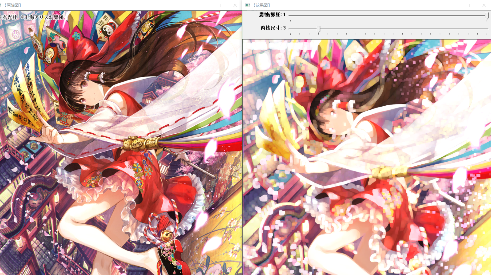

## 6.4 形态学滤波：开运算、闭运算、形态学梯度、顶帽、黑帽

**开运算**

开运算，就是先腐蚀后膨胀的过程

数学表达式：

　　dst = open(src,element) = dilate(erode(src, element))

开运算可以用来消除小物体，在纤细点处分离物体，并且在平滑较大物体的边界的同时不明显改变其面积。

**闭运算**

闭运算，就是先膨胀后腐蚀的过程

数学表达式：

　　dst = open(src,element) = erode(dilate(src, element))

闭运算可以用来排除小型黑洞（黑色区域）

**形态学梯度**

 形态学梯度，就是膨胀图与腐蚀图之差

数学表达式：

　　dst = morph-grad(src,element) = dilate(src, element) - erode(src, element)

对二值图进行这一操作可以将团块的边缘突出出来，我们可以用形态学梯度来保留物体的边缘轮廓

**顶帽**

顶帽（礼帽）运算，就是原图像与“开运算”的结果图之差

数学表达式：

　　dst = tophat(src,element) = src - open(src,element)

因为开运算带来的结果是放大了裂缝或者局部低亮度的区域。因此从原图中减去开运算后的图，得到的效果

图突出了比原图轮廓周围的区域更明亮的区域，且这一操作与选择的核的的大小相关。

顶帽运算往往用来分离比临近点亮一些的斑块，在一幅图像具有大幅的背景，而微小物品比较有规律的情况下，

可以使用顶帽运算进行背景提取

**黑帽**

黑帽运算，就是“闭运算”的结果图与原图像之差

数学表达式：

　　dst = blackhat(src,element) = close(src,element) - src 

黑帽运算后的效果图突出了比原图轮廓周围的区域更暗的区域，且这一操作和选择的核的大小相关

黑帽运算用来分离比临近点暗一些的斑块，效果图有着非常完美的轮廓

## 各形态学操作使用示例

用morphologyEx进行图像膨胀

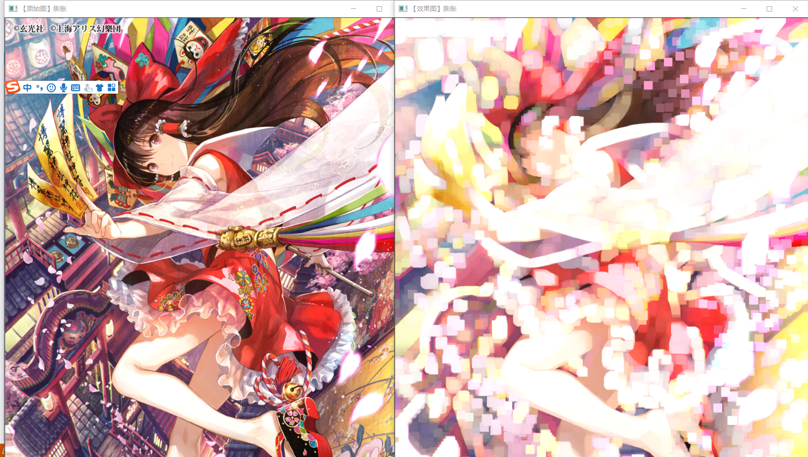

用morphologyEx进行图像腐蚀

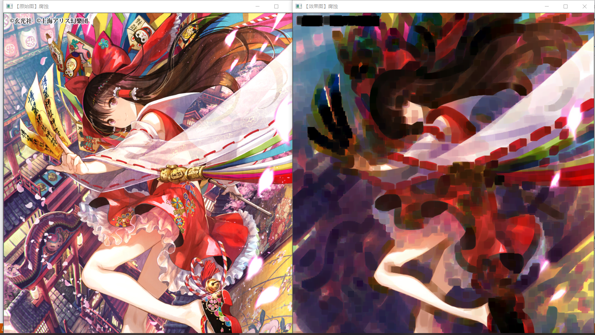

用morphologyEx进行图像开运算

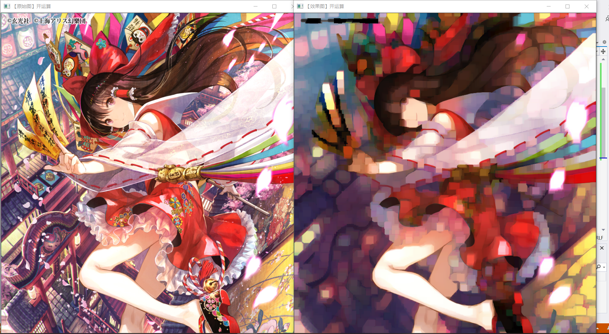

用morphologyEx进行图像闭运算

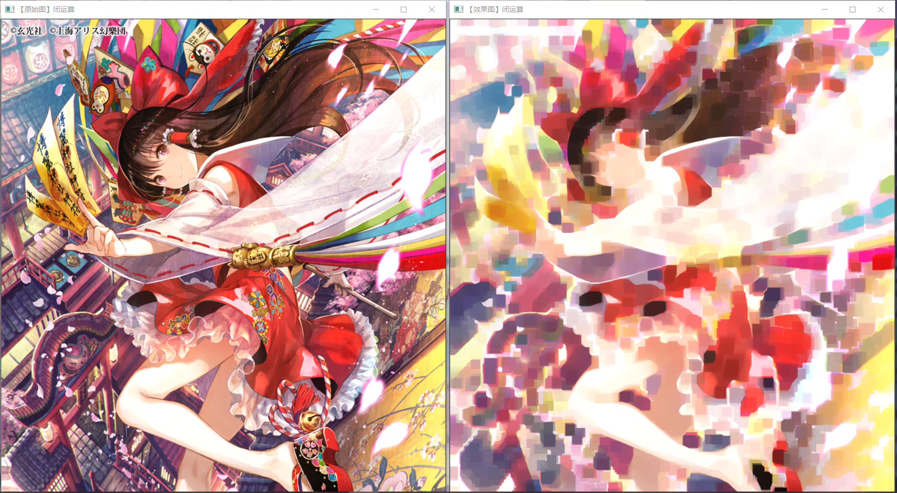

用morphologyEx进行形态学梯度运算

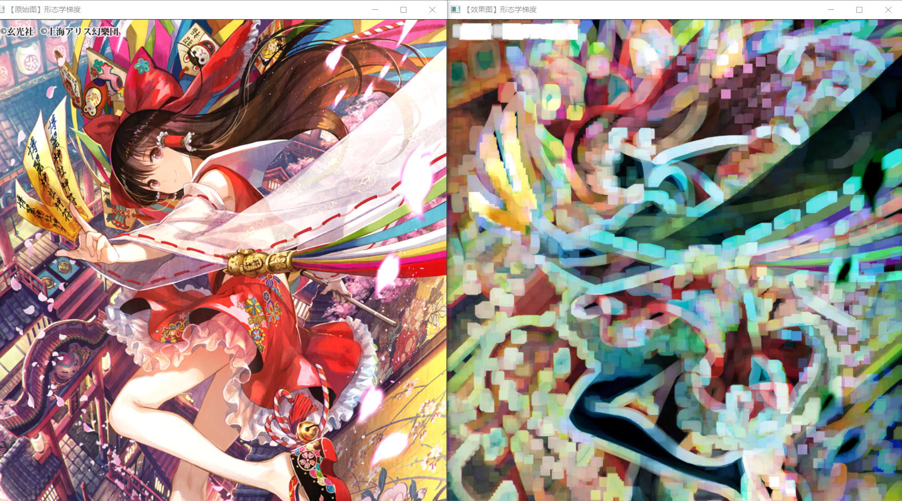

用morphologyEx进行形态学顶帽运算

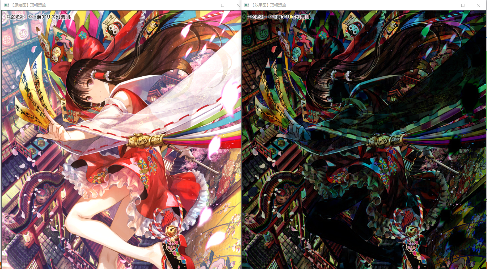

用morphologyEx进行形态学黑帽运算

## 综合示例：形态学滤波

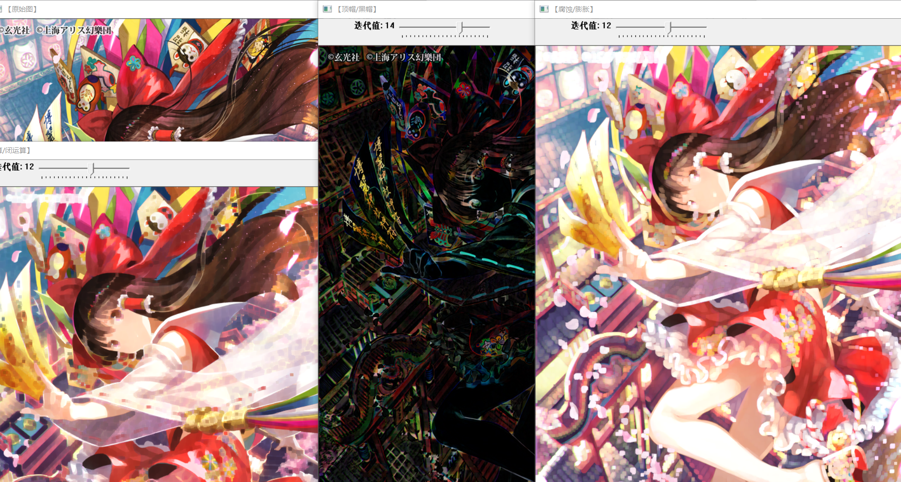

## 6.5 漫水填充

**定义**

漫水填充法是一种用特定的颜色填充联通区域，通过设置可连通像素的上下限以及连通方式来达到不同的填充效果的方法。漫水填充经常被用来标记或分离图像的一部分以便对其进行进一步处理或分析，也可以用来从输入图像获取掩码区域，掩码会加速处理过程，或只处理掩码指定的像素点，操作的结果总是某个连续的区域。

**基本思想**

所谓漫水填充，简单来说，就是自动选中了和种子点相连的区域，接着将该区域替换成指定的颜色，这是个非常有用的功能,经常用来标记或者分离图像的一部分进行处理或分析.漫水填充也可以用来从输入图像获取掩码区域,掩码会加速处理过程,或者只处理掩码指定的像素点.

以此填充算法为基础，类似photoshop的魔术棒选择工具就很容易实现了。漫水填充（FloodFill）是查找和种子点联通的颜色相同的点，魔术棒选择工具则是查找和种子点联通的颜色相近的点，将和初始种子像素颜色相近的点压进栈作为新种子

在OpenCV中，漫水填充是填充算法中最通用的方法。且在OpenCV 2.X中，使用C++重写过的FloodFill函数有两个版本。一个不带掩膜mask的版本，和一个带mask的版本。这个掩膜mask，就是用于进一步控制哪些区域将被填充颜色（比如说当对同一图像进行多次填充时）。这两个版本的FloodFill，都必须在图像中选择一个种子点，然后把临近区域所有相似点填充上同样的颜色，不同的是，不一定将所有的邻近像素点都染上同一颜色，漫水填充操作的结果总是某个连续的区域。当邻近像素点位于给定的范围（从loDiff到upDiff）内或在原始seedPoint像素值范围内时，FloodFill函数就会为这个点涂上颜色。

**综合示例：漫水填充**

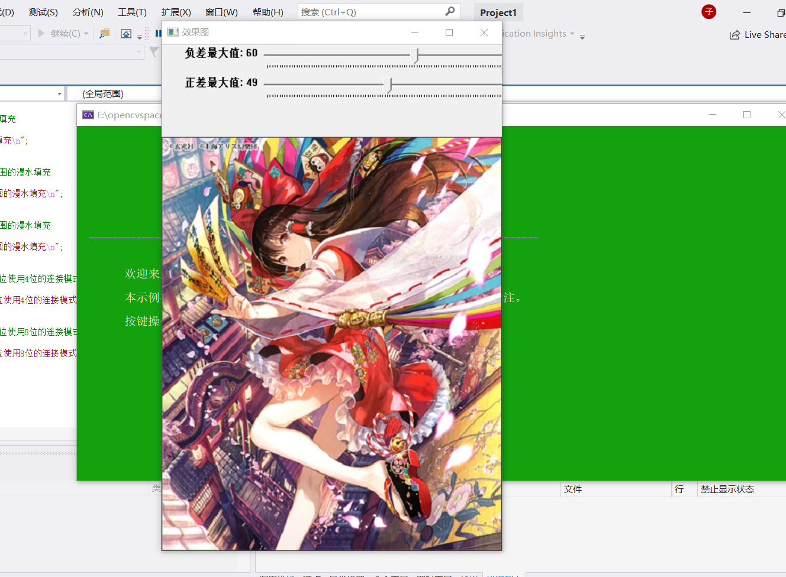

## 6.6图像金字塔与图片尺寸缩放

OpenCV 中对图片的尺寸进行放大和缩小操作一般通过下面两种方式：

resize() 函数。

pyrUp()、pyrDown() 函数。通过图像金字塔进行向上采样和向下采样对图片尺寸进行改变。

图像金字塔是图像中多尺度表达的一种，主要用于图像的分割，是一种以多分辨率来解释图像的有效但概念简单的结构。一幅图像的金字塔式一系列以金字塔形状来排列的，多分辨率逐步降低且来源于同一张原始图的图像集合。其通过依次向下采样获得，直到达到某个终止条件才停止采样。金字塔的底部是待处理图像的高分辨率表示，顶部是低分辨率的近似。

常用的有两种金字塔：

**高斯金字塔（Gaussian pyramid）**

**拉普拉斯金字塔（Laplacian pyramid）**

向下采样：

从金字塔第 i 层生成第 i+1 层，先用高斯核对 G_i{} 进行卷积；

然后删除所有的偶数行和偶数列。

新得到的图像面积会变为源图像的四分之一。迭代这个过程就可以得到整个图像金字塔。

向上采样：

将图像在每个方向上扩大两倍，新增的行和列用 0 填充；

使用先前的搞死内核 （乘以 4 ）与放大后的图像进行卷积，获得新增图像的近似值

新得到的图像面积会变为源图像的四倍。迭代这个过程就可以得到整个图像金字塔。

向上采样和向下采样都会丢失一些源图像的信息。

**尺寸调整resize()函数**

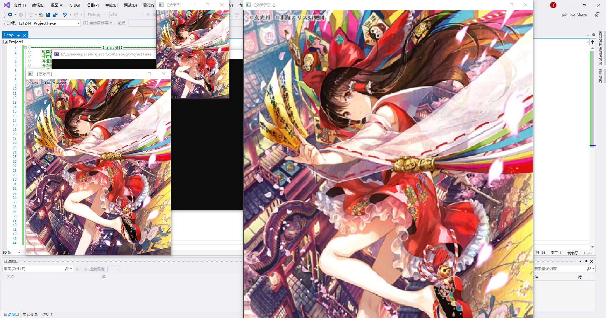

**图像金字塔API函数**

对图像向上采样：pyrUp函数
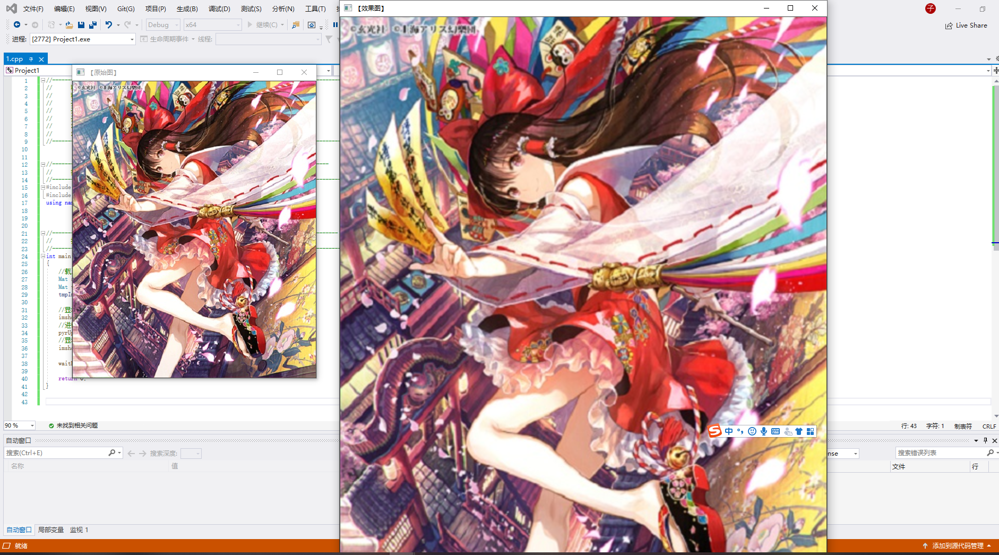

对图像向下采样：pyrDown函数
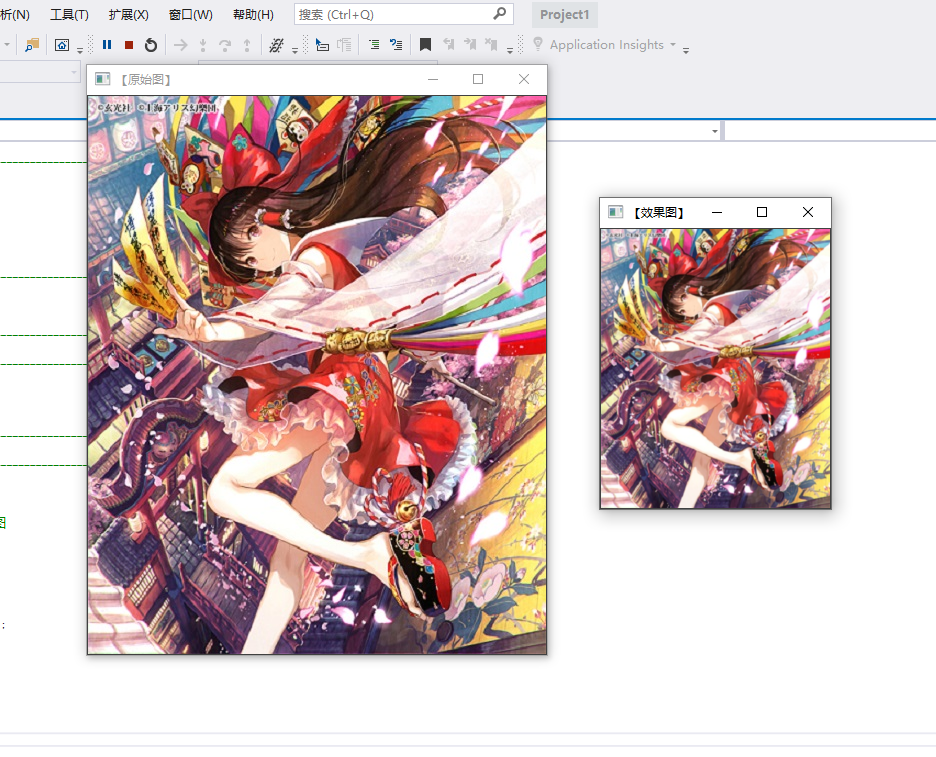

**综合示例：图像金字塔与图片缩放**
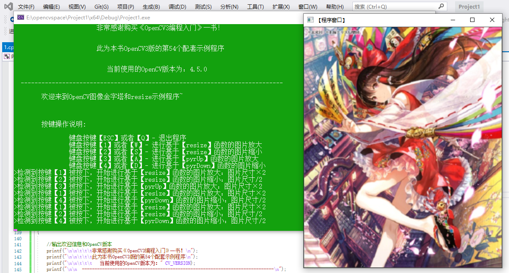

## 6.7 阈值化

在对各种图形进行处理操作的过程中，我们常常需要对图像中的像素做出取舍与决策，直接剔除一些低于或者高于一定值的像素。

阈值可以被视作最简单的图像分割的方法。比如，从一幅图像中利用阈值分割出我们需要的物体部分，这样的图像分割方法基于图像中物体与北京之间的灰度差异，而且此分割属于像素级的分割。为了从一副图像中提取出我们需要的部分，应该用图像中的每一个像素点的灰度值与选取的阈值相比较，并作出相应的判断。

对于我们的阈值化，我们主要是有两种方法，一种是固定阈值操作Threshold，一种是自适应阈值操adaptiveThreshold，对于固定阈值操作。

**示例程序：基本阈值操作**

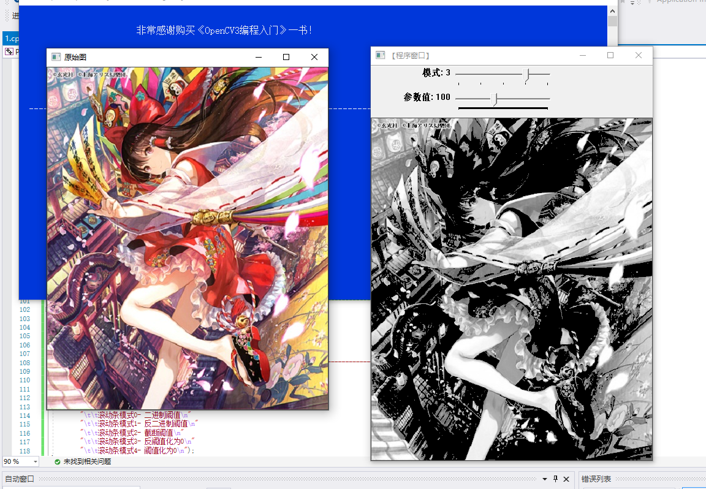

# CH07 图像变换
## 7.1 基于OpenCV的边缘检测

**边缘检测的一般步骤**

滤波：边缘检测算法主要是基于图像强度的一阶和二阶导数，但是导数对于噪声很敏感，因此需要采用滤波器来改善与噪声有关的边缘检测器的性能

增强：增强边缘的基础是确定图像各点邻域强度的变化值。增强算法可以将灰度点邻域强度值有显著变化的点凸显出来

检测：邻域中有很多的点的梯度值较大，但是在特定的应用中，这些点并不是要找的边缘点，需要取舍

### **canny算子**

Canny边缘检测算子是John F. Canny于1986年开发出来的一个多级边缘检测算法。更为重要的是Canny创立了“边缘检测计算理论”（computational theory of edge detection）解释这项技术如何工作。

**评价标准**

低错误率：标识出尽可能多的实际边缘，同时尽可能地减少噪声产生的误报。

高定位性：标识出的边缘要与图像中的实际边缘尽可能接近
最小响应：图像中的边缘只能标识一次，并且可能存在的图像噪声不应标识为边缘

**canny边缘检测的步骤**

（1）消除噪声

（2）计算梯度幅值和方向

（3）非极大值抑制

（4）滞后阈值

**示例程序：canny边缘检测**

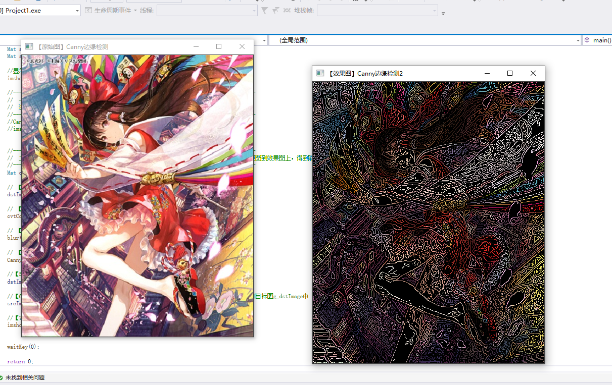

**sobel算子**

sobel算子是计算机视觉领域的一种重要处理方法。主要用于获得数字图像的一阶梯度，常见的应用和物理意义是边缘检测。sobel算子是把图像中每个像素的上下左右四领域的灰度值加权差，在边缘处达到极值从而检测边缘。 

sobel算子主要用作边缘检测。在技术上，它是一离散性差分算子，用来运算图像亮度函数的梯度之近似值。在图像的任何一点使用此算子，将会产生对应的梯度矢量或是其法矢量。

sobel算子不但产生较好的检测效果，而且对噪声具有平滑抑制作用，但是得到的边缘较粗，且可能出现伪边缘。

在边缘检测中，常用的一种模板是Sobel 算子。Sobel 算子有两个，一个是检测水平边缘的 ；另一个是检测垂直边缘的 。与Prewitt算子相比，Sobel算子对于象素的位置的影响做了加权，可以降低边缘模糊程度，因此效果更好。

Sobel算子另一种形式是各向同性Sobel(Isotropic Sobel)算子，也有两个，一个是检测水平边缘的 ，另一个是检测垂直边缘的 。各向同性Sobel算子和普通Sobel算子相比，它的位置加权系数更为准确，在检测不同方向的边沿时梯度的幅度一致。将Sobel算子矩阵中的所有2改为根号2，就能得到各向同性Sobel的矩阵。

由于Sobel算子是滤波算子的形式，用于提取边缘，可以利用快速卷积函数， 简单有效，因此应用广泛。美中不足的是，Sobel算子并没有将图像的主体与背景严格地区分开来，换言之就是Sobel算子没有基于图像灰度进行处理，由于Sobel算子没有严格地模拟人的视觉生理特征，所以提取的图像轮廓有时并不能令人满意。 在观测一幅图像的时候，我们往往首先注意的是图像与背景不同的部分，正是这个部分将主体突出显示，基于该理论，我们给出了下面阈值化轮廓提取算法，该算法已在数学上证明当像素点满足正态分布时所求解是最优的。

**综合示例**

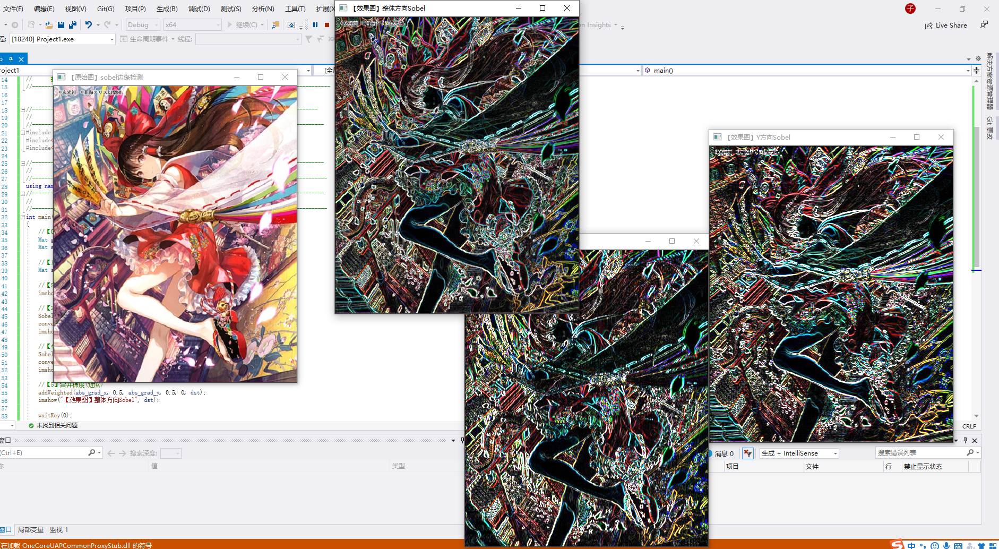

**Laplacian算子**
Laplacian 算子是n维欧几里德空间中的一个二阶微分算子，定义为梯度grad的散度div。可使用运算模板来运算这定理定律。

如果f是二阶可微的实函数，则f的拉普拉斯算子定义为：

(1) f的拉普拉斯算子也是笛卡儿坐标系中的所有非混合二阶偏导数求和：

(2) 作为一个二阶微分算子，拉普拉斯算子把C函数映射到C函数，对于k ≥ 2。表达式(1)（或(2)）定义了一个算子Δ : C(R) → C(R)，或更一般地，定义了一个算子Δ : C(Ω) → C(Ω)，对于任何开集Ω。

**示例：Laplacian算子使用**

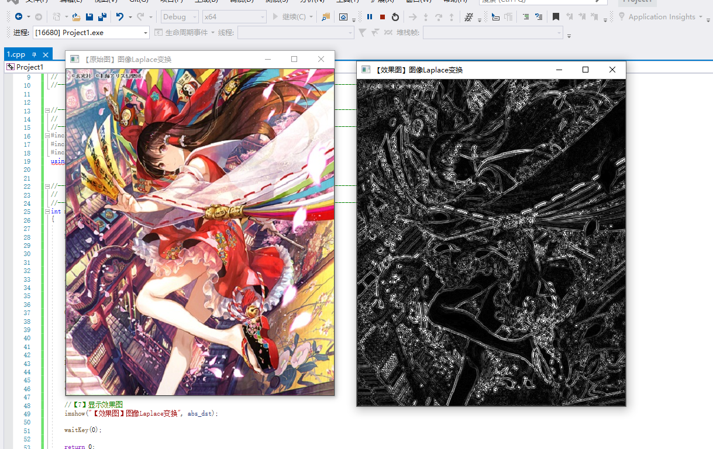

**示例程序：scharr滤波器**

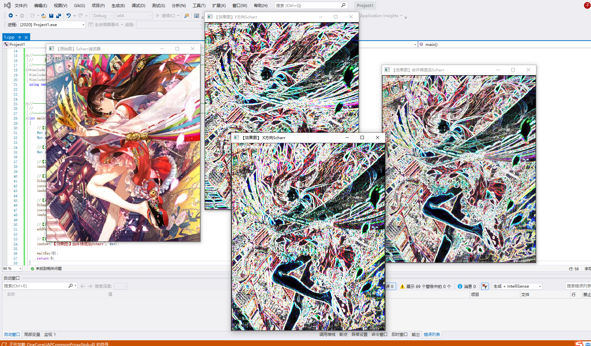

**综合示例**

## 7.2 霍夫变换

**概述**

霍夫变换（Hough Transform）是图像处理中的一种特征提取技术，该过程在一个参数空间中通过计算累计结果的局部最大值得到一个符合该特定形状的集合作为霍夫变换的结果。
霍夫变换运用两个坐标空间之间的变换将一个空间中具有相同形状的曲线或直线映射到另一个坐标空间中的一个点上形成峰值。

**Opencv中的霍夫线变换**

霍夫线变换是一种来寻找直线的方法，在使用霍夫变换之前，首先对图像进行边缘检测的处理。霍夫线变换的直接输入只能是边缘二值图像。

Opencv中的霍夫线变换

标准霍夫变换(StandardHough Transform ,SHT)。由HougLines函数调用

多尺度霍夫变换(Multi-ScaleHough Transform ,MSHT)，由HoughLines()调用

累计概论互霍夫变换（Progressive Probabilistic Hough Transform ,PPHT）由HoughLinesP函数调用，执行效率更高

**标准霍夫变换：HoughLines()函数**

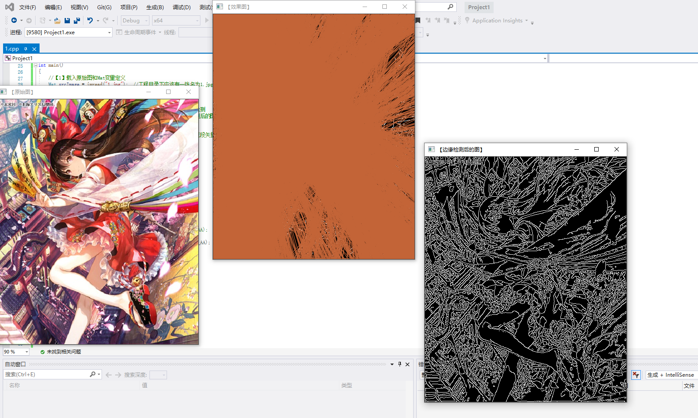

**累计概率霍夫变换：HoughLinesP()函数**

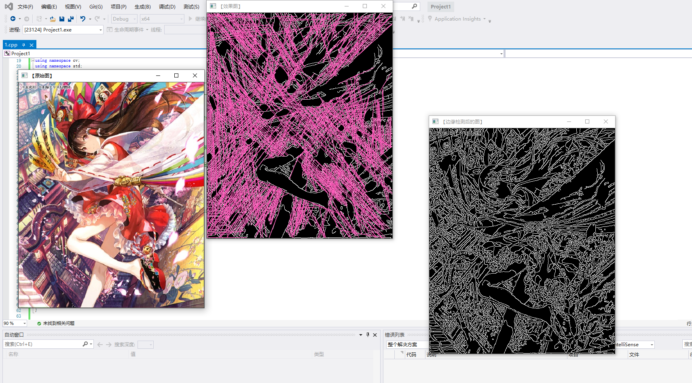

**霍夫圆变换**

只要点对应的二维极径角空间被三维的圆心点x,y和半径r空间取代。表示一个圆C:(xcenter,ycenter,r)

**霍夫梯度法的原理**

1,首先对图像应用边缘检测，比如用canny边缘检测

2.然后，对边缘图像中的每一个非零点，考虑其局部梯度，即用Sobel（）函数计算x和y方向的sobel一阶导数得到了梯度

3.利用得到的梯度，用斜率指定的直线上的每一个点都在累加器被累加。这里的斜率是从一个指定的最小值到指定的最大值的距离

4.同时，标记边缘图像中非0像素的位置

5.然后从二维累加器中这些点选择候选的一个中心，这些中心都大于给定阈值并且大于其所有近邻，这些候选的中心按照累加值降序排列。

6.接下来对每一个中心，考虑所有的非0像素

7.这些像素按照其与中心的距离排序，从最大半径的最小距离算起，选择非0像素最支持的一条半径

8.如果一个中心收到边缘图像非0像素最充分的支持，并且到前期被选择的中心由足够的距离，那么就会被留下来

**霍夫梯度法的缺点**

1.输出中产生一些噪声

2.如果由同心圆，就只能选择其中的一个

**霍夫圆变换：HoughCircles()函数**

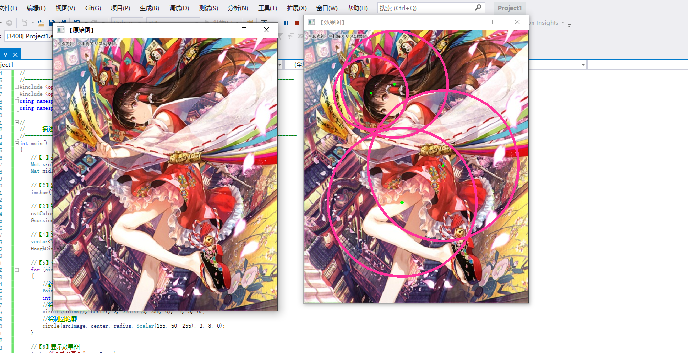

**综合示例**
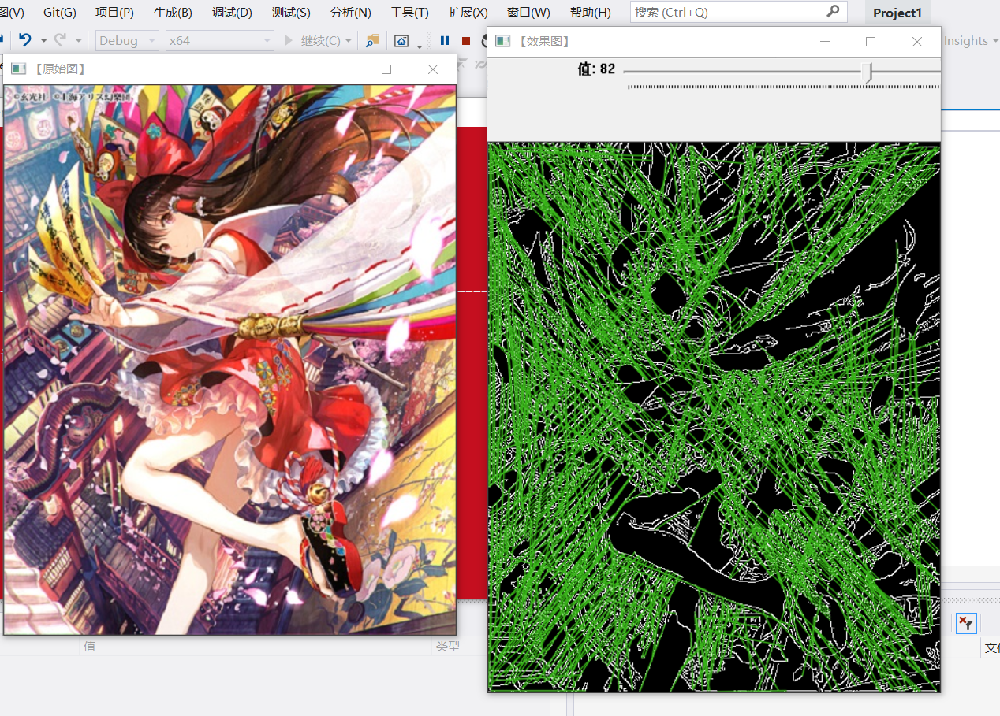

## 7.3 重映射

**重映射的概念**

重映射就是把一副图像中某位置的像素放置到另一个图片指定位置的过程，为了完成映射过程，需要获得一些插值为非整数像素的坐标。

g(x,y)=f(h(x,y))

* g()是目标图像
* f()是源图像
* h(x,y)是作用于 (x,y)的映射方法函数

**实现重映射：remap()函数**

**示例：基本重映射**

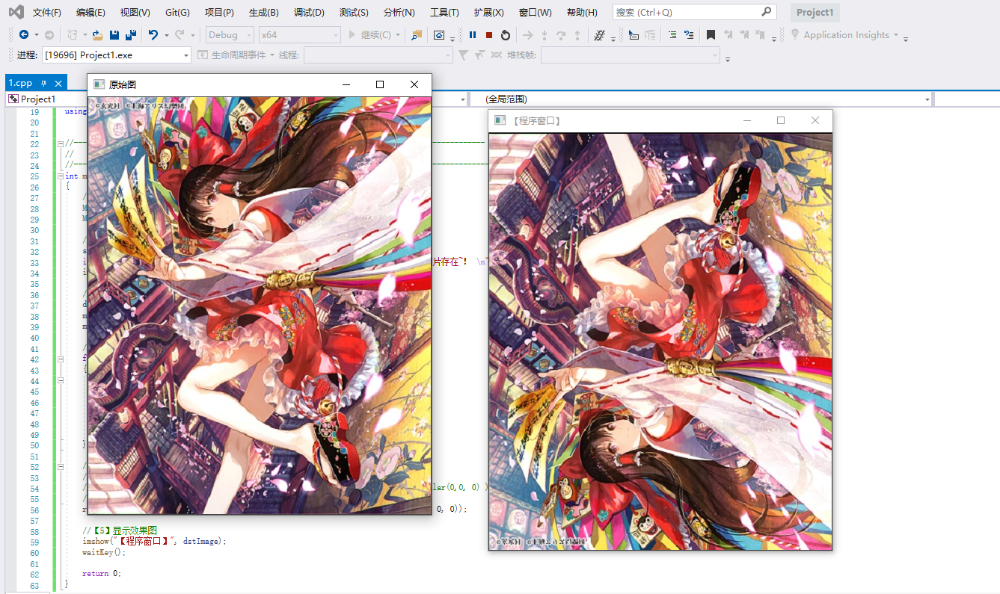

**综合示例：多种重映射**

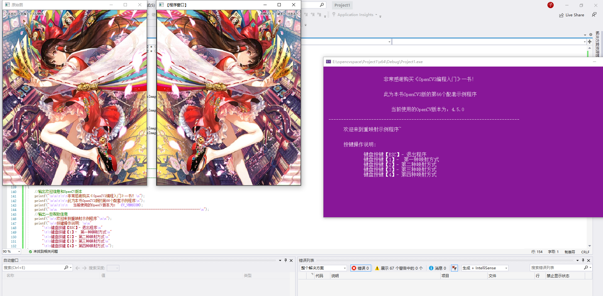

## 7.5 仿射变换

仿射变换（Affine Transformation or Affine Map）又称仿射映射。在几何中，一个向量空间进行一次线性变换并接上一个平移，变换为另一个向量空间的过程。保持二维图像的“平直性”和“平行性”
一个任意的仿射变换都能表示为乘以一个矩阵（线性变换）再加上一个向量（平移）的形式
常用的三种常见的变换形式

旋转，rotation（线性变换）
平移，translation向量加
缩放，scale线性变换

**仿射变换的求法**

已知X和T，而且已知它们之间的联系。接下啦就是求出矩阵M
已知M和X,那么T=MX，

OpenCV仿射变换相关函数一般涉及到warpAffine和getRotationMatrix2D

Opencv函数warpAffine来实现一些简单的重映射

Opencv函数getRotationMatrix2D来获取旋转矩阵

**进行仿射变换:warpAffine()函数**

**计算二维旋转变换矩阵:getRotationMatrix2D()函数**

**示例程序：仿射变换**

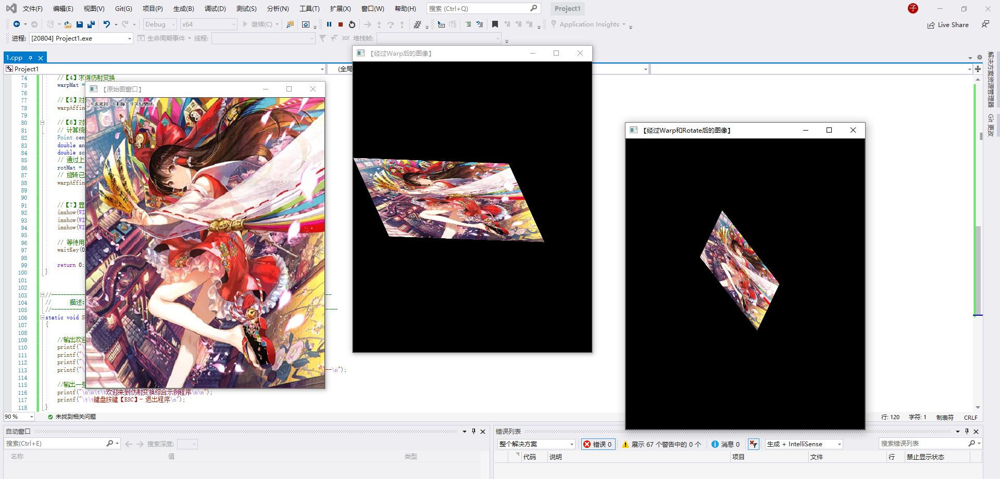

## 7.6 直方图均衡化

**概念和特点**

均衡化处理后的图像只能是近似均匀分布，均衡化图像的动态范围扩大了。但是本是扩大了量化间隔，量化级别减少。原来灰度不同的像素经过处理后可能变的相同，形成了一片相同的灰度区域

**实现直方图均衡化：equalizeHist()函数**

**示例**
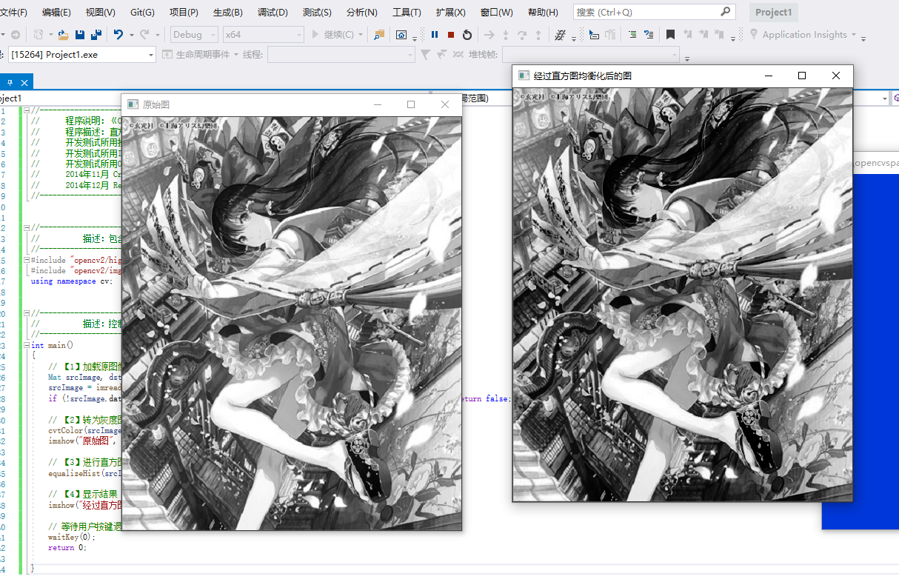

# CH08 图像轮廓与图像分割修复

## 8.1 查找并绘制轮廓

**寻找轮廓：findContours()函数**

**绘制轮廓：drawContours()函数**

**基础示例程序：轮廓查找**

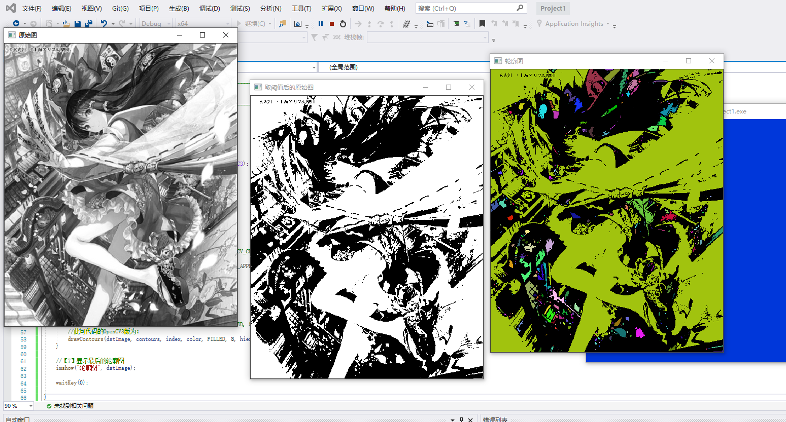

**综合示例：查找和绘制图像轮廓**

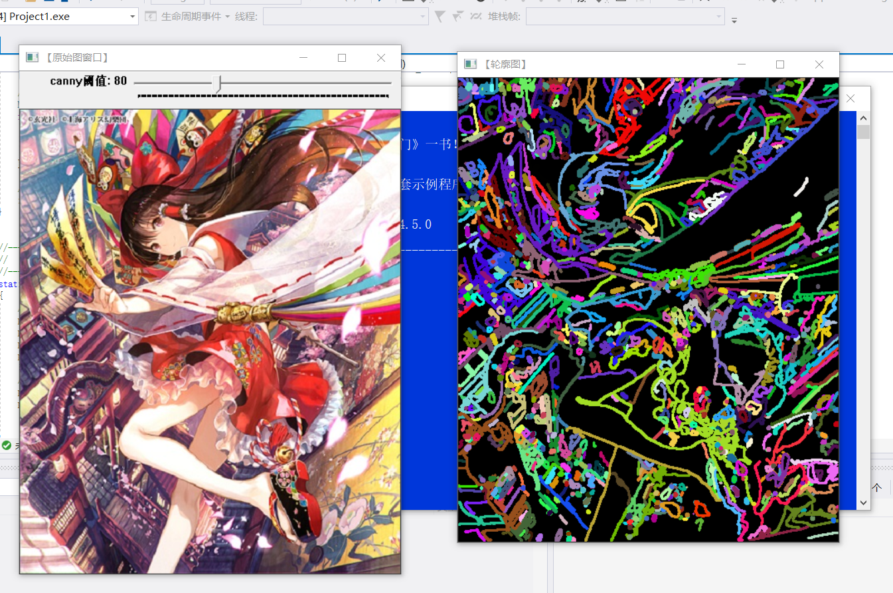

## 8.2 寻找物体的凸包

**凸包**

凸包(Convex Hull)是一个计算几何（图形学）中常见的概念。给定二维平面上的点集，凸包就是将最外层的点连接起来构成的凸多边形。

**寻找凸包：convexHull()函数**

**示例：凸包检测基础**
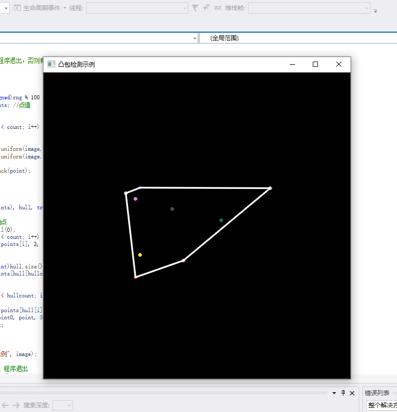

**综合示例：寻找和绘制物体的凸包**

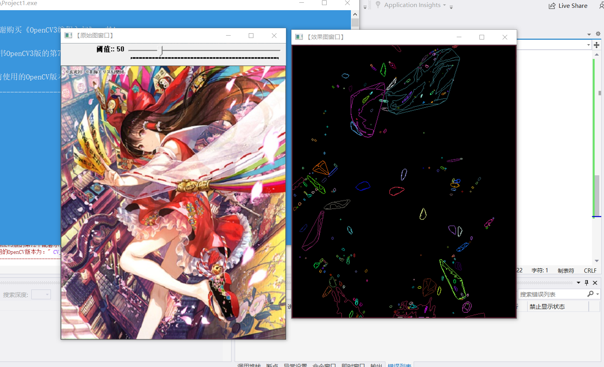

## 8.3 多边形包围轮廓

1.返回外部矩形边界boundingRect(()函数

2.寻找最小包围矩形minAreaRect()函数

3.寻找最小包围圆形：minEnclosingCircle()函数

4.椭圆拟合二维点集fitEllipse()函数

5.逼近多边形曲线：approxPolyDP()函数

**示例程序：包围轮廓的矩形边界**

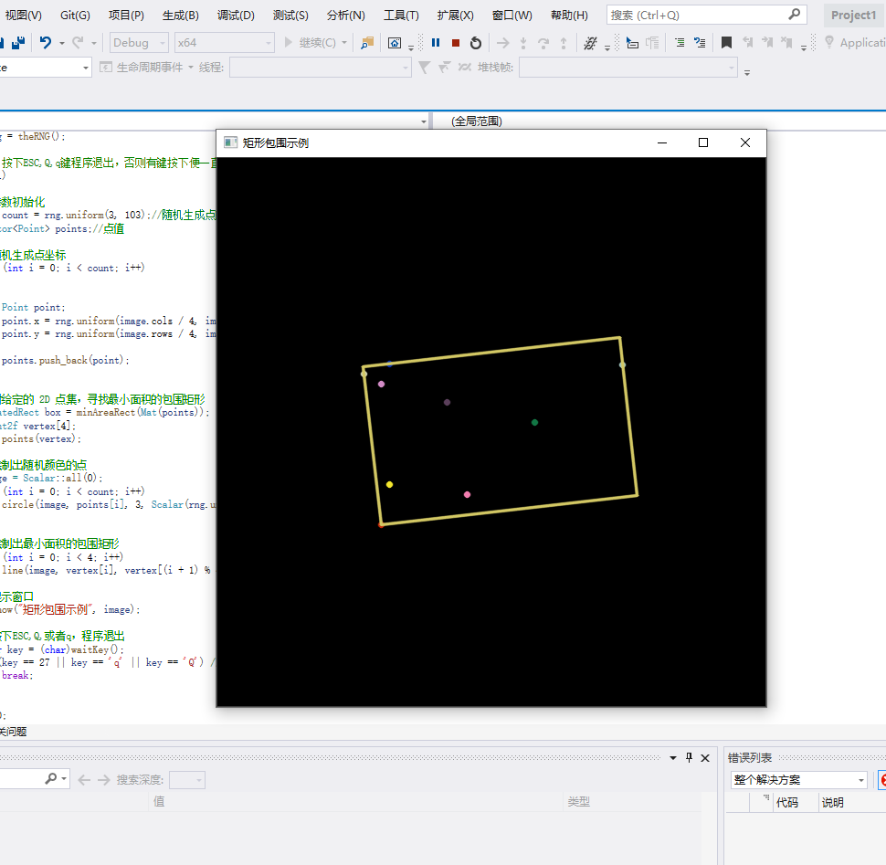

**示例程序：创建包围轮廓的圆形边界**

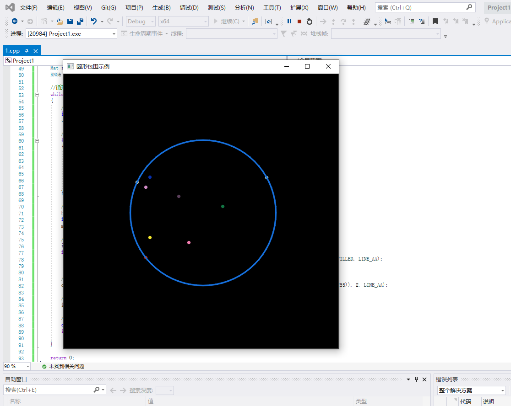

**综合示例:使用多边形包围轮廓**

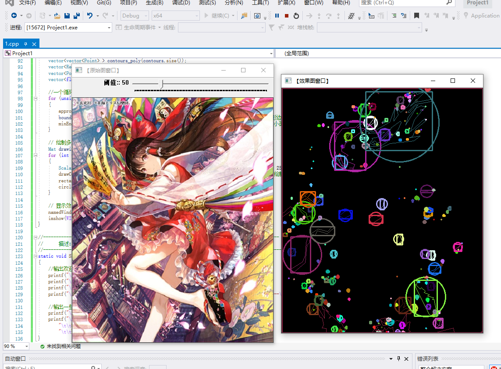

## 8.4 图像的矩

**定义**

一个从数字图形中计算出来的矩集，通常描述了该图像的全局特征，并提供了大量的关于该图像不同类型的几何特征信息，比如大小、位置、方向及形状等。

一阶矩与形状有关，二阶矩显示了曲线围绕直线平均值的扩展程度，三阶矩则是关于平均值的对称性测量。

**矩的计算：moments()函数**

**计算轮廓面积：contourArea()函数**

**计算轮廓长度：arcLength()函数**

**综合示例：查找和绘制图像轮廓矩**

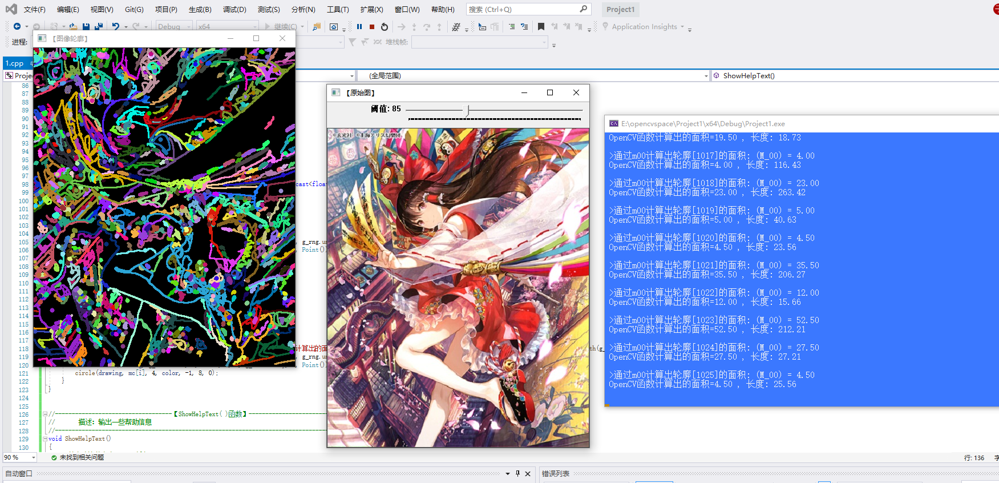

## 8.5 分水岭算法

**定义**

分水岭算法(watershed algorithm)可以将图像中的边缘转化为“山脉”，将均匀区域转化为“山谷”，在这方面有助于分割目标。

分水岭算法：是一种基于拓扑理论的数学形态学的分割方法。把图像看作是测地学上的拓扑地貌，图像中的每一个点像素值的灰度值表示该点的海拔高度，每一个局部极小值及其影响的区域称为“集水盆”，集水盆的边界可以看成分水岭。在每一个局部极小值表面刺穿一个小孔，然后把整个模型慢慢浸入水中，随着浸入的加深，每一个局部极小值的影响域慢慢的向外扩展，在两个集水盆汇合处构建大坝，形成分水岭。

迭代标注过程：
1. 排序过程：对每个像素的灰度级进行从低到高的排序
2. 淹没过程：对每一个局部最小值在h阶高度的影响域采用先进先出结构判断及标注。

**实现算法:watershed()函数**

**综合示例：分水岭算法**

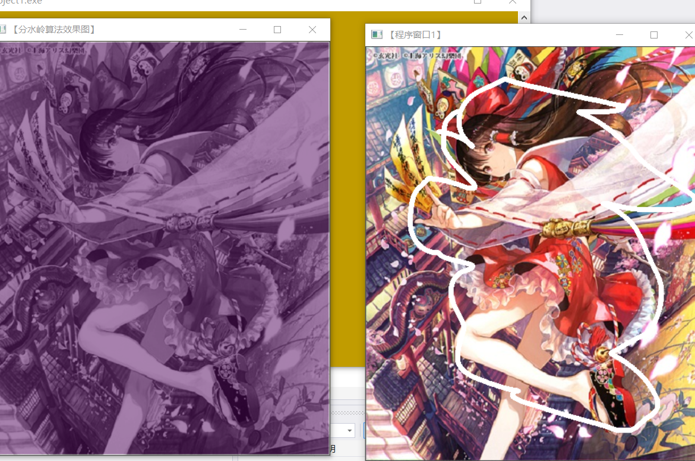

## 8.6 图像修补

**概念**

利用那些已经被破坏的区域的边缘，即边缘的颜色和结构，繁殖和混合到损坏的图像，以达到图像修补的目的。

**图像修补：inpaint()函数**

**综合示例：图像修补**

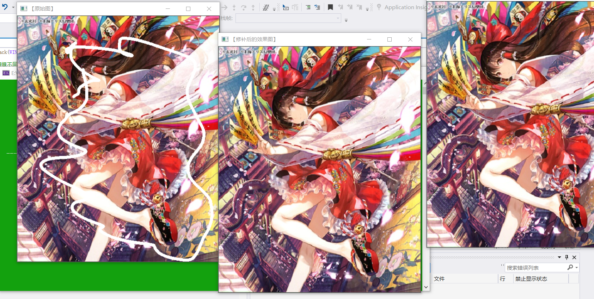

# CH09 直方图与匹配

## 9.1 图像直方图概述

直方图广泛的应用于很多计算机视觉当中，通过标记帧与帧之间显著的边缘和颜色的统计变化，来检测视频场景的变化。

直方图就是对数据进行统计的一种方法，并且将统计值组织到一系列事先定义好的bin当中。bin其数值就是从数据中计算出的特征统计量，这些数据可以是诸如梯度，方向，色彩或者其他特征。

图像直方图(Image Histogram)是用以表示数字图像中亮度分布的直方图，标绘了图像中每个亮度值的像素数，可以用来观察直方图了解需要如何调整亮度分布。
直方图的意义：

直方图是图像中像素强度分布的图形表达方式

它统计了每一个强度值所具有的像素个数

**具体的术语和细节**

dims：需要统计的特征的数目

bins：每个特征空间子区段的数目

range：每个特征空间的取值范围

## 9.2 直方图的计算与绘制

**计算直方图:calcHist()函数**

**找寻最值:minMaxLoc()函数**

**示例程序：H-S直方图**

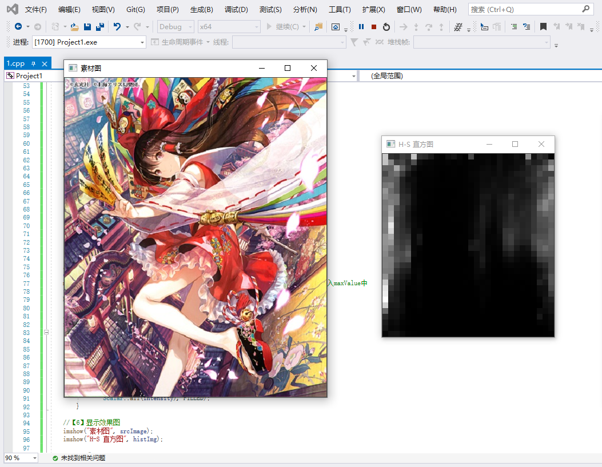

**示例程序：计算并绘制图像一维直方图**

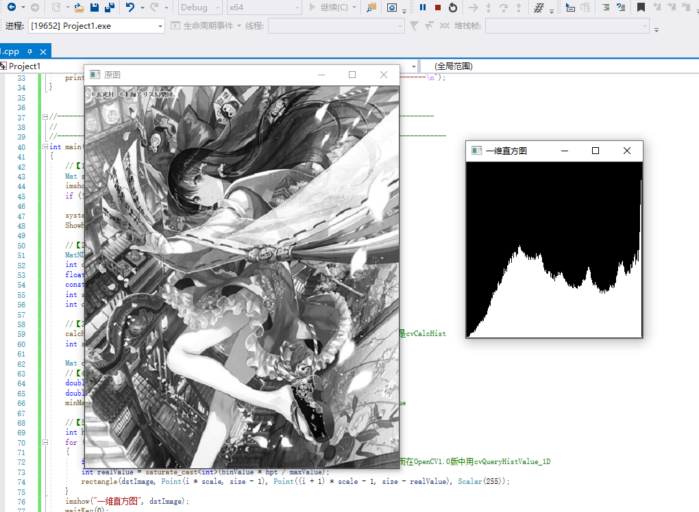

**示例程序：RGB三色直方图**

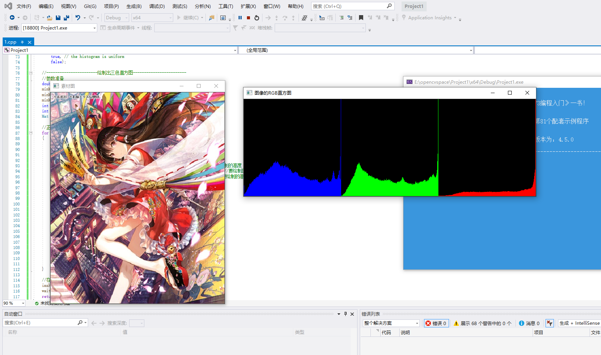

## 9.3 直方图对比

**对比**

要对两个直方图进行比较，首先必须选择一个衡量直方图相似度的对比标准。我们用compareHist()函数来对比两个直方图的相似度，函数的返回值就是d(H1,H2)

**对比直方图：compareHist()函数**

相关 Correlation(method = CV_COMP_CORREL)

卡方 Chi-Square(method = CV_COMP_CHISQR)

直方图相交 Intersection(method = CV_COMP_INTERSECT)

Bhattacharyya距离(method = CV_COMP_BHATTACHARYYA)

**示例程序：直方图对比**

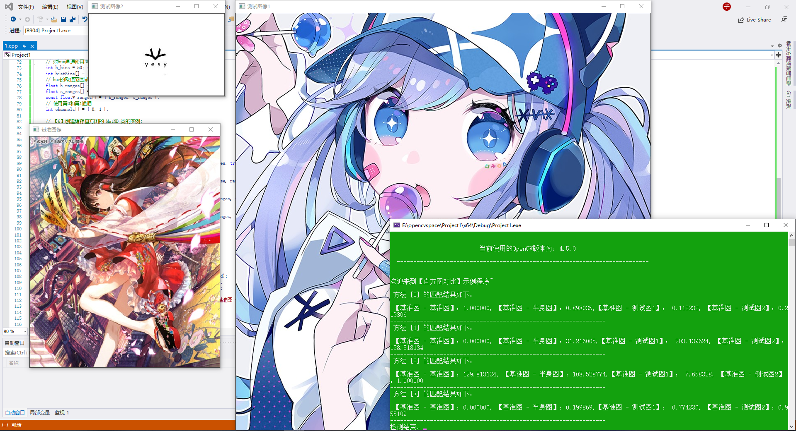

## 9.4 反向投影

**反向投影**

反向投影就是一种记录给定图像中像素店如何适应直方图模型像素分布方式的一种方法。简单来说就是，反向投影就是首先计算某一特征的直方图模型，然后使用模型去寻找图像中存在的该特征的方法

**工作原理**

1.对测试图像中的每个像素p(i,j),获取色调数据并找到该色调(hi,j,si,j)在直方图的bin的位置

2.查询模型直方图中对应bin的数值

3.将此数值存储在新的反射投影图像中。也可以先归一化直方图数值到0∼255范围，这样可以直接显示反射投影图像（单通道图像）

4.通过对测试图像中的每个像素采用以上步骤，可以得到最终的反射投影图像

5.使用统计学语言进行分析，反向投影中存储的数值代表了测试图像中该像素属于皮肤区域的概率。

**反向投影的作用**

反向投影用于在输入图像中查找与特定图像(通常较小获取仅1个像素，以下将其称为模板图像）最匹配的点或者区域，也就是定位模板图像出现在输入图像的位置

**反向投影的结果**

反向投影的结果包含了以每个输入图像像素点为起点的直方图对比结果。可以把它看成是一个二维的浮点型数组，二维矩阵或者单通道的浮点型图像。

**计算反向投影：calcBackProject()函数**

**通道复制：mixChannels()函数**

**综合程序：反向投影**

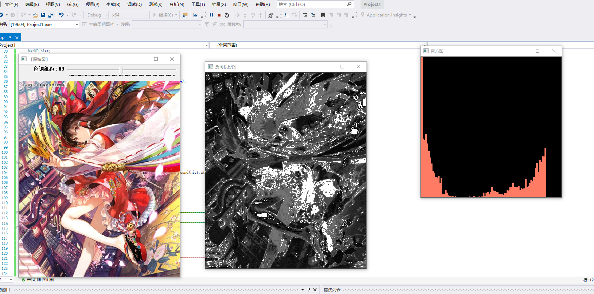

## 9.5 模板匹配

**概念和原理**

模板匹配就是一项在一副图像中寻找与另一幅模板图像最匹配（相似）部分的技术。模板匹配不是基于直方图，而是通过在输入图像上滑动图像块，对实际图像快和输入图像进行匹配的一种匹配方法。

**模板匹配：matchTemplate()函数**

1.平方差匹配法：method = TM_SQDIFF

2.归一化平方差匹配法：method = TM_SQDIFF_NORMED

3.相关匹配法： method=TM_CCORR

4.归一化相关匹配法

5.系数匹配法 method=TM_CCOEFF

6.化相关系数匹配法 method = TM_CCOEFF_NORMED

**综合实例**

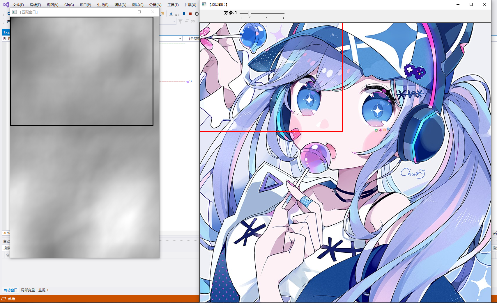