## 第六章图像处理
### 1.线性滤波：方框滤波、均值滤波、高斯滤波
滤波处理分为两大类：线性滤波和非线性滤波。OpenCV里有这些滤波的函数，使用起来非常方便，现在简单介绍其使用方法。
线性滤波:
1. 方框滤波：模糊图像
方框滤波（box Filter）被封装在一个名为boxblur的函数中，即boxblur函数的作用是使用方框滤波器（box filter）来模糊一张图片，从src输入，从dst输出
2. 均值滤波：模糊图像
均值滤波是最简单的一种滤波操作，输出图像的每一个像素是核窗口内输入图像对应像素的像素的平均值( 所有像素加权系数相等)，其实说白了它就是归一化后的方框滤波。blur函数内部中其实就是调用了一下boxFilter

    均值滤波本身存在着固有的缺陷，即它不能很好地保护图像细节，在图像去噪的同时也破坏了图像的细节部分，从而使图像变得模糊，不能很好地去除噪声点。特别是椒盐噪声
3. 高斯滤波：信号的平滑处理，去除符合正太分布的噪声
高斯滤波是一种线性平滑滤波，适用于消除高斯噪声，广泛应用于图像处理的减噪过程。通俗的讲，高斯滤波就是对整幅图像进行加权平均的过程，每一个像素点的值，都由其本身和邻域内的其他像素值经过加权平均后得到。高斯滤波的具体操作是：用一个模板（或称卷积、掩模）扫描图像中的每一个像素，用模板确定的邻域内像素的加权平均灰度值去替代模板中心像素点的值。高斯滤波最有用的滤波操作，虽然效率往往不是最高的。需要注意的是opencv中的GaussianBlur()是高斯低通滤波器，用来模糊减噪，所以叫高斯模糊。
代码实现：
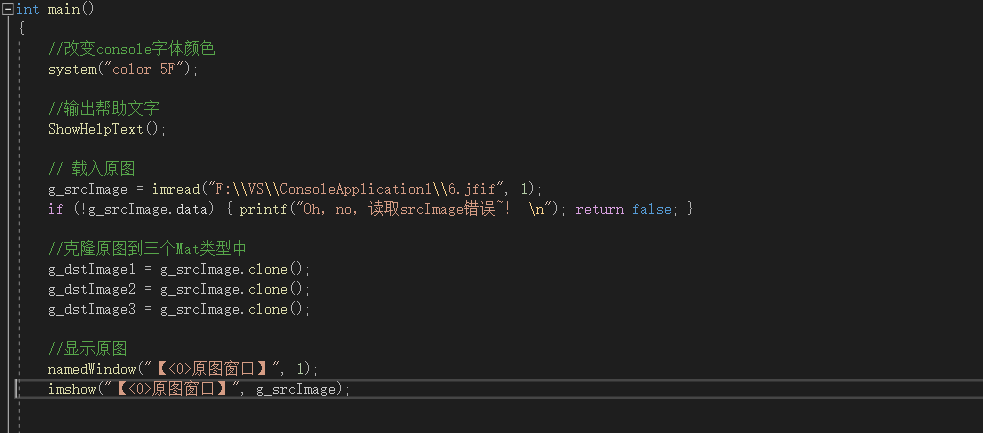
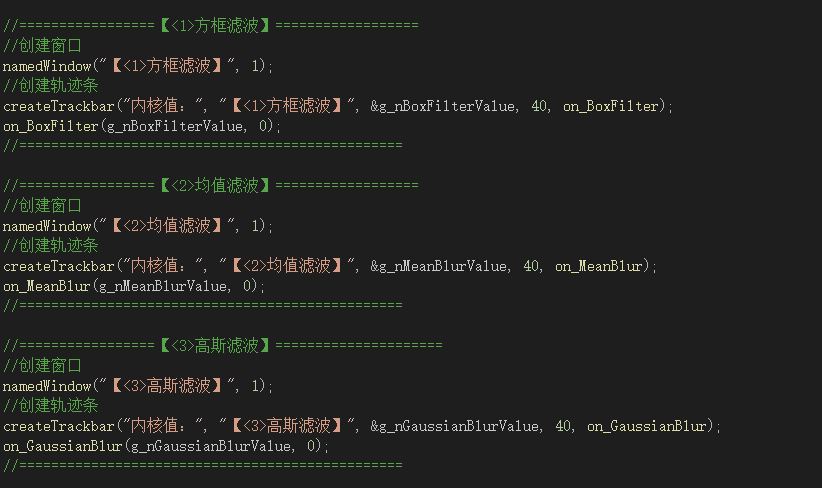
运行结果：
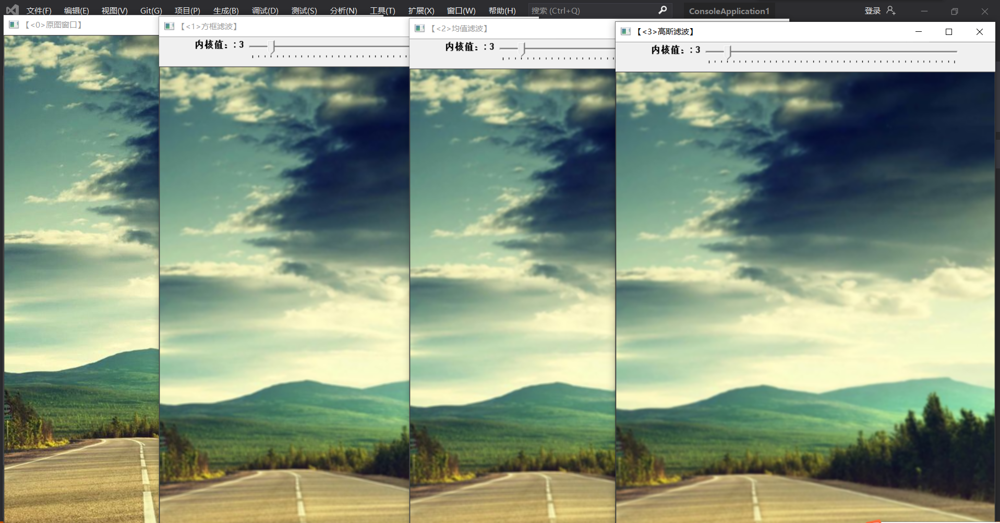
### 2.非线性滤波
在很多情况下，使用邻域像素的非线性滤波也许会得到更好的效果。比如在噪声是散粒噪声而不是高斯噪声，即图像偶尔会出现很大的值的时候。在这种情况下，用高斯滤波器对图像进行模糊的话，噪声像素是不会被去除的，它们只是转换为更为柔和但仍然可见的散粒。
1. 中值滤波medianBlur()
    中值滤波（Median filter）是一种典型的非线性滤波技术，基本思想是用像素点邻域灰度值的中值来代替该像素点的灰度值，该方法在去除脉冲噪声、椒盐噪声的同时又能保留图像边缘细节，中值滤波是基于排序统计理论的一种能有效抑制噪声的非线性信号处理技术，其基本原理是把数字图像或数字序列中一点的值用该点的一个邻域中各点值的中值代替，让周围的像素值接近的真实值，从而消除孤立的噪声点，对于斑点噪声（speckle noise）和椒盐噪声（salt-and-pepper noise）来说尤其有用，因为它不依赖于邻域内那些与典型值差别很大的值。中值滤波器在处理连续图像窗函数时与线性滤波器的工作方式类似，但滤波过程却不再是加权运算。
2. 双边滤波bilateralFilter()
    双边滤波（Bilateral filter）是一种非线性的滤波方法，是结合图像的空间邻近度和像素值相似度的一种折衷处理，同时考虑空域信息和灰度相似性，达到保边去噪的目的。具有简单、非迭代、局部的特点。双边滤波器的好处是可以做边缘保存（edge preserving），一般过去用的维纳滤波或者高斯滤波去降噪，都会较明显地模糊边缘，对于高频细节的保护效果并不明显。

    双边滤波方法，主要是针对Gauss 滤波中将Gauss 权系数直接与图像信息作卷积运算进行图像滤波的原理，将滤波权系数优化成Gauss 函数和图像亮度信息的乘积，优化后的权系数再与图像信息作卷积运算，这样就能在滤波的同时考虑到图像信息中的图像边缘信息，使图像在正常Gauss 滤波后很模糊的边缘信息得以保持清晰，并且图像边缘更加平滑。此方法对于彩色和灰度图像的滤波均适用，具有很强的实用性。但是由于保存了过多的高频信息，对于彩色图像里的高频噪声，双边滤波器不能够干净的滤掉，只能够对于低频信息进行较好的滤波。
五种图像滤波综合示例
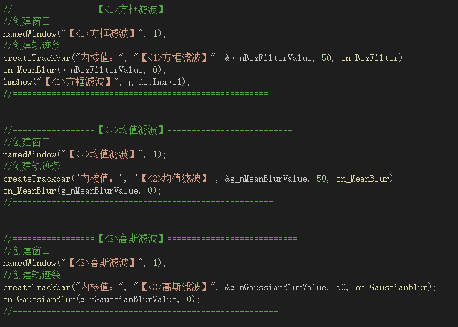
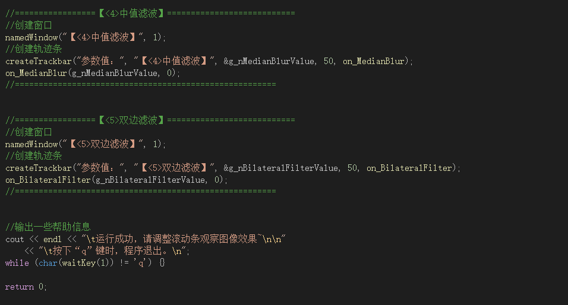
运行结果：
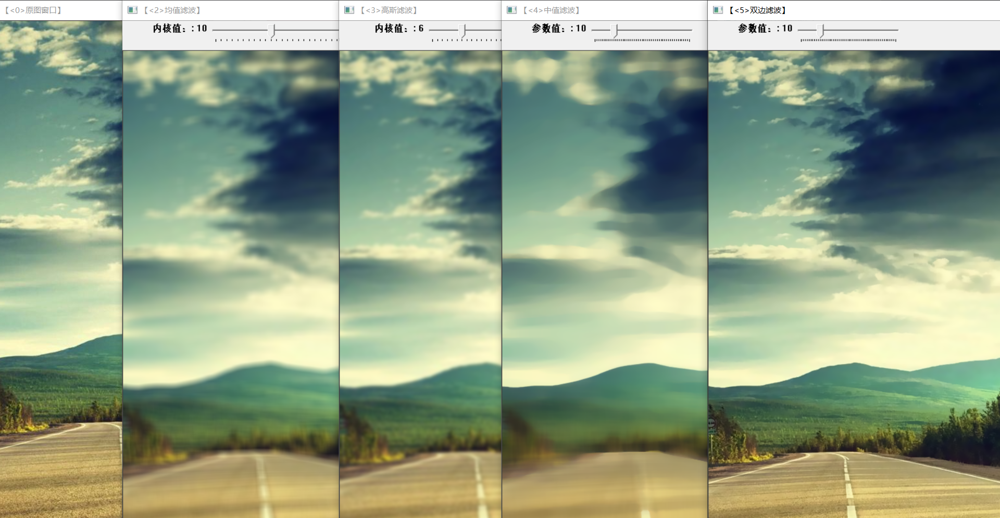
### 3.膨胀腐蚀
膨胀
跟卷积操作类似，假设有图像A和结构元素B，结构元素B在A上面移动，其中B定义其中心为锚点，计算B覆盖下A的最大像素值用来替换锚点的像素，其中B作为结构体可以是任意形状。我们回忆一下中值平滑操作——取每一个位置的矩形领域内值的中值作为该位置的输出灰度值，图像的膨胀操作与中值平滑操作类似，它是取每一个位置的矩形领域内值的最大值作为该位置的输出灰度值。不同的是，这里的领域不再单纯是矩形结构的，也可以是椭圆形结构的、十字交叉形结构的等，其中红色是参考点，也称为锚点（anchor point）

腐蚀
腐蚀操作与膨胀操作类似，只是它取结构元所指定的领域内值的最小值作为该位置的输出灰度值。因为取每个位置领域内最小值，所以腐蚀后输出图像的总体亮度的平均值比起原图会有所降低，图像中比较亮的区域的面积会变小甚至消失，而较暗物体的尺寸会扩大。
综合示例：腐蚀与膨胀
代码实现：
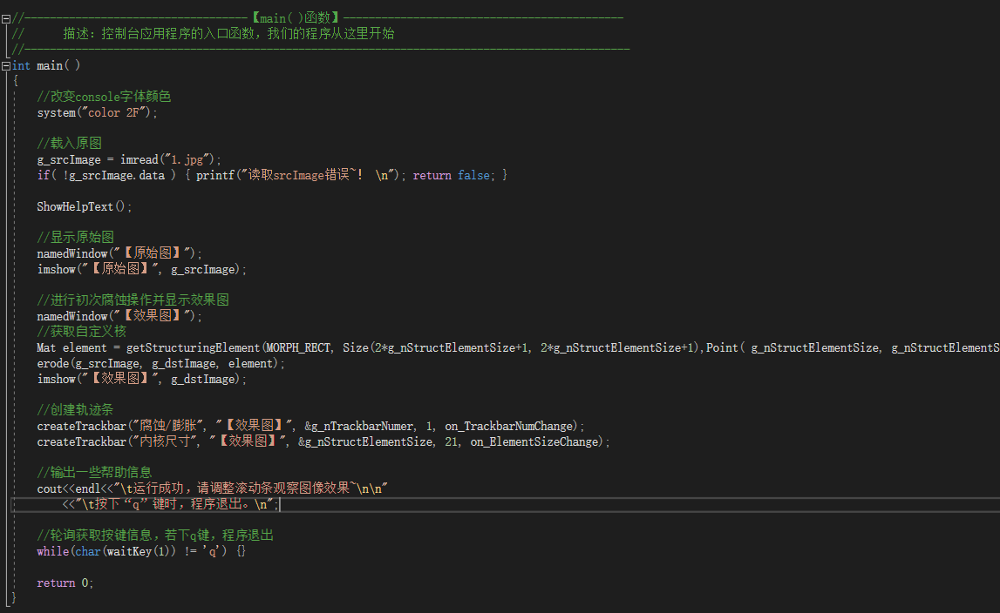
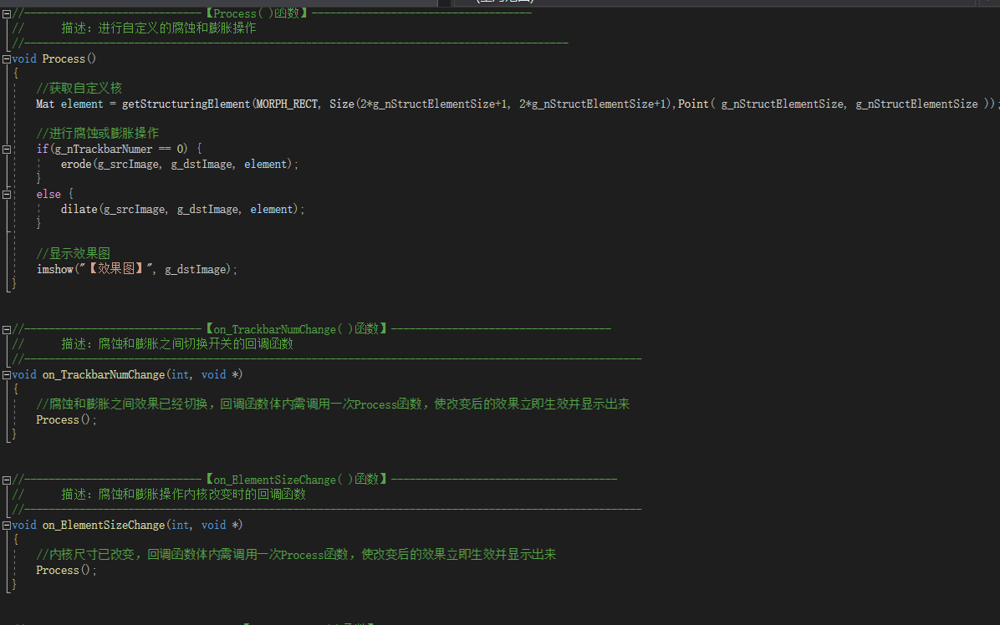
运行结果：
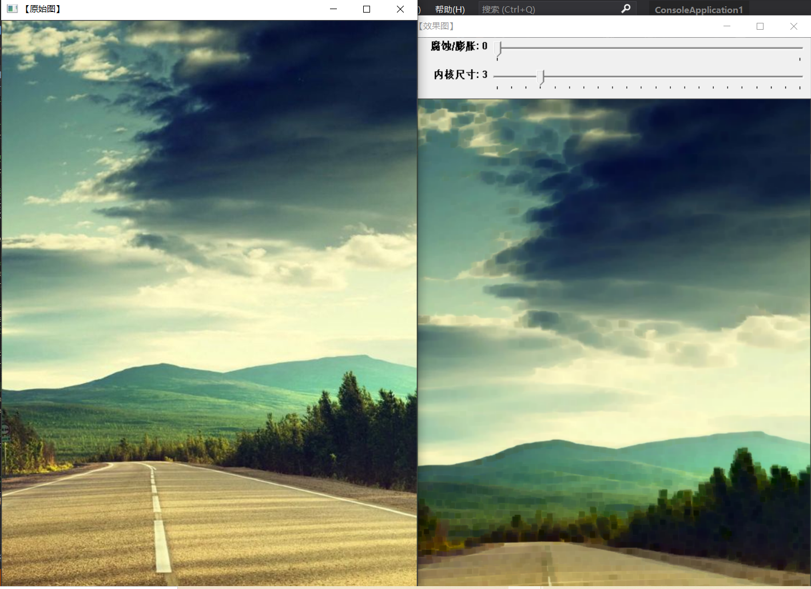
### 4.开闭梯度
开运算 = 先腐蚀运算，再膨胀运算
闭运算 = 先膨胀运算，再腐蚀运算
形态学梯度：膨胀图与腐蚀图之差
提取物体边缘
顶帽：原图像 - 开运算图
突出原图像中比周围亮的区域
黑帽：闭运算图 - 原图像
突出原图像中比周围暗的区域
能用一个函数进行处理
```
void morphologyEx(InputArray src, OutputArray dst, int op, InputArray kernel, ...)
```
第一个参数 输入
第二个参数 输出
第三个参数 操作类型
MORTH_OPEN 函数做开运算
MORTH_CLOSE 函数做闭运算
MORTH_GRADIENT 函数做形态学梯度运算
MORTH_TOPHAT 函数做顶帽运算
MORTH_BLACKHAT 函数做黑帽运算
MORTH_DILATE 函数做膨胀运算
MORTH_ERODE 函数做腐蚀运算
第四个参数 内核类型 用getStructuringElement函数得到
代码实现：
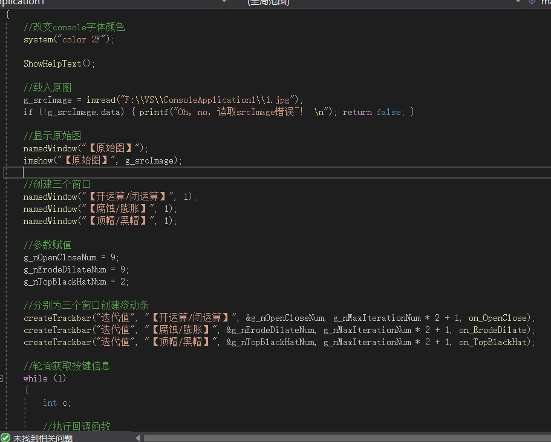
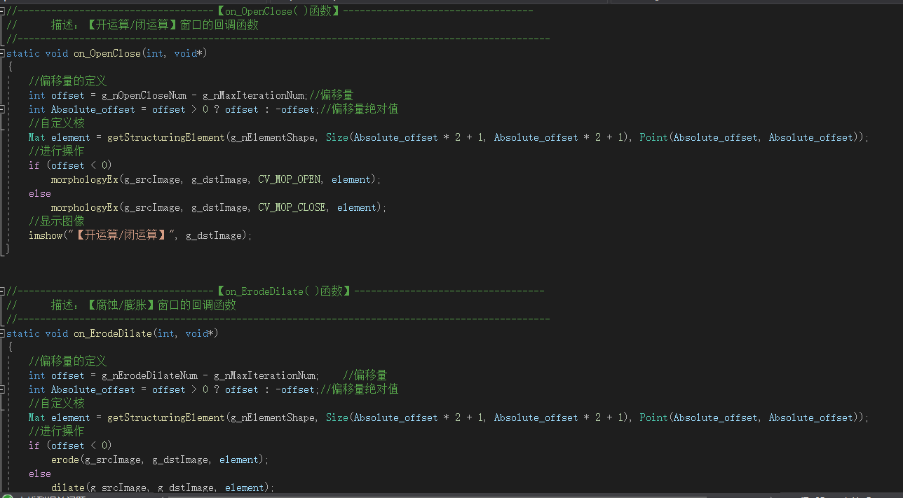
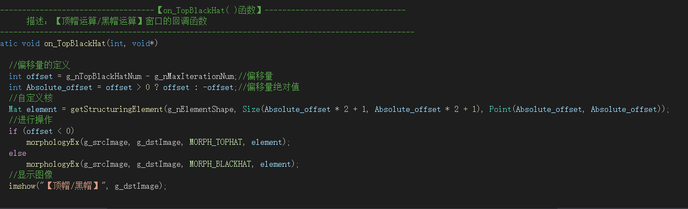
运行结果：
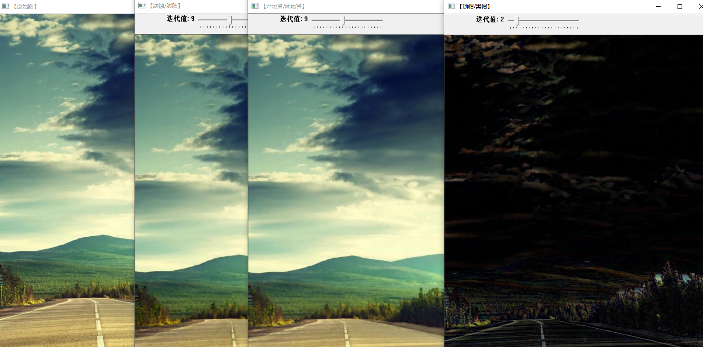
### 5.漫水填充
漫水填充算法是根据像素灰度值之间的差值寻找相同区域实现分割。我们可以将图像的灰度值理解成像素点的高度，这样一张图像可以看成崎岖不平的地面或者山区，向地面上某一个低洼的地方倾倒一定量的水，水将会掩盖低于某个高度的区域。漫水填充法利用的就是这样的原理，其形式与注水相似，因此被称形象的称为“漫水”。
函数原型
```
Int floodFill(InputOutputArray image,Point seedPoint,Scalar newVal,Rect*rect=0,Scalar loDiff=Scalar(),Scalar upDiff=Scalar(),int flags=4)
```
第一个参数：输入/输出1通道或3通道，8位或浮点图像，具体参数由之后参数指明。
第二个参数：漫水填充算法的起始点。
第三个参数：像素点被染色的值，即在重绘区域像素点的新值。
第四个参数：默认值0，一个可选的参数，用于设置floodFill函数将要重绘区域的最小边界矩形区域
第五个参数：表示当前观察像素值与其部件邻域像素值或者待加入该部件的种子像素之间的亮度或者颜色之负差的最大值。
第六个参数：表示当前观察像素值与其部件邻域像素值或者待加入该部件的种子像素之间的亮度或者颜色之正差的最大值。
第七个参数：操作标识符，有三种情况。

综合示例：漫水填充
代码：
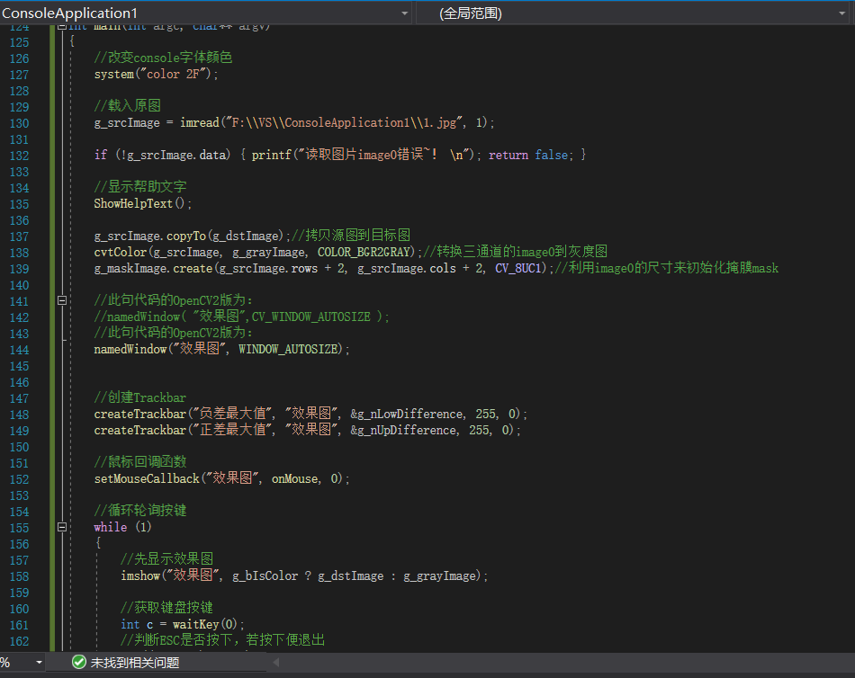
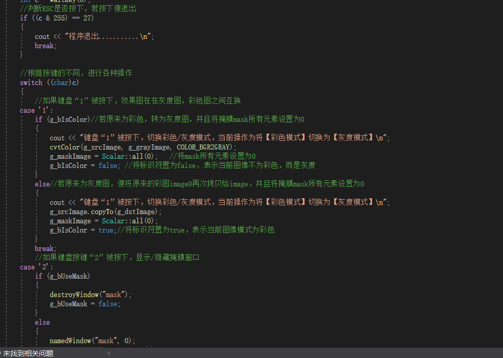
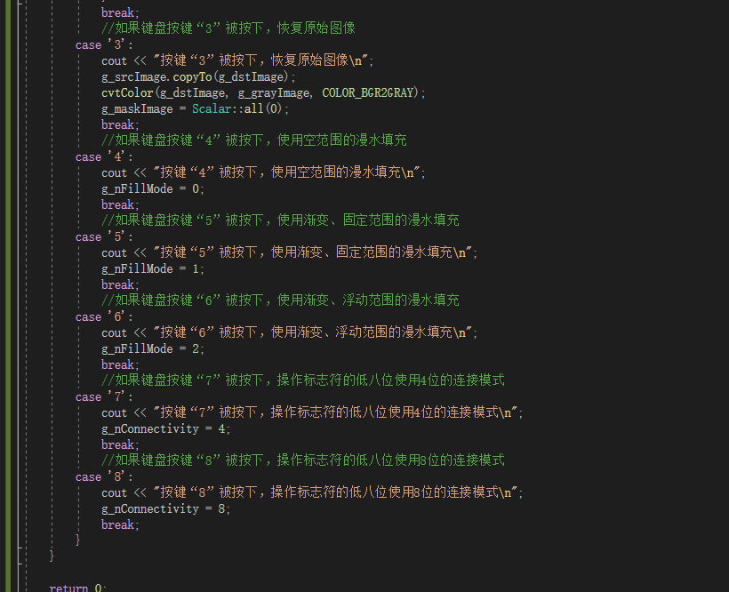
运行结果：
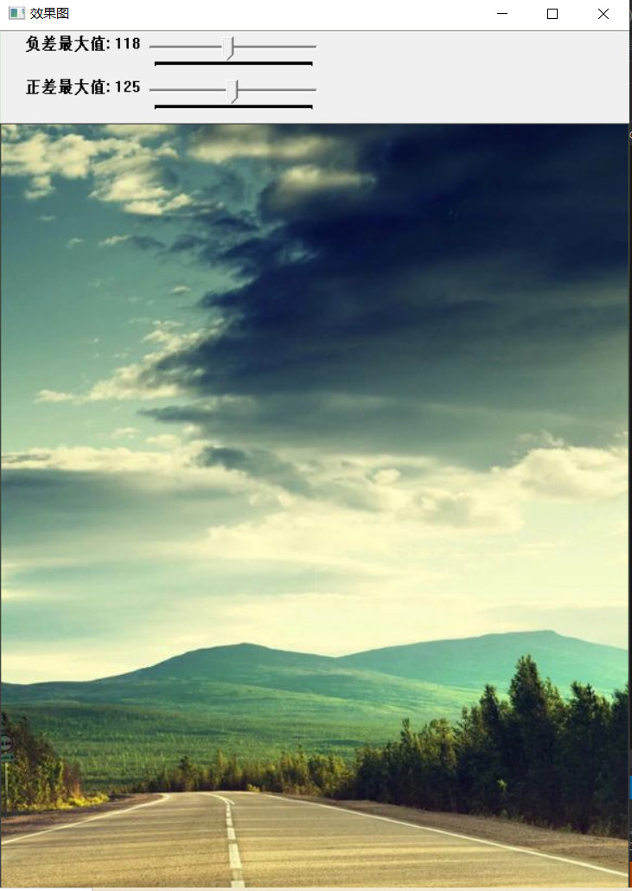

### 6.图像金字塔与缩放
图像金字塔是图像中多尺度表达的一种，主要用于图像的分割，是一种以多分辨率来解释图像的有效但概念简单的结构。一幅图像的金字塔式一系列以金字塔形状来排列的，多分辨率逐步降低且来源于同一张原始图的图像集合。其通过依次向下采样获得，直到达到某个终止条件才停止采样。金字塔的底部是待处理图像的高分辨率表示，顶部是低分辨率的近似。
常用的有两种金字塔：
高斯金字塔（Gaussian pyramid）
拉普拉斯金字塔（Laplacian pyramid）
- 向下采样：
从金字塔第 i 层生成第 i+1 层，先用高斯核对 G_i{} 进行卷积；
然后删除所有的偶数行和偶数列。
新得到的图像面积会变为源图像的四分之一。迭代这个过程就可以得到整个图像金字塔。
- 向上采样：
将图像在每个方向上扩大两倍，新增的行和列用 0 填充；
使用先前的搞死内核 （乘以 4 ）与放大后的图像进行卷积，获得新增图像的近似值
新得到的图像面积会变为源图像的四倍。迭代这个过程就可以得到整个图像金字塔。

向上采样和向下采样都会丢失一些源图像的信息。

resize() 函数。此函数精确地将源图像转换为指定尺寸的目标图像
pyrUp() 函数。向上采样并模糊图像
pyrDown() 函数。向下采样模糊图像

综合示例：图像金字塔与图片尺寸缩放
代码：
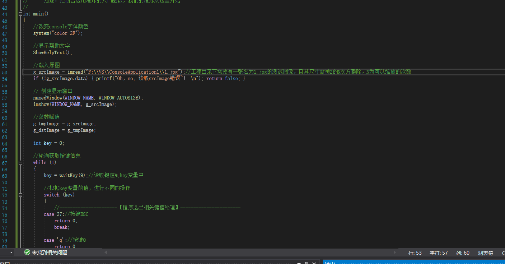
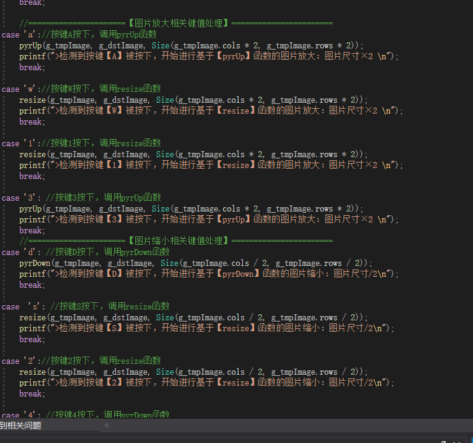
运行结果：
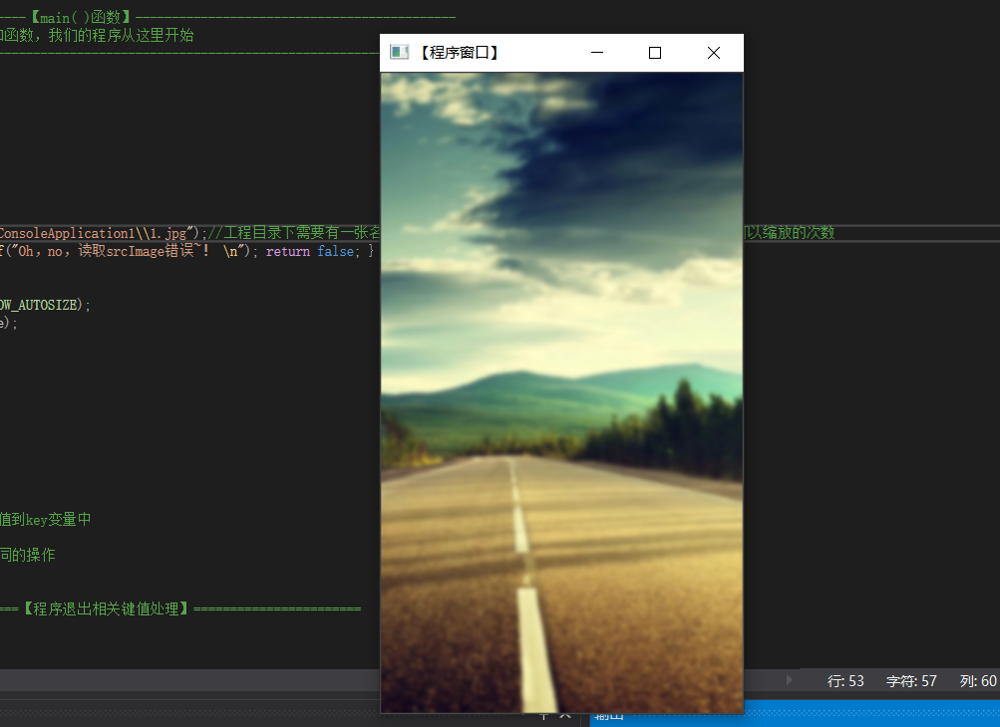
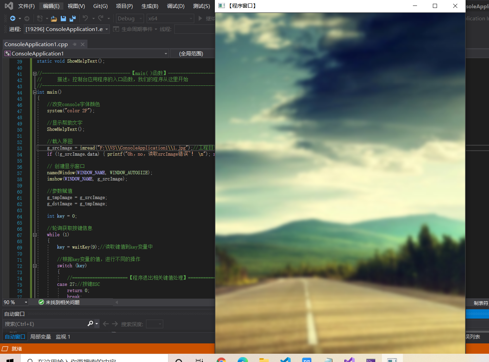

### 7.阈值化
图像的阈值化就是利用图像像素点分布规律，设定阈值进行像素点分割，进而得到图像的二值图像。图像阈值化操作有多种方法，常用方法有经典的OTSU、固定阈值、自适应阈值、双阈值及半阈值化操作
threshold()函数
```
double threshold( InputArray src,OutputArray dst,double threshold,double maxval,int type );
```
adaptiveThreshold()函数
```
Void adaptivethreshold(InputArray src,OutputArray dst,double maxValue,int adaptiveMethod,int thresholdType,int blockSize,double C
```
示例程序：基本阈值操作
代码：
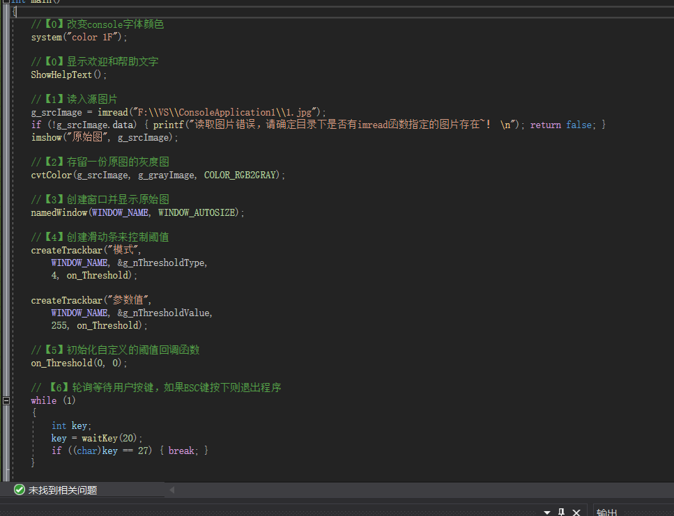

运行结果：
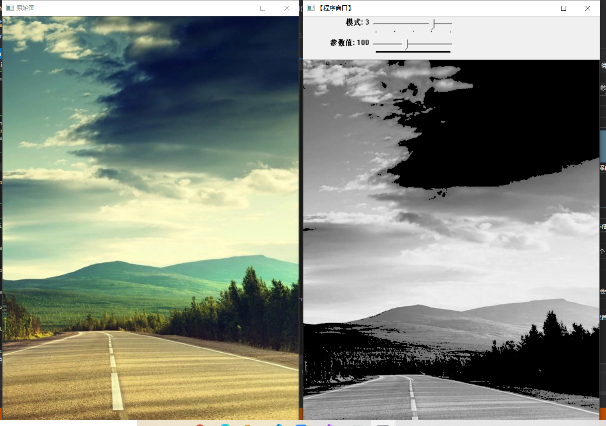
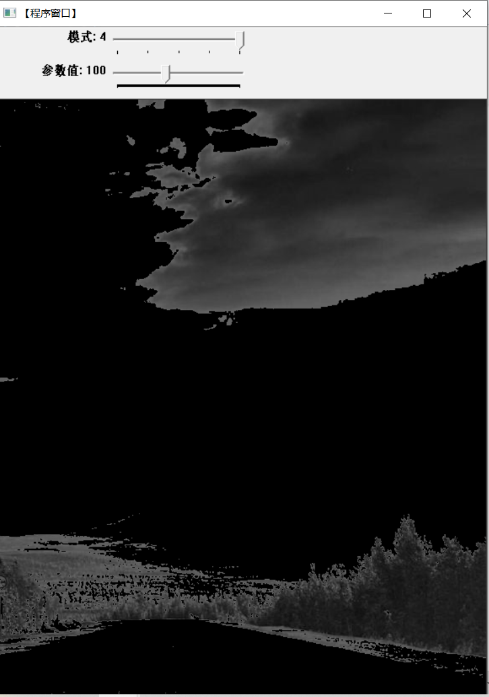
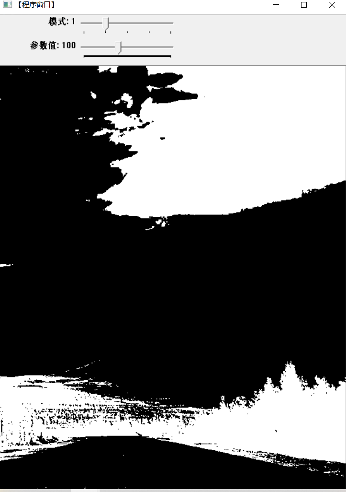

## 第七章图像变换
### 1.边缘检测
一般步骤：滤波、增强、检测
- canny算子
低错误率：标识出尽可能多的实际边缘，同时尽可能地减少噪声产生的误报。
高定位性：标识出的边缘要与图像中的实际边缘尽可能接近
最小响应：图像中的边缘只能标识一次，并且可能存在的图像噪声不应标识为边缘
1）消除噪声
高斯平滑滤波卷积降噪
2）计算梯度幅值和方向
3）非极大值抑制
排除非边缘像素，仅仅保留一些细线条
4）滞后阈值
若某一像素位置的幅值超过高阈值，该像素被保留为边缘像素
若某一像素位置的幅值小于低阈值，该像素被排除
若某一像素位置的幅值在两个阈值之间，该像素仅仅在连接一个高于高阈值的像素时被保留
canny边缘检测实例
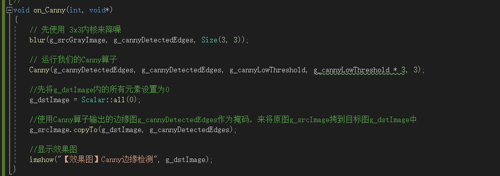
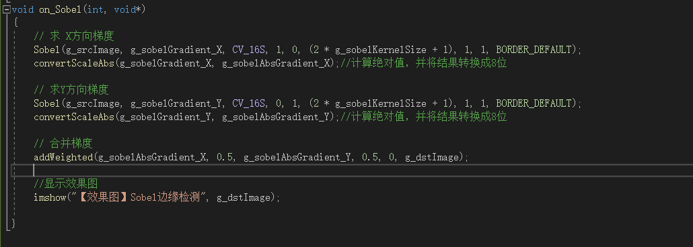

运行结果：

### 2.霍夫变换
霍夫变换(Hough Transform)是图像处理中的一种特征提取技术，该过程在一个参数空间中通过计算累计结果的局部最大值得到一个符合该特定形状的集合作为霍夫变换结果。

霍夫变换于1962年由PaulHough首次提出，最初的Hough变换是设计用来检测直线和曲线，起初的方法要求知道物体边界线的解析方程，但不需要有关区域位置的先验知识。这种方法的一个突出优点是分割结果的Robustness,即对数据的不完全或噪声不是非常敏感。然而，要获得描述边界的解析表达常常是不可能的。　后于1972年由Richard Duda & Peter Hart推广使用，经典霍夫变换用来检测图像中的直线，后来霍夫变换扩展到任意形状物体的识别，多为圆和椭圆。霍夫变换运用两个坐标空间之间的变换将在一个空间中具有相同形状的曲线或直线映射到另一个坐标空间的一个点上形成峰值，从而把检测任意形状的问题转化为统计峰值问题。
HoughLines( )函数
此函数可以找出采用标准霍夫变换的二值图像线条。在OpenCV中，我们可以用其来调用标准霍夫变换SHT和多尺度霍夫变换MSHT的OpenCV内建算法。
```
void HoughLines(InputArray image, OutputArray lines, double rho, double theta, int threshold, double srn=0, double stn=0 )  
```
HoughLinesP( )函数
此函数在HoughLines的基础上末尾加了一个代表Probabilistic（概率）的P，表明它可以采用累计概率霍夫变换（PPHT）来找出二值图像中的直线。
```
 void HoughLinesP(InputArray image, OutputArray lines, double rho, double theta, int threshold, double minLineLength=0, double maxLineGap=0 )  
```
霍夫圆变换
霍夫圆变换的基本原理和上面讲的霍夫线变化大体上是很类似的，只是点对应的二维极径极角空间被三维的圆心点x, y还有半径r空间取代。说“大体上类似”的原因是，如果完全用相同的方法的话，累加平面会被三维的累加容器所代替：在这三维中，一维是x，一维是y，另外一维是圆的半径r。这就意味着需要大量的内存而且执行效率会很低，速度会很慢。

综合示例：霍夫变换
代码：
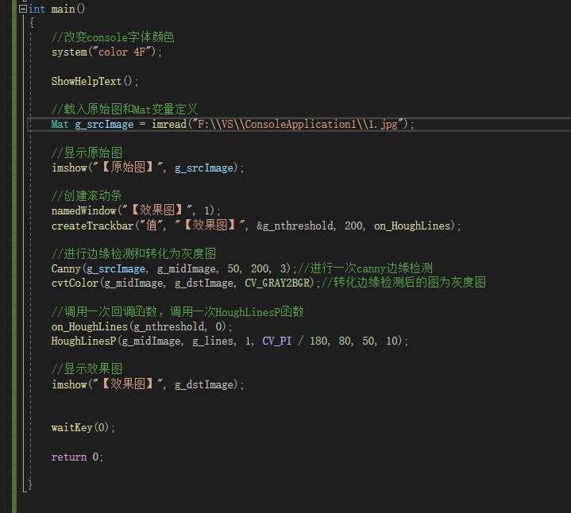
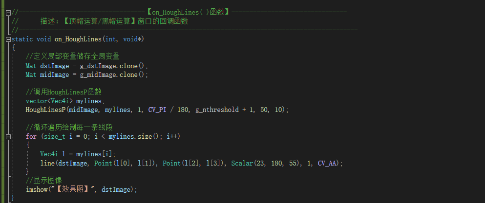
运行结果：
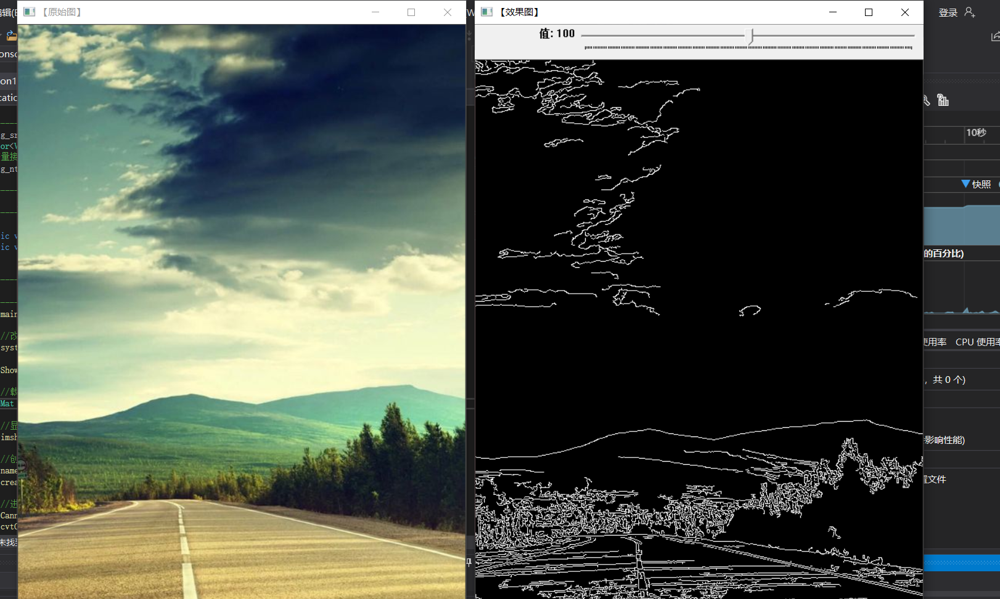

### 3.重映射
概念
重映射就是把一副图像中某位置的像素放置到另一个图片指定位置的过程，为了完成映射过程，需要获得一些插值为非整数像素的坐标。
$g(x,y)=f(h(x,y))$
- g() 是目标图像
- f()是源图像
- h(x,y)是作用于 (x,y)的映射方法函数
实现重映射：remap()函数
公式为：
$dst(x,y)=src(mapx(x,y),mapy(x,y))$
综合示例：
实现多重重映射
代码：
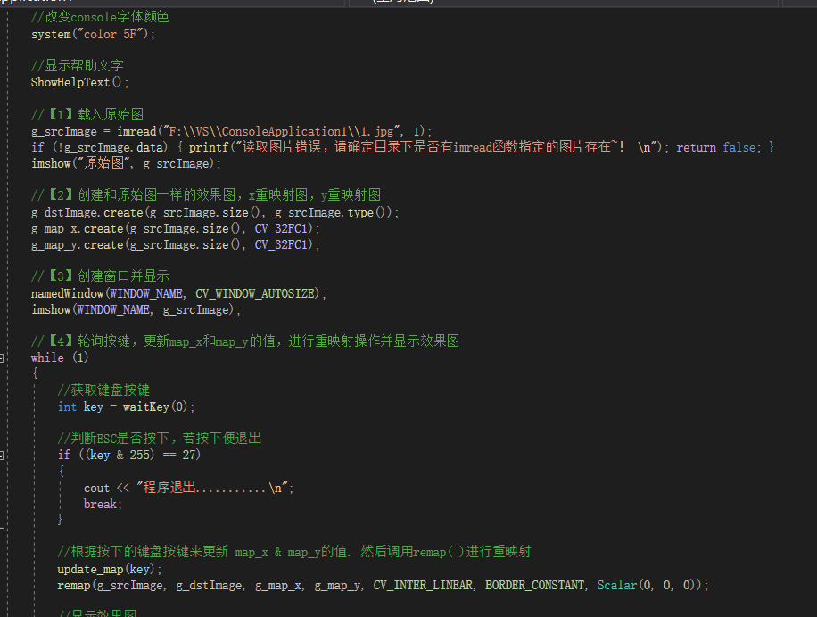
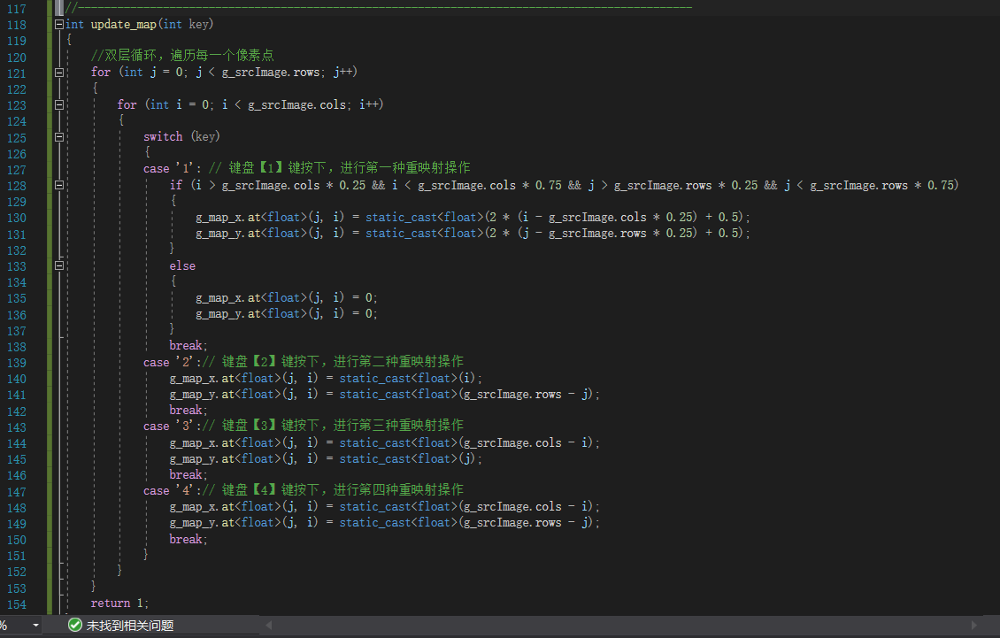
运行结果：
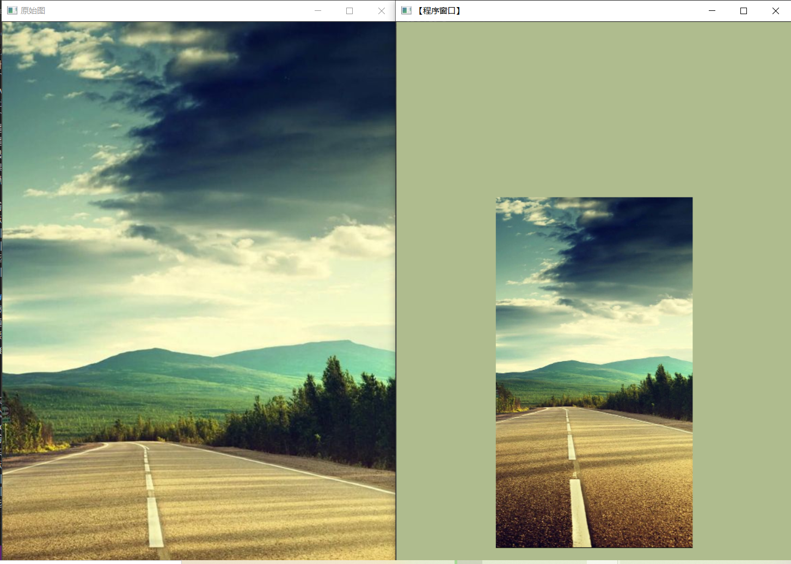
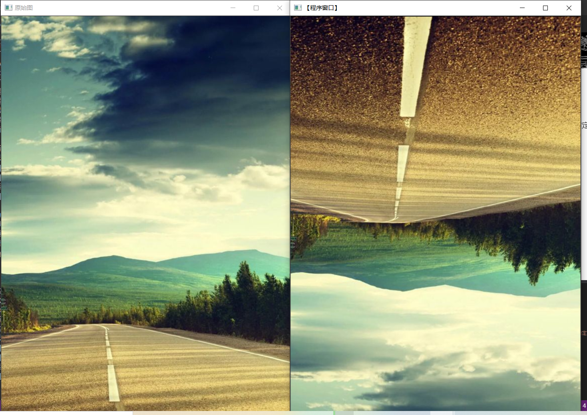
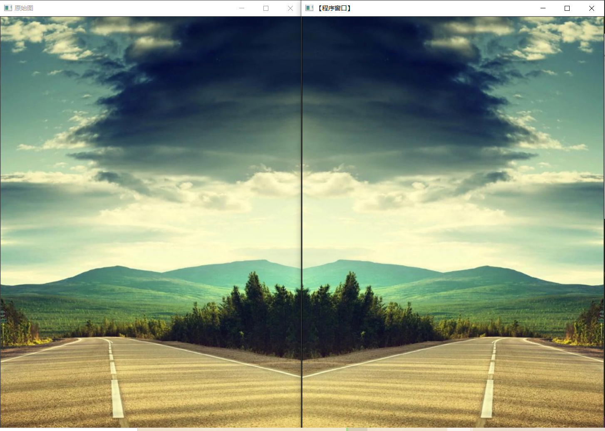
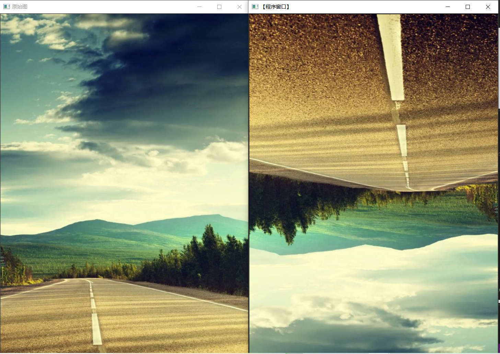

### 4.仿射变换
图像的几何变换——拉伸、收缩、扭曲、旋转（stretch，shrink，distortion，rotation）
拉伸、收缩、扭曲、旋转是图像的几何变换，在三维视觉技术中大量应用到这些变换，又分为仿射变换和透视变换。仿射变换通常用单应性（homography）建模，利用cvWarpAffine解决稠密仿射变换，用cvTransform解决稀疏仿射变换。仿射变换可以将矩形转换成平行四边形，它可以将矩形的边压扁但必须保持边是平行的，也可以将矩形旋转或者按比例变化。透视变换提供了更大的灵活性，一个透视变换可以将矩阵转变成梯形。当然，平行四边形也是梯形，所以仿射变换是透视变换的子集。

仿射变换（Affine Transformation或 Affine Map），又称仿射映射，是指在几何中，一个向量空间进行一次线性变换并接上一个平移，变换为另一个向量空间的过程。它保持了二维图形的“平直性”（即：直线经过变换之后依然是直线）和“平行性”（即：二维图形之间的相对位置关系保持不变，平行线依然是平行线，且直线上点的位置顺序不变）。

一个任意的仿射变换都能表示为乘以一个矩阵(线性变换)接着再加上一个向量(平移)的形式。

那么, 我们能够用仿射变换来表示如下三种常见的变换形式：

- 旋转，rotation (线性变换)
- 平移，translation(向量加)
- 缩放，scale(线性变换)
warpAffine()函数
getRotationMatrix2D()函数
示例程序：仿射变换
代码：
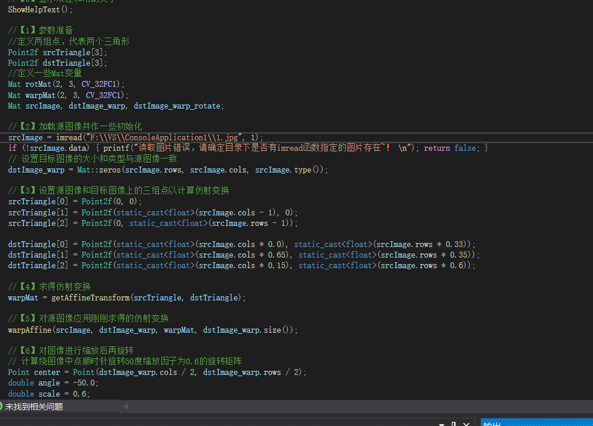
运行结果：
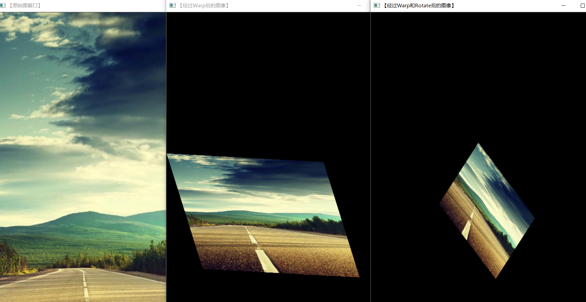
### 5.直方图均衡化
直方图就是对数据进行统计，将统计值组织到一系列事先定义好的bin(直方图中的柱子)中。bin中的数值是从数据中计算出的特征的统计量，这些数据可以是诸如梯度、方向、色彩或任何其他特征。无论如何，直方图获得的是数据分布的统计图。

灰度图像的直方图的性质：
(1) 直方图是一幅图像中各像素灰度出现频次的统计结果，它只反映图像中不同灰度值出现的次数，而没反映某一灰度所在的位置。也就是说，它只包含了该图像的某一灰度像素出现的概率，而丢失了其所在的位置信息。
(2) 任一幅图像，都有惟一确定一幅与它对应的直方图，但不同的图像可能有相同的直方图。即图像与直方图之间是多对一的映射关系。
(3) 由于直方图是对具有相同灰度值的像素统计得到的，因此，一幅图像各子区的直方图之和就等于该图像全图的直方图。
示例程序：直方图均衡化
代码：
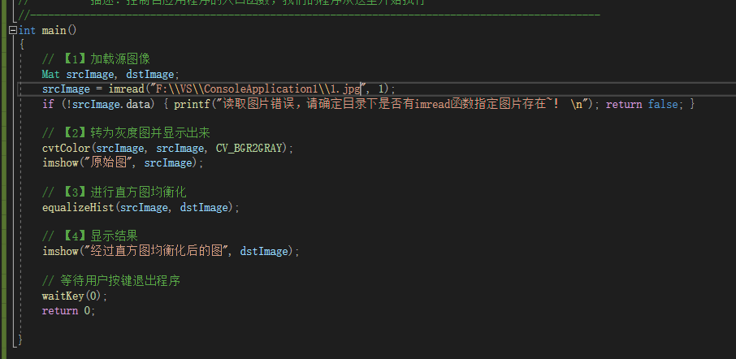
运行结果：
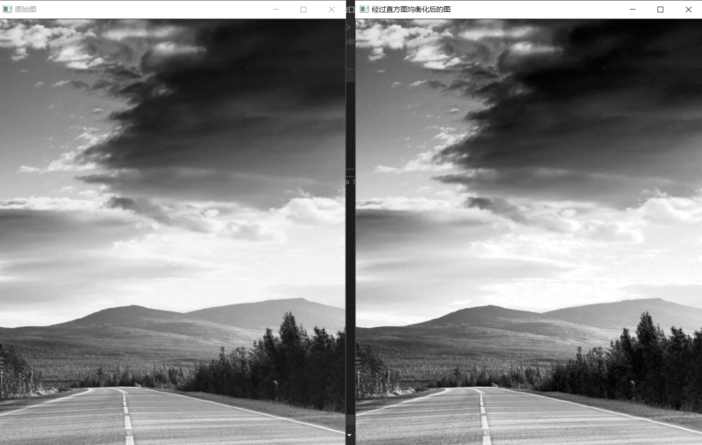


## 第八章图像轮廓与图像分割修复
### 1.查找并绘制轮廓
图像处理中的边缘检测是根据像素间的差异检测出轮廓边缘的像素，但它没有将轮廓作为一个整体。将这些轮廓边缘像素组装成一个整体（轮廓），就要进行轮廓检测
寻找轮廓:findcontours()函数
绘制轮廓:drawcontours()函数
示例程序：轮廓查找
代码实现：
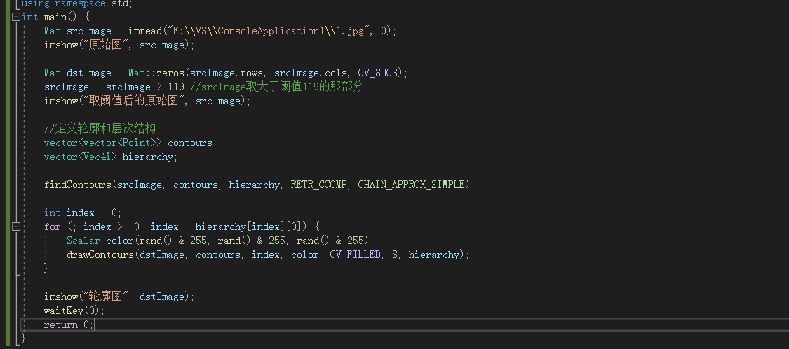
运行结果：
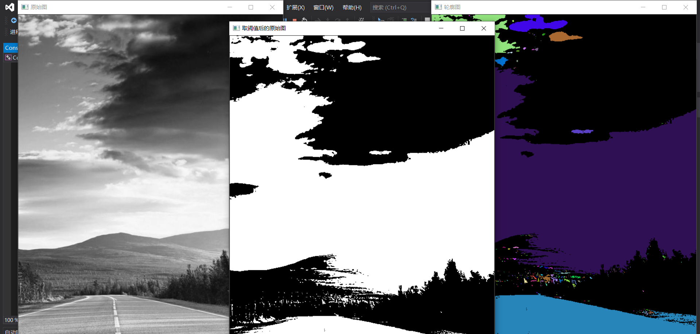

综合示例：查找并绘制轮廓
代码:
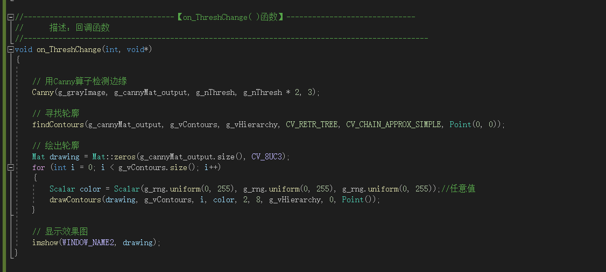
运行结果：
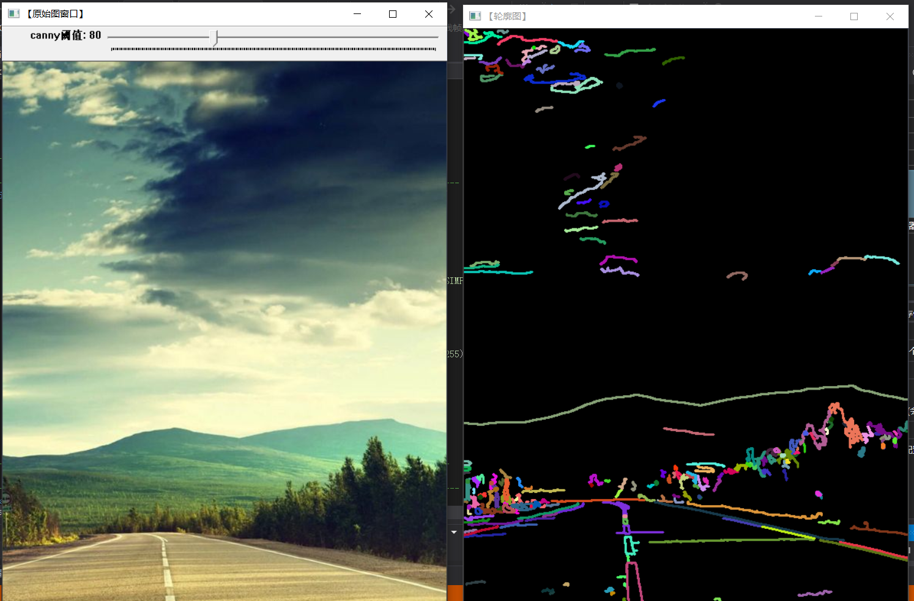
### 2.寻找物体的凸包
凸包（Convex Hull）是一个计算几何（图形学）中常见的概念。即给定二维平面上的点集，凸包就是将最外层的点连接起来构成的凸多边形，它能包含点集中所有的点。
寻找凸包：convexHull()函数
```
void convexHull(
InputArray points,
OutputArray hull,
bool clockwise=fasle,
bool returnPoints=true) ;
```
寻找和绘制物品的凸包
代码：
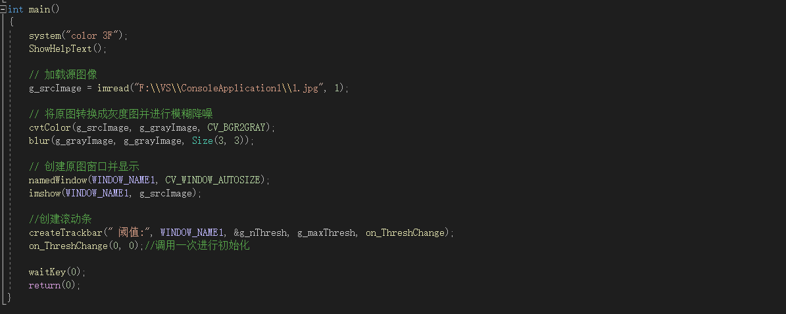
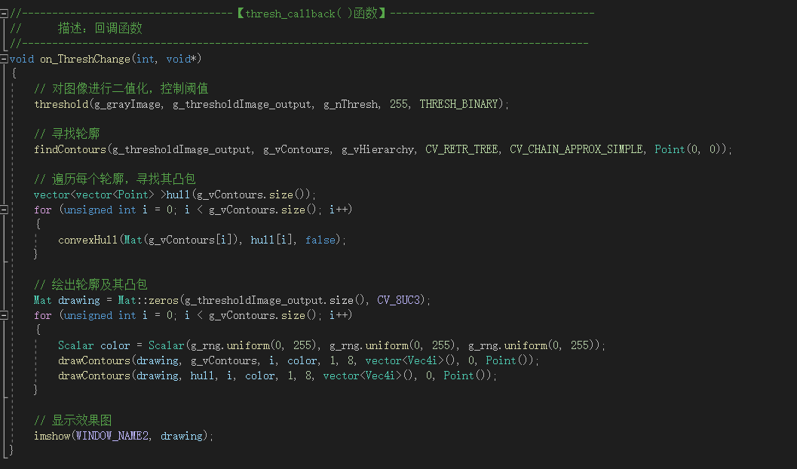
运行结果：
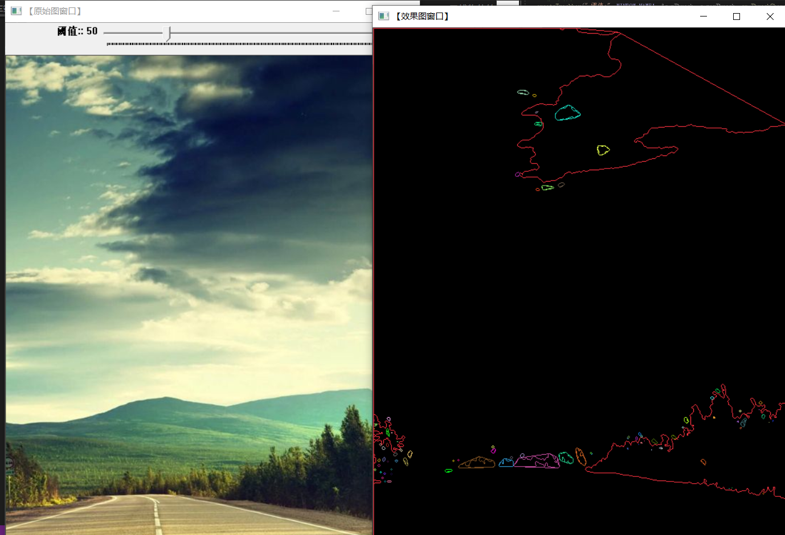

### 3.使用多边形将轮廓包围
使用多边形将轮廓包围
1.返回外部矩形边界：boundingRect（）函数
```
Rect boundingRect(InputArray points)
```
2.寻找最小包围矩阵：minAreaRect（）函数
```
RotatedRect minAreaRect (InputArray points)
```
3.寻找最小包围圆形：minEnclosingCircle（）函数
```
void minEnclosingCircle(InputArray points, Point2f& center, float& radius)
```
4.用椭圆拟合二维点集：fitEllipse（）函数
```
RotatedRect fitEllipse(InputArray points)
```
5.逼近多边形曲线：approxPolyDP（）函数
```
void approxPolyDP(InputArray curve,
OutputArray approxCurve,
double epsilon,
bool closed)
```
创建包围轮廓的矩形边界
代码：
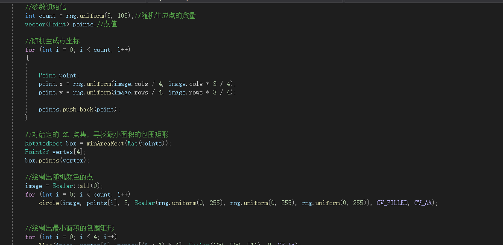
运行结果：
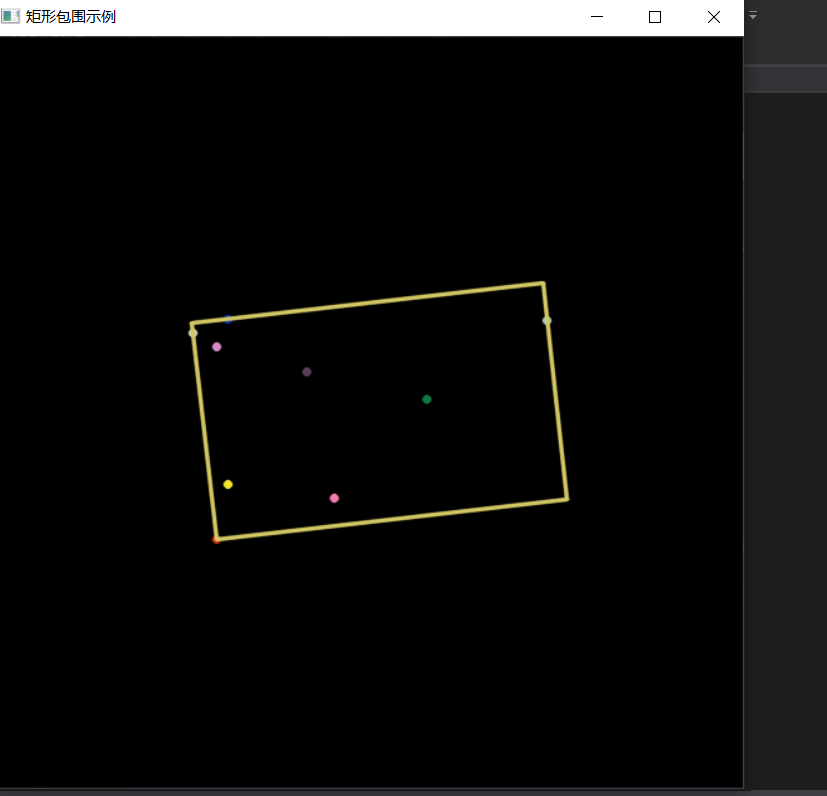

创建包围轮廓的圆形边界
代码：

运行结果：
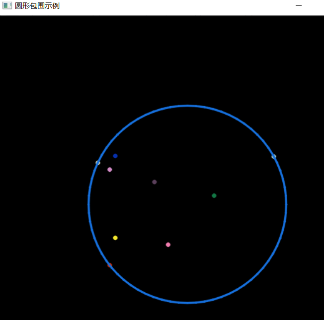

使用多边形包围轮廓
代码：

运行结果：


### 4.图像的矩
矩函数在图像分析中有广泛的应用，如模式识别、目标分类、目标识别与方位估计、图像编码与重构等。一个从一幅数字图形中计算出来的矩集，通常描述了该图像形状的全局特征，并提供了大量的关于该图像不同类型的几何特性信息，比如大小、位置、方向及形状等。

矩的计算: moment()函数
moment函数用于计算多边形和光栅形状的最高达三阶的所有矩。矩用来计算形状的重心、面积，主轴和其它形状特征。
Moments moments(InputArray array, bool binaryImage=false)
计算轮廓面积: contourArea()函数
contourArea()函数用于计算整个轮廓或部分轮廓的面积。
double contourArea(InputArray contour, bool oriented=false)
计算轮廓长度：arcLength()函数
arcLength()函数用于计算封闭轮廓的周长或曲线的长度。
double arcLength(InputArray curve, bool closed)

综合示例：查找和绘制图像轮廓矩
代码：


运行结果：


### 5.分水岭算法
把图像比喻成一个平面，图像灰度值高的区域被看作山峰，灰度值低的地方被看作山谷，不同区域的山谷我们可以用不同颜色来标记，但是随着标记区域不断扩大，会出现一种现象：不同山谷的交汇处区域会出现颜色错乱现象，为了防止这一现象的出现，要做的就是把高峰变得更高(改变灰度值)，然后再用颜色标记，如此反复最后完成所所有山谷的颜色分割，以上就是 涉及分水岭算法基本原理
根据图像相邻的像素插值，分成不同区域；分水岭算法就是将不同区域染成不同颜色；分水岭分割算法最大的特征就是 区域的封闭性；
实现分水岭算法：watershed()函数
综合示例：分水岭算法
代码：


运行结果：


### 6.图像修补
图像常常会被噪声腐蚀，这些噪声或是镜头上的灰尘或水滴，或是旧照片的划痕，或者是图像遭到人为的涂画（比如马赛克）或者图像的部分本身已经损坏。opencv可以进行图像修复，利用那些已经被破坏的区域的边缘， 即边缘的颜色和结构，根据这些图像留下的信息去推断被破坏的信息区的信息内容，然后对破坏区进行填补 ，以达到图像修补的目的。
OpenCV中就是利用inpaint()这个函数来实现修复功能的。
void inpaint( InputArray src, InputArray inpaintMask,
OutputArray dst, double inpaintRadius, int flags );
第一个参数src，输入的单通道或三通道图像；
第二个参数inpaintMask，图像的掩码，单通道图像，大小跟原图像一致，inpaintMask图像上除了需要修复的部分之外其他部分的像素值全部为0；
第三个参数dst，输出的经过修复的图像；
第四个参数inpaintRadius，修复算法取的邻域半径，用于计算当前像素点的差值；
第五个参数flags，修复算法，有两种：INPAINT_NS 和I NPAINT_TELEA；
函数实现关键是图像掩码的确定，可以通过阈值筛选或者手工选定，按照这个思路，用三种方法生成掩码，对比图像修复的效果。
综合示例：图像修补
代码：


运行结果：


## 第九章直方图与匹配
### 1.图像直方图概述
直方图可以用来描述不同的参数和事物,如物体的色彩分布,物体的边缘梯度模版以及目标位置的当前假设的概率分布.

直方图就是对数据进行统计的一种方法,并且将统计值定义到一系列定义好的bin(组距)中,获得一张数据分布的统计图.其数值是从数据中计算出的特征统计量，这些数据可以是诸如梯度、方向、色彩或任何其他特征。且无论如何，直方图获得的是数据分布的统计图。

在统计学中，直方图(Histogram)是一种对数据分布情况的图形表示，是一种二维统计图表，它的两个坐标分别是统计样本和该样本对应的某个属性的度量。图像直方图是用一表示数字图像中亮度分布的直方图，标绘了图像中每个亮度值的像素数。可以借助观察该直方图了解需要如何调整亮度分布的直方图。这种直方图中，横坐标的左侧为纯黑、较暗的区域，而右侧为较亮、纯白的区域。因此，一张较暗图片的图像直方图中的数据多集中于左侧和中间部分，而整体明亮、只有少量阴影的图像则相反。计算机视觉邻域常借助图像直方图来实现图像的二值化。

### 2.直方图的计算与绘制
- 计算直方图：calcHist()函数用于计算一个或多个阵列的直方图
- 寻找最值：minMaxLoc()函数在数组中找到全局最小值和最大值

绘制H-S直方图
代码实现：


运行结果：


绘制图像一维直方图
代码实现：


运行结果：


绘制RGB三色直方图
代码实现：


运行结果：


### 3.直方图对比
- 对比
  要对两个直方图进行比较，首先必须选择一个衡量直方图相似度的对比标准。我们用compareHist()函数来对比两个直方图的相似度，函数的返回值就是d(H1,H2)
- 对比直方图：compareHist()函数
```
double compareHist(InputArray H1,InputArray H2,int method)
double compareHist(const SparseMat& H1,const SparseMat & H2,int method)
```
示例程序：直方图对比
代码实现：


运行结果：


### 4.反向投影
反向投影用于在输入图像（通常较大）中查找特定图像（通常较小，以下将其称为模板图像）最匹配的点或者区域，也就是定位模板图像出现在输入图像的位置。

反向投影工作原理：查找的方式就是不断的在输入图像中切割跟模板图像大小一致的图像块，并用直方图对比的方式与模板图像进行比较
结果：包含了以每个输入图像像素为起点的直方图对比结果
综合程序:反向投影
代码实现:


运行结果：


### 5.模板匹配
模板匹配是一种用于在源图像S中寻找定位给定目标图像T（即模板图像）的技术。其原理很简单，就是通过一些相似度准则来衡量两个图像块之间的相似度Similarity(S,T)。
方法：
模板匹配中，源图像和模板图像可以是二值图像、灰度图像、彩色图像。

模板匹配方法的优缺点：
优点：简单、直接
缺点：不具有旋转不变性、不具有尺度不变性
综合示例：模板匹配：
代码：

运行结果：

## 学习总结：
Canny算子求边缘点具体算法步骤如下：
1. 用高斯滤波器平滑图像．
2. 用一阶偏导有限差分计算梯度幅值和方向.
3. 对梯度幅值进行非极大值抑制.
4. 用双阈值算法检测和连接边缘．
5. 
开运算总结：
（１）开运算能够除去孤立的小点，毛刺和小桥，而总的位置和形状不便。
（２）开运算是一个基于几何运算的滤波器。
（３）结构元素大小的不同将导致滤波效果的不同。
（４）不同的结构元素的选择导致了不同的分割，即提取出不同的特征。

闭运算总结：
（1）闭运算能够填平小湖（即小孔），弥合小裂缝，而总的位置和形状不变。
（2）闭运算是通过填充图像的凹角来滤波图像的。
（3）结构元素大小的不同将导致滤波效果的不同。
（4）不同结构元素的选择导致了不同的分割。


霍夫梯度法的缺点
- 在霍夫梯度法中，我们使用Sobel导数来计算局部梯度，那么随之而来的假设是，其可以视作等同于一条局部切线，并这个不是一个数值稳定的做法。在大多数情况下，这样做会得到正确的结果，但或许会在输出中产生一些噪声。
- 在边缘图像中的整个非0像素集被看做每个中心的候选部分。因此，如果把累加器的阈值设置偏低，算法将要消耗比较长的时间。第三，因为每一个中心只选择一个圆，如果有同心圆，就只能选择其中的一个。
- 因为中心是按照其关联的累加器值的升序排列的，并且如果新的中心过于接近之前已经接受的中心的话，就不会被保留下来。且当有许多同心圆或者是近似的同心圆时，霍夫梯度法的倾向是保留最大的一个圆。可以说这是一种比较极端的做法，因为在这里默认Sobel导数会产生噪声，若是对于无穷分辨率的平滑图像而言的话，这才是必须的。

霍夫梯度法的原理
【1】首先对图像应用边缘检测，比如用canny边缘检测。
【2】然后，对边缘图像中的每一个非零点，考虑其局部梯度，即用Sobel（）函数计算x和y方向的Sobel一阶导数得到梯度。
【3】利用得到的梯度，由斜率指定的直线上的每一个点都在累加器中被累加，这里的斜率是从一个指定的最小值到指定的最大值的距离。
【4】同时，标记边缘图像中每一个非0像素的位置。
【5】然后从二维累加器中这些点中选择候选的中心，这些中心都大于给定阈值并且大于其所有近邻。这些候选的中心按照累加值降序排列，以便于最支持像素的中心首先出现。
【6】接下来对每一个中心，考虑所有的非0像素。
【7】这些像素按照其与中心的距离排序。从到最大半径的最小距离算起，选择非0像素最支持的一条半径。8.如果一个中心收到边缘图像非0像素最充分的支持，并且到前期被选择的中心有足够的距离，那么它就会被保留下来。

仿射变换表示的就是两幅图片之间的一种联系 . 关于这种联系的信息大致可从以下两种场景获得:
【1】已知 X和T，而且我们知道他们是有联系的. 接下来我们的工作就是求出矩阵 M
【2】已知 M和X，要想求得 T. 我们只要应用算式$T=M*X$即可. 对于这种联系的信息可以用矩阵 M 清晰的表达 (即给出明确的2×3矩阵) 或者也可以用两幅图片点之间几何关系来表达。


## 心得体会：
1. 直方图是图像中像素强度分布的图形表达方式。
2. 直方图统计了每一个强度值所具有的像素个数。

直方图均衡化是通过拉伸像素强度分布范围来增强图像对比度的一种方法.
说得更清楚一些, 以上面的直方图为例, 你可以看到像素主要集中在中间的一些强度值上. 直方图均衡化要做的就是拉伸这个范围

直方图均衡化处理的中心思想是把原始图像的灰度直方图从比较集中的某个灰度区间变成在全部灰度范围内的均匀分布。

在对各种图形进行处理操作的过程中，我们常常需要对图像中的像素做出取舍与决策，直接剔除一些低于或者高于一定值的像素。

阈值可以被视作最简单的图像分割的方法。比如，从一幅图像中利用阈值分割出我们需要的物体部分，这样的图像分割方法基于图像中物体与北京之间的灰度差异，而且此分割属于像素级的分割。为了从一副图像中提取出我们需要的部分，应该用图像中的每一个像素点的灰度值与选取的阈值相比较，并作出相应的判断。

对于我们的阈值化，我们主要是有两种方法，一种是固定阈值操作Threshold，一种是自适应阈值操作adaptiveThreshold，对于固定阈值操作

第六章学习图像处理方法属于线型滤波的方框、均值、高斯滤波，属于非线型滤波的中值、双边滤波。及各种形态学操作和水漫填充算法、图像金字塔、图像缩放、阈值化。掌握了基本的处理图像的方法，为第七章学习图像变换奠定了基础。

第七章学习了很多种图像变换方法，其中就包括进行边缘检测所用到的canny算子、sobel算子、Laplace算子以及scharr滤波器。
同时学习到了如何利用霍夫变换、重映射、放射变换以及直方图均衡化进行图像特征提取


第八章主要学习了查找并绘制轮廓，寻找物体的凸包，使用多边形来包围轮廓，以及学习计算一个图像的矩，最后学习图像分水岭算法和图像修补操作。
图像修补的工作不只能用PS或者美图秀秀那些软件去做，其实由程序员自己写代码去做更加高效，利用那些已经被破坏的区域的边缘， 即边缘的颜色和结构，根据这些图像留下的信息去推断被破坏的信息区的信息内容，然后对破坏区进行填补 ，以达到图像修补的目的。可在OpenCV中利inpaint()这个函数来实现修复功能。


第九章学习了计算机视觉运用中的直方图，并讲解了反向投影和模板匹配，学习了如何绘制计算某一特征的直方图模型，和使用模型寻找图像中存在的特征的方法。讲解了如何在一图像中寻找与另一图像最匹配的部分。

$vector<Point> points$未声明的标识符
加上了命名空间 :using namespace std;


CV_BGR2GRAY未声明的标识符的解决办法
加上引用即可
```
#include <opencv2\imgproc\types_c.h> 
#include <opencv2/highgui/highgui_c.h>
```
CV_FILLED未识别解决方法
增加头文件
```
#include <opencv2/imgproc/imgproc_c.h>
```
$ 解决opencv3运行opencv2代码时报错的修改备忘录 $
(1)直接去掉"CV_"前缀
namedWindow函数，将cv_WINDOW_AUTOSIZE改为WINDOW_AUTOSIZE
line函数及其同一类的绘图函数，cv_filed改为filled
threshold函数，cv_thresh_binary改为thresh_binary
remap函数，cv_inter_linear改为inter_linear
鼠标操作函数setmousecallback，将cv_event_lbuttonup改为event_lbuttonup，其他类似。
imwrite写图片函数，将cv_inpaint_telea改为inpaint_telea，cv_inpaint_ns改为inpaint_ns
设置摄像头尺寸时将cv_cap_prop_frame_width改为cap_prop_frame_width，cv_cap_prop_frame_height 改为 cap_prop_frame_height
..等等一些函数可以直接将"cv_"前缀去除。

(2)需要新的前缀
line函数中一些绘函数中的参数，cv_AA改为LINE_AA
cvtColor函数中颜色转换系的宏，全替换为"COLOR_"前缀，如CV_BGR2HSV改为COLOR_BGR2HSV
normalize函数，将cv_MINMAX改为NORM_MINMAX 等等
(3)其他
定义尺寸时将cvSize(-1,-1)改为Size(-1,-1)
在表示颜色时，将cv_RGB改为Scalar。
设置视频格式的fourcc，cv2.x版本中中形式为cv2.cv.fourcc，在cv3,0以上的版本中应为cv2.VideoWriter_fourcc，需要特别注意。